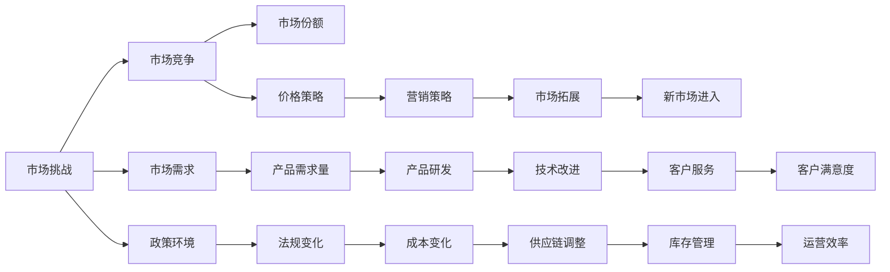
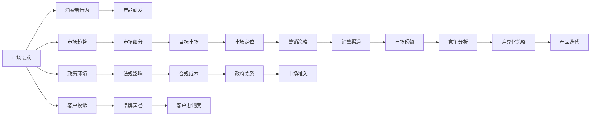

                 

# 市场挑战：创业者的试金石

## 1. 背景介绍

市场挑战始终是创业者们面临的核心难题之一，它既是压力的源泉，也是成就事业的动力。市场挑战往往源自于市场需求、竞争环境、政策变化等多方面因素，能深刻影响公司的战略制定和业务发展。本文将深入探讨市场挑战的性质、识别方式和应对策略，帮助创业者们洞察市场变化，掌握竞争优势。

## 2. 核心概念与联系

### 2.1 核心概念概述

市场挑战是企业运营过程中无法避免的“试金石”，能够显著考验企业的应变能力和市场竞争力。识别和应对市场挑战，对于企业的长远发展至关重要。以下将介绍几个核心概念及其之间的联系。

1. **市场挑战**：指在市场经营过程中，企业所面临的超出正常预期、影响公司战略和运营的外部压力。
2. **市场竞争**：指在相同或类似产品或服务市场中，企业间争夺市场份额的博弈。
3. **市场需求**：指消费者或企业对于某种产品或服务的需求，反映了市场趋势和消费者偏好。
4. **政策环境**：指影响企业运营的法律、政策、规章等外部因素，如税收、环保、国际贸易等。

这些概念的联系可以通过以下Mermaid流程图来展示：



这个流程图展示了市场挑战如何通过多个维度和环节影响企业运营的各个方面，从而映射到企业的市场竞争力和发展方向。

### 2.2 核心概念原理和架构的 Mermaid 流程图



上述流程图展示了市场挑战和应对策略如何在企业运营中循环互动，帮助企业不断调整和优化其市场策略，确保在变化多端的市场环境中取得优势。

## 3. 核心算法原理 & 具体操作步骤

### 3.1 算法原理概述

市场挑战的识别和应对，本质上是一个动态的、多因素综合的决策过程。这一过程可以通过算法原理来指导和优化。

1. **市场监控算法**：用于实时监测市场需求和竞争环境的变化，及时发现潜在的市场挑战。
2. **竞争分析算法**：通过对竞争对手的产品、定价、市场策略等进行分析，识别自身面临的竞争威胁。
3. **需求预测算法**：基于历史数据和市场趋势，预测未来市场需求的变化，帮助企业提前应对市场波动。
4. **策略优化算法**：结合市场需求和竞争环境，优化企业的产品、定价、渠道等策略，提升市场竞争力。

这些算法相互配合，可以形成一套完整的市场挑战应对系统，帮助企业从容应对复杂多变的外部环境。

### 3.2 算法步骤详解

市场挑战的应对步骤如下：

1. **数据收集**：收集市场数据、竞争对手信息、消费者行为数据等，为后续分析和决策提供基础。
2. **需求预测**：使用历史数据和市场趋势，预测未来市场需求，识别增长或衰退的趋势。
3. **竞争分析**：分析竞争对手的市场份额、产品特性、价格策略、市场策略等，识别自身面临的竞争压力。
4. **市场挑战识别**：结合需求预测和竞争分析结果，识别潜在的市场挑战，如需求波动、竞争加剧、法规变化等。
5. **策略优化**：根据市场挑战的特点，制定相应的应对策略，如产品迭代、市场拓展、价格调整等。
6. **效果评估**：实施策略后，通过市场监控和反馈，评估策略的效果，不断迭代优化。

### 3.3 算法优缺点

市场挑战应对算法具有以下优点：

1. **数据驱动**：利用数据驱动的预测和分析，科学地识别市场挑战。
2. **策略灵活**：根据市场变化灵活调整策略，适应不同的市场环境。
3. **多维评估**：综合考虑需求、竞争、法规等多方面因素，提供全面的市场洞察。

然而，这些算法也存在以下缺点：

1. **数据质量依赖**：算法的效果高度依赖于数据的质量和完整性，数据偏差可能导致错误的决策。
2. **预测准确性**：市场和竞争环境的复杂性增加了预测的难度，导致预测结果可能不准确。
3. **执行难度**：复杂的策略优化需要企业具备较强的执行能力，否则策略效果可能打折扣。

### 3.4 算法应用领域

市场挑战应对算法广泛应用于多个领域，如：

1. **电商行业**：实时监控和预测市场需求，优化库存管理和产品定价。
2. **金融行业**：分析市场波动和风险，制定风险管理策略。
3. **制造业**：预测市场需求和原材料价格，优化供应链和生产计划。
4. **服务业**：识别客户需求变化，调整服务内容和质量。
5. **农业**：预测市场需求，调整种植计划和产品结构。

## 4. 数学模型和公式 & 详细讲解 & 举例说明

### 4.1 数学模型构建

市场挑战应对算法可以构建多个数学模型，以下是一个基于时间序列的需求预测模型：

$$
Y_t = \alpha + \beta X_t + \gamma Y_{t-1} + \epsilon_t
$$

其中：
- $Y_t$：第$t$时期的需求量
- $X_t$：第$t$时期的市场影响因素（如季节性因素、促销活动等）
- $\alpha$：模型截距
- $\beta$：影响因素的系数
- $\gamma$：历史需求的权重
- $\epsilon_t$：误差项

### 4.2 公式推导过程

假设市场影响因素 $X_t$ 服从随机变量 $N(0, \sigma^2)$，则上式可以进一步推导为：

$$
Y_t = \alpha + \beta X_t + \gamma Y_{t-1} + \epsilon_t
$$

$$
\epsilon_t = \sigma \zeta_t
$$

其中 $\zeta_t$ 服从标准正态分布 $N(0,1)$。利用迭代算法，可以对未来市场需求进行预测。

### 4.3 案例分析与讲解

例如，一个电商公司利用上述模型对新季度市场需求进行预测，假设已获取如下历史数据：

| 时间段 | 市场影响因素（$X_t$） | 历史需求量（$Y_{t-1}$） | 实际需求量（$Y_t$） |
| ------ | --------------------- | ---------------------- | ------------------ |

通过求解模型参数，可以进行未来需求量的预测。

## 5. 项目实践：代码实例和详细解释说明

### 5.1 开发环境搭建

开发环境搭建一般包括以下步骤：

1. 安装Python：选择合适的Python版本，并确保环境变量配置正确。
2. 安装必要的库：如pandas、numpy、scikit-learn、statsmodels等。
3. 配置开发工具：如Jupyter Notebook、PyCharm等。
4. 设置数据源：确保数据能够顺利读取和处理。

### 5.2 源代码详细实现

以下是一个基于时间序列的需求预测模型的Python代码实现：

```python
import pandas as pd
import numpy as np
import statsmodels.api as sm

def time_series_forecast(train_data, test_data, order=3):
    # 将数据转化为时间序列
    train = train_data.dropna()
    test = test_data.dropna()

    # 构造时间序列模型
    X = sm.tsa.ARIMA(train['demand'], order=order).fit()

    # 预测未来需求量
    forecast = X.forecast(steps=len(test))
    actual = test['demand']
    
    return forecast, actual

# 读取数据
train_df = pd.read_csv('train.csv')
test_df = pd.read_csv('test.csv')

# 构造时间序列模型并进行预测
forecast, actual = time_series_forecast(train_df, test_df)

# 绘制预测和实际需求量对比图
import matplotlib.pyplot as plt
plt.plot(test_df.index, actual, label='Actual')
plt.plot(test_df.index, forecast, label='Forecast')
plt.legend()
plt.show()
```

### 5.3 代码解读与分析

上述代码实现了基于时间序列的ARIMA模型进行需求预测，关键步骤包括：

1. 数据预处理：去除缺失值，确保数据完整性。
2. 模型构建：使用statsmodels库中的ARIMA模型进行参数拟合。
3. 预测与评估：利用模型进行未来需求量的预测，并对比实际数据进行评估。
4. 可视化分析：通过图表展示预测结果和实际需求量，直观分析模型效果。

## 6. 实际应用场景

### 6.1 电商行业

电商行业市场变化迅速，需求波动明显。通过市场挑战应对算法，电商公司可以及时调整库存和定价策略，减少库存积压和滞销风险。例如，利用预测模型识别到某类产品需求骤增，及时增加备货和促销活动，提升销售额和客户满意度。

### 6.2 金融行业

金融行业受宏观经济和政策变化影响较大，市场风险难以预测。通过市场挑战应对算法，金融机构可以及时识别市场波动和潜在风险，调整资产配置和风险管理策略，减少损失。例如，利用风险预测模型评估股票市场波动，及时调整投资组合，避免市场波动带来的损失。

### 6.3 制造业

制造业需要预测市场需求和原材料价格，以优化生产计划和供应链管理。通过市场挑战应对算法，制造商可以及时调整生产节奏和库存管理，减少资源浪费和成本压力。例如，利用预测模型识别原材料价格波动，及时调整采购策略，避免原材料价格暴涨带来的成本压力。

### 6.4 服务业

服务业依赖于客户需求和市场变化，客户满意度直接影响业务增长。通过市场挑战应对算法，服务企业可以及时识别客户需求变化，调整服务内容和质量，提升客户满意度和忠诚度。例如，利用客户需求预测模型，预测客户偏好变化，及时调整服务内容和质量，提升客户满意度。

### 6.5 农业

农业市场受自然环境影响较大，需求变化难以预测。通过市场挑战应对算法，农业公司可以及时调整种植计划和产品结构，减少自然灾害带来的损失。例如，利用预测模型识别到某类农产品需求增加，及时调整种植计划，增加产量和收益。

## 7. 工具和资源推荐

### 7.1 学习资源推荐

1. **《Python数据分析与可视化》**：讲解如何使用Python进行数据处理和可视化，是数据科学入门的经典教材。
2. **《市场分析与管理》**：介绍市场分析和策略制定的全面方法，适合创业者系统学习市场挑战应对策略。
3. **《统计学习方法》**：全面讲解统计学习方法和应用，是机器学习和数据挖掘的基础教材。
4. **《金融工程》**：介绍金融市场的运作原理和风险管理方法，适合金融行业的创业者学习。
5. **《农业经济学》**：讲解农业市场和政策环境，适合农业行业的创业者学习。

### 7.2 开发工具推荐

1. **Jupyter Notebook**：开源的交互式编程环境，支持Python和R等语言，适合数据科学和机器学习开发。
2. **PyCharm**：专业级Python IDE，支持代码高亮、调试、代码自动补全等功能，适合开发复杂的应用。
3. **Matplotlib**：Python的绘图库，支持多种图表类型和样式，适合数据可视化和分析。
4. **TensorBoard**：谷歌开发的TensorFlow配套可视化工具，支持模型调试和监控。
5. **Tableau**：商业智能和数据可视化工具，支持复杂的数据分析和可视化需求。

### 7.3 相关论文推荐

1. **《市场挑战的识别与应对策略》**：介绍市场挑战的识别和应对方法，是市场分析的经典文献。
2. **《基于时间序列的需求预测模型》**：介绍ARIMA等时间序列预测模型的原理和应用，是数据科学的重要文献。
3. **《金融市场波动分析与风险管理》**：介绍金融市场波动和风险管理的理论和方法，是金融工程的重要文献。
4. **《农业市场分析与政策影响》**：介绍农业市场和政策环境分析的方法和工具，是农业经济的重要文献。
5. **《电商行业市场挑战应对策略》**：介绍电商行业市场挑战的识别和应对方法，是电商市场分析的重要文献。

## 8. 总结：未来发展趋势与挑战

### 8.1 总结

本文详细探讨了市场挑战的识别和应对策略，帮助创业者们掌握市场变化，提升企业竞争力。通过数据驱动和算法优化，企业可以科学识别市场挑战，灵活调整市场策略，确保在复杂多变的市场环境中取得优势。本文还提供了多个实际应用场景和工具推荐，帮助企业高效应对市场挑战。

### 8.2 未来发展趋势

市场挑战应对算法将呈现以下发展趋势：

1. **数据智能化**：随着大数据和人工智能技术的发展，数据处理和分析能力将进一步提升，帮助企业更快速、准确地识别市场挑战。
2. **算法集成化**：将多种算法进行集成优化，形成更加全面、灵活的市场挑战应对系统，提升企业应对复杂环境的能力。
3. **模型实时化**：利用云计算和大数据技术，实时监测和预测市场变化，帮助企业快速响应市场波动。
4. **策略优化化**：结合人工智能和机器学习技术，自动优化市场策略，提升企业决策效率和准确性。

### 8.3 面临的挑战

市场挑战应对算法面临的挑战包括：

1. **数据质量和可靠性**：数据偏差和缺失可能导致模型预测结果不准确，企业需要持续优化数据获取和处理机制。
2. **算法复杂度**：市场环境复杂多变，算法需要不断迭代和优化，以应对新的市场挑战。
3. **执行难度**：市场策略的实施需要企业具备较强的执行能力，否则策略效果可能打折扣。
4. **市场环境变化**：市场环境不断变化，需要企业持续跟踪和适应，以保持竞争优势。

### 8.4 研究展望

未来研究的方向包括：

1. **数据质量控制**：研究如何通过数据清洗、数据增强等技术，提升数据质量和可靠性。
2. **算法优化和集成**：研究如何将多种算法进行集成和优化，提升市场挑战识别和应对的准确性。
3. **实时预测与响应**：研究如何利用云计算和大数据技术，实现市场数据的实时监测和预测。
4. **策略优化与执行**：研究如何将机器学习与企业管理相结合，自动优化市场策略，提升企业决策效率和执行能力。

## 9. 附录：常见问题与解答

**Q1: 市场挑战的识别方法有哪些？**

A: 市场挑战的识别方法包括：
1. **市场监控**：通过实时监控市场数据，及时发现市场波动和需求变化。
2. **竞争分析**：分析竞争对手的市场策略和产品特性，识别自身的竞争压力。
3. **需求预测**：基于历史数据和市场趋势，预测未来市场需求。

**Q2: 如何优化市场策略？**

A: 市场策略的优化方法包括：
1. **数据驱动**：利用市场数据和历史数据，科学制定市场策略。
2. **灵活调整**：根据市场变化灵活调整产品、定价、渠道等策略。
3. **多维度评估**：综合考虑市场需求、竞争环境、政策变化等多方面因素，全面评估市场策略的效果。

**Q3: 市场挑战应对算法的缺点有哪些？**

A: 市场挑战应对算法的缺点包括：
1. **数据质量依赖**：数据偏差和缺失可能导致模型预测结果不准确。
2. **算法复杂度**：市场环境复杂多变，算法需要不断迭代和优化。
3. **执行难度**：市场策略的实施需要企业具备较强的执行能力。

**Q4: 市场挑战应对算法的应用场景有哪些？**

A: 市场挑战应对算法的应用场景包括：
1. **电商行业**：实时监测和预测市场需求，优化库存管理和产品定价。
2. **金融行业**：分析市场波动和风险，制定风险管理策略。
3. **制造业**：预测市场需求和原材料价格，优化供应链和生产计划。
4. **服务业**：识别客户需求变化，调整服务内容和质量。
5. **农业**：预测市场需求，调整种植计划和产品结构。

**Q5: 如何应对市场挑战的挑战？**

A: 应对市场挑战的挑战方法包括：
1. **数据质量控制**：研究如何通过数据清洗、数据增强等技术，提升数据质量和可靠性。
2. **算法优化和集成**：研究如何将多种算法进行集成和优化，提升市场挑战识别和应对的准确性。
3. **实时预测与响应**：研究如何利用云计算和大数据技术，实现市场数据的实时监测和预测。
4. **策略优化与执行**：研究如何将机器学习与企业管理相结合，自动优化市场策略，提升企业决策效率和执行能力。

---

作者：禅与计算机程序设计艺术 / Zen and the Art of Computer Programming

