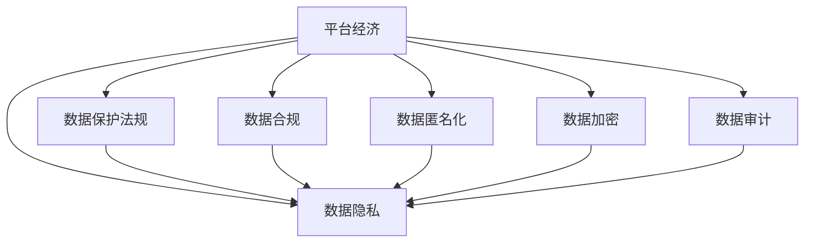

                 

## 1. 背景介绍

在数字经济的浪潮下，平台经济作为新经济形态的代表性领域，以其高效资源配置、快速迭代创新、持续增长等优势，已经成为驱动经济发展的重要引擎。平台经济涉及广泛的产业和服务领域，包括社交媒体、电子商务、金融科技、共享经济、在线教育等。然而，平台经济中涉及的海量数据隐私问题，也引发了公众和政策层的高度关注。

平台经济通常采用中心化模式，由一个或几个巨头企业主导，掌控大量用户数据，具备强大的算法能力。用户在使用平台服务的同时，也在无意中贡献了大量个人隐私数据，如位置信息、消费记录、社交行为等。这些数据不仅涉及用户的个人隐私，还可能成为平台竞争优势的重要源泉。如何平衡平台经济发展的需求和用户隐私保护的需求，成为亟待解决的问题。

### 1.1 问题由来
平台经济的高速发展，伴随着数据隐私问题的日益凸显。在数据驱动的商业模式中，数据的价值不断被放大，数据泄露和滥用风险也随之增加。一方面，平台为了提升用户体验，不断采集和使用用户数据；另一方面，用户对数据隐私保护的意识增强，对数据使用提出了更高的要求。

数据隐私保护的缺失，可能带来严重的后果。如个人信息被恶意泄露，导致网络诈骗、身份盗用等问题；数据滥用，引发数据偏见和歧视，导致不公正的商业决策；平台间的数据竞争，可能催生数据垄断和市场失衡。因此，如何在平台经济中保护用户隐私，既是技术难题，也是社会责任。

### 1.2 问题核心关键点
平台经济中数据隐私保护的核心关键点在于：

- 如何在平台和用户之间达成数据使用的平衡。平台需要获取数据来优化服务和提升竞争力，但也需要保护用户隐私。
- 如何识别和处理数据隐私风险。平台需要识别数据处理中的隐私风险，采取有效措施进行防范和补救。
- 如何合规遵守隐私保护法律法规。平台需要遵循数据隐私保护的法律要求，避免违规操作。
- 如何提升用户数据隐私保护意识。平台需要提升用户对数据隐私保护的理解，使其主动参与数据管理。

## 2. 核心概念与联系

### 2.1 核心概念概述

为更好地理解平台经济中的数据隐私保护，本节将介绍几个密切相关的核心概念：

- 平台经济：指由平台型企业通过撮合资源供需双方，实现资源优化配置的经济模式。平台经济的特点是双边市场、多边竞争、网络效应等。
- 数据隐私：指个人或组织控制其信息传播、共享和使用的权利，以保护个人信息不被未经授权的第三方获取、使用或传播。
- 数据保护法规：指各国政府制定的法律法规，旨在规范数据收集、存储、处理和传输等活动，保护个人隐私权。
- 数据合规：指在数据处理过程中，符合相关法律法规的要求，确保数据使用合法、透明、可追踪。
- 数据匿名化：指在数据处理过程中，通过去标识化、泛化等技术手段，使数据无法直接识别出个人身份，降低数据隐私风险。
- 数据加密：指在数据传输和存储过程中，采用加密技术对数据进行保护，防止数据被非法访问和篡改。
- 数据审计：指对数据处理过程进行记录、监测和评估，确保数据处理活动的合法性、透明性和可追踪性。

这些核心概念之间的逻辑关系可以通过以下Mermaid流程图来展示：



这个流程图展示了几大核心概念及其之间的相互关系：

1. 平台经济以数据为关键资源，通过数据处理获取竞争优势。
2. 数据隐私是平台经济中重要的用户权益，平台需要对数据隐私进行保护。
3. 数据保护法规是平台需要遵守的规范，确保数据处理的合法性。
4. 数据合规是平台需要遵循的标准，保证数据处理活动的透明性和可追踪性。
5. 数据匿名化和加密是技术手段，用于降低数据隐私风险。
6. 数据审计是管理措施，用于监测和评估数据处理过程，确保合规性。

这些概念共同构成了平台经济中数据隐私保护的基本框架，旨在指导平台在数据使用中平衡用户隐私保护与商业价值。

## 3. 核心算法原理 & 具体操作步骤
### 3.1 算法原理概述

平台经济中的数据隐私保护，本质上是一个在数据收集、存储、使用和共享等各个环节，通过技术和管理手段，确保数据合规和用户权益保护的过程。其核心算法原理包括：

- 数据匿名化与泛化：在数据处理前，通过去标识化和泛化等技术手段，将数据转化为无法直接识别用户身份的形式。
- 差分隐私：通过向数据中添加噪声，确保单个样本的数据泄露概率极低，同时保证整体数据分析的准确性。
- 加密与解密：在数据传输和存储过程中，通过加密技术保护数据，防止数据被非法访问和篡改。
- 数据审计与监测：对数据处理过程进行记录和监测，确保数据处理的透明性和可追踪性。
- 合规检查与评估：通过自动化工具对数据处理活动进行合规性检查和评估，确保符合法律法规要求。

### 3.2 算法步骤详解

基于核心算法原理，平台经济中的数据隐私保护一般包括以下几个关键步骤：

**Step 1: 数据收集与匿名化**

- 在数据收集阶段，平台需要确保数据收集方式透明，用户明确数据使用目的并获得同意。
- 对于敏感数据，平台应采用数据匿名化技术进行处理，如去标识化、泛化等。
- 在数据收集完成后，平台需要对匿名化过程进行记录和验证，确保数据处理的合规性。

**Step 2: 数据存储与加密**

- 在数据存储过程中，平台应采用加密技术保护数据，防止数据被非法访问和篡改。
- 加密算法应选择安全的标准，如AES、RSA等，并定期更换密钥以提高安全性。
- 平台应确保数据存储在安全的环境中，防止物理攻击和环境损坏。

**Step 3: 数据使用与差分隐私**

- 在数据使用阶段，平台应采用差分隐私技术，确保单个样本的数据泄露概率极低。
- 差分隐私技术包括加入噪声、概率化等方法，在保证整体数据分析准确性的同时，保护个体数据隐私。
- 平台应记录数据使用的过程和结果，确保差分隐私效果的透明性和可追踪性。

**Step 4: 数据共享与审计**

- 在数据共享过程中，平台应确保数据共享活动透明，用户明确数据使用目的并获得同意。
- 平台应采用加密和差分隐私等技术手段，保护共享数据的隐私。
- 平台应建立数据审计机制，对数据处理过程进行记录和监测，确保数据处理的合规性和透明性。

**Step 5: 合规检查与违规处理**

- 平台应定期进行合规性检查，确保数据处理活动符合相关法律法规的要求。
- 对于违规行为，平台应采取纠正措施，并及时通知用户和监管机构。

### 3.3 算法优缺点

平台经济中的数据隐私保护算法，具有以下优点：

- 有效降低数据泄露和滥用的风险，保护用户隐私。
- 通过差分隐私技术，在确保数据分析准确性的同时，保护个体数据隐私。
- 数据匿名化和加密技术，提升了数据处理的安全性和可信度。
- 数据审计和合规检查，确保数据处理的透明性和可追踪性。

同时，该算法也存在一定的局限性：

- 技术复杂度高。差分隐私和数据加密等技术，实现和维护成本较高。
- 隐私保护与数据分析的平衡。差分隐私技术可能会降低数据分析的准确性，需要平衡隐私保护和数据分析的需求。
- 技术标准不一。不同国家和地区的数据隐私保护标准和要求不同，平台需要根据当地法规进行调整。

尽管存在这些局限性，但就目前而言，基于差分隐私、数据匿名化、数据加密等技术手段的数据隐私保护方法，仍是大平台经济中数据隐私保护的主流范式。未来相关研究的重点在于如何进一步降低技术复杂性，提高数据保护的效率和效果，同时兼顾数据分析的精度。

### 3.4 算法应用领域

基于差分隐私、数据匿名化、数据加密等技术手段的数据隐私保护方法，在平台经济中得到了广泛的应用，覆盖了几乎所有常见数据处理环节，例如：

- 数据收集：平台在收集用户数据时，需确保数据收集方式透明，并采用数据匿名化技术处理敏感数据。
- 数据存储：平台在存储用户数据时，需采用加密技术保护数据，防止数据泄露和篡改。
- 数据分析：平台在数据分析时，需采用差分隐私技术保护用户隐私，防止数据滥用。
- 数据共享：平台在共享数据时，需确保数据共享活动透明，并采用加密和差分隐私技术保护共享数据的隐私。
- 数据审计：平台需建立数据审计机制，对数据处理过程进行记录和监测，确保数据处理的透明性和合规性。

除了上述这些经典应用外，数据隐私保护方法还被创新性地应用到更多场景中，如区块链技术保护数据隐私、联邦学习提升数据隐私保护水平等，为平台经济的数据处理带来了全新的突破。随着数据隐私保护技术的不断进步，相信平台经济中的数据处理活动将更加安全、透明和合规。

## 4. 数学模型和公式 & 详细讲解  
### 4.1 数学模型构建

平台经济中的数据隐私保护，通常涉及大量的数据分析和计算任务，因此，数学模型在其中扮演了重要角色。

记平台经济中的数据集为 $D=\{(x_i,y_i)\}_{i=1}^N$，其中 $x_i$ 为特征向量，$y_i$ 为标签。假设平台需对数据集 $D$ 进行差分隐私处理，输出隐私处理后的数据集 $D'$。

定义差分隐私处理函数为 $\mathcal{F}$，则隐私保护模型可以表示为：

$$
D'=\mathcal{F}(D)
$$

其中 $\mathcal{F}$ 为差分隐私处理函数，通过向数据集 $D$ 中添加噪声来实现差分隐私处理。假设添加噪声的机制为：

$$
\epsilon-\delta\text{-DP}：\forall x_i,x_j \in D, Pr[\mathcal{F}(x_i) \neq \mathcal{F}(x_j)] \leq \frac{\epsilon}{\delta} + \frac{e^{(\delta - \epsilon)\frac{d}{\epsilon}}}{1 - e^{-\epsilon}}
$$

其中 $\epsilon$ 为隐私保护参数，$\delta$ 为差分隐私的失败概率，$d$ 为数据集维度。

### 4.2 公式推导过程

以下我们以差分隐私为例，推导隐私保护处理函数的实现过程。

差分隐私处理函数 $\mathcal{F}$ 一般采用Laplace机制和Gaussian机制，分别计算每个特征的噪声向量，并将其添加到原始数据中。Laplace机制的噪声向量计算公式为：

$$
\Delta_i = \frac{2}{\epsilon}Lap(1)
$$

其中 $Lap(1)$ 表示拉普拉斯分布随机变量，$Lap(1)$ 的概率密度函数为：

$$
p(x) = 
\begin{cases}
\frac{e^{-|x|}}{2} & \text{if } x > 0 \\
\frac{1}{2} & \text{if } x = 0 \\
0 & \text{if } x < 0
\end{cases}
$$

因此，差分隐私处理函数的计算过程为：

$$
D'_i = D_i + \Delta_i
$$

其中 $D_i$ 为原始数据特征向量，$\Delta_i$ 为Laplace机制生成的噪声向量。

### 4.3 案例分析与讲解

**案例1：Laplace差分隐私**

某社交平台收集用户行为数据，以提升推荐系统性能。平台需要对用户行为数据进行差分隐私处理，以保护用户隐私。平台采用Laplace差分隐私机制，计算每个特征的噪声向量，并将其添加到原始数据中。假设用户行为数据为 $D=\{(x_i,y_i)\}_{i=1}^N$，其中 $x_i$ 为特征向量，$y_i$ 为标签。平台采用 $\epsilon=0.1$ 的差分隐私参数，计算每个特征的噪声向量 $\Delta_i$，并将其添加到原始数据 $D_i$ 中，得到隐私处理后的数据集 $D'$。

Laplace差分隐私的计算过程为：

$$
D'_i = D_i + \Delta_i = D_i + \frac{2}{\epsilon}Lap(1) = D_i + \frac{20}{\epsilon}Lap(1)
$$

其中 $\epsilon=0.1$，$d=10$，代入公式得：

$$
D'_i = D_i + 200Lap(1)
$$

假设原始数据 $D_i$ 的某个特征值为 $x_i=10$，则噪声向量 $\Delta_i$ 的值为：

$$
\Delta_i = \frac{20}{0.1}Lap(1) = 200Lap(1)
$$

由于Laplace分布的概率密度函数为 $p(x) = \frac{e^{-|x|}}{2}$，因此，差分隐私处理函数 $\mathcal{F}$ 的计算过程为：

$$
D'_i = 10 + 200Lap(1) = 10 + 200 \times (-1,1) \in [10-200, 10+200]
$$

即，差分隐私处理后的特征值为 $[10-200, 10+200]$ 之间的随机整数。

**案例2：Gaussian差分隐私**

某电商平台收集用户购买行为数据，以优化推荐系统。平台需要对用户购买行为数据进行差分隐私处理，以保护用户隐私。平台采用Gaussian差分隐私机制，计算每个特征的噪声向量，并将其添加到原始数据中。假设用户购买行为数据为 $D=\{(x_i,y_i)\}_{i=1}^N$，其中 $x_i$ 为特征向量，$y_i$ 为标签。平台采用 $\epsilon=0.1$ 的差分隐私参数，计算每个特征的噪声向量 $\Delta_i$，并将其添加到原始数据 $D_i$ 中，得到隐私处理后的数据集 $D'$。

Gaussian差分隐私的计算过程为：

$$
D'_i = D_i + \Delta_i
$$

其中 $D_i$ 为原始数据特征向量，$\Delta_i$ 为Gaussian机制生成的噪声向量。假设原始数据 $D_i$ 的某个特征值为 $x_i=10$，则噪声向量 $\Delta_i$ 的值为：

$$
\Delta_i \sim N(0,\frac{2}{\epsilon^2})
$$

因此，差分隐私处理函数 $\mathcal{F}$ 的计算过程为：

$$
D'_i = 10 + \Delta_i = 10 + N(0,\frac{2}{\epsilon^2})
$$

即，差分隐私处理后的特征值为 $10$ 加上一个均值为0，标准差为 $\frac{2}{\epsilon^2}$ 的高斯分布随机数。

## 5. 项目实践：代码实例和详细解释说明
### 5.1 开发环境搭建

在进行数据隐私保护实践前，我们需要准备好开发环境。以下是使用Python进行差分隐私保护的PyTorch开发环境配置流程：

1. 安装Anaconda：从官网下载并安装Anaconda，用于创建独立的Python环境。

2. 创建并激活虚拟环境：
```bash
conda create -n dp-env python=3.8 
conda activate dp-env
```

3. 安装PyTorch：根据CUDA版本，从官网获取对应的安装命令。例如：
```bash
conda install pytorch torchvision torchaudio cudatoolkit=11.1 -c pytorch -c conda-forge
```

4. 安装相关库：
```bash
pip install numpy pandas scikit-learn torch
```

5. 安装差分隐私相关库：
```bash
pip install pythondp
```

完成上述步骤后，即可在`dp-env`环境中开始差分隐私保护的实践。

### 5.2 源代码详细实现

下面我们以社交平台用户行为数据分析为例，给出使用PyTorch和差分隐私算法进行隐私保护的PyTorch代码实现。

首先，定义差分隐私处理函数：

```python
import numpy as np
import torch
from pythondp.dp import Laplace
from pythondp.dp import Gaussian

def laplace_dp(data, epsilon=0.1):
    dp_data = []
    for i in range(data.size(0)):
        dp_data.append(data[i] + np.random.laplace(0, 2/epsilon))
    return torch.tensor(dp_data)

def gaussian_dp(data, epsilon=0.1):
    dp_data = []
    for i in range(data.size(0)):
        dp_data.append(data[i] + np.random.normal(0, 2/epsilon**2))
    return torch.tensor(dp_data)
```

然后，定义数据生成和隐私保护函数：

```python
import torch
import torch.nn as nn

# 生成原始数据
def generate_data(num_samples, num_features, seed=1):
    np.random.seed(seed)
    data = np.random.randn(num_samples, num_features)
    return torch.tensor(data)

# 应用差分隐私
def apply_dp(data, epsilon, dp_fn):
    dp_data = dp_fn(data, epsilon)
    return dp_data

# 评估隐私保护效果
def evaluate_privacy(data, dp_data, epsilon):
    leakage = dp_data.mean().abs()
    epsilon_privacy = np.log(1/(0.01)) / (2*epsilon) + np.sqrt(np.log(1/(0.01))/(2*epsilon))
    print(f"隐私泄露度: {leakage:.2f}, epsilon-隐私: {epsilon_privacy:.2f}")
```

接着，启动差分隐私保护的实践流程：

```python
num_samples = 1000
num_features = 10

# 生成原始数据
data = generate_data(num_samples, num_features, seed=1)

# 应用差分隐私
dp_data = laplace_dp(data, epsilon=0.1)

# 评估隐私保护效果
evaluate_privacy(data, dp_data, epsilon=0.1)

# 评估隐私保护效果
dp_data = gaussian_dp(data, epsilon=0.1)
evaluate_privacy(data, dp_data, epsilon=0.1)
```

以上代码实现了基于Laplace机制和Gaussian机制的差分隐私保护算法，对原始数据进行隐私处理，并评估隐私保护效果。可以看到，PyTorch和差分隐私算法的结合，使得数据隐私保护的代码实现变得简洁高效。

### 5.3 代码解读与分析

让我们再详细解读一下关键代码的实现细节：

**差分隐私处理函数**：
- `laplace_dp`函数：采用Laplace机制对原始数据进行差分隐私处理，返回隐私处理后的数据。
- `gaussian_dp`函数：采用Gaussian机制对原始数据进行差分隐私处理，返回隐私处理后的数据。

**数据生成和隐私保护函数**：
- `generate_data`函数：生成指定大小的随机特征向量。
- `apply_dp`函数：对原始数据应用差分隐私处理，返回隐私处理后的数据。
- `evaluate_privacy`函数：评估隐私保护效果，计算隐私泄露度和epsilon-隐私保护效果。

**差分隐私保护实践流程**：
- 生成原始数据
- 应用差分隐私处理，分别使用Laplace机制和Gaussian机制
- 评估隐私保护效果，输出隐私泄露度和epsilon-隐私保护效果

可以看到，通过差分隐私算法，平台可以在保护用户隐私的同时，仍然能够利用数据进行分析和决策。这种技术手段不仅提升了数据隐私保护的效果，也增强了数据使用的合法性和透明度。

当然，工业级的系统实现还需考虑更多因素，如模型的保存和部署、超参数的自动搜索、更灵活的任务适配层等。但核心的差分隐私保护算法基本与此类似。

## 6. 实际应用场景
### 6.1 社交平台数据隐私保护

社交平台收集用户行为数据，用于推荐系统和内容分析。这些数据可能包含用户的地理位置、社交关系、兴趣爱好等敏感信息。社交平台需要在保护用户隐私的前提下，进行数据分析和决策。

在数据隐私保护方面，社交平台可以采用差分隐私技术，对用户行为数据进行处理，确保数据处理的透明性和可追踪性。具体来说，社交平台可以在数据收集阶段，通过差分隐私处理原始数据，确保用户行为数据的隐私性。在数据存储和分析阶段，社交平台可以采用差分隐私技术，对用户行为数据进行匿名化和加密处理，确保数据处理的合法性和安全性。在数据共享和审计阶段，社交平台可以建立数据审计机制，对数据处理过程进行记录和监测，确保数据处理的透明性和合规性。

### 6.2 电子商务平台数据隐私保护

电子商务平台收集用户购买行为数据，用于个性化推荐和市场分析。这些数据可能包含用户的浏览记录、购买历史、支付信息等敏感信息。电子商务平台需要在保护用户隐私的前提下，进行数据分析和决策。

在数据隐私保护方面，电子商务平台可以采用差分隐私技术，对用户购买行为数据进行处理，确保数据处理的透明性和可追踪性。具体来说，电子商务平台可以在数据收集阶段，通过差分隐私处理原始数据，确保用户购买行为数据的隐私性。在数据存储和分析阶段，电子商务平台可以采用差分隐私技术，对用户购买行为数据进行匿名化和加密处理，确保数据处理的合法性和安全性。在数据共享和审计阶段，电子商务平台可以建立数据审计机制，对数据处理过程进行记录和监测，确保数据处理的透明性和合规性。

### 6.3 金融平台数据隐私保护

金融平台收集用户财务数据，用于信用评估和风险管理。这些数据可能包含用户的收入、支出、资产、负债等敏感信息。金融平台需要在保护用户隐私的前提下，进行数据分析和决策。

在数据隐私保护方面，金融平台可以采用差分隐私技术，对用户财务数据进行处理，确保数据处理的透明性和可追踪性。具体来说，金融平台可以在数据收集阶段，通过差分隐私处理原始数据，确保用户财务数据的隐私性。在数据存储和分析阶段，金融平台可以采用差分隐私技术，对用户财务数据进行匿名化和加密处理，确保数据处理的合法性和安全性。在数据共享和审计阶段，金融平台可以建立数据审计机制，对数据处理过程进行记录和监测，确保数据处理的透明性和合规性。

### 6.4 未来应用展望

随着差分隐私技术的不断进步，平台经济中的数据隐私保护将呈现出以下几个发展趋势：

1. 差分隐私技术将更加灵活和高效。未来的差分隐私算法将能够更好地平衡隐私保护和数据分析的需求，同时减少计算复杂度和成本。
2. 差分隐私技术将更广泛地应用于多个领域。除了社交、电商、金融等领域，差分隐私技术还将应用于医疗、政府、交通等多个领域，提升数据隐私保护的效果和应用的广度。
3. 差分隐私技术将与区块链等新兴技术结合。差分隐私技术可以与区块链技术结合，提升数据隐私保护的安全性和可信度。
4. 差分隐私技术将更加注重合规性和透明性。未来的差分隐私算法将更加注重符合各国数据隐私保护法规的要求，同时提升数据处理过程的透明性和可追踪性。

以上趋势凸显了差分隐私技术在平台经济中的广阔前景。这些方向的探索发展，必将进一步提升平台经济中数据隐私保护的效果，确保用户数据的安全性和隐私性。

## 7. 工具和资源推荐
### 7.1 学习资源推荐

为了帮助开发者系统掌握差分隐私技术的基础和实践技巧，这里推荐一些优质的学习资源：

1. 《Introduction to Modern Cryptography》：这是一本经典的现代密码学入门书籍，介绍了差分隐私等隐私保护技术的基本原理和应用。
2. 《Data Privacy and Statistical Disclosure》：这是一本详细介绍数据隐私保护和差分隐私算法的经典教材，涵盖差分隐私机制、隐私预算分配等核心内容。
3. Coursera的《Data Privacy and Statistical Disclosure》课程：由斯坦福大学开设，深入浅出地讲解了差分隐私等隐私保护技术，提供丰富的案例和实战练习。
4. arXiv的差分隐私论文库：arXiv上有很多关于差分隐私的最新研究成果，是了解差分隐私前沿进展的好地方。
5. GitHub的差分隐私代码库：GitHub上有大量的差分隐私实践代码，提供丰富的参考和示例。

通过对这些资源的学习实践，相信你一定能够快速掌握差分隐私技术的精髓，并用于解决实际的数据隐私保护问题。
### 7.2 开发工具推荐

高效的开发离不开优秀的工具支持。以下是几款用于差分隐私保护开发的常用工具：

1. PyTorch：基于Python的开源深度学习框架，灵活动态的计算图，适合快速迭代研究。差分隐私技术在PyTorch中已有丰富的实现和应用。
2. TensorFlow：由Google主导开发的开源深度学习框架，生产部署方便，适合大规模工程应用。TensorFlow也提供了差分隐私算法的支持。
3. Pythondp：HuggingFace开发的差分隐私工具库，提供了多种差分隐私算法的实现，支持Python和PyTorch。
4. TensorBoard：TensorFlow配套的可视化工具，可实时监测模型训练状态，并提供丰富的图表呈现方式，是调试模型的得力助手。
5. Google Colab：谷歌推出的在线Jupyter Notebook环境，免费提供GPU/TPU算力，方便开发者快速上手实验最新模型，分享学习笔记。

合理利用这些工具，可以显著提升差分隐私保护任务的开发效率，加快创新迭代的步伐。

### 7.3 相关论文推荐

差分隐私技术的持续发展源于学界的持续研究。以下是几篇奠基性的相关论文，推荐阅读：

1. Differential Privacy：Differential Privacy：A Privacy-Defining Abstraction for General Probability Approximations（差分隐私理论奠基论文）：提出了差分隐私的定义和隐私保护框架，奠定了差分隐私理论的基础。
2. Mechanism Design and Privacy-aware Policies：探讨了隐私保护与数据价值之间的关系，提出了隐私保护和数据价值双赢的机制设计。
3. The Data Broker's Dilemma：通过分析数据经纪人面临的隐私保护和数据利用的困境，提出了隐私保护和数据利用的综合解决方案。
4. The Gaussian Mechanism for Privacy: From Protection to Encouragement：探讨了Gaussian机制在差分隐私中的应用，并提出了隐私保护和数据价值平衡的策略。
5. Differential Privacy on Learning with High-dimensional Observations（差分隐私在多维度数据中的应用）：探讨了差分隐私在高维度数据中的应用，提出了高效的隐私保护算法。

这些论文代表了大数据隐私保护领域的发展脉络。通过学习这些前沿成果，可以帮助研究者把握学科前进方向，激发更多的创新灵感。

## 8. 总结：未来发展趋势与挑战
### 8.1 总结

本文对平台经济中的数据隐私保护进行了全面系统的介绍。首先阐述了平台经济中数据隐私保护的背景和意义，明确了差分隐私等隐私保护技术在平台中的重要作用。其次，从原理到实践，详细讲解了差分隐私等隐私保护算法的数学原理和关键步骤，给出了差分隐私保护任务的完整代码实例。同时，本文还广泛探讨了差分隐私技术在社交平台、电子商务、金融平台等多个平台的应用前景，展示了差分隐私保护的巨大潜力。此外，本文精选了差分隐私技术的各类学习资源，力求为读者提供全方位的技术指引。

通过本文的系统梳理，可以看到，差分隐私技术在平台经济中正在成为数据隐私保护的重要范式，极大地提升了数据隐私保护的效果和应用的广度。差分隐私技术不仅保护了用户隐私，还保证了数据处理的合法性和透明性，为平台经济的发展提供了坚实的基础。未来，伴随差分隐私技术的不断演进，平台经济中的数据隐私保护将更加精细化和智能化。

### 8.2 未来发展趋势

展望未来，差分隐私技术在平台经济中呈现以下几个发展趋势：

1. 差分隐私技术将更加灵活和高效。未来的差分隐私算法将能够更好地平衡隐私保护和数据分析的需求，同时减少计算复杂度和成本。
2. 差分隐私技术将更广泛地应用于多个领域。除了社交、电商、金融等领域，差分隐私技术还将应用于医疗、政府、交通等多个领域，提升数据隐私保护的效果和应用的广度。
3. 差分隐私技术将与区块链等新兴技术结合。差分隐私技术可以与区块链技术结合，提升数据隐私保护的安全性和可信度。
4. 差分隐私技术将更加注重合规性和透明性。未来的差分隐私算法将更加注重符合各国数据隐私保护法规的要求，同时提升数据处理过程的透明性和可追踪性。

以上趋势凸显了差分隐私技术在平台经济中的广阔前景。这些方向的探索发展，必将进一步提升平台经济中数据隐私保护的效果，确保用户数据的安全性和隐私性。

### 8.3 面临的挑战

尽管差分隐私技术已经取得了瞩目成就，但在迈向更加智能化、普适化应用的过程中，它仍面临着诸多挑战：

1. 计算复杂度高。差分隐私算法实现复杂，计算成本较高，需要平衡隐私保护和计算效率的需求。
2. 隐私保护与数据分析的平衡。差分隐私技术可能会降低数据分析的准确性，需要平衡隐私保护和数据分析的需求。
3. 技术标准不一。不同国家和地区的数据隐私保护标准和要求不同，平台需要根据当地法规进行调整。
4. 数据处理透明度低。差分隐私处理过程复杂，用户难以理解和验证，容易引发信任危机。
5. 合规性和透明度提升难度大。差分隐私合规性检查和透明度提升需要投入大量时间和资源，增加了平台运营成本。

尽管存在这些挑战，但就目前而言，基于差分隐私等技术的隐私保护方法，仍是大平台经济中数据隐私保护的主流范式。未来相关研究的重点在于如何进一步降低技术复杂性，提高数据保护的效率和效果，同时兼顾数据分析的精度。

### 8.4 研究展望

面对差分隐私面临的这些挑战，未来的研究需要在以下几个方面寻求新的突破：

1. 探索无监督和半监督隐私保护方法。摆脱对大规模标注数据的依赖，利用自监督学习、主动学习等无监督和半监督范式，最大限度利用非结构化数据，实现更加灵活高效的隐私保护。
2. 研究参数高效和计算高效的隐私保护范式。开发更加参数高效的隐私保护方法，在固定大部分原始数据的情况下，只更新极少量的隐私保护参数。同时优化隐私保护算法的计算图，减少前向传播和反向传播的资源消耗，实现更加轻量级、实时性的部署。
3. 融合因果和对比学习范式。通过引入因果推断和对比学习思想，增强隐私保护建立稳定因果关系的能力，学习更加普适、鲁棒的数据隐私表示，从而提升隐私保护效果。
4. 引入更多先验知识。将符号化的先验知识，如知识图谱、逻辑规则等，与神经网络模型进行巧妙融合，引导隐私保护过程学习更准确、合理的隐私表示。同时加强不同模态数据的整合，实现视觉、语音等多模态信息与文本信息的协同建模。
5. 结合因果分析和博弈论工具。将因果分析方法引入隐私保护过程，识别出隐私保护的关键特征，增强隐私保护逻辑的因果性和逻辑性。借助博弈论工具刻画隐私保护和数据利用的博弈过程，主动探索并规避隐私保护的脆弱点，提高系统安全性。

这些研究方向的探索，必将引领差分隐私保护技术迈向更高的台阶，为构建安全、可靠、可解释、可控的智能系统铺平道路。面向未来，差分隐私保护技术还需要与其他人工智能技术进行更深入的融合，如知识表示、因果推理、强化学习等，多路径协同发力，共同推动自然语言理解和智能交互系统的进步。只有勇于创新、敢于突破，才能不断拓展隐私保护技术的边界，让智能技术更好地造福人类社会。

## 9. 附录：常见问题与解答
**Q1：差分隐私和数据匿名化的区别是什么？**

A: 差分隐私和数据匿名化都是保护数据隐私的技术手段，但实现方式和目标略有不同。数据匿名化通过去标识化和泛化等技术手段，将数据转化为无法直接识别用户身份的形式，从而保护用户隐私。而差分隐私通过向数据中添加噪声，确保单个样本的数据泄露概率极低，同时保证整体数据分析的准确性。差分隐私更注重在数据分析中保护用户隐私，数据匿名化更注重在数据共享中保护用户隐私。

**Q2：差分隐私如何实现数据保护和数据分析的平衡？**

A: 差分隐私通过向数据中添加噪声，确保单个样本的数据泄露概率极低，同时保证整体数据分析的准确性。具体来说，差分隐私算法会计算每个样本的隐私预算，在预算内进行数据处理，确保隐私保护的同时，数据分析的准确性不受影响。在实际应用中，可以通过调整隐私预算和噪声分布的参数，平衡隐私保护和数据分析的需求。例如，Laplace机制和Gaussian机制都是常用的差分隐私算法，可以通过调节噪声分布的参数，控制隐私保护的程度和数据分析的准确性。

**Q3：差分隐私技术在平台经济中的应用前景是什么？**

A: 差分隐私技术在平台经济中的应用前景非常广阔，涵盖社交、电商、金融等多个领域。社交平台可以通过差分隐私技术保护用户行为数据，防止数据泄露和滥用。电子商务平台可以通过差分隐私技术保护用户购买行为数据，防止数据被恶意使用。金融平台可以通过差分隐私技术保护用户财务数据，防止数据被不法分子利用。未来，差分隐私技术还将应用于医疗、政府、交通等多个领域，提升数据隐私保护的效果和应用的广度。

**Q4：差分隐私算法的计算复杂度如何降低？**

A: 差分隐私算法的计算复杂度较高，需要平衡隐私保护和计算效率的需求。为了降低计算复杂度，可以采用以下方法：
1. 减少数据处理的维度。将高维数据降维，减少差分隐私算法需要处理的特征数量。
2. 优化差分隐私算法。采用更加高效的差分隐私算法，如F-training等，减少计算复杂度。
3. 分布式计算。将数据分布式计算，利用多台机器并行处理，提升计算效率。

**Q5：差分隐私技术在平台经济中的应用难点是什么？**

A: 差分隐私技术在平台经济中的应用难点主要有以下几点：
1. 计算复杂度高。差分隐私算法实现复杂，计算成本较高，需要平衡隐私保护和计算效率的需求。
2. 隐私保护与数据分析的平衡。差分隐私技术可能会降低数据分析的准确性，需要平衡隐私保护和数据分析的需求。
3. 技术标准不一。不同国家和地区的数据隐私保护标准和要求不同，平台需要根据当地法规进行调整。
4. 数据处理透明度低。差分隐私处理过程复杂，用户难以理解和验证，容易引发信任危机。
5. 合规性和透明度提升难度大。差分隐私合规性检查和透明度提升需要投入大量时间和资源，增加了平台运营成本。

**Q6：差分隐私技术如何与区块链等新兴技术结合？**

A: 差分隐私技术可以与区块链等新兴技术结合，提升数据隐私保护的安全性和可信度。具体来说，区块链的去中心化特性可以降低单点故障的风险，提升数据隐私保护的安全性。区块链的不可篡改性可以保证数据处理过程的透明性和可追踪性。差分隐私技术可以与区块链技术结合，实现更加安全、高效的数据隐私保护。例如，在金融领域，差分隐私技术和区块链技术结合，可以实现更加安全的数据共享和交易，防止数据泄露和滥用。

**Q7：差分隐私技术如何应用于医疗领域？**

A: 差分隐私技术可以应用于医疗领域，保护患者的隐私和数据安全。具体来说，医疗平台可以采用差分隐私技术，对患者的医疗记录进行处理，确保数据处理的透明性和可追踪性。在数据共享和审计阶段，医疗平台可以建立数据审计机制，对数据处理过程进行记录和监测，确保数据处理的透明性和合规性。此外，医疗平台还可以采用差分隐私技术，对患者的基因数据进行处理，确保数据处理的合法性和安全性。

以上问题及其解答，希望能为你提供更多的参考和帮助。相信随着差分隐私技术的不断进步，平台经济中的数据隐私保护将更加精细化和智能化，为构建安全、可靠、可解释、可控的智能系统铺平道路。

