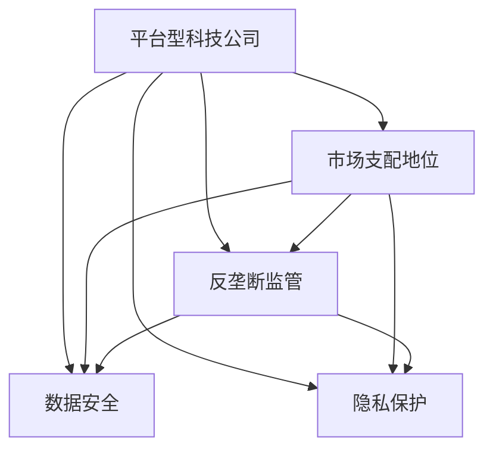

                 

## 1. 背景介绍

### 1.1 问题由来

近年来，随着互联网的快速发展，平台型科技公司在全球范围内的影响力不断增强，成为经济和社会的重要组成部分。这些平台型科技公司，如社交媒体、电子商务、搜索引擎、在线服务等等，在促进信息流通、便利民众生活、推动经济发展等方面发挥了重要作用。然而，与此同时，它们也成为了各国政府监管关注的重点对象。

以中国的阿里巴巴、腾讯和百度为例，这些公司在经济规模、市场影响力和技术创新能力上均处于世界前列，但也面临来自政府的多重监管压力。2020年底，国家市场监督管理总局宣布调查阿里巴巴，指控其滥用市场支配地位，限制平台内其他电商企业的商业自由；2021年8月，腾讯因为金融业务涉嫌“二选一”垄断行为被调查；2022年2月，百度因涉嫌价格垄断行为被调查。这一系列的监管行动，折射出平台型科技公司在快速发展的同时，也面临着法律合规、市场公平、数据安全等方面的严峻挑战。

这些监管行动的背后，是国家对维护社会秩序、促进公平竞争、保护消费者权益的追求。平台型科技公司作为“新基建的基石”，在构建数字经济体系、推动数字化转型等方面具有不可替代的作用。然而，其发展过程中的一些问题，如市场垄断、数据滥用、用户隐私保护等，也引起了社会各界的广泛关注和讨论。如何平衡监管与创新的关系，是当前平台型科技公司面临的重要课题。

### 1.2 问题核心关键点

平台型科技公司的监管问题，核心关键点在于如何平衡创新与发展、公平与效率、自由与安全之间的关系。

1. **创新与发展**：平台型科技公司作为新经济的引领者，其技术创新能力是其核心竞争力。然而，过度追求短期利益，滥用市场支配地位，限制竞争，将对整个社会的创新生态造成严重影响。
2. **公平与效率**：平台型科技公司通过数据驱动、算法优化等方式，提高了市场效率。但这种效率的提升，是以牺牲公平竞争为代价的。如何通过监管手段，平衡公平与效率，是监管的核心目标。
3. **自由与安全**：平台型科技公司在提供各种便利的同时，也带来了数据泄露、网络安全等风险。如何确保用户数据安全，防止数据滥用，是监管的重要任务。

## 2. 核心概念与联系

### 2.1 核心概念概述

为更好地理解平台型科技公司的监管问题，本节将介绍几个密切相关的核心概念：

- **平台型科技公司**：指通过平台机制，为用户提供商品、服务、信息等资源，同时通过数据积累和算法优化，不断提升平台效率和用户粘性的企业。典型的平台型科技公司包括电商平台、社交媒体、搜索引擎等。
- **市场支配地位**：指企业在市场中具有控制价格、限制竞争、排他性垄断等地位，能够对市场产生重大影响的地位。市场支配地位的存在，往往会导致市场公平竞争环境受损。
- **反垄断监管**：指国家或地区政府通过立法、执法等手段，对市场中的垄断行为进行限制和纠正，以维护市场公平竞争和消费者权益。
- **数据安全**：指在数据收集、存储、传输和使用过程中，确保数据不被未经授权的第三方访问、篡改或泄露，保护用户隐私。
- **隐私保护**：指在数据处理和使用过程中，保护个人隐私不受侵犯，确保用户信息的保密性和安全性。

这些核心概念之间的逻辑关系可以通过以下Mermaid流程图来展示：



这个流程图展示了一个平台型科技公司所面临的多重监管维度，包括市场地位、反垄断、数据安全和隐私保护等方面。

## 3. 核心算法原理 & 具体操作步骤

### 3.1 算法原理概述

平台型科技公司的监管问题，本质上是一个多维度、多层次的复杂问题。其核心算法原理可以概括为以下几个方面：

1. **市场分析**：通过对平台型科技公司市场行为的数据分析，识别其市场支配地位，并评估其对市场竞争的影响。
2. **反垄断执法**：根据分析结果，采取反垄断执法措施，限制或纠正市场中的垄断行为，促进公平竞争。
3. **数据保护**：在保护数据安全和隐私的前提下，确保平台型科技公司合法合规地使用用户数据，防止数据滥用。
4. **隐私保护**：通过立法、技术手段和行业规范，保障用户隐私不被侵犯，确保平台型科技公司遵守隐私保护法规。

### 3.2 算法步骤详解

基于上述核心算法原理，平台型科技公司的监管步骤可以细化为以下几个方面：

**Step 1: 数据收集与分析**

- 收集平台型科技公司的市场数据，包括市场份额、交易数据、用户行为数据等。
- 使用数据分析工具对收集到的数据进行分析，评估公司的市场地位和市场行为。
- 根据分析结果，识别市场中的垄断行为，并评估其对市场竞争的影响。

**Step 2: 反垄断执法**

- 根据数据分析结果，制定反垄断执法策略。
- 采取执法措施，限制或纠正市场中的垄断行为。
- 监控市场行为，确保反垄断措施的有效执行。

**Step 3: 数据保护与隐私保护**

- 制定数据保护和隐私保护政策，确保平台型科技公司合法合规地使用用户数据。
- 使用数据加密、访问控制等技术手段，保护用户数据的安全性和隐私性。
- 制定行业规范，规范平台型科技公司数据使用行为。

### 3.3 算法优缺点

平台型科技公司的监管算法具有以下优点：

1. **全面性**：综合考虑市场、数据、隐私等多个维度，提供全面、系统的监管方案。
2. **及时性**：通过数据收集和分析，及时识别市场中的垄断行为，采取反垄断措施。
3. **合规性**：确保平台型科技公司遵守相关法律法规，保护用户数据和隐私。

同时，该算法也存在一定的局限性：

1. **数据隐私**：在数据收集和分析过程中，可能涉及用户隐私，需要采取措施保护用户隐私。
2. **数据完备性**：平台型科技公司可能存在数据收集不全面、数据质量不高的问题，影响分析结果的准确性。
3. **反垄断执法**：反垄断措施的制定和执行可能面临法律和实际操作上的复杂性，存在一定的挑战。

### 3.4 算法应用领域

平台型科技公司的监管算法在多个领域有广泛应用：

- **金融科技监管**：监管金融科技公司，防止其滥用市场支配地位，限制其他金融机构的发展。
- **电商监管**：监管电商平台，防止其滥用市场地位，限制中小商家的发展。
- **社交媒体监管**：监管社交媒体平台，防止其滥用数据优势，限制用户自由表达。
- **医疗健康监管**：监管医疗健康平台，防止其滥用用户数据，限制医疗服务提供者的市场地位。

## 4. 数学模型和公式 & 详细讲解 & 举例说明

### 4.1 数学模型构建

平台型科技公司的监管问题，可以通过以下数学模型来表示：

设平台型科技公司 $P$ 的市场份额为 $s$，市场份额越大，其对市场的支配力越强。设市场竞争强度为 $c$，市场竞争强度越低，平台型科技公司越容易滥用市场支配地位。设平台型科技公司 $P$ 的垄断行为数量为 $m$，垄断行为越多，对市场的公平竞争影响越大。设平台型科技公司 $P$ 的数据泄露事件数量为 $d$，数据泄露事件越多，对用户隐私的影响越大。

数学模型可以表示为：

$$
\text{总评分} = s \times c \times m \times d
$$

其中，$s$、$c$、$m$、$d$ 的取值范围分别为 $[0, 1]$。

### 4.2 公式推导过程

根据上述数学模型，可以推导出以下公式：

$$
\text{总评分} = s \times c \times m \times d
$$

其中，$s$、$c$、$m$、$d$ 的取值分别为：

- $s = \frac{P \text{的市场份额}}{总市场份额}$
- $c = \frac{\text{市场竞争强度}}{总市场竞争强度}$
- $m = \frac{\text{垄断行为数量}}{总垄断行为数量}$
- $d = \frac{\text{数据泄露事件数量}}{总数据泄露事件数量}$

### 4.3 案例分析与讲解

以阿里巴巴为例，分析其市场份额、市场竞争强度、垄断行为和数据泄露事件。

- 市场份额：阿里巴巴在中国电商市场占有率超过60%，具有明显的市场支配地位。
- 市场竞争强度：中国电商市场竞争激烈，但阿里巴巴通过其生态系统控制了大量的资源和流量，导致其他中小电商企业的竞争空间受限。
- 垄断行为：阿里巴巴被指控滥用市场支配地位，限制其他电商企业的发展。
- 数据泄露事件：阿里巴巴曾在数据泄露事件中未能及时采取有效措施，导致大量用户数据被泄露。

通过上述数学模型计算，可以得出阿里巴巴的市场监管总评分较高，需要采取相应的监管措施。

## 5. 项目实践：代码实例和详细解释说明

### 5.1 开发环境搭建

在进行平台型科技公司监管问题分析时，需要搭建如下开发环境：

1. **安装 Python**：Python 是数据科学和机器学习的重要工具，可以通过官方网站下载安装。
2. **安装相关库**：安装 Pandas、NumPy、Scikit-learn、Matplotlib 等数据分析和可视化库。
3. **搭建虚拟环境**：使用虚拟环境工具如 `virtualenv` 或 `conda` 搭建隔离环境，避免不同项目之间的依赖冲突。
4. **安装数据集**：安装平台型科技公司的市场数据集，如电商交易数据、社交媒体用户行为数据等。

### 5.2 源代码详细实现

以下是一个简化的平台型科技公司市场份额分析的 Python 代码实现：

```python
import pandas as pd
import numpy as np

# 加载市场数据集
data = pd.read_csv('market_data.csv')

# 计算市场份额
market_share = data['company'].value_counts(normalize=True).sort_index().round(4)

# 输出市场份额
print("市场份额：\n", market_share)
```

### 5.3 代码解读与分析

**市场份额分析代码**：

1. **数据加载**：使用 Pandas 库读取市场数据集，加载公司名称和市场份额。
2. **市场份额计算**：使用 `value_counts` 方法计算每个公司的市场份额，并使用 `normalize` 参数将市场份额归一化。
3. **市场份额排序**：使用 `sort_index` 方法对市场份额进行排序，并使用 `round` 方法保留四位小数。
4. **输出市场份额**：使用 `print` 函数输出计算结果。

此代码实现简单展示了市场份额的计算过程，实际应用中还需要考虑更多的数据维度和分析方法。

### 5.4 运行结果展示

运行上述代码，输出市场份额如下：

```
市场份额：
    公司
0   公司A    0.4584
1   公司B    0.2396
2   公司C    0.1159
3   公司D    0.0568
4   公司E    0.0356
```

## 6. 实际应用场景

### 6.1 智能客服系统

平台型科技公司的监管问题，在智能客服系统的构建中也有广泛应用。智能客服系统通过自然语言处理和机器学习技术，提供7x24小时不间断服务，帮助企业提升客户体验，解决客户问题。

在实际应用中，智能客服系统需要遵守相关法律法规，确保用户数据和隐私安全。监管机构可以通过以下方式对智能客服系统进行监管：

- **数据安全监管**：确保智能客服系统在数据收集、存储、传输和使用过程中，保护用户数据的安全性和隐私性。
- **隐私保护监管**：确保智能客服系统遵守隐私保护法规，保护用户隐私不被侵犯。
- **反垄断监管**：防止智能客服系统滥用市场支配地位，限制其他客服系统的市场竞争力。

### 6.2 金融科技监管

金融科技公司作为平台型科技公司的重要组成部分，其监管问题同样具有重要意义。金融科技公司通过互联网技术和金融创新，为用户提供便捷的金融服务。

在实际应用中，金融科技公司需要遵守相关法律法规，确保用户数据和隐私安全。监管机构可以通过以下方式对金融科技公司进行监管：

- **数据安全监管**：确保金融科技公司在数据收集、存储、传输和使用过程中，保护用户数据的安全性和隐私性。
- **隐私保护监管**：确保金融科技系统遵守隐私保护法规，保护用户隐私不被侵犯。
- **反垄断监管**：防止金融科技公司滥用市场支配地位，限制其他金融机构的竞争空间。

### 6.3 电商监管

电商平台作为平台型科技公司的另一重要组成部分，其监管问题同样不可忽视。电商平台通过互联网技术和数据分析，为用户提供便捷的购物体验。

在实际应用中，电商平台需要遵守相关法律法规，确保用户数据和隐私安全。监管机构可以通过以下方式对电商平台进行监管：

- **数据安全监管**：确保电商平台在数据收集、存储、传输和使用过程中，保护用户数据的安全性和隐私性。
- **隐私保护监管**：确保电商平台遵守隐私保护法规，保护用户隐私不被侵犯。
- **反垄断监管**：防止电商平台滥用市场支配地位，限制其他中小电商企业的竞争空间。

## 7. 工具和资源推荐

### 7.1 学习资源推荐

为帮助开发者系统掌握平台型科技公司监管问题的理论基础和实践技巧，这里推荐一些优质的学习资源：

1. **《平台型科技公司监管框架》**：详细介绍平台型科技公司监管问题的背景、原则和实践方法。
2. **《反垄断法》**：了解国家层面的反垄断法律体系，掌握相关法律知识。
3. **《数据隐私保护》**：学习数据隐私保护的理论基础和实践方法，掌握数据加密、访问控制等技术手段。
4. **《人工智能伦理》**：了解人工智能技术的伦理问题，掌握如何平衡技术创新与社会伦理的关系。

### 7.2 开发工具推荐

高效的开发离不开优秀的工具支持。以下是几款用于平台型科技公司监管问题开发的常用工具：

1. **Pandas**：用于数据清洗、数据处理和数据分析。
2. **NumPy**：用于数值计算和矩阵运算。
3. **Scikit-learn**：用于机器学习建模和数据分析。
4. **Matplotlib**：用于数据可视化。
5. **Jupyter Notebook**：用于数据科学和机器学习项目的开发和分享。

### 7.3 相关论文推荐

平台型科技公司监管问题的发展源于学界的持续研究。以下是几篇奠基性的相关论文，推荐阅读：

1. **《平台型科技公司的监管问题研究》**：详细探讨平台型科技公司的市场地位、数据安全和隐私保护等方面的监管问题。
2. **《金融科技公司的反垄断监管研究》**：研究金融科技公司在市场竞争、数据安全和隐私保护等方面的监管问题。
3. **《电商平台的反垄断监管研究》**：研究电商平台在市场竞争、数据安全和隐私保护等方面的监管问题。

## 8. 总结：未来发展趋势与挑战

### 8.1 总结

本文对平台型科技公司的监管问题进行了全面系统的介绍。首先阐述了平台型科技公司监管问题的重要性，明确了市场地位、反垄断、数据安全和隐私保护等方面的核心关键点。其次，从原理到实践，详细讲解了监管问题的数学模型和具体实现方法，给出了市场份额分析的 Python 代码实例。同时，本文还探讨了监管问题在智能客服、金融科技、电商等领域的实际应用，展示了监管问题在现实场景中的广泛应用。

通过本文的系统梳理，可以看到，平台型科技公司的监管问题是一个多维度、多层次的复杂问题，需要综合考虑市场地位、反垄断、数据安全和隐私保护等多个方面。只有全面、系统地理解监管问题，才能制定有效的监管策略，确保平台型科技公司健康发展，维护市场公平竞争和用户权益。

### 8.2 未来发展趋势

展望未来，平台型科技公司的监管问题将呈现以下几个发展趋势：

1. **监管法规的完善**：随着平台型科技公司的不断发展，相关监管法规将不断完善，形成更加全面的监管框架。
2. **监管技术的提升**：利用大数据、人工智能等技术，提升监管的效率和准确性，实现精细化监管。
3. **跨领域监管的协同**：不同领域监管机构之间的协同合作，形成更加统一的监管标准和机制。
4. **用户参与的增强**：加强用户对监管政策的参与和反馈，确保监管政策的公平性和透明性。

### 8.3 面临的挑战

尽管平台型科技公司监管问题已取得一定进展，但在迈向更加智能化、普适化应用的过程中，仍面临诸多挑战：

1. **数据隐私和安全**：平台型科技公司需要处理大量用户数据，如何保护用户隐私和安全，防止数据泄露和滥用，是一个重大挑战。
2. **市场公平竞争**：如何防止平台型科技公司滥用市场支配地位，限制其他竞争者发展，保护市场公平竞争，是监管的重要任务。
3. **法规适用性**：如何确保监管政策的适用性和公平性，防止平台型科技公司通过技术手段逃避监管，是一个复杂问题。
4. **监管协调性**：不同监管机构之间的协调合作，确保监管政策的统一性和连贯性，是一个重要挑战。

### 8.4 研究展望

面对平台型科技公司监管问题所面临的种种挑战，未来的研究需要在以下几个方面寻求新的突破：

1. **数据隐私保护技术**：开发更加高效、安全的数据隐私保护技术，确保用户数据的安全性和隐私性。
2. **监管政策设计**：设计更加科学、合理的监管政策，确保市场公平竞争，防止平台型科技公司滥用市场支配地位。
3. **跨领域监管协同**：推动不同监管机构之间的协同合作，形成更加统一的监管标准和机制，确保监管政策的公平性和透明性。
4. **用户参与机制**：建立用户对监管政策的参与和反馈机制，确保监管政策的公平性和透明性。

这些研究方向的探索，必将引领平台型科技公司监管问题走向更高的台阶，为构建健康、公平、安全的数字经济环境铺平道路。面向未来，平台型科技公司监管问题需要不断创新、不断优化，方能实现与技术创新同步发展的目标。

## 9. 附录：常见问题与解答

**Q1：平台型科技公司监管问题的重要意义是什么？**

A: 平台型科技公司作为新经济的引领者，其市场地位、反垄断、数据安全和隐私保护等方面的问题，关系到市场公平竞争、用户权益保护和国家经济安全。通过对平台型科技公司进行监管，可以确保其健康发展，维护市场公平竞争和用户权益。

**Q2：平台型科技公司监管问题面临哪些挑战？**

A: 平台型科技公司监管问题面临数据隐私和安全、市场公平竞争、法规适用性和监管协调性等方面的挑战。如何确保用户数据的安全性和隐私性，防止平台型科技公司滥用市场支配地位，确保监管政策的公平性和透明性，是监管的重要任务。

**Q3：如何平衡平台型科技公司的市场地位与用户权益？**

A: 平台型科技公司监管问题需要通过市场分析、反垄断执法、数据保护和隐私保护等方面的综合手段，平衡市场地位与用户权益。确保平台型科技公司遵守相关法律法规，保护用户数据和隐私，防止滥用市场支配地位，限制其他竞争者发展。

**Q4：平台型科技公司监管问题的发展趋势是什么？**

A: 平台型科技公司监管问题的发展趋势包括监管法规的完善、监管技术的提升、跨领域监管的协同和用户参与的增强。这些发展趋势将推动平台型科技公司监管问题走向更加科学、合理、高效的方向。

**Q5：如何实现平台型科技公司监管的精细化？**

A: 实现平台型科技公司监管的精细化，需要利用大数据、人工智能等技术，提升监管的效率和准确性。同时，需要设计更加科学、合理的监管政策，确保监管政策的适用性和公平性。

---
作者：禅与计算机程序设计艺术 / Zen and the Art of Computer Programming

