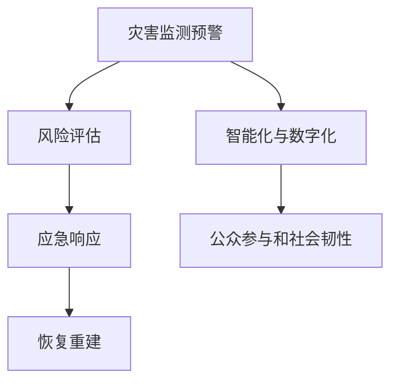

                 

## 1. 背景介绍

### 1.1 问题由来
全球气候变化和自然灾害频发，对人类社会构成了巨大威胁。近年来的极端气候事件，如高温热浪、台风、洪水、野火等，造成大量人员伤亡和财产损失。传统灾害应对机制在快速变化的环境下显得捉襟见肘，亟需变革。

### 1.2 问题核心关键点
未来减灾应从单纯灾害应对向综合风险治理转变，通过系统化、智能化手段，实现全生命周期、全链条的风险管理。这不仅需要提升灾害预警和应急响应能力，更需要从源头预防风险，强化公共安全基础设施，提高社会韧性和适应性。

### 1.3 问题研究意义
通过构建综合防灾体系，可以有效降低灾害带来的经济损失和社会影响，保护人民生命财产安全。未来减灾技术的突破和应用，将为人类应对气候变化和自然灾害提供新的思路和工具，助力可持续发展。

## 2. 核心概念与联系

### 2.1 核心概念概述

- **综合防灾体系**：融合灾害监测预警、风险评估、应急响应、恢复重建等环节，构建一个全面、系统、智能的风险管理体系。

- **灾害监测预警**：通过卫星、雷达、传感器等技术手段，实时监测和预测自然灾害的发生和发展，提供决策依据。

- **风险评估**：评估灾害潜在风险和影响，确定关键防护区域和关键设施，制定预防和应对策略。

- **应急响应**：在灾害发生后，迅速动员资源，开展紧急救援和救治，减少灾害带来的损失。

- **恢复重建**：灾害过后，快速修复受损设施，保障受灾人群恢复正常生活，实现社会稳定和经济复苏。

- **智能化与数字化**：利用人工智能、大数据、物联网等技术，提高灾害应对的智能化和精准化水平。

- **公众参与和社会韧性**：鼓励公众参与灾害预防和应对，增强社区和社会整体的韧性和适应性。

这些核心概念之间的逻辑关系可以通过以下Mermaid流程图来展示：



这个流程图展示了综合防灾体系的基本流程和关键技术支持。

## 3. 核心算法原理 & 具体操作步骤

### 3.1 算法原理概述
综合防灾体系的核心算法原理可以概括为以下几点：

1. **数据驱动**：综合防灾体系以海量实时数据为输入，通过数据分析和机器学习模型，预测和评估灾害风险。
2. **多源融合**：整合卫星遥感、地面传感器、社交媒体等多源数据，提升预测准确性和覆盖范围。
3. **预警智能**：利用深度学习算法，实现灾害事件的实时监测和预警，提供精准的决策支持。
4. **智能响应**：结合自然语言处理、计算机视觉等技术，优化应急响应流程，提高救援效率。
5. **动态优化**：根据实时数据和反馈信息，动态调整应对策略，确保灾害应对的及时性和有效性。

### 3.2 算法步骤详解
综合防灾体系的技术实现分为以下几个关键步骤：

**Step 1: 数据采集与预处理**
- 集成卫星、气象站、传感器、社交媒体等数据源，实时采集灾害相关信息。
- 对数据进行清洗、去重、归一化等预处理，确保数据质量和一致性。

**Step 2: 灾害监测与预警**
- 构建多源数据融合模型，实时分析和预测灾害事件的发生和发展。
- 使用深度学习算法，如卷积神经网络(CNN)、长短期记忆网络(LSTM)等，实现灾情的实时监测和预警。

**Step 3: 风险评估与决策支持**
- 利用地理信息系统(GIS)和遥感技术，评估灾害风险和影响区域。
- 应用复杂网络分析、优化算法等，制定合理的灾害应对策略和资源配置方案。

**Step 4: 应急响应与资源调度**
- 通过自然语言处理(NLP)和计算机视觉技术，解析和理解应急指令，自动调度资源。
- 利用无人驾驶、机器人等技术，提高应急救援的效率和精准度。

**Step 5: 恢复重建与后评估**
- 评估灾害后的损失和影响，快速修复关键设施。
- 使用遥感技术和大数据分析，评估灾后重建效果，优化灾后重建方案。

### 3.3 算法优缺点

**优点**：
- **集成度高**：综合利用多种技术手段，提升灾害应对的综合能力。
- **决策科学**：基于数据和算法，提供精准的决策支持，减少人为失误。
- **资源优化**：通过动态优化，实现资源的合理配置，提高应急效率。
- **持续学习**：通过反馈机制，不断优化模型和算法，提升应对能力。

**缺点**：
- **数据复杂性**：需要处理海量、多源、异构的数据，数据集成和处理难度较大。
- **技术门槛高**：涉及深度学习、大数据、物联网等多个前沿技术，技术要求较高。
- **成本高昂**：建设综合防灾体系需要大量资金投入，初期建设成本较高。
- **依赖技术**：对技术的依赖较强，一旦技术失效，可能导致系统瘫痪。

### 3.4 算法应用领域

综合防灾体系主要应用于以下几个领域：

1. **自然灾害**：如地震、台风、洪水、滑坡、干旱等。通过实时监测和预警，降低灾害带来的损失。
2. **城市安全**：如城市防洪、消防、公共卫生事件等。通过智能化手段，提高城市防灾能力。
3. **交通管理**：如高速公路堵塞、机场延误、铁路中断等。通过实时监控和智能调度，优化交通管理。
4. **环境保护**：如森林火灾、海洋污染等。通过智能监测和预警，保护生态环境。
5. **公共安全**：如恐怖袭击、犯罪事件等。通过数据融合和智能分析，提升公共安全水平。

## 4. 数学模型和公式 & 详细讲解 & 举例说明

### 4.1 数学模型构建

综合防灾体系的数学模型主要涉及以下几个方面：

1. **数据集成与融合模型**：用于整合多源数据，构建综合数据视图。
2. **灾害监测预警模型**：基于深度学习，实时监测和预测灾害事件。
3. **风险评估与决策支持模型**：应用复杂网络分析和优化算法，评估风险和制定策略。
4. **应急响应与资源调度模型**：利用NLP和计算机视觉技术，优化应急响应流程。
5. **灾后恢复重建模型**：通过遥感和数据分析，评估灾后重建效果，优化重建方案。

### 4.2 公式推导过程

**数据集成与融合模型**：
$$
f(x_1, x_2, ..., x_n) = w_1 f_1(x_1, x_2, ..., x_n) + w_2 f_2(x_1, x_2, ..., x_n) + ... + w_n f_n(x_1, x_2, ..., x_n)
$$
其中 $f_i$ 为第 $i$ 个数据源的融合函数，$w_i$ 为每个数据源的权重。

**灾害监测预警模型**：
假设输入为 $x_1, x_2, ..., x_n$，输出为 $y$，则预警模型可表示为：
$$
y = g(x_1, x_2, ..., x_n; \theta)
$$
其中 $g$ 为深度学习模型，$\theta$ 为模型参数。

**风险评估与决策支持模型**：
假设风险评估指标为 $R$，可用优化算法求解最优策略 $S$：
$$
\min_{S} R(S; x_1, x_2, ..., x_n)
$$
其中 $R$ 为风险评估函数，$x_i$ 为影响因素。

**应急响应与资源调度模型**：
假设应急指令为 $I$，资源配置方案为 $R$，应急响应流程为 $P$，则调度模型可表示为：
$$
P = \max_{R} P(I, R)
$$
其中 $P$ 为应急响应函数，$I$ 为应急指令，$R$ 为资源配置方案。

**灾后恢复重建模型**：
假设灾后恢复进度为 $R$，可用遥感和数据分析评估损失 $L$，则重建模型可表示为：
$$
\min_{R} L(R)
$$
其中 $L$ 为损失函数，$R$ 为恢复进度。

### 4.3 案例分析与讲解

以自然灾害为例，介绍综合防灾体系的实际应用。

**案例背景**：假设某地区面临台风风险，需要构建综合防灾体系。

**数据采集**：集成卫星遥感、气象站数据、社交媒体信息，实时采集灾情。

**灾害监测预警**：使用卷积神经网络(CNN)分析遥感影像，实时监测台风位置和强度。

**风险评估**：利用地理信息系统(GIS)和复杂网络分析，评估台风影响区域和关键设施。

**应急响应**：结合NLP技术，解析应急指令，自动调度救援资源。

**恢复重建**：利用遥感数据和大数据分析，评估重建效果，优化重建方案。

## 5. 项目实践：代码实例和详细解释说明

### 5.1 开发环境搭建

开发环境搭建主要涉及以下几个步骤：

1. 安装Python：建议安装Python 3.8或更高版本，以支持最新的库和框架。
2. 安装相关库：安装TensorFlow、PyTorch、scikit-learn等常用深度学习库和数据分析工具。
3. 设置数据路径：配置数据集和模型参数，确保数据可访问。
4. 搭建计算平台：可以使用AWS、Google Cloud、阿里云等云平台，或本地GPU集群进行计算。

### 5.2 源代码详细实现

以下是一个简化的灾害监测预警代码实现：

```python
import tensorflow as tf
from tensorflow.keras.layers import Conv2D, MaxPooling2D, Flatten, Dense

# 定义模型
model = tf.keras.Sequential([
    Conv2D(32, (3,3), activation='relu', input_shape=(128, 128, 3)),
    MaxPooling2D((2,2)),
    Conv2D(64, (3,3), activation='relu'),
    MaxPooling2D((2,2)),
    Flatten(),
    Dense(64, activation='relu'),
    Dense(1, activation='sigmoid')
])

# 编译模型
model.compile(optimizer='adam', loss='binary_crossentropy', metrics=['accuracy'])

# 训练模型
model.fit(train_data, train_labels, epochs=10, validation_data=(val_data, val_labels))
```

**代码解读与分析**：
- `Conv2D` 和 `MaxPooling2D` 层用于卷积和池化操作，提取特征。
- `Dense` 层用于全连接操作，输出预警结果。
- `binary_crossentropy` 为二分类损失函数，用于训练模型。

### 5.3 代码解读与分析

在灾害监测预警代码中，通过定义卷积神经网络(CNN)模型，对遥感影像进行特征提取和分类。训练过程中，使用二分类损失函数，预测台风的发生概率。训练完成后，模型可实时对新数据进行预测和预警。

## 6. 实际应用场景

### 6.1 智能交通管理

综合防灾体系在智能交通管理中具有广泛应用。通过集成摄像头、雷达、气象站等数据源，实时监测交通情况，及时预警交通堵塞和事故，并自动调度救援车辆。

**实际应用**：在高速公路上，通过智能监控系统，实时分析交通流量和速度，预测并报告交通堵塞情况。同时，利用无人驾驶技术，快速疏导交通，减少事故影响。

### 6.2 应急响应指挥

综合防灾体系在应急响应指挥中发挥重要作用。通过数据分析和模型预测，快速定位和评估灾害风险，指导救援资源的合理配置和调度。

**实际应用**：在地震发生后，通过综合防灾体系，实时监测震中位置和强度，评估影响区域，自动调度救援队伍和物资。同时，利用无人机和机器人，深入灾区进行搜救和物资运输。

### 6.3 城市防洪排涝

综合防灾体系在城市防洪排涝中具有重要作用。通过实时监测雨量和水位，预测洪水风险，提前预警和采取防洪措施。

**实际应用**：在城市防洪排涝系统中，通过传感器和监控设备，实时监测雨量和地下水位，预测洪水风险。一旦预警，自动开启排水泵站和闸门，进行防洪排涝。

### 6.4 未来应用展望

综合防灾体系的持续发展和应用，将带来以下变革：

1. **智能化程度提升**：随着AI和数据科学的发展，综合防灾体系将更加智能化，实时处理和分析海量数据，提供精准的决策支持。
2. **跨领域融合**：综合防灾体系将与其他领域的技术和系统进行深度融合，如智慧农业、智慧医疗等，实现更广泛的应用。
3. **公众参与加强**：通过移动互联网和社交媒体，增强公众参与灾害预防和应对，提升社会整体的韧性和适应性。
4. **国际合作增强**：综合防灾体系的建设需要全球合作，共享数据和经验，提升全球防灾能力。
5. **政策支持**：政府将加强对综合防灾体系的政策支持和资金投入，促进技术创新和应用推广。

## 7. 工具和资源推荐

### 7.1 学习资源推荐

1. **Udacity《深度学习在自然灾害中的应用》**：深入浅出地讲解了深度学习在灾害监测预警中的应用。
2. **Coursera《数据科学与人工智能在防灾中的应用》**：介绍数据科学和人工智能在防灾中的综合应用。
3. **Kaggle《自然灾害数据竞赛》**：提供大量数据集和竞赛任务，实践综合防灾体系。

### 7.2 开发工具推荐

1. **TensorFlow**：由Google开发的深度学习框架，支持分布式训练和模型部署。
2. **PyTorch**：由Facebook开发的深度学习框架，支持动态图和易用性。
3. **GeoPandas**：结合Pandas和GeoJSON，用于地理数据分析。
4. **Mapbox**：提供地图和地理位置服务，支持地理数据可视化和分析。
5. **D3.js**：用于数据可视化的JavaScript库，支持交互式图表和地图。

### 7.3 相关论文推荐

1. **"Deep-learning-based natural disaster warning system"**：介绍使用深度学习模型进行灾害预警的方法。
2. **"Complex network analysis for disaster risk assessment"**：应用复杂网络分析评估灾害风险和影响。
3. **"Integrated disaster management system using AI"**：介绍使用AI和数据科学构建综合防灾体系的方法。

## 8. 总结：未来发展趋势与挑战

### 8.1 研究成果总结

综合防灾体系在自然灾害预警、应急响应、城市防洪排涝等领域取得了显著成效。通过数据驱动和智能化手段，显著提升了灾害应对的效率和效果。

### 8.2 未来发展趋势

未来，综合防灾体系将持续发展，呈现以下几个趋势：

1. **智能化和自动化**：结合AI和机器学习，实现智能化的数据处理和分析。
2. **跨领域融合**：与其他领域技术深度融合，拓展应用范围和价值。
3. **公众参与加强**：增强公众参与和互动，提升社会韧性和适应性。
4. **国际合作增强**：加强国际合作，共享数据和经验，提升全球防灾能力。
5. **政策支持**：政府将加强政策支持和资金投入，促进技术创新和应用推广。

### 8.3 面临的挑战

综合防灾体系在推广和应用中面临以下挑战：

1. **数据隐私和安全**：处理海量数据时，需要确保数据隐私和安全，防止信息泄露和滥用。
2. **技术复杂性**：涉及多种技术手段，技术实现复杂，需要跨学科的合作。
3. **资金和资源限制**：建设综合防灾体系需要大量资金和资源，初期投入较大。
4. **技术可靠性**：系统需要具备高可靠性和稳定性，避免因技术问题导致系统故障。

### 8.4 研究展望

未来，综合防灾体系需要进一步研究和优化，以应对不断变化的环境和挑战。

1. **数据隐私保护**：开发更加安全的数据处理和存储技术，保护用户隐私。
2. **模型可解释性**：增强模型的可解释性，提高决策透明度和可信度。
3. **技术集成优化**：优化技术集成和协同工作，提高综合防灾体系的效率和效果。
4. **模型鲁棒性提升**：增强模型对噪声和异常数据的鲁棒性，确保系统稳定可靠。
5. **跨领域应用拓展**：拓展综合防灾体系在智慧农业、智慧医疗等领域的应用，提升综合防灾能力。

## 9. 附录：常见问题与解答

**Q1：综合防灾体系是否适用于所有自然灾害？**

A: 综合防灾体系适用于多种自然灾害，如地震、台风、洪水等。但对于生物灾害、地质灾害等特殊类型灾害，需要结合具体场景进行定制化设计和实施。

**Q2：综合防灾体系的建设和维护成本如何？**

A: 综合防灾体系的建设和维护成本较高，但通过优化设计和合理规划，可以降低成本。政府和企业可以采取公私合营等模式，共同分担成本。

**Q3：综合防灾体系如何应对技术挑战？**

A: 综合防灾体系需要跨学科团队合作，解决技术难题。例如，通过数据融合技术、模型优化、技术集成等手段，提升系统的稳定性和可靠性。

**Q4：综合防灾体系如何保障数据隐私和安全？**

A: 综合防灾体系需要建立严格的数据隐私和安全机制，确保数据在采集、处理、存储和传输过程中的安全。例如，采用数据加密、访问控制、权限管理等手段。

**Q5：综合防灾体系在实际应用中需要注意哪些问题？**

A: 综合防灾体系在实际应用中需要注意以下几点：

1. 数据质量和完整性：确保数据来源可靠，数据质量高，覆盖范围广。
2. 系统集成和协同：确保各系统之间的数据共享和协同工作，避免信息孤岛。
3. 政策法规遵循：确保系统建设和使用符合相关法律法规，保障公众权益。
4. 持续优化和改进：根据实际应用情况，不断优化和改进系统，提升应用效果。

总之，综合防灾体系是未来应对自然灾害的重要技术手段，通过数据驱动和智能化手段，显著提升灾害应对的效率和效果。未来，随着技术的不断发展和应用，综合防灾体系将为人类社会提供更加坚实的安全保障。

---

作者：禅与计算机程序设计艺术 / Zen and the Art of Computer Programming

