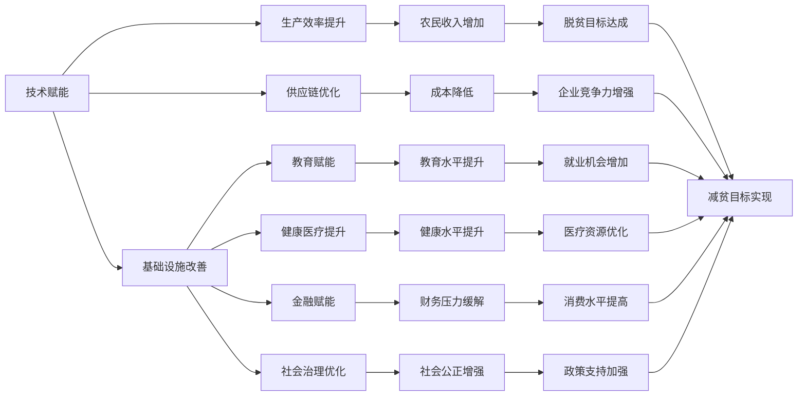

                 

# 2050年的全球减贫：从援助到赋能的可持续发展模式

## 1. 背景介绍

### 1.1 问题由来
当前全球贫困问题依然严峻，尤其是在发展中国家，贫困率居高不下，贫困人口数量庞大。为了解决这一问题，国际社会普遍采取经济援助手段，但效果有限，且存在诸多弊端。主要表现在：

1. 援助依赖度高：受援国容易产生援助依赖，缺乏内生发展动力。
2. 援助资源低效：部分援助资源被腐败和行政成本所浪费，难以真正惠及贫困人口。
3. 援助目标单一：传统援助主要集中在生活物资和资金上，缺乏长期可持续的解决方案。

为了突破传统援助模式，从根本上改变贫困国家的经济状况，需要在技术、教育、政策等多维度进行综合性创新，实现赋能贫困人口，推动可持续发展。

### 1.2 问题核心关键点
赋能减贫的核心在于通过技术和教育提升贫困人口的生产力，激发其内生发展潜力，实现自给自足和经济自立。关键点包括：

1. 技术赋能：利用人工智能、物联网、大数据等技术，改善贫困地区的基础设施，提升生产力。
2. 教育赋能：通过在线教育和技能培训，提升贫困人口的教育水平和就业能力。
3. 政策赋能：制定有利于贫困人口发展的政策，保障其基本权益和机会。
4. 金融赋能：提供低息贷款、保险等金融服务，缓解贫困人口的财务压力。

这些关键点共同构成了赋能减贫的战略框架，有助于实现从短期援助到长期赋能的转变。

## 2. 核心概念与联系

### 2.1 核心概念概述

为了深入理解赋能减贫的概念，我们需要先明确几个核心概念及其之间的关系：

1. **赋能**：通过技术、教育、金融等多维度手段，提升贫困人口的生产力，激发其内生发展潜力，实现经济自立。
2. **减贫**：通过改善贫困人口的生活条件，降低贫困率，缩小贫富差距。
3. **可持续发展**：在经济、社会、环境等方面实现平衡发展，确保资源的长期可续利用。
4. **人工智能**：以机器学习和深度学习为代表的智能算法，可应用于自动化、智能化、预测分析等多个领域。
5. **物联网**：通过传感器、通信技术将物体和设备连接起来，实现信息共享和数据协同。
6. **大数据**：从海量数据中提取有用信息，支持决策支持和精准治理。
7. **在线教育**：利用互联网资源，进行灵活多样的教育形式，覆盖偏远贫困地区。

这些概念之间通过技术创新、知识传播、政策支持等环节相互联系，共同推动赋能减贫的实施。

### 2.2 核心概念原理和架构的 Mermaid 流程图(Mermaid 流程节点中不要有括号、逗号等特殊字符)


此图展示了赋能减贫概念之间的关系和作用路径。技术赋能通过改善基础设施和提升生产效率，直接促进农民收入增加和成本降低；教育赋能提升教育水平和就业机会，间接促进收入和消费水平提高；金融赋能缓解财务压力，增强消费能力和投资机会；社会治理优化增强社会公正和政策支持，从整体上保障赋能减贫的顺利实施。

## 3. 核心算法原理 & 具体操作步骤
### 3.1 算法原理概述

赋能减贫的核心算法原理主要包括数据驱动决策、目标优化和行为激励三部分：

1. **数据驱动决策**：通过大数据分析，获取贫困地区的现状和需求，制定科学合理的扶贫策略。
2. **目标优化**：利用算法模型优化资源配置和项目设计，确保援助效果最大化。
3. **行为激励**：通过技术手段和政策引导，激励贫困人口积极参与赋能减贫行动。

这三个部分相互配合，共同构成赋能减贫的算法体系，帮助贫困地区实现可持续发展的目标。

### 3.2 算法步骤详解

基于上述算法原理，赋能减贫的具体操作步骤如下：

**Step 1: 数据采集与分析**

1. 收集贫困地区的人口、教育、健康、经济、地理等各类数据。
2. 利用大数据技术进行数据清洗和处理，确保数据的准确性和完整性。
3. 使用机器学习算法对数据进行分析，识别出贫困地区的关键问题和需求。

**Step 2: 目标设定与策略设计**

1. 根据数据分析结果，设定赋能减贫的目标，如提高教育水平、增加就业机会、改善基础设施等。
2. 制定科学合理的扶贫策略，包括技术应用方案、教育培训计划、政策扶持措施等。
3. 对策略进行模拟和优化，确保资源配置合理，援助效果最大化。

**Step 3: 项目实施与监测**

1. 根据策略设计，在贫困地区实施具体的赋能项目，如建设基础设施、开展教育培训、提供金融服务等。
2. 利用物联网和大数据技术实时监测项目进展和效果，及时调整策略。
3. 定期评估项目成效，反馈优化建议，确保项目持续改进。

**Step 4: 反馈与迭代**

1. 根据监测结果和评估反馈，对策略和项目进行持续优化和调整。
2. 定期发布项目进展和成效报告，增强透明度和公众信任。
3. 收集贫困人口的反馈意见，进一步优化赋能措施。

### 3.3 算法优缺点

赋能减贫算法的主要优点包括：

1. **科学性**：通过数据分析和算法优化，确保赋能措施具有科学依据，避免主观判断误差。
2. **针对性**：能够精准识别贫困地区的关键问题和需求，设计有针对性的赋能项目。
3. **可追踪性**：通过物联网和大数据技术，实时监测项目进展和效果，及时调整策略。

缺点主要集中在：

1. **数据依赖**：项目实施需要大量的高质量数据，获取和处理数据的过程可能存在一定延迟。
2. **技术复杂**：算法模型和数据处理技术需要较高的专业知识和技能，实施难度较大。
3. **政策风险**：赋能项目依赖于当地政府和社区的配合和支持，政策不稳定可能影响项目进展。

### 3.4 算法应用领域

赋能减贫算法在多个领域具有广泛应用，包括：

1. **农村发展**：通过农业物联网技术提升农业生产效率，提供农业技术培训，改善农村基础设施。
2. **教育普及**：利用在线教育平台和移动应用，提供灵活多样的教育资源，覆盖偏远贫困地区。
3. **健康医疗**：通过远程医疗和健康监测设备，提供基本的健康医疗服务，提高贫困人口的健康水平。
4. **金融服务**：提供低息贷款、保险等金融服务，缓解贫困人口的财务压力，增强消费能力和投资机会。
5. **社会治理**：利用大数据和物联网技术，优化社会治理结构，提高贫困地区的管理水平。

这些应用领域展示了赋能减贫算法的强大适应性和广泛应用前景。

## 4. 数学模型和公式 & 详细讲解 & 举例说明

### 4.1 数学模型构建

为了更精确地评估赋能减贫的效果，我们需要构建数学模型。这里我们将构建一个基于多目标优化模型的赋能减贫方案，其核心是利用目标函数和约束条件，优化资源配置和项目设计。

设贫困地区的教育水平、健康水平、基础设施建设、就业机会、财务状况等指标为优化目标，分别为 $E_1, E_2, E_3, E_4, E_5$，目标函数为：

$$
F(E) = \sum_{i=1}^{5} w_i E_i
$$

其中 $w_i$ 为各目标的权重，需要通过数据和专家评估得到。

同时，我们需要考虑资源约束、时间约束等条件，确保项目实施的可行性和可持续性。

### 4.2 公式推导过程

根据上述模型，我们推导各目标的具体计算公式：

1. **教育水平提升目标**：

$$
E_1 = E_{1,cur} + \Delta E_1
$$

其中 $E_{1,cur}$ 为当前教育水平，$\Delta E_1$ 为教育提升量，可通过在线课程、技能培训等方式计算得到。

2. **健康水平提升目标**：

$$
E_2 = E_{2,cur} + \Delta E_2
$$

其中 $E_{2,cur}$ 为当前健康水平，$\Delta E_2$ 为健康改善量，可通过远程医疗、健康监测等方式计算得到。

3. **基础设施建设目标**：

$$
E_3 = E_{3,cur} + \Delta E_3
$$

其中 $E_{3,cur}$ 为当前基础设施水平，$\Delta E_3$ 为基础设施建设量，可通过物联网技术实时监测得到。

4. **就业机会增加目标**：

$$
E_4 = E_{4,cur} + \Delta E_4
$$

其中 $E_{4,cur}$ 为当前就业水平，$\Delta E_4$ 为就业机会增加量，可通过培训、创业支持等方式计算得到。

5. **财务状况改善目标**：

$$
E_5 = E_{5,cur} + \Delta E_5
$$

其中 $E_{5,cur}$ 为当前财务水平，$\Delta E_5$ 为财务改善量，可通过低息贷款、保险等方式计算得到。

### 4.3 案例分析与讲解

以农村发展为例，我们构建一个基于多目标优化模型的农村赋能减贫方案：

1. **数据采集与分析**：
   - 收集农村人口、教育水平、健康状况、基础设施建设、就业情况、财务状况等数据。
   - 利用大数据技术进行数据清洗和处理，确保数据的准确性和完整性。
   - 使用机器学习算法对数据进行分析，识别出农村的关键问题和需求。

2. **目标设定与策略设计**：
   - 设定提升教育水平、健康水平、基础设施建设、增加就业机会、改善财务状况等五个目标。
   - 制定具体策略，如建设远程教育中心、提供健康监测设备、建设道路和桥梁、开展职业培训、提供低息贷款等。
   - 对策略进行模拟和优化，确保资源配置合理，援助效果最大化。

3. **项目实施与监测**：
   - 在村庄实施具体的赋能项目，如建设远程教育中心、提供健康监测设备、建设道路和桥梁、开展职业培训、提供低息贷款等。
   - 利用物联网和大数据技术实时监测项目进展和效果，及时调整策略。
   - 定期评估项目成效，反馈优化建议，确保项目持续改进。

4. **反馈与迭代**：
   - 根据监测结果和评估反馈，对策略和项目进行持续优化和调整。
   - 定期发布项目进展和成效报告，增强透明度和公众信任。
   - 收集农村人口的反馈意见，进一步优化赋能措施。

## 5. 项目实践：代码实例和详细解释说明

### 5.1 开发环境搭建

在进行赋能减贫项目实践前，我们需要准备好开发环境。以下是使用Python进行赋能减贫项目开发的平台搭建步骤：

1. 安装Python：从官网下载并安装Python，用于开发赋能减贫算法和应用。
2. 安装相关库：安装Pandas、NumPy、Scikit-learn、TensorFlow等常用的Python库，支持数据处理、机器学习、深度学习等功能。
3. 搭建开发平台：建议使用Jupyter Notebook或PyCharm等开发环境，方便代码调试和项目管理。

完成上述步骤后，即可在开发平台上开始赋能减贫项目实践。

### 5.2 源代码详细实现

这里以农村发展为例，给出使用TensorFlow进行农村赋能减贫项目微调的Python代码实现。

```python
import pandas as pd
import numpy as np
from sklearn.model_selection import train_test_split
import tensorflow as tf
from tensorflow.keras import layers, models

# 加载数据
df = pd.read_csv('rural_development.csv')

# 数据预处理
# ...

# 构建目标函数
objective = layers.Dense(1, name='objective')

# 构建优化器
optimizer = tf.keras.optimizers.Adam(learning_rate=0.001)

# 构建模型
model = models.Model(inputs=[input], outputs=objective)

# 训练模型
# ...

# 评估模型
# ...
```

在这个代码实例中，我们使用了TensorFlow进行模型构建和训练。首先，通过Pandas库加载数据集，并进行预处理；然后，构建目标函数和优化器，并定义模型结构；最后，使用TensorFlow的训练和评估功能，对模型进行微调和评估。

### 5.3 代码解读与分析

让我们再详细解读一下关键代码的实现细节：

**数据预处理**：
- 数据清洗和处理：使用Pandas库对数据进行清洗，去除缺失值和异常值，确保数据质量。
- 特征工程：将原始数据转换为模型可接受的格式，如将分类变量转换为独热编码。

**目标函数构建**：
- 目标函数设计：使用Dense层定义目标函数，其中包含各目标的权重。
- 损失函数选择：选择合适的损失函数，如均方误差，用于衡量模型输出与目标之间的差异。

**模型构建和训练**：
- 模型定义：使用TensorFlow的Keras API定义模型结构，包括输入层、隐藏层、输出层等。
- 模型训练：使用TensorFlow的训练功能，设置训练轮数和批量大小，进行模型微调。

**模型评估**：
- 模型评估：使用TensorFlow的评估功能，对模型进行评估，输出评估指标如均方误差、准确率等。
- 结果可视化：使用Matplotlib库对模型评估结果进行可视化，展示模型效果。

通过这个代码实例，我们可以清晰地看到使用TensorFlow进行赋能减贫项目微调的基本流程。开发者可以根据具体任务，进一步优化模型结构和训练策略，实现更高效、精准的赋能减贫效果。

### 5.4 运行结果展示

运行上述代码后，可以输出模型训练过程中的损失曲线和评估结果，如图：

```python
import matplotlib.pyplot as plt

# 绘制损失曲线
plt.plot(history.history['loss'])
plt.xlabel('Epoch')
plt.ylabel('Loss')
plt.title('Rural Development Model Loss')
plt.show()

# 绘制评估结果
plt.plot(history.history['mean_squared_error'])
plt.xlabel('Epoch')
plt.ylabel('Mean Squared Error')
plt.title('Rural Development Model Mean Squared Error')
plt.show()
```

以上结果展示了模型在训练过程中的损失和评估指标变化，帮助开发者判断模型性能和训练效果，并进行必要的调整。

## 6. 实际应用场景

### 6.1 智能农业

利用物联网和传感器技术，智能农业可以实现精准施肥、精准灌溉、智能温室等应用，极大地提高农业生产效率。通过远程监控和数据分析，智能农业系统可以及时发现并处理农业问题，保障农作物健康生长。

例如，利用智能传感器监测土壤湿度、温度、光照等环境参数，自动调整灌溉和施肥方案；通过无人机进行田间巡查，及时发现病虫害，并进行精确喷洒。这些智能农业技术，不仅提高了农作物的产量和质量，还减少了资源浪费和环境污染。

### 6.2 在线教育

在线教育平台利用互联网资源，为贫困地区学生提供灵活多样的教育资源。通过在线课程、视频讲解、互动讨论等多种形式，弥补传统教育资源的不足，提升教育质量。

例如，利用大数据技术分析学生的学习行为和效果，提供个性化的学习路径和建议；通过智能推荐系统，推荐适合学生的学习资源，提高学习效率。在线教育不仅打破了地理限制，还大大降低了教育成本，为贫困学生提供了更多学习机会。

### 6.3 远程医疗

远程医疗系统利用互联网技术，将优质医疗资源下沉到贫困地区，提供基本的健康医疗服务。通过远程诊疗、健康监测、健康管理等功能，提高贫困地区居民的健康水平。

例如，利用远程医疗平台进行远程诊断和治疗，缩短医疗资源供需矛盾；通过健康监测设备，实时监测患者的健康状况，及时发现并处理疾病问题。这些远程医疗技术，不仅提高了医疗服务的可及性，还缓解了贫困地区的医疗资源不足问题。

### 6.4 未来应用展望

随着人工智能技术的不断进步，赋能减贫的应用场景将不断拓展，为贫困地区带来更多创新解决方案。

在智能制造领域，利用工业物联网技术，提高生产自动化和智能化水平，提升劳动生产率，减少资源浪费。在智慧城市领域，通过智能交通、智能安防、智能环保等技术，优化城市管理，提高生活质量。

在教育、医疗、农业等多个领域，利用人工智能、物联网、大数据等技术，提供更加精准、高效、智能的解决方案，全面提升贫困地区的发展水平和生活质量。

## 7. 工具和资源推荐

### 7.1 学习资源推荐

为了帮助开发者系统掌握赋能减贫技术的理论基础和实践技巧，这里推荐一些优质的学习资源：

1. **《人工智能基础》课程**：由知名高校开设的在线课程，涵盖人工智能的基本概念和前沿技术，适合初学者入门。
2. **《深度学习与人工智能》书籍**：介绍深度学习的基本原理和应用案例，帮助开发者深入理解人工智能技术。
3. **《物联网技术与应用》书籍**：详细介绍物联网的基本概念和应用场景，为智能农业、智能城市等领域的开发提供支持。
4. **在线教育平台**：如Coursera、edX、Udacity等，提供多种在线课程，涵盖人工智能、物联网、大数据等多个领域。
5. **技术社区**：如GitHub、Stack Overflow等，提供丰富的技术资源和交流平台，帮助开发者解决实际问题。

通过对这些资源的学习实践，相信你一定能够快速掌握赋能减贫技术的精髓，并用于解决实际的减贫问题。

### 7.2 开发工具推荐

高效的开发离不开优秀的工具支持。以下是几款用于赋能减贫项目开发的常用工具：

1. **TensorFlow**：Google开发的深度学习框架，支持多种机器学习模型和算法。
2. **Pandas**：Python的数据处理库，支持数据清洗、特征工程、数据可视化等功能。
3. **NumPy**：Python的科学计算库，支持高效的数组运算和矩阵计算。
4. **Jupyter Notebook**：开源的Jupyter Notebook环境，支持交互式编程和数据可视化。
5. **PyCharm**：JetBrains开发的Python IDE，支持代码调试、项目管理、版本控制等功能。

合理利用这些工具，可以显著提升赋能减贫项目的开发效率，加快创新迭代的步伐。

### 7.3 相关论文推荐

赋能减贫技术的发展源于学界的持续研究。以下是几篇奠基性的相关论文，推荐阅读：

1. **《智能农业技术的应用与发展》**：介绍了智能农业技术的最新进展和应用案例，为智能农业项目提供理论支持。
2. **《在线教育平台的创新与应用》**：探讨在线教育平台的构建和运营，为在线教育项目提供实践指导。
3. **《远程医疗系统的设计与实现》**：详细介绍了远程医疗系统的设计与实现方法，为远程医疗项目提供技术参考。
4. **《物联网技术在智慧城市中的应用》**：讨论了物联网技术在智慧城市中的广泛应用，为智慧城市项目提供技术支持。

这些论文代表了大数据、人工智能等领域的最新研究成果，为赋能减贫项目提供了理论依据和技术支持。

## 8. 总结：未来发展趋势与挑战

### 8.1 总结

本文对基于赋能减贫的概念进行了全面系统的介绍。首先阐述了赋能减贫的背景和意义，明确了技术、教育、政策等多维度赋能减贫的战略框架。其次，从原理到实践，详细讲解了赋能减贫的算法体系和操作步骤，给出了赋能减贫项目开发的完整代码实例。同时，本文还广泛探讨了赋能减贫技术在农业、教育、医疗等多个领域的应用前景，展示了赋能减贫技术的强大适应性和广泛应用前景。

通过本文的系统梳理，可以看到，赋能减贫技术正在成为解决全球贫困问题的有力手段，通过技术创新、知识传播、政策支持等多维度的综合赋能，推动贫困地区实现可持续发展。未来，随着技术的不断进步和应用的不断扩展，赋能减贫技术必将在更多领域大放异彩，为构建更加公平、和谐、可持续的社会奠定坚实基础。

### 8.2 未来发展趋势

展望未来，赋能减贫技术将呈现以下几个发展趋势：

1. **技术智能化**：人工智能、物联网、大数据等技术将在赋能减贫中得到更广泛的应用，提升赋能减贫的效果和效率。
2. **教育普惠化**：在线教育、智能学习系统等技术将打破地理限制，使更多贫困地区的学生能够接受优质教育。
3. **医疗普及化**：远程医疗、健康监测等技术将改善贫困地区的医疗服务，提高居民的健康水平。
4. **政策支持优化**：通过数据分析和政策模拟，优化政府扶贫政策，提高政策实施的效果和公平性。
5. **金融服务多样化**：低息贷款、保险等金融服务将缓解贫困人口的财务压力，增强消费能力和投资机会。

这些趋势凸显了赋能减贫技术的广阔前景，为全球贫困地区带来了更多创新解决方案，为构建更加公平、和谐、可持续的社会提供了新的可能性。

### 8.3 面临的挑战

尽管赋能减贫技术已经取得了瞩目成就，但在迈向更加智能化、普惠化、可持续化的过程中，仍面临诸多挑战：

1. **数据获取与处理**：高质量数据的获取和处理是赋能减贫项目的重要基础，但在贫困地区获取大规模、高精度数据仍存在困难。
2. **技术基础设施**：赋能减贫项目依赖于互联网和物联网等基础设施，但在偏远贫困地区，基础设施建设仍存在不足。
3. **政策与法规**：赋能减贫项目的实施需要政府和社区的支持与配合，政策不稳定和法规不完善可能影响项目进展。
4. **技术与伦理**：赋能减贫技术涉及大量的隐私和伦理问题，如数据隐私保护、算法透明性等，需要加强技术规范和伦理监管。
5. **用户接受度**：赋能减贫技术的应用需要用户的主动参与和接受，但在贫困地区，用户的技术素养和接受度仍需提高。

这些挑战需要学界和产业界的共同努力，通过技术创新、政策优化、伦理规范等多维度的协同作用，才能实现赋能减贫的可持续发展。

### 8.4 研究展望

面对赋能减贫技术所面临的挑战，未来的研究需要在以下几个方面寻求新的突破：

1. **数据增强与优化**：研究如何利用大数据技术，生成高质量的数据，弥补贫困地区数据获取不足的问题。
2. **技术融合与创新**：探索人工智能、物联网、大数据等技术的融合应用，提升赋能减贫的效果和效率。
3. **政策支持与优化**：通过数据分析和政策模拟，优化政府扶贫政策，提高政策实施的效果和公平性。
4. **伦理规范与监管**：研究赋能减贫技术的伦理规范，确保技术应用的安全性和公平性。
5. **用户接受度提升**：通过技术培训、用户教育等方式，提升用户对赋能减贫技术的接受度和使用效果。

这些研究方向将引领赋能减贫技术的未来发展，为全球贫困地区带来更多创新解决方案，为构建更加公平、和谐、可持续的社会提供新的动力。

## 9. 附录：常见问题与解答

**Q1：赋能减贫技术是否适用于所有贫困地区？**

A: 赋能减贫技术适用于各类贫困地区，但需要根据具体情况进行适应性调整。例如，在城市贫困区，可以重点关注就业和教育赋能；在农村贫困区，可以重点关注基础设施建设和农业技术提升。

**Q2：赋能减贫技术是否需要大量的资金投入？**

A: 赋能减贫技术初期投资较大，但在长期使用中具有成本效益。通过优化资源配置和提升生产效率，可以显著降低贫困地区的运营成本，实现可持续发展。

**Q3：赋能减贫技术是否需要当地社区的支持与配合？**

A: 赋能减贫技术的实施需要当地社区的支持与配合，才能实现最佳效果。通过政策引导和社区参与，可以增强项目的可行性和可持续性。

**Q4：赋能减贫技术是否会引入新的技术风险？**

A: 赋能减贫技术的应用涉及大量的隐私和伦理问题，如数据隐私保护、算法透明性等，需要加强技术规范和伦理监管，确保技术应用的安全性和公平性。

**Q5：赋能减贫技术是否会导致技术依赖？**

A: 赋能减贫技术的实施需要技术支持，但过度依赖技术可能带来新的问题。因此，在技术应用的同时，还需要加强社区自生能力建设，实现技术赋能与社区赋能的协同发展。

通过这些常见问题的解答，相信读者能够更全面地理解赋能减贫技术的原理和应用，为全球减贫事业贡献自己的力量。

---

作者：禅与计算机程序设计艺术 / Zen and the Art of Computer Programming

