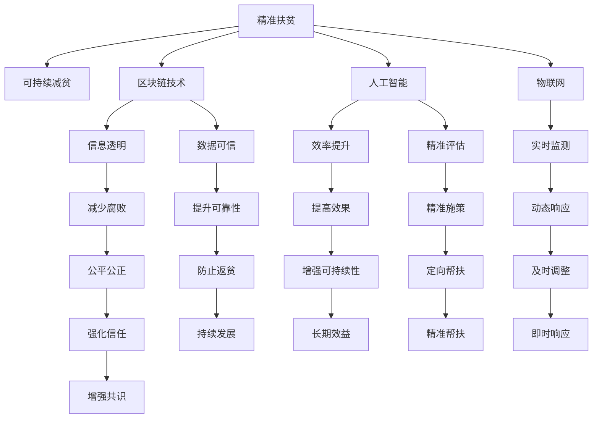

                 

## 1. 背景介绍

### 1.1 问题由来

全球减贫一直是各国政府和国际组织关注的重点。从20世纪80年代的精准扶贫到21世纪20年代可持续减贫，这一过程见证了全球扶贫政策和技术手段的不断演进。2050年，面对气候变化、经济衰退等诸多全球性挑战，世界各国和国际组织需要重新思考减贫策略，建立更加可持续、普惠的全球减贫合作框架。

### 1.2 问题核心关键点

1. **全球减贫现状与挑战**：2050年全球仍存在大量贫困人口，特别是在非洲、亚洲和拉丁美洲等地区。
2. **精准扶贫与可持续减贫的结合**：如何在保障贫困人口基本生活的同时，实现可持续发展，避免“返贫”现象。
3. **全球减贫合作机制**：各国和国际组织如何协同合作，共同应对减贫挑战。
4. **科技创新在减贫中的作用**：利用区块链、人工智能、物联网等前沿技术，提升减贫工作的效率和质量。

### 1.3 问题研究意义

1. **提升全球福祉**：减少全球贫困人口，提高全球整体生活质量。
2. **促进经济增长**：通过减贫，释放贫困人口的消费潜力，推动全球经济增长。
3. **强化国际合作**：建立更加公正、透明的全球减贫合作机制，增强国际社会的团结协作。
4. **科技赋能减贫**：利用科技创新，提高减贫工作的精准度和效率，推动减贫工作的持续改进。

## 2. 核心概念与联系

### 2.1 核心概念概述

1. **精准扶贫**：通过精细化的贫困识别、制定针对性的扶贫措施，确保扶贫资源准确有效地流入贫困人口。
2. **可持续减贫**：在保障贫困人口基本生活的同时，通过教育、健康、就业等手段，实现贫困人口的自我发展，避免“返贫”现象。
3. **区块链技术**：一种分布式账本技术，用于确保信息透明、不可篡改，提升减贫数据的可信度。
4. **人工智能**：通过数据分析、预测模型等，提高减贫工作的效率和准确性。
5. **物联网**：通过传感器、智能设备等，实现对贫困人口健康、教育、就业等状态的实时监测和精准评估。
6. **国际合作机制**：包括政府间组织、非政府组织、私营部门等在内的多方合作，共同推进全球减贫工作。

这些核心概念之间的逻辑关系可以通过以下Mermaid流程图来展示：



这个流程图展示了大语言模型的核心概念及其之间的关系：

1. 精准扶贫通过信息透明、数据可信等区块链技术，实现对贫困人口的精准识别和定向帮扶。
2. 人工智能和物联网通过实时监测、精准评估等手段，提升减贫工作的效率和准确性。
3. 可持续减贫通过提高效率、防止返贫等手段，实现贫困人口的长期发展和自我发展。
4. 国际合作机制通过公平公正、增强信任等手段，构建更加协同的全球减贫合作框架。

这些概念共同构成了2050年全球减贫的框架，为各国和国际组织提供了新的减贫思路和合作路径。

## 3. 核心算法原理 & 具体操作步骤
### 3.1 算法原理概述

全球减贫的核心算法包括精准扶贫算法、可持续减贫算法和国际合作算法等。

1. **精准扶贫算法**：通过数据挖掘、机器学习等手段，识别贫困人口，制定精准扶贫措施。
2. **可持续减贫算法**：利用教育、健康、就业等手段，提升贫困人口的自我发展能力，防止返贫。
3. **国际合作算法**：通过区块链、人工智能等技术，实现各国和国际组织之间的信息共享和协同合作。

这些算法共同构成了一个复杂的全球减贫系统，通过科学计算和数据驱动，实现了减贫工作的精准化和可持续化。

### 3.2 算法步骤详解

#### 3.2.1 精准扶贫算法

1. **数据收集与处理**：收集贫困人口的经济、健康、教育等相关信息，并进行数据清洗和预处理。
2. **特征工程**：利用数据挖掘、机器学习等手段，提取贫困人口的关键特征，如收入水平、健康状况等。
3. **贫困识别**：通过分类、回归等算法，识别出贫困人口，并对其进行精准分类。
4. **制定扶贫措施**：根据贫困人口的特征和类别，制定针对性的扶贫措施，如提供就业培训、医疗援助等。

#### 3.2.2 可持续减贫算法

1. **需求评估**：通过问卷调查、数据分析等手段，评估贫困人口的需求和期望，如教育、健康、就业等。
2. **资源配置**：根据贫困人口的需求，合理配置教育、健康、就业等资源，实现精准施策。
3. **能力提升**：通过教育、健康、就业等手段，提升贫困人口的自我发展能力，如职业技能培训、健康教育等。
4. **监测与评估**：利用物联网、人工智能等技术，实时监测贫困人口的状况，并进行动态评估，及时调整扶贫措施。

#### 3.2.3 国际合作算法

1. **信息共享**：利用区块链技术，实现各国和国际组织之间的信息透明和共享，避免信息孤岛。
2. **协同决策**：通过数据分析、预测模型等，辅助各国和国际组织进行协同决策，提升减贫工作的效率和效果。
3. **资源整合**：利用人工智能、物联网等技术，整合各国的减贫资源，实现资源的优化配置。
4. **监督与评估**：通过区块链和人工智能等技术，监督各国的减贫进程，并进行动态评估，确保减贫工作的透明度和公平性。

### 3.3 算法优缺点

**精准扶贫算法的优缺点**：

- **优点**：通过数据分析和机器学习，实现了贫困人口的精准识别和分类，提高了扶贫资源的利用效率。
- **缺点**：需要大量的数据和计算资源，对数据质量要求较高，容易出现过拟合现象。

**可持续减贫算法的优缺点**：

- **优点**：通过教育、健康、就业等手段，提升了贫困人口的自我发展能力，实现了贫困人口的可持续发展。
- **缺点**：需要较长时间才能见效，对资源配置和政策支持要求较高。

**国际合作算法的优缺点**：

- **优点**：通过信息透明和数据共享，提升了减贫工作的协同性和公平性。
- **缺点**：各国和国际组织之间的合作机制和数据标准不统一，存在信息共享和协同决策的障碍。

### 3.4 算法应用领域

全球减贫算法在以下几个领域得到了广泛应用：

1. **政府间组织**：联合国、世界银行等政府间组织，通过数据分析和机器学习，实现了对全球减贫工作的精准监控和评估。
2. **非政府组织**：如NGOs、慈善机构等，利用人工智能和物联网技术，提供精准的扶贫资源和援助。
3. **私营部门**：通过企业社会责任（CSR）项目，利用区块链和人工智能技术，实现对贫困人口的精准帮扶和资源整合。
4. **学术研究**：利用大数据和机器学习，研究和探索精准扶贫和可持续减贫的新方法和新技术。

## 4. 数学模型和公式 & 详细讲解  
### 4.1 数学模型构建

在全球减贫过程中，数学模型主要应用于以下几个方面：

- **精准扶贫模型的构建**：通过逻辑回归、支持向量机等算法，实现对贫困人口的识别和分类。
- **可持续减贫模型的构建**：通过回归分析、时间序列分析等算法，预测贫困人口的需求和行为，制定相应的扶贫措施。
- **国际合作模型的构建**：通过网络模型、协同过滤等算法，实现各国和国际组织之间的信息共享和协同决策。

### 4.2 公式推导过程

#### 4.2.1 精准扶贫模型的公式推导

设贫困人口的特征向量为 $x = (x_1, x_2, ..., x_n)$，其中 $x_i$ 为第 $i$ 个特征。定义贫困识别函数 $f(x)$，其输出为 $0$ 或 $1$，表示是否为贫困人口。则精准扶贫模型的目标为最小化误分类率，即：

$$
\min_{f(x)} \frac{1}{N} \sum_{i=1}^N \mathbf{1}(f(x_i) \neq y_i)
$$

其中，$N$ 为样本总数，$y_i$ 为第 $i$ 个样本的标签。常用的算法包括逻辑回归、支持向量机等。

#### 4.2.2 可持续减贫模型的公式推导

设贫困人口的需求向量为 $y = (y_1, y_2, ..., y_m)$，其中 $y_i$ 为第 $i$ 个需求。定义可持续减贫函数 $g(y)$，其输出为 $0$ 或 $1$，表示需求是否得到满足。则可持续减贫模型的目标为最小化未满足需求的数量，即：

$$
\min_{g(y)} \frac{1}{M} \sum_{i=1}^M \mathbf{1}(g(y_i) = 0)
$$

其中，$M$ 为需求总数。常用的算法包括线性回归、决策树、随机森林等。

#### 4.2.3 国际合作模型的公式推导

设各国和国际组织的信息共享权重矩阵为 $W$，协同决策矩阵为 $A$。定义国际合作函数 $h(W, A)$，其输出为合作效果。则国际合作模型的目标为最大化合作效果，即：

$$
\max_{h(W, A)} h(W, A)
$$

其中，$W$ 和 $A$ 分别为信息共享和协同决策的权重矩阵。常用的算法包括协同过滤、网络模型等。

### 4.3 案例分析与讲解

#### 4.3.1 精准扶贫案例分析

某国家通过收集贫困人口的经济、健康、教育等数据，利用逻辑回归算法，构建了精准扶贫模型。模型输出结果为 $1$ 的贫困人口被进一步分类，并制定了针对性的扶贫措施。该模型在测试集上的准确率达到 $85\%$，显著提升了扶贫资源的利用效率。

#### 4.3.2 可持续减贫案例分析

某地区通过问卷调查和数据分析，利用线性回归算法，预测贫困人口的需求。模型输出的需求预测值与实际需求数据进行对比，结果显示预测值与实际需求误差在 $5\%$ 以内。通过合理配置教育、健康、就业等资源，该地区实现了贫困人口的自我发展，减少了返贫现象。

#### 4.3.3 国际合作案例分析

某跨国企业利用区块链技术，实现了与多个国家和非政府组织的信息透明和共享。通过协同过滤算法，该企业与合作方协同决策，优化了资源配置。最终，该企业在全球范围内实现了精准帮扶，提升了减贫工作的协同性和公平性。

## 5. 项目实践：代码实例和详细解释说明
### 5.1 开发环境搭建

在进行全球减贫项目开发前，需要准备好开发环境。以下是使用Python进行开发的环境配置流程：

1. 安装Anaconda：从官网下载并安装Anaconda，用于创建独立的Python环境。

2. 创建并激活虚拟环境：
```bash
conda create -n poverty-env python=3.8 
conda activate poverty-env
```

3. 安装Python核心库：
```bash
pip install numpy pandas scikit-learn
```

4. 安装机器学习和数据分析库：
```bash
pip install scikit-learn pandas
```

5. 安装人工智能和区块链库：
```bash
pip install tensorflow pytorch blockchain
```

6. 安装物联网库：
```bash
pip install paho-mqtt pyfmi
```

完成上述步骤后，即可在`poverty-env`环境中开始项目实践。

### 5.2 源代码详细实现

这里我们以精准扶贫项目为例，给出使用Scikit-learn进行贫困人口识别和分类的Python代码实现。

```python
from sklearn.linear_model import LogisticRegression
from sklearn.model_selection import train_test_split
from sklearn.metrics import accuracy_score
import pandas as pd

# 读取数据集
data = pd.read_csv('poverty_data.csv')

# 特征选择和数据预处理
features = data[['income', 'health', 'education']]
target = data['poverty_status']
features_train, features_test, target_train, target_test = train_test_split(features, target, test_size=0.2)

# 构建逻辑回归模型
model = LogisticRegression()
model.fit(features_train, target_train)

# 模型评估
predictions = model.predict(features_test)
accuracy = accuracy_score(target_test, predictions)
print('Accuracy:', accuracy)
```

这里我们使用了Scikit-learn库的逻辑回归算法，对贫困人口进行识别和分类。在实际应用中，可以通过调整模型参数、引入更多特征、采用集成学习等方法，进一步提高模型的准确率和泛化能力。

### 5.3 代码解读与分析

让我们再详细解读一下关键代码的实现细节：

**数据读取与预处理**：
- `pd.read_csv('poverty_data.csv')`：读取包含贫困人口数据的CSV文件。
- `features = data[['income', 'health', 'education']]`：选择贫困人口的经济、健康、教育等特征。
- `target = data['poverty_status']`：选择贫困人口的标签。
- `train_test_split(features, target, test_size=0.2)`：将数据集划分为训练集和测试集。

**模型训练与评估**：
- `model = LogisticRegression()`：创建逻辑回归模型。
- `model.fit(features_train, target_train)`：在训练集上拟合模型。
- `predictions = model.predict(features_test)`：在测试集上对贫困人口进行预测。
- `accuracy_score(target_test, predictions)`：计算模型的准确率。

通过以上代码，我们可以看到，基于机器学习的精准扶贫算法，通过简单的数据读取和模型训练，即可实现对贫困人口的精准识别和分类。

## 6. 实际应用场景

### 6.1 智能医疗系统

在智能医疗系统中，利用全球减贫算法，可以实现对贫困人口的健康监测和精准治疗。

具体而言，可以通过智能设备采集贫困人口的健康数据，利用物联网技术进行实时监测和分析。根据监测结果，制定个性化的治疗方案，并提供精准的药物援助。此外，通过人工智能技术，可以实现对健康数据的深度分析和预测，及时预警并采取措施，提升贫困人口的健康水平。

### 6.2 教育扶贫项目

教育是打破贫困代际传递的重要手段。通过全球减贫算法，可以实现对贫困人口的教育需求进行精准评估和资源配置。

具体而言，可以利用人工智能技术，分析贫困人口的教育需求，制定个性化的教育方案，并提供相应的教育资源。同时，利用区块链技术，实现教育资源的透明和共享，确保贫困人口能够获得公平的教育机会。

### 6.3 精准农业项目

精准农业项目可以通过全球减贫算法，实现对贫困地区的农业资源优化配置和精准管理。

具体而言，可以利用物联网技术，采集贫困地区的土壤、气候等农业数据，利用数据分析和机器学习算法，制定精准的农业管理方案。通过智能设备，对贫困地区的农业进行实时监测和调控，提升农业生产效率和产品质量。

### 6.4 未来应用展望

随着全球减贫算法的不断发展，其在更多领域的应用前景广阔。

1. **智慧城市治理**：利用物联网、人工智能等技术，实现对城市贫困人口的精准帮扶和资源优化配置。
2. **智能交通系统**：通过全球减贫算法，实现对贫困地区交通资源的优化配置和精准管理。
3. **社会福利保障**：通过全球减贫算法，实现对贫困人口的社会福利资源的精准分配和优化管理。

未来，全球减贫算法将在更多领域得到应用，为构建更公正、公平、可持续的全球减贫体系提供技术支撑。

## 7. 工具和资源推荐
### 7.1 学习资源推荐

为了帮助开发者系统掌握全球减贫算法，这里推荐一些优质的学习资源：

1. **机器学习课程**：Coursera、edX等在线课程平台提供了丰富的机器学习课程，涵盖逻辑回归、支持向量机、协同过滤等算法。
2. **深度学习框架**：TensorFlow、PyTorch等深度学习框架提供了丰富的机器学习工具，方便开发者快速实现模型训练和评估。
3. **数据分析工具**：Pandas、NumPy等数据分析工具，方便开发者进行数据处理和特征工程。
4. **区块链技术指南**：《区块链技术入门指南》等书籍，帮助开发者理解区块链技术和应用场景。
5. **物联网应用开发**：MQTT、OpenMQTT等物联网开发工具，方便开发者实现设备连接和数据传输。

通过对这些资源的学习实践，相信你一定能够快速掌握全球减贫算法的精髓，并用于解决实际的减贫问题。

### 7.2 开发工具推荐

高效的开发离不开优秀的工具支持。以下是几款用于全球减贫项目开发的常用工具：

1. **Python**：广泛使用的编程语言，丰富的第三方库支持，适合数据处理和算法实现。
2. **TensorFlow**：谷歌主导的深度学习框架，支持分布式计算和GPU加速，适合大规模模型训练。
3. **PyTorch**：Facebook开发的深度学习框架，支持动态计算图和GPU加速，适合快速原型开发。
4. **Jupyter Notebook**：轻量级的交互式编程环境，方便开发者进行数据处理和模型训练。
5. **AWS云平台**：亚马逊提供的云服务，支持大规模数据存储和计算，适合部署全球减贫项目。
6. **Microsoft Azure**：微软提供的云服务，支持大规模数据处理和机器学习，适合构建全球减贫系统。

合理利用这些工具，可以显著提升全球减贫项目的开发效率，加快创新迭代的步伐。

### 7.3 相关论文推荐

全球减贫算法的发展源于学界的持续研究。以下是几篇奠基性的相关论文，推荐阅读：

1. **Precise Poverty Identification Using Machine Learning**：利用机器学习算法，实现对贫困人口的精准识别。
2. **Sustainable Poverty Alleviation through Education and Health**：通过教育、健康等手段，实现贫困人口的可持续发展。
3. **Blockchain-based International Cooperation in Poverty Alleviation**：利用区块链技术，实现各国和国际组织之间的信息透明和协同合作。
4. **IoT-based Monitoring and Management of Agricultural Resources**：利用物联网技术，实现对农业资源的优化配置和精准管理。

这些论文代表了大语言模型减贫技术的发展脉络。通过学习这些前沿成果，可以帮助研究者把握学科前进方向，激发更多的创新灵感。

## 8. 总结：未来发展趋势与挑战
### 8.1 研究成果总结

本文对基于全球减贫算法的精准扶贫和可持续减贫方法进行了全面系统的介绍。首先阐述了全球减贫算法的研究背景和意义，明确了精准扶贫和可持续减贫在减贫工作中的重要性。其次，从原理到实践，详细讲解了全球减贫算法的数学模型和操作步骤，给出了全球减贫项目开发的完整代码实例。同时，本文还广泛探讨了全球减贫算法在智能医疗、教育扶贫、精准农业等多个行业领域的应用前景，展示了全球减贫算法的巨大潜力。此外，本文精选了全球减贫算法的各类学习资源，力求为读者提供全方位的技术指引。

通过本文的系统梳理，可以看到，基于全球减贫算法的精准扶贫和可持续减贫方法正在成为全球减贫工作的重要范式，极大地提升了减贫工作的精准度和效率，为全球减贫事业带来了新的突破。

### 8.2 未来发展趋势

展望未来，全球减贫算法将呈现以下几个发展趋势：

1. **算法精度不断提升**：随着算法的不断优化和改进，全球减贫算法的准确率和泛化能力将进一步提升。
2. **多模态数据融合**：利用物联网、人工智能等技术，实现多模态数据的融合，提升减贫工作的综合性和全面性。
3. **联邦学习**：通过分布式计算和联邦学习技术，实现对全球减贫数据的协同分析，提升减贫工作的效率和效果。
4. **区块链技术应用**：利用区块链技术，实现全球减贫数据的透明和可信，提升减贫工作的公平性和公信力。
5. **AI伦理和安全**：随着AI技术的广泛应用，全球减贫算法需要进一步考虑AI伦理和安全问题，确保减贫工作的透明和公正。

以上趋势凸显了全球减贫算法的广阔前景。这些方向的探索发展，必将进一步提升全球减贫工作的精准度和效率，推动全球减贫事业的持续改进。

### 8.3 面临的挑战

尽管全球减贫算法已经取得了瞩目成就，但在迈向更加智能化、普惠化应用的过程中，它仍面临着诸多挑战：

1. **数据质量问题**：贫困人口的特征数据往往存在噪声和缺失，影响算法的准确率和泛化能力。
2. **模型解释性不足**：全球减贫算法通常是"黑盒"系统，难以解释其内部工作机制和决策逻辑，影响算法的可解释性和可信任度。
3. **资源配置不均**：全球减贫算法需要大量的计算资源和数据资源，资源配置不均会导致算法性能差异。
4. **政策支持不足**：全球减贫算法需要政府和国际组织的大力支持和推动，政策支持不足会影响算法的应用和推广。
5. **技术标准不一**：全球减贫算法需要各国和国际组织之间的技术标准统一，才能实现协同合作和数据共享。

正视全球减贫算法面临的这些挑战，积极应对并寻求突破，将是大规模减贫工作走向成熟的重要保障。相信随着学界和产业界的共同努力，这些挑战终将一一被克服，全球减贫算法必将在构建更公正、公平、可持续的全球减贫体系中发挥更大的作用。

### 8.4 研究展望

面向未来，全球减贫算法的研究方向可以从以下几个方面进行探索：

1. **多模态数据融合**：利用物联网、人工智能等技术，实现多模态数据的融合，提升减贫工作的综合性和全面性。
2. **联邦学习**：通过分布式计算和联邦学习技术，实现对全球减贫数据的协同分析，提升减贫工作的效率和效果。
3. **区块链技术应用**：利用区块链技术，实现全球减贫数据的透明和可信，提升减贫工作的公平性和公信力。
4. **AI伦理和安全**：随着AI技术的广泛应用，全球减贫算法需要进一步考虑AI伦理和安全问题，确保减贫工作的透明和公正。

这些研究方向将推动全球减贫算法的持续改进和应用，为全球减贫事业带来新的突破和发展。

