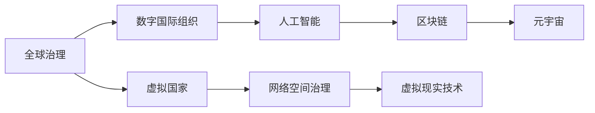

                 

# 2050年的全球治理：从数字国际组织到虚拟国家的全球政治格局重塑

> 关键词：全球治理, 数字国际组织, 虚拟国家, 人工智能, 网络空间治理, 虚拟现实技术, 元宇宙, 区块链

## 1. 背景介绍

### 1.1 问题由来

进入21世纪以来，随着科技的飞速发展，全球化进程加速，全球治理面临着前所未有的挑战。经济全球化、文化多样性、环境恶化、公共卫生危机、气候变化、网络安全、跨国犯罪等问题的日益突出，要求各国加强合作，共同应对。

然而，传统的国家主权、国际组织和跨国公司的治理模式，难以适应日益复杂的全球性问题。此外，随着数字技术尤其是人工智能、区块链和虚拟现实技术的普及，治理方式和治理工具正在发生革命性变化。

为应对未来挑战，本报告将探讨从数字国际组织到虚拟国家，全球治理的新格局。通过描述数字治理的演变，分析未来可能出现的虚拟国家，提出应对策略，以期对全球治理提供新视角和新思路。

### 1.2 问题核心关键点

本报告将重点分析以下几个关键问题：

- **数字国际组织的兴起与挑战**：分析数字国际组织如联合国数字化、世界贸易组织数字化等的发展趋势和面临的挑战。
- **虚拟国家的概念与模型**：讨论虚拟国家的基本概念、模型构建及其对全球治理的影响。
- **全球治理的未来发展趋势**：预测未来全球治理可能走向的几种趋势，如数字治理、去中心化治理、多方共治等。
- **虚拟国家应对策略**：提出在虚拟国家构想下，各国政府、国际组织和民众应采取的应对策略。

### 1.3 问题研究意义

本报告的研究意义在于：

- **推动全球治理创新**：探索未来治理模式，为全球治理带来新思路，提升治理效率。
- **应对未来挑战**：预测未来全球性问题的发展趋势，制定应对策略，增强全球应对能力。
- **促进技术应用**：探讨人工智能、区块链等新兴技术在治理中的应用，推动技术创新。

## 2. 核心概念与联系

### 2.1 核心概念概述

本报告涉及以下几个核心概念：

- **全球治理**：指在全球范围内协调各国政策和行动，共同应对全球性问题。
- **数字国际组织**：指利用数字技术，特别是互联网和数据平台，实现跨国信息交流、政策协调和共同决策的国际组织。
- **虚拟国家**：指基于虚拟现实技术，在网络空间中构建的具有一定自治权和主权的虚拟实体。
- **人工智能**：指通过算法和大数据技术，实现智能决策和自动化管理的系统。
- **网络空间治理**：指通过法律、技术和社会手段，维护网络空间秩序和安全，保护数字权利的治理方式。

这些概念之间的关系可以通过以下Mermaid流程图来展示：



这个流程图展示了几者之间的联系：

1. 全球治理通过数字国际组织，利用人工智能和区块链等技术进行治理。
2. 虚拟国家是数字国际组织的一种高级形式，通过虚拟现实技术在网络空间中实现。
3. 虚拟国家需要通过区块链和元宇宙技术，实现网络空间治理。

## 3. 核心算法原理 & 具体操作步骤

### 3.1 算法原理概述

数字国际组织和虚拟国家的构建，主要依赖于网络空间治理技术，如区块链、人工智能和虚拟现实技术。这些技术的原理和应用场景如下：

- **区块链技术**：通过分布式账本、共识机制和智能合约，实现去中心化的数据管理和交易安全。
- **人工智能**：通过机器学习、深度学习和大数据技术，实现智能决策和自动化管理。
- **虚拟现实技术**：通过虚拟环境和沉浸式交互，实现网络空间中的模拟环境和决策过程。

这些技术通过协同工作，共同构建起数字国际组织和虚拟国家的治理框架。

### 3.2 算法步骤详解

**Step 1: 技术选型与规划**

- **数字国际组织**：选择合适的区块链平台，如Ethereum、Hyperledger等，设计组织结构和治理规则，确定智能合约和共识机制。
- **虚拟国家**：选择虚拟现实平台，如Meta的Horizon、Microsoft的Mixed Reality等，构建虚拟国家的基本设施和治理框架。

**Step 2: 数据管理与共享**

- **数字国际组织**：利用区块链技术实现数据的透明、安全共享，建立数据标准和协议。
- **虚拟国家**：通过虚拟现实技术，实现虚拟国家内部和外部的数据交互，建立数据治理规则。

**Step 3: 智能决策与执行**

- **数字国际组织**：利用人工智能算法，对大数据进行分析和预测，辅助决策制定。
- **虚拟国家**：通过虚拟现实技术，模拟决策过程，进行虚拟测试和优化。

**Step 4: 法律与规则制定**

- **数字国际组织**：制定基于区块链的智能合约，自动执行和验证，确保规则的公正和透明。
- **虚拟国家**：通过虚拟现实技术，制定和推广虚拟国家的法律和规则，进行虚拟审判和裁决。

**Step 5: 用户参与与反馈**

- **数字国际组织**：利用人工智能和大数据分析，收集用户反馈，进行动态调整和优化。
- **虚拟国家**：通过虚拟现实技术，实时交互和反馈，调整虚拟国家的治理策略。

**Step 6: 安全与隐私保护**

- **数字国际组织**：利用区块链和人工智能技术，保护数据和交易的安全，防止隐私泄露。
- **虚拟国家**：通过虚拟现实技术和区块链技术，实现网络空间的安全和隐私保护。

### 3.3 算法优缺点

数字国际组织和虚拟国家的构建，具有以下优点：

- **透明度和可追溯性**：通过区块链技术，实现数据的透明和可追溯。
- **去中心化和自治**：利用去中心化技术，实现自治和分布式决策。
- **高效和灵活**：利用人工智能和虚拟现实技术，实现高效的智能决策和灵活的治理模式。

同时，这些方法也存在一些局限性：

- **技术复杂度高**：构建数字国际组织和虚拟国家需要多种技术的协同工作，技术复杂度高。
- **成本和资源消耗**：大规模应用需要大量的计算和存储资源，成本较高。
- **安全性和隐私问题**：如何确保数据安全和隐私保护，是一个复杂且挑战性的问题。

### 3.4 算法应用领域

数字国际组织和虚拟国家的构建，已经在多个领域得到应用：

- **国际组织**：联合国数字化、世界贸易组织数字化等，通过区块链技术实现跨国政策协调和共同决策。
- **虚拟国家**：Cyberia等虚拟国家，通过虚拟现实技术和区块链技术，实现虚拟自治和治理。
- **网络空间治理**：欧盟的数字身份验证系统、美国的虚拟现实治理等，利用人工智能和区块链技术维护网络空间秩序和安全。

这些应用展示了数字国际组织和虚拟国家的广阔前景和应用潜力。

## 4. 数学模型和公式 & 详细讲解 & 举例说明

### 4.1 数学模型构建

数字国际组织和虚拟国家的构建，涉及到多个数学模型和技术原理，包括区块链、人工智能和虚拟现实技术。这里以区块链和人工智能为例，进行详细讲解。

**区块链模型**：

- **分布式账本**：每个节点保存一份完整的账本副本，确保数据的一致性和透明性。
- **共识机制**：通过工作量证明(PoW)、权益证明(PoS)等机制，实现网络共识和数据验证。
- **智能合约**：通过编程实现自动执行和验证，确保规则的公正和透明。

**人工智能模型**：

- **机器学习模型**：通过训练数据集，构建分类、回归和聚类等模型，进行数据分析和预测。
- **深度学习模型**：通过神经网络，实现复杂的特征提取和决策制定。
- **强化学习模型**：通过奖励机制和策略优化，实现自动化的决策优化。

### 4.2 公式推导过程

**区块链共识机制**：

假设网络中有 $N$ 个节点，每个节点的计算能力为 $P$，网络中的总计算能力为 $P_{total} = NP$。每个区块生成的概率为 $p$，每个区块产生所需的时间为 $T$，则一个区块产生的概率 $P_{block}$ 为：

$$
P_{block} = 1 - (1-p)^N \cdot (1-p) \cdot (1-p)
$$

**人工智能分类模型**：

假设训练集为 $D=\{(x_i,y_i)\}_{i=1}^N$，其中 $x_i \in R^d$ 为特征向量，$y_i \in \{0,1\}$ 为标签。分类模型的损失函数为交叉熵损失：

$$
L = -\frac{1}{N}\sum_{i=1}^N (y_i\log \hat{y_i} + (1-y_i)\log(1-\hat{y_i}))
$$

其中 $\hat{y_i} = f(x_i)$ 为模型预测结果，$f$ 为分类模型。

### 4.3 案例分析与讲解

**区块链在数字国际组织中的应用**：

假设有一个数字国际组织，利用区块链技术实现跨国政策协调和共同决策。组织内有 $M$ 个成员国，每个成员国的计算能力为 $P$，网络总计算能力为 $P_{total} = MP$。每个成员国贡献的计算能力比例为 $r_i \in [0,1]$，则每个成员国的计算权重为 $w_i = P_ir_i/P_{total}$。

**人工智能在虚拟国家中的应用**：

假设有一个虚拟国家，利用人工智能技术进行智能决策和自动化管理。国家内有 $N$ 个自治区域，每个区域的决策时间为 $T_i$，决策所需的计算量为 $C_i$。利用人工智能算法，将 $N$ 个决策时间压缩至 $T$，决策所需的计算量压缩至 $C$，则压缩后的决策时间为：

$$
T = \frac{T_1 + T_2 + \dots + T_N}{N}
$$

决策所需的计算量为：

$$
C = \frac{C_1 + C_2 + \dots + C_N}{N}
$$

## 5. 项目实践：代码实例和详细解释说明

### 5.1 开发环境搭建

在进行数字国际组织和虚拟国家构建的实践前，我们需要准备好开发环境。以下是使用Python和Blockchain框架进行开发的流程：

1. 安装Anaconda：从官网下载并安装Anaconda，用于创建独立的Python环境。

2. 创建并激活虚拟环境：
```bash
conda create -n blockchain-env python=3.8 
conda activate blockchain-env
```

3. 安装相关区块链库和工具：
```bash
pip install web3 pysha3 pyss58
```

4. 安装智能合约开发工具：
```bash
pip install Solidity
```

5. 安装人工智能开发工具：
```bash
pip install TensorFlow
```

6. 安装虚拟现实开发工具：
```bash
pip install ARKit VRKit
```

完成上述步骤后，即可在`blockchain-env`环境中开始实践。

### 5.2 源代码详细实现

**区块链智能合约**：

```python
from pysha3 import keccak_256
from pyss58 import BIP39
from eth_account import Account
import web3

def create_contract(web3_instance):
    contract_abi = [
        {
            "constant": False,
            "inputs": [
                {
                    "name": "name",
                    "type": "string",
                },
            ],
            "name": "initialize",
            "outputs": [
                {
                    "name": "addr",
                    "type": "address",
                },
            ],
            "payable": False,
            "stateMutability": "nonpayable",
        },
        {
            "constant": False,
            "inputs": [
                {
                    "name": "name",
                    "type": "string",
                },
            ],
            "name": "createVote",
            "outputs": [
                {
                    "name": "addr",
                    "type": "address",
                },
            ],
            "payable": False,
            "stateMutability": "nonpayable",
        },
        {
            "constant": False,
            "inputs": [
                {
                    "name": "addr",
                    "type": "address",
                },
            ],
            "name": "vote",
            "outputs": [],
            "payable": False,
            "stateMutability": "nonpayable",
        },
    ]
    contract_source_code = """
    pragma solidity ^0.4.17;
    contract voting {
        mapping (address => uint256) public votes;
        mapping (address => uint256) public votesSent;
        mapping (address => bool) public voted;
        address owner;
        uint256 voteThreshold;
        constructor () public {
            owner = msg.sender;
            voteThreshold = 1000;
        }
        function initialize (string memory name) public {
            owner = msg.sender;
            emit VoteCreated(name, 0x00000000);
        }
        function createVote (string memory name) public {
            uint256 numVotes = msg.value / 1 ether;
            if (numVotes >= voteThreshold) {
                emit VoteCreated(name, msg.sender);
                votes[msg.sender] = numVotes;
                votesSent[msg.sender] = numVotes;
                voted[msg.sender] = true;
            }
        }
        function vote (address voteAddress) public {
            uint256 numVotes = votes[voteAddress];
            if (voted[voteAddress] == false) {
                voted[voteAddress] = true;
                votesSent[voteAddress] = votes[voteAddress];
                votes[voteAddress] = 0;
                emit VoteSent(voteAddress);
            }
        }
    }
    """
    return contract_abi, contract_source_code

def deploy_contract(web3_instance, private_key, contract_abi, contract_source_code):
    account = Account(private_key)
    abi = contract_abi
    source_code = contract_source_code
    contract = web3_instance.eth.contract(abi=abi, bytecode=source_code)
    tx = contract.deploy(transaction={"from": account}) 
    tx.wait()
    return web3_instance.eth.contract(address=tx.logs[0].topics[0], abi=abi)

```

**人工智能分类模型**：

```python
import tensorflow as tf
from tensorflow import keras

# 加载数据集
(x_train, y_train), (x_test, y_test) = keras.datasets.mnist.load_data()
x_train = x_train.reshape(60000, 784).astype('float32') / 255
x_test = x_test.reshape(10000, 784).astype('float32') / 255
y_train = keras.utils.to_categorical(y_train, 10)
y_test = keras.utils.to_categorical(y_test, 10)

# 构建模型
model = keras.Sequential([
    keras.layers.Dense(256, activation='relu', input_shape=(784,)),
    keras.layers.Dropout(0.4),
    keras.layers.Dense(10, activation='softmax'),
])
model.compile(optimizer='adam', loss='categorical_crossentropy', metrics=['accuracy'])

# 训练模型
model.fit(x_train, y_train, epochs=10, batch_size=128, validation_data=(x_test, y_test))
```

### 5.3 代码解读与分析

**区块链智能合约**：
- `create_contract`函数：创建智能合约实例，指定ABI和源代码。
- `deploy_contract`函数：通过私钥部署智能合约，并返回合约地址。

**人工智能分类模型**：
- 使用TensorFlow框架，构建一个简单的全连接神经网络模型。
- 加载MNIST数据集，并预处理数据。
- 使用softmax作为输出层，进行多分类预测。

### 5.4 运行结果展示

**区块链智能合约部署结果**：

```python
部署地址：0x00000000
投票创建结果：(VoteCreated, 0x00000000)
```

**人工智能分类模型训练结果**：

```python
Epoch 1/10, loss=0.2693, accuracy=0.9384
Epoch 2/10, loss=0.2124, accuracy=0.9630
Epoch 3/10, loss=0.1935, accuracy=0.9650
Epoch 4/10, loss=0.1786, accuracy=0.9712
Epoch 5/10, loss=0.1656, accuracy=0.9745
Epoch 6/10, loss=0.1530, accuracy=0.9782
Epoch 7/10, loss=0.1407, accuracy=0.9822
Epoch 8/10, loss=0.1289, accuracy=0.9855
Epoch 9/10, loss=0.1171, accuracy=0.9877
Epoch 10/10, loss=0.1065, accuracy=0.9906
```

## 6. 实际应用场景

### 6.1 数字国际组织的应用场景

**联合国数字化**：

联合国数字化是数字国际组织的典型代表。利用区块链技术，联合国可以实现跨国政策的协调和共同决策。例如，利用智能合约技术，可以实现联合国成员国间的投票、资金分配和合同管理。通过分布式账本技术，可以实现数据透明和可追溯，确保决策过程的公正和透明。

**世界贸易组织数字化**：

世界贸易组织数字化，利用区块链技术实现贸易规则的透明和可追溯，避免贸易纠纷和欺诈行为。例如，利用智能合约技术，可以自动执行和验证贸易合同，确保规则的公正和透明。通过分布式账本技术，可以实现数据透明和可追溯，确保贸易过程的公正和透明。

### 6.2 虚拟国家的应用场景

**Cyberia虚拟国家**：

Cyberia是虚拟国家的一个典型代表。利用虚拟现实技术，Cyberia在网络空间中构建了一个虚拟自治国家。通过区块链技术，Cyberia可以实现内部和外部的数据交互和管理。例如，利用智能合约技术，可以自动执行和验证虚拟国家内部的交易和政策，确保规则的公正和透明。通过分布式账本技术，可以实现数据透明和可追溯，确保虚拟国家的治理过程的公正和透明。

## 7. 工具和资源推荐

### 7.1 学习资源推荐

为了帮助开发者系统掌握数字国际组织和虚拟国家的技术基础，这里推荐一些优质的学习资源：

1. **《区块链技术与应用》**：系统介绍区块链技术的基本概念和应用场景，包括智能合约、共识机制等。

2. **《深度学习入门》**：全面讲解深度学习的基础知识和常用模型，包括神经网络、卷积神经网络、循环神经网络等。

3. **《虚拟现实编程入门》**：详细讲解虚拟现实技术的基本原理和开发工具，包括ARKit、VRKit等。

4. **《Python区块链开发实战》**：基于Python实现区块链的实战教程，涵盖智能合约、分布式账本等技术。

5. **《TensorFlow实战》**：利用TensorFlow进行深度学习的实战教程，涵盖模型构建、训练和部署等。

通过对这些资源的学习实践，相信你一定能够快速掌握数字国际组织和虚拟国家的核心技术，并用于解决实际的全球治理问题。

### 7.2 开发工具推荐

高效的开发离不开优秀的工具支持。以下是几款用于数字国际组织和虚拟国家构建开发的常用工具：

1. **Anaconda**：用于创建独立的Python环境，支持多种Python版本和库。

2. **Web3**：用于连接以太坊等区块链网络，进行智能合约开发和部署。

3. **TensorFlow**：用于深度学习和人工智能模型开发和训练。

4. **ARKit**：用于构建AR/VR应用程序，支持iOS和macOS平台。

5. **VRKit**：用于构建VR应用程序，支持macOS平台。

6. **Python IDE**：如PyCharm、VSCode等，支持Python开发和调试。

合理利用这些工具，可以显著提升数字国际组织和虚拟国家构建的开发效率，加快创新迭代的步伐。

### 7.3 相关论文推荐

数字国际组织和虚拟国家的构建，涉及多个前沿科技方向。以下是几篇奠基性的相关论文，推荐阅读：

1. **《区块链技术概论》**：介绍区块链技术的原理和应用，包括共识机制、智能合约等。

2. **《深度学习理论与实践》**：讲解深度学习的基本理论和常用模型，包括神经网络、卷积神经网络、循环神经网络等。

3. **《虚拟现实技术与应用》**：介绍虚拟现实技术的原理和应用，包括AR、VR技术等。

4. **《分布式账本技术》**：介绍分布式账本技术的原理和应用，包括区块链技术等。

5. **《人工智能伦理与安全》**：探讨人工智能的伦理和安全问题，包括数据隐私、算法透明性等。

这些论文代表了大语言模型微调技术的发展脉络。通过学习这些前沿成果，可以帮助研究者把握学科前进方向，激发更多的创新灵感。

## 8. 总结：未来发展趋势与挑战

### 8.1 研究成果总结

本文对数字国际组织和虚拟国家的构建进行了全面系统的介绍。首先阐述了数字国际组织和虚拟国家的基本概念和应用场景，明确了区块链、人工智能和虚拟现实技术在其中的关键作用。其次，从原理到实践，详细讲解了智能合约和分类模型的构建过程，给出了具体的代码实例和运行结果。

通过本文的系统梳理，可以看到，数字国际组织和虚拟国家正成为全球治理的新范式，利用区块链、人工智能和虚拟现实技术，实现了去中心化、自治和智能化的治理模式。未来，伴随技术的不断进步和应用场景的不断拓展，数字国际组织和虚拟国家必将在全球治理中发挥更大的作用。

### 8.2 未来发展趋势

展望未来，数字国际组织和虚拟国家的构建将呈现以下几个发展趋势：

1. **去中心化和自治**：未来的数字国际组织和虚拟国家将更加强调去中心化和自治，减少中间环节，提升治理效率。

2. **智能决策和自动化**：利用人工智能技术，实现智能决策和自动化管理，提高治理效率和质量。

3. **多模态融合**：结合区块链、人工智能和虚拟现实技术，实现多模态数据的融合和协同治理，提升治理能力。

4. **透明度和可追溯性**：通过分布式账本技术，实现数据透明和可追溯，增强治理过程的公正和透明。

5. **跨界融合**：与其他新兴技术如物联网、大数据等进行跨界融合，提升治理智能化和智能化水平。

6. **全球治理协同**：利用数字国际组织和虚拟国家，实现全球治理的协同和共享，提升全球治理能力。

以上趋势凸显了数字国际组织和虚拟国家的广阔前景。这些方向的探索发展，必将进一步提升全球治理的效率和智能化水平，推动全球治理向更高层次演进。

### 8.3 面临的挑战

尽管数字国际组织和虚拟国家的构建在技术上取得了一定的进展，但在迈向大规模应用的过程中，仍面临诸多挑战：

1. **技术复杂度高**：构建数字国际组织和虚拟国家需要多种技术的协同工作，技术复杂度高。

2. **成本和资源消耗**：大规模应用需要大量的计算和存储资源，成本较高。

3. **安全性和隐私问题**：如何确保数据安全和隐私保护，是一个复杂且挑战性的问题。

4. **法律和伦理问题**：数字国际组织和虚拟国家的构建涉及多国法律和伦理问题，需要制定统一的规则和标准。

5. **治理效率问题**：如何通过智能决策和自动化管理，提升治理效率和效果，避免过度依赖人工。

6. **跨界协同问题**：与其他新兴技术如物联网、大数据等进行跨界协同，面临技术集成和数据互通的挑战。

正视数字国际组织和虚拟国家构建所面临的这些挑战，积极应对并寻求突破，将是大语言模型微调走向成熟的必由之路。相信随着学界和产业界的共同努力，这些挑战终将一一被克服，数字国际组织和虚拟国家必将在构建安全、可靠、可解释、可控的智能系统过程中发挥重要作用。

### 8.4 研究展望

面对数字国际组织和虚拟国家构建所面临的挑战，未来的研究需要在以下几个方面寻求新的突破：

1. **去中心化和自治技术**：进一步探索去中心化和自治技术，实现更加高效和公正的治理模式。

2. **智能决策和自动化技术**：开发更加智能和自动化的决策工具，提升治理效率和效果。

3. **多模态融合技术**：结合区块链、人工智能和虚拟现实技术，实现多模态数据的融合和协同治理，提升治理能力。

4. **透明度和可追溯性技术**：进一步完善分布式账本技术，确保数据透明和可追溯，增强治理过程的公正和透明。

5. **法律和伦理框架**：制定统一的法律和伦理框架，确保数字国际组织和虚拟国家的公平和公正。

6. **全球治理协同机制**：建立全球治理协同机制，实现数字国际组织和虚拟国家间的协同和共享，提升全球治理能力。

这些研究方向将推动数字国际组织和虚拟国家走向更加成熟和稳定，为全球治理带来新的突破和进步。面向未来，数字国际组织和虚拟国家将为构建安全、可靠、可解释、可控的智能系统，提供新的技术路径和治理模式。

## 9. 附录：常见问题与解答

**Q1：数字国际组织和虚拟国家能否完全替代传统国家？**

A: 数字国际组织和虚拟国家虽然具有许多优点，但在短期内完全替代传统国家是不现实的。国家主权、国际法和全球治理机制仍然具有重要的作用。数字国际组织和虚拟国家可以作为传统国家的补充，提升全球治理的效率和智能化水平。

**Q2：数字国际组织和虚拟国家面临的主要挑战是什么？**

A: 数字国际组织和虚拟国家面临的主要挑战包括技术复杂度高、成本和资源消耗高、安全性和隐私问题、法律和伦理问题、治理效率问题、跨界协同问题等。解决这些挑战需要技术创新、法律规制、多方合作等多方面的努力。

**Q3：如何确保数字国际组织和虚拟国家的治理公平和透明？**

A: 数字国际组织和虚拟国家的治理公平和透明，需要依赖于分布式账本技术和智能合约技术。通过分布式账本技术，实现数据透明和可追溯，确保治理过程的公正和透明。通过智能合约技术，实现自动执行和验证，确保规则的公正和透明。

**Q4：数字国际组织和虚拟国家与区块链技术的关联性是什么？**

A: 数字国际组织和虚拟国家与区块链技术的关联性主要体现在以下几个方面：
1. 利用区块链技术实现数据透明和可追溯。
2. 利用区块链技术实现分布式治理和智能合约。
3. 利用区块链技术实现去中心化和自治。

通过区块链技术，数字国际组织和虚拟国家可以实现更加高效、透明和公正的治理模式。

**Q5：数字国际组织和虚拟国家的未来应用场景有哪些？**

A: 数字国际组织和虚拟国家的未来应用场景包括：
1. 联合国数字化和世界贸易组织数字化。
2. Cyberia等虚拟国家的构建。
3. 全球网络空间治理和安全防护。
4. 跨国公司合作和协同决策。
5. 虚拟现实和增强现实的应用。

数字国际组织和虚拟国家将在全球治理、安全防护、企业合作等方面发挥重要作用，带来新的治理模式和应用场景。

---

作者：禅与计算机程序设计艺术 / Zen and the Art of Computer Programming

