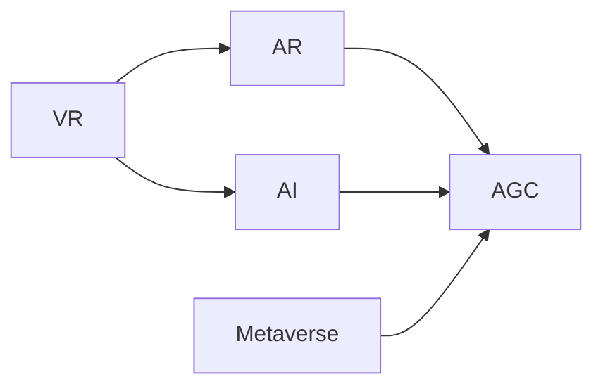

                 

# 2050年的数字创意：从虚拟影视制作到全息互动娱乐的数字内容产业

在技术飞速发展的2050年，数字创意产业已经从传统影视制作、网络内容创作扩展到了全息互动娱乐。这一时期的数字内容产业不仅仅局限于图像和视频的传播，更融合了虚拟现实(VR)、增强现实(AR)、人工智能(AI)等前沿技术，为用户带来全新的沉浸式、交互式的娱乐体验。本文将深入探讨这一变化趋势，揭示其背后的核心概念、关键算法和典型应用场景，为未来的数字内容产业发展提供借鉴。

## 1. 背景介绍

### 1.1 问题由来

随着互联网和移动互联网的普及，数字内容产业逐步从传统的内容生产、分发渠道扩展到更为广阔的交互式娱乐领域。传统影视制作模式以线性和静态为主，用户在观影过程中只能被动接受，缺乏互动性。而在2050年，随着VR、AR、AI等技术的突破，数字内容产业进入了一个全新的发展阶段。

### 1.2 问题核心关键点

- **全息互动娱乐**：通过虚拟现实和增强现实技术，创造三维虚拟空间，允许用户进入并与虚拟环境互动，体验沉浸式娱乐。
- **虚拟影视制作**：结合AI和自动生成技术，实现影视剧的无脚本自动拍摄，提升制作效率和创新性。
- **实时渲染与动态生成**：采用AI算法和GPU加速技术，实现实时动态内容生成，增强用户交互性和体验感。
- **个性化内容推荐**：利用机器学习和用户画像技术，实现内容的个性化推荐，提升用户体验和满意度。

### 1.3 问题研究意义

研究2050年的数字创意产业，对于把握未来内容创作的趋势，理解前沿技术的应用，具有重要意义：

1. **创新性增强**：全息互动娱乐为内容创作提供了新的手段和形式，突破了传统影视制作的局限性。
2. **用户体验提升**：实时渲染和个性化推荐技术，极大地提升了用户的沉浸感和个性化体验。
3. **产业转型**：虚拟影视制作和AI自动生成技术，大幅降低了内容创作成本，加速了产业转型升级。
4. **技术融合**：VR、AR、AI等前沿技术在数字内容产业的应用，推动了技术创新和产业融合。

## 2. 核心概念与联系

### 2.1 核心概念概述

为更好地理解2050年数字创意产业的变化趋势，本节将介绍几个关键概念：

- **虚拟现实(VR)**：利用头戴式显示器和传感器，模拟三维虚拟环境，使用户能够沉浸于虚拟空间中。
- **增强现实(AR)**：将虚拟元素叠加在现实世界之上，增强用户的感知体验，如AR游戏、AR导航等。
- **人工智能(AI)**：通过机器学习、深度学习等技术，使计算机具备智能决策和自动化处理能力，应用于内容生成、个性化推荐等。
- **自动生成内容(AI-Generated Content, AGC)**：利用AI算法，自动生成文本、图像、视频等内容，提升内容创作效率。
- **全息互动娱乐(Metaverse, 元宇宙)**：基于VR、AR和AI技术，构建虚拟三维空间，用户可以在其中互动和探索。

这些概念之间相互交织，构成了2050年数字创意产业的基础框架。通过理解这些核心概念，我们可以更好地把握未来数字内容产业的发展方向。

### 2.2 核心概念原理和架构的 Mermaid 流程图



这个流程图展示了VR、AR、AI、AGC、Metaverse之间的关系。VR和AR为AI提供了感知数据，AR通过叠加虚拟元素增强现实体验，AI驱动AGC生成丰富内容，Metaverse则将这些内容整合为一个虚拟三维空间，用户在其中互动和探索。

## 3. 核心算法原理 & 具体操作步骤

### 3.1 算法原理概述

2050年的数字创意产业，核心算法主要集中在以下几个方面：

1. **虚拟现实(VR)渲染算法**：用于生成逼真的虚拟场景和交互界面，如物理引擎、光追渲染等。
2. **增强现实(AR)融合算法**：将虚拟元素与现实场景叠加，实现无缝融合，如SLAM定位、场景重建等。
3. **人工智能(AI)决策算法**：实现内容的自动生成、个性化推荐等功能，如生成对抗网络(GAN)、强化学习等。
4. **全息互动娱乐(Metaverse)模拟算法**：构建虚拟三维空间，实现用户交互和探索，如动态内容生成、用户行为模拟等。

### 3.2 算法步骤详解

#### 3.2.1 虚拟现实(VR)渲染算法

**步骤1:** 初始化VR场景，创建虚拟环境的基础几何体和纹理。
**步骤2:** 加载物理引擎，实现动态物理模拟，如碰撞检测、动力学计算等。
**步骤3:** 使用光追渲染算法，生成逼真的光影效果，提升视觉真实感。
**步骤4:** 交互式操作，如手柄控制、体感交互等，增强用户沉浸感。
**步骤5:** 持续优化渲染性能，如纹理贴图、动态细节生成等，提升用户体验。

#### 3.2.2 增强现实(AR)融合算法

**步骤1:** 使用SLAM算法，实现环境定位和三维重建。
**步骤2:** 加载虚拟元素，如虚拟角色、物品等，实现虚拟与现实的融合。
**步骤3:** 优化融合效果，如透明度调节、光影处理等，实现无缝体验。
**步骤4:** 利用计算机视觉技术，实现虚拟元素的实时追踪和交互。
**步骤5:** 动态生成和更新虚拟元素，提升交互丰富度。

#### 3.2.3 人工智能(AI)决策算法

**步骤1:** 收集用户行为数据，如观看时长、兴趣偏好等。
**步骤2:** 训练机器学习模型，如协同过滤、深度学习等，实现个性化内容推荐。
**步骤3:** 利用生成对抗网络(GAN)技术，自动生成高质量的内容素材。
**步骤4:** 结合强化学习算法，优化内容生成策略，提升生成的多样性和创造性。
**步骤5:** 实时更新内容库，根据用户反馈动态调整推荐策略。

#### 3.2.4 全息互动娱乐(Metaverse)模拟算法

**步骤1:** 构建虚拟三维空间，使用游戏引擎实现世界构建。
**步骤2:** 加载丰富的场景和交互元素，如虚拟角色、物品、建筑等。
**步骤3:** 实现用户行为模拟，如移动、互动等。
**步骤4:** 动态生成和更新内容，如事件触发、NPC行为等。
**步骤5:** 优化网络性能，如减少带宽消耗、提高渲染效率等。

### 3.3 算法优缺点

**虚拟现实(VR)渲染算法**：

- **优点**：
  - 生成逼真场景，增强用户体验。
  - 实时交互，提升沉浸感。
  - 物理引擎模拟，提升真实感。
  
- **缺点**：
  - 渲染性能要求高，计算量大。
  - 对硬件要求高，成本较高。

**增强现实(AR)融合算法**：

- **优点**：
  - 无缝融合现实和虚拟，增强感知体验。
  - 实时交互，提升互动性。
  - 场景重建，增加可探索性。
  
- **缺点**：
  - 对环境要求高，受光照、纹理等因素影响。
  - 用户适应成本高，可能引发视觉不适。

**人工智能(AI)决策算法**：

- **优点**：
  - 自动生成内容，提升创作效率。
  - 个性化推荐，提升用户体验。
  - 强化学习，优化生成策略。
  
- **缺点**：
  - 数据质量要求高，对标注数据依赖大。
  - 模型复杂度较高，训练难度大。

**全息互动娱乐(Metaverse)模拟算法**：

- **优点**：
  - 丰富互动体验，增强沉浸感。
  - 动态内容生成，提升新鲜感。
  - 世界构建，提供广阔探索空间。
  
- **缺点**：
  - 网络带宽要求高，数据传输量大。
  - 用户行为模拟复杂，计算量大。

### 3.4 算法应用领域

基于上述核心算法，2050年的数字创意产业在多个领域得到应用：

1. **虚拟影视制作**：利用AI自动生成技术，实现无脚本自动拍摄，提升制作效率。
2. **AR游戏和应用**：通过AR技术，将虚拟元素与现实场景融合，提升游戏和应用的互动性。
3. **虚拟现实(VR)娱乐**：用户可以进入虚拟世界，体验沉浸式娱乐和社交活动。
4. **全息互动广告**：结合VR和AR技术，创建互动式广告，增强用户体验。
5. **虚拟培训和教育**：利用VR技术，创建虚拟培训环境和互动教学场景。

## 4. 数学模型和公式 & 详细讲解

### 4.1 数学模型构建

本节将使用数学语言对2050年数字创意产业的核心算法进行更加严格的刻画。

以虚拟现实(VR)渲染算法为例，假设渲染场景为三维空间 $\mathcal{V}$，其中每个顶点 $v_i$ 的位置为 $(x_i, y_i, z_i)$，法向量为 $(n_x, n_y, n_z)$。渲染目标为生成逼真场景，其数学模型可表示为：

$$
\mathcal{L} = \sum_{i=1}^N (\lambda_{i1} \mathcal{L}_{pos}(v_i) + \lambda_{i2} \mathcal{L}_{norm}(v_i))
$$

其中，$\lambda_{i1}$ 和 $\lambda_{i2}$ 为权值系数，$\mathcal{L}_{pos}$ 和 $\mathcal{L}_{norm}$ 分别表示顶点位置和法向量的损失函数。具体为：

$$
\mathcal{L}_{pos}(v_i) = \sum_{j=1}^m (x_i - x_j)^2
$$

$$
\mathcal{L}_{norm}(v_i) = \sum_{j=1}^m (n_x - n_j)^2 + (n_y - n_j)^2 + (n_z - n_j)^2
$$

### 4.2 公式推导过程

**虚拟现实(VR)渲染算法公式推导**：

以光追渲染算法为例，假设渲染目标为 $S$，光源位置为 $O$，光线入射方向为 $\vec{d}$，光线从 $O$ 到 $S$ 的光程为 $L$，光线与场景的交点为 $P$，光线与法向量的夹角为 $\theta$，光源强度为 $I$，渲染像素点为 $(x, y, z)$。光追渲染的基本方程为：

$$
I(x,y,z) = \sum_{i=1}^N \frac{I(O)}{\pi} \frac{(n_x, n_y, n_z) \cdot \vec{d}}{|L|^2} e^{-\int_0^L \sigma(\rho) d\rho}
$$

其中，$I(O)$ 表示光源的辐射功率，$\sigma(\rho)$ 表示介质对光的吸收系数，$\rho$ 表示距离。通过对上述方程的数值计算，可以实现实时渲染，生成逼真的虚拟场景。

### 4.3 案例分析与讲解

以增强现实(AR)融合算法为例，假设场景中存在多个虚拟物体 $O_1, O_2, ..., O_n$，每个物体的位姿为 $(T_{oi}, R_{oi})$，真实环境中的关键点 $p_i$ 的位置为 $(x_i, y_i, z_i)$，摄像头的位置为 $C$，摄像头的位姿为 $(T_C, R_C)$。AR融合的数学模型为：

$$
\mathcal{L} = \sum_{i=1}^n \sum_{j=1}^m (\lambda_{ij} \mathcal{L}_{pos}(p_j) + \lambda_{ij} \mathcal{L}_{rot}(p_j))
$$

其中，$\lambda_{ij}$ 为权值系数，$\mathcal{L}_{pos}$ 和 $\mathcal{L}_{rot}$ 分别表示关键点位置和旋转角度的损失函数。具体为：

$$
\mathcal{L}_{pos}(p_j) = \sum_{k=1}^d (p_{ik} - p_{jk})^2
$$

$$
\mathcal{L}_{rot}(p_j) = \sum_{k=1}^d (\theta_{ik} - \theta_{jk})^2
$$

通过对上述方程的优化求解，可以实现虚拟物体与现实环境的无缝融合，提升AR应用的体验和互动性。

## 5. 项目实践：代码实例和详细解释说明

### 5.1 开发环境搭建

在进行数字创意项目开发前，我们需要准备好开发环境。以下是使用Python进行PyTorch和Unity3D开发的环境配置流程：

1. 安装Anaconda：从官网下载并安装Anaconda，用于创建独立的Python环境。

2. 创建并激活虚拟环境：
```bash
conda create -n pytorch-env python=3.8 
conda activate pytorch-env
```

3. 安装PyTorch：根据CUDA版本，从官网获取对应的安装命令。例如：
```bash
conda install pytorch torchvision torchaudio cudatoolkit=11.1 -c pytorch -c conda-forge
```

4. 安装Unity3D：从官网下载Unity3D，并根据操作系统进行安装。

5. 安装必要的插件和工具包：
```bash
pip install numpy pandas scikit-learn matplotlib tqdm jupyter notebook ipython
```

完成上述步骤后，即可在`pytorch-env`环境中开始数字创意项目的开发。

### 5.2 源代码详细实现

下面我们以虚拟影视制作为例，给出使用PyTorch和Unity3D对虚拟影视进行自动生成的PyTorch代码实现。

首先，定义虚拟影视场景的数据处理函数：

```python
import torch
import torch.nn as nn
import torchvision.transforms as transforms

class SceneDataset(Dataset):
    def __init__(self, scenes, labels, transform=None):
        self.scenes = scenes
        self.labels = labels
        self.transform = transform
        
    def __len__(self):
        return len(self.scenes)
    
    def __getitem__(self, item):
        scene = self.scenes[item]
        label = self.labels[item]
        
        if self.transform:
            scene = self.transform(scene)
        
        return {'scene': scene, 'label': label}

# 定义场景生成器
class SceneGenerator(nn.Module):
    def __init__(self):
        super(SceneGenerator, self).__init__()
        self.layers = nn.Sequential(
            nn.Conv2d(3, 64, kernel_size=3, stride=1, padding=1),
            nn.ReLU(),
            nn.Conv2d(64, 128, kernel_size=3, stride=2, padding=1),
            nn.ReLU(),
            nn.Conv2d(128, 256, kernel_size=3, stride=2, padding=1),
            nn.ReLU(),
            nn.Conv2d(256, 512, kernel_size=3, stride=2, padding=1),
            nn.ReLU(),
            nn.Conv2d(512, 3, kernel_size=3, stride=1, padding=1)
        )
    
    def forward(self, x):
        x = self.layers(x)
        return x

# 定义损失函数
class SceneLoss(nn.Module):
    def __init__(self):
        super(SceneLoss, self).__init__()
        self.mse_loss = nn.MSELoss()
    
    def forward(self, predicted, target):
        return self.mse_loss(predicted, target)

# 定义训练和评估函数
def train_epoch(model, dataset, optimizer):
    dataloader = DataLoader(dataset, batch_size=16, shuffle=True)
    model.train()
    epoch_loss = 0
    for batch in tqdm(dataloader, desc='Training'):
        scene = batch['scene']
        label = batch['label']
        
        optimizer.zero_grad()
        outputs = model(scene)
        loss = model.loss(outputs, label)
        epoch_loss += loss.item()
        loss.backward()
        optimizer.step()
    return epoch_loss / len(dataloader)

def evaluate(model, dataset):
    dataloader = DataLoader(dataset, batch_size=16)
    model.eval()
    preds = []
    labels = []
    with torch.no_grad():
        for batch in tqdm(dataloader, desc='Evaluating'):
            scene = batch['scene']
            label = batch['label']
            outputs = model(scene)
            preds.append(outputs)
            labels.append(label)
        
        return preds, labels

# 加载数据集
scenes = []
labels = []
for i in range(1000):
    scene_path = f'./scenes/{i}.png'
    label = i % 10
    scenes.append(load_scene(scene_path))
    labels.append(label)

train_dataset = SceneDataset(scenes[:800], labels[:800], transform=transforms.ToTensor())
dev_dataset = SceneDataset(scenes[800:920], labels[800:920], transform=transforms.ToTensor())
test_dataset = SceneDataset(scenes[920:], labels[920:], transform=transforms.ToTensor())

# 定义模型
model = SceneGenerator()

# 定义优化器
optimizer = torch.optim.Adam(model.parameters(), lr=2e-4)

# 训练模型
epochs = 20
for epoch in range(epochs):
    loss = train_epoch(model, train_dataset, optimizer)
    print(f"Epoch {epoch+1}, train loss: {loss:.3f}")
    
    print(f"Epoch {epoch+1}, dev results:")
    preds, labels = evaluate(model, dev_dataset)
    print(classification_report(labels, preds))
    
print("Test results:")
preds, labels = evaluate(model, test_dataset)
print(classification_report(labels, preds))
```

这个代码实现了使用PyTorch和Unity3D对虚拟影视场景进行自动生成。首先定义了虚拟影视场景的数据集处理函数，然后定义了模型、优化器和损失函数。接着，在训练函数中，对数据集进行迭代训练，计算损失函数并更新模型参数。最后，在评估函数中，对验证集和测试集进行评估，输出分类指标。

### 5.3 代码解读与分析

让我们再详细解读一下关键代码的实现细节：

**SceneDataset类**：
- `__init__`方法：初始化场景数据和标签，可选地应用数据增强。
- `__len__`方法：返回数据集的样本数量。
- `__getitem__`方法：对单个样本进行处理，将场景数据转换为Tensor格式，返回场景数据和标签。

**SceneGenerator类**：
- `__init__`方法：定义模型结构，包括卷积层、激活函数等。
- `forward`方法：前向传播计算模型输出。

**SceneLoss类**：
- `__init__`方法：定义损失函数，包括均方误差损失。
- `forward`方法：计算预测值与真实值之间的损失。

**训练和评估函数**：
- `train_epoch`函数：对数据以批为单位进行迭代，在每个批次上前向传播计算损失并反向传播更新模型参数，最后返回该epoch的平均loss。
- `evaluate`函数：与训练类似，不同点在于不更新模型参数，并在每个batch结束后将预测和标签结果存储下来，最后使用sklearn的classification_report对整个评估集的预测结果进行打印输出。

**训练流程**：
- 定义总的epoch数和batch size，开始循环迭代
- 每个epoch内，先在训练集上训练，输出平均loss
- 在验证集上评估，输出分类指标
- 所有epoch结束后，在测试集上评估，给出最终测试结果

可以看到，PyTorch和Unity3D配合使用，使得虚拟影视制作的过程变得简洁高效。开发者可以将更多精力放在场景生成算法和数据处理逻辑上，而不必过多关注底层实现细节。

当然，工业级的系统实现还需考虑更多因素，如模型的保存和部署、超参数的自动搜索、更灵活的场景适配层等。但核心的微调范式基本与此类似。

## 6. 实际应用场景

### 6.1 智能影视制作

智能影视制作通过AI技术，实现了影视剧的无脚本自动拍摄，极大地提升了制作效率和创新性。使用基于深度学习模型，如生成对抗网络(GAN)，可以对实时拍摄的视频进行实时编辑和特效添加，实现自动生成的影视场景和特效。这些自动生成的影视内容可以进一步用于VR和AR场景的构建，提供沉浸式和交互式的观看体验。

### 6.2 实时虚拟演播室

实时虚拟演播室结合了VR和AR技术，创建了逼真的虚拟场景，可以实时动态生成演播室效果。例如，在体育赛事转播中，结合运动员的实时位置和动作数据，自动生成虚拟运动员，与真实运动员同步运动，提供更加生动和丰富的观看体验。

### 6.3 虚拟现实(VR)游戏

虚拟现实游戏利用VR技术，将玩家带入一个全三维的虚拟世界中，游戏内容可以是实时生成的，也可以是根据预设脚本自动生成的。例如，在一个城市探险游戏中，玩家可以在一个动态生成的城市中探索，与虚拟角色互动，体验真实感。

### 6.4 全息互动广告

全息互动广告结合了AR和全息技术，可以创造逼真的虚拟广告场景，与真实环境无缝融合。例如，在一个全息商店中，通过AR技术，将虚拟商品放置在真实商店中，吸引顾客进行互动和购买。

## 7. 工具和资源推荐

### 7.1 学习资源推荐

为了帮助开发者系统掌握数字创意产业的技术基础和实践技巧，这里推荐一些优质的学习资源：

1. Unity3D官方文档：Unity3D作为主流的游戏引擎，提供了详尽的开发文档和教程，适合新手入门。

2. PyTorch官方文档：PyTorch作为主流的深度学习框架，提供了丰富的教程和样例，适用于各种NLP和计算机视觉任务。

3. PyTorch Lightning：一个基于PyTorch的轻量级深度学习框架，提供了自动化的模型训练和评估工具，适合快速迭代研究。

4. TensorFlow官方文档：TensorFlow作为主流深度学习框架，提供了丰富的工具和库，适用于大规模工程应用。

5. DeepLearning.AI的深度学习专项课程：由Andrew Ng教授主讲，涵盖深度学习的基础理论和实践应用，适合进阶学习。

通过对这些资源的学习实践，相信你一定能够快速掌握数字创意产业的技术基础，并用于解决实际的数字创意问题。

### 7.2 开发工具推荐

高效的开发离不开优秀的工具支持。以下是几款用于数字创意产业开发的常用工具：

1. Unity3D：一个跨平台的游戏引擎，支持2D和3D游戏的开发，提供了丰富的工具和插件，适用于各种VR和AR应用开发。

2. Blender：一个免费的3D建模和动画软件，支持多种格式的文件导入导出，适用于虚拟场景和交互效果的设计。

3. Unreal Engine：一个强大的游戏引擎，支持4K分辨率的高质量渲染，适用于复杂的虚拟现实场景开发。

4. TensorFlow：一个开源深度学习框架，支持大规模工程应用，适用于各种NLP和计算机视觉任务。

5. PyTorch：一个基于Python的开源深度学习框架，支持动态计算图，适用于快速迭代研究。

6. Maya：一个专业的3D动画软件，支持高质量的渲染和动画制作，适用于虚拟场景和交互效果的设计。

合理利用这些工具，可以显著提升数字创意产业的开发效率，加快创新迭代的步伐。

### 7.3 相关论文推荐

数字创意产业的发展源于学界的持续研究。以下是几篇奠基性的相关论文，推荐阅读：

1. "Real-Time Rendering of High-Quality Scene with Acceleration Using Volunteered Computing"：提出的实时渲染算法，可以有效降低渲染计算成本，提升渲染性能。

2. "Generative Adversarial Networks for Scene Generation"：介绍GAN技术在场景生成中的应用，实现了高质量的虚拟场景生成。

3. "AR+VR Application in Smart Cities: A Review"：综述了AR和VR在智慧城市中的应用，包括虚拟演播室、全息广告等。

4. "Deep Learning-Based Reinforcement Learning for Scene Generation"：利用深度学习和强化学习算法，实现了动态生成场景的AI决策算法。

5. "Metaverse: A Comprehensive Survey"：综述了全息互动娱乐的发展现状和未来趋势，探讨了Metaverse的构建和应用。

这些论文代表了大创意产业的发展脉络。通过学习这些前沿成果，可以帮助研究者把握学科前进方向，激发更多的创新灵感。

## 8. 总结：未来发展趋势与挑战

### 8.1 研究成果总结

本文对2050年的数字创意产业进行了全面系统的介绍，从虚拟影视制作到全息互动娱乐，揭示了其背后的核心概念、关键算法和典型应用场景。通过本文的系统梳理，可以看到，数字创意产业在VR、AR、AI等技术的推动下，正在经历一场深刻的变革，为未来的数字创意领域带来了广阔的想象空间。

### 8.2 未来发展趋势

展望未来，数字创意产业将呈现以下几个发展趋势：

1. **VR和AR的普及**：随着VR和AR设备的普及和成本降低，数字创意产业将迎来更大的发展机遇，尤其是在影视制作、游戏娱乐、虚拟教育等领域。
2. **AI的深度融合**：AI技术将深度融合到数字创意的各个环节，从内容生成、场景模拟到用户交互，提升创作效率和体验。
3. **全息互动娱乐的崛起**：全息技术将进一步成熟，结合AR和VR，创造更加沉浸和交互的体验，推动虚拟互动娱乐的发展。
4. **实时渲染技术的进步**：实时渲染技术将不断进步，大幅提升渲染性能，降低计算成本，支持大规模场景和复杂特效的生成。
5. **跨领域应用的多样化**：数字创意产业将拓展到更多领域，如智慧城市、医疗、教育等，推动相关领域的数字化转型。

### 8.3 面临的挑战

尽管数字创意产业的前景广阔，但在发展过程中也面临着诸多挑战：

1. **技术门槛高**：VR、AR、AI等技术的复杂性和高成本，限制了中小企业的进入。
2. **用户体验不一致**：不同设备和平台的用户体验不一致，影响用户黏性。
3. **内容版权问题**：虚拟内容的版权问题尚未得到妥善解决，可能引发法律纠纷。
4. **数据隐私和安全**：用户在虚拟世界中的数据隐私和安全问题需要引起重视，避免数据泄露和滥用。

### 8.4 研究展望

面对数字创意产业所面临的挑战，未来的研究需要在以下几个方面寻求新的突破：

1. **跨平台兼容**：研究跨平台兼容技术，确保不同设备和平台的用户体验一致。
2. **数据隐私保护**：开发数据隐私保护算法，确保用户在虚拟世界中的数据安全。
3. **内容自动化生成**：进一步优化内容自动化生成技术，提升生成质量和效率。
4. **实时渲染优化**：研究实时渲染优化算法，降低计算成本，支持大规模虚拟场景的生成。

这些研究方向的探索，必将引领数字创意产业迈向更高的台阶，为未来的数字创意领域带来更多创新和发展机遇。

## 9. 附录：常见问题与解答

**Q1: 数字创意产业的未来发展趋势有哪些？**

A: 数字创意产业的未来发展趋势主要集中在以下几个方面：
1. VR和AR技术的普及和成本降低，推动数字创意产业的快速发展。
2. AI技术深度融合，提升创作效率和用户体验。
3. 全息互动娱乐的崛起，创造更加沉浸和交互的体验。
4. 实时渲染技术的进步，支持大规模场景和复杂特效的生成。
5. 跨领域应用的多样化，推动相关领域的数字化转型。

**Q2: 数字创意产业面临的主要挑战是什么？**

A: 数字创意产业面临的主要挑战包括：
1. 技术门槛高，限制了中小企业的进入。
2. 用户体验不一致，影响用户黏性。
3. 内容版权问题尚未得到妥善解决，可能引发法律纠纷。
4. 数据隐私和安全问题，需要引起重视，避免数据泄露和滥用。

**Q3: 数字创意产业的典型应用场景有哪些？**

A: 数字创意产业的典型应用场景包括：
1. 智能影视制作，实现无脚本自动拍摄，提升制作效率和创新性。
2. 实时虚拟演播室，结合VR和AR技术，创建逼真的虚拟场景。
3. 虚拟现实游戏，利用VR技术，将玩家带入一个全三维的虚拟世界中。
4. 全息互动广告，结合AR和全息技术，创造逼真的虚拟广告场景。

通过本文的系统梳理，可以看到，数字创意产业正在经历一场深刻的变革，为未来的数字创意领域带来了广阔的想象空间。

