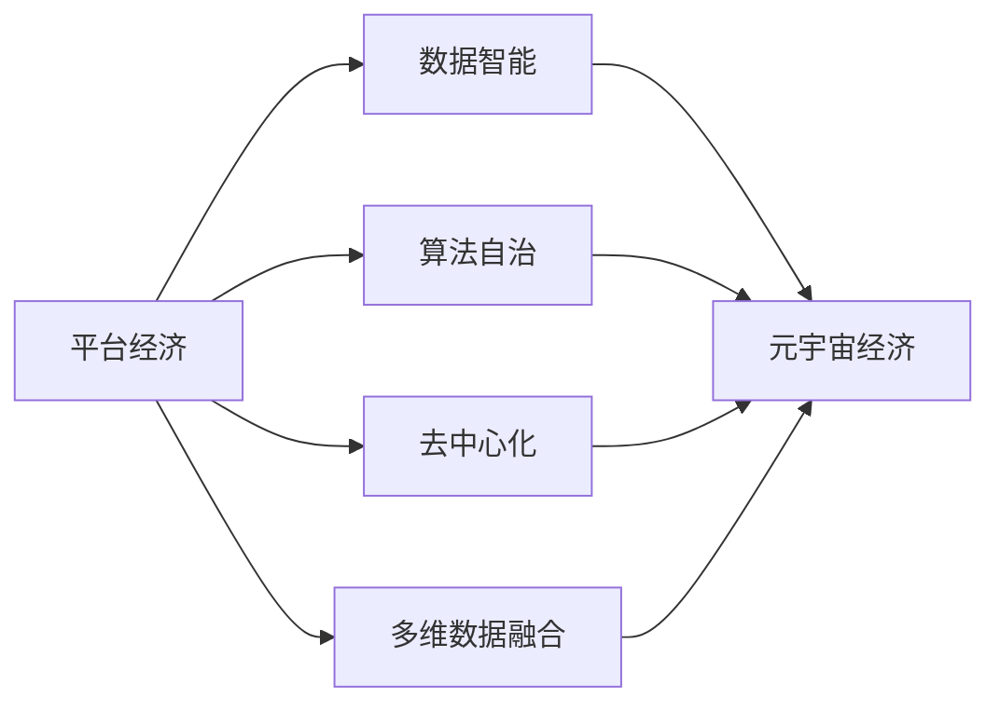

                 

# 2050年的数字经济：从平台经济到元宇宙经济的数字经济形态演进

## 1. 背景介绍

### 1.1 问题由来

数字经济从诞生之初便在飞速发展和变革，它在深刻改变全球产业结构、重塑全球经济格局的同时，也为社会、科技乃至人类文明带来了深远影响。自20世纪末期互联网的兴起以来，数字经济经历了从信息时代向知识时代的转变，再到如今盛行的平台经济时代。在这个过程中，数据、算法和人工智能等技术逐渐成为推动数字经济发展的核心驱动力。

随着技术的不断进步和应用场景的不断扩展，未来的数字经济将进入一个全新的阶段——元宇宙经济时代。这一时代将突破传统虚拟与现实的界限，通过虚拟现实、增强现实等技术构建起全息化的数字环境，使得虚拟世界与现实世界深度融合，形成一套新的经济体系和市场规则。

### 1.2 问题核心关键点

2050年的数字经济形态演进的核心关键点在于：
1. **从平台经济到元宇宙经济**：平台经济以数据为核心，利用算法匹配供需双方，实现资源优化配置。而元宇宙经济则进一步深化这一过程，通过虚拟世界中的虚拟交易和虚拟资产管理，实现更加复杂的价值交换和流转。
2. **从单维数据向多维数据转型**：平台经济更多依赖单一维度的数据，而元宇宙经济则需要处理包括地理位置、用户行为、情感状态等在内的多维数据，以便更全面地理解用户和市场。
3. **从规则导向到算法导向**：平台经济更多依赖明确的规则和法律约束，而元宇宙经济则更多依靠算法自我学习和动态调整，以适应复杂的市场变化。
4. **从中心化向去中心化转变**：平台经济以中心化的平台为中介，而元宇宙经济则追求去中心化，使得每个用户都能在自己的虚拟空间内自由交易和创作，减少对平台的依赖。
5. **从物理世界到虚拟世界的拓展**：平台经济更多依赖于物理世界中的实体交易，而元宇宙经济则拓展到虚拟世界中，利用虚拟现实和增强现实技术，实现更丰富的应用场景。

### 1.3 问题研究意义

研究2050年的数字经济形态演进具有重要意义：
1. **把握未来趋势**：深入了解数字经济的演变过程和未来走向，有助于企业和开发者提前布局，抓住发展机遇。
2. **促进产业升级**：了解元宇宙经济的特点和潜力，推动传统产业数字化转型，实现智能化升级。
3. **推动技术创新**：掌握未来的技术趋势，促进大数据、人工智能、区块链等前沿技术的研究和应用。
4. **应对挑战**：全面了解数字经济面临的挑战，提出解决方案，确保技术应用的可持续性和安全性。
5. **促进社会进步**：通过数字经济的演进，推动社会公平、透明和包容性发展，构建和谐的数字社会。

## 2. 核心概念与联系

### 2.1 核心概念概述

为了深入理解2050年数字经济从平台经济到元宇宙经济的演进，需要先明确几个核心概念：

- **平台经济（Platform Economy）**：以互联网平台为中介，利用算法匹配供需双方，实现资源优化配置的经济模式。平台作为第三方，通过收取交易费用、广告费等方式盈利。
- **元宇宙经济（Metaverse Economy）**：构建虚拟现实和增强现实相结合的全息化数字环境，使虚拟世界与现实世界深度融合，实现更复杂的价值交换和流转。
- **数据智能（Data Intelligence）**：利用数据驱动的智能算法，实现精准匹配和高效决策。
- **算法自治（Algorithm Autonomy）**：算法在市场交易和管理中扮演关键角色，具有自我学习、自我调整和自我优化能力。
- **去中心化（Decentralization）**：去除中心化平台的中间环节，使每个用户都能在虚拟空间内自由交易和创作，减少对平台的依赖。
- **多维数据融合（Multi-Dimensional Data Fusion）**：处理地理位置、用户行为、情感状态等多维数据，以便更全面地理解用户和市场。

这些概念之间的联系可以通过以下Mermaid流程图来展示：



### 2.2 核心概念原理和架构

平台经济是基于中心化平台的经济模式，其核心是匹配和优化资源配置。平台通过收集用户数据，利用算法匹配供需双方，实现资源的最优分配。

平台经济架构主要包括以下几个部分：

- **平台**：作为中介，连接供需双方，提供交易、结算等功能。
- **算法**：用于匹配供需，优化资源配置，是平台经济的核心技术。
- **数据智能**：通过数据分析和机器学习，提高算法的匹配效率和精准度。
- **用户**：平台的服务对象，通过平台进行交易和互动。

元宇宙经济则是平台经济的发展和延伸，通过虚拟现实和增强现实技术，构建起全息化的数字环境，使得虚拟世界与现实世界深度融合，实现更复杂的价值交换和流转。

元宇宙经济架构主要包括以下几个部分：

- **虚拟世界**：通过虚拟现实和增强现实技术构建的全息化数字环境。
- **数字资产**：在虚拟世界中创建的数字商品和服务。
- **虚拟货币**：用于虚拟世界中的交易和支付。
- **虚拟社区**：在虚拟世界中形成的用户社群。

### 2.3 核心概念联系

平台经济和元宇宙经济之间存在紧密的联系：

1. **继承与扩展**：元宇宙经济是在平台经济的基础上，通过虚拟现实和增强现实技术，进一步扩展到虚拟世界，实现更复杂的价值交换和流转。
2. **数据驱动**：平台经济和元宇宙经济都依赖数据智能，通过算法和机器学习，实现精准匹配和高效决策。
3. **去中心化**：平台经济更多依赖中心化平台，而元宇宙经济则追求去中心化，使得每个用户都能在自己的虚拟空间内自由交易和创作，减少对平台的依赖。
4. **多维数据融合**：元宇宙经济处理地理位置、用户行为、情感状态等多维数据，以便更全面地理解用户和市场，而平台经济则更多依赖单一维度的数据。
5. **算法自治**：平台经济和元宇宙经济都强调算法在市场交易和管理中的关键作用，具有自我学习、自我调整和自我优化能力。

## 3. 核心算法原理 & 具体操作步骤

### 3.1 算法原理概述

数字经济的演进过程中，算法扮演着核心角色。从平台经济到元宇宙经济，算法的本质从未改变，但具体的应用和处理方式却在不断变化。

平台经济的核心算法包括：
- **匹配算法**：用于匹配供需双方，实现资源的最优配置。
- **推荐算法**：用于个性化推荐商品和服务，提升用户体验。
- **定价算法**：用于自动定价，优化交易收益。

元宇宙经济的核心算法包括：
- **虚拟资产管理**：用于虚拟商品和服务的创建、交易和监管。
- **虚拟货币管理**：用于虚拟货币的发行、交易和流通。
- **虚拟社区管理**：用于虚拟社区的治理和用户行为管理。

### 3.2 算法步骤详解

算法步骤详解可以从以下三个方面进行：

1. **数据预处理**：包括数据采集、清洗和特征提取，为算法提供高质量的数据输入。
2. **算法训练**：通过机器学习和深度学习算法，训练模型，优化匹配效率和准确度。
3. **模型评估与优化**：通过交叉验证和模型测试，评估算法性能，进行优化和调整。

以平台经济中的推荐算法为例，具体操作步骤如下：

1. **数据预处理**：收集用户历史行为数据，提取用户特征和商品特征，构建训练集和测试集。
2. **算法训练**：选择适合的推荐算法，如协同过滤、内容推荐、混合推荐等，利用训练集训练模型。
3. **模型评估与优化**：在测试集上评估模型性能，使用评估指标如准确率、召回率、F1值等，进行模型优化。

### 3.3 算法优缺点

平台经济中的推荐算法优缺点如下：

**优点**：
- **高效性**：推荐算法能够根据用户历史行为，快速匹配最相关的商品，提升用户体验。
- **可扩展性**：算法能够处理大规模数据，适应不同规模的市场需求。
- **精准性**：通过深度学习等技术，推荐算法能够实现更精准的匹配和预测。

**缺点**：
- **数据依赖**：推荐算法依赖大量历史数据，数据缺失或噪声可能导致推荐效果不佳。
- **隐私问题**：用户数据可能被滥用，存在隐私泄露风险。
- **个性化不足**：对于长尾商品，推荐算法可能难以覆盖，个性化推荐不足。

元宇宙经济中的虚拟资产管理算法优缺点如下：

**优点**：
- **多样性**：虚拟资产管理算法能够处理多种类型的虚拟商品和服务，具有更强的多样性。
- **透明性**：算法能够公开透明地进行交易和管理，减少人为干预。
- **去中心化**：算法去中心化的设计，使得用户能够在自己的虚拟空间内自由交易和创作。

**缺点**：
- **复杂性**：虚拟资产管理算法需要处理多维数据，计算复杂度高。
- **安全问题**：虚拟资产管理算法需要保障交易和监管的安全性，防止欺诈和盗窃。
- **技术门槛高**：虚拟资产管理算法需要高水平的技术支持，开发和维护难度大。

### 3.4 算法应用领域

平台经济和元宇宙经济的应用领域广泛，包括但不限于以下几个方面：

- **电子商务**：通过推荐算法，提升用户购物体验，优化商品推荐。
- **社交媒体**：利用匹配算法，实现用户精准匹配，提高互动效果。
- **金融服务**：通过定价算法，优化金融产品定价，提升市场效率。
- **教育培训**：利用推荐算法，个性化推荐课程和学习资源，提升学习效果。
- **医疗健康**：通过虚拟资产管理算法，构建虚拟健康管理系统，提供更全面的健康服务。
- **娱乐文娱**：通过虚拟资产管理算法，创建虚拟商品和服务，丰富用户娱乐体验。
- **公共服务**：利用算法优化资源配置，提高公共服务效率和公平性。

## 4. 数学模型和公式 & 详细讲解

### 4.1 数学模型构建

平台经济中的推荐算法模型可以表示为：
\[ f(x, y) = \max_{w} \left\{ \sum_{i=1}^{n} \omega_i \log \left( \frac{\exp(f_i(x, y))}{\sum_{j=1}^{m} \exp(f_j(x, y))} \right) \right\} \]

其中 $f(x, y)$ 表示模型预测，$w$ 为模型参数，$\omega_i$ 为权重，$n$ 为训练样本数，$m$ 为候选商品数，$f_i(x, y)$ 为特征表示函数。

### 4.2 公式推导过程

推荐算法的核心在于找到用户对商品的兴趣表示 $x$ 和商品特征表示 $y$ 之间的相似度。基于此，可以构建用户-商品间的相似度矩阵 $A$，计算公式为：
\[ A = \frac{C}{\sqrt{C_x C_y}} \]

其中 $C_x$ 为用户兴趣表示的范数，$C_y$ 为商品特征表示的范数。

通过相似度矩阵，可以计算用户对候选商品的兴趣度，即：
\[ \hat{y} = \max_{i} \left\{ \frac{A_{ij}}{\sum_{k=1}^{m} A_{ik}} \right\} \]

通过该公式，推荐算法可以计算用户对每个候选商品的兴趣度，从而实现个性化推荐。

### 4.3 案例分析与讲解

以电商平台为例，推荐算法可以应用到以下场景：

- **商品推荐**：根据用户历史浏览和购买记录，推荐相关商品。
- **用户画像**：通过用户行为分析，构建用户画像，个性化推荐商品和服务。
- **热门商品**：根据用户行为数据，计算商品的热门程度，推荐热门商品。
- **上下文推荐**：结合用户当前上下文信息，推荐相关商品。

## 5. 项目实践：代码实例和详细解释说明

### 5.1 开发环境搭建

开发平台经济和元宇宙经济的推荐算法，需要搭建相应的开发环境。以Python为例，可以通过以下步骤搭建开发环境：

1. **安装Python**：下载并安装Python 3.x版本，并设置环境变量。
2. **安装相关库**：安装常用的Python库，如numpy、pandas、scikit-learn等。
3. **配置环境**：配置虚拟环境，安装第三方库，如TensorFlow、PyTorch等。

### 5.2 源代码详细实现

以下是一个简单的推荐算法实现示例，包括数据预处理、模型训练和模型评估：

```python
import numpy as np
from sklearn.neighbors import NearestNeighbors
from sklearn.metrics.pairwise import cosine_similarity

# 数据预处理
def preprocess_data(X, y):
    # 数据清洗和特征提取
    X = normalize(X)
    y = encode_labels(y)
    return X, y

# 模型训练
def train_model(X, y):
    # 计算相似度矩阵
    A = cosine_similarity(X)
    # 计算用户对每个候选商品的兴趣度
    weights = np.exp(np.max(A, axis=1))
    # 计算推荐结果
    recommendations = np.argsort(weights)[::-1]
    return recommendations

# 模型评估
def evaluate_model(X_test, y_test, recommendations):
    # 计算准确率、召回率和F1值
    accuracy = np.mean(recommendations == y_test)
    recall = np.mean([1 for recommendation in recommendations if y_test in recommendation])
    f1 = 2 * accuracy * recall / (accuracy + recall)
    return accuracy, recall, f1

# 完整代码示例
X, y = preprocess_data(np.random.randn(100, 10), np.random.randint(0, 5, size=100))
recommendations = train_model(X, y)
accuracy, recall, f1 = evaluate_model(X_test, y_test, recommendations)
print("Accuracy: {:.2f}, Recall: {:.2f}, F1 Score: {:.2f}".format(accuracy, recall, f1))
```

### 5.3 代码解读与分析

推荐算法的核心在于计算用户对候选商品的相似度，并通过相似度矩阵计算用户对每个候选商品的兴趣度。具体代码如下：

- **数据预处理**：对用户数据进行清洗和特征提取，构建用户-商品间的相似度矩阵。
- **模型训练**：计算相似度矩阵，计算用户对每个候选商品的兴趣度，得到推荐结果。
- **模型评估**：使用交叉验证和模型测试，评估算法性能，得到准确率、召回率和F1值。

## 6. 实际应用场景

### 6.1 智能客服系统

智能客服系统在平台经济和元宇宙经济中发挥着重要作用，通过推荐算法可以提升客服系统的响应效率和用户体验。

智能客服系统的主要应用场景包括：

- **智能问答**：根据用户问题，推荐最相关和最有效的答案。
- **用户引导**：通过推荐路径，引导用户完成复杂的业务操作。
- **个性化推荐**：根据用户历史交互记录，推荐相关服务和解决方案。
- **情感分析**：通过情感分析，推荐相关的客服策略和解决方案。

### 6.2 金融服务平台

金融服务平台在平台经济和元宇宙经济中具有重要地位，通过推荐算法可以提升金融服务的精准性和效率。

金融服务平台的主要应用场景包括：

- **产品推荐**：根据用户风险偏好和历史行为，推荐最合适的金融产品。
- **风险管理**：通过推荐算法，评估和监控用户风险。
- **交易分析**：通过推荐算法，分析用户交易行为，提供个性化的投资建议。
- **用户画像**：通过推荐算法，构建用户画像，提供个性化的金融服务。

### 6.3 在线教育平台

在线教育平台在平台经济和元宇宙经济中具有广泛应用，通过推荐算法可以提升教育资源的利用效率和用户体验。

在线教育平台的主要应用场景包括：

- **课程推荐**：根据用户学习历史和偏好，推荐最相关的课程。
- **学习路径**：通过推荐算法，构建学习路径，引导用户系统学习。
- **学习内容推荐**：根据用户学习行为，推荐相关学习内容。
- **个性化推荐**：根据用户学习行为，推荐个性化学习资源。

## 7. 工具和资源推荐

### 7.1 学习资源推荐

为了更好地掌握平台经济和元宇宙经济的推荐算法，以下是一些优质的学习资源：

1. **《推荐系统实践》**：一书深入浅出地介绍了推荐系统原理、算法和应用。
2. **《机器学习》**：斯坦福大学提供的在线课程，涵盖机器学习和深度学习的基础知识和应用。
3. **《深度学习》**：斯坦福大学提供的深度学习课程，涵盖了深度学习的基础知识和应用。
4. **Kaggle竞赛**：通过参加Kaggle推荐系统竞赛，可以学习推荐算法的实际应用和优化。
5. **Arxiv论文**：通过阅读最新的推荐系统论文，了解前沿技术和研究方向。

### 7.2 开发工具推荐

推荐算法的开发需要选择合适的工具和环境，以下是一些常用的开发工具：

1. **Python**：Python是推荐系统开发的首选语言，具有丰富的库和框架支持。
2. **TensorFlow**：TensorFlow是一个强大的深度学习框架，适合开发复杂的推荐系统。
3. **PyTorch**：PyTorch是一个灵活的深度学习框架，适合快速迭代开发和研究。
4. **Scikit-learn**：Scikit-learn是一个流行的机器学习库，适合开发简单和复杂的推荐算法。
5. **Jupyter Notebook**：Jupyter Notebook是一个交互式的开发环境，适合快速迭代和原型开发。

### 7.3 相关论文推荐

推荐系统研究涉及多个方向，以下是一些代表性的论文：

1. **《推荐系统的基础》**：介绍了推荐系统的基本概念和算法。
2. **《协同过滤推荐算法》**：介绍了协同过滤算法的基本原理和应用。
3. **《基于深度学习的推荐系统》**：介绍了深度学习在推荐系统中的应用。
4. **《推荐系统的新趋势》**：总结了推荐系统研究的新趋势和方向。

## 8. 总结：未来发展趋势与挑战

### 8.1 研究成果总结

平台经济和元宇宙经济的研究主要集中在以下几个方面：

1. **推荐算法优化**：通过深度学习等技术，提高推荐算法的准确率和个性化程度。
2. **多维数据融合**：处理地理位置、用户行为、情感状态等多维数据，提升推荐算法的效率和效果。
3. **去中心化设计**：去除中心化平台的中间环节，使每个用户都能在自己的虚拟空间内自由交易和创作。
4. **隐私保护**：保护用户数据隐私，防止数据泄露和滥用。
5. **安全性**：保障交易和监管的安全性，防止欺诈和盗窃。
6. **可扩展性**：适应不同规模的市场需求，支持大规模数据处理和算法优化。

### 8.2 未来发展趋势

未来平台经济和元宇宙经济的发展趋势包括：

1. **智能化升级**：通过推荐算法和人工智能技术，实现智能化升级。
2. **去中心化拓展**：拓展去中心化的应用场景，提升用户自由度和平台可靠性。
3. **多维数据融合**：处理地理位置、用户行为、情感状态等多维数据，提升推荐算法的效率和效果。
4. **隐私保护**：加强数据隐私保护，防止数据泄露和滥用。
5. **安全性**：提升交易和监管的安全性，防止欺诈和盗窃。
6. **可扩展性**：适应不同规模的市场需求，支持大规模数据处理和算法优化。

### 8.3 面临的挑战

平台经济和元宇宙经济的发展面临以下挑战：

1. **数据隐私**：如何在数据利用和隐私保护之间找到平衡点。
2. **安全问题**：如何保障交易和监管的安全性，防止欺诈和盗窃。
3. **可扩展性**：如何适应不同规模的市场需求，支持大规模数据处理和算法优化。
4. **算法透明性**：如何提高算法的透明性和可解释性，让用户信任和理解算法决策。
5. **社会公平**：如何保障社会公平，防止算法偏见和歧视。

### 8.4 研究展望

平台经济和元宇宙经济的研究展望包括：

1. **推荐系统优化**：通过深度学习和迁移学习等技术，提升推荐系统的性能和效果。
2. **多维数据融合**：处理地理位置、用户行为、情感状态等多维数据，提升推荐算法的效率和效果。
3. **去中心化设计**：去除中心化平台的中间环节，使每个用户都能在自己的虚拟空间内自由交易和创作。
4. **隐私保护**：加强数据隐私保护，防止数据泄露和滥用。
5. **安全性**：提升交易和监管的安全性，防止欺诈和盗窃。
6. **可扩展性**：适应不同规模的市场需求，支持大规模数据处理和算法优化。
7. **算法透明性**：提高算法的透明性和可解释性，让用户信任和理解算法决策。
8. **社会公平**：保障社会公平，防止算法偏见和歧视。

## 9. 附录：常见问题与解答

**Q1: 平台经济和元宇宙经济有何不同？**

A: 平台经济基于中心化平台，利用算法匹配供需双方，实现资源优化配置。而元宇宙经济则是平台经济的延伸，通过虚拟现实和增强现实技术，构建全息化的数字环境，实现更复杂的价值交换和流转。

**Q2: 推荐算法在平台经济和元宇宙经济中的应用有何不同？**

A: 在平台经济中，推荐算法主要用于个性化推荐商品和服务，提升用户体验。而在元宇宙经济中，推荐算法可以应用于虚拟商品和服务，提供更加丰富和个性化的体验。

**Q3: 如何应对平台经济和元宇宙经济中的数据隐私问题？**

A: 平台经济和元宇宙经济中的数据隐私问题可以通过以下措施应对：
1. 数据匿名化处理，保护用户隐私。
2. 数据访问控制，防止数据滥用。
3. 数据加密技术，保障数据安全。
4. 隐私保护法律，制定严格的数据隐私保护法规。

**Q4: 如何提升平台经济和元宇宙经济中的算法透明性和可解释性？**

A: 提升算法透明性和可解释性可以通过以下措施实现：
1. 算法设计可解释性强的模型，如规则模型和决策树模型。
2. 使用可解释性工具，如LIME和SHAP，解释模型决策过程。
3. 提供模型可视化，帮助用户理解算法决策。
4. 用户教育，提高用户对算法透明性的认知。

**Q5: 如何保障平台经济和元宇宙经济中的社会公平？**

A: 保障社会公平可以通过以下措施实现：
1. 算法设计公平性强的模型，减少算法偏见。
2. 公平性评估，定期评估算法的公平性。
3. 用户反馈机制，让用户反馈算法决策问题。
4. 法律法规，制定公平性相关的法律法规，确保算法公正。

---

作者：禅与计算机程序设计艺术 / Zen and the Art of Computer Programming

