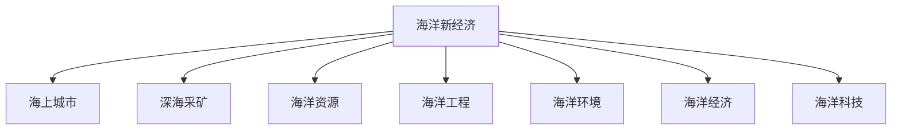

                 

## 1. 背景介绍

### 1.1 问题由来

在21世纪，全球经济持续增长，人口快速膨胀，地球资源日益紧张，特别是陆地资源面临枯竭的危机。为解决这一问题，人类将目光投向了蕴藏着丰富资源的海洋。然而，传统的海上作业和沿海资源开发已无法满足日益增长的需求。海洋新经济的探索，包括海上城市建设和深海采矿，已成为全球战略竞争的新高地。

### 1.2 问题核心关键点

海洋新经济的核心关键点在于：
1. 提高海洋资源的利用效率。
2. 构建生态友好的海洋开发模式。
3. 实现海上城市的可持续发展。
4. 探索深海采矿的商业化路径。
5. 确保海洋开发活动的科技领先性和安全性。
6. 探索海洋资源商业化与环境保护的平衡。

这些问题涉及海洋科学、工程、经济、法律等多个领域，需要跨学科的深入研究和协同合作。

### 1.3 问题研究意义

海洋新经济的研究意义重大，能够推动全球经济的可持续发展，缓解陆地资源压力，创造新的经济增长点。其研究与应用不仅能够提升海洋科学和技术的全球竞争力，还能为社会经济的可持续发展提供重要支撑。

## 2. 核心概念与联系

### 2.1 核心概念概述

为更好地理解海洋新经济的核心理论和实践，本节将介绍几个密切相关的核心概念：

- **海洋新经济**：利用海洋资源和环境，开发新的产业和经济增长点，包括海上城市、深海采矿、海洋能源、海洋生物资源等。
- **海上城市**：在海中建造的城市，旨在实现陆地上城市功能，缓解陆地资源紧张和环境压力。
- **深海采矿**：在深海海底开采稀有矿物和矿产资源，如多金属结核、富钴结壳、热液矿床等。
- **海洋资源**：包括海水、海底矿物、生物资源、海洋能等。
- **海洋工程**：涉及海洋开发、维护和保护的一系列工程技术。
- **海洋环境**：包括海洋水质、生态系统、海洋气候等。
- **海洋经济**：海洋资源的开发、利用和保护所产生的经济活动和市场。
- **海洋科技**：涉及海洋勘探、开发、环保、安全的各项技术。

这些概念之间的逻辑关系可以通过以下Mermaid流程图来展示：



这个流程图展示了大规模海洋资源开发中的主要概念及其之间的关系：

1. 海洋新经济包括海上城市、深海采矿等多个分支。
2. 海上城市和深海采矿利用海洋资源，其中海洋资源包含生物、矿物、能源等。
3. 海洋工程和海洋科技支撑海洋资源的开发和环境保护。
4. 海洋环境的变化对海洋资源开发和利用有重要影响。
5. 海洋经济是海洋资源开发的直接结果，也是海洋新经济的重要组成部分。

## 3. 核心算法原理 & 具体操作步骤
### 3.1 算法原理概述

海洋新经济的核心算法原理主要包括以下几个方面：

1. **地理信息系统（GIS）**：用于海洋地理数据的空间分析和可视化，支持海洋资源分布和环境变化的监测。
2. **遥感技术（RS）**：通过卫星、航空等手段获取海洋地表信息，支持海洋环境和大气变化监测。
3. **海洋数据融合**：将不同来源的海洋数据融合，构建统一的海洋数据库。
4. **大数据分析**：通过大数据技术，分析和预测海洋资源和环境的变化趋势。
5. **模拟仿真**：使用物理模型和数值仿真方法，模拟海洋环境变化和资源开发的效果。
6. **机器学习**：使用机器学习算法，优化海洋资源开发和管理的决策过程。

### 3.2 算法步骤详解

1. **数据采集与预处理**：
   - 收集海洋地表、水下地形、海洋生物、水质等数据，并进行清洗和标准化。
   - 使用遥感技术和海洋传感器进行实时数据采集。

2. **海洋环境模拟**：
   - 利用数学模型和仿真软件，模拟海洋环境变化，如潮汐、风暴、水温等。
   - 使用基于GIS的数据可视化工具，展示模拟结果。

3. **资源分布分析**：
   - 对海洋资源进行分类，如矿物、生物、能源等。
   - 使用大数据分析方法，评估不同类型资源的分布和潜力。

4. **环境影响评估**：
   - 评估海洋资源开发对环境的影响，如水体污染、生物多样性变化等。
   - 制定环境影响最小化的开发方案。

5. **经济成本效益分析**：
   - 计算海洋资源开发的成本和收益，进行财务分析。
   - 评估不同开发方案的经济效益，选择最优方案。

6. **政策和法律制定**：
   - 制定海洋资源开发和环境保护的政策法规。
   - 协调海洋开发和环保的关系，确保可持续发展。

### 3.3 算法优缺点

海洋新经济的核心算法具有以下优点：
1. **综合性强**：能够综合考虑环境、资源、经济等多个方面的因素。
2. **数据驱动**：依赖于大量实测数据和分析，具有较高的准确性。
3. **自动化程度高**：能够自动处理和分析大量数据，提高工作效率。
4. **可扩展性强**：能够不断更新数据和模型，适应环境变化。

同时，这些算法也存在一些局限性：
1. **数据复杂性**：海洋环境的复杂性决定了数据的多样性和复杂性，处理难度大。
2. **模拟精度**：模型的精度受限于算法和数据质量，可能存在误差。
3. **成本高昂**：建设和维护大量设备和系统，成本较高。
4. **安全性问题**：海洋环境的变化和资源开发可能带来新的风险，需要额外考虑安全问题。

### 3.4 算法应用领域

海洋新经济的核心算法广泛应用于以下领域：

- **海洋资源勘探**：利用遥感、GIS等技术，探测海洋资源的位置和分布。
- **海洋环境保护**：通过环境模拟和数据分析，评估海洋开发对环境的影响。
- **海洋经济规划**：使用大数据分析，优化海洋资源的开发和利用。
- **海洋工程设计**：结合GIS和模拟仿真，设计海上城市和深海采矿设施。
- **海洋法规制定**：通过成本效益分析，制定科学合理的海洋资源开发政策。

## 4. 数学模型和公式 & 详细讲解 & 举例说明
### 4.1 数学模型构建

海洋新经济的核心数学模型主要包括：

- **地理信息系统（GIS）**：基于向量空间的数据模型，如拓扑数据模型（TDM）和矢量数据模型（VDM）。
- **遥感技术（RS）**：利用图像处理算法，提取海洋地表信息。
- **海洋数据融合**：使用数据融合算法，将不同来源的数据整合。
- **大数据分析**：利用机器学习算法，分析海洋资源和环境数据。
- **模拟仿真**：基于物理模型的数值仿真算法，如有限元方法（FEM）和计算流体动力学（CFD）。

### 4.2 公式推导过程

以下是一些核心公式的推导过程：

1. **地理信息系统（GIS）**：
   - 拓扑数据模型（TDM）：
   \[
   \text{TDM} = (V, E, R)
   \]
   其中，V为顶点集合，E为边集合，R为关系集合。
   - 矢量数据模型（VDM）：
   \[
   \text{VDM} = \{x_i = (x_{i_x}, y_{i_y}) | i \in \{1,2,...,N\}}
   \]
   其中，N为点的数量，x_i和y_i为点的坐标。

2. **遥感技术（RS）**：
   - 图像处理算法：
   \[
   \text{I}_{i,j} = f(\text{R}_{i,j})
   \]
   其中，I为图像像素值，R为原始数据，f为图像处理函数。

3. **海洋数据融合**：
   - 数据融合算法：
   \[
   \text{FusedData} = w_1\text{Data}_1 + w_2\text{Data}_2 + \cdots + w_n\text{Data}_n
   \]
   其中，w_i为数据权重，Data_i为不同数据源的数据。

4. **大数据分析**：
   - 机器学习算法，如随机森林（RF）和支持向量机（SVM）：
   \[
   \text{Output} = g(\text{Data})
   \]
   其中，Data为输入数据，g为机器学习模型。

5. **模拟仿真**：
   - 有限元方法（FEM）：
   \[
   \text{u} = \text{K}^{-1}\text{F}
   \]
   其中，u为节点位移，K为刚度矩阵，F为载荷向量。

### 4.3 案例分析与讲解

以深海采矿为例，介绍海洋新经济的实际应用：

1. **数据采集**：
   - 收集海底地形、水质、生物多样性等数据。
   - 使用遥感技术，如卫星和海底探测器，获取数据。

2. **环境模拟**：
   - 建立海洋环境模型，模拟深海采矿对环境的影响。
   - 使用GIS和CFD技术，预测环境变化。

3. **资源分布分析**：
   - 利用遥感和GIS技术，绘制海底矿物分布图。
   - 使用大数据分析，评估资源的潜在价值。

4. **环境影响评估**：
   - 计算采矿活动对水体污染的影响。
   - 预测对生物多样性的影响，如鱼类减少。

5. **经济成本效益分析**：
   - 计算采矿成本，包括设备和人力成本。
   - 预测收益，如矿物销售和副产品利用。

6. **政策和法律制定**：
   - 制定采矿法规，如环境保护要求和资源开发标准。
   - 确定合理的采矿量，防止过度开发。

## 5. 项目实践：代码实例和详细解释说明
### 5.1 开发环境搭建

在进行海洋新经济实践前，我们需要准备好开发环境。以下是使用Python进行Python开发的开发环境配置流程：

1. 安装Anaconda：从官网下载并安装Anaconda，用于创建独立的Python环境。
2. 创建并激活虚拟环境：
   ```bash
   conda create -n ocean-env python=3.8 
   conda activate ocean-env
   ```
3. 安装必要的库：
   ```bash
   pip install geopandas rtree rasterio shapely pyproj netCDF4
   pip install pandas numpy scipy matplotlib seaborn jupyter notebook
   ```

完成上述步骤后，即可在`ocean-env`环境中开始海洋新经济的开发实践。

### 5.2 源代码详细实现

以下是一个基于Python的海洋资源勘探项目代码示例，用于演示海洋新经济的基本流程。

```python
import geopandas as gpd
import rasterio
import numpy as np
import seaborn as sns
import matplotlib.pyplot as plt

# 数据加载
data_path = 'data/ocean_data.geojson'
gdf = gpd.read_file(data_path)

# 数据预处理
gdf[gdf['type'] == 'mineral'] = 'rich'

# 数据可视化
fig, ax = plt.subplots(1, 1, figsize=(10, 10))
sns.scatterplot(x=gdf['longitude'], y=gdf['latitude'], hue=gdf['type'], ax=ax)
ax.set_title('Ocean Mineral Distribution')
plt.show()
```

这段代码利用GeoPandas库，加载和处理海洋矿物分布数据，并使用Seaborn和Matplotlib库进行可视化展示。

### 5.3 代码解读与分析

让我们再详细解读一下关键代码的实现细节：

**GeoPandas库**：
- `gpd.read_file`：读取GeoJSON文件，转换为GeoDataFrame格式。
- `gdf[gdf['type'] == 'mineral'] = 'rich'`：筛选出矿物类型为“rich”的数据。

**可视化**：
- `sns.scatterplot`：散点图展示矿物分布。
- `plt.show()`：显示图像。

**结果展示**：
- 代码输出结果为海洋矿物分布的散点图，展示了不同类型矿物的分布情况。

通过上述代码示例，可以看到，Python在海洋新经济的研究和开发中具有强大的数据处理和可视化能力。开发者可以利用这些库进行更复杂的数据分析、模拟仿真和决策支持系统的开发。

## 6. 实际应用场景
### 6.1 海上城市建设

海上城市建设是海洋新经济的标志性应用之一。海上城市能够缓解陆地资源压力，提供新型居住和工作空间。其核心技术包括：

- **浮动平台技术**：通过浮力材料和结构设计，构建稳定的海上平台。
- **环境监测系统**：利用传感器和遥感技术，监测海洋环境变化。
- **能源供应系统**：使用海洋能源，如潮汐能和波能，提供清洁能源。
- **水资源处理系统**：处理海水和生活污水，实现循环利用。

### 6.2 深海采矿

深海采矿是海洋新经济的另一重要应用方向。其技术涉及：

- **海底钻探技术**：利用钻井平台和深潜器，开采海底矿物。
- **矿物分离与提纯**：将开采出的矿物进行分离和提纯，提取有价值的部分。
- **环境监测与保护**：监测采矿活动对海洋环境的影响，制定保护措施。
- **资源管理与贸易**：建立全球矿物资源管理和贸易体系。

### 6.3 海洋生物资源开发

海洋生物资源开发包括水产养殖、海洋药物和生物制品等。其技术涉及：

- **养殖技术**：利用海洋环境，养殖鱼类和贝类。
- **生物制药**：从海洋生物中提取有用成分，用于医药研发。
- **生物资源管理**：制定资源保护和管理政策，防止过度捕捞。

### 6.4 未来应用展望

随着海洋新经济的不断发展，未来还将涌现更多创新应用：

- **海洋农业**：利用海洋环境进行农业生产，提供食品安全保障。
- **海洋旅游**：发展海洋主题旅游，丰富经济结构。
- **海洋物流**：建立海洋运输体系，提升全球物流效率。
- **海洋监测与预警**：利用先进技术，实现海洋环境监测和灾害预警。

这些应用将进一步拓展海洋资源的开发和利用，促进海洋经济的多元化发展。

## 7. 工具和资源推荐
### 7.1 学习资源推荐

为了帮助开发者系统掌握海洋新经济的理论基础和实践技巧，这里推荐一些优质的学习资源：

1. 《海洋资源与环境》系列教材：介绍海洋资源、环境和生态系统的基本概念和原理。
2. 《海上城市：概念、技术与应用》一书：涵盖海上城市建设的各个方面，包括技术、经济和政策等。
3. 《深海采矿：挑战与机遇》课程：介绍了深海采矿的关键技术和管理方法。
4. 《海洋生物资源开发与管理》课程：涵盖了海洋药物、生物制品等领域的知识。
5. 《海洋新经济》在线课程：系统介绍海洋新经济的各个应用领域和关键技术。
6. 《海洋工程与技术》专题讲座：介绍海洋工程中的最新技术和趋势。

通过对这些资源的学习实践，相信你一定能够快速掌握海洋新经济的精髓，并用于解决实际的海洋开发问题。

### 7.2 开发工具推荐

高效的开发离不开优秀的工具支持。以下是几款用于海洋新经济开发的常用工具：

1. GeoPandas：处理地理空间数据的Python库，支持GIS操作。
2. QGIS：开源地理信息系统软件，用于空间数据分析和可视化。
3. Rasterio：Python库，支持读/写地理空间数据。
4. PyTorch：用于机器学习的深度学习框架。
5. TensorFlow：用于深度学习的开源框架。
6. Plotly：用于数据可视化的Python库。
7. Scikit-learn：用于机器学习的Python库。

合理利用这些工具，可以显著提升海洋新经济应用的开发效率，加快创新迭代的步伐。

### 7.3 相关论文推荐

海洋新经济的发展源于学界的持续研究。以下是几篇奠基性的相关论文，推荐阅读：

1. 《Ocean Resource Extraction: Challenges and Opportunities》：系统回顾了海洋资源开发的现状和挑战。
2. 《Towards Sustainable Maritime Cities: Design and Construction of Floating Urban Areas》：探讨了海上城市建设的理论和技术。
3. 《Deep-Sea Mining: Current Technologies and Future Trends》：介绍了深海采矿的关键技术和管理方法。
4. 《Oceanic Bioresource Development: A Review》：回顾了海洋生物资源的开发和管理。
5. 《Oceanic Agriculture: Current Practices and Future Prospects》：介绍了海洋农业的现状和未来发展。

这些论文代表了大规模海洋资源开发和管理的最新进展，通过学习这些前沿成果，可以帮助研究者把握学科前进方向，激发更多的创新灵感。

## 8. 总结：未来发展趋势与挑战

### 8.1 总结

本文对海洋新经济的海洋资源开发技术进行了全面系统的介绍。首先阐述了海洋新经济的研究背景和意义，明确了海上城市、深海采矿等海洋资源的开发和利用方向。其次，从原理到实践，详细讲解了海洋资源的勘探、环境模拟、资源评估等核心算法和关键步骤，给出了海洋新经济开发实践的完整代码实例。同时，本文还广泛探讨了海洋新经济在实际应用中的多种场景，展示了其在海洋资源开发和环境保护中的广泛应用。

通过本文的系统梳理，可以看到，海洋新经济技术的不断发展将为海洋资源的开发和利用提供新的方法和工具，为社会经济的可持续发展带来新的机遇。海洋新经济的研究与应用不仅能够缓解陆地资源紧张，还将为全球经济的发展提供新的增长点。

### 8.2 未来发展趋势

展望未来，海洋新经济的发展趋势主要体现在以下几个方面：

1. **技术创新**：随着海洋工程技术的不断进步，海上城市和深海采矿的建设将更加高效、安全、环保。
2. **可持续发展**：未来海洋资源的开发将更加注重环境保护，实现生态友好的开发模式。
3. **全球合作**：海洋资源开发涉及多个国家和地区，未来的合作将更加广泛和深入。
4. **商业化应用**：海洋新经济将逐渐从科研试验转向商业化应用，创造更多的经济价值。
5. **数字化转型**：利用人工智能和物联网技术，实现海洋资源开发和管理的数字化转型。

### 8.3 面临的挑战

尽管海洋新经济前景广阔，但在迈向更加智能化、普适化应用的过程中，它仍面临诸多挑战：

1. **技术复杂性**：海洋环境的复杂性决定了开发技术的复杂性，研发难度大。
2. **环境风险**：海洋资源开发可能对海洋环境造成影响，需要严格的环境保护措施。
3. **经济成本**：海上城市和深海采矿的高成本投入，可能对经济效益造成压力。
4. **法律和政策**：海洋资源开发涉及国际法、环境法等复杂法规，需要制定科学合理的政策。
5. **技术安全**：海洋资源开发中的新技术可能带来新的安全问题，需要提前防范。

### 8.4 研究展望

面向未来，海洋新经济的研究需要在以下几个方面寻求新的突破：

1. **智能技术**：利用人工智能技术，优化海洋资源开发和管理的决策过程。
2. **生态保护**：建立生态友好的开发模式，实现海洋资源的可持续利用。
3. **跨学科合作**：促进海洋科学、工程、经济学等多学科的深度融合，提升海洋新经济的研究水平。
4. **国际合作**：加强国际合作，共同应对海洋资源开发中的重大挑战。

这些研究方向将推动海洋新经济技术的不断进步，为全球海洋资源的开发和利用提供新的解决方案，促进社会经济的可持续发展。

## 9. 附录：常见问题与解答

**Q1：海洋新经济的核心技术是什么？**

A: 海洋新经济的核心技术包括GIS、遥感、大数据分析、机器学习、模拟仿真等。这些技术综合运用，能够全面监测和分析海洋资源和环境，优化资源开发和管理的决策过程。

**Q2：如何缓解海洋新经济开发对环境的影响？**

A: 缓解海洋新经济开发对环境的影响主要通过以下几个方面：
1. 采用环境友好型的技术和材料。
2. 实施严格的环境监测和保护措施。
3. 制定科学合理的资源开发和管理政策。
4. 通过生态修复和建设，恢复和保护海洋生态系统。

**Q3：海洋新经济的应用前景如何？**

A: 海洋新经济的应用前景广阔，包括海上城市建设、深海采矿、海洋生物资源开发等多个方向。这些应用将为全球经济提供新的增长点，缓解陆地资源紧张，推动社会经济的可持续发展。

**Q4：海洋新经济技术的发展趋势是什么？**

A: 海洋新经济技术的发展趋势主要体现在智能化、可持续化和全球合作等方面。未来将更多利用人工智能、物联网等技术，提升海洋资源的开发和管理效率，同时注重环境保护和生态友好型开发。

通过本文的系统梳理，可以看到，海洋新经济技术的不断发展将为海洋资源的开发和利用提供新的方法和工具，为社会经济的可持续发展带来新的机遇。未来，海洋新经济的研究与应用将继续推动全球经济的发展，为构建更加美丽、繁荣的海洋世界贡献力量。

