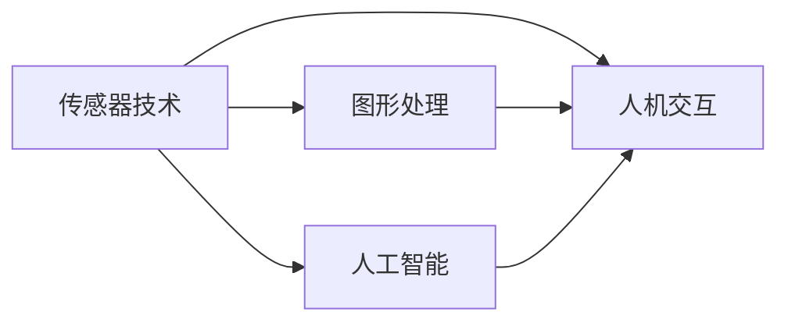

                 

# 2050年的虚拟现实：从全感官沉浸到虚拟世界构建的VR/AR进化

## 1. 背景介绍

### 1.1 问题由来

虚拟现实(Virtual Reality, VR)和增强现实(Augmented Reality, AR)技术正在以惊人的速度改变我们的生活方式。从早期的3D头盔到今天的沉浸式全感官体验，VR/AR正在成为连接数字世界与现实世界的桥梁。预计到2050年，虚拟现实和增强现实技术将进一步成熟，成为人们日常生活和工作的常态，驱动社会和经济的全面变革。

### 1.2 问题核心关键点

虚拟现实和增强现实技术涉及多个核心领域，包括传感器技术、图形处理、人工智能、人机交互等。这些技术的融合与应用，使得VR/AR从简单的3D可视化工具，发展为具有全感官沉浸式体验和丰富互动能力的平台。本节将从核心概念入手，探讨这些技术的相互关系和应用潜力。

### 1.3 问题研究意义

研究2050年的虚拟现实和增强现实技术，对于理解未来技术趋势、推动相关产业发展具有重要意义。深入探索这些技术的应用场景，可以为我们更好地适应和引领未来的生活和工作方式，提供宝贵的视角和思路。

## 2. 核心概念与联系

### 2.1 核心概念概述

虚拟现实和增强现实技术的发展离不开多个核心概念的支持：

- **传感器技术**：通过捕捉用户的位置、姿态、手势等数据，实现与虚拟环境的互动。
- **图形处理**：高效渲染3D场景，实现逼真视觉效果。
- **人工智能**：提供交互式自然语言处理、智能感知等功能，提升用户体验。
- **人机交互**：包括手势识别、触摸反馈、语音识别等，使得用户能够与虚拟环境自然交互。

这些概念相互依存，共同构成了VR/AR技术的核心框架。

### 2.2 核心概念原理和架构的 Mermaid 流程图



这个流程图展示了传感器技术、图形处理、人工智能和人机交互之间的逻辑关系：

1. **传感器技术**：通过捕捉用户数据，为图形处理和人机交互提供基础数据。
2. **图形处理**：基于传感器数据，渲染虚拟环境，实现视觉沉浸。
3. **人工智能**：对用户输入进行理解和处理，提升交互的自然性和智能性。
4. **人机交互**：实现自然的手势、语音、触摸等交互方式，增强沉浸体验。

这些核心技术的协同工作，使得VR/AR技术能够提供沉浸式、互动式的全感官体验，推动虚拟世界构建的不断演进。

## 3. 核心算法原理 & 具体操作步骤

### 3.1 算法原理概述

VR/AR技术的核心算法原理主要包括以下几个方面：

- **传感器融合算法**：通过多传感器数据融合，提高用户姿态和动作的准确性。
- **图形渲染算法**：包括光线追踪、顶点着色器等，实现高效的3D场景渲染。
- **自然语言处理(NLP)算法**：实现自然语言与虚拟环境的交互。
- **人机交互算法**：包括手势识别、触摸反馈、语音识别等，提升用户交互体验。

这些算法共同作用，实现了VR/AR技术的全感官沉浸式体验。

### 3.2 算法步骤详解

VR/AR技术的实现步骤主要包括以下几个环节：

1. **数据采集**：通过传感器获取用户的位置、姿态、手势等信息。
2. **数据处理**：对采集到的数据进行预处理，如滤波、校准等，提升数据质量。
3. **场景渲染**：基于图形处理算法，渲染虚拟环境，实现逼真的视觉效果。
4. **交互逻辑**：通过人工智能和人机交互算法，实现与虚拟环境的自然交互。
5. **反馈系统**：提供触觉、视觉、听觉等多感官反馈，增强沉浸体验。

### 3.3 算法优缺点

VR/AR技术具有以下优点：

- **沉浸式体验**：通过全感官沉浸式体验，用户可以身临其境地参与虚拟世界，提升体验感。
- **互动性强**：支持手势、语音、触摸等多种交互方式，提升用户参与度和互动性。
- **应用广泛**：应用于游戏、教育、医疗、娱乐等多个领域，推动多行业发展。

同时，也存在一些缺点：

- **硬件成本高**：高质量的VR/AR设备价格较高，限制了普及速度。
- **眩晕感**：长时间使用可能引发眩晕，需要优化算法减轻不适。
- **计算需求高**：高分辨率、动态效果需要强大的计算能力，硬件要求较高。

### 3.4 算法应用领域

VR/AR技术已经被广泛应用于多个领域，以下是几个典型的应用场景：

1. **游戏娱乐**：提供沉浸式游戏体验，增强游戏互动性和趣味性。
2. **教育培训**：通过虚拟环境进行远程教学和虚拟实验室，提升教学效果。
3. **医疗健康**：通过虚拟现实进行手术模拟和康复训练，提升医疗水平。
4. **工业制造**：应用于虚拟工厂设计、装配和培训，提升生产效率和质量。
5. **房地产**：提供虚拟房产展示和看房体验，提升用户体验。

## 4. 数学模型和公式 & 详细讲解 & 举例说明

### 4.1 数学模型构建

VR/AR技术的数学模型主要包括以下几个方面：

- **传感器模型**：描述传感器的工作原理和数据输出。
- **图形渲染模型**：描述3D场景的渲染过程和视觉效果。
- **自然语言处理模型**：描述自然语言与虚拟环境的交互逻辑。
- **人机交互模型**：描述手势、触摸、语音等交互方式的处理过程。

### 4.2 公式推导过程

以传感器数据融合算法为例，推导其基本原理：

设用户的位置数据为$\mathbf{p}$，姿态数据为$\mathbf{q}$，传感器1和传感器2的数据分别为$\mathbf{p}_1$和$\mathbf{p}_2$，则数据融合算法的目标是最小化位置和姿态数据的误差：

$$
\min_{\mathbf{p}, \mathbf{q}} \|\mathbf{p}-\mathbf{p}_1\|^2 + \|\mathbf{q}-\mathbf{q}_2\|^2
$$

其中$\|\cdot\|$表示向量范数。通过优化算法（如卡尔曼滤波器）求解上述最小化问题，可以获取更加准确的位置和姿态数据。

### 4.3 案例分析与讲解

假设用户佩戴VR头盔，头盔内的陀螺仪和加速度计可以捕捉用户头部和手部的运动数据。通过数据融合算法，将陀螺仪和加速度计的数据进行加权平均，得到准确的用户姿态和动作信息。然后，这些信息被用于渲染虚拟环境，实现用户与虚拟世界的互动。

## 5. 项目实践：代码实例和详细解释说明

### 5.1 开发环境搭建

在进行VR/AR项目开发前，需要准备相应的开发环境。以下是使用Unity3D和C#进行VR开发的环境配置流程：

1. 安装Unity3D：从官网下载并安装Unity3D，创建新的VR项目。
2. 添加必要的插件：安装VRSDK（如Oculus SDK）、AI插件等。
3. 配置硬件：准备VR头盔、手柄等设备，并连接至计算机。
4. 测试环境：验证设备连接和软件环境，确保一切正常。

### 5.2 源代码详细实现

以下是一个简单的VR项目示例，使用Unity3D实现虚拟环境渲染和用户交互：

```csharp
using UnityEngine;
using UnityEngine.XR.Interaction.Toolkit;

public class VRController : MonoBehaviour
{
    public GameObject target;
    private Camera mainCamera;
    private Ray ray;

    void Update()
    {
        mainCamera = Camera.main;

        if (inputSystem.googleDaydreamSpatialController.primaryDevice?二手房Controller != null)
        {
            ray = mainCamera.ScreenPointToRay(new Vector2(Input.mouseX, Input.mouseY));
            RaycastHit hit;
            if (Physics.Raycast(ray, out hit, 100.0f))
            {
                if (hit.transform == target.transform)
                {
                    // 检测到目标，执行相应操作
                }
            }
        }
    }
}
```

### 5.3 代码解读与分析

**VRController类**：
- `public GameObject target`：表示虚拟环境中的目标物体。
- `private Camera mainCamera`：表示主相机，用于渲染虚拟场景。
- `private Ray ray`：表示用户输入的射线，用于检测用户与虚拟环境的交互。
- `void Update()`：表示更新函数，用于处理用户输入和渲染。
- `ray = mainCamera.ScreenPointToRay(new Vector2(Input.mouseX, Input.mouseY));`：将屏幕坐标转换为射线，用于检测用户点击位置。
- `if (inputSystem.googleDaydreamSpatialController.primaryDevice?二手房Controller != null)`：检测用户是否佩戴Google Daydream控制器，并获取其手柄位置。
- `RaycastHit hit`：表示射线检测结果，用于判断用户是否点击到目标物体。
- `if (hit.transform == target.transform)`：检测用户是否点击到虚拟环境中的目标物体，并执行相应操作。

### 5.4 运行结果展示

运行上述代码，可以看到用户点击虚拟环境中的目标物体时，执行相应操作。这展示了VR项目的基本交互逻辑和代码实现方式。

## 6. 实际应用场景

### 6.1 游戏娱乐

虚拟现实游戏通过全感官沉浸式体验，为用户提供了更加丰富和互动的游戏体验。例如，《Beat Saber》游戏通过振动手柄和音乐节奏的同步，实现了高度互动的音乐节奏游戏体验。这种体验不仅增强了游戏的趣味性和沉浸感，还提升了用户的游戏体验。

### 6.2 教育培训

VR/AR技术在教育培训中也有广泛应用。例如，虚拟实验室可以提供虚拟实验环境，让学生在安全的环境中进行科学实验。这种虚拟实验不仅能够降低实验成本，还能提高实验的可控性和重复性。例如，NASA通过VR技术让学生在虚拟环境中探索火星表面，增强了学生的学习兴趣和参与度。

### 6.3 医疗健康

在医疗领域，VR/AR技术被用于手术模拟和康复训练。例如，Wertheim Hospital通过VR技术提供手术培训，提升了医生的手术技能。虚拟康复训练也帮助病人在康复过程中更加积极和愉悦，提升了康复效果。

### 6.4 未来应用展望

未来，VR/AR技术将继续拓展应用场景，提升用户体验。以下是几个未来的应用方向：

1. **全感官交互**：通过嗅觉、味觉等感官的增强，实现更加沉浸式的虚拟体验。
2. **实时传输**：实现虚拟环境与现实世界的实时交互，提升用户体验。
3. **智能推荐**：通过人工智能技术，提供个性化的虚拟内容推荐，提升用户粘性。
4. **跨平台协同**：实现虚拟环境与多平台设备的协同，提升跨设备的使用体验。

## 7. 工具和资源推荐

### 7.1 学习资源推荐

为了帮助开发者系统掌握VR/AR技术的理论基础和实践技巧，这里推荐一些优质的学习资源：

1. **《VR/AR开发实战》书籍**：详细介绍VR/AR开发的技术栈、开发工具和实践案例，适合初学者和中级开发者。
2. **Unity3D官方文档**：提供Unity3D的全面开发指南，包括VR/AR相关的插件和工具。
3. **ARToolKit官方文档**：提供ARToolKit的开发指南和API参考，帮助开发者实现增强现实应用。
4. **《VR/AR技术与应用》课程**：来自知名大学和研究机构，提供VR/AR技术的系统讲解和实践案例。
5. **VR/AR开发者社区**：提供开发者交流和分享的平台，交流最新的技术动态和实践经验。

### 7.2 开发工具推荐

高效的开发离不开优秀的工具支持。以下是几款用于VR/AR开发的常用工具：

1. **Unity3D**：基于C#的游戏开发引擎，提供强大的3D渲染和交互功能。
2. **Unreal Engine**：支持跨平台开发，提供丰富的VR/AR开发工具和资源。
3. **ARKit**：苹果公司提供的增强现实开发框架，适合iOS平台开发。
4. **ARCore**：谷歌提供的增强现实开发框架，适合Android平台开发。
5. **Blender**：开源的3D建模和渲染工具，支持VR/AR内容的创建。

### 7.3 相关论文推荐

VR/AR技术的发展离不开学界的持续研究。以下是几篇奠基性的相关论文，推荐阅读：

1. **《Virtual Reality: a survey》**：系统回顾了虚拟现实技术的发展历程和未来趋势。
2. **《Augmented Reality: A Survey and Taxonomy of State-of-the-Art》**：回顾了增强现实技术的发展历程，提供了详细的技术分类和应用案例。
3. **《Towards smarter visual-spatial interaction in virtual environments》**：探讨了智能视觉-空间交互技术，提升虚拟环境的交互效果。
4. **《Human-centered design in virtual reality》**：从用户体验角度探讨了VR/AR设计的重要性，提供实用的设计原则和实践建议。

## 8. 总结：未来发展趋势与挑战

### 8.1 总结

本文对2050年的虚拟现实和增强现实技术进行了全面系统的介绍。首先阐述了VR/AR技术的发展背景和应用前景，明确了VR/AR在连接数字世界与现实世界中的重要作用。其次，从核心概念入手，详细讲解了VR/AR技术的实现原理和关键步骤，给出了VR/AR项目开发的完整代码实例。同时，本文还广泛探讨了VR/AR技术在多个行业领域的应用前景，展示了VR/AR技术的广阔前景。

通过本文的系统梳理，可以看到，VR/AR技术正在成为连接数字世界与现实世界的桥梁，极大地拓展了我们的想象空间和应用场景。未来，伴随技术的不断发展，VR/AR技术将在更多领域得到应用，为人类认知智能的进化带来深远影响。

### 8.2 未来发展趋势

展望未来，VR/AR技术将呈现以下几个发展趋势：

1. **全感官沉浸**：通过嗅觉、味觉等感官的增强，实现更加沉浸式的虚拟体验。
2. **实时传输**：实现虚拟环境与现实世界的实时交互，提升用户体验。
3. **智能推荐**：通过人工智能技术，提供个性化的虚拟内容推荐，提升用户粘性。
4. **跨平台协同**：实现虚拟环境与多平台设备的协同，提升跨设备的使用体验。

这些趋势凸显了VR/AR技术的广阔前景。这些方向的探索发展，必将进一步提升VR/AR系统的性能和应用范围，为人类认知智能的进化带来深远影响。

### 8.3 面临的挑战

尽管VR/AR技术已经取得了瞩目成就，但在迈向更加智能化、普适化应用的过程中，它仍面临着诸多挑战：

1. **硬件成本高**：高质量的VR/AR设备价格较高，限制了普及速度。
2. **眩晕感**：长时间使用可能引发眩晕，需要优化算法减轻不适。
3. **计算需求高**：高分辨率、动态效果需要强大的计算能力，硬件要求较高。
4. **安全性和隐私保护**：用户数据和隐私安全需要严格保障，防止滥用。
5. **跨平台兼容性和互操作性**：不同平台和设备之间的兼容性和互操作性需要进一步提升。

这些挑战需要技术创新和政策支持，共同推动VR/AR技术的成熟和发展。唯有从数据、算法、工程、业务等多个维度协同发力，才能真正实现VR/AR技术的普及和应用。

### 8.4 研究展望

未来的研究需要在以下几个方面寻求新的突破：

1. **传感器技术**：开发更加精准和低延迟的传感器，提升用户体验。
2. **图形渲染技术**：提高渲染效率和质量，实现更加逼真的视觉效果。
3. **自然语言处理**：提升自然语言处理的智能化水平，实现更加自然和流畅的交互。
4. **人机交互技术**：开发更加自然和智能的人机交互方式，提升用户参与度和满意度。
5. **跨平台协同**：实现跨平台设备之间的协同和互操作，提升用户体验。

这些研究方向的探索，必将引领VR/AR技术迈向更高的台阶，为构建更加智能、普适的虚拟世界铺平道路。面向未来，VR/AR技术还需要与其他人工智能技术进行更深入的融合，如知识表示、因果推理、强化学习等，多路径协同发力，共同推动自然语言理解和智能交互系统的进步。只有勇于创新、敢于突破，才能不断拓展VR/AR技术的边界，让智能技术更好地造福人类社会。

## 9. 附录：常见问题与解答

**Q1：VR/AR技术的硬件要求高，如何解决普及问题？**

A: 通过技术创新和成本控制，逐步降低VR/AR设备的生产成本。例如，采用低成本材料、优化设计等方法，使得设备更加轻便和廉价。同时，通过开源社区和标准化平台，提供更多的开发资源和工具，降低开发者门槛。

**Q2：长时间使用VR/AR设备可能引发眩晕，如何缓解这一问题？**

A: 通过优化渲染算法和算法设计，减少视觉抖动和延迟，提高设备的稳定性和舒适度。例如，使用光缆和手柄的位置跟踪算法，降低手柄抖动的影响。同时，通过硬件升级和算法优化，提高设备的响应速度和准确性，减少用户的不适感。

**Q3：VR/AR技术的计算需求高，如何优化硬件配置？**

A: 通过硬件加速和优化算法，降低计算资源的消耗。例如，使用GPU加速渲染过程，降低CPU的计算负担。同时，优化模型和算法，减少渲染和计算的资源消耗，实现高效计算。

**Q4：VR/AR技术的跨平台兼容性和互操作性差，如何改善这一问题？**

A: 通过标准化平台和协议，提高不同设备和平台之间的兼容性。例如，采用通用数据格式和API标准，实现跨平台设备的无缝对接。同时，开发跨平台的开发工具和框架，降低跨平台开发的难度和成本。

**Q5：VR/AR技术的未来发展方向是什么？**

A: 未来，VR/AR技术将继续拓展应用场景，提升用户体验。预计将涵盖全感官沉浸、实时传输、智能推荐、跨平台协同等多个方向。这些方向的探索发展，将进一步提升VR/AR系统的性能和应用范围，为人类认知智能的进化带来深远影响。

总之，VR/AR技术在未来将扮演越来越重要的角色，推动社会和经济的全面变革。只有不断创新和突破，才能实现VR/AR技术的普及和应用，为构建更加智能、普适的虚拟世界铺平道路。

---

作者：禅与计算机程序设计艺术 / Zen and the Art of Computer Programming

