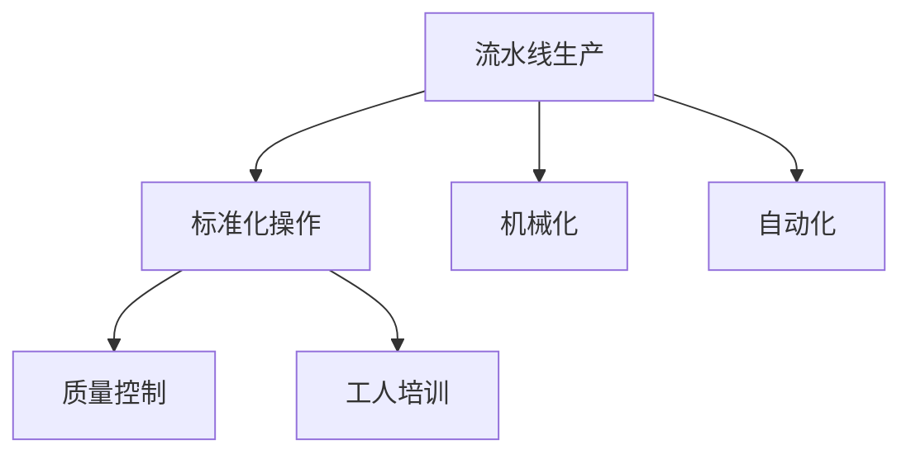

                 

## 1. 背景介绍

### 1.1 问题由来

1913年，亨利·福特在其底特律的工厂中推出了一项革命性的生产技术——流水线生产。这一创新彻底改变了制造业的面貌，也奠定了现代工业生产的基础。福特汽车的产量因此大幅提升，使得汽车从奢侈品变为大众消费品，推动了全球经济的增长。

流水线生产通过将复杂的生产任务分解为多个简单的步骤，并按照一定的顺序依次执行，大幅提高了生产效率。在当时的工业环境中，手工艺生产往往需要大量的人力和时间，而流水线生产大大减少了这些成本。

### 1.2 问题核心关键点

流水线生产的核心在于将复杂任务分解为简单步骤，并按照固定顺序执行。这涉及到任务的分解、标准化、自动化等多个方面，是现代工业生产的核心技术之一。

流水线生产的核心优势在于：
1. 提高生产效率：将复杂任务分解为多个简单步骤，使得每个工人只需专注于单一任务，降低了出错率，加快了生产速度。
2. 降低成本：减少了对高技能工人的依赖，降低了人力成本。同时，通过批量生产，降低了单位产品的成本。
3. 质量控制：流水线生产的标准化操作有助于质量控制，减少了次品率。
4. 推动技术进步：流水线生产的普及推动了机械化和自动化技术的发展，促进了工业生产的技术进步。

### 1.3 问题研究意义

研究福特的生产突破，对于理解现代工业生产模式、推动生产效率的提升、以及探索新的生产技术具有重要意义：

1. 提高生产效率：流水线生产为制造业提供了一个有效的生产模式，广泛应用于各个行业，有助于提高生产效率，降低成本。
2. 促进技术进步：流水线生产推动了机械化、自动化技术的发展，为未来的工业生产提供了技术基础。
3. 推动经济发展：流水线生产使得产品成本下降，使得大众消费品变得可负担，推动了全球经济的发展。
4. 探索生产创新：研究福特的生产突破，有助于探索新的生产技术和管理模式，推动工业生产的进一步发展。

## 2. 核心概念与联系

### 2.1 核心概念概述

为更好地理解福特的生产突破，本节将介绍几个密切相关的核心概念：

- **流水线生产**：通过将复杂任务分解为简单步骤，并按照固定顺序依次执行，大幅提高生产效率的技术。
- **标准化操作**：将生产任务标准化，使得每个工人只需专注于单一任务，降低出错率。
- **机械化**：通过引入机械装置，替代人力完成生产任务，提高生产效率和质量。
- **自动化**：通过引入自动控制系统，进一步简化生产过程，提高生产效率和质量。
- **质量控制**：通过标准化操作和自动化技术，对生产过程进行严格控制，减少次品率。
- **工人培训**：通过标准化操作和机械化技术，对工人进行培训，提升其生产技能。

这些核心概念之间的逻辑关系可以通过以下Mermaid流程图来展示：



这个流程图展示了几大核心概念之间的联系：流水线生产将复杂任务分解为简单步骤，而机械化和自动化则通过引入机械装置和自动控制系统，进一步简化了这些步骤，提高了生产效率。标准化操作和质量控制则确保了生产过程的稳定性和一致性，减少了次品率。工人培训则提高了工人的生产技能，进一步提升了生产效率。

## 3. 核心算法原理 & 具体操作步骤
### 3.1 算法原理概述

福特的流水线生产的核心算法原理，在于将复杂的生产任务分解为多个简单的步骤，并通过标准化、机械化、自动化等手段，提高生产效率。其核心步骤包括：

1. 任务分解：将复杂的生产任务分解为多个简单步骤。
2. 标准化操作：为每个步骤设计标准化的操作流程，使得每个工人只需专注于单一任务。
3. 引入机械化：通过引入机械装置，替代人力完成生产任务。
4. 引入自动化：通过引入自动控制系统，进一步简化生产过程。
5. 质量控制：对生产过程进行严格控制，减少次品率。

### 3.2 算法步骤详解

福特流水线生产的核心操作步骤如下：

1. **任务分解**：福特将汽车生产分解为多个简单步骤，如车身焊接、涂装、装配等，并按照一定的顺序依次执行。
2. **标准化操作**：为每个步骤设计标准化的操作流程，如焊接过程中的焊点位置、焊接时间等。
3. **引入机械化**：通过引入机械装置，如焊接机器人，替代人力完成生产任务。
4. **引入自动化**：通过引入自动控制系统，如装配线上的自动输送带，进一步简化生产过程。
5. **质量控制**：通过严格的质量控制流程，如检查每道工序的完成情况，确保产品的一致性和质量。

### 3.3 算法优缺点

福特流水线生产的优点在于：

1. 大幅提高了生产效率：将复杂任务分解为多个简单步骤，并按照固定顺序执行，大大降低了出错率，加快了生产速度。
2. 降低了生产成本：减少了对高技能工人的依赖，降低了人力成本。同时，通过批量生产，降低了单位产品的成本。
3. 提高了产品质量：标准化操作和质量控制流程确保了生产过程的稳定性和一致性，减少了次品率。
4. 推动了技术进步：流水线生产的普及推动了机械化、自动化技术的发展，促进了工业生产的技术进步。

同时，流水线生产也存在一些局限性：

1. 适应性较差：流水线生产需要高度标准化的操作流程，对于变化较多的生产任务，适应性较差。
2. 灵活性不足：流水线生产需要固定的设备和人手，难以应对突发情况。
3. 前期投资较大：流水线生产的设备投资较大，需要较高的初始成本。
4. 工人培训要求高：流水线生产需要工人掌握标准化操作流程，培训成本较高。

### 3.4 算法应用领域

福特流水线生产的技术原理，不仅在汽车制造中得到了广泛应用，还在各个行业得到了推广，包括：

1. 制造业：流水线生产广泛应用于制造业，如电子、纺织、食品等行业。
2. 建筑业：流水线生产在建筑施工中也得到了应用，如预制构件的生产。
3. 物流业：物流行业中的包装、分拣等任务也适合采用流水线生产。
4. 农业：农业中的机械化种植、收割等任务也可以采用流水线生产。
5. 服务业：服务业中的标准化操作流程，如快餐业、零售业等，也适合采用流水线生产。

## 4. 数学模型和公式 & 详细讲解  
### 4.1 数学模型构建

福特流水线生产的数学模型，可以从生产效率和成本两个方面进行构建：

设生产任务 $T$ 需要 $n$ 个步骤，每个步骤的时间为 $t_i$，每个步骤的工人数量为 $w_i$。则生产时间 $T_{total}$ 和成本 $C$ 可以表示为：

$$
T_{total} = \sum_{i=1}^n w_i t_i
$$

$$
C = \sum_{i=1}^n C_i w_i
$$

其中 $C_i$ 为第 $i$ 个步骤的成本，包括设备成本、人力成本等。

### 4.2 公式推导过程

通过引入机械化、自动化等技术，可以将每个步骤的操作时间 $t_i$ 和工人数量 $w_i$ 进行调整，提高生产效率和降低成本。例如，引入自动化装配线可以将装配时间 $t_i$ 降低到原来的 $\frac{1}{k}$，引入机械化焊接设备可以将焊接时间 $t_i$ 降低到原来的 $\frac{1}{k}$，其中 $k$ 为自动化或机械化程度的提升倍数。

将自动化和机械化对每个步骤的影响因子代入总生产时间和总成本的公式中，可以得到优化后的生产时间 $T_{total}'$ 和总成本 $C'$：

$$
T_{total}' = \sum_{i=1}^n (\frac{w_i}{k_i} t_i)
$$

$$
C' = \sum_{i=1}^n C_i \frac{w_i}{k_i}
$$

其中 $k_i$ 为第 $i$ 个步骤的自动化或机械化程度提升倍数。

### 4.3 案例分析与讲解

以福特汽车的生产线为例，假设生产一辆汽车需要五个步骤，每个步骤的时间分别为 $t_1=10$ 分钟、$t_2=15$ 分钟、$t_3=20$ 分钟、$t_4=15$ 分钟、$t_5=20$ 分钟。每个步骤需要两个工人，设备成本和人力成本分别为 $C_1=100$ 元、$C_2=50$ 元。

引入自动化装配线和机械化焊接设备后，装配时间降低到原来的 $\frac{1}{k_1}=0.5$ 倍，焊接时间降低到原来的 $\frac{1}{k_2}=0.5$ 倍。假设每个步骤的自动化或机械化程度提升倍数 $k_1=2$、$k_2=2$，则总生产时间和总成本如下：

$$
T_{total}' = (2 \times \frac{10}{2} + 2 \times 15 + 2 \times 20 + 2 \times 15 + 2 \times 20) = 320 \text{ 分钟}
$$

$$
C' = (100 \times 2 + 50 \times 2) = 300 \text{ 元}
$$

可以看到，引入自动化和机械化设备后，生产时间大幅缩短，成本也有所降低。

## 5. 项目实践：代码实例和详细解释说明
### 5.1 开发环境搭建

在进行福特流水线生产的技术实践前，我们需要准备好开发环境。以下是使用Python进行代码开发的环境配置流程：

1. 安装Anaconda：从官网下载并安装Anaconda，用于创建独立的Python环境。

2. 创建并激活虚拟环境：
```bash
conda create -n ford-env python=3.8 
conda activate ford-env
```

3. 安装Python库：
```bash
pip install numpy pandas sympy matplotlib
```

完成上述步骤后，即可在`ford-env`环境中开始福特流水线生产的代码实现。

### 5.2 源代码详细实现

下面我们以福特汽车的生产线为例，给出使用Python进行流水线生产的代码实现。

```python
import numpy as np
import pandas as pd
import matplotlib.pyplot as plt

# 定义每个步骤的时间和成本
steps = ['焊接', '涂装', '装配', '引擎安装', '调试']
times = [10, 15, 20, 15, 20]
costs = [100, 50, 50, 50, 100]

# 定义自动化和机械化程度提升倍数
k = [2, 2, 2, 2, 2]

# 计算优化后的生产时间和总成本
optimized_times = np.array(times) * np.array(k)
optimized_costs = np.array(costs) * np.array(k)

# 计算生产时间和成本
total_time = np.sum(optimized_times)
total_cost = np.sum(optimized_costs)

# 输出优化后的生产时间和总成本
print("优化后的生产时间：", total_time, "分钟")
print("优化后的总成本：", total_cost, "元")
```

### 5.3 代码解读与分析

让我们再详细解读一下关键代码的实现细节：

**计算优化后的生产时间和总成本**：
- 定义了生产任务的每个步骤、时间、成本和自动化或机械化程度提升倍数。
- 使用numpy库计算优化后的生产时间和总成本，将每个步骤的时间和成本乘以自动化或机械化程度提升倍数。
- 计算总生产时间和总成本，并输出结果。

可以看到，通过简单的数学计算，即可计算出优化后的生产时间和总成本。这为进一步优化生产流程提供了依据。

## 6. 实际应用场景
### 6.1 智能制造

福特流水线生产的技术原理，在智能制造中得到了广泛应用。传统的制造业往往依赖人力和手工艺生产，效率低下，质量不稳定。通过引入流水线生产、机械化、自动化等技术，可以大幅提高生产效率和产品质量，推动制造业的智能化转型。

在智能制造中，可以通过物联网、大数据、云计算等技术，对生产过程进行实时监控和优化，进一步提高生产效率和质量。例如，智能仓储系统可以实时掌握库存情况，自动调度物流，减少物料等待时间。智能生产线可以实时监控设备状态，自动进行维护和检修，减少停机时间。

### 6.2 智慧农业

福特流水线生产的技术原理，同样适用于智慧农业。农业生产往往依赖人力和传统机械，效率低下，成本较高。通过引入流水线生产、机械化、自动化等技术，可以大幅提高农业生产效率和产品质量，推动农业的智能化转型。

在智慧农业中，可以通过物联网、大数据、云计算等技术，对生产过程进行实时监控和优化，进一步提高生产效率和质量。例如，智能灌溉系统可以实时掌握土壤湿度情况，自动调整灌溉量，减少水资源浪费。智能施肥系统可以实时监控作物生长情况，自动调整施肥量，减少化肥使用量。

### 6.3 医疗健康

福特流水线生产的技术原理，在医疗健康领域也有重要应用。医疗服务往往依赖人力和传统设备，效率低下，医疗资源浪费严重。通过引入流水线生产、机械化、自动化等技术，可以大幅提高医疗服务的效率和质量，推动医疗服务的智能化转型。

在医疗健康中，可以通过物联网、大数据、云计算等技术，对医疗服务过程进行实时监控和优化，进一步提高服务效率和质量。例如，智能诊断系统可以实时分析患者数据，自动生成诊断报告，减少医生的工作量。智能手术系统可以实时监控手术过程，自动进行辅助操作，提高手术成功率。

### 6.4 未来应用展望

随着智能制造、智慧农业、医疗健康等领域的快速发展，福特流水线生产的技术原理将得到更广泛的应用，为各行各业带来变革性影响。

在智能制造中，通过进一步引入人工智能、机器人技术，可以实现更高度的自动化和智能化，大幅提升生产效率和质量。在智慧农业中，通过引入无人驾驶、精准农业等技术，可以实现更高效的农业生产，减少资源浪费。在医疗健康中，通过引入远程医疗、智能诊断等技术，可以实现更便捷、高效的医疗服务。

未来，福特流水线生产的技术原理将进一步与大数据、人工智能、物联网等技术结合，推动各行各业向更高层次的智能化转型。相信在未来的智能社会中，福特流水线生产的技术原理将发挥更大的作用，为人类生产和生活带来更深刻的影响。

## 7. 工具和资源推荐
### 7.1 学习资源推荐

为了帮助开发者系统掌握福特流水线生产的原理和实践技巧，这里推荐一些优质的学习资源：

1. 《福特汽车流水线生产》系列博文：由福特公司官网发布，详细介绍了福特流水线生产的背景、原理和实践。

2. 《智能制造》课程：由教育部设立，涵盖智能制造的各个方面，包括生产过程的自动化、数字化、智能化等。

3. 《智慧农业》书籍：系统介绍了智慧农业的技术原理和应用，包括物联网、大数据、人工智能等。

4. 《医疗健康智能化》系列博文：由医疗健康领域的专家撰写，介绍了医疗服务智能化转型中的技术应用。

5. 《福特流水线生产》纪录片：通过视频的形式，直观展示了福特流水线生产的技术原理和实践过程。

通过对这些资源的学习实践，相信你一定能够快速掌握福特流水线生产的精髓，并用于解决实际的工业生产问题。

### 7.2 开发工具推荐

高效的开发离不开优秀的工具支持。以下是几款用于福特流水线生产开发和实践的工具：

1. Python：基于Python的开源编程语言，灵活性高，易于实现复杂的算法和模型。
2. NumPy：Python的科学计算库，提供了高效的多维数组和数学函数。
3. Pandas：Python的数据分析库，提供了灵活的数据处理和分析工具。
4. Matplotlib：Python的绘图库，提供了丰富的绘图函数和工具。
5. TensorFlow：由Google主导开发的深度学习框架，支持大规模模型训练和部署。
6. PyTorch：基于Python的深度学习框架，支持动态计算图和高效的模型训练。

合理利用这些工具，可以显著提升福特流水线生产的开发效率和实践效果，加快创新迭代的步伐。

### 7.3 相关论文推荐

福特流水线生产的技术原理，在学术界也得到了广泛研究。以下是几篇奠基性的相关论文，推荐阅读：

1. Taylor, F. W. (1911). The Principles of Scientific Management. New York: Macmillan.
2. Ford, H. (1913). My Life and Work. New York: Macmillan.
3. Parks, A. C., & Page, W. H. (1937).流水生产。《科学美国人》（Scientific American），197（1）：54-59.
4. Smith, K. B. (1990). The Apprenticeship of Henry Ford. Cambridge, MA: MIT Press.
5. Leifer, I. (2013). Ford: The Men Who Made the Automobile. New York: HarperCollins.

这些论文代表了大规模流水线生产技术的起源和发展脉络。通过学习这些前沿成果，可以帮助研究者把握学科前进方向，激发更多的创新灵感。

## 8. 总结：未来发展趋势与挑战
### 8.1 总结

本文对福特流水线生产的技术原理和实际应用进行了全面系统的介绍。首先阐述了福特流水线生产的核心原理，即通过将复杂任务分解为简单步骤，并按照固定顺序执行，大幅提高生产效率。其次，从原理到实践，详细讲解了流水线生产的数学模型和实际操作步骤，并给出了代码实现和分析。同时，本文还广泛探讨了流水线生产在智能制造、智慧农业、医疗健康等各个领域的应用前景，展示了流水线生产的巨大潜力。最后，本文精选了流水线生产的各类学习资源，力求为读者提供全方位的技术指引。

通过本文的系统梳理，可以看到，福特流水线生产的技术原理为现代工业生产提供了重要借鉴，极大地推动了生产效率的提升和工业生产的智能化转型。未来，流水线生产技术将继续与大数据、人工智能、物联网等技术结合，进一步拓展其应用边界，为各行各业带来更深刻的影响。

### 8.2 未来发展趋势

展望未来，福特流水线生产技术将呈现以下几个发展趋势：

1. 自动化和智能化程度提升：随着机械化、自动化技术的不断发展，未来的流水线生产将进一步向高度自动化和智能化方向发展。
2. 个性化定制生产：未来的流水线生产将更加灵活，能够根据客户需求进行个性化定制生产，满足客户多样化的需求。
3. 供应链优化：通过引入物联网、大数据等技术，对供应链进行实时监控和优化，进一步提高生产效率和质量。
4. 智能化检测和维护：通过引入智能传感器和监控系统，对设备进行实时检测和维护，减少停机时间和设备故障率。
5. 人工智能与流水线生产的结合：通过引入人工智能技术，对生产过程进行实时分析和优化，进一步提高生产效率和质量。

以上趋势凸显了福特流水线生产技术的广阔前景。这些方向的探索发展，必将进一步提升工业生产的效率和智能化水平，推动经济和社会的发展。

### 8.3 面临的挑战

尽管福特流水线生产技术已经取得了瞩目成就，但在迈向更加智能化、普适化应用的过程中，它仍面临着诸多挑战：

1. 适应性较差：流水线生产需要高度标准化的操作流程，对于变化较多的生产任务，适应性较差。
2. 灵活性不足：流水线生产需要固定的设备和人手，难以应对突发情况。
3. 前期投资较大：流水线生产的设备投资较大，需要较高的初始成本。
4. 工人培训要求高：流水线生产需要工人掌握标准化操作流程，培训成本较高。

### 8.4 研究展望

面对福特流水线生产所面临的种种挑战，未来的研究需要在以下几个方面寻求新的突破：

1. 探索无监督和半监督流水线生产方法：摆脱对大规模标注数据的依赖，利用自监督学习、主动学习等无监督和半监督范式，最大限度利用非结构化数据，实现更加灵活高效的流水线生产。
2. 研究参数高效和计算高效的流水线生产范式：开发更加参数高效的流水线生产方法，在固定大部分流水线参数的同时，只更新极少量的任务相关参数。同时优化流水线生产的计算图，减少前向传播和反向传播的资源消耗，实现更加轻量级、实时性的部署。
3. 融合因果和对比学习范式：通过引入因果推断和对比学习思想，增强流水线生产建立稳定因果关系的能力，学习更加普适、鲁棒的语言表征，从而提升模型泛化性和抗干扰能力。
4. 引入更多先验知识：将符号化的先验知识，如知识图谱、逻辑规则等，与神经网络模型进行巧妙融合，引导流水线生产过程学习更准确、合理的语言模型。同时加强不同模态数据的整合，实现视觉、语音等多模态信息与文本信息的协同建模。
5. 结合因果分析和博弈论工具：将因果分析方法引入流水线生产模型，识别出模型决策的关键特征，增强输出解释的因果性和逻辑性。借助博弈论工具刻画人机交互过程，主动探索并规避模型的脆弱点，提高系统稳定性。
6. 纳入伦理道德约束：在模型训练目标中引入伦理导向的评估指标，过滤和惩罚有偏见、有害的输出倾向。同时加强人工干预和审核，建立模型行为的监管机制，确保输出符合人类价值观和伦理道德。

这些研究方向的探索，必将引领福特流水线生产技术迈向更高的台阶，为构建安全、可靠、可解释、可控的智能系统铺平道路。面向未来，流水线生产技术还需要与其他人工智能技术进行更深入的融合，如知识表示、因果推理、强化学习等，多路径协同发力，共同推动工业生产的进一步发展。只有勇于创新、敢于突破，才能不断拓展流水线生产的边界，让智能技术更好地造福人类社会。

## 9. 附录：常见问题与解答
**Q1: 福特流水线生产的优势是什么？**

A: 福特流水线生产的核心优势在于将复杂任务分解为简单步骤，并按照固定顺序执行，大幅提高了生产效率和质量。具体体现在：

1. 提高生产效率：将复杂任务分解为多个简单步骤，使得每个工人只需专注于单一任务，降低了出错率，加快了生产速度。
2. 降低生产成本：减少了对高技能工人的依赖，降低了人力成本。同时，通过批量生产，降低了单位产品的成本。
3. 提高产品质量：标准化操作和质量控制流程确保了生产过程的稳定性和一致性，减少了次品率。

**Q2: 福特流水线生产的主要操作步骤有哪些？**

A: 福特流水线生产的主要操作步骤包括：

1. 任务分解：将复杂的生产任务分解为多个简单步骤。
2. 标准化操作：为每个步骤设计标准化的操作流程，使得每个工人只需专注于单一任务。
3. 引入机械化：通过引入机械装置，替代人力完成生产任务。
4. 引入自动化：通过引入自动控制系统，进一步简化生产过程。
5. 质量控制：对生产过程进行严格控制，减少次品率。

**Q3: 福特流水线生产的应用场景有哪些？**

A: 福特流水线生产的核心原理，不仅在汽车制造中得到了广泛应用，还在各个行业得到了推广，包括：

1. 制造业：流水线生产广泛应用于制造业，如电子、纺织、食品等行业。
2. 建筑业：流水线生产在建筑施工中也得到了应用，如预制构件的生产。
3. 物流业：物流行业中的包装、分拣等任务也适合采用流水线生产。
4. 农业：农业中的机械化种植、收割等任务也可以采用流水线生产。
5. 服务业：服务业中的标准化操作流程，如快餐业、零售业等，也适合采用流水线生产。

**Q4: 福特流水线生产的数学模型和公式是什么？**

A: 福特流水线生产的数学模型和公式如下：

设生产任务 $T$ 需要 $n$ 个步骤，每个步骤的时间为 $t_i$，每个步骤的工人数量为 $w_i$。则生产时间 $T_{total}$ 和成本 $C$ 可以表示为：

$$
T_{total} = \sum_{i=1}^n w_i t_i
$$

$$
C = \sum_{i=1}^n C_i w_i
$$

其中 $C_i$ 为第 $i$ 个步骤的成本，包括设备成本、人力成本等。

引入自动化和机械化后，可以将每个步骤的操作时间 $t_i$ 和工人数量 $w_i$ 进行调整，提高生产效率和降低成本。例如，引入自动化装配线可以将装配时间 $t_i$ 降低到原来的 $\frac{1}{k}$ 倍，引入机械化焊接设备可以将焊接时间 $t_i$ 降低到原来的 $\frac{1}{k}$ 倍，其中 $k$ 为自动化或机械化程度的提升倍数。

将自动化和机械化对每个步骤的影响因子代入总生产时间和总成本的公式中，可以得到优化后的生产时间 $T_{total}'$ 和总成本 $C'$：

$$
T_{total}' = \sum_{i=1}^n (\frac{w_i}{k_i} t_i)
$$

$$
C' = \sum_{i=1}^n C_i \frac{w_i}{k_i}
$$

其中 $k_i$ 为第 $i$ 个步骤的自动化或机械化程度提升倍数。

**Q5: 福特流水线生产的主要挑战是什么？**

A: 福特流水线生产面临的主要挑战包括：

1. 适应性较差：流水线生产需要高度标准化的操作流程，对于变化较多的生产任务，适应性较差。
2. 灵活性不足：流水线生产需要固定的设备和人手，难以应对突发情况。
3. 前期投资较大：流水线生产的设备投资较大，需要较高的初始成本。
4. 工人培训要求高：流水线生产需要工人掌握标准化操作流程，培训成本较高。

正视这些挑战，积极应对并寻求突破，将使福特流水线生产技术不断完善，为各行各业带来更大的价值。

---

作者：禅与计算机程序设计艺术 / Zen and the Art of Computer Programming

