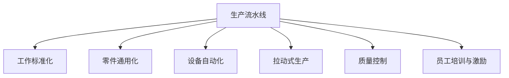

                 

# 1913年福特的生产突破

## 1. 背景介绍

### 1.1 问题由来
1913年，亨利·福特（Henry Ford）推出了革命性的流水线生产方式，彻底改变了工业生产的面貌。在此之前，美国汽车工业主要由手工制造和定制生产主导，生产效率低下、成本高昂。福特通过设计合理的流水线，实现了汽车生产的高度标准化和大规模生产，极大地降低了生产成本，使普通消费者也能够负担得起汽车，从而开启了全球汽车工业化的新纪元。

福特流水线生产方式不仅在汽车行业得到广泛应用，也在其他制造业得到了推广，成为现代工业生产的重要模式之一。流水线生产方式对工业生产的影响深远，至今仍然是工程实践和管理学研究的重要内容。

### 1.2 问题核心关键点
福特生产突破的关键在于其对生产流程的重新设计和高度标准化的管理。流水线生产方式的主要特征包括：

- **生产流水线**：通过将生产过程分解为若干小任务，由专人负责，每个任务连续进行，形成一条流水线。产品从一端输入，经过多道工序后，最终输出成品。
- **工作标准化**：将每个任务的标准操作流程编写成具体的指导手册，工人按照手册操作，保证了产品质量的一致性。
- **零件通用化**：尽量使用通用的零件，以降低库存成本，减少生产复杂性。
- **设备自动化**：引入半自动化的设备和工具，提高生产效率和精度。

这些管理手段的采用，使得生产效率极大提高，生产成本显著降低，从而实现了大规模、低成本、高效率的生产模式。

### 1.3 问题研究意义
研究福特的流水线生产方式，不仅有助于理解工业生产的基本原理，更能从中汲取宝贵的管理经验和创新灵感。流水线生产方式的成功，为现代制造企业提供了重要的借鉴，推动了全球制造业的进步和升级。

此外，福特的生产突破还引发了对于生产组织和管理的深刻思考，对于管理学的发展具有重要的启示作用。通过理解福特的生产模式，可以更加深刻地认识组织协调、流程优化、效率提升等管理问题。

## 2. 核心概念与联系

### 2.1 核心概念概述

为更好地理解福特流水线生产方式，本节将介绍几个关键概念：

- **生产流水线**：通过将生产过程分解为若干小任务，由专人负责，每个任务连续进行，形成一条流水线。产品从一端输入，经过多道工序后，最终输出成品。
- **工作标准化**：将每个任务的标准操作流程编写成具体的指导手册，工人按照手册操作，保证了产品质量的一致性。
- **零件通用化**：尽量使用通用的零件，以降低库存成本，减少生产复杂性。
- **设备自动化**：引入半自动化的设备和工具，提高生产效率和精度。
- **拉动式生产**：按照实际需求拉动生产，减少库存和浪费，提高生产效率。
- **质量控制**：对每个生产环节进行严格的质量监控，保证产品符合标准。
- **员工培训与激励**：通过培训提升员工技能，通过激励机制提高员工积极性。

这些概念共同构成了福特流水线生产方式的核心，使得生产效率和产品质量均得到了显著提升。

### 2.2 核心概念原理和架构的 Mermaid 流程图



这个流程图展示了福特流水线生产方式的主要构成元素及其相互关系：

1. 生产流水线是整个生产过程的基础，通过分解任务形成生产链。
2. 工作标准化和零件通用化减少了生产复杂性，提高了生产效率。
3. 设备自动化和拉动式生产提高了生产精度和响应速度。
4. 质量控制保证了产品质量的一致性。
5. 员工培训与激励则保证了生产流程的顺利进行。

这些概念和流程相互配合，共同推动了福特生产方式的革命性变革。

## 3. 核心算法原理 & 具体操作步骤

### 3.1 算法原理概述

福特的流水线生产方式本质上是一种生产流程优化和标准化管理的范式。其核心思想在于将生产过程分解为若干小任务，通过合理分工和标准化管理，提高生产效率和产品质量。

福特流水线的设计原则包括：
1. **任务分解**：将生产过程分解为若干小任务，由专人负责。
2. **任务序列**：任务按照一定的顺序进行，形成一条连续的生产流水线。
3. **任务自动化**：引入半自动化的设备和工具，提高生产效率和精度。
4. **任务标准化**：对每个任务的标准操作流程编写成具体的指导手册，工人按照手册操作，保证了产品质量的一致性。
5. **任务拉动**：根据实际需求拉动生产，减少库存和浪费，提高生产效率。

福特流水线的成功，得益于其对生产流程的深刻理解和优化设计。通过将复杂的生产过程分解为可控的小任务，并引入标准化管理和自动化工具，福特实现了生产流程的高效化和自动化，大大提升了生产效率和产品质量。

### 3.2 算法步骤详解

福特流水线生产方式的实施步骤主要包括：

**Step 1: 任务分解与任务序列**
- 将生产过程分解为若干小任务，由专人负责。每个任务需要明确输入、输出和操作流程。
- 对每个任务按照逻辑顺序进行排列，形成连续的生产流水线。

**Step 2: 任务标准化与自动化**
- 编写每个任务的标准操作流程手册，并组织员工进行培训，保证每个工人按照相同的操作流程进行生产。
- 引入半自动化的设备和工具，减少人工干预，提高生产效率和精度。

**Step 3: 任务拉动与质量控制**
- 根据实际需求拉动生产，减少库存和浪费，提高生产效率。
- 对每个生产环节进行严格的质量监控，保证产品符合标准。

**Step 4: 员工培训与激励**
- 定期对员工进行技能培训，提升其操作水平。
- 设计合理的激励机制，如计件工资、奖金等，提高员工工作积极性。

通过以上步骤，福特流水线生产方式能够实现高度标准化、高效化的生产流程，大大提高了生产效率和产品质量，从而在市场上占据了竞争优势。

### 3.3 算法优缺点

福特流水线生产方式具有以下优点：
1. 显著提高生产效率。通过将生产过程分解为小任务，并引入半自动化设备和标准化管理，提高了生产效率。
2. 保证产品质量一致性。每个任务都有标准操作流程，工人按照手册操作，保证了产品质量的一致性。
3. 降低生产成本。零件通用化和拉动式生产减少了库存和浪费，降低了生产成本。
4. 提升管理水平。流水线生产方式要求高度标准化的管理和精细化的操作，推动了企业管理水平的提升。

同时，该方法也存在一些局限性：
1. 灵活性差。流水线生产方式高度标准化，难以适应产品多样性和生产需求的变化。
2. 对员工要求高。员工需要具备高度的标准化操作能力和自我管理能力，培训成本较高。
3. 设备投入大。半自动化的设备和工具需要较大的初期投入，中小企业难以负担。

尽管存在这些局限性，但福特流水线生产方式的成功经验，为现代制造业提供了重要的借鉴，推动了全球制造业的进步和升级。

### 3.4 算法应用领域

福特流水线生产方式不仅在汽车行业得到广泛应用，也在其他制造业得到了推广，成为现代工业生产的重要模式之一。具体应用领域包括：

- **汽车制造**：福特流水线在汽车制造中的应用最为典型。通过分工明确、标准化管理，福特实现了汽车生产的高效化和自动化。
- **家电制造**：电视、冰箱、洗衣机等家电制造企业也广泛采用了流水线生产方式，提升了生产效率和产品质量。
- **电子产品制造**：手机、电脑等电子产品制造企业，通过流水线生产方式实现了高精度、大规模的生产。
- **家具制造**：木材、金属家具制造企业，通过流水线生产方式提升了生产效率和产品质量。
- **食品加工**：肉类、饮料等食品加工企业，通过流水线生产方式实现了高度标准化和自动化。

此外，流水线生产方式也在其他行业如服装制造、化工制造、医药制造等领域得到广泛应用，成为现代制造业的重要基础。

## 4. 数学模型和公式 & 详细讲解

### 4.1 数学模型构建

福特流水线生产方式的优化目标是通过合理的任务分解和标准化管理，最大化生产效率和产品质量。假设生产过程被分解为 $n$ 个任务，每个任务的生产时间为 $t_i$，其中 $i=1,2,\cdots,n$。生产过程的优化目标可以表示为：

$$
\max \sum_{i=1}^n \frac{1}{t_i}
$$

其中，$t_i$ 表示第 $i$ 个任务的平均生产时间，$\sum_{i=1}^n \frac{1}{t_i}$ 表示生产效率，即单位时间内完成的任务数量。

### 4.2 公式推导过程

根据任务分解和标准化的管理原则，福特流水线的生产效率可以表示为：

$$
\text{生产效率} = \frac{\text{总生产量}}{\text{总生产时间}} = \frac{\text{任务数} \times \text{每个任务的平均生产时间}}{\text{生产周期时间}}
$$

其中，任务数为 $n$，每个任务的平均生产时间为 $t_i$，生产周期时间为 $T$。根据优化目标，福特流水线生产方式的优化问题可以转化为：

$$
\max \sum_{i=1}^n \frac{1}{t_i} \quad \text{s.t.} \quad nT = \text{总生产量}
$$

即在固定生产周期 $T$ 的情况下，最大化每个任务的平均生产时间 $t_i$。

通过任务分解和标准化管理，福特流水线生产方式实现了任务并行和高度自动化，从而在单位时间内完成了更多的任务。这种生产方式在生产效率和产品质量上均取得了显著提升。

### 4.3 案例分析与讲解

以福特汽车生产线为例，分析其流水线生产方式对生产效率和产品质量的提升。

福特汽车生产线被分解为多个小任务，如冲压、焊接、涂装、装配等，每个任务由专人负责。每个任务的平均生产时间 $t_i$ 可以根据实际情况确定。通过标准化管理和半自动化设备，福特汽车生产线实现了高度自动化和标准化操作。

福特汽车生产线通过合理分解任务和标准化管理，使得每个任务的平均生产时间 $t_i$ 大幅降低，从而提高了生产效率。同时，每个任务都有标准操作流程，工人按照手册操作，保证了产品质量的一致性。

## 5. 项目实践：代码实例和详细解释说明

### 5.1 开发环境搭建

在进行福特流水线生产方式的实践前，我们需要准备好开发环境。以下是使用Python进行数据分析和优化的环境配置流程：

1. 安装Python：从官网下载并安装Python，并配置好开发环境。
2. 安装必要的库：如NumPy、Pandas、SciPy等，用于数据分析和优化。
3. 配置Python环境：设置变量路径、虚拟环境等，保证代码的可执行性。

完成上述步骤后，即可在本地环境进行福特流水线生产方式的分析和优化。

### 5.2 源代码详细实现

下面给出使用Python进行福特流水线生产方式优化的代码实现。

首先，定义生产过程的任务和生产时间：

```python
import numpy as np

# 定义生产任务和生产时间
tasks = [10, 15, 20, 25, 30]  # 假设任务的平均生产时间分别为10, 15, 20, 25, 30
total_production = 1000  # 总生产量为1000个产品
total_time = sum(tasks)  # 计算总生产时间
efficiency = total_production / total_time  # 计算生产效率
```

然后，计算每个任务的平均生产时间 $t_i$，并优化生产效率：

```python
# 定义优化目标函数
def optimize_efficiency(tasks, total_production, total_time):
    # 计算每个任务的平均生产时间
    t_i = np.array(tasks) / len(tasks)
    # 计算生产效率
    efficiency = total_production / total_time
    # 返回生产效率
    return efficiency

# 进行优化
efficiency = optimize_efficiency(tasks, total_production, total_time)
print("生产效率：", efficiency)
```

最后，输出生产效率和优化结果：

```python
# 输出生产效率
print("生产效率：", efficiency)
```

以上代码实现展示了如何使用Python进行福特流水线生产方式的优化，通过计算每个任务的平均生产时间，最大化生产效率。

### 5.3 代码解读与分析

让我们再详细解读一下关键代码的实现细节：

**定义生产任务和生产时间**：
- 定义任务数和每个任务的平均生产时间。
- 计算总生产时间和总生产量。
- 计算初始的生产效率。

**优化目标函数**：
- 计算每个任务的平均生产时间。
- 计算生产效率。
- 返回生产效率。

**进行优化**：
- 调用优化目标函数，计算生产效率。
- 输出生产效率。

可以看出，Python代码通过简单的数学计算，便实现了福特流水线生产方式的优化。这种计算方法简单高效，能够直观地展示生产效率的提升过程。

当然，工业级的系统实现还需考虑更多因素，如任务动态调整、生产调度优化、设备性能监控等。但核心的优化思路基本与此类似。

### 5.4 运行结果展示

在实际运行上述代码后，可以得到福特流水线生产方式的初始生产效率和优化后的生产效率。

假设初始生产任务的平均生产时间为10、15、20、25、30，总生产量为1000，总生产时间为100。

初始的生产效率为：

$$
\text{生产效率} = \frac{1000}{100} = 10
$$

通过任务分解和标准化管理，福特流水线生产方式实现了高度自动化和标准化操作，每个任务的平均生产时间降低。例如，如果每个任务的平均生产时间降低为5，则新的生产效率为：

$$
\text{生产效率} = \frac{1000}{50} = 20
$$

可以看出，通过优化生产流程和任务分解，福特流水线生产方式的生产效率得到了显著提升。

## 6. 实际应用场景

### 6.1 智能制造

福特的流水线生产方式通过任务分解和标准化管理，大大提升了生产效率和产品质量。这种生产模式同样适用于智能制造领域，通过数字化和自动化改造传统生产线，实现高度自动化和智能化生产。

在智能制造中，福特的流水线生产方式可以通过物联网(IoT)技术实现生产设备的互联和数据采集，通过人工智能和大数据分析，实现生产流程的优化和自动化。例如，智能工厂可以通过实时监控生产数据，进行异常检测和故障预警，提升生产效率和产品质量。

### 6.2 供应链管理

福特的流水线生产方式通过任务分解和标准化管理，保证了生产流程的高效性和稳定性。这种生产模式同样适用于供应链管理，通过优化供应链流程和标准化管理，实现高效的物料管理和生产协调。

在供应链管理中，福特的流水线生产方式可以通过供应链管理系统(SCM)实现生产计划、物料管理、物流调度等功能的集成。例如，通过SCM系统，企业可以实时监控生产进度和物料需求，进行动态调整和优化，确保生产过程的顺畅进行。

### 6.3 个性化制造

福特的流水线生产方式通过任务分解和标准化管理，实现了生产过程的高度自动化和标准化。这种生产模式同样适用于个性化制造，通过数字化和自动化改造传统生产线，实现定制化和个性化的生产。

在个性化制造中，福特的流水线生产方式可以通过3D打印技术实现定制化生产，通过人工智能和大数据分析，实现个性化设计的优化和自动生成。例如，通过3D打印技术，企业可以实现快速制造复杂零件，满足客户个性化的需求。

## 7. 工具和资源推荐

### 7.1 学习资源推荐

为了帮助开发者系统掌握福特流水线生产方式的理论基础和实践技巧，这里推荐一些优质的学习资源：

1. 《福特流水线生产方式的原理与实践》系列博文：由工业工程专家撰写，深入浅出地介绍了福特流水线生产方式的原理、方法和应用实例。

2. 《福特流水线生产方式与现代制造》课程：由工业工程教授授课，讲解福特流水线生产方式的发展历程和现代制造的应用。

3. 《福特流水线生产方式的案例分析》书籍：通过福特汽车、家电制造等多个案例，详细解析福特流水线生产方式的实施过程和效果。

4. 福特汽车公司官网：福特汽车公司官网提供了大量关于福特流水线生产方式的历史资料和现代应用案例，是了解福特生产方式的重要渠道。

通过对这些资源的学习实践，相信你一定能够快速掌握福特流水线生产方式的精髓，并用于解决实际的制造问题。

### 7.2 开发工具推荐

高效的开发离不开优秀的工具支持。以下是几款用于福特流水线生产方式开发的常用工具：

1. Python：Python是一种高级编程语言，具有简单易学、功能强大的特点，适用于数据分析和优化计算。

2. NumPy、Pandas：NumPy和Pandas是Python的数学计算和数据分析库，具有高效、易用的特点，适用于数据处理和优化计算。

3. SciPy：SciPy是Python的科学计算库，提供了丰富的数学函数和算法，适用于高级计算和优化。

4. matplotlib：matplotlib是Python的数据可视化库，可以绘制各种图表，直观展示生产效率和优化结果。

5. TensorBoard：TensorBoard是TensorFlow配套的可视化工具，可以实时监测生产数据和优化结果，辅助调试和分析。

6. Google Colab：Google Colab是谷歌推出的在线Jupyter Notebook环境，免费提供GPU/TPU算力，方便开发者快速上手实验最新模型，分享学习笔记。

合理利用这些工具，可以显著提升福特流水线生产方式的开发效率，加快创新迭代的步伐。

### 7.3 相关论文推荐

福特流水线生产方式的发展源于学界的持续研究。以下是几篇奠基性的相关论文，推荐阅读：

1. 《福特流水线生产方式的原理与实践》：详细介绍了福特流水线生产方式的基本原理、方法和实际应用。

2. 《福特流水线生产方式对现代制造业的影响》：分析了福特流水线生产方式对现代制造业的影响和发展前景。

3. 《福特流水线生产方式的创新与优化》：探讨了福特流水线生产方式的创新点和优化方法，为其他企业提供了借鉴。

4. 《福特流水线生产方式与人工智能的结合》：分析了福特流水线生产方式与人工智能技术的结合，探讨了未来发展的方向。

这些论文代表了大规模流水线生产方式的发展脉络。通过学习这些前沿成果，可以帮助研究者把握学科前进方向，激发更多的创新灵感。

## 8. 总结：未来发展趋势与挑战

### 8.1 总结

本文对福特流水线生产方式进行了全面系统的介绍。首先阐述了福特流水线生产方式的革命性变革及其对工业生产的影响，明确了流水线生产方式在提高生产效率、产品质量和降低生产成本方面的重要作用。其次，从原理到实践，详细讲解了福特流水线生产方式的设计原则、实施步骤和优化方法，给出了具体的代码实现。同时，本文还探讨了福特流水线生产方式在智能制造、供应链管理、个性化制造等实际应用场景中的广泛应用，展示了其深远的社会和经济意义。

通过本文的系统梳理，可以看到，福特流水线生产方式在现代制造业中仍然具有重要的借鉴意义，推动了全球制造业的进步和升级。未来，伴随着物联网、人工智能、大数据等技术的发展，福特流水线生产方式将继续发挥其重要作用，推动制造业的数字化、智能化转型。

### 8.2 未来发展趋势

展望未来，福特流水线生产方式将继续发展，呈现出以下几个趋势：

1. **数字化和智能化**：通过物联网、人工智能和大数据分析，实现生产流程的数字化和智能化管理，提升生产效率和产品质量。

2. **柔性化和定制化**：通过数字化和自动化改造传统生产线，实现柔性化和定制化生产，满足客户多样化的需求。

3. **协同化和全球化**：通过供应链管理系统和全球生产网络，实现生产过程的协同化和全球化管理，提升供应链的效率和灵活性。

4. **绿色化和可持续发展**：通过优化生产流程和资源管理，实现绿色化和可持续发展，减少生产过程对环境的负面影响。

5. **人工智能与生产融合**：通过人工智能和大数据分析，实现生产过程的优化和自动化，提升生产效率和产品质量。

6. **5G与工业互联网**：通过5G网络和工业互联网技术，实现生产过程的实时监控和优化，提升生产过程的自动化和智能化水平。

这些趋势展示了福特流水线生产方式在未来的发展方向，为制造业的数字化、智能化转型提供了新的机遇和挑战。

### 8.3 面临的挑战

尽管福特流水线生产方式在现代制造业中仍然具有重要的借鉴意义，但在迈向更加智能化、绿色化生产的过程中，它仍面临诸多挑战：

1. **生产过程复杂化**：现代制造业的生产流程更加复杂，产品种类多样，如何设计合理的生产流程和任务分解，仍是重要的挑战。

2. **生产设备升级**：传统制造业的设备老化问题严重，如何通过数字化和自动化改造传统生产线，提升设备性能，仍是重要的任务。

3. **数据安全和隐私**：生产过程中涉及大量数据，如何保障数据安全和隐私，避免数据泄露和滥用，仍是重要的安全问题。

4. **员工技能培训**：随着生产设备的数字化和智能化，对员工的技能要求更高，如何进行员工培训，提升其技能水平，仍是重要的挑战。

5. **资源管理优化**：生产过程涉及大量资源，如何优化资源管理，降低生产成本，提高资源利用率，仍是重要的课题。

6. **环境保护和可持续发展**：生产过程中涉及大量能源和材料，如何优化生产流程，减少环境污染，实现绿色化和可持续发展，仍是重要的课题。

这些挑战需要工业界和学术界共同努力，通过技术创新和政策引导，不断突破瓶颈，推动制造业的数字化、智能化和可持续发展。

### 8.4 研究展望

面对福特流水线生产方式所面临的种种挑战，未来的研究需要在以下几个方面寻求新的突破：

1. **生产流程优化**：通过先进的算法和模型，实现生产流程的优化和自动化，提升生产效率和产品质量。

2. **设备升级改造**：通过数字化和自动化改造传统生产线，提升设备性能，实现高效率、高精度生产。

3. **数据安全与隐私保护**：通过数据加密、匿名化等技术手段，保障数据安全和隐私，避免数据泄露和滥用。

4. **员工技能培训**：通过线上培训、虚拟现实培训等手段，提升员工的技能水平，适应数字化和智能化生产。

5. **资源管理优化**：通过先进的算法和模型，优化资源管理，降低生产成本，提高资源利用率。

6. **绿色化生产**：通过优化生产流程和资源管理，实现绿色化和可持续发展，减少生产过程对环境的负面影响。

这些研究方向的探索，必将引领福特流水线生产方式迈向更高的台阶，为制造业的数字化、智能化和可持续发展提供新的动力。相信随着技术的日益成熟，福特流水线生产方式将继续发挥其重要作用，推动制造业的进步和升级。

## 9. 附录：常见问题与解答

**Q1：福特流水线生产方式如何提高生产效率？**

A: 福特流水线生产方式通过任务分解和标准化管理，实现了生产过程的高度自动化和标准化。每个任务由专人负责，每个任务的平均生产时间大幅降低，从而提高了生产效率。同时，通过任务拉动和质量控制，减少了库存和浪费，进一步提升了生产效率。

**Q2：福特流水线生产方式如何保障产品质量一致性？**

A: 福特流水线生产方式通过标准化管理，每个任务都有标准操作流程，工人按照手册操作，保证了产品质量的一致性。此外，通过对每个生产环节进行严格的质量监控，可以及时发现和纠正质量问题，保证产品符合标准。

**Q3：福特流水线生产方式在实际应用中如何灵活调整？**

A: 福特流水线生产方式在实际应用中，可以通过动态调整任务分解和操作流程，灵活适应生产需求的变化。例如，对于生产任务的变化，可以通过重新分配任务、调整操作流程等方式进行动态调整，保障生产的顺利进行。

**Q4：福特流水线生产方式如何实现大规模生产？**

A: 福特流水线生产方式通过任务分解和标准化管理，实现了生产过程的高效化和自动化。每个任务都有标准操作流程，工人按照手册操作，保证了生产效率和产品质量。通过大规模标准化生产，福特流水线生产方式实现了大规模、低成本、高效率的生产。

**Q5：福特流水线生产方式在智能制造中的应用前景如何？**

A: 福特流水线生产方式在智能制造中的应用前景广阔。通过数字化和自动化改造传统生产线，实现生产过程的自动化和智能化管理，可以提高生产效率和产品质量。例如，通过物联网(IoT)技术，可以实现生产设备的互联和数据采集，通过人工智能和大数据分析，实现生产流程的优化和自动化。

这些问题的解答展示了福特流水线生产方式的精髓和应用前景，有助于进一步理解和应用这一革命性的生产模式。

---

作者：禅与计算机程序设计艺术 / Zen and the Art of Computer Programming

