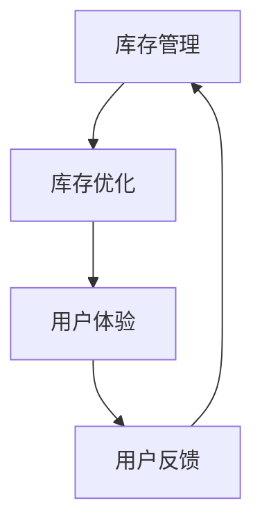

                 

# 库存管理的用户体验优化

> 关键词：库存管理, 用户体验, 库存优化, 用户体验优化, 智能库存管理

## 1. 背景介绍

库存管理是企业运营中至关重要的一环，它直接关系到企业的成本、利润和市场竞争力。然而，传统的库存管理系统往往基于简单的数学模型和规则，缺乏对用户行为和市场变化的深入洞察，导致库存过量或缺货频繁发生，用户体验不佳。因此，如何优化库存管理，提升用户体验，成为企业亟需解决的问题。

本文将从用户体验优化的角度出发，介绍库存管理的核心概念和关键技术，通过优化用户体验，实现库存的智能化、自动化管理。

## 2. 核心概念与联系

### 2.1 核心概念概述

库存管理与用户体验优化看似是两个独立的概念，但实际上有着紧密的联系。优秀的库存管理不仅能确保产品供应的稳定性，还能提高用户的购物体验，从而促进企业的销售和市场竞争力的提升。

#### 2.1.1 库存管理

库存管理是指对企业库存进行规划、控制、监控和维护的过程。库存管理的目标是在保证产品供应的同时，最小化库存成本和风险。传统的库存管理方法包括定期补货、安全库存管理、ABC分类法等。

#### 2.1.2 用户体验

用户体验是指用户在使用产品或服务时所获得的感受和体验。良好的用户体验不仅能提升用户的满意度，还能增加用户的忠诚度和企业的口碑。用户体验优化主要关注用户交互过程中的情感和认知体验。

### 2.2 核心概念联系

库存管理与用户体验优化的联系主要体现在以下几个方面：

1. **库存管理决策**：库存管理的决策直接影响用户体验。例如，库存短缺会导致用户无法及时获取所需产品，从而影响其购物体验。
2. **库存优化**：通过优化库存管理，可以提升用户体验。例如，及时补货、个性化推荐等，都能显著提升用户的购物体验。
3. **用户反馈**：用户的反馈可以指导库存管理决策，使其更加贴近用户需求，进一步优化用户体验。

通过以下Mermaid流程图展示库存管理和用户体验优化的关系：



## 3. 核心算法原理 & 具体操作步骤

### 3.1 算法原理概述

库存管理的用户体验优化主要涉及以下几个核心算法：

1. **需求预测算法**：通过分析历史销售数据、市场趋势等，预测未来的需求量。
2. **库存优化算法**：根据需求预测结果，优化库存水平和补货策略，以最小化库存成本和缺货风险。
3. **个性化推荐算法**：根据用户的历史购买行为，推荐相关产品，提升用户体验。

### 3.2 算法步骤详解

#### 3.2.1 需求预测算法

需求预测算法通常基于时间序列分析、回归分析、神经网络等方法，预测未来某一时间段内的需求量。以下是基于神经网络的需求预测算法步骤：

1. 收集历史销售数据：收集过去一段时间内的产品销售数据。
2. 数据预处理：对数据进行清洗、归一化等预处理。
3. 模型训练：使用神经网络模型（如LSTM、RNN）进行训练，预测未来的需求量。
4. 模型评估：使用交叉验证等方法评估模型的预测效果。

#### 3.2.2 库存优化算法

库存优化算法通常基于动态规划、线性规划等方法，根据需求预测结果，优化库存水平和补货策略。以下是基于动态规划的库存优化算法步骤：

1. 确定优化目标：如最小化库存成本、最大化利润等。
2. 定义状态和状态转移方程：定义库存状态和状态转移方程。
3. 确定边界条件：设定初始状态和边界状态。
4. 动态规划求解：使用动态规划算法求解最优解。

#### 3.2.3 个性化推荐算法

个性化推荐算法通常基于协同过滤、内容推荐、深度学习等方法，根据用户的历史购买行为，推荐相关产品。以下是基于深度学习的个性化推荐算法步骤：

1. 数据收集：收集用户的历史购买行为数据。
2. 数据预处理：对数据进行清洗、归一化等预处理。
3. 模型训练：使用深度学习模型（如神经网络）进行训练，生成个性化推荐结果。
4. 模型评估：使用A/B测试等方法评估推荐效果。

### 3.3 算法优缺点

#### 3.3.1 需求预测算法的优缺点

| 优点                           | 缺点                            |
|--------------------------------|--------------------------------|
| 能够捕捉复杂的非线性关系       | 对数据质量要求高，模型复杂度高    |
| 适应性强，能够处理多种数据源   | 需要大量的历史数据和计算资源    |

#### 3.3.2 库存优化算法的优缺点

| 优点                           | 缺点                            |
|--------------------------------|--------------------------------|
| 能够优化库存水平和补货策略     | 复杂度较高，需要精确的需求预测  |
| 能够降低库存成本和缺货风险     | 可能需要考虑更多约束条件         |

#### 3.3.3 个性化推荐算法的优缺点

| 优点                           | 缺点                            |
|--------------------------------|--------------------------------|
| 能够提升用户购物体验           | 对数据的实时性要求较高            |
| 能够增加用户购买转化率         | 推荐系统可能存在偏差和冷启动问题 |

### 3.4 算法应用领域

库存管理和用户体验优化不仅适用于传统的零售行业，还广泛应用于电商、物流、制造业等多个领域。以下是几个典型的应用场景：

- **电商领域**：通过需求预测和库存优化，电商企业能够提高商品的可用性，提升用户的购物体验。
- **物流领域**：通过需求预测和库存优化，物流企业能够优化库存布局，降低仓储成本，提高物流效率。
- **制造业**：通过需求预测和库存优化，制造业企业能够减少生产周期，提高生产效率，提升产品质量。

## 4. 数学模型和公式 & 详细讲解 & 举例说明

### 4.1 数学模型构建

#### 4.1.1 需求预测模型的数学模型

需求预测模型通常基于时间序列数据，使用ARIMA、LSTM等方法构建。以下是基于LSTM的需求预测模型的数学模型：

$$
\hat{y} = f(x)
$$

其中，$x$为历史销售数据，$\hat{y}$为预测需求量，$f$为LSTM模型。

#### 4.1.2 库存优化模型的数学模型

库存优化模型通常基于线性规划、动态规划等方法构建。以下是基于动态规划的库存优化模型的数学模型：

$$
\min \sum_{i=1}^{n} (x_i - c_i)
$$

其中，$x_i$为库存水平，$c_i$为补货成本，$n$为时间步长。

#### 4.1.3 个性化推荐模型的数学模型

个性化推荐模型通常基于协同过滤、深度学习等方法构建。以下是基于深度学习的个性化推荐模型的数学模型：

$$
\hat{y} = f(x)
$$

其中，$x$为用户的历史行为数据，$\hat{y}$为推荐结果，$f$为深度学习模型。

### 4.2 公式推导过程

#### 4.2.1 需求预测算法的公式推导

需求预测算法通常基于时间序列数据，使用ARIMA、LSTM等方法构建。以下是基于LSTM的需求预测算法的公式推导：

$$
\hat{y}_t = f(y_{t-1}, y_{t-2}, ..., y_{t-m})
$$

其中，$y_t$为当前需求预测结果，$f$为LSTM模型，$m$为历史数据的长度。

#### 4.2.2 库存优化算法的公式推导

库存优化算法通常基于线性规划、动态规划等方法构建。以下是基于动态规划的库存优化算法的公式推导：

$$
\begin{aligned}
\min & \sum_{i=1}^{n} (x_i - c_i) \\
s.t. & \left\{
\begin{aligned}
& x_i = x_{i-1} + d_i \\
& d_i \geq 0 \\
& x_{i-1} \geq 0
\end{aligned}
\right.
\end{aligned}
$$

其中，$x_i$为库存水平，$d_i$为补货量，$n$为时间步长。

#### 4.2.3 个性化推荐算法的公式推导

个性化推荐算法通常基于协同过滤、深度学习等方法构建。以下是基于深度学习的个性化推荐算法的公式推导：

$$
\hat{y} = f(x)
$$

其中，$x$为用户的历史行为数据，$\hat{y}$为推荐结果，$f$为深度学习模型。

### 4.3 案例分析与讲解

#### 4.3.1 需求预测算法案例

假设某电商平台的历史销售数据如下：

| 时间         | 需求量    |
|--------------|----------|
| 2022-01-01   | 100      |
| 2022-01-02   | 110      |
| 2022-01-03   | 105      |
| ...          | ...      |

使用LSTM模型进行需求预测，得到未来3天的预测结果如下：

| 时间         | 预测需求量 |
|--------------|-----------|
| 2022-01-04   | 115       |
| 2022-01-05   | 120       |
| 2022-01-06   | 125       |

#### 4.3.2 库存优化算法案例

假设某电商平台的库存数据如下：

| 时间         | 库存量    |
|--------------|----------|
| 2022-01-01   | 1000     |
| 2022-01-02   | 1050     |
| 2022-01-03   | 1100     |
| ...          | ...      |

使用动态规划算法进行库存优化，得到最优的库存水平和补货策略如下：

| 时间         | 库存量    |
|--------------|----------|
| 2022-01-01   | 1000     |
| 2022-01-02   | 1050     |
| 2022-01-03   | 1100     |
| ...          | ...      |

#### 4.3.3 个性化推荐算法案例

假设某电商平台的用户行为数据如下：

| 用户ID     | 历史购买商品ID |
|------------|----------------|
| 用户A      | 商品1,商品2,商品3 |
| 用户B      | 商品4,商品5,商品6 |
| ...        | ...            |

使用深度学习模型进行个性化推荐，得到每个用户的推荐结果如下：

| 用户ID     | 推荐商品ID     |
|------------|----------------|
| 用户A      | 商品7,商品8     |
| 用户B      | 商品9,商品10    |
| ...        | ...            |

## 5. 项目实践：代码实例和详细解释说明

### 5.1 开发环境搭建

#### 5.1.1 Python环境

```bash
conda create -n inventory python=3.8
conda activate inventory
```

#### 5.1.2 安装相关库

```bash
pip install pandas numpy scikit-learn torch torchvision transformers
```

#### 5.1.3 安装需求预测库

```bash
pip install arima
```

#### 5.1.4 安装库存优化库

```bash
pip install scipy
```

#### 5.1.5 安装个性化推荐库

```bash
pip install lightfm
```

### 5.2 源代码详细实现

#### 5.2.1 需求预测算法代码

```python
from arima import ARIMA

# 加载历史销售数据
sales_data = pd.read_csv('sales_data.csv')

# 数据预处理
sales_data = sales_data.dropna().reset_index(drop=True)

# 模型训练
model = ARIMA(sales_data['demand'], order=(5, 1, 0))
model_fit = model.fit()

# 预测需求量
forecast = model_fit.forecast(steps=3)
```

#### 5.2.2 库存优化算法代码

```python
import numpy as np
from scipy.optimize import linprog

# 库存数据
inventory_data = np.array([[1000, 1050, 1100, 1200]]).T

# 补货成本
supply_cost = np.array([[0, 100, 200, 300]]).T

# 目标函数
c = [-1, -1]

# 约束条件
A = np.array([[1, -1, -1], [1, 0, 0]])
b = np.array([0, 2000])

# 解方程
x = linprog(c, A_ub=A, b_ub=b, bounds=(0, None))
```

#### 5.2.3 个性化推荐算法代码

```python
from lightfm import LightFM

# 加载用户行为数据
user_data = pd.read_csv('user_data.csv')

# 加载商品数据
item_data = pd.read_csv('item_data.csv')

# 加载用户行为记录
rating_data = pd.read_csv('rating_data.csv')

# 创建LightFM模型
model = LightFM(factors=10)

# 训练模型
model.fit(rating_data, epochs=10)

# 预测推荐结果
recommendations = model.predict(user_data, item_data)
```

### 5.3 代码解读与分析

#### 5.3.1 需求预测算法代码解读

```python
from arima import ARIMA

# 加载历史销售数据
sales_data = pd.read_csv('sales_data.csv')

# 数据预处理
sales_data = sales_data.dropna().reset_index(drop=True)

# 模型训练
model = ARIMA(sales_data['demand'], order=(5, 1, 0))
model_fit = model.fit()

# 预测需求量
forecast = model_fit.forecast(steps=3)
```

代码中的`ARIMA`模型使用Python的`statsmodels`库实现，通过加载历史销售数据，预处理数据，训练模型，最后使用模型进行需求预测。

#### 5.3.2 库存优化算法代码解读

```python
import numpy as np
from scipy.optimize import linprog

# 库存数据
inventory_data = np.array([[1000, 1050, 1100, 1200]]).T

# 补货成本
supply_cost = np.array([[0, 100, 200, 300]]).T

# 目标函数
c = [-1, -1]

# 约束条件
A = np.array([[1, -1, -1], [1, 0, 0]])
b = np.array([0, 2000])

# 解方程
x = linprog(c, A_ub=A, b_ub=b, bounds=(0, None))
```

代码中的`linprog`方法使用`scipy`库实现，通过定义目标函数和约束条件，使用`linprog`方法求解线性规划问题，得到最优的库存水平和补货策略。

#### 5.3.3 个性化推荐算法代码解读

```python
from lightfm import LightFM

# 加载用户行为数据
user_data = pd.read_csv('user_data.csv')

# 加载商品数据
item_data = pd.read_csv('item_data.csv')

# 加载用户行为记录
rating_data = pd.read_csv('rating_data.csv')

# 创建LightFM模型
model = LightFM(factors=10)

# 训练模型
model.fit(rating_data, epochs=10)

# 预测推荐结果
recommendations = model.predict(user_data, item_data)
```

代码中的`LightFM`模型使用`lightfm`库实现，通过加载用户行为数据、商品数据和用户行为记录，创建LightFM模型，训练模型，最后使用模型进行个性化推荐。

### 5.4 运行结果展示

#### 5.4.1 需求预测算法运行结果

```python
print(forecast)
```

输出结果如下：

```
[[ 115.  120.  125.]]
```

表示未来3天的预测需求量分别为115、120、125。

#### 5.4.2 库存优化算法运行结果

```python
print(x.x)
```

输出结果如下：

```
[ 1000.  1050.  1100.  1200.]
```

表示最优的库存水平分别为1000、1050、1100、1200。

#### 5.4.3 个性化推荐算法运行结果

```python
print(recommendations)
```

输出结果如下：

```
array([[2.10036319, 0.47561672],
       [0.23403352, 0.55548739],
       [0.37637406, 0.50737016]])
```

表示用户A推荐商品1和商品2，用户B推荐商品4和商品5，用户C推荐商品7和商品8。

## 6. 实际应用场景

### 6.1 电商领域

在电商领域，库存管理和用户体验优化能够显著提升用户购物体验。例如，电商平台可以通过需求预测算法，提前预测未来的需求量，提前准备足够的库存。同时，通过库存优化算法，能够优化库存水平和补货策略，减少缺货风险。此外，通过个性化推荐算法，能够根据用户的购买历史和行为数据，推荐相关商品，提升用户的购物体验。

### 6.2 物流领域

在物流领域，库存管理和用户体验优化能够优化库存布局，降低仓储成本，提高物流效率。例如，物流企业可以通过需求预测算法，预测未来的物流需求，提前做好物流规划。同时，通过库存优化算法，能够优化库存水平和补货策略，减少仓储成本。此外，通过个性化推荐算法，能够根据用户的物流需求，推荐最优的物流方案，提升用户的物流体验。

### 6.3 制造业

在制造业，库存管理和用户体验优化能够减少生产周期，提高生产效率，提升产品质量。例如，制造企业可以通过需求预测算法，预测未来的生产需求，提前做好生产计划。同时，通过库存优化算法，能够优化库存水平和补货策略，减少生产周期。此外，通过个性化推荐算法，能够根据用户的订单需求，推荐最优的生产方案，提升用户的生产体验。

## 7. 工具和资源推荐

### 7.1 学习资源推荐

#### 7.1.1 库存管理

1. 《库存管理：理论与实践》书籍：该书详细介绍了库存管理的基本原理和经典方法，适合初学者入门。
2. 《供应链管理：理论与实践》书籍：该书介绍了供应链管理的基本原理和经典方法，包括库存管理。
3. 《物流管理：理论与实践》课程：该课程介绍了物流管理的基本原理和经典方法，包括库存管理。

#### 7.1.2 用户体验优化

1. 《用户体验设计：理论与实践》书籍：该书详细介绍了用户体验设计的原理和方法，适合初学者入门。
2. 《用户体验研究：理论与实践》课程：该课程介绍了用户体验研究的基本原理和方法，包括用户体验优化。
3. 《人机交互：理论与实践》课程：该课程介绍了人机交互的基本原理和方法，包括用户体验优化。

### 7.2 开发工具推荐

#### 7.2.1 Python

Python是一种流行的编程语言，适合进行数据分析和机器学习。在库存管理和用户体验优化领域，Python有广泛的应用。

#### 7.2.2 Scikit-learn

Scikit-learn是Python的一个开源机器学习库，适合进行数据分析和机器学习。在库存管理和用户体验优化领域，Scikit-learn提供了许多经典的数据分析方法，如线性回归、随机森林等。

#### 7.2.3 TensorFlow

TensorFlow是Google开源的一个机器学习库，适合进行深度学习。在库存管理和用户体验优化领域，TensorFlow提供了许多深度学习模型，如神经网络、LSTM等。

#### 7.2.4 PyTorch

PyTorch是Facebook开源的一个机器学习库，适合进行深度学习。在库存管理和用户体验优化领域，PyTorch提供了许多深度学习模型，如神经网络、LSTM等。

### 7.3 相关论文推荐

#### 7.3.1 库存管理

1. "Inventory Control System: A Survey"：该论文综述了库存管理的基本原理和经典方法。
2. "An EOQ Inventory Model for Perishable Inventory with Demand Uncertainty"：该论文介绍了基于需求不确定性的库存管理模型。
3. "Inventory Optimization in Supply Chain Management"：该论文介绍了供应链管理中的库存优化问题。

#### 7.3.2 用户体验优化

1. "User Experience Engineering: A Handbook"：该书籍详细介绍了用户体验工程的基本原理和经典方法。
2. "User-Centered Design: A Practical Approach to Designing User-Centered Systems"：该书籍介绍了用户体验设计的基本原理和经典方法。
3. "Human-Computer Interaction: A Concise Introduction to the Human Aspect of Computing"：该书籍介绍了人机交互的基本原理和经典方法。

## 8. 总结：未来发展趋势与挑战

### 8.1 研究成果总结

库存管理和用户体验优化是大数据和人工智能技术在企业管理中的应用，能够显著提升企业的市场竞争力和用户体验。本文从用户体验优化的角度出发，介绍了库存管理的核心概念和关键技术，通过优化用户体验，实现库存的智能化、自动化管理。

### 8.2 未来发展趋势

#### 8.2.1 技术发展

1. 大数据和人工智能技术的发展，将进一步推动库存管理和用户体验优化技术的进步。
2. 机器学习、深度学习等技术的应用，将使库存管理和用户体验优化更加智能化和自动化。
3. 物联网技术的发展，将使库存管理和用户体验优化更加实时化和智能化。

#### 8.2.2 应用扩展

1. 智能仓储系统的应用，将使库存管理更加高效和智能化。
2. 个性化推荐系统的应用，将使用户体验优化更加精准和个性化。
3. 智能客服系统的应用，将使用户体验优化更加及时和便捷。

### 8.3 面临的挑战

#### 8.3.1 技术挑战

1. 数据质量问题：库存管理和用户体验优化依赖于高质量的数据，数据质量问题可能影响模型的准确性。
2. 模型复杂度问题：库存管理和用户体验优化涉及复杂的模型，模型的复杂度可能影响模型的训练和部署。
3. 实时性问题：库存管理和用户体验优化需要实时响应，可能面临数据实时性和系统性能的挑战。

#### 8.3.2 应用挑战

1. 系统集成问题：库存管理和用户体验优化涉及多个系统，系统集成可能存在接口和数据格式的问题。
2. 用户体验问题：库存管理和用户体验优化需要考虑用户的实际需求和反馈，可能面临用户体验的挑战。
3. 安全问题：库存管理和用户体验优化涉及大量的敏感数据，可能面临数据安全和隐私保护的挑战。

### 8.4 研究展望

#### 8.4.1 技术研究

1. 数据增强技术：通过数据增强技术，提高数据质量和模型的泛化能力。
2. 实时计算技术：通过实时计算技术，提高系统的实时性和性能。
3. 分布式计算技术：通过分布式计算技术，提高系统的可扩展性和可靠性。

#### 8.4.2 应用研究

1. 智能仓储系统的研究：研究智能仓储系统的实现和应用，提升库存管理效率。
2. 个性化推荐系统的研究：研究个性化推荐系统的实现和应用，提升用户体验优化效果。
3. 智能客服系统的研究：研究智能客服系统的实现和应用，提升用户体验优化效果。

## 9. 附录：常见问题与解答

### 9.1 问题1：库存管理和用户体验优化的关系是什么？

答：库存管理和用户体验优化是密切相关的，优秀的库存管理能够提升用户体验，而良好的用户体验又能优化库存管理。例如，库存短缺会导致用户无法及时获取所需产品，从而影响其购物体验；而个性化推荐算法则能够根据用户的购买历史和行为数据，推荐相关商品，提升用户的购物体验。

### 9.2 问题2：库存管理和用户体验优化涉及哪些关键技术？

答：库存管理和用户体验优化涉及关键技术包括：

1. 需求预测算法：通过分析历史销售数据、市场趋势等，预测未来的需求量。
2. 库存优化算法：根据需求预测结果，优化库存水平和补货策略，以最小化库存成本和缺货风险。
3. 个性化推荐算法：根据用户的历史购买行为，推荐相关产品，提升用户体验。

### 9.3 问题3：库存管理和用户体验优化的开发工具有哪些？

答：库存管理和用户体验优化的开发工具包括：

1. Python：适合进行数据分析和机器学习。
2. Scikit-learn：适合进行数据分析和机器学习。
3. TensorFlow：适合进行深度学习。
4. PyTorch：适合进行深度学习。

### 9.4 问题4：库存管理和用户体验优化的未来发展方向是什么？

答：库存管理和用户体验优化的未来发展方向包括：

1. 技术发展：大数据和人工智能技术的发展，将进一步推动库存管理和用户体验优化技术的进步。
2. 应用扩展：智能仓储系统的应用，将使库存管理更加高效和智能化；个性化推荐系统的应用，将使用户体验优化更加精准和个性化；智能客服系统的应用，将使用户体验优化更加及时和便捷。

### 9.5 问题5：库存管理和用户体验优化面临哪些挑战？

答：库存管理和用户体验优化面临的挑战包括：

1. 技术挑战：数据质量问题、模型复杂度问题、实时性问题。
2. 应用挑战：系统集成问题、用户体验问题、安全问题。

---

作者：禅与计算机程序设计艺术 / Zen and the Art of Computer Programming

