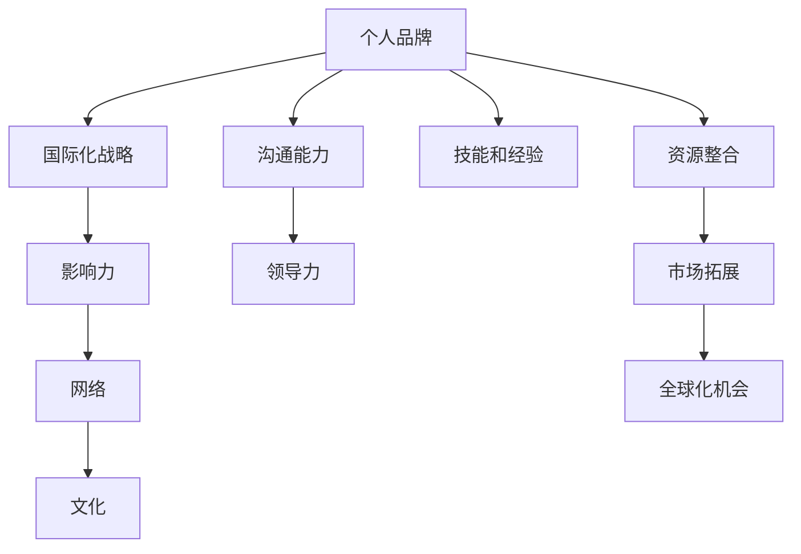

                 

# 建立个人品牌国际化战略：拓展全球影响力

## 1. 背景介绍

在全球化竞争日益激烈的时代，个人品牌的国际化战略对于职业发展具有至关重要的意义。无论是在学术界、科技企业还是创业者群体中，那些在全球舞台上具有高度影响力的个体，往往都拥有明确的国际化定位和行之有效的国际化战略。然而，成功建立和拓展个人品牌并非易事，它涉及多方面的策略和技巧。本文旨在全面解析个人品牌国际化的核心概念、原理和操作步骤，帮助读者从零开始构建和拓展其在全球的影响力。

## 2. 核心概念与联系

### 2.1 核心概念概述

个人品牌国际化战略主要包括以下几个核心概念：

- **个人品牌(Brand Personality)**：个人品牌是指个体通过一系列行为和表现，在公众中建立的独特形象和价值定位。它不仅包括个人的技能和经验，还包括沟通能力、领导力、文化适应性等软技能。
- **国际化战略(International Strategy)**：国际化战略是指个人在国际舞台上进行职业规划、资源整合、市场拓展等活动的过程，旨在提升个人在全球的影响力和竞争力。
- **影响力(Impact)**：影响力指个人或品牌对他人的影响力和控制力。在国际化背景下，影响力的拓展可以通过多渠道的传播和互动来实现。
- **网络(Networking)**：网络是指个人通过社交媒体、行业会议、跨文化交流等方式建立的全球性关系网络。一个广泛而深厚的国际化网络对于个人品牌的构建和拓展至关重要。
- **文化(Culture)**：文化差异是个人国际化过程中不可忽视的重要因素，它影响着交流方式、沟通策略和行为准则。理解和尊重不同文化背景，是成功国际化不可或缺的一部分。

这些概念之间的联系可以通过以下Mermaid流程图来展示：



这个流程图展示了个体国际化过程中，各个核心概念之间的相互关系：

1. 个人品牌是国际化战略的基石，需要建立在一定的技能和经验基础上。
2. 通过文化适应和沟通能力提升，可以更好地进行国际化战略的执行。
3. 建立广泛的网络和强大的影响力，有助于个人品牌的国际化拓展。
4. 资源整合和市场拓展是国际化战略的具体操作，能够为个人品牌带来更多的全球化机会。

## 3. 核心算法原理 & 具体操作步骤

### 3.1 算法原理概述

个人品牌的国际化战略，本质上是一个通过多种手段提升个人在全球影响力，并通过这些影响推动职业发展或实现其他目标的过程。其核心算法原理可以归纳为：

1. **品牌定位与差异化**：明确自身的优势和特色，在国际化过程中保持品牌定位的一致性和差异化。
2. **策略设计**：制定全球化的战略，包括市场选择、资源配置、行动路径等。
3. **执行与优化**：通过具体行动（如发表文章、参与会议、拓展网络等），实施国际化战略，并根据反馈进行优化。

### 3.2 算法步骤详解

1. **自我评估与定位**：
   - 列出自身的核心竞争力、专业领域、过往成就。
   - 通过SWOT分析法评估自身的优势、劣势、机会和威胁。
   - 根据自身定位，确定国际化战略的目标和方向。

2. **策略制定与实施**：
   - **目标市场选择**：选择具有潜力且与自身背景匹配的国际化市场。
   - **资源整合**：利用网络资源、专业知识、技术手段等，进行资源整合，为国际化战略提供支持。
   - **行动路径设计**：制定详细的行动计划，包括时间节点、任务分配、成果评估等。

3. **执行与反馈优化**：
   - **市场测试与调整**：小范围测试国际化行动，根据反馈进行调整。
   - **网络拓展与互动**：积极参与国际会议、论坛、社群等，拓展个人网络。
   - **文化适应与沟通**：深入了解目标市场的文化背景，提升跨文化沟通能力。

4. **影响力和品牌提升**：
   - **内容创作与传播**：通过博客、社交媒体、研究论文等形式，传播专业知识和经验。
   - **媒体曝光与合作**：寻求国际媒体曝光和合作机会，提升个人品牌知名度。
   - **持续学习与创新**：保持对新技术、新趋势的学习，不断创新和改进国际化战略。

### 3.3 算法优缺点

个人品牌国际化战略具有以下优点：
- **多渠道扩展**：通过多种渠道的传播，最大化品牌影响力。
- **目标明确**：有明确的目标和计划，减少无序行动。
- **提升竞争力**：通过国际化拓展，提升个人在全球市场的竞争力。

但同时也存在一些局限性：
- **高成本**：国际化过程可能需要大量时间和资源投入。
- **文化差异**：不同文化背景可能导致误解和沟通障碍。
- **风险管理**：全球化拓展带来更多不确定性和风险。

### 3.4 算法应用领域

个人品牌国际化战略不仅适用于科技和学术界，也适用于企业管理、市场营销、媒体传播等多个领域。其具体应用包括但不限于：

- **科技创业者**：在科技公司初创阶段，通过国际化的技术展示和市场拓展，吸引全球投资。
- **学术研究者**：在国际顶级会议上发表论文，拓展学术网络，提升学术影响力。
- **企业高管**：在全球化市场中，通过跨国公司的管理经验和品牌提升，增强企业竞争力。
- **自由职业者**：通过在线平台和国际项目，扩大客户群体，提升职业声誉。

## 4. 数学模型和公式 & 详细讲解  
### 4.1 数学模型构建

个人品牌国际化战略的数学模型主要关注以下几个关键因素：

- **影响力(I)的计算**：I = C + P + D，其中C为内容传播效果，P为个人品牌传播效果，D为社交网络传播效果。
- **资源成本(R)的评估**：R = T + H + E，其中T为时间成本，H为人力成本，E为经济成本。
- **市场潜力(M)的预测**：M = G + S + D，其中G为市场增长潜力，S为市场规模，D为市场密度。

### 4.2 公式推导过程

以影响力模型为例，我们进行如下推导：

- 内容传播效果C：C = f(A, W, R)，其中A为内容质量，W为内容可访问性，R为内容吸引力。
- 个人品牌传播效果P：P = g(M, N, I)，其中M为个人品牌知名度，N为品牌认知度，I为品牌忠诚度。
- 社交网络传播效果D：D = h(K, F, T)，其中K为网络规模，F为网络活跃度，T为网络互动频率。

通过这些函数关系，可以计算出总影响力I。

### 4.3 案例分析与讲解

以某科技创业者的国际化战略为例：
- **目标市场选择**：根据公司技术和产品特点，选择欧美市场。
- **资源整合**：通过国际合作伙伴和本地化运营团队，整合市场资源。
- **行动路径设计**：在目标市场进行市场调研、产品发布、渠道拓展等。
- **影响力和品牌提升**：通过社交媒体推广、参加国际展会、发布研究报告等手段，提升品牌影响力。

## 5. 项目实践：代码实例和详细解释说明

### 5.1 开发环境搭建

为了进行个人品牌国际化的实践，需要搭建一个包含全球化协作工具和资源管理平台的开发环境。以下是一个基本的搭建流程：

1. **创建云账户**：选择合适的云服务提供商（如AWS、Google Cloud、Azure等），创建全球账户。
2. **搭建开发环境**：使用云平台提供的开发工具，如Jupyter Notebook、GitHub、Slack等，搭建个人品牌管理平台。
3. **整合资源**：集成多语言支持、多时区管理、多货币结算等功能，支持全球化运营。

### 5.2 源代码详细实现

以下是一个简单的个人品牌国际化管理平台的代码实现示例：

```python
class BrandManager:
    def __init__(self, name, industries, skills):
        self.name = name
        self.industries = industries
        self.skills = skills
        self.countries = []

    def add_country(self, country):
        self.countries.append(country)

    def remove_country(self, country):
        if country in self.countries:
            self.countries.remove(country)

    def get_global_influence(self, influence_model):
        total_influence = 0
        for country in self.countries:
            country_influence = influence_model.calculate(country)
            total_influence += country_influence
        return total_influence

class InfluenceModel:
    def __init__(self):
        self.model_parameters = {}

    def calculate(self, country):
        # 根据模型参数计算国家影响力
        # 假设模型参数已设定
        country_influence = self.model_parameters['country_influence']
        return country_influence

# 创建品牌管理实例
brand_manager = BrandManager("John Doe", ["AI", "Data Science"], ["Python", "Machine Learning"])
brand_manager.add_country("USA")
brand_manager.add_country("UK")
brand_manager.add_country("China")

# 创建影响力模型实例
influence_model = InfluenceModel()
influence_model.model_parameters['country_influence'] = 100

# 计算全球影响力
global_influence = brand_manager.get_global_influence(influence_model)
print("Global Influence:", global_influence)
```

### 5.3 代码解读与分析

上述代码中，我们通过`BrandManager`类来管理个人品牌的相关信息，包括名称、行业、技能以及合作国家。通过`InfluenceModel`类来计算不同国家的品牌影响力。

- `BrandManager`类中，`add_country`和`remove_country`方法用于管理合作国家列表。
- `get_global_influence`方法根据国家列表和影响力模型，计算出全球影响力。
- `InfluenceModel`类中，`calculate`方法用于计算单个国家的品牌影响力。

## 6. 实际应用场景

### 6.1 国际演讲与展览

在国际演讲与展览中，个人可以通过展示自身的专业知识和经验，提升国际影响力。例如，在科技峰会上进行主旨演讲，或在专业展会上展示产品和技术，能够直接与全球同行和观众进行交流。

### 6.2 跨国公司管理

跨国公司高管可以利用国际管理经验，提升个人在全球市场的品牌知名度和影响力。通过参与跨国公司的全球战略制定和执行，可以展示自身的领导力和国际化视野。

### 6.3 国际合作与项目

通过参与国际合作项目，个人可以在全球范围内拓展其专业网络，提升个人品牌。例如，参与联合研究项目、国际学术交流、跨国企业合作等，都能带来显著的品牌提升效果。

### 6.4 未来应用展望

未来，随着全球化进程的加速，个人品牌的国际化战略将更加重要。以下是对未来应用展望的几点建议：

1. **全球数字平台建设**：利用全球数字平台进行品牌传播，如LinkedIn、Twitter等，提升全球曝光度。
2. **多元化内容创作**：结合本地化市场需求，创作多语言、多文化的内容，增加品牌吸引力。
3. **虚拟现实与增强现实**：通过虚拟现实和增强现实技术，进行沉浸式品牌推广，提升用户体验。
4. **区块链技术应用**：利用区块链技术进行身份验证和数据透明化，提升品牌信任度。

## 7. 工具和资源推荐

### 7.1 学习资源推荐

- **Coursera和edX**：提供大量国际化的在线课程，帮助提升全球化视野和跨文化沟通能力。
- **TED Talks**：观看国际知名演讲者的视频，学习如何进行国际演讲和展示。
- **Harvard Business Review**：阅读关于国际市场拓展和品牌建设的学术论文，深入理解国际化战略。

### 7.2 开发工具推荐

- **GitHub**：全球化的代码托管平台，便于团队协作和资源共享。
- **Slack**：全球化即时通讯工具，支持多语言、多时区团队协作。
- **Zoom**：全球化的视频会议工具，支持多语言字幕和虚拟背景。

### 7.3 相关论文推荐

- **《国际营销管理》**（International Marketing Management）：研究国际市场拓展的策略和实践。
- **《跨文化沟通》**（Interpersonal Communication Across Cultures）：分析不同文化背景下的沟通技巧和方法。
- **《全球化品牌建设》**（Building a Global Brand）：探讨全球品牌建设的成功案例和策略。

## 8. 总结：未来发展趋势与挑战

### 8.1 研究成果总结

本文系统解析了个人品牌国际化战略的核心概念、算法原理和操作步骤，通过理论模型和实际案例，展示了如何通过科学方法构建和拓展个人品牌。未来，随着全球化进程的加速，个人品牌的国际化战略将成为职业发展的重要组成部分。

### 8.2 未来发展趋势

未来，个人品牌的国际化战略将呈现以下几个发展趋势：

1. **数据驱动决策**：利用大数据分析工具，对全球市场进行精准定位和策略优化。
2. **技术赋能品牌**：结合人工智能、区块链等前沿技术，提升品牌传播和互动效果。
3. **多渠道融合**：将线上和线下渠道相结合，进行全方位的品牌推广。
4. **文化融合与创新**：深入理解目标市场的文化背景，创新品牌传播策略，提升品牌吸引力。

### 8.3 面临的挑战

尽管个人品牌国际化战略具有广阔的发展前景，但也面临诸多挑战：

1. **文化差异**：不同文化背景可能带来沟通障碍和误解，需要深入理解和学习。
2. **资源分配**：国际化战略需要大量资源投入，如何在全球范围内高效分配资源是一个挑战。
3. **市场不确定性**：全球市场环境复杂多变，如何应对不确定性和风险，需要制定灵活的策略。

### 8.4 研究展望

未来的研究需要关注以下几个方向：

1. **跨文化沟通机制**：研究如何建立高效的跨文化沟通机制，减少误解和冲突。
2. **资源配置优化**：探索全球资源配置的优化方法，提高国际化战略的效率。
3. **品牌传播技术**：结合新技术，探索新的品牌传播和互动方式，提升品牌影响力。

总之，个人品牌国际化战略是一个复杂而系统的工程，需要通过科学的方法和策略，不断优化和调整，才能在激烈的全球竞争中脱颖而出。

## 9. 附录：常见问题与解答

**Q1：如何选择合适的国际化市场？**

A: 选择国际化市场需要综合考虑自身优势、目标市场的需求、竞争对手情况等因素。可以通过市场调研、SWOT分析等方法，找到最具潜力的市场。

**Q2：如何在国际市场中建立广泛网络？**

A: 通过参加国际会议、加入行业协会、利用社交媒体等方式，积极拓展国际网络。同时，通过本地化合作和项目参与，逐步建立深厚的国际关系。

**Q3：如何应对文化差异？**

A: 深入了解目标市场的文化背景，学习基本的跨文化沟通技巧。可以通过语言培训、文化交流活动等方式，提升文化适应能力。

**Q4：如何管理全球资源？**

A: 利用全球化协作工具，如GitHub、Slack等，进行资源管理和团队协作。合理分配时间和资金资源，确保国际化战略的有效执行。

**Q5：如何持续提升个人品牌影响力？**

A: 持续学习和创新，通过内容创作、社交媒体互动、参与行业活动等方式，不断提升个人品牌的影响力。

---

作者：禅与计算机程序设计艺术 / Zen and the Art of Computer Programming

