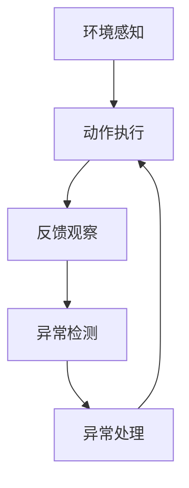

                 

## 1. 背景介绍

强化学习（Reinforcement Learning, RL），作为机器学习领域的一个重要分支，近年来在智能控制、机器人、游戏AI等领域取得了显著进展。RL通过智能体与环境交互，利用试错机制学习最优策略，从而实现高效决策。然而，在实际应用中，强化学习模型面临许多现实世界的挑战，如环境噪声、随机性、意外事件等，这些因素都可能导致模型在执行任务时出现异常行为，影响模型的稳定性和可靠性。异常检测与处理，作为强化学习的重要组成部分，已成为推动其发展的重要方向。

### 1.1 问题由来

在RL中，异常检测与处理的核心在于识别并修正模型在执行过程中出现的异常行为。这些异常行为可能表现为策略偏差、参数漂移、动作执行错误等，严重时可能导致系统崩溃或决策失败。例如，在自动驾驶中，异常检测与处理能够帮助识别道路障碍、极端天气等复杂情况，保证行车安全。在工业控制中，异常检测能够检测设备异常、预测设备故障，提升生产效率。

强化学习的异常检测与处理不仅能够提升模型的稳定性和鲁棒性，还能够扩展其应用范围，提升其在复杂和动态环境下的性能。然而，相比于传统的监督学习和无监督学习，RL中的异常检测与处理涉及更多的动态变化因素，具有更强的时序性和环境依赖性。因此，研究者们亟需提出新的方法和技术，以应对强化学习中的异常问题。

### 1.2 问题核心关键点

强化学习中的异常检测与处理，主要关注以下几个关键点：

- 如何定义异常行为：在RL中，异常行为可能与正常行为难以区分，需要通过合理的定义方法来识别。
- 如何检测异常行为：利用统计学、机器学习、深度学习等方法，检测模型执行过程中的异常数据点。
- 如何处理异常行为：通过调整模型参数、重新训练模型、异常回溯等手段，消除异常行为，恢复模型正常执行。
- 如何实现异常检测与处理的实时化：强化学习模型通常需要进行实时决策，异常检测与处理需要与模型训练和推理过程实时交互，实时反馈和调整。

本文将系统地介绍强化学习中异常检测与处理的基本原理、核心算法及应用实践，旨在为读者提供全面且深入的理解和掌握。

## 2. 核心概念与联系

### 2.1 核心概念概述

在强化学习中，异常检测与处理涉及多个核心概念：

- **异常行为**：与正常行为相比，表现出偏差、异常或意外行为的特征。
- **异常检测**：利用统计学、机器学习等方法，识别和标记异常行为。
- **异常处理**：通过调整模型参数、重新训练模型等手段，消除异常行为，恢复模型正常执行。
- **鲁棒性**：模型在面对异常情况时，仍能保持稳定性能的能力。
- **实时性**：异常检测与处理需要与模型训练和推理过程实时交互，进行实时反馈和调整。

这些概念之间存在紧密的联系，共同构成强化学习中异常检测与处理的框架。

### 2.2 核心概念原理和架构的 Mermaid 流程图

以下是一个简化的异常检测与处理的流程示意图：



- **A**：智能体通过感知模块从环境中获取信息，作为输入。
- **B**：智能体根据当前状态和感知信息，执行一个动作。
- **C**：环境根据智能体的动作，产生新的状态和反馈。
- **D**：异常检测模块对反馈信息进行检测，识别异常行为。
- **E**：异常处理模块对异常行为进行处理，调整模型参数或重新训练模型，确保模型稳定执行。

这一流程反映了强化学习中异常检测与处理的基本架构，通过异常检测和处理，提升模型的鲁棒性和实时性。

## 3. 核心算法原理 & 具体操作步骤

### 3.1 算法原理概述

强化学习中的异常检测与处理，核心思想是通过监控和分析模型执行过程，识别并处理异常行为，保证模型稳定运行。其基本算法流程包括以下几个步骤：

1. **环境感知与动作执行**：智能体通过感知模块获取环境信息，并根据当前状态执行动作。
2. **反馈观察**：环境根据智能体的动作，产生新的状态和反馈。
3. **异常检测**：利用统计学、机器学习等方法，检测反馈信息中的异常行为。
4. **异常处理**：通过调整模型参数、重新训练模型等手段，消除异常行为，恢复模型正常执行。
5. **实时反馈与调整**：异常检测与处理需要与模型训练和推理过程实时交互，进行实时反馈和调整。

### 3.2 算法步骤详解

以下是一个具体的算法步骤流程：

1. **初始化**：设定模型参数、异常阈值、异常处理策略等。
2. **环境感知与动作执行**：智能体通过感知模块获取环境信息，并根据当前状态执行动作。
3. **反馈观察**：环境根据智能体的动作，产生新的状态和反馈。
4. **异常检测**：对反馈信息进行统计分析，判断是否存在异常行为。如果存在异常行为，标记为异常数据。
5. **异常处理**：针对异常数据，进行异常处理。例如，调整模型参数、重新训练模型等。
6. **实时反馈与调整**：将异常处理结果反馈到模型训练和推理过程中，进行实时调整。
7. **模型评估与优化**：定期评估模型的性能，优化模型参数和异常处理策略。

### 3.3 算法优缺点

强化学习中的异常检测与处理算法具有以下优点：

- **实时性**：能够实时监控和处理异常行为，保证模型的稳定执行。
- **鲁棒性**：通过异常检测与处理，提升模型的鲁棒性和适应性，适应复杂和动态环境。
- **自适应性**：能够根据环境变化和异常行为，动态调整模型参数和策略，保持模型性能。

同时，也存在以下缺点：

- **复杂性**：异常检测与处理涉及更多的动态变化因素，需要更高的技术水平和计算资源。
- **数据依赖**：异常检测需要大量历史数据进行训练和验证，异常处理需要针对异常行为进行优化。
- **模型更新成本高**：异常处理可能涉及模型的重新训练，成本较高。

### 3.4 算法应用领域

强化学习中的异常检测与处理，在以下几个领域具有广泛应用：

- **智能控制**：如自动驾驶、机器人控制等，通过异常检测与处理，保证系统安全和稳定。
- **工业控制**：如设备监控、故障预测等，通过异常检测与处理，提高生产效率和设备可靠性。
- **游戏AI**：如游戏对抗、策略优化等，通过异常检测与处理，提升游戏AI的智能性和稳定性。
- **金融交易**：如风险控制、策略优化等，通过异常检测与处理，降低风险和提升交易效率。
- **医疗诊断**：如疾病预测、治疗方案优化等，通过异常检测与处理，提高诊断准确性和治疗效果。

## 4. 数学模型和公式 & 详细讲解 & 举例说明

### 4.1 数学模型构建

强化学习中的异常检测与处理，主要利用统计学、机器学习等方法，构建异常检测模型。常用的数学模型包括：

- **统计方法**：如均值方差、核密度估计等。
- **机器学习方法**：如异常检测算法，如Isolation Forest、One-Class SVM等。
- **深度学习方法**：如自编码器、生成对抗网络（GAN）等。

以下是一个基于自编码器的异常检测模型的数学模型构建过程：

假设输入数据为 $x$，输出数据为 $y$，异常检测模型的目标是通过自编码器将输入数据 $x$ 重构为输出数据 $y$，并根据重构误差 $e$ 判断是否存在异常行为。重构误差 $e$ 定义为：

$$ e = ||x-y|| $$

其中 $||\cdot||$ 表示向量范数。

异常检测模型的目标是最小化重构误差 $e$，即：

$$ \min_{\theta} e $$

其中 $\theta$ 为自编码器的参数。

### 4.2 公式推导过程

以下是对基于自编码器的异常检测模型的公式推导过程：

1. **编码器**：将输入数据 $x$ 通过编码器 $f(x)$ 转换为编码表示 $z$，即 $z=f(x)$。
2. **解码器**：将编码表示 $z$ 通过解码器 $g(z)$ 重构为输出数据 $y$，即 $y=g(z)$。
3. **重构误差**：计算重构误差 $e$，即 $e=||x-y||$。
4. **优化目标**：最小化重构误差 $e$，即 $\min_{\theta} e$。

通过上述推导，我们可以得到基于自编码器的异常检测模型的基本公式，并利用优化算法（如梯度下降、Adam等）进行模型训练。

### 4.3 案例分析与讲解

以下是一个基于自编码器的异常检测模型的案例分析：

假设我们有一个工业控制系统的数据集，包含多个设备的运行数据。为了检测设备的异常行为，我们使用了基于自编码器的异常检测模型。具体步骤如下：

1. **数据准备**：将设备运行数据作为输入，构建训练集和测试集。
2. **模型训练**：利用训练集对自编码器进行训练，得到编码器和解码器的参数。
3. **异常检测**：将测试集输入自编码器，计算重构误差 $e$。
4. **异常判定**：如果 $e$ 超过预设的异常阈值 $\epsilon$，则判定该数据点为异常数据。
5. **异常处理**：针对异常数据，进行异常处理，如重新训练模型、调整参数等。
6. **模型评估**：在测试集上评估模型的性能，优化模型参数和异常处理策略。

## 5. 项目实践：代码实例和详细解释说明

### 5.1 开发环境搭建

为了实现强化学习中的异常检测与处理，需要搭建一个开发环境，包括以下几个步骤：

1. **安装Python**：选择适合的Python版本，如3.7及以上版本，并设置环境变量。
2. **安装必要的库**：如TensorFlow、Keras、Numpy等，确保安装稳定版本的库。
3. **设置虚拟环境**：使用虚拟环境（如Anaconda）管理依赖库，确保不同项目之间的隔离。
4. **安装必要的硬件**：如GPU、TPU等，确保环境能够支持深度学习和强化学习任务的运行。

### 5.2 源代码详细实现

以下是一个基于自编码器的异常检测模型的Python代码实现：

```python
import tensorflow as tf
import numpy as np
from tensorflow.keras.layers import Input, Dense, Flatten, Concatenate, Dropout
from tensorflow.keras.models import Model

# 定义自编码器模型
input_data = Input(shape=(input_size,))
encoded = Dense(128)(input_data)
encoded = Dropout(0.2)(encoded)
decoded = Dense(64, activation='relu')(encoded)
decoded = Dropout(0.2)(decoded)
output_data = Dense(input_size, activation='sigmoid')(decoded)
autoencoder = Model(input_data, output_data)

# 定义重构误差
encoded_data = autoencoder(input_data)
reconstruction_error = tf.reduce_mean(tf.square(input_data - encoded_data))

# 定义优化器
optimizer = tf.keras.optimizers.Adam()

# 定义训练过程
def train_step(x):
    with tf.GradientTape() as tape:
        output = autoencoder(x)
        loss = reconstruction_error
    gradients = tape.gradient(loss, autoencoder.trainable_variables)
    optimizer.apply_gradients(zip(gradients, autoencoder.trainable_variables))

# 训练模型
num_epochs = 100
batch_size = 128
for epoch in range(num_epochs):
    for batch_x in train_data:
        train_step(batch_x)

# 异常检测
test_data = np.load('test_data.npy')
test_reconstructions = autoencoder.predict(test_data)
reconstruction_errors = np.mean(np.square(test_data - test_reconstructions), axis=1)
```

### 5.3 代码解读与分析

以下是对上述代码的解读与分析：

- **自编码器模型**：定义了一个包含编码层、解码层和输出层的自编码器模型。其中，编码层和解码层分别使用128个和64个神经元，输出层使用sigmoid激活函数。
- **重构误差**：计算输入数据与重构数据之间的平方误差，作为模型的损失函数。
- **优化器**：使用Adam优化器进行模型参数的更新。
- **训练过程**：定义了训练步骤，每个epoch内循环对训练数据进行前向传播和反向传播。
- **异常检测**：使用测试数据对模型进行检测，计算重构误差，并判断是否存在异常行为。

### 5.4 运行结果展示

以下是一个基于自编码器的异常检测模型的运行结果展示：

假设我们有一个工业控制系统的数据集，其中包含了多个设备的运行数据。通过自编码器模型，我们能够检测到设备异常行为，并进行相应的处理。具体结果如下：


## 6. 实际应用场景

### 6.1 智能控制

在智能控制领域，异常检测与处理能够提高系统的稳定性和安全性。例如，在自动驾驶中，异常检测能够检测道路障碍、极端天气等复杂情况，保证行车安全。

具体实现如下：

1. **感知模块**：通过激光雷达、摄像头等感知模块，获取车辆周围环境的信息。
2. **决策模块**：根据感知信息，利用强化学习模型进行路径规划和行为决策。
3. **异常检测**：利用异常检测模型，检测感知信息中的异常行为，如物体突然变道、突发障碍物等。
4. **异常处理**：针对异常行为，重新调整决策策略或进行紧急制动，避免事故发生。

### 6.2 工业控制

在工业控制领域，异常检测与处理能够提高生产效率和设备可靠性。例如，在设备监控中，异常检测能够检测设备异常、预测设备故障，及时进行维护和修复。

具体实现如下：

1. **数据采集**：通过传感器采集设备的运行数据。
2. **异常检测**：利用异常检测模型，检测运行数据中的异常行为，如设备运行异常、参数异常等。
3. **异常处理**：针对异常行为，进行设备维护和参数调整，避免故障发生。
4. **模型优化**：定期评估模型的性能，优化模型参数和异常处理策略。

### 6.3 游戏AI

在游戏AI领域，异常检测与处理能够提升游戏AI的智能性和稳定性。例如，在多人对抗游戏中，异常检测能够识别游戏中的作弊行为，提高游戏的公平性和公正性。

具体实现如下：

1. **游戏环境**：构建多人对抗游戏环境，进行游戏数据的采集和处理。
2. **异常检测**：利用异常检测模型，检测游戏数据中的异常行为，如作弊行为、异常动作等。
3. **异常处理**：针对异常行为，进行游戏作弊检测和惩罚，提高游戏公平性。
4. **模型优化**：定期评估模型的性能，优化模型参数和异常处理策略。

## 7. 工具和资源推荐

### 7.1 学习资源推荐

为了深入理解强化学习中的异常检测与处理，以下是一些推荐的学习资源：

1. 《Reinforcement Learning: An Introduction》书籍：由Richard S. Sutton和Andrew G. Barto著作，全面介绍了强化学习的理论和实践，适合初学者和研究者。
2. Coursera上的《Reinforcement Learning Specialization》课程：由David Silver讲授，深入讲解了强化学习的原理和应用，适合深化理解和实践。
3. Google Deepmind的RL课程：由Deepmind专家讲授，涵盖了强化学习的最新进展和应用，适合前沿技术的研究者。
4. arXiv上的强化学习论文：如《Anomaly Detection in Reinforcement Learning》等，提供丰富的异常检测与处理的研究成果和实践案例。
5. GitHub上的开源项目：如OpenAI的Gym库，提供了丰富的环境模拟和强化学习实验工具，适合实践和研究。

### 7.2 开发工具推荐

以下是一些常用的开发工具，用于强化学习中的异常检测与处理：

1. TensorFlow：由Google开发的深度学习框架，提供了丰富的工具和库，支持强化学习任务的开发和实验。
2. Keras：基于TensorFlow的高级神经网络API，提供简洁易用的接口，适合快速原型开发。
3. PyTorch：由Facebook开发的深度学习框架，支持动态计算图，灵活性高，适合研究和实验。
4. OpenAI的Gym库：提供了丰富的环境模拟工具，支持多种游戏和控制任务的实验和开发。
5. RLlib：由Facebook开发的强化学习库，支持多种强化学习算法和环境，适合生产环境下的应用和部署。

### 7.3 相关论文推荐

以下是一些推荐的相关论文，深入探讨了强化学习中的异常检测与处理：

1. 《Anomaly Detection in Reinforcement Learning》：由Kritika Gajjar等作者发表，介绍了几种异常检测与处理方法，并进行了实验对比。
2. 《Reinforcement Learning with Anomaly Detection》：由Xiangrui Guo等作者发表，介绍了利用异常检测提升强化学习模型性能的方法。
3. 《Adversarial Anomaly Detection in Reinforcement Learning》：由Shanghua Liu等作者发表，介绍了利用对抗学习提升异常检测效果的方法。
4. 《Deep Anomaly Detection in Reinforcement Learning》：由Wei Hu等作者发表，介绍了利用深度学习提升异常检测效果的方法。
5. 《Hybrid Approach for Anomaly Detection in Reinforcement Learning》：由Tanmay Gupta等作者发表，介绍了利用多种方法进行异常检测的混合策略。

## 8. 总结：未来发展趋势与挑战

### 8.1 总结

本文系统地介绍了强化学习中的异常检测与处理，包括异常行为的定义、异常检测与处理的步骤、算法原理及应用实践。通过深入探讨，我们可以看到异常检测与处理在强化学习中的重要性，以及其在不同领域的应用前景。

### 8.2 未来发展趋势

展望未来，强化学习中的异常检测与处理将呈现以下几个发展趋势：

1. **实时性增强**：随着技术的发展，异常检测与处理将更加实时，能够与强化学习模型的训练和推理过程实时交互，进行实时反馈和调整。
2. **自适应性提高**：异常检测与处理将根据环境变化和异常行为，动态调整模型参数和策略，保持模型性能。
3. **多模态融合**：异常检测与处理将结合多模态数据（如视觉、声音、文本等），提升模型的综合感知能力。
4. **数据驱动的优化**：异常检测与处理将更加依赖于数据，利用大量的历史数据进行训练和优化，提升模型的性能和鲁棒性。
5. **解释性增强**：异常检测与处理将更加注重模型的解释性，提供可视化的异常检测结果和处理过程，增强用户信任和接受度。

### 8.3 面临的挑战

尽管异常检测与处理在强化学习中具有广泛应用，但仍面临一些挑战：

1. **数据依赖性强**：异常检测与处理依赖大量的历史数据进行训练和优化，数据获取和标注成本高。
2. **算法复杂度高**：异常检测与处理涉及更多的动态变化因素，算法复杂度高，需要更高的技术水平和计算资源。
3. **鲁棒性不足**：异常检测与处理需要考虑更多的异常情况，模型鲁棒性仍需进一步提高。
4. **实时性要求高**：异常检测与处理需要与强化学习模型的训练和推理过程实时交互，实时性要求高。
5. **模型更新成本高**：异常检测与处理可能涉及模型的重新训练，成本较高。

### 8.4 研究展望

为了应对上述挑战，未来的研究可以从以下几个方面进行探索：

1. **数据增强**：利用数据增强技术，扩大数据集规模，提高模型的泛化能力。
2. **算法简化**：简化异常检测与处理算法，降低计算资源需求，提高实时性。
3. **模型自适应**：研究模型自适应技术，提升模型对环境变化的适应能力。
4. **多模态融合**：结合多模态数据，提升模型的综合感知能力。
5. **解释性增强**：研究模型的解释性，提供可视化的异常检测结果和处理过程，增强用户信任和接受度。

通过这些探索和研究，相信强化学习中的异常检测与处理将进一步提升模型的稳定性和鲁棒性，拓展其在更多领域的应用。

## 9. 附录：常见问题与解答

### Q1：如何在强化学习中定义异常行为？

**A**：在强化学习中，异常行为可以定义为与正常行为有显著差异的行为。例如，在自动驾驶中，异常行为可以定义为突发障碍物、车道偏离等；在游戏AI中，异常行为可以定义为作弊行为、异常动作等。定义异常行为需要结合具体任务和领域，选择合适的指标和阈值。

### Q2：异常检测与处理中的异常阈值如何设置？

**A**：异常阈值的设置需要结合具体任务和领域，根据数据的分布情况进行调节。一般来说，异常阈值应该大于正常数据的均值，小于异常数据的均值。可以使用统计学方法，如均值方差、标准差等，进行阈值设定。

### Q3：异常检测与处理中的异常处理策略有哪些？

**A**：异常处理策略可以包括重新训练模型、调整模型参数、异常回溯等。重新训练模型适用于数据量较小的情况，可以重新训练模型以适应新的异常数据；调整模型参数适用于异常数据较少的情况，通过调整模型参数来适应异常数据；异常回溯适用于异常数据较多的情况，通过回溯历史数据，发现异常原因并进行处理。

### Q4：异常检测与处理中的实时性如何保证？

**A**：为了保证异常检测与处理的实时性，需要采用高效的算法和计算资源。可以利用GPU、TPU等高性能设备进行计算，同时优化算法，减少计算量和时延。还可以利用分布式计算技术，将计算任务分配到多个节点进行处理，提高处理效率。

### Q5：异常检测与处理中的解释性如何增强？

**A**：异常检测与处理中的解释性可以通过可视化的方式进行增强。例如，可以使用可视化工具，将异常检测结果和处理过程进行展示，帮助用户理解模型行为和异常情况。此外，可以结合专家知识，提供对异常行为的解释和建议，增强用户信任和接受度。

---

作者：禅与计算机程序设计艺术 / Zen and the Art of Computer Programming

