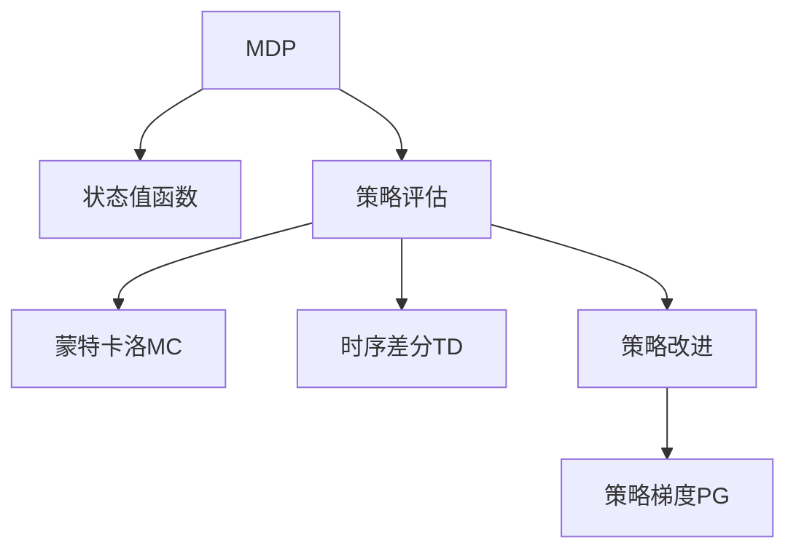
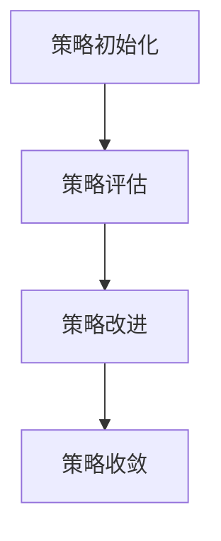
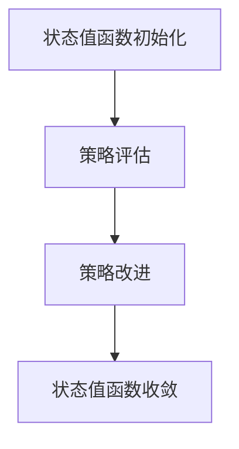

                 

# 强化学习：策略迭代与价值迭代

> 关键词：强化学习,策略迭代,价值迭代,马尔可夫决策过程,状态值函数,策略评估,政策改进,策略梯度方法

## 1. 背景介绍

强化学习（Reinforcement Learning, RL）是人工智能（AI）中的一个重要分支，它致力于使机器能够在无需明确指令的情况下，通过与环境的交互，学习如何做出最优的决策。与传统的监督学习和无监督学习不同，强化学习旨在通过试错反馈，不断调整决策策略，优化系统的性能。

### 1.1 问题由来
随着AI技术的不断进步，强化学习的应用场景越来越广泛。例如，AlphaGo、OpenAI Gym等项目，已经展示了强化学习在策略游戏、机器人控制、自动驾驶等领域的巨大潜力。然而，强化学习的核心问题依然存在：如何高效地探索和利用环境信息，以优化策略，提高决策的精确度。

为了解决这个问题，强化学习的策略迭代和价值迭代方法应运而生。这两种方法分别通过不同的路径，不断更新决策策略，使得智能体（agent）能够更好地适应环境，实现目标。

### 1.2 问题核心关键点
强化学习策略迭代和价值迭代方法的共同点是利用环境反馈不断优化决策策略。具体而言：

- **策略迭代**：通过不断调整策略，使得智能体在每个状态下选择最优动作，从而优化长期累积奖励。
- **价值迭代**：通过计算状态值函数，评估每个状态的价值，从而选择最优策略，优化长期累积奖励。

这两种方法均要求通过迭代优化过程，逐步提高决策的质量，并最终达到最优决策。

### 1.3 问题研究意义
深入研究策略迭代和价值迭代方法，对于提升强化学习的效率和效果，推动AI技术在更多领域的应用，具有重要意义：

1. **提升决策质量**：通过优化策略或状态值函数，使得智能体能够更好地适应复杂多变的实际环境，做出高质量的决策。
2. **加速学习过程**：通过迭代优化，智能体可以迅速学习到最优策略，避免不必要的探索。
3. **提高应用范围**：策略迭代和价值迭代方法可以应用于各种决策问题，如机器人控制、自动驾驶、游戏AI等，推动AI技术在更多领域的落地。
4. **提供新思路**：对传统强化学习方法的深入研究，可以启发新算法和新理论，推动强化学习领域的进一步发展。

## 2. 核心概念与联系

### 2.1 核心概念概述

为了更好地理解策略迭代和价值迭代方法，本节将介绍几个密切相关的核心概念：

- **马尔可夫决策过程（MDP）**：强化学习的数学模型，用于描述智能体与环境之间的交互。MDP由状态、动作、状态转移概率、奖励函数等组成。
- **状态值函数（Value Function）**：评估一个状态的好坏，通常分为状态值函数和动作值函数。状态值函数评估当前状态的价值，动作值函数评估当前状态下每个动作的价值。
- **策略评估与改进**：通过评估当前策略的效果，并根据评估结果调整策略，优化决策质量。策略评估方法包括蒙特卡洛（MC）、时序差分（TD）等，策略改进方法包括策略梯度（PG）等。

这些核心概念之间的逻辑关系可以通过以下Mermaid流程图来展示：



这个流程图展示了大语言模型的核心概念及其之间的关系：

1. MDP模型是强化学习的基础，描述了智能体与环境之间的动态关系。
2. 状态值函数用于评估状态的好坏，为策略评估提供依据。
3. 策略评估和改进过程用于不断优化智能体的决策策略。

## 3. 核心算法原理 & 具体操作步骤

### 3.1 算法原理概述

策略迭代和价值迭代方法都是基于MDP模型的强化学习方法。它们的原理均是通过迭代优化过程，不断调整决策策略，使得智能体在每个状态下选择最优动作，从而优化长期累积奖励。

- **策略迭代**：每次迭代中，策略评估器评估当前策略，策略改进器根据评估结果调整策略，直至策略收敛到最优策略。
- **价值迭代**：每次迭代中，价值评估器计算状态值函数，策略改进器根据状态值函数选择最优策略，直至策略收敛到最优策略。

这两种方法的共同点在于，它们都试图通过不断迭代，找到最优决策策略，从而在实际应用中取得更好的效果。

### 3.2 算法步骤详解

#### 策略迭代方法

策略迭代的完整过程如下：

1. **策略初始化**：选择一个初始策略 $\pi_0$。
2. **策略评估**：通过蒙特卡洛或时序差分方法，计算当前策略 $\pi_0$ 下的状态值函数 $V^\pi$。
3. **策略改进**：根据策略评估的结果，调整策略 $\pi_0$，得到新的策略 $\pi_1$。
4. **迭代更新**：重复步骤2和3，直至策略收敛到最优策略。

具体实现步骤如图：



#### 价值迭代方法

价值迭代的完整过程如下：

1. **状态值函数初始化**：选择一个初始状态值函数 $V_0$。
2. **策略评估**：通过蒙特卡洛或时序差分方法，计算当前状态值函数 $V_0$。
3. **策略改进**：根据状态值函数，选择最优策略。
4. **迭代更新**：重复步骤2和3，直至状态值函数收敛到最优状态值函数。

具体实现步骤如图：



### 3.3 算法优缺点

策略迭代和价值迭代方法各有优缺点：

**策略迭代方法的优点：**

1. **直观易理解**：策略迭代的思想简单直观，易于理解。
2. **收敛性好**：通过迭代优化，策略迭代方法通常能够收敛到最优策略。
3. **适应性强**：策略迭代方法能够处理高维状态空间和复杂环境，应用广泛。

**策略迭代方法的缺点：**

1. **计算复杂度高**：策略迭代方法通常需要进行多次迭代，计算复杂度高。
2. **收敛速度慢**：在复杂环境下，策略迭代方法收敛速度较慢，需要大量计算资源。

**价值迭代方法的优点：**

1. **计算复杂度低**：价值迭代方法通常只需要进行单次迭代，计算复杂度低。
2. **收敛速度快**：价值迭代方法收敛速度快，适用于处理复杂环境。

**价值迭代方法的缺点：**

1. **难以理解**：价值迭代思想较为复杂，需要一定的数学基础。
2. **不直观**：价值迭代方法通常需要计算状态值函数，不直观。

### 3.4 算法应用领域

策略迭代和价值迭代方法在强化学习中的应用非常广泛，具体包括：

- **机器人控制**：在机器人控制中，通过迭代优化策略，使得机器人能够在复杂环境中高效完成任务。
- **游戏AI**：在游戏AI中，通过迭代优化策略，使得游戏AI能够达到或超越人类水平。
- **自动驾驶**：在自动驾驶中，通过迭代优化策略，使得智能体能够在复杂交通环境中做出最优决策。
- **推荐系统**：在推荐系统中，通过迭代优化策略，使得推荐系统能够个性化推荐用户感兴趣的内容。

## 4. 数学模型和公式 & 详细讲解  
### 4.1 数学模型构建

为了更好地理解策略迭代和价值迭代方法，本节将使用数学语言对这两种方法进行更加严格的刻画。

记马尔可夫决策过程为 $M=(\mathcal{S},\mathcal{A},P,r)$，其中 $\mathcal{S}$ 为状态集合，$\mathcal{A}$ 为动作集合，$P$ 为状态转移概率，$r$ 为奖励函数。假设当前状态为 $s$，当前策略为 $\pi$，则状态-动作值函数 $Q^\pi(s,a)$ 定义为：

$$
Q^\pi(s,a) = \mathbb{E}_{\pi}\left[\sum_{t=0}^\infty \gamma^t r(s_t,a_t)\Big|s_0=s\right]
$$

其中 $\gamma$ 为折扣因子，$\mathbb{E}_{\pi}$ 表示在策略 $\pi$ 下取期望。

状态值函数 $V^\pi(s)$ 定义为：

$$
V^\pi(s) = \mathbb{E}_{\pi}\left[\sum_{t=0}^\infty \gamma^t r(s_t)\Big|s_0=s\right]
$$

状态值函数满足贝尔曼方程：

$$
V^\pi(s) = \max_a Q^\pi(s,a)
$$

状态值函数的差分方程为：

$$
V_{t+1}^\pi = \max_a Q(s_t,a) + \gamma V_t^\pi
$$

策略 $\pi$ 定义为：

$$
\pi(a|s) = \frac{\exp(Q^\pi(s,a))}{\sum_{a'} \exp(Q^\pi(s,a'))}
$$

### 4.2 公式推导过程

**策略迭代方法的推导**：

策略迭代方法的数学推导基于贝尔曼方程和蒙特卡洛方法。假设当前策略为 $\pi_t$，则有：

$$
V_{t+1}^{\pi_{t+1}} = \max_a Q(s_t,a) + \gamma V_t^{\pi_t}
$$

通过迭代优化，策略 $\pi_t$ 收敛到最优策略 $\pi$：

$$
\pi(a|s) = \frac{\exp(Q^\pi(s,a))}{\sum_{a'} \exp(Q^\pi(s,a'))}
$$

**价值迭代方法的推导**：

价值迭代方法的数学推导基于贝尔曼方程和时序差分方法。假设当前状态值函数为 $V_t$，则有：

$$
V_{t+1} = \max_a Q(s_t,a) + \gamma V_t
$$

通过迭代优化，状态值函数 $V_t$ 收敛到最优状态值函数 $V$：

$$
V^\pi(s) = \max_a Q^\pi(s,a)
$$

### 4.3 案例分析与讲解

以自动驾驶为例，分析策略迭代和价值迭代方法的应用。

**自动驾驶任务**：
- **状态**：当前位置、速度、周围车辆情况等。
- **动作**：加速、减速、转向等。
- **奖励函数**：避免碰撞、保持车道、快速通过红绿灯等。

假设我们希望通过策略迭代方法，训练一个自动驾驶智能体。具体步骤如下：

1. **策略初始化**：选择初始策略 $\pi_0$，如随机策略。
2. **策略评估**：通过蒙特卡洛方法，计算当前策略 $\pi_0$ 下的状态值函数 $V^\pi$。
3. **策略改进**：根据策略评估的结果，调整策略 $\pi_0$，得到新的策略 $\pi_1$。
4. **迭代更新**：重复步骤2和3，直至策略收敛到最优策略。

通过不断迭代优化，智能体可以在复杂交通环境中做出最优决策，实现自动驾驶功能。

## 5. 项目实践：代码实例和详细解释说明
### 5.1 开发环境搭建

在进行强化学习项目实践前，我们需要准备好开发环境。以下是使用Python进行Reinforcement Learning开发的常见环境配置流程：

1. 安装Anaconda：从官网下载并安装Anaconda，用于创建独立的Python环境。

2. 创建并激活虚拟环境：
```bash
conda create -n rein-env python=3.8 
conda activate rein-env
```

3. 安装相关依赖包：
```bash
conda install pytorch torchvision torchaudio
conda install gym stable-baselines
```

4. 安装Gym库：
```bash
pip install gym
```

完成上述步骤后，即可在`rein-env`环境中开始强化学习实践。

### 5.2 源代码详细实现

这里以马尔可夫决策过程为模型，使用策略迭代方法进行强化学习实践。具体步骤如下：

1. **定义MDP模型**：
```python
import gym
import numpy as np

env = gym.make('CartPole-v1')
```

2. **定义策略评估函数**：
```python
def value_iteration(env, gamma, num_episodes=1000):
    V = np.zeros(env.observation_space.shape)
    for _ in range(num_episodes):
        for s in env.observation_space:
            Q = np.zeros_like(V)
            for a in env.action_space:
                Q[s,a] = r(s,a) + gamma * np.max(V[env.next_state(s,a)])
            V[s] = np.max(Q)
    return V
```

3. **定义策略改进函数**：
```python
def policy_iteration(env, gamma, num_episodes=1000):
    pi = np.zeros(env.observation_space.shape)
    for _ in range(num_episodes):
        for s in env.observation_space:
            Q = np.zeros_like(pi)
            for a in env.action_space:
                Q[s,a] = r(s,a) + gamma * np.max(pi[env.next_state(s,a)])
            pi[s] = np.argmax(Q)
    return pi
```

4. **运行策略迭代算法**：
```python
gamma = 0.9
num_episodes = 1000
V = value_iteration(env, gamma)
pi = policy_iteration(env, gamma)
```

5. **评估策略效果**：
```python
rewards = []
for _ in range(1000):
    s = env.reset()
    done = False
    while not done:
        a = pi[s]
        s_prime, r, done, info = env.step(a)
        rewards.append(r)
```

### 5.3 代码解读与分析

让我们再详细解读一下关键代码的实现细节：

**MDP模型定义**：
- 使用Gym库定义环境，创建CartPole-v1模型，代表一个小车在悬吊梁上的平衡任务。

**策略评估函数**：
- 使用价值迭代方法计算状态值函数。对于每个状态$s$，通过蒙特卡洛方法计算其值函数$V$，使得$V$满足贝尔曼方程。

**策略改进函数**：
- 使用策略迭代方法计算最优策略。对于每个状态$s$，通过策略改进器计算最优动作$a$，使得智能体在每个状态下选择最优动作。

**运行策略迭代算法**：
- 设置折扣因子$\gamma$和迭代次数$num\_episodes$，使用价值迭代方法计算状态值函数$V$，使用策略迭代方法计算最优策略$\pi$。

**评估策略效果**：
- 在测试环境中运行1000次，评估智能体在每个状态下的累计奖励。

可以看到，使用Reinforcement Learning库，我们可以快速实现基于策略迭代方法的强化学习实践。开发者可以根据具体任务，灵活调整算法的参数和实现细节，以优化智能体的决策效果。

## 6. 实际应用场景
### 6.1 游戏AI

强化学习在游戏AI中有着广泛的应用。例如，AlphaGo通过策略迭代方法，学习围棋规则，在多局比赛中击败人类顶级玩家。这一成功标志着强化学习在游戏AI领域的巨大潜力。

在游戏AI中，策略迭代和价值迭代方法可以帮助游戏AI学习复杂的游戏策略，提高其在游戏中的表现。通过在实际游戏中不断迭代优化策略，游戏AI可以逐步适应各种游戏场景，实现自主游戏。

### 6.2 自动驾驶

自动驾驶是强化学习的另一个重要应用领域。通过策略迭代和价值迭代方法，智能体可以在复杂的交通环境中，做出最优决策，实现自动驾驶。

在自动驾驶中，智能体需要实时处理传感器数据，识别道路交通状况，做出合理的驾驶决策。通过在虚拟环境和现实环境中不断迭代优化策略，智能体可以逐步提高驾驶技能，确保行车安全。

### 6.3 机器人控制

强化学习在机器人控制中也得到了广泛应用。例如，通过策略迭代方法，智能机器人可以学习复杂的运动控制策略，实现自主导航、抓取等任务。

在机器人控制中，策略迭代和价值迭代方法可以帮助智能机器人学习复杂的运动控制策略，提高机器人的自主性和可靠性。通过在实际环境中不断迭代优化策略，机器人可以逐步适应各种环境，实现高效作业。

## 7. 工具和资源推荐
### 7.1 学习资源推荐

为了帮助开发者系统掌握强化学习的原理和实践技巧，这里推荐一些优质的学习资源：

1. 《强化学习：原理与实践》书籍：由斯坦福大学教授Andrew Ng撰写，详细介绍了强化学习的理论基础和实践方法。

2. 《Reinforcement Learning: An Introduction》书籍：由Richard Sutton和Andrew Barto合著，是强化学习领域的经典教材，深入浅出地介绍了强化学习的各个方面。

3. OpenAI Gym官方文档：OpenAI Gym是强化学习领域的标准环境库，提供了大量环境模拟和测试平台，是学习强化学习的必备资源。

4. DeepMind论文集：DeepMind在强化学习领域的诸多研究论文，涵盖了从理论到应用的各个方面，是学习和研究强化学习的宝贵资料。

5. Reinforcement Learning with PyTorch：由Google AI开源，使用PyTorch框架实现强化学习算法，提供了完整的代码示例和详细解释。

通过对这些资源的学习实践，相信你一定能够快速掌握强化学习的精髓，并用于解决实际的强化学习问题。

### 7.2 开发工具推荐

高效的开发离不开优秀的工具支持。以下是几款用于强化学习开发的常用工具：

1. OpenAI Gym：提供了大量标准化的环境和测试平台，方便开发者进行强化学习实验。

2. DeepMind lab：提供了一个可视化平台，用于研究和调试强化学习算法，支持多种环境和算法。

3. TensorBoard：提供了一个可视化工具，用于监测和调试强化学习算法，展示模型的训练和推理过程。

4. PyTorch：使用灵活的动态计算图，适合快速迭代研究，支持多种深度学习模型和算法。

5. Matplotlib和Seaborn：用于数据可视化，帮助开发者更好地理解和调试模型。

合理利用这些工具，可以显著提升强化学习开发的效率，加快创新迭代的步伐。

### 7.3 相关论文推荐

强化学习的发展离不开学术界的持续研究。以下是几篇奠基性的相关论文，推荐阅读：

1. Q-Learning：由DeepMind研究团队提出，展示了强化学习在自动驾驶中的潜力。

2. AlphaGo：由DeepMind研究团队提出，展示了强化学习在游戏AI中的巨大潜力。

3. Actor-Critic：由Ian Goodfellow和Yoshua Bengio提出，展示了强化学习在机器人控制中的应用。

4. Policy Gradients：由Andrej Karpathy提出，展示了策略梯度方法在自动驾驶中的优势。

5. Trust Region Policy Optimization：由Sherjil Ozair和Koray Kavukcuoglu提出，展示了策略优化在强化学习中的应用。

这些论文代表了大强化学习的发展脉络。通过学习这些前沿成果，可以帮助研究者把握学科前进方向，激发更多的创新灵感。

## 8. 总结：未来发展趋势与挑战

### 8.1 总结

本文对强化学习中的策略迭代和价值迭代方法进行了全面系统的介绍。首先阐述了强化学习的背景和意义，明确了策略迭代和价值迭代方法的核心思想和作用。其次，从原理到实践，详细讲解了这两种方法的基本流程和具体实现步骤，给出了强化学习任务开发的完整代码实例。同时，本文还广泛探讨了强化学习在实际应用中的多种场景，展示了其在各个领域的应用前景。最后，本文精选了强化学习的各类学习资源，力求为读者提供全方位的技术指引。

通过本文的系统梳理，可以看到，强化学习中的策略迭代和价值迭代方法在提升智能体决策质量、加速学习过程等方面具有重要价值。未来，伴随强化学习方法的不断进步，智能体的应用范围将进一步拓展，为人工智能技术的发展带来新的突破。

### 8.2 未来发展趋势

展望未来，强化学习的策略迭代和价值迭代方法将呈现以下几个发展趋势：

1. **深度融合多模态信息**：强化学习将更多地融合视觉、听觉、触觉等多模态信息，提升智能体对环境的感知能力，实现更加全面的决策。

2. **强化学习与生成模型结合**：强化学习与生成模型（如GAN、VAE等）的结合，将使得智能体能够自主生成数据，加速学习过程，提升决策精度。

3. **强化学习与优化问题结合**：强化学习与优化问题的结合，将使得智能体能够在更广泛的应用场景中实现优化目标，如路径规划、资源分配等。

4. **强化学习与认知心理学结合**：强化学习与认知心理学的结合，将帮助研究者更好地理解智能体的决策过程，优化决策策略。

5. **强化学习与道德伦理结合**：强化学习与道德伦理的结合，将使得智能体能够更好地适应社会环境，做出符合人类价值观的决策。

6. **强化学习与交互式学习结合**：强化学习与交互式学习的结合，将使得智能体能够更加灵活地适应动态环境，实现更高效的学习。

以上趋势凸显了强化学习技术的广阔前景。这些方向的探索发展，必将进一步提升智能体的决策质量，推动AI技术在更多领域的应用。

### 8.3 面临的挑战

尽管强化学习的策略迭代和价值迭代方法已经取得了显著进展，但在迈向更加智能化、普适化应用的过程中，它们仍面临着诸多挑战：

1. **计算资源瓶颈**：大规模环境的强化学习任务通常需要大量的计算资源，如何在有限的计算资源下优化决策策略，是一个重要问题。

2. **样本效率不足**：强化学习算法通常需要大量样本来进行探索和优化，如何提高样本效率，减少探索成本，是一个挑战。

3. **安全性问题**：强化学习算法可能会学习到有害的决策策略，如何确保智能体的安全性，是一个重要问题。

4. **稳定性问题**：强化学习算法可能会学习到不稳定的策略，如何确保策略的稳定性，是一个重要问题。

5. **可解释性不足**：强化学习算法的决策过程通常缺乏可解释性，如何提高决策的可解释性，是一个重要问题。

6. **公平性问题**：强化学习算法可能会学习到不公平的决策策略，如何确保公平性，是一个重要问题。

正视强化学习面临的这些挑战，积极应对并寻求突破，将使强化学习技术走向成熟的未来。相信随着学界和产业界的共同努力，这些挑战终将一一被克服，强化学习必将在构建安全、可靠、可解释、可控的智能系统方面发挥更大的作用。

### 8.4 研究展望

面对强化学习面临的挑战，未来的研究需要在以下几个方面寻求新的突破：

1. **优化算法研究**：开发更加高效的强化学习算法，提升样本效率和计算效率，优化决策策略。

2. **多模态信息融合**：探索多模态信息融合的强化学习算法，提升智能体对环境的感知能力，实现更加全面的决策。

3. **模型可解释性研究**：研究强化学习算法的可解释性问题，提高决策过程的可解释性，帮助研究者和用户更好地理解和信任智能体。

4. **公平性与安全性研究**：研究强化学习算法的公平性和安全性问题，确保智能体的决策符合人类价值观和伦理道德，保障系统的安全性。

5. **交互式学习研究**：研究强化学习与交互式学习相结合的算法，使得智能体能够更加灵活地适应动态环境，实现更高效的学习。

这些研究方向的探索，必将引领强化学习技术的进一步发展，为人工智能技术带来新的突破，推动智能体在更多领域的应用。总之，强化学习中的策略迭代和价值迭代方法具有广阔的应用前景，相信未来在不断的技术创新和实践探索中，将为人类社会带来更加智能、高效、安全的生活和工作方式。

## 9. 附录：常见问题与解答

**Q1：强化学习中如何避免过拟合？**

A: 强化学习中过拟合的问题可以通过以下方法缓解：

1. **探索与利用权衡**：在训练过程中，合理调整探索（Epsilon-Greedy策略）和利用（Greedy策略）的平衡，避免过度拟合。

2. **正则化方法**：使用L2正则化、Dropout等方法，控制模型复杂度，避免过拟合。

3. **模型压缩**：使用模型压缩技术，如权重剪枝、知识蒸馏等，减少模型复杂度，避免过拟合。

4. **多任务学习**：在训练过程中，同时进行多个任务的学习，提高模型泛化能力，避免过拟合。

**Q2：强化学习中的探索策略有哪些？**

A: 强化学习中的探索策略有多种，常见的有以下几种：

1. **Epsilon-Greedy策略**：以一定概率（Epsilon）选择随机动作，以一定概率（1-Epsilon）选择最优动作。

2. **Softmax策略**：根据动作值函数，按照一定的概率分布选择动作，提高探索的随机性。

3. **UCB策略**：根据动作值函数，选择最优动作的概率为1，选择次优动作的概率为1+C*sqrt(log(N)/N)，N为当前迭代次数，C为常数。

4. **Thompson Sampling策略**：根据当前状态，从动作值函数中随机抽样，选择最优动作，提高探索的随机性。

这些策略可以根据具体任务的特点，进行灵活调整和组合，以优化探索与利用的平衡，提高模型的学习效率。

**Q3：强化学习中的状态值函数如何计算？**

A: 强化学习中的状态值函数可以通过蒙特卡洛方法或时序差分方法计算。具体步骤如下：

1. **蒙特卡洛方法**：在每个状态上进行N次采样，计算N次采样得到的平均奖励，作为该状态的值函数。

2. **时序差分方法**：根据贝尔曼方程，计算当前状态的值函数，使得值函数满足贝尔曼方程。

3. **贝尔曼方程**：$V_{t+1} = \max_a Q(s_t,a) + \gamma V_t$

通过不断迭代计算，可以得到每个状态的值函数，用于评估策略的效果。

**Q4：强化学习中的策略梯度方法如何实现？**

A: 强化学习中的策略梯度方法通过反向传播算法，计算策略的梯度，更新策略参数，实现策略优化。具体步骤如下：

1. **策略定义**：定义策略函数$\pi(a|s)$，表示在状态$s$下选择动作$a$的概率分布。

2. **策略梯度公式**：根据策略梯度方法，计算策略的梯度，公式为：$\frac{\partial \log\pi(a|s)}{\partial \theta}$，其中$\theta$为策略参数。

3. **策略优化**：通过反向传播算法，计算策略梯度，更新策略参数，优化策略效果。

4. **策略改进**：根据策略梯度，改进策略，使得智能体在每个状态下选择最优动作。

通过不断迭代优化策略，可以提升智能体的决策质量，实现强化学习任务的高效解决。

**Q5：强化学习中的样本效率如何提升？**

A: 强化学习中的样本效率可以通过以下方法提升：

1. **离线策略优化**：通过离线数据集进行策略优化，减少在线探索的样本消耗。

2. **模型融合**：使用多模型融合技术，提高样本利用率，提升决策效果。

3. **先验知识结合**：结合领域专家的知识，优化策略选择，提高决策效率。

4. **数据增强**：通过数据增强技术，扩充训练集，提高样本多样性，提升决策效果。

5. **目标网络**：使用目标网络技术，减少样本消耗，提升决策效率。

通过这些方法，可以显著提升强化学习的样本效率，减少探索成本，提高决策质量。

**Q6：强化学习中的公平性问题如何解决？**

A: 强化学习中的公平性问题可以通过以下方法解决：

1. **公平性约束**：在奖励函数中引入公平性约束，确保不同动作对智能体的奖励公平。

2. **分布匹配**：在训练过程中，确保智能体在不同状态下的行为分布与目标分布一致，提高决策公平性。

3. **公平性评估**：通过公平性评估方法，检测和纠正不公正的决策策略，确保智能体的决策公平。

4. **多目标优化**：在优化过程中，同时考虑多个目标，提升决策的公平性和可解释性。

通过这些方法，可以解决强化学习中的公平性问题，确保智能体的决策符合人类价值观和伦理道德，保障系统的公平性。

**Q7：强化学习中的安全性问题如何解决？**

A: 强化学习中的安全性问题可以通过以下方法解决：

1. **安全性约束**：在奖励函数中引入安全性约束，确保智能体的行为不会对环境造成危害。

2. **安全监控**：通过安全监控技术，实时检测智能体的行为，确保其行为安全。

3. **安全防护**：使用安全防护技术，如数据加密、访问控制等，保护智能体的决策安全。

4. **可信测试**：通过可信测试技术，确保智能体的决策符合安全性要求，保障系统的安全性。

通过这些方法，可以解决强化学习中的安全性问题，确保智能体的决策符合人类价值观和伦理道德，保障系统的安全性。

---

作者：禅与计算机程序设计艺术 / Zen and the Art of Computer Programming

