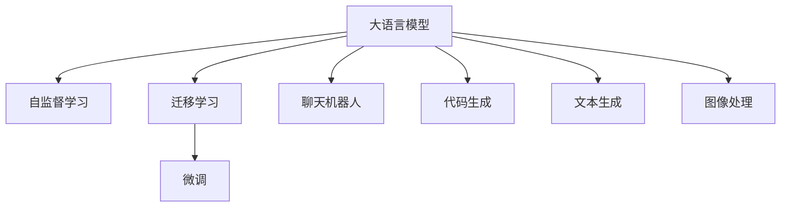

                 

# 强大的OpenAI API

## 1. 背景介绍

在人工智能快速发展的今天，OpenAI的API已经成为了NLP领域的重要基础设施。OpenAI作为一个领先的AI研究机构，其提供的API不仅包括先进的大模型，如GPT、GPT-3、GPT-4等，还涵盖了从文本生成、情感分析、聊天机器人到代码生成、图像处理等多种功能。本文将深入探讨OpenAI API的核心概念、技术原理、应用场景及未来展望，帮助读者全面理解这一强大的工具。

## 2. 核心概念与联系

### 2.1 核心概念概述

OpenAI API的强大之处在于其背后的深度学习技术和大模型能力。以下是几个核心概念：

- **大语言模型(Large Language Models, LLMs)**：通过在海量文本数据上进行预训练，这些模型能够理解并生成自然语言，具备丰富的语言知识。
- **自监督学习(Self-Supervised Learning)**：指使用无标签数据进行训练，模型可以自动学习数据的潜在结构。
- **迁移学习(Transfer Learning)**：通过在不同任务间共享知识，提升模型的泛化能力。
- **微调(Fine-Tuning)**：在大模型的基础上，针对特定任务进行有监督学习，优化模型在该任务上的性能。
- **聊天机器人(Chatbot)**：基于对话系统构建的能够模拟人类对话的程序。
- **代码生成(Code Generation)**：利用模型自动生成代码，辅助编程工作。
- **文本生成(Text Generation)**：生成符合语法和语义规则的文本。
- **图像处理(Image Processing)**：对图像进行分析和生成。

这些核心概念通过OpenAI API有机结合，使得用户可以轻松地调用和集成这些先进的技术，快速实现各种AI应用。

### 2.2 核心概念原理和架构的 Mermaid 流程图(Mermaid 流程节点中不要有括号、逗号等特殊字符)


## 3. 核心算法原理 & 具体操作步骤

### 3.1 算法原理概述

OpenAI API的核心算法原理主要基于Transformer架构和自监督学习。通过预训练Transformer模型，模型能够在理解语言结构和生成文本方面表现出色。自监督学习使得模型能够从大规模无标签数据中学习到语言知识，具备更强的泛化能力。

在微调阶段，OpenAI API允许用户将预训练模型作为初始化参数，通过有监督学习优化模型在特定任务上的性能。这种微调范式简单高效，可以显著提升模型在特定任务上的表现。

### 3.2 算法步骤详解

1. **数据准备**：选择合适的训练集和验证集，并准备测试集。
2. **模型选择与初始化**：选择适当的预训练模型，如GPT-3、GPT-4等，并进行初始化。
3. **添加任务适配层**：根据任务类型，添加相应的输出层和损失函数。
4. **设置微调超参数**：包括学习率、批次大小、优化器等。
5. **模型训练**：在训练集上进行前向传播和反向传播，更新模型参数。
6. **验证与测试**：在验证集上评估模型性能，并根据测试集的结果调整模型。
7. **部署与应用**：将训练好的模型部署到实际应用中，如聊天机器人、代码生成等。

### 3.3 算法优缺点

**优点**：
- **高效性**：微调过程简单高效，只需少量标注数据即可显著提升模型性能。
- **泛化能力强**：通过自监督学习，模型能够从大规模数据中学习到丰富的语言知识，具备较强的泛化能力。
- **灵活性高**：用户可以根据任务需求选择不同的预训练模型和适配层。

**缺点**：
- **依赖标注数据**：微调效果依赖于标注数据的质量和数量，获取高质量标注数据的成本较高。
- **鲁棒性不足**：在特定任务上微调，模型对数据的分布变化可能敏感。
- **计算资源消耗大**：大规模模型的微调过程需要大量计算资源。

### 3.4 算法应用领域

OpenAI API的应用领域非常广泛，涵盖了NLP、机器视觉、智能客服等多个领域：

- **NLP任务**：文本分类、情感分析、命名实体识别、问答系统等。
- **机器视觉**：图像分类、目标检测、图像生成等。
- **智能客服**：基于聊天机器人的智能客服系统。
- **编程辅助**：自动生成代码、代码注释等。
- **文本生成**：自动生成文本、新闻摘要等。

## 4. 数学模型和公式 & 详细讲解 & 举例说明

### 4.1 数学模型构建

假设OpenAI API中的预训练模型为$M_{\theta}$，其中$\theta$为模型参数。给定下游任务$T$的标注数据集$D=\{(x_i,y_i)\}_{i=1}^N$，其中$x_i$为输入文本，$y_i$为任务标签。

微调的目标是找到新的模型参数$\hat{\theta}$，使得模型在任务$T$上的损失最小化：

$$
\hat{\theta} = \mathop{\arg\min}_{\theta} \mathcal{L}(M_{\theta}, D)
$$

其中$\mathcal{L}$为损失函数，通常使用交叉熵损失函数。

### 4.2 公式推导过程

以文本分类任务为例，假设模型输出$\hat{y}=M_{\theta}(x_i) \in [0,1]$，表示样本属于正类的概率。真实标签$y \in \{0,1\}$。则二分类交叉熵损失函数定义为：

$$
\ell(M_{\theta}(x),y) = -[y\log \hat{y} + (1-y)\log (1-\hat{y})]
$$

将损失函数代入经验风险公式，得：

$$
\mathcal{L}(\theta) = -\frac{1}{N}\sum_{i=1}^N [y_i\log M_{\theta}(x_i)+(1-y_i)\log(1-M_{\theta}(x_i))]
$$

根据链式法则，损失函数对参数$\theta_k$的梯度为：

$$
\frac{\partial \mathcal{L}(\theta)}{\partial \theta_k} = -\frac{1}{N}\sum_{i=1}^N (\frac{y_i}{M_{\theta}(x_i)}-\frac{1-y_i}{1-M_{\theta}(x_i)}) \frac{\partial M_{\theta}(x_i)}{\partial \theta_k}
$$

其中$\frac{\partial M_{\theta}(x_i)}{\partial \theta_k}$可进一步递归展开，利用自动微分技术完成计算。

### 4.3 案例分析与讲解

假设我们在训练一个文本分类模型，输入为新闻标题，输出为新闻类别。我们可以将训练集中的每个样本输入模型，计算其输出，并与真实标签进行比较，计算损失并反向传播更新模型参数。具体代码实现如下：

```python
from transformers import TFAutoModelForSequenceClassification, TFBertTokenizer
import tensorflow as tf

tokenizer = TFBertTokenizer.from_pretrained('bert-base-cased')
model = TFAutoModelForSequenceClassification.from_pretrained('bert-base-cased', num_labels=2)

input_ids = tokenizer("CNN scores top, says new poll", return_tensors="tf")
labels = tf.constant([1], dtype=tf.int32)

with tf.GradientTape() as tape:
    outputs = model(input_ids)
    loss = tf.keras.losses.sparse_categorical_crossentropy(labels, outputs.logits)
tape.watch(model.trainable_variables)

loss_value = loss.numpy()
gradients = tape.gradient(loss, model.trainable_variables)
optimizer.apply_gradients(zip(gradients, model.trainable_variables))
```

## 5. 项目实践：代码实例和详细解释说明

### 5.1 开发环境搭建

要在本地搭建环境，需要安装TensorFlow、Transformers等库，并确保安装OpenAI API的Python库：

```bash
pip install tensorflow transformers openai
```

### 5.2 源代码详细实现

以下是一个使用OpenAI API进行文本分类的Python代码实现：

```python
import openai

openai.api_key = 'YOUR_API_KEY'

def classify_text(text):
    response = openai.Completion.create(
        engine="davinci-codex",
        prompt=f"Classify the following text into one of two categories: 1. positive, 2. negative: {text}",
        max_tokens=50
    )
    return response.choices[0].text

# 示例
print(classify_text("This movie is amazing!"))
```

### 5.3 代码解读与分析

- `openai.api_key`：设置OpenAI API的API Key，用于认证和调用API。
- `openai.Completion.create`：调用OpenAI的Completion API，进行文本分类任务。
- `prompt`：设置提示文本，指定待分类的文本。
- `max_tokens`：指定模型生成的文本长度，这里设置为50个token。
- `response.choices[0].text`：获取模型生成的分类结果。

## 6. 实际应用场景

### 6.4 未来应用展望

随着OpenAI API的不断升级，未来的应用前景更加广阔：

- **多模态AI**：结合图像、语音等多模态数据，提升模型理解和生成能力。
- **自适应模型**：根据用户行为和反馈实时调整模型参数，提供个性化的服务。
- **跨领域应用**：在不同领域任务中，通过微调和迁移学习，实现知识共享和模型泛化。
- **伦理与隐私保护**：引入隐私保护机制和伦理导向的评估指标，确保模型使用的合规性和安全性。

## 7. 工具和资源推荐

### 7.1 学习资源推荐

- **OpenAI官方文档**：详细介绍了OpenAI API的使用方法、模型介绍等。
- **Deep Learning with OpenAI**：开源书籍，涵盖OpenAI API的详细使用教程和案例分析。
- **Transformers官方文档**：提供了丰富的预训练模型和微调样例代码，方便学习和实践。

### 7.2 开发工具推荐

- **Jupyter Notebook**：轻量级的交互式编程环境，适合进行模型实验和文档撰写。
- **Google Colab**：基于Google Cloud的在线环境，免费提供GPU资源，方便快速开发和测试。
- **PyTorch Lightning**：基于PyTorch的轻量级框架，提供高效的模型训练和调参工具。

### 7.3 相关论文推荐

- **OpenAI GPT-4**：描述了GPT-4模型的架构和训练方法，展示了其在多模态任务上的表现。
- **Transformers: State-of-the-Art Natural Language Processing**：介绍Transformer架构及其在大语言模型中的应用。
- **Leveraging Pretrained Models for Natural Language Processing**：讨论了预训练和微调技术在NLP任务中的应用和优势。

## 8. 总结：未来发展趋势与挑战

### 8.1 研究成果总结

OpenAI API凭借其先进的技术和大模型能力，已经在NLP领域取得了显著的成果。通过微调和迁移学习，OpenAI API能够快速适应不同任务，提升模型的性能。

### 8.2 未来发展趋势

1. **多模态AI**：结合视觉、语音等多模态数据，提升模型的感知和理解能力。
2. **自适应模型**：通过用户反馈和实时数据，动态调整模型参数，提供更加个性化的服务。
3. **跨领域应用**：在不同领域任务中，通过微调和迁移学习，实现知识共享和模型泛化。
4. **伦理与隐私保护**：引入隐私保护机制和伦理导向的评估指标，确保模型使用的合规性和安全性。

### 8.3 面临的挑战

尽管OpenAI API已经取得了显著的进展，但仍面临诸多挑战：

1. **计算资源消耗大**：大规模模型的微调过程需要大量计算资源。
2. **依赖标注数据**：微调效果依赖于标注数据的质量和数量，获取高质量标注数据的成本较高。
3. **鲁棒性不足**：在特定任务上微调，模型对数据的分布变化可能敏感。
4. **伦理与安全**：模型使用的合规性和安全性问题需要引起重视。

### 8.4 研究展望

未来，OpenAI API的研究方向可以从以下几个方面进行探索：

1. **参数高效微调**：开发更加参数高效的微调方法，在固定大部分预训练参数的同时，只更新极少量的任务相关参数。
2. **跨领域迁移学习**：研究跨领域迁移学习的方法，提升模型在不同领域之间的泛化能力。
3. **多模态融合**：探索将视觉、语音等多模态数据与文本数据融合，提升模型的感知和理解能力。
4. **伦理与安全**：引入隐私保护机制和伦理导向的评估指标，确保模型使用的合规性和安全性。

## 9. 附录：常见问题与解答

**Q1: 如何注册OpenAI API账号？**

A: 访问OpenAI官网，选择API账号注册，填写相关信息，通过邮箱验证后完成注册。

**Q2: 如何优化模型性能？**

A: 通过调整超参数、数据增强、正则化等方法，提升模型在特定任务上的表现。

**Q3: 如何处理多模态数据？**

A: 将不同模态的数据进行特征提取和融合，送入模型进行推理预测。

**Q4: 如何确保模型使用的合规性？**

A: 引入隐私保护机制和伦理导向的评估指标，确保模型使用的合规性和安全性。

---

作者：禅与计算机程序设计艺术 / Zen and the Art of Computer Programming

