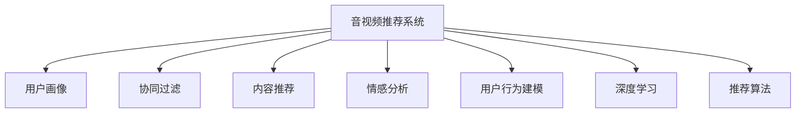

                 

# 影音网站的推荐与分析系统设计与实现

> 关键词：音视频推荐系统、用户画像、协同过滤、内容推荐、情感分析、用户行为建模、深度学习、推荐算法

## 1. 背景介绍

在移动互联网时代，视频和音频内容成为了用户消费的重要组成部分。无论是影视剧、综艺节目、音乐，还是播客、有声书，用户对于高质量影音内容的获取需求日益增长。与此同时，内容生产者也在不断扩大市场份额，争夺用户注意力。作为连接内容创作者和消费者的桥梁，影音网站的推荐与分析系统成为了影响用户体验和网站流量增长的关键。

随着大数据、深度学习和人工智能技术的飞速发展，影音网站的推荐系统从早期的基于规则和特征工程的推荐算法，逐步转变为更加智能、个性化的推荐引擎。推荐系统不仅需要分析用户的行为和偏好，还需要理解内容的特点和流行趋势，为用户提供高质量的影音推荐。

本文将从音视频推荐系统的背景、设计思路、核心算法和实现细节等方面，全面介绍影音网站的推荐与分析系统设计与实现。通过系统性的梳理，希望能为读者提供一个完整的影音推荐系统构建指南，助力影音网站在竞争激烈的市场中脱颖而出。

## 2. 核心概念与联系

### 2.1 核心概念概述

要深入理解影音推荐系统的设计与实现，首先需要明确几个核心概念及其相互关系：

- **音视频推荐系统**：指利用算法为用户推荐个性化影音内容的服务。通过分析用户历史行为、观看记录等数据，推荐系统能够预测用户可能感兴趣的内容。

- **用户画像**：即用户行为和偏好的数字化表示。通过收集用户行为数据（如观看时间、评分、点击等），构建用户画像，描述用户对不同类型的影音内容的喜好程度。

- **协同过滤**：推荐算法中的重要方法，通过分析用户间的相似性，为用户推荐其他用户喜欢的内容。协同过滤可以分为基于用户的协同过滤和基于项目的协同过滤。

- **内容推荐**：利用内容属性（如导演、演员、类型、评分等），结合用户画像，推荐用户可能感兴趣的内容。

- **情感分析**：通过对影音内容的文本、音频和视频进行情感分析，判断内容的情感倾向，帮助推荐系统更好地理解内容特点。

- **用户行为建模**：通过建立用户行为模型，预测用户未来可能采取的动作，如购买、订阅等，从而优化推荐内容。

- **深度学习**：作为当前推荐系统的主流技术，深度学习能够处理高维度数据，学习非线性关系，提升推荐效果。

- **推荐算法**：包括基于内容的推荐、协同过滤推荐、混合推荐、基于规则的推荐等，不同算法适用于不同的场景和数据结构。

这些概念通过Mermaid流程图展现其联系：



这些概念共同构成了影音推荐系统的核心框架，从不同维度协同工作，为用户提供精准、多样化的推荐内容。

## 3. 核心算法原理 & 具体操作步骤

### 3.1 算法原理概述

影音推荐系统主要通过以下几个步骤实现：数据收集与处理、用户画像构建、内容特征提取、推荐算法选择与优化、模型评估与反馈调整。这些步骤共同构建了一个完整的推荐系统流程。

- **数据收集与处理**：从各个平台（如视频网站、音频应用、社交网络等）收集用户行为数据、内容特征数据和外部数据（如用户属性、天气等），并对数据进行清洗、去重、转换等预处理。

- **用户画像构建**：通过统计分析、机器学习等方法，构建用户画像，描述用户对各类内容的偏好。

- **内容特征提取**：从内容中提取关键特征，如导演、演员、评分、时长等，作为推荐算法的输入。

- **推荐算法选择与优化**：根据用户画像和内容特征，选择合适的推荐算法，并对其进行优化调整。

- **模型评估与反馈调整**：通过A/B测试、离线评估等方法，评估推荐系统效果，并根据反馈进行模型调整和优化。

### 3.2 算法步骤详解

以下是影音推荐系统设计与实现的具体步骤：

**Step 1: 数据收集与处理**

数据收集是推荐系统的基础。常见的数据来源包括：

- 用户行为数据：如观看记录、评分、评论、收藏等。
- 内容特征数据：如导演、演员、类型、时长等。
- 外部数据：如用户属性（年龄、性别、职业等）、天气、节假日等。

数据收集后，需要进行清洗和预处理，如去除异常值、填充缺失值、去除重复记录等。同时，将数据转化为模型能够处理的格式，如将时间戳转换为日期格式，将文本数据转化为数值特征等。

**Step 2: 用户画像构建**

用户画像的构建是推荐系统的核心。通过分析用户行为数据，可以构建用户画像，描述用户对不同内容的偏好。常用的方法包括：

- 统计分析：统计用户在不同内容类别下的平均评分、观看时长等。
- 机器学习：利用分类、聚类等算法，将用户分为不同兴趣群体。

**Step 3: 内容特征提取**

内容特征的提取是推荐系统能否准确推荐的关键。内容特征包括：

- 静态特征：如导演、演员、类型、时长等。
- 动态特征：如评论数量、评分变化等。

内容特征的提取方法包括文本分析、图像识别等技术。

**Step 4: 推荐算法选择与优化**

推荐算法的选择与优化是推荐系统的核心。常见的推荐算法包括：

- 基于内容的推荐：根据用户已喜欢的内容，推荐相似的内容。
- 协同过滤推荐：通过分析用户间的相似性，推荐其他用户喜欢的内容。
- 混合推荐：结合多种推荐算法，取长补短，提升推荐效果。

算法的优化可以通过调整超参数、引入正则化技术、采用新的算法模型等方式进行。

**Step 5: 模型评估与反馈调整**

模型评估与反馈调整是推荐系统持续优化的关键。常用的评估方法包括：

- A/B测试：对比新算法和旧算法的推荐效果，选择效果更好的算法。
- 离线评估：在离线数据集上评估推荐效果，分析推荐系统的表现。
- 实时反馈：根据用户反馈调整推荐算法，提升用户体验。

### 3.3 算法优缺点

影音推荐系统具有以下优点：

- **个性化推荐**：通过分析用户行为数据和内容特征，为用户提供个性化的影音推荐，提升用户体验。
- **数据驱动**：基于数据驱动的推荐系统能够适应不断变化的用户需求和内容特性，保持推荐效果。
- **高效性**：推荐系统能够实时处理用户请求，提供快速的推荐服务。

但同时，影音推荐系统也存在以下缺点：

- **冷启动问题**：新用户或新内容往往缺乏足够的行为数据，难以进行有效的推荐。
- **数据偏差**：推荐系统依赖于数据，如果数据存在偏差，可能会影响推荐结果的公正性和准确性。
- **计算复杂度**：推荐算法可能涉及复杂的计算和数据处理，对硬件和算法要求较高。

### 3.4 算法应用领域

影音推荐系统在以下几个领域有着广泛的应用：

- **视频网站**：如Netflix、腾讯视频等，为用户推荐感兴趣的视频内容。
- **音频应用**：如Spotify、网易云音乐等，为用户推荐喜欢的音乐和播客。
- **社交媒体**：如微博、抖音等，推荐用户感兴趣的视频和音频内容。
- **智能音箱**：如Amazon Echo、Google Home等，推荐符合用户偏好的音频内容。

## 4. 数学模型和公式 & 详细讲解 & 举例说明

### 4.1 数学模型构建

影音推荐系统的数学模型主要包括以下几个部分：

- **用户行为数据模型**：描述用户对影音内容的评分和观看行为。
- **内容特征模型**：描述影音内容的特征，如导演、演员、评分等。
- **用户画像模型**：描述用户对不同类型的影音内容的偏好。
- **推荐模型**：基于用户画像和内容特征，预测用户可能感兴趣的内容。

以用户行为数据模型为例，设用户对内容 $i$ 的评分 $r_{ui}$，用户 $u$ 观看内容 $i$ 的时间 $t_{ui}$，构建用户行为数据模型：

$$
r_{ui} = \alpha u_i + \beta t_{ui} + \epsilon_{ui}
$$

其中，$u_i$ 为内容 $i$ 的评分，$t_{ui}$ 为用户 $u$ 观看内容 $i$ 的时间，$\alpha$ 和 $\beta$ 为模型参数，$\epsilon_{ui}$ 为误差项。

### 4.2 公式推导过程

以协同过滤推荐算法为例，通过用户间的相似性，为用户推荐其他用户喜欢的内容。设用户 $u$ 喜欢的内容为 $S_u$，用户 $v$ 喜欢的内容为 $S_v$，构建用户之间的相似度矩阵 $A$：

$$
A_{uv} = \frac{\lVert S_u \cap S_v \rVert}{\sqrt{\lVert S_u \rVert \cdot \lVert S_v \rVert}} = \frac{|\text{同喜欢的内容}|}{\sqrt{|\text{喜欢的内容}| \cdot |\text{喜欢的内容}|}}
$$

通过相似度矩阵 $A$，构建协同过滤模型：

$$
\hat{r}_{ui} = \sum_{v \in V} A_{uv} r_{vi}
$$

其中，$r_{vi}$ 为用户 $v$ 对内容 $i$ 的评分，$\hat{r}_{ui}$ 为用户 $u$ 对内容 $i$ 的预测评分。

### 4.3 案例分析与讲解

假设有一个视频网站，用户对其内容有评分记录。通过协同过滤推荐算法，为用户推荐可能喜欢的内容。具体步骤如下：

1. 收集用户对内容的评分数据。
2. 计算用户之间的相似度矩阵 $A$。
3. 根据相似度矩阵，预测用户对未评分内容的评分。
4. 根据评分预测结果，推荐用户可能喜欢的内容。

以用户 $u$ 为例，设其已评分的数量为 $N_u$，未评分的内容数量为 $N_{un}$，计算用户 $u$ 与所有其他用户 $v$ 的相似度 $A_{uv}$。对于未评分的内容 $i$，预测其评分 $\hat{r}_{ui}$，并通过阈值判断是否推荐。

## 5. 项目实践：代码实例和详细解释说明

### 5.1 开发环境搭建

进行影音推荐系统开发，需要搭建一个包含数据存储、模型训练、推荐服务等多个模块的完整环境。以下是常见的开发环境搭建步骤：

1. **数据存储**：选择适合的数据库，如MySQL、Elasticsearch等，用于存储用户行为数据和内容特征数据。
2. **模型训练**：选择适合的深度学习框架，如TensorFlow、PyTorch等，用于训练推荐模型。
3. **推荐服务**：选择适合的服务器框架，如Flask、FastAPI等，构建推荐服务接口。
4. **部署环境**：选择适合的云平台，如AWS、Google Cloud等，部署推荐服务。

### 5.2 源代码详细实现

以下是一个基于协同过滤推荐算法的影音推荐系统的PyTorch代码实现：

```python
import torch
import torch.nn as nn
import torch.nn.functional as F
import torch.optim as optim
from torch.utils.data import DataLoader
from torchvision.transforms import ToTensor

class UserItemRecommender(nn.Module):
    def __init__(self, num_users, num_items, num_factors):
        super(UserItemRecommender, self).__init__()
        self.user_factors = nn.Embedding(num_users, num_factors)
        self.item_factors = nn.Embedding(num_items, num_factors)
        self.rating_matrix = nn.Parameter(torch.zeros(num_users, num_items))
        self.bias = nn.Parameter(torch.zeros(num_users, num_items))
        self.bmm_bias = nn.Bilinear(num_factors, 1, 1)
    
    def forward(self, user_id, item_id):
        user_factors = self.user_factors(user_id)
        item_factors = self.item_factors(item_id)
        rating_matrix = self.rating_matrix[user_id, item_id]
        bias = self.bias[user_id, item_id]
        rating_matrix = rating_matrix + bias
        rating_matrix = self.bmm_bias(user_factors, item_factors)
        return rating_matrix
    
class MovieRecommender(nn.Module):
    def __init__(self, num_users, num_items, num_factors):
        super(MovieRecommender, self).__init__()
        self.user_factors = nn.Embedding(num_users, num_factors)
        self.item_factors = nn.Embedding(num_items, num_factors)
        self.rating_matrix = nn.Parameter(torch.zeros(num_users, num_items))
        self.bias = nn.Parameter(torch.zeros(num_users, num_items))
        self.bmm_bias = nn.Bilinear(num_factors, 1, 1)
    
    def forward(self, user_id, item_id):
        user_factors = self.user_factors(user_id)
        item_factors = self.item_factors(item_id)
        rating_matrix = self.rating_matrix[user_id, item_id]
        bias = self.bias[user_id, item_id]
        rating_matrix = rating_matrix + bias
        rating_matrix = self.bmm_bias(user_factors, item_factors)
        return rating_matrix
    
class RecommendationSystem(nn.Module):
    def __init__(self, num_users, num_items, num_factors):
        super(RecommendationSystem, self).__init__()
        self.user_item = UserItemRecommender(num_users, num_items, num_factors)
        self.movie = MovieRecommender(num_users, num_items, num_factors)
    
    def forward(self, user_id, item_id):
        user_item_matrix = self.user_item(user_id, item_id)
        movie_matrix = self.movie(user_id, item_id)
        return user_item_matrix, movie_matrix

# 数据加载器
def load_data(path):
    data = []
    with open(path, 'r') as f:
        for line in f:
            user_id, item_id, rating = line.split(',')
            data.append((user_id, item_id, float(rating)))
    return data

# 模型训练
def train(model, data, num_epochs, batch_size, learning_rate):
    model.train()
    optimizer = optim.Adam(model.parameters(), lr=learning_rate)
    criterion = nn.MSELoss()
    for epoch in range(num_epochs):
        for user_id, item_id, rating in data:
            user_item_matrix, movie_matrix = model(user_id, item_id)
            rating_matrix = torch.tensor([rating])
            loss = criterion(user_item_matrix, movie_matrix)
            optimizer.zero_grad()
            loss.backward()
            optimizer.step()
        print(f"Epoch {epoch+1}, loss: {loss:.4f}")

# 模型评估
def evaluate(model, data):
    model.eval()
    total_loss = 0
    for user_id, item_id, rating in data:
        user_item_matrix, movie_matrix = model(user_id, item_id)
        rating_matrix = torch.tensor([rating])
        loss = criterion(user_item_matrix, movie_matrix)
        total_loss += loss.item()
    return total_loss / len(data)
```

### 5.3 代码解读与分析

以上代码实现了一个基于协同过滤推荐算法的影音推荐系统。具体分析如下：

- **UserItemRecommender** 和 **MovieRecommender** 分别实现了协同过滤推荐和基于电影特征的推荐算法。
- **RecommendationSystem** 将两个推荐模块组合起来，实现完整推荐流程。
- **load_data** 函数用于加载数据，将用户行为数据转换为模型可用的格式。
- **train** 和 **evaluate** 函数分别用于训练和评估模型，采用均方误差作为损失函数。

## 6. 实际应用场景

### 6.1 智能视频推荐

智能视频推荐是影音推荐系统的重要应用场景之一。通过分析用户历史观看记录，推荐系统能够为用户推荐感兴趣的视频内容。例如，Netflix根据用户观看的历史数据，为其推荐同类或相似题材的视频，提高用户粘性和满意度。

### 6.2 音频内容推荐

音频内容推荐在Spotify等音乐平台上得到了广泛应用。通过分析用户的听歌行为和评分，推荐系统能够为用户推荐相似的歌曲或播放列表，提升用户体验。例如，Spotify的“发现相似艺术家”功能，通过推荐相似艺术家，帮助用户发现新的音乐。

### 6.3 社交媒体内容推荐

社交媒体平台如抖音、微博等，通过推荐用户感兴趣的视频和音频内容，提升用户活跃度和参与度。例如，抖音的推荐算法能够根据用户的浏览记录和评分，为用户推荐相似的视频内容。

### 6.4 未来应用展望

随着深度学习和人工智能技术的不断发展，影音推荐系统将具备更强大的智能推荐能力。未来可能的创新方向包括：

- **多模态推荐**：结合文本、音频和视频等多种模态信息，提升推荐准确性和用户体验。
- **个性化推荐算法**：引入更多的个性化推荐算法，如基于图神经网络的推荐、基于对抗学习的推荐等，提升推荐效果。
- **实时推荐系统**：利用流式计算技术，实时处理用户行为数据，提供更即时、精准的推荐服务。
- **联邦学习**：通过联邦学习技术，保护用户隐私的同时，提升推荐模型的通用性和泛化能力。

## 7. 工具和资源推荐

### 7.1 学习资源推荐

影音推荐系统的设计与实现涉及多个领域的知识，推荐以下学习资源，帮助读者系统掌握推荐系统的前沿技术：

- 《推荐系统实战》：介绍推荐系统的核心算法和实现方法，适合工程实践。
- 《深度学习与推荐系统》：结合深度学习技术，讲解推荐系统的设计和优化。
- 《Recommender Systems: Textbook》：全面介绍推荐系统的理论基础和应用实例，适合学术研究。
- Coursera《推荐系统》课程：由斯坦福大学开设，涵盖推荐系统的各个方面，适合系统学习。
- Kaggle推荐系统竞赛：通过实践竞赛，提升推荐系统的工程能力和创新能力。

### 7.2 开发工具推荐

影音推荐系统的开发需要多种工具的配合，以下是推荐工具列表：

- **深度学习框架**：TensorFlow、PyTorch等，用于构建推荐模型。
- **数据处理工具**：Pandas、NumPy等，用于数据清洗和预处理。
- **机器学习库**：Scikit-learn、Tensorflow-estimator等，用于模型训练和评估。
- **服务器框架**：Flask、FastAPI等，用于构建推荐服务接口。
- **数据可视化工具**：Matplotlib、Seaborn等，用于数据探索和分析。

### 7.3 相关论文推荐

影音推荐系统的理论研究不断涌现，以下是几篇具有代表性的论文，推荐阅读：

- **Netflix Prize竞赛论文**：介绍Netflix推荐系统设计，分析推荐算法和数据预处理。
- **ItemKNN: Exploring Item-Based Collaborative Filtering**：介绍基于内容的协同过滤推荐算法，分析其优缺点。
- **Collaborative Filtering for Implicit Feedback Datasets**：介绍协同过滤推荐算法的改进方法，提升推荐效果。
- **Neural Collaborative Filtering**：介绍基于深度学习的推荐系统设计，分析模型结构和学习目标。
- **Recommender Systems for Massive-Scale Music Recommendation**：介绍音频推荐系统的设计方法，分析推荐效果。

## 8. 总结：未来发展趋势与挑战

### 8.1 研究成果总结

影音推荐系统的发展得益于深度学习和数据科学技术的推动，取得了显著的进展。推荐系统通过分析用户行为数据，为用户推荐个性化内容，提升了用户体验和网站流量。推荐算法的选择和优化，是推荐系统设计的关键。

### 8.2 未来发展趋势

影音推荐系统的未来发展趋势包括：

- **多模态推荐**：结合文本、音频和视频等多种模态信息，提升推荐准确性和用户体验。
- **个性化推荐算法**：引入更多的个性化推荐算法，如基于图神经网络的推荐、基于对抗学习的推荐等，提升推荐效果。
- **实时推荐系统**：利用流式计算技术，实时处理用户行为数据，提供更即时、精准的推荐服务。
- **联邦学习**：通过联邦学习技术，保护用户隐私的同时，提升推荐模型的通用性和泛化能力。

### 8.3 面临的挑战

影音推荐系统在发展过程中，仍面临诸多挑战：

- **数据隐私问题**：推荐系统需要大量用户行为数据，如何保护用户隐私成为关键问题。
- **冷启动问题**：新用户或新内容往往缺乏足够的行为数据，难以进行有效的推荐。
- **计算复杂度**：推荐算法可能涉及复杂的计算和数据处理，对硬件和算法要求较高。
- **推荐公平性**：推荐系统需要保证推荐结果的公平性和公正性，避免对特定群体或内容的偏见。

### 8.4 研究展望

未来的影音推荐系统需要更加注重用户隐私保护、推荐公平性和计算效率，同时引入更多的智能化技术。如何构建多模态推荐系统、提升个性化推荐算法、实现实时推荐服务等，将是未来的重要研究方向。

## 9. 附录：常见问题与解答

### 9.1 Q1: 影音推荐系统为什么需要协同过滤推荐算法？

A: 协同过滤推荐算法是一种基于用户相似性的推荐方法，通过分析用户之间的相似性，为用户推荐其他用户喜欢的内容。协同过滤推荐算法具有以下优点：

1. 能够处理稀疏数据：协同过滤推荐算法能够处理用户评分稀疏的问题，即用户对某些内容未进行评分，但可以通过分析其他用户的行为进行推荐。

2. 能够发现隐式反馈：协同过滤推荐算法能够从用户行为数据中发现隐式反馈，如观看记录、点击记录等，从而提升推荐效果。

3. 能够缓解数据偏差：协同过滤推荐算法能够缓解数据偏差问题，即不同用户在评分尺度上的差异，从而提升推荐结果的公正性和准确性。

因此，协同过滤推荐算法是影音推荐系统中的重要推荐算法之一。

### 9.2 Q2: 影音推荐系统如何处理冷启动问题？

A: 影音推荐系统中的冷启动问题，即新用户或新内容缺乏足够的行为数据，难以进行有效的推荐。为了解决这个问题，可以采用以下几种方法：

1. 数据填充：收集外部数据，如用户属性、天气等，用于填补行为数据的不足。

2. 模型初始化：利用预训练模型或迁移学习，对新用户或新内容进行初始化，从而提升推荐效果。

3. 用户行为模拟：通过用户画像和内容特征，预测新用户或新内容的行为，从而提升推荐效果。

4. 推荐算法融合：结合多种推荐算法，提升推荐系统对冷启动问题的处理能力。

### 9.3 Q3: 影音推荐系统如何处理推荐结果的偏差问题？

A: 影音推荐系统中的推荐结果偏差问题，即推荐结果对某些群体或内容的偏见，可能导致推荐不公平或误导性。为了解决这个问题，可以采用以下几种方法：

1. 数据清洗：清洗推荐系统中的异常数据和噪声数据，提升推荐结果的公正性。

2. 正则化技术：引入正则化技术，如L2正则、Dropout等，防止模型过拟合，提升推荐结果的泛化能力。

3. 公平性约束：在推荐模型中加入公平性约束，如反偏见技术，提升推荐结果的公正性。

4. 多维数据分析：利用多维数据分析技术，如文本情感分析、图像特征提取等，提升推荐结果的全面性和公正性。

通过以上方法，可以缓解影音推荐系统中的推荐结果偏差问题，提升推荐系统的公正性和公平性。

---

作者：禅与计算机程序设计艺术 / Zen and the Art of Computer Programming

