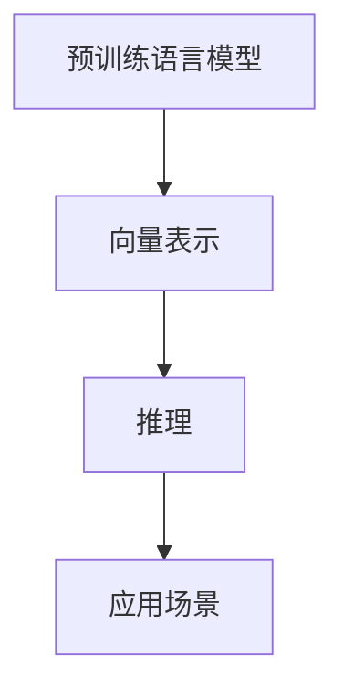

                 

# 快速上手 OpenAI Embeddings

> 关键词：OpenAI Embeddings, 自然语言处理, 预训练模型, 向量表示, 推理, 应用场景

## 1. 背景介绍

在当今的计算机科学领域，语言模型，特别是预训练语言模型（Pre-trained Language Models，PLMs），已经成为自然语言处理（Natural Language Processing，NLP）领域的重要基石。预训练语言模型通过在大规模无标签文本数据上自监督预训练，学习到了语言表征的深层结构，能够捕获丰富的语义和语法信息。OpenAI作为行业领头羊，发布的Embeddings模型在这方面取得了显著成就，广泛应用于NLP的多个任务中。

本文将详细介绍OpenAI Embeddings的核心概念和应用场景，并通过实际代码演示，帮助你快速上手使用这些先进的模型进行NLP任务。我们将涵盖从模型加载到应用部署的全流程，以及其中的关键技术细节。

## 2. 核心概念与联系

### 2.1 核心概念概述

为了更好地理解OpenAI Embeddings，我们首先梳理几个核心概念：

- **预训练语言模型**：如GPT-3、BERT、T5等，通过大规模无标签文本数据进行预训练，学习语言表征。
- **向量表示**：将文本转换为向量，方便计算机理解和处理。
- **推理**：基于学习到的向量表示，进行文本分类、生成、翻译等NLP任务。
- **应用场景**：涵盖问答、翻译、摘要生成、对话系统等多个NLP任务领域。

这些概念间的关系如图示：



## 3. 核心算法原理 & 具体操作步骤

### 3.1 算法原理概述

OpenAI Embeddings作为预训练语言模型的一种，通过在大规模文本数据上预训练得到，学习到丰富的语言表征。其核心原理为：

1. **自监督预训练**：在无标签文本数据上，通过设计各种自监督任务（如掩码语言模型Masked Language Modeling, MLM），让模型学习到语言的基本规律和结构。
2. **微调**：在特定任务上，使用少量标注数据对预训练模型进行微调，使其适应特定任务的需求。
3. **推理**：将输入文本转换为向量表示，利用推理算法得到输出。

### 3.2 算法步骤详解

下面详细介绍OpenAI Embeddings的微调步骤：

**Step 1: 准备预训练模型和数据集**

- 选择OpenAI提供的Embeddings模型，如GPT-3、BERT、T5等。
- 准备标注数据集，如IMDB影评情感分类、Yelp商家评价分类、SST-2情感分类等。

**Step 2: 设计任务适配层**

- 根据任务类型，设计合适的输出层和损失函数。
- 对于分类任务，添加线性分类器，交叉熵损失函数。
- 对于生成任务，使用解码器，负对数似然损失函数。

**Step 3: 设置微调超参数**

- 选择合适的优化器及其参数，如Adam、SGD等。
- 设置学习率、批大小、迭代轮数等。

**Step 4: 执行梯度训练**

- 将训练集数据分批次输入模型，计算损失函数。
- 反向传播计算梯度，更新模型参数。
- 周期性在验证集上评估模型性能。

**Step 5: 测试和部署**

- 在测试集上评估微调后模型性能。
- 集成到实际应用系统中。

### 3.3 算法优缺点

**优点**：

- **高效**：微调步骤简单，只需少量标注数据即可快速提升模型效果。
- **灵活**：适用于多种NLP任务，如文本分类、情感分析、翻译等。

**缺点**：

- **依赖标注数据**：微调效果取决于标注数据的质量和数量。
- **模型复杂度**：预训练模型参数量巨大，推理资源需求高。

### 3.4 算法应用领域

OpenAI Embeddings广泛应用于：

- **文本分类**：如电影评论情感分类、新闻情感分类等。
- **情感分析**：对用户评论或社交媒体内容进行情感分析。
- **机器翻译**：将文本从一种语言翻译成另一种语言。
- **问答系统**：如回答用户问题，提供相关文档或文章。

## 4. 数学模型和公式 & 详细讲解  
### 4.1 数学模型构建

假设OpenAI Embeddings为模型 $M_{\theta}$，其中 $\theta$ 为模型参数。给定下游任务 $T$ 的标注数据集 $D=\{(x_i, y_i)\}_{i=1}^N, x_i \in \mathcal{X}, y_i \in \mathcal{Y}$，其中 $\mathcal{X}$ 为输入空间，$\mathcal{Y}$ 为输出空间。

定义模型 $M_{\theta}$ 在输入 $x$ 上的损失函数为 $\ell(M_{\theta}(x),y)$，则在数据集 $D$ 上的经验风险为：

$$
\mathcal{L}(\theta) = \frac{1}{N} \sum_{i=1}^N \ell(M_{\theta}(x_i),y_i)
$$

通过梯度下降等优化算法，最小化损失函数 $\mathcal{L}(\theta)$，更新模型参数 $\theta$。

### 4.2 公式推导过程

以分类任务为例，假设模型输出为 $\hat{y}=M_{\theta}(x) \in [0,1]$，表示样本属于正类的概率。真实标签 $y \in \{0,1\}$。

二分类交叉熵损失函数定义为：

$$
\ell(M_{\theta}(x),y) = -[y\log \hat{y} + (1-y)\log (1-\hat{y})]
$$

将其代入经验风险公式，得：

$$
\mathcal{L}(\theta) = -\frac{1}{N}\sum_{i=1}^N [y_i\log M_{\theta}(x_i)+(1-y_i)\log(1-M_{\theta}(x_i))]
$$

根据链式法则，损失函数对参数 $\theta_k$ 的梯度为：

$$
\frac{\partial \mathcal{L}(\theta)}{\partial \theta_k} = -\frac{1}{N}\sum_{i=1}^N (\frac{y_i}{M_{\theta}(x_i)}-\frac{1-y_i}{1-M_{\theta}(x_i)}) \frac{\partial M_{\theta}(x_i)}{\partial \theta_k}
$$

其中 $\frac{\partial M_{\theta}(x_i)}{\partial \theta_k}$ 可进一步递归展开，利用自动微分技术完成计算。

在得到损失函数的梯度后，即可带入参数更新公式，完成模型的迭代优化。

## 5. 项目实践：代码实例和详细解释说明

### 5.1 开发环境搭建

为了快速上手OpenAI Embeddings，需要安装Python和相关库：

1. 安装Anaconda：从官网下载并安装Anaconda，用于创建独立的Python环境。

2. 创建并激活虚拟环境：
```bash
conda create -n pytorch-env python=3.8 
conda activate pytorch-env
```

3. 安装PyTorch：根据CUDA版本，从官网获取对应的安装命令。例如：
```bash
conda install pytorch torchvision torchaudio cudatoolkit=11.1 -c pytorch -c conda-forge
```

4. 安装OpenAI的库：
```bash
pip install openai transformers
```

完成上述步骤后，即可在`pytorch-env`环境中开始实践。

### 5.2 源代码详细实现

以下是一个使用OpenAI GPT-3模型进行情感分类的Python代码示例：

```python
from transformers import GPT3Tokenizer, GPT3ForSequenceClassification
from openai.api import openai

# 使用OpenAI的GPT-3模型
api_key = 'your_openai_api_key'
model = 'gpt3.5-turbo'

# 准备数据集
train_data = [
    {"text": "This is a positive review.", "label": 1},
    {"text": "This is a negative review.", "label": 0},
    # 更多数据...
]

# 定义模型和优化器
tokenizer = GPT3Tokenizer.from_pretrained(model)
model = GPT3ForSequenceClassification.from_pretrained(model, num_labels=2)
optimizer = AdamW(model.parameters(), lr=2e-5)

# 训练模型
for epoch in range(10):
    for batch in train_data:
        inputs = tokenizer(batch['text'], return_tensors='pt', padding='max_length', truncation=True)
        labels = batch['label']
        outputs = model(**inputs)
        loss = outputs.loss
        loss.backward()
        optimizer.step()
        optimizer.zero_grad()

# 评估模型
test_data = [
    {"text": "I really enjoyed this product."},
    {"text": "I regret buying this."},
    # 更多测试数据...
]
test_inputs = tokenizer(test_data, return_tensors='pt', padding='max_length', truncation=True)
test_outputs = model(**test_inputs)
test_loss = test_outputs.loss.item()
test_labels = test_outputs.logits.argmax(dim=1)
print(f"Test loss: {test_loss:.4f}")
```

### 5.3 代码解读与分析

**模型选择**：
- 根据任务需求，选择适合的开源模型，如GPT-3、BERT、T5等。
- 通过API访问OpenAI的模型，需要提供API key。

**数据准备**：
- 准备训练和测试数据，使用GPT3Tokenizer进行文本处理，转换为模型输入。

**模型训练**：
- 定义优化器和损失函数，使用梯度下降更新模型参数。
- 在训练集上迭代训练，输出损失值。

**模型评估**：
- 在测试集上计算损失，输出预测结果。
- 使用自动微分工具，自动计算梯度和损失。

## 6. 实际应用场景

### 6.1 情感分析

情感分析是OpenAI Embeddings的典型应用场景之一，通过微调模型，可以对用户评论、社交媒体内容进行情感分析，帮助企业了解用户反馈，改进产品和服务。

### 6.2 机器翻译

机器翻译是OpenAI Embeddings的另一个重要应用领域，通过微调模型，可以高效地将一种语言翻译成另一种语言，支持多语言交互。

### 6.3 文本分类

文本分类任务如新闻情感分类、影评情感分类等，也是OpenAI Embeddings的重要应用之一。通过微调模型，可以自动识别文本的情感倾向，进行分类预测。

### 6.4 未来应用展望

未来，OpenAI Embeddings将在更多领域得到广泛应用，如智能客服、金融舆情、个性化推荐等。这些技术的发展将进一步提升NLP系统的智能化水平，为各行各业带来新的突破和变革。

## 7. 工具和资源推荐

### 7.1 学习资源推荐

为了帮助你快速上手OpenAI Embeddings，这里推荐一些优质的学习资源：

1. OpenAI官方文档：提供详细的API文档和使用指南，帮助你高效使用预训练模型。
2. HuggingFace官方文档：提供多种开源模型的实现，并详细介绍微调过程。
3. Coursera《Natural Language Processing with Transformers》课程：由世界顶尖大学开设，介绍NLP和Transformer模型的基础知识。
4. NLP相关的书籍，如《Deep Learning for Natural Language Processing》、《Natural Language Processing with Python》等。

### 7.2 开发工具推荐

为了提高开发效率，这里推荐一些常用的开发工具：

1. PyTorch：开源深度学习框架，支持动态图计算，适合研究型应用。
2. TensorFlow：由Google开发的深度学习框架，支持静态图计算，适合大规模工程应用。
3. Weights & Biases：模型训练的实验跟踪工具，记录模型训练过程中的各项指标。
4. TensorBoard：TensorFlow配套的可视化工具，用于监控和调试模型训练过程。
5. Colab：Google提供的Jupyter Notebook环境，免费提供GPU资源，方便开发者快速实验。

### 7.3 相关论文推荐

OpenAI Embeddings的研究源于学界的持续探索，以下是几篇代表性的论文，推荐阅读：

1. "Attention is All You Need"（Transformer论文）：提出Transformer结构，开启预训练语言模型的时代。
2. "BERT: Pre-training of Deep Bidirectional Transformers for Language Understanding"：提出BERT模型，通过自监督预训练学习语言表征。
3. "GPT-3: Language Models are Unsupervised Multitask Learners"：展示GPT-3模型的强大zero-shot学习能力。
4. "Parameter-Efficient Transfer Learning for NLP"：提出参数高效微调方法，在微调时只更新少量参数。
5. "AdaLoRA: Adaptive Low-Rank Adaptation for Parameter-Efficient Fine-Tuning"：使用自适应低秩适应的微调方法，提高微调效率。

这些论文代表了OpenAI Embeddings的发展脉络，通过学习这些前沿成果，可以帮助你深入理解模型的原理和应用，激发更多创新灵感。

## 8. 总结：未来发展趋势与挑战

### 8.1 总结

本文详细介绍了OpenAI Embeddings的核心概念和应用场景，通过实际代码演示，帮助你快速上手使用这些先进的模型进行NLP任务。我们梳理了从模型加载到应用部署的全流程，并详细讲解了其中的关键技术细节。

通过本文的系统梳理，可以看到，OpenAI Embeddings作为一种强大的预训练语言模型，已经在多个NLP任务中取得了显著效果。未来的研究需要进一步探索参数高效微调、对抗训练、模型压缩等技术，提升模型性能和推理效率，同时解决模型鲁棒性、可解释性、安全性等挑战，以实现更广泛的应用。

### 8.2 未来发展趋势

展望未来，OpenAI Embeddings将在以下几个方向进一步发展：

1. **模型规模持续增大**：预训练模型参数量将继续增长，学习到更加复杂的语言表征，提升模型性能。
2. **微调方法日趋多样**：开发更多参数高效和计算高效的微调方法，优化模型推理速度和资源占用。
3. **持续学习成为常态**：微调模型能够持续学习新知识，保持性能，适应数据分布的变化。
4. **标注样本需求降低**：通过提示学习等方法，利用大模型的语言理解能力，减少微调对标注样本的依赖。
5. **多模态微调崛起**：将视觉、语音等多模态信息与文本信息结合，提升模型的综合理解和表达能力。

### 8.3 面临的挑战

尽管OpenAI Embeddings取得了显著成就，但在迈向更广泛应用的过程中，仍面临以下挑战：

1. **标注成本瓶颈**：微调模型仍然依赖标注数据，标注成本高昂。
2. **模型鲁棒性不足**：微调模型面对域外数据时，泛化性能有限。
3. **推理效率有待提高**：大规模语言模型推理速度慢，内存占用大，需要优化模型结构和推理算法。
4. **可解释性亟需加强**：微调模型通常缺乏可解释性，难以解释决策过程。
5. **安全性有待保障**：预训练模型可能学习到有害信息，输出有偏见或误导性。

### 8.4 未来突破

为了克服这些挑战，未来的研究需要在以下几个方向寻求新的突破：

1. **探索无监督和半监督微调方法**：摆脱对标注数据的依赖，利用自监督学习、主动学习等方法，提高微调效率。
2. **研究参数高效和计算高效的微调范式**：开发更多参数高效和计算高效的微调方法，优化模型性能和推理效率。
3. **融合因果和对比学习范式**：增强微调模型学习普适、鲁棒的语言表征，提升模型的泛化性和抗干扰能力。
4. **引入更多先验知识**：将符号化的先验知识与神经网络模型结合，提升模型的综合理解和表达能力。
5. **结合因果分析和博弈论工具**：增强微调模型的决策解释能力，提高系统稳定性。
6. **纳入伦理道德约束**：在模型训练目标中引入伦理导向的评估指标，过滤和惩罚有害输出，确保模型安全性。

这些研究方向的探索，将进一步提升OpenAI Embeddings的应用价值，推动人工智能技术的发展。只有勇于创新、敢于突破，才能将强大的预训练语言模型应用到更多实际场景中，带来新的变革。

## 9. 附录：常见问题与解答

**Q1: OpenAI Embeddings是否可以用于所有NLP任务？**

A: 可以，但效果取决于任务的复杂度和数据量。对于文本分类、情感分析等任务，OpenAI Embeddings通常表现优异。但对于涉及更多逻辑推理、知识整合的任务，可能需要进一步优化。

**Q2: 微调过程中如何选择合适的学习率？**

A: 一般建议从1e-5开始调参，逐步减小学习率，直至收敛。也可以使用warmup策略，在开始阶段使用较小的学习率，再逐渐过渡到预设值。

**Q3: 使用OpenAI Embeddings进行微调时需要注意哪些问题？**

A: 需要注意模型资源占用大，需要高效的推理优化技术。同时，数据预处理和后处理也需注意，以保证模型性能和推理速度。

通过本文的系统介绍，相信你已能够快速上手使用OpenAI Embeddings进行NLP任务的微调。希望你能够在自己的研究项目中充分发挥这些模型的强大能力，推动人工智能技术的发展。

---

作者：禅与计算机程序设计艺术 / Zen and the Art of Computer Programming

