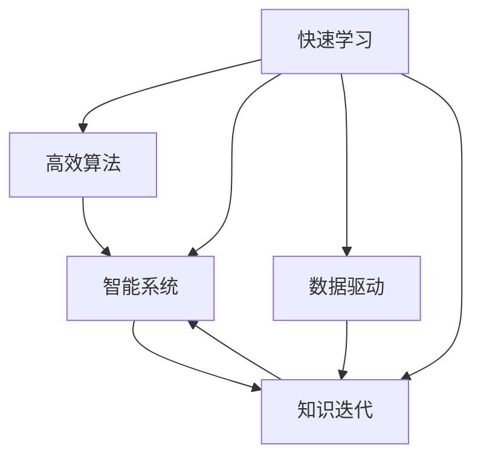

                 

# 快速学习:立于不败之地的根本

> 关键词：快速学习,高效算法,智能系统,数据驱动,学习曲线,知识迭代,机器学习,深度学习,人工智能

## 1. 背景介绍

### 1.1 问题由来
在当今这个信息爆炸的时代，我们每天都在被大量的信息所包围。如何在海量信息中快速学习和掌握知识，成为了每一个人的迫切需求。特别是在快速迭代的技术领域，如人工智能和机器学习，如何通过高效的算法和系统实现快速学习，是每个从业者都在积极探索的问题。

### 1.2 问题核心关键点
快速学习不仅仅是为了解决具体的学习问题，更是一种适应变化、提升效率和效果的思维方式。在技术发展日新月异的今天，掌握快速学习的能力，可以帮助我们保持竞争优势，应对复杂多变的环境。

### 1.3 问题研究意义
掌握快速学习的方法论，能够显著提高个人和组织的学习效率，缩短技术迭代周期，提升决策质量。特别是在AI和机器学习领域，快速学习的能力更是引领着技术进步和应用创新的关键。

## 2. 核心概念与联系

### 2.1 核心概念概述

为了更好地理解快速学习，本节将介绍几个核心概念及其相互关系：

- **快速学习**：指通过高效算法和系统，在尽可能短的时间内，学习到尽可能多的知识和技能。快速学习旨在提升学习效率和效果，减少试错成本和时间。
- **高效算法**：指通过精巧的设计和优化，能够在有限的时间和资源条件下，完成高质量的任务。高效算法是实现快速学习的核心工具。
- **智能系统**：通过数据驱动和算法优化，具备自主学习、推理和决策能力的系统。智能系统是快速学习的重要平台。
- **数据驱动**：指通过大量真实数据的积累和分析，驱动系统学习、优化和提升。数据驱动是快速学习的关键要素。
- **知识迭代**：指系统通过不断获取新知识和经验，实现持续的优化和升级。知识迭代是快速学习的核心机制。

这些核心概念之间的关系可以通过以下Mermaid流程图来展示：



这个流程图展示了一个快速学习系统的核心组成和运行机制：

1. 快速学习通过高效算法和智能系统实现。
2. 智能系统依赖数据驱动进行学习优化。
3. 知识迭代贯穿整个学习过程，提升系统的学习效果。

## 3. 核心算法原理 & 具体操作步骤
### 3.1 算法原理概述

快速学习的核心在于通过高效算法，在有限的时间和资源条件下，实现知识的快速获取和应用。其基本原理可以概括为：

- **数据预处理**：对原始数据进行清洗、特征提取和归一化，提高数据质量和处理效率。
- **模型选择与训练**：选择合适的模型架构和优化方法，利用有限的数据进行高效训练，提升模型的泛化能力。
- **参数调优**：通过超参数调优，平衡模型的复杂度和性能，提升模型的稳定性和可解释性。
- **知识迁移**：利用已有的知识经验，加速新任务的学习过程，提升学习效率和效果。
- **系统集成**：将多个组件和模块集成在一起，形成完整的快速学习系统，提升整体性能。

### 3.2 算法步骤详解

快速学习的具体操作步骤可以分为以下几个步骤：

**Step 1: 数据预处理**
- 收集和清洗数据，去除噪声和冗余信息。
- 进行特征提取和选择，提升数据的表示能力。
- 进行归一化和标准化处理，提高模型训练效率。

**Step 2: 模型选择与训练**
- 选择合适的模型架构和优化方法，如深度学习、强化学习等。
- 利用少量标注数据进行模型训练，提升模型的泛化能力。
- 使用正则化技术，避免过拟合。

**Step 3: 参数调优**
- 进行超参数调优，平衡模型的复杂度和性能。
- 利用交叉验证和网格搜索等方法，找到最优的超参数组合。

**Step 4: 知识迁移**
- 利用已有知识，如迁移学习、提示学习等，加速新任务的学习过程。
- 通过知识图谱和规则库，引导模型的学习方向。

**Step 5: 系统集成**
- 将数据预处理、模型训练、参数调优等模块集成在一起，形成完整的快速学习系统。
- 利用多线程、分布式计算等技术，提升系统的处理能力和效率。

### 3.3 算法优缺点

快速学习的算法具有以下优点：
1. 高效性：通过高效算法和系统实现，快速学习能够在有限的时间和资源条件下，完成高质量的学习任务。
2. 适应性强：快速学习能够适应不同领域和任务的需求，提升学习效率和效果。
3. 稳定性高：通过参数调优和知识迁移等技术，快速学习能够提高系统的稳定性和鲁棒性。
4. 可解释性强：快速学习能够提供详细的模型解释和推理过程，提升系统的透明度和可信度。

同时，快速学习也存在一些局限性：
1. 依赖高质量数据：快速学习对数据质量的要求较高，需要大量的标注数据和高质量的特征。
2. 复杂度高：快速学习算法和系统设计复杂，需要较高的技术门槛和实践经验。
3. 成本高：快速学习需要高性能的计算资源和存储资源，可能带来较高的成本投入。
4. 可扩展性差：快速学习系统可能难以扩展到大规模的分布式环境中。

尽管存在这些局限性，但快速学习在许多领域和任务中仍然表现出显著的优势，成为实现高效学习的重要手段。

### 3.4 算法应用领域

快速学习在许多领域和任务中得到了广泛应用，以下是几个典型的应用场景：

**金融分析**：利用快速学习算法，对海量金融数据进行高效分析，预测市场趋势，制定投资策略。

**自然语言处理**：利用快速学习算法，对大量文本数据进行分析和处理，实现自然语言理解、生成和翻译等任务。

**医学诊断**：利用快速学习算法，对医疗影像和电子病历等数据进行高效分析，辅助医生进行诊断和治疗决策。

**智能推荐**：利用快速学习算法，对用户行为数据进行分析和建模，实现个性化推荐，提升用户体验。

**自动驾驶**：利用快速学习算法，对大量传感器数据进行分析和处理，实现自动驾驶和智能交通管理。

除了上述这些应用场景，快速学习还在智能制造、智能客服、智慧城市等领域得到广泛应用，极大地提升了各行业的信息化水平和效率。

## 4. 数学模型和公式 & 详细讲解  
### 4.1 数学模型构建

为了更严谨地阐述快速学习的数学原理，本节将使用数学语言对快速学习的核心算法进行详细的描述。

设训练数据集为 $D=\{(x_i,y_i)\}_{i=1}^N$，其中 $x_i$ 为输入样本，$y_i$ 为输出标签。假设选择深度神经网络作为模型架构，模型的输入为 $x$，输出为 $\hat{y}$。模型的损失函数为 $L(\hat{y},y)$，用于衡量模型的预测输出与真实标签之间的差异。

**Step 1: 数据预处理**

对原始数据进行归一化处理，得到预处理后的数据 $\{x_i\}_{i=1}^N$。

**Step 2: 模型训练**

模型的目标是最小化损失函数 $L(\hat{y},y)$，通过梯度下降等优化算法进行训练。模型的参数更新公式为：

$$
\theta \leftarrow \theta - \eta \nabla_{\theta}L(\hat{y},y)
$$

其中 $\eta$ 为学习率，$\nabla_{\theta}L(\hat{y},y)$ 为损失函数对模型参数的梯度。

**Step 3: 参数调优**

利用交叉验证等技术，进行超参数调优，找到最优的超参数组合。常用的超参数包括学习率、批大小、正则化系数等。

### 4.2 公式推导过程

以下以二分类任务为例，推导交叉熵损失函数及其梯度的计算公式。

假设模型 $M_{\theta}$ 在输入 $x$ 上的输出为 $\hat{y}=M_{\theta}(x) \in [0,1]$，表示样本属于正类的概率。真实标签 $y \in \{0,1\}$。则二分类交叉熵损失函数定义为：

$$
L(\hat{y},y) = -[y\log \hat{y} + (1-y)\log (1-\hat{y})]
$$

将其代入经验风险公式，得：

$$
\mathcal{L}(\theta) = -\frac{1}{N}\sum_{i=1}^N [y_i\log M_{\theta}(x_i)+(1-y_i)\log(1-M_{\theta}(x_i))]
$$

根据链式法则，损失函数对模型参数 $\theta_k$ 的梯度为：

$$
\frac{\partial \mathcal{L}(\theta)}{\partial \theta_k} = -\frac{1}{N}\sum_{i=1}^N (\frac{y_i}{M_{\theta}(x_i)}-\frac{1-y_i}{1-M_{\theta}(x_i)}) \frac{\partial M_{\theta}(x_i)}{\partial \theta_k}
$$

其中 $\frac{\partial M_{\theta}(x_i)}{\partial \theta_k}$ 可进一步递归展开，利用自动微分技术完成计算。

### 4.3 案例分析与讲解

在实际应用中，快速学习的具体实现往往更加复杂。以深度学习中的卷积神经网络（CNN）为例，展示快速学习的核心步骤。

**Step 1: 数据预处理**

对图像数据进行预处理，包括缩放、裁剪、归一化等操作，提高数据质量和处理效率。

**Step 2: 模型训练**

选择卷积神经网络作为模型架构，利用少量标注数据进行训练，提升模型的泛化能力。使用正则化技术，避免过拟合。

**Step 3: 参数调优**

进行超参数调优，找到最优的超参数组合。常用的超参数包括学习率、批大小、正则化系数等。

**Step 4: 知识迁移**

利用已有知识，如迁移学习、提示学习等，加速新任务的学习过程。

**Step 5: 系统集成**

将数据预处理、模型训练、参数调优等模块集成在一起，形成完整的快速学习系统。

## 5. 项目实践：代码实例和详细解释说明
### 5.1 开发环境搭建

在进行快速学习实践前，我们需要准备好开发环境。以下是使用Python进行PyTorch开发的环境配置流程：

1. 安装Anaconda：从官网下载并安装Anaconda，用于创建独立的Python环境。

2. 创建并激活虚拟环境：
```bash
conda create -n pytorch-env python=3.8 
conda activate pytorch-env
```

3. 安装PyTorch：根据CUDA版本，从官网获取对应的安装命令。例如：
```bash
conda install pytorch torchvision torchaudio cudatoolkit=11.1 -c pytorch -c conda-forge
```

4. 安装TensorFlow：
```bash
conda install tensorflow
```

5. 安装各类工具包：
```bash
pip install numpy pandas scikit-learn matplotlib tqdm jupyter notebook ipython
```

完成上述步骤后，即可在`pytorch-env`环境中开始快速学习实践。

### 5.2 源代码详细实现

这里我们以快速学习中常用的卷积神经网络（CNN）为例，给出使用PyTorch进行快速学习的代码实现。

```python
import torch
import torch.nn as nn
import torch.optim as optim
import torchvision.transforms as transforms
from torchvision import datasets, models

# 定义数据预处理函数
transform = transforms.Compose([
    transforms.Resize(256),
    transforms.CenterCrop(224),
    transforms.ToTensor(),
    transforms.Normalize(mean=[0.485, 0.456, 0.406], std=[0.229, 0.224, 0.225])
])

# 加载数据集
train_dataset = datasets.ImageFolder(root='data/train', transform=transform)
test_dataset = datasets.ImageFolder(root='data/test', transform=transform)
train_loader = torch.utils.data.DataLoader(train_dataset, batch_size=32, shuffle=True)
test_loader = torch.utils.data.DataLoader(test_dataset, batch_size=32, shuffle=False)

# 定义模型
model = models.resnet18(pretrained=True)
for param in model.parameters():
    param.requires_grad = False

num_ftrs = model.fc.in_features
model.fc = nn.Linear(num_ftrs, 2)

# 定义优化器
optimizer = optim.SGD(model.fc.parameters(), lr=0.001, momentum=0.9)

# 定义训练函数
def train(epoch, loader, model, optimizer, criterion):
    model.train()
    for batch_idx, (data, target) in enumerate(loader):
        optimizer.zero_grad()
        output = model(data)
        loss = criterion(output, target)
        loss.backward()
        optimizer.step()

        if (batch_idx + 1) % 100 == 0:
            print('Train Epoch: {} [{}/{} ({:.0f}%)]\tLoss: {:.6f}'.format(
                epoch, batch_idx * len(data), len(loader.dataset),
                100. * batch_idx / len(loader), loss.item()))

# 定义测试函数
def test(loader, model, criterion):
    model.eval()
    test_loss = 0
    correct = 0
    with torch.no_grad():
        for data, target in loader:
            output = model(data)
            test_loss += criterion(output, target).item()
            pred = output.argmax(dim=1, keepdim=True)
            correct += pred.eq(target.view_as(pred)).sum().item()

    print('\nTest set: Average loss: {:.4f}, Accuracy: {}/{} ({:.0f}%)\n'.format(
        test_loss / len(loader.dataset), correct, len(loader.dataset),
        100. * correct / len(loader.dataset)))

# 训练模型
for epoch in range(1, 11):
    train(epoch, train_loader, model, optimizer, criterion)
    test(test_loader, model, criterion)
```

### 5.3 代码解读与分析

让我们再详细解读一下关键代码的实现细节：

**数据预处理函数**：
- 定义了数据预处理函数，包括图像的缩放、裁剪、归一化等操作，提高了数据的质量和处理效率。

**数据加载器**：
- 使用PyTorch的数据加载器，将数据集划分为训练集和测试集，并进行批处理，提高了模型训练和测试的效率。

**模型定义**：
- 定义了使用预训练的ResNet18模型作为基础架构，去掉了预训练的fc层，并在其基础上添加了新的fc层，以适应二分类任务的需求。

**优化器定义**：
- 定义了随机梯度下降（SGD）优化器，并设置学习率和动量参数，以优化模型的参数更新。

**训练函数**：
- 定义了训练函数，对模型进行前向传播和反向传播，更新模型的参数，并打印训练过程中的损失和准确率。

**测试函数**：
- 定义了测试函数，对模型进行前向传播，并计算测试集上的损失和准确率。

**模型训练**：
- 通过循环迭代，对模型进行训练，并在每个epoch结束后在测试集上进行评估，以评估模型的性能。

## 6. 实际应用场景
### 6.1 智能推荐系统

在智能推荐系统中，快速学习技术被广泛应用于用户行为分析、物品推荐生成和系统优化。通过高效算法和智能系统，推荐系统能够实时响应用户的需求，提升推荐效果和用户满意度。

**数据预处理**：
- 对用户行为数据进行清洗和特征提取，提升数据的质量和表示能力。
- 对物品数据进行标注和预处理，以便模型训练。

**模型训练**：
- 选择合适的网络架构和优化算法，利用用户行为数据进行高效训练。
- 使用正则化技术，避免过拟合。

**参数调优**：
- 进行超参数调优，找到最优的超参数组合，提升推荐效果。

**知识迁移**：
- 利用已有知识，如用户画像和物品属性，加速新物品的推荐生成。

**系统集成**：
- 将数据预处理、模型训练、参数调优等模块集成在一起，形成完整的智能推荐系统。
- 利用多线程、分布式计算等技术，提升系统的处理能力和效率。

**应用案例**：
- 例如，某电商平台使用快速学习技术，构建了智能推荐系统，对用户行为数据进行高效分析和建模，实现了个性化推荐，提升了用户体验和销售额。

### 6.2 自然语言处理

在自然语言处理（NLP）领域，快速学习技术被广泛应用于文本分类、命名实体识别、机器翻译等任务。通过高效算法和智能系统，NLP系统能够快速学习并适应新的语言场景，提升处理效率和效果。

**数据预处理**：
- 对文本数据进行清洗和特征提取，提升数据的质量和表示能力。
- 对标注数据进行预处理，以便模型训练。

**模型训练**：
- 选择合适的网络架构和优化算法，利用标注数据进行高效训练。
- 使用正则化技术，避免过拟合。

**参数调优**：
- 进行超参数调优，找到最优的超参数组合，提升NLP系统的性能。

**知识迁移**：
- 利用已有知识，如词向量、知识图谱等，加速新任务的学习过程。

**系统集成**：
- 将数据预处理、模型训练、参数调优等模块集成在一起，形成完整的NLP系统。
- 利用多线程、分布式计算等技术，提升系统的处理能力和效率。

**应用案例**：
- 例如，某搜索引擎使用快速学习技术，构建了NLP系统，对海量文本数据进行高效分析和处理，实现了智能搜索和推荐，提升了用户体验和搜索引擎的精准度。

## 7. 工具和资源推荐
### 7.1 学习资源推荐

为了帮助开发者系统掌握快速学习的理论基础和实践技巧，这里推荐一些优质的学习资源：

1. 《深度学习》系列书籍：由深度学习领域的权威专家撰写，系统介绍了深度学习的基本原理、算法和应用。

2. 《TensorFlow实战》书籍：由TensorFlow官方团队编写，详细介绍了TensorFlow框架的使用方法和实际应用案例。

3. 《机器学习实战》书籍：由著名数据科学家撰写，介绍了机器学习的基础概念和实战技巧。

4. 《Python数据科学手册》书籍：由知名数据科学家撰写，详细介绍了Python在数据科学中的应用，包括快速学习技术。

5. 《Deep Learning with PyTorch》在线课程：由Facebook AI Research团队提供，系统讲解了PyTorch框架的使用方法和实际应用案例。

通过对这些资源的学习实践，相信你一定能够快速掌握快速学习的精髓，并用于解决实际的机器学习问题。

### 7.2 开发工具推荐

高效的开发离不开优秀的工具支持。以下是几款用于快速学习开发的常用工具：

1. PyTorch：基于Python的开源深度学习框架，灵活动态的计算图，适合快速迭代研究。

2. TensorFlow：由Google主导开发的开源深度学习框架，生产部署方便，适合大规模工程应用。

3. Scikit-learn：Python机器学习库，提供了丰富的数据预处理和模型训练工具。

4. TensorBoard：TensorFlow配套的可视化工具，可实时监测模型训练状态，并提供丰富的图表呈现方式。

5. Weights & Biases：模型训练的实验跟踪工具，可以记录和可视化模型训练过程中的各项指标，方便对比和调优。

合理利用这些工具，可以显著提升快速学习的开发效率，加快创新迭代的步伐。

### 7.3 相关论文推荐

快速学习在机器学习和深度学习领域得到了广泛的研究和应用。以下是几篇奠基性的相关论文，推荐阅读：

1. **深度学习**：介绍深度学习的基本概念和算法，为快速学习提供了理论基础。

2. **卷积神经网络**：介绍卷积神经网络的结构和训练方法，为图像处理和推荐系统提供了高效算法。

3. **迁移学习**：介绍迁移学习的基本原理和应用，为知识迁移提供了理论和方法。

4. **数据预处理**：介绍数据预处理的基本方法和技术，为提高数据质量和处理效率提供了参考。

5. **模型调优**：介绍模型调优的基本方法和技术，为提升模型性能和效果提供了指导。

这些论文代表了大语言模型微调技术的发展脉络。通过学习这些前沿成果，可以帮助研究者把握学科前进方向，激发更多的创新灵感。

## 8. 总结：未来发展趋势与挑战

### 8.1 总结

本文对快速学习的核心算法和操作步骤进行了全面系统的介绍。首先阐述了快速学习的背景和核心概念，明确了快速学习在提升学习效率和效果方面的独特价值。其次，从原理到实践，详细讲解了快速学习的数学原理和关键步骤，给出了快速学习任务开发的完整代码实例。同时，本文还广泛探讨了快速学习在多个领域的应用前景，展示了快速学习范式的巨大潜力。

通过本文的系统梳理，可以看到，快速学习技术正在成为机器学习领域的重要范式，极大地提高了学习效率和效果，缩短了技术迭代周期。在未来，随着快速学习技术的不断演进和优化，将进一步提升机器学习系统的性能和应用范围，为技术进步和产业化带来新的动力。

### 8.2 未来发展趋势

展望未来，快速学习技术将呈现以下几个发展趋势：

1. 数据量持续增长。随着传感器和设备的发展，生成数据的规模和速度将持续增长，为快速学习提供了更丰富的数据源。

2. 模型复杂度提升。随着算法和计算技术的进步，模型的复杂度和性能将进一步提升，能够处理更加复杂和多样化的任务。

3. 跨领域学习增强。快速学习技术将进一步突破领域壁垒，实现跨领域学习和知识迁移，提升系统的通用性和泛化能力。

4. 算法多样化。未来将涌现更多高效算法和模型架构，如深度强化学习、联邦学习等，为快速学习提供更多的选择。

5. 系统集成化。未来的快速学习系统将更加注重集成化和智能化，利用多模态数据和多任务学习，提升系统的整体性能。

以上趋势凸显了快速学习技术的广阔前景。这些方向的探索发展，必将进一步提升机器学习系统的性能和应用范围，为技术进步和产业化带来新的动力。

### 8.3 面临的挑战

尽管快速学习技术已经取得了显著进展，但在迈向更加智能化、普适化应用的过程中，仍面临一些挑战：

1. 数据质量问题。虽然数据量不断增加，但数据质量仍需进一步提升，数据噪声和偏差问题仍需解决。

2. 计算资源限制。快速学习需要高性能的计算资源和存储资源，大规模训练和推理仍需优化。

3. 算法复杂度高。快速学习算法和模型架构设计复杂，需要较高的技术门槛和实践经验。

4. 模型解释性不足。快速学习模型通常缺乏可解释性，难以对其决策过程进行分析和调试。

5. 安全性问题。快速学习模型可能学习到有害信息，需加强数据和模型的安全性保障。

正视快速学习面临的这些挑战，积极应对并寻求突破，将是大语言模型微调走向成熟的必由之路。相信随着学界和产业界的共同努力，这些挑战终将一一被克服，快速学习必将在构建智能系统的过程中发挥越来越重要的作用。

### 8.4 研究展望

面向未来，快速学习的研究需要在以下几个方面寻求新的突破：

1. 大数据处理：研究高效的数据处理和存储技术，提升数据预处理和特征提取的效率。

2. 高效算法设计：开发更加高效、灵活的算法和模型架构，提升学习效率和效果。

3. 知识图谱应用：将知识图谱和规则库与神经网络模型进行融合，增强模型的知识迁移和推理能力。

4. 多模态学习：研究多模态数据的融合和协同学习，提升系统的跨领域学习能力和泛化能力。

5. 系统集成优化：研究高效的系统集成和优化方法，提升整体系统的性能和效率。

这些研究方向的探索，必将引领快速学习技术迈向更高的台阶，为构建智能系统提供更强大的工具和方法。面向未来，快速学习技术还需要与其他人工智能技术进行更深入的融合，如知识表示、因果推理、强化学习等，多路径协同发力，共同推动人工智能技术的发展。只有勇于创新、敢于突破，才能不断拓展快速学习的边界，让智能技术更好地造福人类社会。

## 9. 附录：常见问题与解答

**Q1：快速学习是否适用于所有机器学习任务？**

A: 快速学习技术在大多数机器学习任务上都能取得不错的效果，特别是在数据量较小或计算资源有限的情况下。但对于一些特定领域的任务，如医学、法律等，仅仅依靠通用数据和模型可能难以很好地适应。此时需要在特定领域数据和模型上进一步训练和调优，才能获得理想的效果。

**Q2：快速学习过程中如何选择合适的学习率？**

A: 快速学习对学习率的选择非常关键。一般情况下，快速学习的学习率应该比从头训练时更小，以免破坏预训练的权重。一般建议从0.001开始调参，逐步减小学习率，直至收敛。如果使用过大的学习率，容易破坏预训练权重，导致过拟合。

**Q3：快速学习过程中如何进行超参数调优？**

A: 超参数调优是快速学习的关键环节，通过网格搜索、贝叶斯优化等方法，可以找到最优的超参数组合。常用的超参数包括学习率、批大小、正则化系数等。

**Q4：快速学习过程中如何避免过拟合？**

A: 避免过拟合是快速学习的关键挑战之一。可以使用数据增强、正则化、早停等技术，防止模型过度适应训练集。同时，可以考虑使用参数高效的微调方法，如Adapter、Prefix等，减少需优化的参数，提高泛化能力。

**Q5：快速学习过程中如何提高模型的稳定性和鲁棒性？**

A: 提高模型的稳定性和鲁棒性是快速学习的目标之一。可以使用对抗训练、多模态学习等技术，提高模型对噪声和扰动的容忍度。同时，利用知识图谱和规则库，引导模型的学习方向，增强模型的泛化能力。

**Q6：快速学习过程中如何提升模型的可解释性？**

A: 提升模型的可解释性是快速学习的难点之一。可以使用可解释性技术，如LIME、SHAP等，对模型的决策过程进行解释和可视化。同时，可以结合符号化的先验知识，如知识图谱、逻辑规则等，引导模型的学习方向，增强模型的可解释性。

**Q7：快速学习过程中如何应对大规模数据和高性能计算的需求？**

A: 应对大规模数据和高性能计算的需求是快速学习的挑战之一。可以使用分布式计算、混合精度训练等技术，提高数据处理和模型训练的效率。同时，可以使用模型压缩、稀疏化存储等方法，减小模型的存储空间和计算复杂度。

通过深入探索快速学习的核心算法和操作步骤，我们能够更好地应对未来的挑战，提升机器学习系统的性能和应用范围。相信随着快速学习技术的不断演进和优化，未来的大数据处理、高效算法设计、多模态学习等领域将迎来新的突破，推动人工智能技术的持续进步和应用创新。

