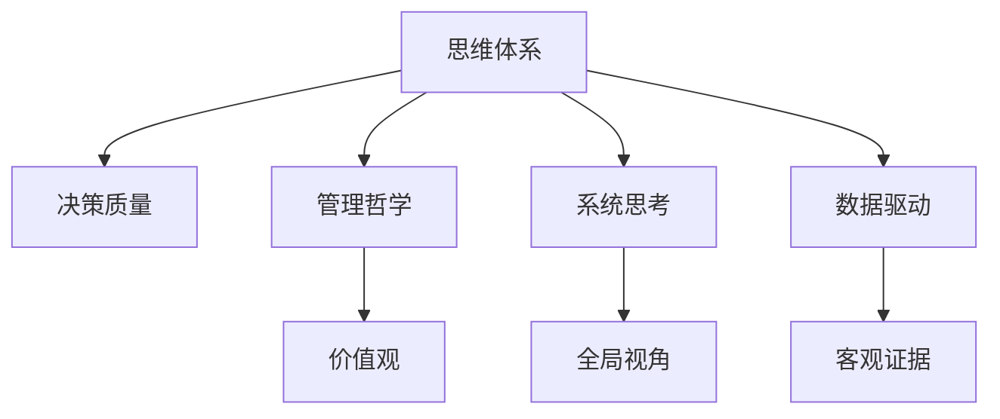
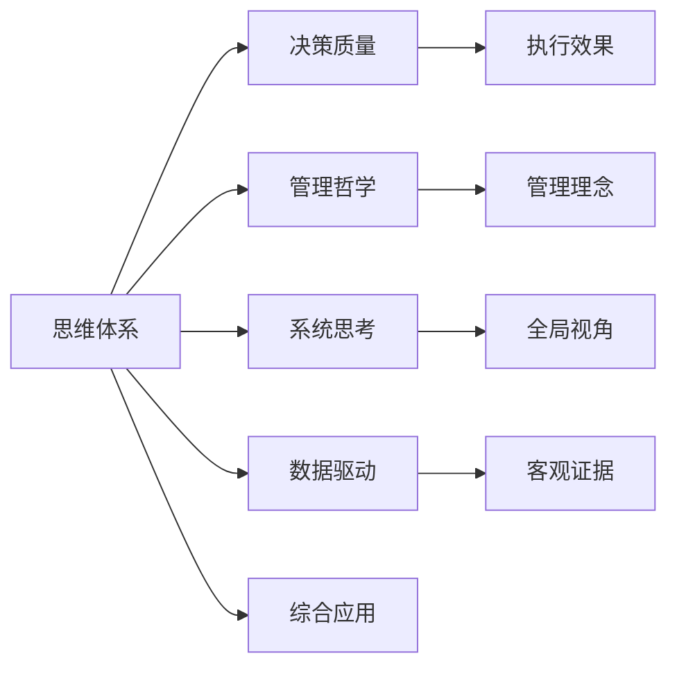

                 

# 思维体系与管理者决策质量的关系

> 关键词：思维体系,管理者决策,决策质量,管理哲学,系统思考,人工智能,大数据,数据驱动决策

## 1. 背景介绍

### 1.1 问题由来
在现代企业中，管理者的决策质量直接关系到企业的发展方向、市场竞争力乃至公司的成败。然而，面对快速变化的市场环境，如何做出高质量的决策，一直是管理实践中的重大难题。

### 1.2 问题核心关键点
为了提高决策质量，管理者需要具备清晰的思维体系和科学的决策方法。思维体系是管理者在信息处理、问题分析和决策制定过程中遵循的逻辑框架和思想模式。科学的决策方法则能够帮助管理者在数据驱动的基础上，进行更加系统、全面和精确的决策。

思维体系和决策质量之间存在密切关系：

1. **思维体系的系统性**：科学的思维体系能够帮助管理者从系统、全面的角度考虑问题，避免片面性和短期视角，从而做出更加合理和长远的决策。
2. **思维体系的逻辑性**：逻辑性强的思维体系能够帮助管理者进行有条不紊的信息处理和问题分析，减少决策中的主观偏见。
3. **思维体系的数据驱动**：在大数据时代，能够充分利用数据驱动的思维体系，能够帮助管理者在面对海量信息时，进行更加客观、精确的决策。

## 2. 核心概念与联系

### 2.1 核心概念概述

在探讨思维体系与管理者决策质量的关系之前，首先需要明确几个关键概念：

- **思维体系(Mental Framework)**：指管理者在决策过程中所遵循的思维模式和逻辑框架。
- **决策质量(Decision Quality)**：指决策的准确性、合理性和执行效果。
- **管理哲学(Management Philosophy)**：指管理者在实践中遵循的管理理念和价值体系。
- **系统思考(System Thinking)**：强调从系统整体角度考虑问题，避免局部视角。
- **数据驱动(Data-Driven)**：基于数据进行决策，避免主观偏见。

这些概念之间的逻辑关系可以通过以下Mermaid流程图来展示：



这个流程图展示了思维体系与决策质量的联系，以及如何通过管理哲学、系统思考和数据驱动来支持思维体系的构建。

### 2.2 核心概念原理和架构的 Mermaid 流程图

以下是一个简化的Mermaid流程图，展示了思维体系与决策质量的联系：



## 3. 核心算法原理 & 具体操作步骤

### 3.1 算法原理概述

为了系统地探讨思维体系与决策质量的关系，我们引入“系统动力学(System Dynamics)”这一科学思维体系。系统动力学强调通过模型化复杂系统，进行模拟、分析和预测，从而制定更加科学、合理的决策。

系统动力学模型包括以下关键组成部分：

- **反馈回路(Feedback Loop)**：描述系统中的因果关系，帮助管理者理解系统的动态行为。
- **变量(Variables)**：代表系统中的关键状态和参数，如收入、成本、市场份额等。
- **参数(Parameters)**：影响系统行为的关键因素，如市场增长率、投资回报率等。
- **延迟(Delays)**：描述系统中的时间滞后，如产品生产周期、市场响应时间等。
- **存量(Stocks)**：代表系统的关键存量，如库存水平、预算余额等。
- **流动率(Flows)**：描述系统中的关键流量，如销售流量、成本流动等。

### 3.2 算法步骤详解

以下是构建系统动力学模型的详细步骤：

1. **问题定义**：明确需要解决的问题，如市场拓展、成本控制等。
2. **数据收集**：收集相关数据，如历史销售数据、市场趋势等。
3. **模型构建**：基于收集到的数据，构建系统动力学模型，包括定义变量、参数、延迟和反馈回路。
4. **模型校验**：通过仿真和验证，调整模型参数，确保模型能够准确反映现实情况。
5. **决策制定**：在模型基础上，制定决策方案，进行模拟和预测。
6. **决策执行**：实施决策，监控执行效果，进行必要调整。

### 3.3 算法优缺点

系统动力学模型具有以下优点：

- **系统性**：能够从全局视角考虑问题，避免局部视野带来的片面性。
- **因果关系明确**：通过建模，清晰地揭示系统中的因果关系，有助于管理者理解复杂问题。
- **预测能力强**：通过仿真和模拟，能够进行未来预测，帮助管理者提前制定应对策略。

然而，系统动力学模型也存在以下缺点：

- **模型构建复杂**：需要较高的专业知识，对模型的构建和校验要求较高。
- **数据需求量大**：需要大量的历史数据和实时数据，对数据获取和处理能力要求较高。
- **调整复杂**：模型中的参数和变量较多，调整时容易产生波动。

### 3.4 算法应用领域

系统动力学模型在多个领域中得到广泛应用，包括：

- **企业战略管理**：帮助企业进行长期战略规划，制定目标和策略。
- **供应链管理**：优化供应链流程，提升供应链效率和稳定性。
- **产品开发**：通过模拟和预测，优化产品设计和生产流程。
- **人力资源管理**：优化员工招聘、培训和绩效管理。
- **市场分析**：进行市场趋势分析和预测，制定市场策略。

## 4. 数学模型和公式 & 详细讲解 & 举例说明

### 4.1 数学模型构建

系统动力学模型的核心是反馈回路和因果关系。以市场增长模型为例，构建如下：

- **变量**：
  - 销售额(Sales)
  - 市场份额(Market Share)
  - 客户增长率(Customer Growth Rate)

- **参数**：
  - 投资回报率(Return on Investment, ROI)
  - 销售增长率(Sales Growth Rate)
  - 客户流失率(Customer Churn Rate)

- **延迟**：
  - 产品生产周期(Product Lead Time)
  - 市场响应时间(Market Response Time)

- **反馈回路**：
  - **销售额增加**：销售额增加，客户数量增加，市场份额增加。
  - **市场份额增加**：市场份额增加，客户增长率增加。

### 4.2 公式推导过程

根据上述变量和参数，可以构建如下数学模型：

\[
\begin{aligned}
\text{Sales} &= \text{Market Share} \times \text{Sales Growth Rate} \\
\text{Market Share} &= \text{Market Share}_{\text{base}} \times (1+\text{Customer Growth Rate}) \\
\text{Customer Growth Rate} &= \text{Customer Churn Rate} + \text{Sales} \times \text{ROI}
\end{aligned}
\]

### 4.3 案例分析与讲解

假设某公司当前的市场份额为10%，投资回报率为20%，销售增长率为10%，客户流失率为5%，客户增长率为2%。

1. **模型构建**：

- 销售额(Sales) = 0.1 * 1.1
- 市场份额(Market Share) = 0.1 * (1 + 0.02) = 0.104
- 客户增长率(Customer Growth Rate) = 0.05 + 0.1 * 0.2 = 0.06

2. **模型校验**：

- 通过历史数据和市场趋势，验证模型的合理性，调整参数，确保模型能够准确反映现实情况。

3. **决策制定**：

- 假设公司计划增加市场份额到20%，需要考虑客户增长率和市场响应时间，通过模型进行仿真和预测。

## 5. 项目实践：代码实例和详细解释说明

### 5.1 开发环境搭建

为了进行系统动力学模型的建模和仿真，我们需要以下开发环境：

- Python 3.x
- PySD (Python system dynamics)
- NumPy
- Matplotlib
- Jupyter Notebook

安装上述环境的步骤如下：

1. 安装PySD：
```
pip install pySD
```

2. 安装NumPy和Matplotlib：
```
pip install numpy matplotlib
```

3. 安装Jupyter Notebook：
```
pip install jupyter notebook
```

### 5.2 源代码详细实现

以下是一个简单的系统动力学模型示例，用于演示如何构建和仿真模型：

```python
import pySD
import numpy as np
import matplotlib.pyplot as plt

# 定义变量和参数
S, M, C, R, IC, T = pySD defining("S", "Market Share", "Sales Growth Rate", "Customer Growth Rate", "ROI", "Customer Churn Rate", "Product Lead Time", "Market Response Time")

# 定义模型方程
eq1 = S * IC
eq2 = M * (1 + C)
eq3 = C + R * S

# 构建模型
model = pySD Model(eq1, eq2, eq3)

# 设置初始值
model.setVariableValues(S=0.1, M=0.1, C=0.02, R=0.2, IC=0.1, T=1)

# 仿真时间步
steps = 100

# 运行仿真
output = model.run(steps)

# 绘制结果
plt.plot(output[0], label="Sales")
plt.plot(output[1], label="Market Share")
plt.legend()
plt.show()
```

### 5.3 代码解读与分析

上述代码实现了以下功能：

- 定义变量和参数
- 构建系统动力学模型
- 设置初始值
- 运行仿真
- 绘制结果

具体解读如下：

- `pySD defining`：定义变量和参数
- `eq1`, `eq2`, `eq3`：定义模型方程
- `pySD Model`：构建模型
- `model.setVariableValues`：设置初始值
- `model.run`：运行仿真
- `plt.plot`：绘制结果

## 6. 实际应用场景

### 6.1 智能制造

系统动力学模型在智能制造中得到了广泛应用，通过模拟和预测，优化生产流程，提高生产效率和质量。例如，某制造企业通过建立系统动力学模型，对生产调度、库存管理和物料流动的动态行为进行了模拟和预测，从而优化了生产流程，减少了浪费，提高了生产效率。

### 6.2 能源管理

系统动力学模型在能源管理中也有重要应用，通过模拟和预测，优化能源分配，提升能源利用效率。例如，某能源企业通过建立系统动力学模型，对电力需求、风能和太阳能发电量的动态行为进行了模拟和预测，从而优化了能源分配，减少了能源浪费，提高了能源利用效率。

### 6.3 环境保护

系统动力学模型在环境保护中也有重要应用，通过模拟和预测，优化环境治理策略，提升环境保护效果。例如，某环境保护机构通过建立系统动力学模型，对工业排放、城市污染和自然降解的动态行为进行了模拟和预测，从而优化了环境治理策略，减少了环境污染，提升了环境保护效果。

## 7. 工具和资源推荐

### 7.1 学习资源推荐

为了帮助开发者系统掌握系统动力学模型，以下是几本优秀的学习资源推荐：

1. 《系统动力学导论》(The Dynamics of Systems of Organizations)：由Jay W. Forrester撰写，全面介绍了系统动力学的理论基础和应用方法。
2. 《系统动力学模型实战》(Practical System Dynamics for Business and the Behavioral Sciences)：由John G. Holland撰写，提供了丰富的系统动力学模型案例和实践指南。
3. 《系统思考：简单而非简单的思考方式》(Thinking in Systems: A Primer)：由Dominic Lunt和Andrew Oransky撰写，介绍了系统思考的基本原理和应用方法。
4. 《数据驱动决策：如何利用数据进行管理决策》(Data-Driven Decision Making: An Introduction to Decision Support Systems and Data Mining)：由Alejandro Martinez-Aguayo撰写，介绍了数据驱动决策的基本原理和应用方法。

### 7.2 开发工具推荐

以下是一些用于系统动力学模型开发的工具：

1. PySD：Python系统动力学建模工具，提供了丰富的建模和仿真功能。
2. Vensim：一款流行的系统动力学建模工具，支持丰富的可视化功能。
3. AnyLogic：一款功能强大的系统动力学建模工具，支持多学科仿真和分析。
4. STELLA：一款图形化系统动力学建模工具，支持快速建模和仿真。

### 7.3 相关论文推荐

系统动力学模型在多个领域中得到了广泛应用，以下是几篇经典论文推荐：

1. "System Dynamics: A Sensitivity Analysis of Community Survey Research"（Jay W. Forrester, 1958）：奠定了系统动力学的基础理论。
2. "A New Approach to Problem-Solving in Strategic Planning"（Jay W. Forrester, 1961）：介绍了系统动力学在战略规划中的应用。
3. "The Role of System Dynamics in Planning, Monitoring, and Control of Multifunctional Projects"（John G. Holland, 1963）：介绍了系统动力学在项目管理中的应用。
4. "Practical System Dynamics for Business and the Behavioral Sciences"（John G. Holland, 1978）：提供了系统动力学模型的案例和实践指南。
5. "System Dynamics Modelling: A Tool for Systems Thinking"（Jonathan Kennedy and James A. Smith, 2003）：介绍了系统动力学模型在管理决策中的应用。

## 8. 总结：未来发展趋势与挑战

### 8.1 总结

本文系统地探讨了思维体系与管理者决策质量的关系，介绍了系统动力学模型的原理和应用。通过实例演示，展示了系统动力学模型在多个领域中的实际应用。同时，也指出了系统动力学模型面临的挑战和未来发展趋势。

### 8.2 未来发展趋势

未来，系统动力学模型将在以下方面继续发展：

1. **模型复杂性提升**：随着模型应用场景的拓展，模型的复杂性将进一步提升，需要更多高级算法和工具来支持模型的构建和校验。
2. **数据来源多样化**：未来模型将更多地依赖多源异构数据，如物联网数据、社交媒体数据等，提升模型的预测精度。
3. **模型自动化**：自动建模、模型优化和仿真预测技术将进一步成熟，降低模型构建和维护的难度和成本。
4. **模型可视化**：可视化技术将更加完善，帮助管理者直观理解模型结果和动态行为，提升决策的直观性和可操作性。

### 8.3 面临的挑战

尽管系统动力学模型在管理决策中取得了显著成效，但仍面临以下挑战：

1. **模型构建难度高**：系统动力学模型需要高度专业知识，模型构建和校验难度较大。
2. **数据需求量大**：需要大量高质量的数据，数据获取和处理成本较高。
3. **模型复杂性高**：模型中的变量和参数众多，调整和优化难度较大。
4. **结果解释困难**：模型结果往往较为复杂，需要更多解释工具和培训，提升管理者的理解和应用能力。

### 8.4 研究展望

未来的研究应在以下方面寻求突破：

1. **模型自动化构建**：开发自动化建模工具，降低模型构建难度，提升模型构建效率。
2. **多源数据融合**：研究多源数据融合技术，提升模型预测精度和鲁棒性。
3. **模型可解释性**：研究模型结果解释工具，提升模型结果的可解释性和可操作性。
4. **模型互动性**：开发互动式模型平台，提升管理者对模型的使用体验和互动效果。

## 9. 附录：常见问题与解答

**Q1：系统动力学模型与传统决策模型的区别是什么？**

A: 系统动力学模型与传统决策模型的主要区别在于其系统性和动态性：
1. **系统性**：系统动力学模型强调从系统整体角度考虑问题，避免局部视角。
2. **动态性**：系统动力学模型考虑系统中的动态变化，能够进行仿真和预测，帮助管理者进行长期决策。

**Q2：系统动力学模型在决策制定中如何避免主观偏见？**

A: 系统动力学模型通过构建模型方程和反馈回路，自动进行数据驱动的决策，避免主观偏见。具体而言，模型中的变量和参数都是基于客观数据进行定义，通过仿真和预测，得出客观的决策结果。

**Q3：系统动力学模型在实际应用中需要哪些准备？**

A: 系统动力学模型在实际应用中需要以下准备：
1. **数据收集**：收集相关数据，包括历史数据和实时数据。
2. **模型构建**：定义变量、参数、延迟和反馈回路，构建系统动力学模型。
3. **模型校验**：通过仿真和验证，调整模型参数，确保模型能够准确反映现实情况。
4. **决策制定**：在模型基础上，制定决策方案，进行模拟和预测。
5. **决策执行**：实施决策，监控执行效果，进行必要调整。

**Q4：如何选择合适的系统动力学模型？**

A: 选择合适的系统动力学模型需要考虑以下几个因素：
1. **问题复杂度**：根据问题的复杂度和规模，选择合适复杂度的模型。
2. **数据可用性**：根据数据的可用性和质量，选择合适的模型。
3. **决策需求**：根据决策的需求，选择合适的方法和工具。

**Q5：系统动力学模型在数据驱动决策中的应用有哪些？**

A: 系统动力学模型在数据驱动决策中具有以下应用：
1. **市场预测**：通过模拟市场行为，进行市场预测和趋势分析。
2. **供应链优化**：通过模拟供应链流程，优化供应链管理和物流成本。
3. **产品设计**：通过模拟产品生命周期，优化产品设计和生产流程。
4. **客户管理**：通过模拟客户行为，优化客户关系管理和客户满意度。

---

作者：禅与计算机程序设计艺术 / Zen and the Art of Computer Programming

