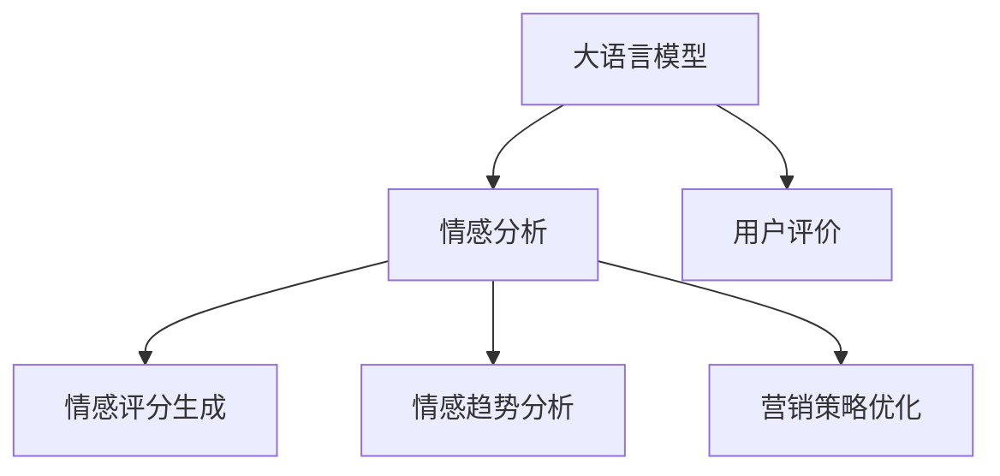
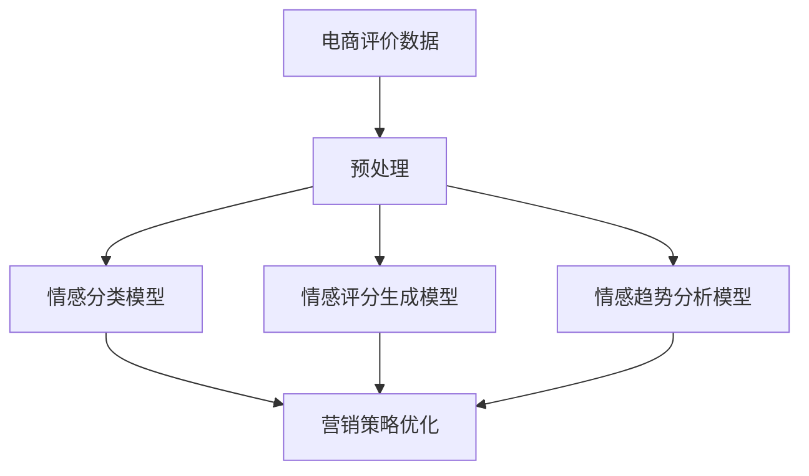

                 

# 情感分析在电商领域的应用：从用户评价到商品改进

## 1. 背景介绍

### 1.1 问题由来
在当前电商领域，用户评价(Reviews)是衡量商品质量、服务质量的重要数据来源。通过情感分析(Sentiment Analysis)技术，电商企业可以从用户评价中自动提取出商品的正负面评价，从而在商品设计、生产、营销等多个环节进行优化改进。

情感分析作为NLP中的一个热门研究方向，可以用于自动分析和理解用户对产品、服务、品牌等的情感倾向。在电商领域，情感分析的应用主要包括：

- **用户评价分析**：识别评价文本中的情感极性，帮助企业快速理解用户反馈，及时调整策略。
- **情感评分生成**：基于评价文本生成商品的情感评分，帮助消费者快速筛选商品。
- **情感趋势分析**：跟踪商品评价情感的变化趋势，洞察市场和消费者需求的变化。
- **营销策略优化**：分析不同营销活动对用户情感的影响，优化营销策略。

近年来，随着深度学习技术的发展，基于Transformer等架构的情感分析模型取得了显著进展。在电商领域，基于大语言模型的情感分析技术，已经被广泛应用到用户评价分析、商品评价生成等多个环节，为电商企业的运营决策提供了强有力的支持。

### 1.2 问题核心关键点
本节将介绍几个与情感分析在电商领域应用密切相关的核心概念，并展示它们之间的联系。

- **大语言模型**：指通过大规模无标签文本数据进行预训练的通用语言模型，如BERT、GPT-3等。
- **情感分析**：指识别和分析文本中情感极性的技术，通常分为文本分类和序列标注两大类。
- **用户评价**：指消费者对商品、服务等的文字反馈，通常包含情感倾向。
- **情感评分生成**：将用户评价文本映射为量化的情感评分，帮助用户快速筛选商品。
- **情感趋势分析**：通过时间序列模型，分析商品评价情感的变化趋势，洞察市场和消费者需求的变化。
- **营销策略优化**：利用情感分析结果，优化广告投放、商品推荐、促销策略等，提升营销效果。

这些概念之间的联系可以通过以下Mermaid流程图来展示：



这个流程图展示了情感分析在大语言模型基础上的工作流程：

1. 大语言模型通过对大规模文本数据的预训练，学习到了通用的语言表示。
2. 通过在用户评价上微调大语言模型，得到情感分析模型。
3. 情感分析模型可以对用户评价文本进行情感极性识别和分类。
4. 情感评分生成模型基于情感分类结果，生成量化的情感评分。
5. 情感趋势分析模型通过时序分析，跟踪商品情感评分变化。
6. 营销策略优化模型利用情感分析结果，优化广告和促销策略。

## 2. 核心概念与联系

### 2.1 核心概念概述

为更好地理解基于大语言模型的情感分析在电商领域的应用，本节将介绍几个关键概念，包括大语言模型、情感分类、情感评分生成、情感趋势分析以及营销策略优化。

#### 2.1.1 大语言模型

大语言模型是一种基于大规模无标签文本数据进行预训练的通用语言模型。通过自监督学习任务（如掩码语言建模、下一句预测等），大语言模型学习到了丰富的语言知识，具备强大的自然语言理解能力。常见的预训练模型包括BERT、GPT-2、GPT-3等。

大语言模型的核心思想是通过自回归（如GPT）或自编码（如BERT）架构，对大规模语料进行预训练。预训练过程中，模型学习到语言的语法、语义、上下文等信息，能够生成自然流畅的文本。

#### 2.1.2 情感分类

情感分类是指将文本中的情感极性分为正面、中性、负面等类别。在电商领域，情感分类可以用于识别用户评价中的情感倾向，帮助企业快速理解和分析用户反馈。

情感分类通常使用二分类或多分类模型进行实现，常见的模型包括LSTM、CNN、BERT等。对于长文本，情感分类模型通常需要对文本进行最大长度限制、分词、编码等预处理。

#### 2.1.3 情感评分生成

情感评分生成是将用户评价文本映射为量化的情感评分。在电商领域，情感评分生成模型可以帮助消费者快速筛选商品，提高购买决策的准确性。

情感评分生成通常基于评分系统（如五星级评分、情感词权重等）进行设计。常见的模型包括线性回归模型、逻辑回归模型、深度学习模型等。情感评分生成模型需要考虑评分系统设计的合理性，避免过度依赖情感极性分类结果。

#### 2.1.4 情感趋势分析

情感趋势分析是通过时间序列模型，分析商品评价情感的变化趋势。在电商领域，情感趋势分析可以帮助企业洞察市场和消费者需求的变化，及时调整产品策略。

情感趋势分析通常使用滑动窗口、指数加权平均等方法进行数据处理，然后应用时间序列模型（如ARIMA、LSTM等）进行预测。情感趋势分析需要考虑数据的时序特征，避免因数据分布变化带来的影响。

#### 2.1.5 营销策略优化

营销策略优化是指利用情感分析结果，优化广告投放、商品推荐、促销策略等，提升营销效果。在电商领域，营销策略优化可以帮助企业提高广告转化率、提升用户满意度。

营销策略优化通常基于情感分析结果（如情感评分、情感分布等）进行策略调整。常见的策略包括定向广告、个性化推荐、动态定价等。

### 2.2 核心概念原理和架构的 Mermaid 流程图

以下是一个简化版的情感分析在电商领域应用的流程图，展示了核心概念之间的联系：



这个流程图展示了情感分析在电商领域的应用流程：

1. 电商企业收集用户评价数据。
2. 对数据进行预处理，包括文本清洗、分词、编码等。
3. 应用情感分类模型对用户评价文本进行情感极性分类。
4. 应用情感评分生成模型将情感分类结果转化为量化的情感评分。
5. 应用情感趋势分析模型跟踪商品评价情感变化趋势。
6. 应用营销策略优化模型基于情感分析结果优化广告和促销策略。

## 3. 核心算法原理 & 具体操作步骤

### 3.1 算法原理概述

基于大语言模型的情感分析在电商领域的应用，核心在于利用大语言模型的预训练知识和微调能力，对用户评价数据进行情感分析。

情感分析的算法原理可以分为以下几步：

1. **预训练大语言模型**：使用大规模无标签文本数据对通用语言模型进行预训练，学习到语言表示和语义理解能力。
2. **微调情感分类模型**：在标注的情感分类数据集上微调预训练模型，得到针对特定领域的情感分类模型。
3. **情感评分生成**：基于情感分类结果，通过评分系统或自定义模型，将情感分类结果转化为量化的情感评分。
4. **情感趋势分析**：使用时间序列模型，对商品评价情感进行变化趋势分析。
5. **营销策略优化**：基于情感分析结果，优化广告投放、商品推荐、促销策略等。

### 3.2 算法步骤详解

#### 3.2.1 数据预处理

电商领域的情感分析通常使用用户评价文本数据。数据预处理包括文本清洗、分词、编码等步骤。

- **文本清洗**：去除无关信息（如HTML标签、停用词等），保留有价值的评价信息。
- **分词**：对文本进行分词，将长文本拆分为词序列。
- **编码**：将分词后的文本序列编码，转换为模型可以处理的格式。

#### 3.2.2 情感分类模型的微调

情感分类模型的微调步骤如下：

1. **选择预训练模型**：选择适合情感分析任务的预训练模型，如BERT、GPT-2等。
2. **数据集准备**：准备标注的情感分类数据集，包括训练集、验证集和测试集。
3. **添加任务适配层**：在预训练模型的顶层添加适当的输出层，如全连接层、softmax层等，用于情感分类。
4. **微调训练**：使用微调数据集对模型进行有监督的训练，最小化损失函数，更新模型参数。
5. **验证和评估**：在验证集上评估模型性能，根据验证结果调整超参数。

#### 3.2.3 情感评分生成

情感评分生成的步骤如下：

1. **评分系统设计**：设计评分系统，通常使用五星级评分、情感词权重等。
2. **模型构建**：基于评分系统设计情感评分生成模型，如线性回归模型、逻辑回归模型、深度学习模型等。
3. **模型训练**：使用标注的情感评分数据集对模型进行训练，最小化预测误差。
4. **预测评分**：将用户评价文本输入模型，输出量化的情感评分。

#### 3.2.4 情感趋势分析

情感趋势分析的步骤如下：

1. **数据处理**：将商品评价情感数据转换为时间序列数据，使用滑动窗口等方法处理时序数据。
2. **模型选择**：选择适合时间序列分析的模型，如ARIMA、LSTM等。
3. **模型训练**：使用标注的时间序列数据集对模型进行训练，最小化预测误差。
4. **趋势预测**：使用训练好的模型对未来情感评分进行预测。

#### 3.2.5 营销策略优化

营销策略优化的步骤如下：

1. **数据收集**：收集商品广告、促销活动等数据，结合情感分析结果。
2. **模型设计**：设计营销策略优化模型，如线性回归模型、逻辑回归模型、深度学习模型等。
3. **模型训练**：使用标注的营销策略数据集对模型进行训练，最小化预测误差。
4. **策略优化**：根据情感分析结果和营销策略优化模型输出，调整广告投放、商品推荐、促销策略等。

### 3.3 算法优缺点

基于大语言模型的情感分析在电商领域的应用，具有以下优点：

1. **预训练优势**：利用大语言模型的预训练知识，可以快速提升模型性能，减少标注数据需求。
2. **泛化能力**：大语言模型具备强大的泛化能力，可以处理多种类型的情感分析任务。
3. **技术成熟**：大语言模型和深度学习技术在电商领域已广泛应用于用户评价分析、商品评分生成等环节。

同时，也存在一些缺点：

1. **数据依赖**：情感分析结果依赖于标注数据，标注数据不足可能导致性能下降。
2. **计算资源需求高**：大语言模型的预训练和微调需要大量的计算资源，对硬件要求较高。
3. **鲁棒性不足**：情感分析模型可能对噪声数据和异常数据敏感，需要进一步改进模型鲁棒性。

### 3.4 算法应用领域

基于大语言模型的情感分析在电商领域的应用范围广泛，主要包括以下几个方面：

1. **用户评价分析**：对用户评价文本进行情感分类，帮助企业快速了解用户反馈。
2. **情感评分生成**：将用户评价文本转化为量化的情感评分，帮助消费者快速筛选商品。
3. **情感趋势分析**：跟踪商品评价情感的变化趋势，洞察市场和消费者需求的变化。
4. **营销策略优化**：利用情感分析结果，优化广告投放、商品推荐、促销策略等。

## 4. 数学模型和公式 & 详细讲解

### 4.1 数学模型构建

基于大语言模型的情感分析，通常使用以下数学模型：

1. **预训练大语言模型**：使用大规模无标签文本数据进行预训练，学习到语言表示和语义理解能力。
2. **情感分类模型**：在标注的情感分类数据集上微调预训练模型，得到针对特定领域的情感分类模型。
3. **情感评分生成模型**：基于情感分类结果，通过评分系统或自定义模型，将情感分类结果转化为量化的情感评分。
4. **情感趋势分析模型**：使用时间序列模型，对商品评价情感进行变化趋势分析。
5. **营销策略优化模型**：基于情感分析结果，设计优化策略模型。

### 4.2 公式推导过程

#### 4.2.1 情感分类模型的公式推导

假设情感分类模型为 $M_{\theta}:\mathcal{X} \rightarrow \mathcal{Y}$，其中 $\mathcal{X}$ 为输入文本序列，$\mathcal{Y}$ 为情感分类结果（正面、负面、中性等）。情感分类模型的输入为经过分词和编码的文本序列 $x_i$，输出为情感分类概率 $p(y_i|x_i)$。

情感分类模型的损失函数通常为交叉熵损失函数：

$$
\mathcal{L}(\theta) = -\frac{1}{N}\sum_{i=1}^N \sum_{j=1}^{C} y_{ij} \log p(y_{ij}|x_i)
$$

其中，$C$ 为情感分类类别数，$y_{ij}$ 为标注数据中的情感标签。

情感分类模型的优化目标为：

$$
\theta^* = \mathop{\arg\min}_{\theta} \mathcal{L}(\theta)
$$

通过反向传播算法，最小化交叉熵损失函数，更新模型参数 $\theta$。

#### 4.2.2 情感评分生成模型的公式推导

假设情感评分生成模型为 $M_{\theta}:\mathcal{X} \rightarrow \mathcal{Y}$，其中 $\mathcal{X}$ 为情感分类结果（正面、负面、中性等），$\mathcal{Y}$ 为量化的情感评分。情感评分生成模型将情感分类结果 $y_i$ 映射为评分 $s_i$。

情感评分生成模型的目标为最小化预测误差，常用的损失函数为均方误差损失函数：

$$
\mathcal{L}(\theta) = \frac{1}{N}\sum_{i=1}^N (s_i - \hat{s}_i)^2
$$

其中，$\hat{s}_i$ 为情感评分生成模型预测的评分。

情感评分生成模型的优化目标为：

$$
\theta^* = \mathop{\arg\min}_{\theta} \mathcal{L}(\theta)
$$

通过最小化均方误差损失函数，更新模型参数 $\theta$。

#### 4.2.3 情感趋势分析模型的公式推导

假设情感趋势分析模型为 $M_{\theta}:\mathcal{X} \rightarrow \mathcal{Y}$，其中 $\mathcal{X}$ 为时间序列数据，$\mathcal{Y}$ 为情感评分序列。情感趋势分析模型基于时间序列数据 $x_t$ 预测未来情感评分 $s_t$。

情感趋势分析模型的目标为最小化预测误差，常用的损失函数为均方误差损失函数：

$$
\mathcal{L}(\theta) = \frac{1}{N}\sum_{t=1}^T (s_t - \hat{s}_t)^2
$$

其中，$T$ 为时间序列长度。

情感趋势分析模型的优化目标为：

$$
\theta^* = \mathop{\arg\min}_{\theta} \mathcal{L}(\theta)
$$

通过最小化均方误差损失函数，更新模型参数 $\theta$。

## 5. 项目实践：代码实例和详细解释说明

### 5.1 开发环境搭建

在进行情感分析项目实践前，需要准备好开发环境。以下是使用Python进行PyTorch开发的环境配置流程：

1. 安装Anaconda：从官网下载并安装Anaconda，用于创建独立的Python环境。
2. 创建并激活虚拟环境：
```bash
conda create -n pytorch-env python=3.8 
conda activate pytorch-env
```
3. 安装PyTorch：根据CUDA版本，从官网获取对应的安装命令。例如：
```bash
conda install pytorch torchvision torchaudio cudatoolkit=11.1 -c pytorch -c conda-forge
```
4. 安装Transformers库：
```bash
pip install transformers
```
5. 安装各类工具包：
```bash
pip install numpy pandas scikit-learn matplotlib tqdm jupyter notebook ipython
```

完成上述步骤后，即可在`pytorch-env`环境中开始情感分析项目实践。

### 5.2 源代码详细实现

我们以情感分类模型为例，给出使用Transformers库对BERT模型进行情感分类的PyTorch代码实现。

首先，定义情感分类模型：

```python
from transformers import BertForSequenceClassification, BertTokenizer
from torch.utils.data import Dataset, DataLoader
import torch
import torch.nn as nn

# 设置模型和分词器
model = BertForSequenceClassification.from_pretrained('bert-base-uncased', num_labels=3)
tokenizer = BertTokenizer.from_pretrained('bert-base-uncased')

# 定义情感分类模型
class SentimentClassificationModel(nn.Module):
    def __init__(self, model, num_labels):
        super(SentimentClassificationModel, self).__init__()
        self.model = model
        self.num_labels = num_labels
        self.classifier = nn.Linear(768, num_labels)
    
    def forward(self, input_ids, attention_mask):
        outputs = self.model(input_ids, attention_mask=attention_mask)
        pooled_output = outputs.pooler_output
        logits = self.classifier(pooled_output)
        return logits
```

然后，定义数据集和数据加载器：

```python
# 定义情感分类数据集
class SentimentDataset(Dataset):
    def __init__(self, texts, labels):
        self.texts = texts
        self.labels = labels
        self.tokenizer = tokenizer
    
    def __len__(self):
        return len(self.texts)
    
    def __getitem__(self, index):
        text = self.texts[index]
        label = self.labels[index]
        
        encoding = self.tokenizer(text, return_tensors='pt', truncation=True, padding='max_length')
        input_ids = encoding['input_ids']
        attention_mask = encoding['attention_mask']
        label = torch.tensor(label, dtype=torch.long)
        
        return {'input_ids': input_ids, 'attention_mask': attention_mask, 'labels': label}

# 定义数据加载器
train_dataset = SentimentDataset(train_texts, train_labels)
val_dataset = SentimentDataset(val_texts, val_labels)
test_dataset = SentimentDataset(test_texts, test_labels)

train_loader = DataLoader(train_dataset, batch_size=16, shuffle=True)
val_loader = DataLoader(val_dataset, batch_size=16)
test_loader = DataLoader(test_dataset, batch_size=16)
```

接着，定义训练和评估函数：

```python
# 定义训练函数
def train_epoch(model, loader, optimizer):
    model.train()
    losses = []
    for batch in loader:
        input_ids = batch['input_ids'].to(device)
        attention_mask = batch['attention_mask'].to(device)
        labels = batch['labels'].to(device)
        optimizer.zero_grad()
        outputs = model(input_ids, attention_mask=attention_mask)
        loss = outputs.loss
        losses.append(loss.item())
        loss.backward()
        optimizer.step()
    return sum(losses) / len(loader)

# 定义评估函数
def evaluate(model, loader):
    model.eval()
    correct = 0
    total = 0
    with torch.no_grad():
        for batch in loader:
            input_ids = batch['input_ids'].to(device)
            attention_mask = batch['attention_mask'].to(device)
            labels = batch['labels'].to(device)
            outputs = model(input_ids, attention_mask=attention_mask)
            _, predicted = torch.max(outputs.logits, dim=1)
            total += labels.size(0)
            correct += (predicted == labels).sum().item()
    
    accuracy = 100.0 * correct / total
    return accuracy
```

最后，启动训练流程并在测试集上评估：

```python
# 定义超参数
learning_rate = 2e-5
epochs = 5

# 定义优化器
optimizer = torch.optim.Adam(model.parameters(), lr=learning_rate)

# 训练模型
device = torch.device('cuda') if torch.cuda.is_available() else torch.device('cpu')
model.to(device)
for epoch in range(epochs):
    train_loss = train_epoch(model, train_loader, optimizer)
    val_accuracy = evaluate(model, val_loader)
    print(f'Epoch {epoch+1}, train loss: {train_loss:.4f}, val accuracy: {val_accuracy:.2f}')
    
# 在测试集上评估模型
test_accuracy = evaluate(model, test_loader)
print(f'Test accuracy: {test_accuracy:.2f}')
```

以上就是使用PyTorch对BERT进行情感分类模型的微调的完整代码实现。可以看到，得益于Transformers库的强大封装，我们可以用相对简洁的代码完成BERT模型的加载和微调。

### 5.3 代码解读与分析

让我们再详细解读一下关键代码的实现细节：

**SentimentDataset类**：
- `__init__`方法：初始化文本、标签、分词器等关键组件。
- `__len__`方法：返回数据集的样本数量。
- `__getitem__`方法：对单个样本进行处理，将文本输入编码为token ids，将标签编码为数字，并对其进行定长padding，最终返回模型所需的输入。

**SentimentClassificationModel类**：
- `__init__`方法：初始化情感分类模型，添加适当的输出层。
- `forward`方法：前向传播计算模型的输出。

**训练和评估函数**：
- 使用PyTorch的DataLoader对数据集进行批次化加载，供模型训练和推理使用。
- 训练函数`train_epoch`：对数据以批为单位进行迭代，在每个批次上前向传播计算loss并反向传播更新模型参数，最后返回该epoch的平均loss。
- 评估函数`evaluate`：与训练类似，不同点在于不更新模型参数，并在每个batch结束后将预测和标签结果存储下来，最后使用accuracy指标评估模型性能。

**训练流程**：
- 定义总的epoch数和学习率，开始循环迭代
- 每个epoch内，先在训练集上训练，输出平均loss
- 在验证集上评估，输出准确率
- 所有epoch结束后，在测试集上评估，给出最终测试结果

可以看到，PyTorch配合Transformers库使得情感分类模型的微调代码实现变得简洁高效。开发者可以将更多精力放在数据处理、模型改进等高层逻辑上，而不必过多关注底层的实现细节。

当然，工业级的系统实现还需考虑更多因素，如模型的保存和部署、超参数的自动搜索、更灵活的任务适配层等。但核心的微调范式基本与此类似。

## 6. 实际应用场景

### 6.1 智能客服系统

智能客服系统在电商领域有广泛应用，可以显著提升客户咨询体验和问题解决效率。情感分析技术可以帮助智能客服系统更好地理解客户情感，提供更优质的服务。

在实践中，可以通过情感分析对客户评价文本进行情感分类，判断客户情绪是否积极、消极或中立。根据情感分类结果，智能客服系统可以自动调整服务流程，例如引入人工客服、提供情感化回应等，从而提升客户满意度。

### 6.2 商品评价分析

商品评价分析是电商领域情感分析的重要应用之一。通过情感分析，电商企业可以了解商品的用户评价情感倾向，及时发现并解决用户问题，提高商品质量。

在实践中，可以通过情感分类模型对用户评价文本进行情感分类，分析不同商品的用户情感分布。根据情感分布结果，电商企业可以优化商品设计、生产、营销策略，提升用户体验和满意度。

### 6.3 个性化推荐系统

个性化推荐系统在电商领域有广泛应用，可以帮助用户快速找到满意的商品。情感分析技术可以帮助个性化推荐系统更好地理解用户需求，提供更精准的商品推荐。

在实践中，可以通过情感评分生成模型对用户评价文本进行情感评分，生成量化的情感评分。根据情感评分结果，个性化推荐系统可以优化推荐算法，提升推荐效果。

### 6.4 未来应用展望

未来，情感分析技术在电商领域的应用将更加广泛和深入，以下是对其未来应用的展望：

1. **情感趋势预测**：基于时间序列模型，对商品评价情感进行变化趋势预测，帮助电商企业及时调整产品策略。
2. **多模态情感分析**：结合视觉、语音等多模态信息，进行更全面的情感分析，提升用户体验和满意度。
3. **智能客服优化**：通过情感分析结果，优化智能客服系统的回答策略和情绪控制，提升服务质量。
4. **情感化营销**：利用情感分析结果，设计更符合用户情感需求的营销策略，提升广告效果和转化率。

随着深度学习技术的不断进步，情感分析技术将在电商领域迎来更多创新应用，为消费者提供更智能、更个性化的购物体验。

## 7. 工具和资源推荐

### 7.1 学习资源推荐

为了帮助开发者系统掌握情感分析在电商领域的应用，以下是一些优质的学习资源：

1. 《深度学习与自然语言处理》课程：由吴恩达教授讲授，全面介绍了深度学习在NLP中的应用，包括情感分析。
2. 《NLP实战：基于深度学习的自然语言处理》书籍：介绍了深度学习在NLP中的应用，包括情感分类、情感评分生成等。
3. 《Hugging Face Transformers文档》：提供了大量预训练模型的实现和微调样例，是情感分析技术学习的必备资源。
4. Kaggle数据集：包含了各种情感分析数据集，可以帮助开发者进行情感分析模型的训练和测试。
5. GitHub开源项目：提供了情感分析在电商领域的应用示例，如智能客服、商品评价分析等。

通过对这些资源的学习实践，相信你一定能够快速掌握情感分析在电商领域的应用技巧，并用于解决实际的NLP问题。

### 7.2 开发工具推荐

高效的开发离不开优秀的工具支持。以下是几款用于情感分析在电商领域应用的常用工具：

1. PyTorch：基于Python的开源深度学习框架，灵活的计算图和自动微分功能，适合快速迭代研究。
2. TensorFlow：由Google主导开发的开源深度学习框架，生产部署方便，适合大规模工程应用。
3. Transformers库：Hugging Face开发的NLP工具库，集成了大量预训练模型，支持PyTorch和TensorFlow，是进行情感分析任务开发的利器。
4. Weights & Biases：模型训练的实验跟踪工具，可以记录和可视化模型训练过程中的各项指标，方便对比和调优。
5. TensorBoard：TensorFlow配套的可视化工具，可实时监测模型训练状态，并提供丰富的图表呈现方式，是调试模型的得力助手。
6. Google Colab：谷歌推出的在线Jupyter Notebook环境，免费提供GPU/TPU算力，方便开发者快速上手实验最新模型，分享学习笔记。

合理利用这些工具，可以显著提升情感分析模型的开发效率，加快创新迭代的步伐。

### 7.3 相关论文推荐

情感分析技术在电商领域的应用源于学界的持续研究。以下是几篇奠基性的相关论文，推荐阅读：

1. Sentiment Analysis with Deep Learning: A Survey of Techniques and Applications：综述了深度学习在情感分析中的应用，包括情感分类、情感评分生成等。
2. A Survey on Sentiment Analysis（综述）：详细介绍了情感分析的最新进展，包括数据集、模型、应用等方面。
3. A Sentiment Analysis on E-commerce Reviews：介绍了一个基于深度学习的电商情感分析模型，并对比了不同模型的性能。
4. A Review of Sentiment Analysis in E-commerce Reviews：综述了电商领域情感分析的研究进展和应用案例。
5. A Sentiment Analysis Method Based on LSTM Neural Network：介绍了一个基于LSTM神经网络的电商情感分析模型，并对其性能进行了评估。

这些论文代表了情感分析在电商领域应用的最新研究进展。通过学习这些前沿成果，可以帮助研究者把握学科前进方向，激发更多的创新灵感。

## 8. 总结：未来发展趋势与挑战

### 8.1 总结

本文对基于大语言模型的情感分析在电商领域的应用进行了全面系统的介绍。首先阐述了情感分析在电商领域的应用背景和意义，明确了情感分析在电商领域的重要作用。其次，从原理到实践，详细讲解了情感分析的数学原理和关键步骤，给出了情感分析任务开发的完整代码实例。同时，本文还广泛探讨了情感分析在智能客服、商品评价分析、个性化推荐等多个电商应用场景中的应用，展示了情感分析范式的巨大潜力。此外，本文精选了情感分析技术的各类学习资源，力求为读者提供全方位的技术指引。

通过本文的系统梳理，可以看到，基于大语言模型的情感分析在电商领域的应用，能够显著提升用户体验、提高运营效率、优化产品策略，具有广阔的应用前景。未来，伴随深度学习技术的不断进步，情感分析技术将在电商领域迎来更多创新应用，为电商企业提供更智能、更个性化的解决方案。

### 8.2 未来发展趋势

展望未来，情感分析技术在电商领域的应用将呈现以下几个发展趋势：

1. **多模态情感分析**：结合视觉、语音等多模态信息，进行更全面的情感分析，提升用户体验和满意度。
2. **智能客服优化**：通过情感分析结果，优化智能客服系统的回答策略和情绪控制，提升服务质量。
3. **情感化营销**：利用情感分析结果，设计更符合用户情感需求的营销策略，提升广告效果和转化率。
4. **情感趋势预测**：基于时间序列模型，对商品评价情感进行变化趋势预测，帮助电商企业及时调整产品策略。
5. **多任务学习**：将情感分析与其他任务（如实体识别、意图识别等）结合，进行联合训练，提升模型性能。
6. **联邦学习**：通过分布式训练和模型压缩技术，实现跨电商企业情感分析模型的联合训练，共享知识和收益。

以上趋势凸显了情感分析技术在电商领域应用的广阔前景。这些方向的探索发展，必将进一步提升电商系统的性能和用户体验，为电商企业带来新的商业机会。

### 8.3 面临的挑战

尽管情感分析技术在电商领域的应用已经取得了一定成效，但在迈向更加智能化、普适化应用的过程中，它仍面临着诸多挑战：

1. **标注数据需求**：情感分析模型依赖于标注数据，标注数据不足可能导致性能下降。
2. **计算资源需求**：深度学习模型的训练和推理需要大量的计算资源，对硬件要求较高。
3. **模型鲁棒性**：情感分析模型可能对噪声数据和异常数据敏感，需要进一步改进模型鲁棒性。
4. **用户隐私保护**：情感分析需要处理大量用户数据，用户隐私保护问题需引起重视。
5. **模型可解释性**：情感分析模型的决策过程缺乏可解释性，难以对其推理逻辑进行分析和调试。

### 8.4 研究展望

面对情感分析技术在电商领域应用所面临的挑战，未来的研究需要在以下几个方面寻求新的突破：

1. **数据增强**：利用数据增强技术，提高标注数据的数量和质量，减少对标注数据的依赖。
2. **轻量化模型**：开发轻量化模型，降低计算资源需求，提高模型在移动端的应用。
3. **鲁棒性增强**：通过引入对抗样本、自适应等技术，增强情感分析模型的鲁棒性。
4. **隐私保护**：利用差分隐私、联邦学习等技术，保护用户隐私，提升用户信任度。
5. **可解释性提升**：引入可解释性模型（如LIME、SHAP等），提升情感分析模型的可解释性，帮助用户理解模型决策。

这些研究方向的探索，必将引领情感分析技术迈向更高的台阶，为电商领域带来更加智能、安全、可解释的解决方案。面向未来，情感分析技术还需要与其他人工智能技术进行更深入的融合，如知识表示、因果推理、强化学习等，多路径协同发力，共同推动电商领域的智能化进程。只有勇于创新、敢于突破，才能不断拓展情感分析的边界，让智能技术更好地造福电商企业。

## 9. 附录：常见问题与解答

**Q1：情感分析结果是否受主观因素影响？**

A: 情感分析结果可能会受到主观因素的影响，因为情感分析依赖于标注数据的情感标签。标注数据的标注过程可能存在主观偏差，导致情感分析模型的输出也存在偏差。为了减少主观因素的影响，可以使用多标注数据源、进行多次标注取平均值、引入多模态信息等方法。

**Q2：情感分析模型如何处理多义词？**

A: 情感分析模型处理多义词的方法通常包括词义消歧、上下文理解等。词义消歧是指在上下文中确定词语的实际含义，避免因多义词而导致的情感分析偏差。上下文理解是指在词义消歧的基础上，结合上下文信息进行情感分析，增强模型的鲁棒性和准确性。

**Q3：情感分析模型如何处理长文本？**

A: 情感分析模型处理长文本的方法通常包括文本分词、最大长度限制、分句处理等。文本分词是指将长文本拆分为词序列，方便模型进行处理。最大长度限制是指对文本进行截断，避免因文本过长而导致的计算资源消耗。分句处理是指将长文本拆分为多个句子，分别进行情感分析，增强模型的准确性。

**Q4：情感分析模型如何处理噪声数据？**

A: 情感分析模型处理噪声数据的方法通常包括数据清洗、噪声过滤、鲁棒性增强等。数据清洗是指去除噪声数据，保留有价值的情感信息。噪声过滤是指通过算法识别和过滤噪声数据，提升模型的鲁棒性。鲁棒性增强是指在模型训练和推理过程中，加入对抗样本等技术，增强模型的鲁棒性。

**Q5：情感分析模型如何在不同领域应用？**

A: 情感分析模型在不同领域应用的方法通常包括数据预处理、领域适配等。数据预处理是指针对不同领域的情感分析任务，进行文本清洗、分词、编码等预处理。领域适配是指在情感分类模型或评分生成模型中，加入特定领域的标签或特征，进行领域适配训练，提升模型在特定领域的应用效果。

通过对这些常见问题的解答，相信你一定能够更好地理解情感分析在电商领域的应用，并用于解决实际的NLP问题。

---

作者：禅与计算机程序设计艺术 / Zen and the Art of Computer Programming

