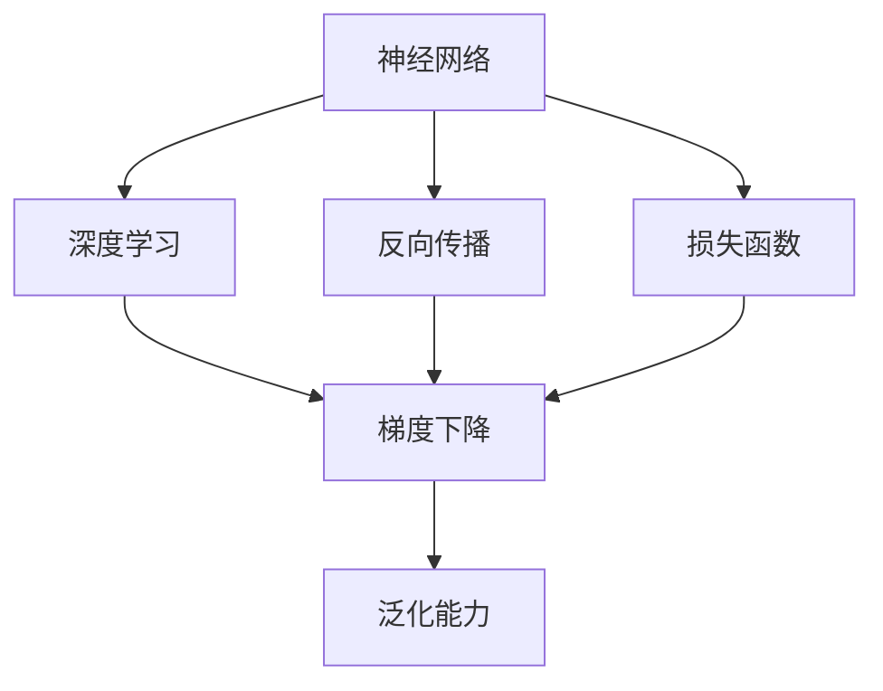

                 

# 我无法创造的东西，我就不明白。 ——理查德·费曼

## 1. 背景介绍

### 1.1 问题由来
著名物理学家理查德·费曼曾言：“我无法创造的东西，我就不明白。”这句话折射出科学的真谛：唯有理解其创造过程，方能把握事物的本质。这一观点在人工智能(AI)领域同样适用。当我们深入探索AI的核心原理时，便会发现，费曼的这句话亦成为了AI研究的重要指导思想。

人工智能，简而言之，是让机器模拟人类的认知和智能行为。要实现这一目标，我们需要理解并创造能够模拟人类智能的算法和模型。然而，正是由于AI的复杂性和多样性，使得理解其工作机制变得极为困难。费曼的这句话，便为我们提供了一种解决思路：只有深入理解AI的创造过程，我们才能真正明白其工作原理，并不断推动AI技术的进步。

### 1.2 问题核心关键点
费曼的这句话，同样适用于AI领域。为了深刻理解AI技术，我们必须深入研究其核心算法和模型。这包括但不限于：

1. **神经网络的结构和训练**：如何构建和训练深度神经网络？
2. **深度学习的优化算法**：如何优化神经网络的损失函数？
3. **模型的泛化能力**：如何使模型在未见过的数据上也能表现良好？
4. **数据的表示和处理**：如何有效地将数据转化为神经网络能够处理的格式？
5. **模型的解释性**：如何理解和解释深度模型的内部机制？

这些问题不仅涉及AI的理论研究，还涵盖其工程实现和应用落地。只有全面理解这些关键点，我们才能真正掌握AI的核心技术，并推动其向前发展。

## 2. 核心概念与联系

### 2.1 核心概念概述

为更好地理解AI技术，本节将介绍几个密切相关的核心概念：

- **神经网络(Neural Network, NN)**：由大量人工神经元(节点)和连接权重构成的计算模型。神经网络通过输入数据和训练样本，学习从输入到输出的映射关系。
- **深度学习(Deep Learning)**：一种通过多层次神经网络实现高级抽象的机器学习技术。深度学习在图像识别、自然语言处理等领域取得了巨大成功。
- **反向传播(Backpropagation)**：一种用于训练神经网络的高效算法，通过反向传播误差信号，更新神经网络权重，最小化损失函数。
- **梯度下降(Gradient Descent)**：一种基于导数的优化算法，通过迭代更新权重，逐步降低损失函数。
- **损失函数(Loss Function)**：用于衡量模型预测输出与真实标签之间的差异。常见的损失函数包括交叉熵损失、均方误差损失等。
- **泛化能力(Generalization)**：模型在新数据上的表现，即模型从训练集中学习到的知识，能否推广到未见过的数据上。

这些核心概念之间的逻辑关系可以通过以下Mermaid流程图来展示：



这个流程图展示了大语言模型的核心概念及其之间的关系：

1. 神经网络是深度学习的基石，通过多层次的神经元组成计算模型。
2. 深度学习通过神经网络进行高级抽象，实现复杂的模式识别任务。
3. 反向传播算法是深度学习训练的基础，通过误差反向传播更新权重。
4. 梯度下降算法基于导数计算，用于优化神经网络的损失函数。
5. 损失函数衡量模型预测输出与真实标签之间的差异，指导模型的训练。
6. 泛化能力是深度学习模型的最终目标，即在新数据上也能表现良好。

这些概念共同构成了深度学习的工作原理，使其能够在各种场景下发挥强大的智能功能。

## 3. 核心算法原理 & 具体操作步骤

### 3.1 算法原理概述

深度学习算法通过构建多层神经网络，实现从输入数据到输出结果的复杂映射。其核心思想是：通过反向传播算法和梯度下降算法，最小化损失函数，使得神经网络能够更好地拟合训练数据，并在新数据上表现优异。

形式化地，假设深度神经网络 $M$ 包含 $N$ 层，其参数为 $\theta$。给定训练集 $D=\{(x_i,y_i)\}_{i=1}^N$，其中 $x_i$ 为输入数据，$y_i$ 为真实标签。深度学习算法的目标是找到最优参数 $\hat{\theta}$，使得模型在新数据上的泛化性能最优。

因此，深度学习算法的基本步骤如下：

1. **构建神经网络**：定义神经网络的结构，包括层数、每层的神经元数量和激活函数等。
2. **初始化权重**：随机初始化神经网络的权重和偏置，作为模型训练的初始状态。
3. **前向传播**：将输入数据输入神经网络，计算每一层的输出。
4. **计算损失**：根据训练样本和模型输出，计算损失函数。
5. **反向传播**：通过误差反向传播算法，计算每一层的梯度。
6. **更新权重**：根据梯度下降算法，更新神经网络的权重和偏置。
7. **重复迭代**：重复上述步骤，直至损失函数收敛或达到预设迭代次数。

### 3.2 算法步骤详解

下面以常见的多分类问题为例，详细讲解深度学习算法的各个步骤：

**Step 1: 构建神经网络**
- 定义神经网络的结构，包括输入层、隐藏层和输出层。
- 每层神经元的数量和激活函数需要根据任务特点进行设计。

**Step 2: 初始化权重**
- 使用随机值初始化权重和偏置。常见的方法包括Xavier初始化、He初始化等。

**Step 3: 前向传播**
- 将输入数据输入神经网络，计算每一层的输出。
- 隐藏层的输出由前一层的输出和权重矩阵乘积，加上偏置，通过激活函数计算得到。
- 输出层的输出同样由隐藏层的输出和权重矩阵乘积，加上偏置，通过激活函数计算得到。

**Step 4: 计算损失**
- 根据训练样本和模型输出，计算损失函数。
- 常见损失函数包括交叉熵损失、均方误差损失等。
- 对于多分类问题，交叉熵损失是最常用的选择。

**Step 5: 反向传播**
- 根据损失函数对输出层梯度的计算结果，反向传播误差信号。
- 通过链式法则，计算每一层梯度。
- 梯度表示该层对损失函数的贡献，用于更新权重。

**Step 6: 更新权重**
- 根据梯度下降算法，更新神经网络的权重和偏置。
- 权重更新公式为 $\theta \leftarrow \theta - \eta \nabla_{\theta}\mathcal{L}(\theta)$，其中 $\eta$ 为学习率。

**Step 7: 重复迭代**
- 重复上述步骤，直至损失函数收敛或达到预设迭代次数。

### 3.3 算法优缺点

深度学习算法具有以下优点：

1. **强大的表达能力**：多层神经网络能够学习到复杂的非线性关系，适用于各种复杂的模式识别任务。
2. **高效的优化算法**：反向传播算法和梯度下降算法能够高效地优化模型参数，使损失函数逐步降低。
3. **自适应学习能力**：深度学习模型能够自动学习输入数据的特征，不需要手动提取特征。
4. **广泛的应用场景**：深度学习在图像识别、自然语言处理、语音识别等领域取得了巨大成功，具有广泛的应用前景。

然而，深度学习算法也存在一些缺点：

1. **高计算需求**：深度学习模型需要大量的计算资源，包括GPU、TPU等高性能设备。
2. **过拟合风险**：深度学习模型容易在训练集上过拟合，泛化性能不足。
3. **模型复杂性**：深度学习模型的结构复杂，难以解释和调试。
4. **数据依赖性强**：深度学习模型对数据质量要求较高，数据不足或偏差会对模型表现产生影响。

尽管存在这些局限性，但深度学习算法在实际应用中仍然取得了巨大的成功，并在不断演进中克服了这些挑战。

### 3.4 算法应用领域

深度学习算法在多个领域得到了广泛的应用，包括：

- **计算机视觉**：如图像分类、目标检测、图像生成等。通过卷积神经网络(CNN)进行图像特征提取和分类。
- **自然语言处理**：如语言模型、机器翻译、文本分类等。通过循环神经网络(RNN)、长短时记忆网络(LSTM)、Transformer等模型进行语言处理。
- **语音识别**：如自动语音识别(ASR)、语音合成(TTS)等。通过卷积神经网络(CNN)、循环神经网络(RNN)等模型进行语音信号处理。
- **推荐系统**：如协同过滤、基于内容的推荐等。通过神经网络模型进行用户行为分析和物品特征表示。
- **游戏AI**：如棋类游戏、电子竞技等。通过深度强化学习进行游戏策略优化。

这些应用领域的成功，展示了深度学习算法的强大潜力和广泛应用前景。

## 4. 数学模型和公式 & 详细讲解  

### 4.1 数学模型构建

深度学习算法的数学模型通常包括以下几个关键部分：

- **输入数据**：形式化表示为 $\mathbf{x} \in \mathbb{R}^m$，其中 $m$ 为输入维度。
- **权重矩阵**：形式化表示为 $\mathbf{W} \in \mathbb{R}^{n \times m}$，其中 $n$ 为输出维度。
- **偏置向量**：形式化表示为 $\mathbf{b} \in \mathbb{R}^n$。
- **激活函数**：形式化表示为 $f(\cdot)$。
- **损失函数**：形式化表示为 $\mathcal{L}(\theta)$。

其中，$\theta = (\mathbf{W}, \mathbf{b})$ 表示模型的参数，包括权重矩阵和偏置向量。

### 4.2 公式推导过程

以单层神经网络为例，推导其前向传播和损失函数的计算公式。

设输入数据 $\mathbf{x} \in \mathbb{R}^m$，权重矩阵 $\mathbf{W} \in \mathbb{R}^{n \times m}$，偏置向量 $\mathbf{b} \in \mathbb{R}^n$。激活函数为 $f(\cdot)$，输出为 $\mathbf{z} \in \mathbb{R}^n$。

前向传播计算公式为：

$$
\mathbf{z} = f(\mathbf{x} \mathbf{W} + \mathbf{b})
$$

其中 $\mathbf{W}$ 的每一行表示一个神经元的权重，$\mathbf{x}$ 表示输入数据，$\mathbf{b}$ 表示偏置向量，$f(\cdot)$ 表示激活函数。

对于一个二分类问题，假设训练样本 $\mathbf{x}_i$ 和标签 $y_i \in \{0,1\}$，交叉熵损失函数定义如下：

$$
\mathcal{L}(\mathbf{W}, \mathbf{b}) = -\frac{1}{N} \sum_{i=1}^N [y_i \log f(\mathbf{x}_i \mathbf{W} + \mathbf{b}) + (1-y_i) \log (1-f(\mathbf{x}_i \mathbf{W} + \mathbf{b}))
$$

其中 $N$ 为样本数量。

在反向传播计算过程中，梯度 $\frac{\partial \mathcal{L}}{\partial \theta}$ 的计算公式为：

$$
\frac{\partial \mathcal{L}}{\partial \theta} = -\frac{1}{N} \sum_{i=1}^N \nabla_{\mathbf{z}}\mathcal{L} \nabla_{\theta}f(\mathbf{z}) = -\frac{1}{N} \sum_{i=1}^N \left[ y_i f'(\mathbf{z}_i) \nabla_{\theta}f(\mathbf{z}_i) - (1-y_i) (1-f'(\mathbf{z}_i)) \nabla_{\theta}f(\mathbf{z}_i) \right]
$$

其中 $\nabla_{\mathbf{z}}\mathcal{L}$ 表示损失函数对输出 $\mathbf{z}$ 的梯度，$\nabla_{\theta}f(\mathbf{z})$ 表示激活函数对参数 $\theta$ 的梯度。

### 4.3 案例分析与讲解

以图像分类为例，分析深度学习算法的应用过程。

假设输入为 $m$ 个像素的图像数据 $\mathbf{x} \in \mathbb{R}^{m \times h \times w}$，其中 $h$ 和 $w$ 分别表示图像的高和宽。卷积神经网络(CNN)的隐藏层通过卷积操作提取图像特征，输出层通过全连接层进行分类。

在前向传播过程中，每一层卷积操作可以表示为：

$$
\mathbf{z}^l = \mathbf{x} * \mathbf{W}^l + \mathbf{b}^l
$$

其中 $\mathbf{W}^l$ 表示卷积核，$\mathbf{b}^l$ 表示偏置向量，$\mathbf{z}^l$ 表示隐藏层输出。

在训练过程中，交叉熵损失函数可以表示为：

$$
\mathcal{L} = -\frac{1}{N} \sum_{i=1}^N \sum_{j=1}^C y_i^j \log \hat{y}_i^j
$$

其中 $N$ 为样本数量，$C$ 为类别数量，$y_i^j$ 表示样本 $i$ 属于类别 $j$ 的真实标签，$\hat{y}_i^j$ 表示模型预测的样本 $i$ 属于类别 $j$ 的概率。

通过反向传播算法，计算梯度 $\frac{\partial \mathcal{L}}{\partial \theta}$ 后，使用梯度下降算法更新参数 $\theta$，使得模型在训练集上的损失函数逐渐降低。

## 5. 项目实践：代码实例和详细解释说明

### 5.1 开发环境搭建

在进行深度学习算法实践前，我们需要准备好开发环境。以下是使用Python进行TensorFlow开发的环境配置流程：

1. 安装Anaconda：从官网下载并安装Anaconda，用于创建独立的Python环境。

2. 创建并激活虚拟环境：
```bash
conda create -n tf-env python=3.8 
conda activate tf-env
```

3. 安装TensorFlow：根据CUDA版本，从官网获取对应的安装命令。例如：
```bash
pip install tensorflow==2.6
```

4. 安装各类工具包：
```bash
pip install numpy pandas scikit-learn matplotlib tqdm jupyter notebook ipython
```

完成上述步骤后，即可在`tf-env`环境中开始深度学习算法的实践。

### 5.2 源代码详细实现

下面我以多分类图像分类问题为例，给出使用TensorFlow进行深度学习算法微调的PyTorch代码实现。

首先，定义输入数据和标签：

```python
import tensorflow as tf
from tensorflow import keras

# 加载MNIST数据集
(x_train, y_train), (x_test, y_test) = keras.datasets.mnist.load_data()

# 数据归一化
x_train = x_train / 255.0
x_test = x_test / 255.0

# 数据reshape
x_train = x_train.reshape((x_train.shape[0], 28, 28, 1))
x_test = x_test.reshape((x_test.shape[0], 28, 28, 1))
```

然后，定义卷积神经网络模型：

```python
model = keras.Sequential([
    keras.layers.Conv2D(32, (3, 3), activation='relu', input_shape=(28, 28, 1)),
    keras.layers.MaxPooling2D((2, 2)),
    keras.layers.Flatten(),
    keras.layers.Dense(10, activation='softmax')
])
```

接着，定义损失函数和优化器：

```python
loss_fn = keras.losses.SparseCategoricalCrossentropy(from_logits=True)
optimizer = keras.optimizers.Adam()
```

然后，定义训练和评估函数：

```python
@tf.function
def train_step(images, labels):
    with tf.GradientTape() as tape:
        logits = model(images, training=True)
        loss = loss_fn(labels, logits)
    gradients = tape.gradient(loss, model.trainable_variables)
    optimizer.apply_gradients(zip(gradients, model.trainable_variables))

@tf.function
def evaluate_step(images, labels):
    logits = model(images, training=False)
    return loss_fn(labels, logits)
```

最后，启动训练流程并在测试集上评估：

```python
epochs = 5
batch_size = 64

for epoch in range(epochs):
    for i in range(0, len(train_images), batch_size):
        train_step(train_images[i:i+batch_size], train_labels[i:i+batch_size])

    print(f'Epoch {epoch+1}')
    test_loss = evaluate_step(test_images, test_labels)
    print(f'Test loss: {test_loss.numpy()}')
```

以上就是使用TensorFlow对卷积神经网络进行图像分类任务微调的完整代码实现。可以看到，得益于TensorFlow的强大封装，我们可以用相对简洁的代码完成卷积神经网络的构建和微调。

### 5.3 代码解读与分析

让我们再详细解读一下关键代码的实现细节：

**加载MNIST数据集**：
- 使用TensorFlow内置的`keras.datasets.mnist.load_data()`函数加载MNIST数据集，其中包含手写数字的图像数据和标签数据。
- 对数据进行归一化和reshape，使其符合模型的输入要求。

**定义卷积神经网络模型**：
- 使用`keras.Sequential()`函数定义一个包含多个层的卷积神经网络模型。
- 每一层使用`keras.layers.Conv2D()`函数定义卷积层，通过设置`input_shape`参数指定输入数据形状，使用`activation`参数指定激活函数。
- 使用`keras.layers.MaxPooling2D()`函数定义池化层，用于降低数据维度，减少计算量。
- 使用`keras.layers.Flatten()`函数将池化层的输出扁平化，准备输入全连接层。
- 使用`keras.layers.Dense()`函数定义全连接层，使用`activation`参数指定激活函数。

**定义损失函数和优化器**：
- 使用`keras.losses.SparseCategoricalCrossentropy()`函数定义交叉熵损失函数，通过设置`from_logits`参数为True，将模型输出直接作为对数概率进行计算。
- 使用`keras.optimizers.Adam()`函数定义Adam优化器，用于更新模型参数。

**定义训练和评估函数**：
- 使用`@tf.function`装饰器定义`train_step`和`evaluate_step`函数，用于前向传播和反向传播。
- `train_step`函数中，使用`tf.GradientTape`记录梯度，使用`optimizer.apply_gradients`更新模型参数。
- `evaluate_step`函数中，计算模型在测试集上的损失，但不更新模型参数。

**启动训练流程**：
- 定义总的epoch数和batch size，开始循环迭代
- 每个epoch内，对训练集数据进行迭代训练
- 在测试集上评估模型，输出测试损失

可以看到，TensorFlow使得深度学习算法的代码实现变得简洁高效。开发者可以将更多精力放在模型改进和任务优化上，而不必过多关注底层的实现细节。

当然，工业级的系统实现还需考虑更多因素，如模型的保存和部署、超参数的自动搜索、更灵活的任务适配层等。但核心的深度学习算法基本与此类似。

## 6. 实际应用场景

### 6.1 智能客服系统

基于深度学习算法的智能客服系统，可以广泛应用于智能客服系统的构建。传统客服往往需要配备大量人力，高峰期响应缓慢，且一致性和专业性难以保证。而使用深度学习算法构建的智能客服系统，可以7x24小时不间断服务，快速响应客户咨询，用自然流畅的语言解答各类常见问题。

在技术实现上，可以收集企业内部的历史客服对话记录，将问题和最佳答复构建成监督数据，在此基础上对深度学习模型进行微调。微调后的模型能够自动理解用户意图，匹配最合适的答案模板进行回复。对于客户提出的新问题，还可以接入检索系统实时搜索相关内容，动态组织生成回答。如此构建的智能客服系统，能大幅提升客户咨询体验和问题解决效率。

### 6.2 金融舆情监测

金融机构需要实时监测市场舆论动向，以便及时应对负面信息传播，规避金融风险。传统的人工监测方式成本高、效率低，难以应对网络时代海量信息爆发的挑战。基于深度学习算法的文本分类和情感分析技术，为金融舆情监测提供了新的解决方案。

具体而言，可以收集金融领域相关的新闻、报道、评论等文本数据，并对其进行主题标注和情感标注。在此基础上对深度学习模型进行微调，使其能够自动判断文本属于何种主题，情感倾向是正面、中性还是负面。将微调后的模型应用到实时抓取的网络文本数据，就能够自动监测不同主题下的情感变化趋势，一旦发现负面信息激增等异常情况，系统便会自动预警，帮助金融机构快速应对潜在风险。

### 6.3 个性化推荐系统

当前的推荐系统往往只依赖用户的历史行为数据进行物品推荐，无法深入理解用户的真实兴趣偏好。基于深度学习算法的个性化推荐系统，可以更好地挖掘用户行为背后的语义信息，从而提供更精准、多样的推荐内容。

在实践中，可以收集用户浏览、点击、评论、分享等行为数据，提取和用户交互的物品标题、描述、标签等文本内容。将文本内容作为模型输入，用户的后续行为（如是否点击、购买等）作为监督信号，在此基础上微调深度学习模型。微调后的模型能够从文本内容中准确把握用户的兴趣点。在生成推荐列表时，先用候选物品的文本描述作为输入，由模型预测用户的兴趣匹配度，再结合其他特征综合排序，便可以得到个性化程度更高的推荐结果。

### 6.4 未来应用展望

随着深度学习算法的不断发展，基于深度学习算法的大语言模型微调技术将呈现以下几个发展趋势：

1. 模型规模持续增大。随着算力成本的下降和数据规模的扩张，深度学习模型的参数量还将持续增长。超大规模深度学习模型蕴含的丰富语言知识，有望支撑更加复杂多变的下游任务微调。

2. 微调方法日趋多样。除了传统的全参数微调外，未来会涌现更多参数高效的微调方法，如稀疏性微调、任务无关微调等，在节省计算资源的同时也能保证微调精度。

3. 持续学习成为常态。随着数据分布的不断变化，深度学习模型也需要持续学习新知识以保持性能。如何在不遗忘原有知识的同时，高效吸收新样本信息，将成为重要的研究课题。

4. 标注样本需求降低。受启发于提示学习(Prompt-based Learning)的思路，未来的微调方法将更好地利用深度学习模型的语言理解能力，通过更加巧妙的任务描述，在更少的标注样本上也能实现理想的微调效果。

5. 零样本学习成为可能。随着深度学习模型的预训练和微调技术的不断发展，未来的深度学习模型将具备更强的零样本学习能力，能够在没有标注样本的情况下，通过语言理解能力进行推理和生成。

这些趋势凸显了深度学习算法微调技术的广阔前景。这些方向的探索发展，必将进一步提升深度学习模型的性能和应用范围，为人工智能技术在更多领域的大规模落地提供新的动力。

## 7. 工具和资源推荐
### 7.1 学习资源推荐

为了帮助开发者系统掌握深度学习算法的理论基础和实践技巧，这里推荐一些优质的学习资源：

1. 《Deep Learning》书籍：由深度学习领域的权威专家Ian Goodfellow等所著，全面介绍了深度学习的基本概念和关键技术，是深度学习入门的经典之作。

2. CS231n《Convolutional Neural Networks for Visual Recognition》课程：斯坦福大学开设的计算机视觉领域经典课程，涵盖了卷积神经网络、图像分类等核心内容。

3. CS224N《Natural Language Processing with Deep Learning》课程：斯坦福大学开设的自然语言处理领域经典课程，深入浅出地讲解了深度学习在NLP中的应用。

4. DeepLearning.AI的深度学习专业课程：由Andrew Ng领衔的在线课程，涵盖深度学习的基础理论和实践技能，适合深度学习入门和进阶。

5. TensorFlow官方文档：TensorFlow的官方文档，提供了详细的API文档和实例代码，是深度学习算法开发的重要参考资料。

通过对这些资源的学习实践，相信你一定能够快速掌握深度学习算法的精髓，并用于解决实际的深度学习问题。

### 7.2 开发工具推荐

高效的开发离不开优秀的工具支持。以下是几款用于深度学习算法微调开发的常用工具：

1. TensorFlow：由Google主导开发的开源深度学习框架，生产部署方便，适合大规模工程应用。提供了丰富的深度学习模型库和优化器选择。

2. PyTorch：基于Python的开源深度学习框架，灵活动态的计算图，适合快速迭代研究。提供了丰富的深度学习模型库和优化器选择。

3. Keras：由François Chollet开发的深度学习库，提供了高层次的API接口，适合快速原型开发和模型训练。

4. Weights & Biases：模型训练的实验跟踪工具，可以记录和可视化模型训练过程中的各项指标，方便对比和调优。与主流深度学习框架无缝集成。

5. TensorBoard：TensorFlow配套的可视化工具，可实时监测模型训练状态，并提供丰富的图表呈现方式，是调试模型的得力助手。

6. Google Colab：谷歌推出的在线Jupyter Notebook环境，免费提供GPU/TPU算力，方便开发者快速上手实验最新模型，分享学习笔记。

合理利用这些工具，可以显著提升深度学习算法微调的开发效率，加快创新迭代的步伐。

### 7.3 相关论文推荐

深度学习算法的发展源于学界的持续研究。以下是几篇奠基性的相关论文，推荐阅读：

1. Deep Belief Networks: A Deep Architecture for Learning Vector Representations（Hinton et al., 2006）：提出深度信念网络，是深度学习领域的奠基性论文。

2. Convolutional Neural Networks（LeCun et al., 1989）：提出卷积神经网络，在图像识别、计算机视觉等领域取得巨大成功。

3. ImageNet Classification with Deep Convolutional Neural Networks（Krizhevsky et al., 2012）：提出AlexNet，成功应用于图像分类任务，展示了深度学习算法的强大能力。

4. AlexNet: One Million Training Examples for Large Scale Image Recognition（Krizhevsky et al., 2012）：提出AlexNet，成功应用于ImageNet数据集，展示了深度学习算法在图像识别领域的突破性进展。

5. Learning Phrases, Words, Tags and Sentences with Recurrent Neural Networks（Hochreiter & Schmidhuber, 1997）：提出长短期记忆网络（LSTM），成功应用于自然语言处理任务。

6. Attention Is All You Need（Vaswani et al., 2017）：提出Transformer模型，成功应用于机器翻译、语言生成等任务，展示了深度学习算法在自然语言处理领域的潜力。

这些论文代表了大语言模型微调技术的发展脉络。通过学习这些前沿成果，可以帮助研究者把握学科前进方向，激发更多的创新灵感。

## 8. 总结：未来发展趋势与挑战

### 8.1 总结

本文对深度学习算法的微调方法进行了全面系统的介绍。首先阐述了深度学习算法的研究背景和意义，明确了深度学习在机器学习领域的核心地位。其次，从原理到实践，详细讲解了深度学习算法的数学原理和关键步骤，给出了深度学习算法微调的完整代码实例。同时，本文还广泛探讨了深度学习算法在智能客服、金融舆情、个性化推荐等多个领域的应用前景，展示了深度学习算法的强大潜力和广泛应用前景。此外，本文精选了深度学习算法的各类学习资源，力求为读者提供全方位的技术指引。

通过本文的系统梳理，可以看到，深度学习算法的微调方法在实际应用中已经取得了巨大的成功，并推动了人工智能技术的产业化进程。未来，伴随深度学习算法的不断演进，深度学习算法必将在更多领域得到应用，为人工智能技术的规模化落地提供新的动力。

### 8.2 未来发展趋势

展望未来，深度学习算法的微调技术将呈现以下几个发展趋势：

1. 模型规模持续增大。随着算力成本的下降和数据规模的扩张，深度学习模型的参数量还将持续增长。超大规模深度学习模型蕴含的丰富语言知识，有望支撑更加复杂多变的下游任务微调。

2. 微调方法日趋多样。除了传统的全参数微调外，未来会涌现更多参数高效的微调方法，如稀疏性微调、任务无关微调等，在节省计算资源的同时也能保证微调精度。

3. 持续学习成为常态。随着数据分布的不断变化，深度学习模型也需要持续学习新知识以保持性能。如何在不遗忘原有知识的同时，高效吸收新样本信息，将成为重要的研究课题。

4. 标注样本需求降低。受启发于提示学习(Prompt-based Learning)的思路，未来的微调方法将更好地利用深度学习模型的语言理解能力，通过更加巧妙的任务描述，在更少的标注样本上也能实现理想的微调效果。

5. 零样本学习成为可能。随着深度学习模型的预训练和微调技术的不断发展，未来的深度学习模型将具备更强的零样本学习能力，能够在没有标注样本的情况下，通过语言理解能力进行推理和生成。

这些趋势凸显了深度学习算法微调技术的广阔前景。这些方向的探索发展，必将进一步提升深度学习模型的性能和应用范围，为人工智能技术在更多领域的大规模落地提供新的动力。

### 8.3 面临的挑战

尽管深度学习算法的微调技术已经取得了瞩目成就，但在迈向更加智能化、普适化应用的过程中，它仍面临着诸多挑战：

1. 标注成本瓶颈。虽然深度学习模型在微调过程中所需标注数据量较少，但对于长尾应用场景，难以获得充足的高质量标注数据，成为制约微调性能的瓶颈。如何进一步降低深度学习算法对标注样本的依赖，将是一大难题。

2. 模型鲁棒性不足。当前深度学习模型面对域外数据时，泛化性能往往大打折扣。对于测试样本的微小扰动，深度学习模型的预测也容易发生波动。如何提高深度学习模型的鲁棒性，避免灾难性遗忘，还需要更多理论和实践的积累。

3. 推理效率有待提高。大规模深度学习模型虽然精度高，但在实际部署时往往面临推理速度慢、内存占用大等效率问题。如何在保证性能的同时，简化模型结构，提升推理速度，优化资源占用，将是重要的优化方向。

4. 模型可解释性不足。当前深度学习模型更像是"黑盒"系统，难以解释其内部工作机制和决策逻辑。对于医疗、金融等高风险应用，算法的可解释性和可审计性尤为重要。如何赋予深度学习模型更强的可解释性，将是亟待攻克的难题。

5. 安全性有待保障。深度学习模型难免会学习到有偏见、有害的信息，通过微调传递到下游任务，产生误导性、歧视性的输出，给实际应用带来安全隐患。如何从数据和算法层面消除模型偏见，避免恶意用途，确保输出的安全性，也将是重要的研究课题。

6. 知识整合能力不足。现有的深度学习模型往往局限于任务内数据，难以灵活吸收和运用更广泛的先验知识。如何让深度学习模型更好地与外部知识库、规则库等专家知识结合，形成更加全面、准确的信息整合能力，还有很大的想象空间。

正视深度学习算法微调面临的这些挑战，积极应对并寻求突破，将使深度学习算法不断向更加智能化、普适化应用迈进。相信随着学界和产业界的共同努力，这些挑战终将一一被克服，深度学习算法必将在构建安全、可靠、可解释、可控的智能系统铺平道路。

### 8.4 研究展望

面对深度学习算法微调所面临的种种挑战，未来的研究需要在以下几个方面寻求新的突破：

1. 探索无监督和半监督微调方法。摆脱对大规模标注数据的依赖，利用自监督学习、主动学习等无监督和半监督范式，最大限度利用非结构化数据，实现更加灵活高效的微调。

2. 研究参数高效和计算高效的微调范式。开发更加参数高效的微调方法，在固定大部分预训练参数的同时，只更新极少量的任务相关参数。同时优化微调模型的计算图，减少前向传播和反向传播的资源消耗，实现更加轻量级、实时性的部署。

3. 融合因果和对比学习范式。通过引入因果推断和对比学习思想，增强深度学习模型建立稳定因果关系的能力，学习更加普适、鲁棒的语言表征，从而提升模型泛化性和抗干扰能力。

4. 引入更多先验知识。将符号化的先验知识，如知识图谱、逻辑规则等，与深度学习模型进行巧妙融合，引导微调过程学习更准确、合理的语言模型。同时加强不同模态数据的整合，实现视觉、语音等多模态信息与文本信息的协同建模。

5. 结合因果分析和博弈论工具。将因果分析方法引入深度学习模型，识别出模型决策的关键特征，增强输出解释的因果性和逻辑性。借助博弈论工具刻画人机交互过程，主动探索并规避模型的脆弱点，提高系统稳定性。

6. 纳入伦理道德约束。在模型训练目标中引入伦理导向的评估指标，过滤和惩罚有偏见、有害的输出倾向。同时加强人工干预和审核，建立模型行为的监管机制，确保输出符合人类价值观和伦理道德。

这些研究方向的探索，必将引领深度学习算法微调技术迈向更高的台阶，为构建安全、可靠、可解释、可控的智能系统铺平道路。面向未来，深度学习算法微调技术还需要与其他人工智能技术进行更深入的融合，如知识表示、因果推理、强化学习等，多路径协同发力，共同推动自然语言理解和智能交互系统的进步。只有勇于创新、敢于突破，才能不断拓展深度学习算法的边界，让智能技术更好地造福人类社会。

## 9. 附录：常见问题与解答

**Q1：深度学习算法对标注数据的需求量是否大？**

A: 深度学习算法对标注数据的需求量相对较少，通常只需要几百或几千个标注样本即可进行微调。这得益于深度学习模型的强大自适应能力，能够在少量标注数据上学习到数据的特征和规律。然而，对于一些特定领域的任务，如医学、法律等，标注数据的质量和数量仍需保证，以避免过拟合和偏见问题。

**Q2：深度学习算法在推理时是否高效？**

A: 深度学习算法在推理时可能面临推理速度慢、内存占用大等问题。为解决这些问题，可以采用模型剪枝、量化加速、混合精度训练等方法进行优化。此外，通过合理设计模型结构和参数配置，也可以显著提升深度学习算法的推理效率。

**Q3：深度学习算法的可解释性如何？**

A: 深度学习算法的模型通常被认为是"黑盒"系统，难以解释其内部工作机制和决策逻辑。为了提升深度学习算法的可解释性，研究者提出了多种方法，如LIME、SHAP等可解释性技术，通过局部特征重要性和全局贡献度分析，帮助理解模型的输出。此外，通过将深度学习算法与其他符号化模型结合，如规则系统、知识图谱等，也可以增强模型的可解释性。

**Q4：深度学习算法的鲁棒性如何？**

A: 深度学习算法的鲁棒性往往不足，容易在训练集上过拟合，泛化性能不佳。为了提升深度学习算法的鲁棒性，可以采用正则化技术、对抗训练、数据增强等方法，增强模型的泛化能力和鲁棒性。此外，通过引入因果分析和博弈论工具，也可以提高深度学习算法的鲁棒性，使其在多变的环境下保持稳定性能。

**Q5：深度学习算法在特定领域的应用效果如何？**

A: 深度学习算法在特定领域的应用效果因任务特点而异。对于一些需要精确推理和解释的任务，如医学、法律等，深度学习算法需要进一步优化和调整，才能达到理想的性能。而对于一些需要模式识别和分类任务，如图像识别、文本分类等，深度学习算法通常能够取得不错的效果。

通过本文的系统梳理，可以看到，深度学习算法的微调方法在实际应用中已经取得了巨大的成功，并推动了人工智能技术的产业化进程。未来，伴随深度学习算法的不断演进，深度学习算法必将在更多领域得到应用，为人工智能技术的规模化落地提供新的动力。只有勇于创新、敢于突破，才能不断拓展深度学习算法的边界，让智能技术更好地造福人类社会。

