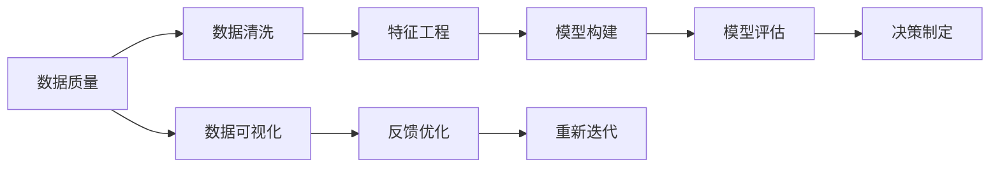

                 

# 批判性思维（critical thinking

> 关键词：批判性思维, 数据分析, 数据科学, 人工智能, 机器学习, 数据处理, 统计学, 决策制定

## 1. 背景介绍

在当今数据驱动的时代，批判性思维（Critical Thinking）成为了分析和解决复杂问题的重要工具。特别是在人工智能和数据科学领域，批判性思维不仅帮助开发者和分析师理解、解释和利用数据，还能够在模型的构建、评估和优化过程中，做出科学合理的决策。

### 1.1 问题由来

在数据科学的实践中，每天都会面临大量数据和复杂问题。如何从这些数据中提取有用的信息，构建有效的模型，并做出合理的决策，是数据科学家的一项重要任务。然而，数据往往具有复杂性、多维性和动态性，容易引发认知偏差和错误判断。此时，批判性思维就显得尤为重要。

批判性思维的核心理念是对问题进行系统、全面、深入的分析和评估，避免简单的表面理解和主观臆断，以提升决策的准确性和可靠性。

### 1.2 问题核心关键点

批判性思维在数据科学中的应用，主要体现在以下几个方面：

1. **问题定义**：清晰明确地定义问题，确定问题的边界和目标。
2. **假设检验**：验证数据的合理性和可靠性，排除潜在的数据偏见和错误。
3. **数据探索**：利用数据分析工具和技术，进行数据清洗、特征工程和可视化。
4. **模型构建**：选择合适的方法和模型，构建并训练模型。
5. **结果评估**：评估模型的性能和泛化能力，验证模型的适用性和可靠性。
6. **决策制定**：基于模型结果，结合业务需求和实际情况，做出合理决策。

通过批判性思维的应用，可以系统地提升数据科学工作的效率和质量，确保数据和模型的科学性和可信度。

### 1.3 问题研究意义

在数据科学领域，批判性思维具有重要意义：

1. **提升数据质量**：批判性思维帮助数据科学家识别和纠正数据中的问题，确保数据的质量和可靠性。
2. **增强模型泛化**：批判性思维促使数据科学家关注模型的泛化能力，避免模型过拟合或欠拟合。
3. **优化决策过程**：批判性思维使数据科学家能够全面、系统地分析问题，做出更加科学合理的决策。
4. **促进知识共享**：批判性思维促进数据科学团队内的知识交流和创新，提升团队整体水平。
5. **保障数据安全**：批判性思维帮助识别数据中的潜在风险和安全隐患，保障数据和模型的安全性。

## 2. 核心概念与联系

### 2.1 核心概念概述

批判性思维在数据科学中的应用，离不开以下几个关键概念：

- **数据质量（Data Quality）**：指数据的准确性、完整性、一致性和时效性。高质量的数据是数据分析和模型构建的基础。
- **特征工程（Feature Engineering）**：指通过对原始数据进行转换和构造，生成更有意义和代表性的特征。
- **模型评估（Model Evaluation）**：指通过各种指标和工具，评估模型的性能和泛化能力。
- **模型选择（Model Selection）**：指在多个模型中，选择最适合特定问题和数据集的模型。
- **数据可视化（Data Visualization）**：指通过图表、图形等方式，直观展示数据特征和分析结果。

这些概念之间存在紧密联系，形成一个完整的数据科学工作流程。通过批判性思维的应用，可以更好地理解、利用和解释这些概念，提升数据科学工作的效率和效果。

### 2.2 核心概念原理和架构的 Mermaid 流程图



这个流程图展示了数据科学工作的基本流程，并通过箭头表示各环节之间的联系。

## 3. 核心算法原理 & 具体操作步骤

### 3.1 算法原理概述

批判性思维在数据科学中的应用，主要涉及以下算法原理：

1. **统计分析**：利用统计学方法，对数据进行描述性分析和推断性分析，帮助发现数据中的模式和趋势。
2. **回归分析**：通过回归模型，探索自变量和因变量之间的关系，进行预测和解释。
3. **聚类分析**：利用聚类算法，将相似的数据点归为一类，进行数据分组和分析。
4. **关联分析**：通过关联规则挖掘，发现数据集中的频繁项集和关联规则，进行知识发现和数据挖掘。
5. **分类和回归**：利用分类和回归模型，进行数据分类和预测，构建分类器和回归器。
6. **时间序列分析**：利用时间序列模型，对时间相关的数据进行分析，进行趋势预测和异常检测。

### 3.2 算法步骤详解

#### 3.2.1 数据质量评估

1. **数据检查**：对数据进行缺失值检查、重复值检查和异常值检查，确保数据的完整性和一致性。
2. **数据清洗**：对缺失值进行填补、去重和修复，确保数据的质量和可靠性。

#### 3.2.2 特征工程设计

1. **特征选择**：选择与目标变量相关的特征，减少特征冗余和噪声。
2. **特征构造**：通过数学转换和统计分析，生成新的特征，提升模型性能。
3. **特征归一化**：对特征进行归一化和标准化，确保特征的尺度和分布一致。

#### 3.2.3 模型构建和训练

1. **模型选择**：根据问题的类型和数据的特征，选择合适的模型，如线性回归、决策树、神经网络等。
2. **模型训练**：使用训练数据集，训练模型，调整模型的超参数，优化模型性能。

#### 3.2.4 模型评估和验证

1. **模型验证**：使用验证数据集，评估模型的性能，避免过拟合。
2. **模型调整**：根据评估结果，调整模型的参数和结构，提升模型的泛化能力。

#### 3.2.5 决策制定和部署

1. **模型部署**：将训练好的模型部署到实际应用中，进行数据预测和决策。
2. **结果评估**：评估模型的实际效果，进行业务验证和优化。

### 3.3 算法优缺点

#### 3.3.1 优点

1. **提升决策准确性**：通过系统全面的分析和评估，确保决策的科学性和可靠性。
2. **减少数据偏差**：批判性思维帮助识别和纠正数据中的偏见和错误，提升数据的质量和可靠性。
3. **优化模型性能**：批判性思维促使数据科学家关注模型的泛化能力，避免模型过拟合或欠拟合。
4. **促进知识共享**：批判性思维促进团队内的知识交流和创新，提升团队整体水平。

#### 3.3.2 缺点

1. **复杂度高**：批判性思维需要系统全面的分析和评估，耗时较长。
2. **依赖经验**：批判性思维需要丰富的经验和知识积累，缺乏经验的分析者容易陷入认知偏差。
3. **模型复杂度**：复杂模型需要更多的数据和计算资源，增加了模型构建和优化的难度。

### 3.4 算法应用领域

批判性思维在数据科学中的应用，广泛涉及以下几个领域：

1. **金融风控**：通过批判性思维，进行风险评估和预测，构建风控模型，防范金融风险。
2. **市场营销**：利用数据分析和模型，进行市场分析和客户细分，制定营销策略。
3. **医疗健康**：通过数据分析和模型，进行疾病预测和诊断，提升医疗服务的质量和效率。
4. **电商推荐**：利用数据分析和模型，进行商品推荐和用户分析，提升用户体验和销售额。
5. **智能交通**：通过数据分析和模型，进行交通流量预测和优化，提升交通管理和安全性。

## 4. 数学模型和公式 & 详细讲解 & 举例说明

### 4.1 数学模型构建

在数据科学中，批判性思维的应用离不开数学模型的构建。以下是一些常用的数学模型及其构建方法：

1. **线性回归模型**：通过线性回归模型，探索自变量和因变量之间的关系，进行预测和解释。数学表达式为：

   $$
   y = \beta_0 + \beta_1 x_1 + \beta_2 x_2 + \cdots + \beta_n x_n + \epsilon
   $$

2. **决策树模型**：利用决策树模型，进行数据分类和预测。数学表达式为：

   $$
   \text{Decision Tree} = \bigvee_{i=1}^{N} \left( \left( \text{Test}_i = true \right) \land \text{SubTree}_i \right)
   $$

3. **支持向量机（SVM）模型**：通过支持向量机模型，进行数据分类和回归。数学表达式为：

   $$
   \min_{w, b} \frac{1}{2} ||w||^2 + C \sum_{i=1}^{N} \text{max}(0, 1 - y_i (w \cdot x_i + b)) 
   $$

### 4.2 公式推导过程

#### 4.2.1 线性回归模型的推导

线性回归模型的基本思想是通过最小二乘法，拟合一条直线，使得模型预测值与实际值之间的误差最小。具体推导如下：

1. **最小二乘法**：

   $$
   \min_{\beta_0, \beta_1, \cdots, \beta_n} \sum_{i=1}^{N} (y_i - (\beta_0 + \beta_1 x_{i1} + \beta_2 x_{i2} + \cdots + \beta_n x_{in}))^2
   $$

2. **求偏导数**：

   $$
   \frac{\partial}{\partial \beta_k} \sum_{i=1}^{N} (y_i - (\beta_0 + \beta_1 x_{i1} + \beta_2 x_{i2} + \cdots + \beta_n x_{in}))^2 = 0
   $$

3. **求解系数**：

   $$
   \beta_k = \frac{\sum_{i=1}^{N} x_{ik} (y_i - \bar{y})}{\sum_{i=1}^{N} x_{ik}^2}
   $$

其中，$\bar{y} = \frac{1}{N} \sum_{i=1}^{N} y_i$。

### 4.3 案例分析与讲解

#### 4.3.1 线性回归模型应用

假设有一组数据 $(x_1, x_2, \cdots, x_n)$ 和 $y$，我们需要构建一个线性回归模型，进行预测和解释。具体步骤如下：

1. **数据准备**：收集和准备数据，进行清洗和处理，确保数据的质量和可靠性。
2. **模型构建**：选择线性回归模型，构建模型，进行训练和验证。
3. **结果评估**：评估模型的性能，进行业务验证和优化。

#### 4.3.2 决策树模型应用

假设有一组数据 $(x_1, x_2, \cdots, x_n)$ 和 $y$，我们需要构建一个决策树模型，进行数据分类和预测。具体步骤如下：

1. **数据准备**：收集和准备数据，进行清洗和处理，确保数据的质量和可靠性。
2. **模型构建**：选择决策树模型，构建模型，进行训练和验证。
3. **结果评估**：评估模型的性能，进行业务验证和优化。

## 5. 项目实践：代码实例和详细解释说明

### 5.1 开发环境搭建

在进行项目实践前，我们需要准备好开发环境。以下是使用Python进行Scikit-learn开发的环境配置流程：

1. 安装Anaconda：从官网下载并安装Anaconda，用于创建独立的Python环境。

2. 创建并激活虚拟环境：
```bash
conda create -n sk-env python=3.7 
conda activate sk-env
```

3. 安装Scikit-learn：
```bash
conda install scikit-learn
```

4. 安装各类工具包：
```bash
pip install numpy pandas matplotlib seaborn jupyter notebook
```

完成上述步骤后，即可在`sk-env`环境中开始项目实践。

### 5.2 源代码详细实现

下面我们以线性回归模型为例，给出使用Scikit-learn进行数据科学实践的Python代码实现。

首先，定义数据和模型：

```python
from sklearn.linear_model import LinearRegression
import numpy as np

# 准备数据
X = np.array([[1, 2], [3, 4], [5, 6], [7, 8]])
y = np.array([3, 7, 11, 15])

# 构建模型
model = LinearRegression()
```

然后，进行模型训练和预测：

```python
# 训练模型
model.fit(X, y)

# 预测新数据
new_X = np.array([[9, 10]])
pred_y = model.predict(new_X)

print(pred_y)
```

最后，评估模型性能：

```python
# 评估模型性能
r2_score = model.score(X, y)
print(f"R^2 Score: {r2_score:.2f}")
```

以上就是使用Scikit-learn进行线性回归模型构建和预测的完整代码实现。可以看到，通过Scikit-learn，构建和训练线性回归模型变得非常简单。

### 5.3 代码解读与分析

让我们再详细解读一下关键代码的实现细节：

**数据准备**：
- `X`和`y`分别为输入特征和目标变量。

**模型构建**：
- 使用`LinearRegression`类构建线性回归模型。

**模型训练**：
- 使用`fit`方法对模型进行训练，传入训练数据和目标变量。

**模型预测**：
- 使用`predict`方法对新数据进行预测，传入测试数据。

**模型评估**：
- 使用`score`方法计算模型的R^2分数，评估模型的性能。

**R^2分数**：
- R^2分数（R-squared score）是衡量模型拟合优度的一种指标，值越接近1表示模型拟合效果越好。

## 6. 实际应用场景

### 6.1 金融风控

在金融领域，风险评估和预测是核心任务之一。通过批判性思维的应用，可以构建有效的风险评估模型，预测违约风险、信用风险等，防范金融风险。

具体而言，可以收集金融领域的客户数据、交易记录、信用历史等信息，进行数据清洗和特征工程。通过构建线性回归、决策树、支持向量机等模型，进行风险评估和预测。利用评估结果，制定风险控制策略，防范金融风险。

### 6.2 市场营销

在市场营销中，客户细分和个性化推荐是关键任务之一。通过批判性思维的应用，可以构建有效的客户细分和推荐模型，提升市场营销效果。

具体而言，可以收集市场营销数据，如客户行为、购买记录、社交媒体互动等信息，进行数据清洗和特征工程。通过构建聚类分析、关联规则挖掘、分类和回归等模型，进行客户细分和个性化推荐。利用推荐结果，提升市场营销效果。

### 6.3 医疗健康

在医疗健康领域，疾病预测和诊断是核心任务之一。通过批判性思维的应用，可以构建有效的疾病预测和诊断模型，提升医疗服务的质量和效率。

具体而言，可以收集医疗领域的患者数据、病历记录、实验室检查等信息，进行数据清洗和特征工程。通过构建分类和回归模型，进行疾病预测和诊断。利用预测结果，制定治疗方案，提升医疗服务的质量和效率。

### 6.4 未来应用展望

随着大数据和人工智能技术的不断进步，批判性思维在数据科学中的应用将变得更加广泛和深入。未来，批判性思维将在以下几个方面发挥重要作用：

1. **多模态数据融合**：未来的大数据将涉及多种数据类型，包括文本、图像、视频、声音等。批判性思维将帮助融合不同模态的数据，进行更全面和深入的分析。
2. **自动化决策支持**：通过构建自动化决策系统，利用大数据和人工智能技术，进行智能决策和预测。批判性思维将帮助设计更科学合理的决策支持系统，提升决策的准确性和可靠性。
3. **隐私保护和安全**：随着数据量的不断增加，数据隐私和安全问题也愈发重要。批判性思维将帮助设计和实现更安全、隐私保护的决策系统，保障数据的安全和隐私。

## 7. 工具和资源推荐

### 7.1 学习资源推荐

为了帮助开发者系统掌握批判性思维的理论基础和实践技巧，这里推荐一些优质的学习资源：

1. **《批判性思维导论》**：由世界著名的批判性思维专家撰写，详细介绍了批判性思维的基本概念和实践方法。
2. **《数据分析实战》**：通过大量案例，讲解数据分析和模型构建的实践技巧，帮助读者掌握数据分析的基本方法。
3. **《机器学习实战》**：讲解机器学习的基本原理和实践技巧，帮助读者理解和应用各种机器学习算法。
4. **《Python数据科学手册》**：详细介绍了Python数据科学库，包括Numpy、Pandas、Scikit-learn等，帮助读者掌握数据科学的基本技能。
5. **Coursera《批判性思维》课程**：由斯坦福大学开设的在线课程，讲解批判性思维的基本概念和实践方法。

通过对这些资源的学习实践，相信你一定能够快速掌握批判性思维的理论基础和实践技巧，并在数据科学工作中得心应手。

### 7.2 开发工具推荐

高效的开发离不开优秀的工具支持。以下是几款用于数据科学开发的常用工具：

1. **Jupyter Notebook**：一个交互式的数据科学开发环境，支持Python、R、SQL等语言，方便代码调试和结果展示。
2. **PyCharm**：一个强大的Python IDE，支持代码编写、调试、测试、部署等全过程开发。
3. **RStudio**：一个R语言的IDE，支持R语言的开发、调试和分析。
4. **Tableau**：一个强大的数据可视化工具，支持数据的交互式可视化。
5. **Git**：一个版本控制系统，方便团队协作和代码管理。

合理利用这些工具，可以显著提升数据科学开发效率，加速创新迭代的步伐。

### 7.3 相关论文推荐

批判性思维在数据科学中的应用，源于学界的持续研究。以下是几篇奠基性的相关论文，推荐阅读：

1. **《批判性思维在数据分析中的应用》**：探讨了批判性思维在数据分析中的作用，提出了一套系统的方法和工具。
2. **《基于机器学习的批判性思维模型》**：利用机器学习技术，构建了一套批判性思维的自动化评估系统。
3. **《大数据中的批判性思维》**：探讨了大数据中的批判性思维方法，提出了一套系统的方法和工具。
4. **《数据分析中的因果推断》**：利用因果推断方法，评估数据分析的因果关系，提升数据分析的科学性和可靠性。

这些论文代表了大数据和人工智能领域的研究方向，通过学习这些前沿成果，可以帮助研究者把握学科前进方向，激发更多的创新灵感。

## 8. 总结：未来发展趋势与挑战

### 8.1 总结

本文对批判性思维在数据科学中的应用进行了全面系统的介绍。首先阐述了批判性思维的背景和意义，明确了批判性思维在数据科学工作中的重要性和应用方向。其次，从原理到实践，详细讲解了批判性思维的基本概念和操作步骤，给出了数据科学实践的完整代码实例。同时，本文还广泛探讨了批判性思维在金融风控、市场营销、医疗健康等多个行业领域的应用前景，展示了批判性思维的广泛价值。

通过本文的系统梳理，可以看到，批判性思维在数据科学中具有重要的地位和作用，能够系统全面地分析问题，提升数据科学工作的效率和效果。未来，随着大数据和人工智能技术的不断发展，批判性思维将在更多领域得到应用，为数据科学带来更大的创新空间和应用潜力。

### 8.2 未来发展趋势

展望未来，批判性思维在数据科学中的应用将呈现以下几个发展趋势：

1. **自动化和智能化**：未来的大数据和人工智能技术将越来越自动化和智能化，批判性思维也将实现更高效的自动化分析。
2. **跨学科融合**：批判性思维将与大数据、人工智能、统计学等学科进行深度融合，形成更全面和深入的分析和应用。
3. **实时化和大数据化**：未来的大数据和人工智能技术将更加实时化和数据化，批判性思维将帮助设计更高效的实时分析和数据处理系统。
4. **隐私保护和安全**：随着数据量的不断增加，数据隐私和安全问题也愈发重要，批判性思维将帮助设计和实现更安全、隐私保护的决策系统。
5. **可持续发展**：未来的大数据和人工智能技术将更加注重可持续发展，批判性思维将帮助设计和实现更环保、可持续的分析和应用系统。

### 8.3 面临的挑战

尽管批判性思维在数据科学中的应用已经取得了一定的成果，但在迈向更加智能化、自动化、实时化和安全化的应用过程中，它仍面临诸多挑战：

1. **数据质量问题**：数据质量一直是数据科学的核心问题，批判性思维需要具备识别和处理数据问题的能力。
2. **模型复杂性**：随着数据量的不断增加和模型复杂度的提升，批判性思维需要具备更高的数据分析和模型评估能力。
3. **业务需求变化**：业务需求和应用场景不断变化，批判性思维需要具备快速适应和灵活应用的能力。
4. **伦理和法律问题**：随着数据科学应用的不断扩展，伦理和法律问题也愈发重要，批判性思维需要具备合规性和责任感的意识。

### 8.4 研究展望

面对批判性思维在数据科学应用中的挑战，未来的研究需要在以下几个方面寻求新的突破：

1. **自动化分析工具**：开发更自动化、智能化的数据分析工具，提升批判性思维的效率和准确性。
2. **多学科融合方法**：将大数据、人工智能、统计学等学科进行深度融合，形成更全面和深入的分析和应用方法。
3. **实时化和大数据化方法**：设计更高效、实时化的数据分析系统，提升数据分析的效率和效果。
4. **隐私保护和安全方法**：设计更安全、隐私保护的决策系统，保障数据的安全和隐私。
5. **可持续发展方法**：设计和实现更环保、可持续的分析和应用系统，推动数据科学的可持续发展。

这些研究方向的探索，必将引领批判性思维在数据科学中的应用走向更高的台阶，为数据科学带来更大的创新空间和应用潜力。

## 9. 附录：常见问题与解答

**Q1：什么是批判性思维？**

A: 批判性思维是指通过系统全面的分析和评估，识别、分析和解决问题的能力。它不仅包括逻辑推理、数据分析，还包括批判性评估、创造性思考和问题解决。

**Q2：批判性思维在数据科学中有什么作用？**

A: 批判性思维在数据科学中具有重要作用，能够提升数据质量和模型性能，优化决策过程，确保数据的科学性和可靠性。

**Q3：如何提升批判性思维能力？**

A: 提升批判性思维能力的方法包括：系统学习批判性思维的理论和方法，进行大量的数据分析和问题解决实践，多学科交叉学习，不断反思和总结。

**Q4：批判性思维在数据科学中的应用有什么挑战？**

A: 批判性思维在数据科学中的应用面临数据质量、模型复杂性、业务需求变化、伦理和法律问题等挑战，需要不断创新和优化。

**Q5：未来批判性思维在数据科学中的应用方向是什么？**

A: 未来批判性思维在数据科学中的应用将更加自动化、智能化、实时化、安全化、可持续发展化，推动数据科学技术的不断进步。

---

作者：禅与计算机程序设计艺术 / Zen and the Art of Computer Programming

