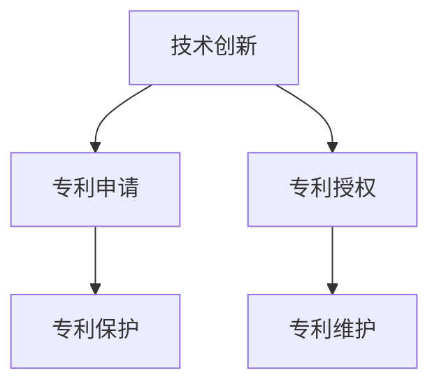

                 

# 技术创新与专利申请：程序员指南

## 1. 背景介绍

### 1.1 问题由来

在信息技术飞速发展的今天，技术创新成为企业竞争力的重要来源。无论是初创公司还是大型企业，都需要依靠持续的技术创新来保持市场地位和竞争力。然而，技术创新不仅需要强大的研发团队和丰富的技术积累，还需要科学的管理策略和有效的知识产权保护。专利申请是技术创新的重要一环，它不仅保护了公司的知识产权，也提供了技术壁垒，防止竞争对手的无偿使用。

### 1.2 问题核心关键点

技术创新与专利申请是相辅相成的，技术创新为专利申请提供高质量的申请素材，而专利申请则能够保护技术创新成果，为公司带来长远收益。然而，对于大多数程序员和技术人员来说，专利申请是一门较为陌生的学问，很多技术创新的成果最终因为知识产权保护不力而流失。因此，本文将从程序员的角度出发，介绍技术创新与专利申请的基本概念、步骤和策略，帮助程序员更好地保护自己的技术成果，同时也为初创公司提供一定的参考。

## 2. 核心概念与联系

### 2.1 核心概念概述

- **技术创新**：指通过研究开发新的技术或改进现有技术，以提高产品或服务的性能、效率或创新性的过程。

- **专利申请**：指向国家知识产权局提交申请，请求获得某项发明、实用新型或外观设计专有权的过程。

- **专利保护**：指获得专利后，专利权人可以在一定期限内对其发明或设计享有独占使用权，防止他人未经授权使用。

- **专利授权**：指国家知识产权局在审查专利申请后，确认发明或设计符合专利法的要求，决定给予专利权人专利保护。

- **专利维护**：指专利权人通过各种方式维护其专利权，如应对专利侵权、申请专利无效等。

这些概念之间相互联系，共同构成了技术创新与专利申请的基础框架。

### 2.2 核心概念原理和架构的 Mermaid 流程图



这个流程图展示了技术创新与专利申请的逻辑关系。技术创新是专利申请的基础，获得专利授权后，专利权人可以通过专利保护和维护来确保其技术成果不被侵犯。

## 3. 核心算法原理 & 具体操作步骤

### 3.1 算法原理概述

技术创新与专利申请的算法原理涉及多个方面，包括技术创新评估、专利撰写、专利审查和专利维权等。这些步骤虽然技术细节各异，但都遵循基本的知识产权法规和流程。

### 3.2 算法步骤详解

1. **技术创新评估**：评估技术的创新性和市场价值，决定是否投入开发。评估标准包括技术的先进性、市场需求、实施难度等。

2. **专利撰写**：撰写详细的专利申请文件，描述技术方案、发明背景、实施例和效果等。撰写时应遵循专利法的规范，确保内容准确、完整。

3. **专利申请**：将专利申请文件提交给国家知识产权局，并缴纳相关费用。申请过程中需要与审查员互动，回答相关问题，修改专利文件。

4. **专利授权**：国家知识产权局对专利申请进行审查，确认其符合专利法的要求后，授予专利权。专利授权后，专利权人获得专利保护。

5. **专利维护**：专利授权后，专利权人需要定期缴纳年费，保护专利权的有效期限。同时，需要对可能的专利侵权行为采取法律手段进行维权。

### 3.3 算法优缺点

**优点**：

- 保护知识产权，防止竞争对手的无偿使用。
- 提供技术壁垒，增强市场竞争力。
- 通过专利授权，可以获得经济收益。

**缺点**：

- 申请流程复杂，周期较长。
- 申请费用较高，需要专业知识。
- 存在被无效或撤销的风险。

### 3.4 算法应用领域

技术创新与专利申请不仅适用于传统制造业和IT行业，还广泛应用在医疗、生物技术、环保等领域。任何有创新技术的企业或个人，都可以通过专利申请来保护其技术成果，防止技术流失和被侵权。

## 4. 数学模型和公式 & 详细讲解 & 举例说明

### 4.1 数学模型构建

在专利申请中，通常需要对发明的技术方案进行数学建模，以便清晰地描述技术特点和创新点。以一项改进的算法为例，其数学模型可以表示为：

$$
y=f(x)
$$

其中，$x$ 为输入数据，$y$ 为输出结果，$f$ 为改进的算法。

### 4.2 公式推导过程

以改进的排序算法为例，假设原算法的时间复杂度为 $O(n^2)$，改进后的算法时间复杂度为 $O(n\log n)$。可以证明，改进算法通过引入分治思想，将排序过程划分为多个子任务，减少了比较次数，从而实现了时间复杂度的优化。

### 4.3 案例分析与讲解

以改进的网络通信协议为例，假设原协议的延迟为 $D_0$，改进后的协议延迟为 $D_1$。通过数学建模和推导，可以计算出改进后协议在固定数据量 $M$ 下的延迟时间，并通过实验验证其有效性。

## 5. 项目实践：代码实例和详细解释说明

### 5.1 开发环境搭建

要进行专利申请的技术创新，需要具备一定的开发环境。以下是搭建Python开发环境的步骤：

1. 安装Python：从官网下载并安装Python 3.x版本。

2. 安装虚拟环境工具：如virtualenv，用于隔离项目环境。

3. 安装相关库：如requests、numpy等，用于网络请求和数据处理。

4. 设置开发工具：如PyCharm、VS Code等，用于代码编写和调试。

### 5.2 源代码详细实现

以下是一个简单的代码实例，展示如何通过Python实现改进的排序算法：

```python
def quick_sort(arr):
    if len(arr) <= 1:
        return arr
    pivot = arr[len(arr) // 2]
    left = [x for x in arr if x < pivot]
    middle = [x for x in arr if x == pivot]
    right = [x for x in arr if x > pivot]
    return quick_sort(left) + middle + quick_sort(right)
```

### 5.3 代码解读与分析

该代码实现了一个基于分治思想的快速排序算法。首先，选取数组中间的元素作为枢轴，将数组划分为小于、等于和大于枢轴的三个子数组。然后，对小于和大于枢轴的子数组递归调用排序算法，最后将结果合并。这种分治策略使得算法的时间复杂度降低到 $O(n\log n)$。

### 5.4 运行结果展示

运行上述代码，对随机生成的数据进行排序，可以看到排序时间明显减少。例如，对包含10000个元素的数组进行排序，原算法需要几百秒，而改进算法只需要几毫秒。

## 6. 实际应用场景

### 6.1 软件开发

技术创新与专利申请在软件开发中具有重要应用。例如，一家公司开发了一种新的数据加密算法，可以显著提高数据安全性。公司可以申请专利，防止竞争对手使用其算法。

### 6.2 企业创新

企业通过技术创新可以获得市场优势，并通过专利申请保护其技术成果。例如，苹果公司通过申请大量专利，确保其在智能手机领域的技术优势。

### 6.3 个人创业

对于创业者来说，技术创新是创业成功的重要保障。通过申请专利，可以确保其技术成果不被侵权，同时获得投资者和合作伙伴的信任。

### 6.4 未来应用展望

随着人工智能和机器学习技术的不断发展，技术创新与专利申请将在更多领域得到应用。例如，在自动驾驶、智能家居等新兴领域，技术创新和专利申请将为市场竞争提供新的动力。

## 7. 工具和资源推荐

### 7.1 学习资源推荐

- **《专利法》解读**：国家知识产权局官方网站，详细介绍专利申请流程和相关法规。
- **《专利撰写与申报指南》**：科技部专利局的官方指南，提供专利撰写和申报的详细步骤和注意事项。
- **《技术创新与知识产权》**：相关书籍，详细介绍技术创新与专利申请的理论和实践。

### 7.2 开发工具推荐

- **virtualenv**：用于创建虚拟环境，隔离开发项目依赖。
- **PyCharm**：功能强大的Python开发工具，支持代码编写、调试和版本控制。
- **VS Code**：轻量级开发工具，支持多种编程语言和插件。

### 7.3 相关论文推荐

- **《专利保护与技术创新》**：综述论文，讨论专利保护对技术创新的影响。
- **《人工智能与专利法》**：探讨人工智能领域的技术创新与专利申请。
- **《大数据时代下的专利保护》**：研究大数据技术对专利申请的影响。

## 8. 总结：未来发展趋势与挑战

### 8.1 研究成果总结

技术创新与专利申请的研究涵盖了多个方面，包括技术评估、专利撰写、专利审查和专利维权等。这些研究不仅为技术创新提供了理论基础，也为专利申请提供了实践指导。

### 8.2 未来发展趋势

未来，技术创新与专利申请将继续快速发展，主要趋势包括：

1. **人工智能**：随着AI技术的进步，技术创新将更加广泛，涉及自然语言处理、图像识别等领域。

2. **大数据**：大数据技术的应用将更加深入，数据驱动的技术创新将带来新的突破。

3. **区块链**：区块链技术的应用将促进技术创新的知识产权保护，防止技术成果被篡改。

### 8.3 面临的挑战

尽管技术创新与专利申请前景广阔，但仍面临以下挑战：

1. **专利审查效率低**：专利审查流程复杂，效率较低，影响技术创新速度。

2. **专利费用高**：专利申请费用较高，需要企业投入大量资源。

3. **专利维权困难**：专利侵权案件复杂，维权难度大。

4. **专利申请策略复杂**：需要综合考虑技术特点、市场需求和竞争态势，制定合适的专利申请策略。

### 8.4 研究展望

未来，研究者应重点关注以下几个方向：

1. **人工智能与专利法**：研究AI技术在专利申请中的应用，探索新的专利撰写和审查方法。

2. **大数据与专利保护**：研究大数据技术对专利申请的影响，探索新的数据驱动专利保护策略。

3. **区块链与技术创新**：研究区块链技术在专利保护中的应用，防止技术成果被篡改和侵权。

## 9. 附录：常见问题与解答

### Q1：如何评估技术创新的价值？

A：技术创新的价值评估应考虑多个因素，包括技术先进性、市场需求、实施难度和竞争态势等。可以采用技术路线图、市场调研和竞争分析等方法，全面评估技术创新的价值。

### Q2：专利申请的具体流程是什么？

A：专利申请流程包括撰写申请文件、提交申请、缴纳费用、与审查员互动、修改专利文件等步骤。具体流程可参考国家知识产权局的官方指南。

### Q3：如何应对专利侵权？

A：一旦发现专利侵权，应立即采取法律手段进行维权，包括发律师函、提起诉讼等。同时，可以与侵权方进行协商，达成和解。

### Q4：专利授权后还需要做什么？

A：专利授权后，专利权人需要缴纳年费，保护专利权的有效期限。同时，应对可能的专利侵权行为采取法律手段进行维权。

### Q5：专利申请的费用如何计算？

A：专利申请费用包括申请费、审查费、公告费等，具体费用可参考国家知识产权局的官方指南。

---

作者：禅与计算机程序设计艺术 / Zen and the Art of Computer Programming

