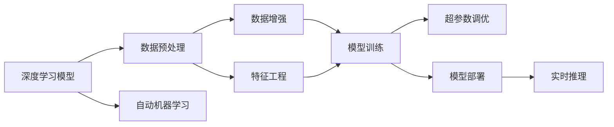

                 

## 1. 背景介绍

在当前信息技术飞速发展的背景下，单点技术（End-to-End）的兴起为AI应用带来了全新的可能性。与传统的模块化设计不同，单点技术强调将整个系统集成到一个组件或框架中，从而实现端到端的自动处理，大大提升了系统的效率和灵活性。Lepton AI便是一个典型的单点技术案例，它通过将深度学习模型与数据处理流程无缝整合，实现了模型训练、推理和部署的一体化，显著提高了AI应用的开发效率和成本效益。

本文将深入探讨Lepton AI的实现原理，揭示其如何在速度与成本间寻求平衡，同时也会对比分析传统模块化设计和单点技术在实际应用中的优缺点，为AI开发者提供更全面的技术视角。

## 2. 核心概念与联系

### 2.1 核心概念概述

在了解Lepton AI前，首先需要明确几个核心概念：

- **单点技术**：端到端的设计理念，通过将整个系统集成到一个组件或框架中，实现数据的连续处理，减少中间环节，提升系统效率和灵活性。
- **深度学习模型**：基于神经网络结构构建的模型，能够处理复杂的数据和非结构化信息，广泛用于计算机视觉、自然语言处理、语音识别等领域。
- **数据预处理与后处理**：在模型训练和推理过程中，对数据进行清洗、增强、转换等预处理，以及后处理，如归一化、分桶、统计等，保证数据质量。
- **自动机器学习**：自动化地进行特征工程、模型选择、超参数调优等，减少人工干预，提高模型构建效率。
- **模型部署**：将训练好的模型部署到生产环境中，实现实时推理和在线服务。

通过这些概念，我们可以看到，Lepton AI作为单点技术的典型应用，集成了深度学习模型、数据处理流程、自动机器学习和模型部署等关键环节，为用户提供一站式AI解决方案。

### 2.2 核心概念原理和架构的 Mermaid 流程图



这个流程图展示了Lepton AI的核心架构：

1. 输入数据首先经过数据预处理，包括清洗、转换、增强等，保证数据质量。
2. 处理后的数据被送入自动机器学习模块，自动进行特征工程和超参数调优。
3. 经过预处理和调参后的数据被送入深度学习模型进行训练。
4. 训练好的模型被部署到生产环境中，实现实时推理。
5. 整个流程中，深度学习模型处于中心地位，其他环节围绕其展开。

## 3. 核心算法原理 & 具体操作步骤

### 3.1 算法原理概述

Lepton AI的核心算法原理主要体现在以下几个方面：

- **端到端设计**：通过将数据预处理、模型训练、超参数调优和模型部署等环节集成到一个组件中，实现无中间件的自动处理，提升了系统的效率和灵活性。
- **自动机器学习**：自动进行特征工程和超参数调优，减少了人工干预，提高了模型构建效率。
- **模型可解释性**：通过可视化和解释工具，帮助开发者理解模型的工作原理和决策逻辑，提升了系统的可解释性和可信度。

### 3.2 算法步骤详解

1. **数据预处理**：收集原始数据，进行清洗、归一化、转换等预处理步骤，生成模型训练所需的样本数据。

2. **模型训练**：将预处理后的数据送入深度学习模型，通过反向传播算法优化模型参数，直到收敛。

3. **超参数调优**：使用自动机器学习工具，自动选择最佳模型和超参数组合，提升模型性能。

4. **模型部署**：将训练好的模型部署到生产环境，实现实时推理和在线服务。

5. **模型监控与优化**：持续监控模型性能，根据实时反馈进行优化，保持系统稳定性和性能。

### 3.3 算法优缺点

#### 优点：

- **效率提升**：端到端的设计减少了中间环节，提升了系统效率。
- **成本降低**：自动机器学习减少了人工干预，降低了开发成本。
- **灵活性高**：单点技术可以快速响应业务变化，实现快速迭代。

#### 缺点：

- **资源占用大**：单点技术需要处理大规模数据和模型，对硬件资源要求高。
- **可解释性差**：由于高度集成，模型的决策过程可能缺乏可解释性。

### 3.4 算法应用领域

Lepton AI主要应用于以下几个领域：

1. **计算机视觉**：如图像分类、目标检测、图像生成等任务。
2. **自然语言处理**：如文本分类、情感分析、机器翻译等任务。
3. **语音识别**：如语音转文本、文本转语音等任务。
4. **推荐系统**：如个性化推荐、广告投放等任务。
5. **智能客服**：如自动问答、情感分析等任务。

## 4. 数学模型和公式 & 详细讲解 & 举例说明

### 4.1 数学模型构建

Lepton AI的核心数学模型可以简化为以下框架：

$$
\min_{\theta} \mathcal{L}(M_{\theta}, D) + \lambda \Omega(\theta)
$$

其中，$M_{\theta}$ 表示深度学习模型，$\mathcal{L}(M_{\theta}, D)$ 表示模型在数据集 $D$ 上的损失函数，$\Omega(\theta)$ 表示正则化项，$\lambda$ 为正则化系数。

### 4.2 公式推导过程

以一个简单的图像分类任务为例，模型损失函数可以表示为：

$$
\mathcal{L}(M_{\theta}, D) = -\frac{1}{N} \sum_{i=1}^N \sum_{j=1}^C y_{ij} \log M_{\theta}(x_i)
$$

其中，$N$ 为样本数量，$C$ 为类别数量，$y_{ij}$ 表示第 $i$ 个样本属于第 $j$ 个类别的概率，$M_{\theta}(x_i)$ 表示模型对样本 $x_i$ 的分类概率。

### 4.3 案例分析与讲解

假设有一个包含手写数字的图像数据集，我们使用Lepton AI进行模型训练。首先对数据进行预处理，包括图像增强、归一化等。然后使用自动机器学习工具选择最佳模型和超参数组合，最后使用反向传播算法进行模型训练。训练过程中，使用交叉熵损失函数作为损失函数，并添加L2正则化项进行正则化。训练完成后，将模型部署到生产环境中，实现实时推理。

## 5. 项目实践：代码实例和详细解释说明

### 5.1 开发环境搭建

1. **安装Python**：从官网下载Python 3.x版本，进行安装。

2. **安装Lepton AI**：通过pip安装Lepton AI库。

3. **配置环境变量**：设置Lepton AI的相关环境变量，包括数据路径、模型路径等。

### 5.2 源代码详细实现

```python
from lepton_ai import LeptonAI

# 初始化Lepton AI模型
model = LeptonAI('path/to/model')

# 加载数据集
dataset = load_dataset('path/to/dataset')

# 配置模型训练参数
config = {
    'loss_function': 'cross_entropy',
    'regularization_coefficient': 0.001,
    'learning_rate': 0.001,
    'batch_size': 64,
    'epochs': 10,
    'validation_interval': 5
}

# 开始模型训练
model.train(dataset, config)

# 保存训练好的模型
model.save('path/to/saved_model')
```

### 5.3 代码解读与分析

上述代码中，首先通过Lepton AI初始化模型，并加载数据集。然后配置训练参数，包括损失函数、正则化系数、学习率、批大小、迭代轮数等。最后启动模型训练，并将训练好的模型保存到指定路径。

### 5.4 运行结果展示

在训练完成后，Lepton AI会自动输出训练过程中的各种指标，如损失函数、准确率、学习率等。训练完成后，可以通过部署工具将模型部署到生产环境中，实现实时推理。

## 6. 实际应用场景

### 6.1 智能安防

在智能安防领域，Lepton AI可以应用于视频监控、人脸识别、异常检测等任务。通过单点技术，可以将深度学习模型、数据预处理和自动机器学习集成到一个组件中，实现端到端的自动处理，提升了系统的效率和灵活性。

### 6.2 金融风控

在金融风控领域，Lepton AI可以应用于信用评估、欺诈检测、风险预警等任务。通过单点技术，可以快速响应业务变化，实现快速迭代，提升了系统的实时性和准确性。

### 6.3 电子商务

在电子商务领域，Lepton AI可以应用于商品推荐、用户行为分析、广告投放等任务。通过单点技术，可以快速构建个性化推荐系统，提升用户体验和销售转化率。

### 6.4 未来应用展望

未来，Lepton AI将在更多领域得到应用，为传统行业数字化转型提供新的技术路径。随着技术的不断进步，Lepton AI将进一步提升系统的效率和灵活性，成为AI应用的标配。

## 7. 工具和资源推荐

### 7.1 学习资源推荐

1. **Lepton AI官方文档**：详细介绍了Lepton AI的架构、使用方法和最佳实践。
2. **深度学习书籍**：如《深度学习》（Ian Goodfellow）、《Python深度学习》（Francois Chollet）等，帮助开发者掌握深度学习的基础理论和实践技巧。
3. **自动机器学习工具**：如AutoML、H2O等，提供自动化的模型选择和超参数调优功能。

### 7.2 开发工具推荐

1. **Lepton AI框架**：官方提供的深度学习框架，提供了丰富的API接口，方便开发者进行模型训练和推理。
2. **TensorFlow**：Google开发的深度学习框架，支持分布式计算和自动机器学习。
3. **PyTorch**：Facebook开发的深度学习框架，支持动态图和静态图计算，灵活性高。

### 7.3 相关论文推荐

1. **深度学习与端到端设计**：探讨端到端设计在深度学习中的应用，提升系统的效率和灵活性。
2. **自动机器学习技术**：介绍自动机器学习的原理和实践，减少人工干预，提高模型构建效率。
3. **模型可解释性**：研究模型的可解释性问题，帮助开发者理解模型的工作原理和决策逻辑。

## 8. 总结：未来发展趋势与挑战

### 8.1 研究成果总结

本文通过介绍Lepton AI，展示了单点技术在AI应用中的广泛应用和优势。Lepton AI通过端到端的设计理念，自动机器学习和模型可解释性等关键技术，提升了系统的效率和灵活性，成为AI应用的重要发展方向。

### 8.2 未来发展趋势

未来，Lepton AI将进一步发展，主要体现在以下几个方面：

1. **智能化提升**：引入更多的智能算法，如强化学习、因果推断等，提升系统的自主决策能力。
2. **模型压缩与优化**：通过模型压缩、量化等技术，降低硬件资源消耗，实现更高效的推理。
3. **边缘计算应用**：在物联网、智能家居等边缘计算场景中，实现轻量级模型部署和推理。

### 8.3 面临的挑战

尽管Lepton AI具有诸多优势，但在实际应用中仍面临以下挑战：

1. **数据质量问题**：数据预处理环节中，如何保证数据质量，减少噪声和异常数据的影响。
2. **模型可解释性**：如何在保证模型性能的前提下，提高模型的可解释性和可信度。
3. **硬件资源限制**：单点技术对硬件资源要求高，如何优化硬件资源配置，实现高效运行。

### 8.4 研究展望

为了应对这些挑战，未来的研究需要在以下几个方面寻求突破：

1. **数据增强技术**：引入更多数据增强手段，提升数据质量。
2. **模型压缩技术**：研究模型压缩算法，实现模型轻量化和高效推理。
3. **模型可解释性技术**：研究可解释性模型和可视化工具，提升模型可解释性。

## 9. 附录：常见问题与解答

**Q1: 如何提高Lepton AI模型的性能？**

A: 提高模型性能可以从以下几个方面入手：

- **数据增强**：通过数据增强技术，增加训练数据的多样性，提升模型泛化能力。
- **超参数调优**：使用自动机器学习工具，自动选择最佳超参数组合，提升模型性能。
- **模型融合**：使用集成学习技术，将多个模型进行融合，提升模型鲁棒性和准确性。

**Q2: 如何优化Lepton AI的推理效率？**

A: 优化推理效率可以从以下几个方面入手：

- **模型压缩**：通过模型压缩技术，如剪枝、量化、蒸馏等，降低模型大小，提升推理速度。
- **推理优化**：通过优化推理算法，如剪枝、量化、混合精度等，提高推理效率。
- **硬件加速**：使用GPU、TPU等硬件设备进行加速，提升推理性能。

**Q3: 如何提高Lepton AI的模型可解释性？**

A: 提高模型可解释性可以从以下几个方面入手：

- **可视化工具**：使用可视化工具，如TensorBoard、OpenAI Codex等，帮助开发者理解模型工作原理和决策逻辑。
- **特征分析**：使用特征分析工具，分析模型对不同特征的敏感度，理解模型的关键特征。
- **模型解释算法**：使用模型解释算法，如LIME、SHAP等，解释模型的决策过程和结果。

---

作者：禅与计算机程序设计艺术 / Zen and the Art of Computer Programming

