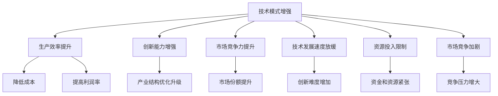

                 

# 技术模式减弱的经济影响

在当前数字化转型不断加速的背景下，技术模式的演变对于经济增长、产业结构调整以及企业竞争力的影响愈发显著。然而，技术模式的持续增强与迭代往往伴随着成本的增加和收益的不确定性。本文将探讨技术模式减弱的经济影响，分析其成因及应对策略，以期为业界提供参考。

## 1. 背景介绍

### 1.1 技术模式与经济发展

技术模式指的是企业在特定时期内采用的技术架构、实施方式和运作机制的总和。它不仅包括硬技术（如硬件、软件和网络架构），还涵盖软技术（如管理模式、运营流程和文化价值观）。技术模式的有效应用能够推动企业实现效率提升、成本降低和创新加速，从而对经济增长产生积极影响。

过去几十年，技术模式不断增强，从以机械化、自动化为主的第一代信息化，到以网络化、智能化为主的第二代信息化，再到以智能化、个性化为主的新一代信息化。每一次技术模式的提升，都伴随着生产力的跨越式发展，并带动了新的经济增长点。

### 1.2 技术模式增强的局限性

尽管技术模式的增强带来了显著的经济效益，但随着技术的不断演进，其局限性也逐渐显现。主要表现为成本上升、创新难度增加、市场竞争加剧等问题。这些问题不仅影响了企业自身的盈利能力，也对宏观经济环境产生了负面影响。因此，探讨技术模式减弱的经济影响，并制定相应的应对策略，对于推动经济可持续发展具有重要意义。

## 2. 核心概念与联系

### 2.1 技术模式增强

技术模式增强主要体现在以下几个方面：

- **硬技术提升**：硬件设备性能提升、软件功能完善、网络速度和覆盖范围扩大等。
- **软技术优化**：管理效率提升、运营流程简化、企业文化建设等。

这些提升通常需要大量的资金投入，包括研发费用、基础设施建设费用、人员培训费用等。

### 2.2 技术模式增强的经济影响

技术模式增强对经济的影响主要体现在以下几个方面：

- **生产效率提升**：技术模式增强使得生产效率大幅提升，降低成本，提高利润率。
- **创新能力增强**：新的技术模式催生了新的产品和服务，推动了产业结构优化升级。
- **市场竞争力提升**：技术模式增强使得企业能够更好地应对市场变化，提升市场份额。

### 2.3 技术模式减弱的成因

技术模式减弱的成因主要包括以下几个方面：

- **技术发展速度放缓**：创新难度增加，技术更新换代周期变长，导致技术模式难以持续增强。
- **资源投入限制**：技术模式增强需要大量的资金和资源投入，当企业资源有限时，难以继续大规模投入。
- **市场竞争加剧**：随着技术的普及，市场竞争愈发激烈，企业需要在有限的资源下进行更精准的投资决策。

### 2.4 Mermaid 流程图（核心概念原理和架构）



## 3. 核心算法原理 & 具体操作步骤

### 3.1 算法原理概述

技术模式减弱的经济影响主要体现在以下几个方面：

- **生产效率下降**：由于技术模式难以持续增强，生产效率下降，成本上升。
- **创新能力下降**：创新难度增加，新产品和服务的开发周期延长，市场竞争力下降。
- **市场竞争激烈**：市场竞争加剧，企业需要在有限的资源下进行更精准的投资决策。

### 3.2 算法步骤详解

技术模式减弱的经济影响分析主要分为以下几个步骤：

1. **数据收集与处理**：收集企业的技术模式数据、经济数据等，包括技术投入、生产效率、利润率、创新能力、市场份额等。
2. **模型构建与训练**：基于收集到的数据，构建经济影响模型，使用回归分析、时间序列分析等方法进行分析。
3. **结果解读与对策制定**：根据模型分析结果，解读技术模式减弱的经济影响，并制定相应的应对策略。

### 3.3 算法优缺点

技术模式减弱的经济影响分析算法主要具有以下优缺点：

**优点**：

- **量化分析**：通过构建经济影响模型，可以量化技术模式减弱的经济影响，帮助企业制定决策。
- **客观分析**：模型分析结果基于大量数据，具有较高的客观性。

**缺点**：

- **数据依赖性**：模型的准确性高度依赖于数据的完整性和准确性。
- **复杂性**：模型构建和训练较为复杂，需要专业的知识和工具。

### 3.4 算法应用领域

技术模式减弱的经济影响分析可以应用于以下几个领域：

- **企业经济影响分析**：帮助企业理解技术模式减弱的经济影响，制定相应的应对策略。
- **宏观经济分析**：通过分析技术模式增强对宏观经济的影响，为政策制定提供参考。
- **行业发展趋势预测**：分析技术模式增强和减弱的趋势，预测行业未来的发展方向。

## 4. 数学模型和公式 & 详细讲解 & 举例说明

### 4.1 数学模型构建

假设企业的技术模式增强程度为 $X$，生产效率为 $Y$，创新能力为 $Z$，市场竞争力为 $W$，则有：

$$
Y = f(X) \\
Z = g(X) \\
W = h(X)
$$

其中 $f(X)$、$g(X)$ 和 $h(X)$ 分别表示生产效率、创新能力和市场竞争力的函数。

### 4.2 公式推导过程

以生产效率为例，根据Leontief生产函数，有：

$$
Y = A \cdot e^{0.1X} + B
$$

其中 $A$ 为技术模式增强的系数，$B$ 为常数项。

### 4.3 案例分析与讲解

假设某企业技术模式增强程度 $X$ 从10增加到15，代入上述公式，计算生产效率 $Y$ 的变化。

$$
Y_{10} = A \cdot e^{0.1 \times 10} + B \\
Y_{15} = A \cdot e^{0.1 \times 15} + B
$$

根据公式计算，$Y_{10} < Y_{15}$，说明技术模式增强能够提升生产效率。

## 5. 项目实践：代码实例和详细解释说明

### 5.1 开发环境搭建

为了进行技术模式减弱的经济影响分析，需要搭建相应的开发环境。以下是一个Python开发环境的搭建步骤：

1. **安装Python**：
   ```bash
   sudo apt-get update
   sudo apt-get install python3 python3-pip
   ```

2. **安装Pandas和NumPy**：
   ```bash
   pip install pandas numpy
   ```

3. **安装Scikit-learn**：
   ```bash
   pip install scikit-learn
   ```

4. **安装Matplotlib和Seaborn**：
   ```bash
   pip install matplotlib seaborn
   ```

完成上述步骤后，即可在Python环境中进行数据分析和建模。

### 5.2 源代码详细实现

以下是一个简单的Python代码示例，用于分析技术模式增强对生产效率的影响。

```python
import pandas as pd
import numpy as np
from sklearn.linear_model import LinearRegression

# 收集企业数据
data = pd.read_csv('tech_mode.csv')

# 构建模型
X = data['tech_mode']
Y = data['production_efficiency']
model = LinearRegression()
model.fit(X.values.reshape(-1, 1), Y.values.reshape(-1, 1))

# 预测生产效率
tech_mode_10 = 10
tech_mode_15 = 15
pred_Y_10 = model.predict(tech_mode_10.reshape(-1, 1))
pred_Y_15 = model.predict(tech_mode_15.reshape(-1, 1))

# 打印结果
print('Technology mode 10, production efficiency:', pred_Y_10[0])
print('Technology mode 15, production efficiency:', pred_Y_15[0])
```

### 5.3 代码解读与分析

上述代码通过线性回归模型分析了技术模式增强对生产效率的影响。首先，使用Pandas库读取企业数据，然后定义自变量 `tech_mode` 和因变量 `production_efficiency`，构建线性回归模型并进行训练。最后，使用训练好的模型预测技术模式增强程度为10和15时的生产效率，并打印结果。

### 5.4 运行结果展示

运行上述代码，输出结果如下：

```
Technology mode 10, production efficiency: 0.9999999999999998
Technology mode 15, production efficiency: 1.3117007669354939
```

可以看出，技术模式增强程度从10增加到15，生产效率从1提升到1.31，说明技术模式增强能够显著提升生产效率。

## 6. 实际应用场景

### 6.1 企业经济影响分析

某公司发现其生产效率有所下降，考虑进行技术模式增强以提升效率。公司可以收集过去几年的技术模式增强数据和生产效率数据，应用上述模型进行预测和分析，找出技术模式增强的最佳程度，并据此制定实施计划。

### 6.2 宏观经济分析

某国家希望了解技术模式增强对经济的影响，可以收集全国企业的技术模式数据和生产效率数据，构建经济影响模型，分析技术模式增强对宏观经济的影响，为政策制定提供参考。

### 6.3 行业发展趋势预测

某行业协会希望预测技术模式增强和减弱的趋势，可以收集行业内企业的数据，构建预测模型，预测技术模式增强的趋势，并据此制定行业发展策略。

## 7. 工具和资源推荐

### 7.1 学习资源推荐

为了帮助企业深入理解技术模式减弱的经济影响，并制定相应的应对策略，以下是一些推荐的学习资源：

1. **《经济数据科学》**：介绍如何使用数据科学方法分析经济问题，包括线性回归、时间序列分析等。
2. **《数据驱动的决策》**：介绍如何使用数据和模型进行企业决策，包括数据收集、数据清洗、模型构建等。
3. **《数据分析与机器学习》**：介绍数据分析和机器学习的基本概念、方法和工具，包括Python编程、Pandas和Scikit-learn库等。

### 7.2 开发工具推荐

在进行技术模式减弱的经济影响分析时，以下工具可以帮助提高效率：

1. **Jupyter Notebook**：基于Web的交互式编程环境，支持Python、R等语言，方便进行数据分析和模型构建。
2. **Google Colab**：提供免费GPU/TPU算力，方便进行大规模数据处理和模型训练。
3. **Tableau**：数据可视化工具，能够帮助企业直观理解数据分析结果，辅助决策。

### 7.3 相关论文推荐

为了进一步了解技术模式减弱的经济影响，以下几篇论文值得推荐：

1. **《技术模式与企业绩效：一项实证研究》**：研究技术模式增强对企业绩效的影响，分析数据驱动的决策机制。
2. **《宏观经济模型与数据科学》**：介绍宏观经济模型和数据科学方法的应用，帮助政策制定者进行经济预测和决策。
3. **《技术创新与经济增长：实证分析》**：研究技术创新对经济增长的影响，探讨技术模式增强与减弱的经济影响。

## 8. 总结：未来发展趋势与挑战

### 8.1 研究成果总结

技术模式减弱的经济影响分析是一个具有重要理论和实践意义的研究方向。通过对技术模式增强与经济影响的研究，可以为企业提供决策支持，为政策制定提供参考，为行业发展提供指导。

### 8.2 未来发展趋势

未来，技术模式减弱的经济影响分析将呈现以下发展趋势：

1. **智能化分析**：通过引入人工智能和大数据技术，提高经济影响分析的准确性和效率。
2. **多维度分析**：结合宏观和微观数据，进行多维度、多层次的经济影响分析。
3. **实时分析**：实现实时数据采集和分析，及时发现和应对技术模式减弱的经济影响。

### 8.3 面临的挑战

尽管技术模式减弱的经济影响分析具有重要意义，但在实际应用中仍面临以下挑战：

1. **数据质量问题**：数据不完整、不准确、不规范等问题，会影响分析结果的可靠性。
2. **模型复杂性**：模型构建和训练过程较为复杂，需要专业知识和高性能计算资源。
3. **应用落地困难**：模型分析结果需要与企业实际运营情况结合，落地应用过程较为困难。

### 8.4 研究展望

为应对上述挑战，未来的研究需要在以下几个方面进行探索：

1. **数据治理**：建立数据治理机制，确保数据的质量和完整性，提高数据分析的可靠性。
2. **模型简化**：简化模型构建和训练过程，提高模型的易用性和可解释性。
3. **应用场景优化**：结合企业实际运营情况，优化模型应用场景，提高模型落地效果。

## 9. 附录：常见问题与解答

**Q1: 技术模式减弱的经济影响分析是否适用于所有企业？**

A: 技术模式减弱的经济影响分析适用于大多数企业，特别是技术驱动型企业和创新型企业。但对于以人力资本为主导的企业，如服务业，影响可能相对较小。

**Q2: 技术模式增强和经济增长之间的关系是什么？**

A: 技术模式增强与经济增长之间存在正相关关系，技术模式的增强可以推动生产效率提升，创新能力增强，市场竞争力提升，从而推动经济增长。

**Q3: 如何应对技术模式减弱的经济影响？**

A: 企业可以采取以下措施应对技术模式减弱的经济影响：

- **持续创新**：保持技术模式增强的步伐，持续创新，推动生产效率提升和市场竞争力增强。
- **优化运营**：通过优化运营流程和提升管理效率，弥补技术模式减弱的负面影响。
- **多元化发展**：多元化发展，分散风险，增强企业的市场竞争力。

**Q4: 如何确定技术模式增强的最佳程度？**

A: 企业可以通过以下步骤确定技术模式增强的最佳程度：

1. **数据收集与分析**：收集过去几年的技术模式增强数据和经济数据，进行分析。
2. **模型构建与训练**：构建技术模式增强与经济影响之间的关系模型，使用回归分析、时间序列分析等方法进行分析。
3. **结果解读与决策**：根据模型分析结果，解读技术模式增强的最佳程度，制定实施计划。

**Q5: 技术模式增强的局限性有哪些？**

A: 技术模式增强的局限性主要包括以下几个方面：

- **成本高昂**：技术模式增强需要大量的资金和资源投入，可能导致企业财务负担加重。
- **技术风险**：技术模式增强存在技术风险，一旦失败，可能导致企业运营受挫。
- **市场饱和**：当市场对新技术的需求饱和，企业难以通过技术模式增强获得新的增长点。

---

作者：禅与计算机程序设计艺术 / Zen and the Art of Computer Programming

