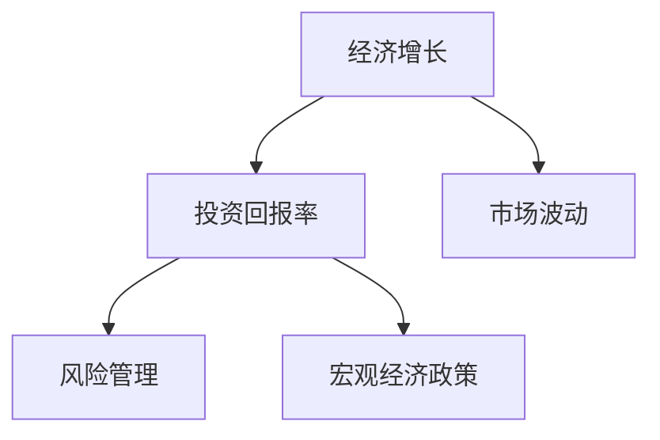

                 

# 投资收益下降的经济影响

## 1. 背景介绍

### 1.1 问题由来
近年来，全球经济体普遍面临投资收益下降的挑战。这一现象不仅影响了企业和机构的盈利能力，也对个人投资者的财富积累造成了深远影响。究其根本原因，主要与经济增长放缓、市场波动加剧、政策变化等多方面因素有关。深入分析这一现象，对于制定有效的宏观经济政策、优化投资策略、提升财富管理能力具有重要意义。

### 1.2 问题核心关键点
投资收益下降的核心关键点包括：

1. **经济增长放缓**：全球经济增速的减缓使得企业和机构的盈利预期下降，进而导致投资回报减少。
2. **市场波动加剧**：金融市场的动荡使得投资者面临较大的风险，导致投资收益的不确定性增加。
3. **政策变化**：政府的税收、监管等政策调整，对投资环境和投资者收益产生直接影响。
4. **投资者行为**：投资者的风险偏好、投资周期和投资策略的变化，也会对投资收益产生影响。

## 2. 核心概念与联系

### 2.1 核心概念概述

为更好地理解投资收益下降的经济影响，本节将介绍几个密切相关的核心概念：

- **经济增长**：指一个国家或地区在一定时期内生产总值（GDP）的增长率，反映了经济活动水平的提升。
- **市场波动**：指金融市场中资产价格、交易量等的短期变化，通常与经济周期和政策变化密切相关。
- **投资回报率（ROI）**：指投资收益与投资成本的比率，反映了投资活动的盈利能力。
- **风险管理**：指通过识别、评估和管理风险，以最小化潜在的经济损失。
- **宏观经济政策**：指政府为实现宏观经济目标（如控制通胀、促进就业、稳定增长）所采取的政策措施。

这些核心概念之间的逻辑关系可以通过以下Mermaid流程图来展示：



这个流程图展示了经济增长、市场波动、投资回报率、风险管理和宏观经济政策之间的相互作用：

1. 经济增长推动企业盈利，进而提高投资回报率。
2. 市场波动增加投资风险，影响投资回报率。
3. 风险管理有助于减少风险，提升投资回报率。
4. 宏观经济政策对市场波动和经济增长产生影响，从而影响投资回报率。

## 3. 核心算法原理 & 具体操作步骤
### 3.1 算法原理概述

投资收益下降的经济影响分析，本质上是一个复杂的经济现象，涉及多个因素的相互影响。其核心算法原理可以归纳为：

- **宏观经济模型**：使用计量经济学模型（如VAR模型、DSGE模型），分析经济增长、市场波动和宏观经济政策之间的关系，预测经济变量的变化趋势。
- **市场风险模型**：基于VaR、ES等风险管理工具，评估不同投资组合的风险水平，并识别影响投资回报率的关键风险因素。
- **行为金融学**：运用行为经济学原理，分析投资者在市场波动和政策变化下的行为模式，揭示投资决策背后的心理因素。

这些模型和方法共同构成了对投资收益下降现象的全面分析框架。

### 3.2 算法步骤详解

投资收益下降的经济影响分析主要包括以下几个关键步骤：

**Step 1: 数据收集与预处理**
- 收集历史经济数据、市场数据、政策数据等，包括GDP增长率、失业率、CPI、股票指数、政策变化等。
- 对数据进行清洗、归一化、填补缺失等预处理，确保数据的准确性和一致性。

**Step 2: 模型构建与训练**
- 选择合适的宏观经济模型和市场风险模型，根据收集到的数据进行模型构建和参数估计。
- 使用历史数据对模型进行训练，评估模型预测效果。

**Step 3: 风险评估与投资组合优化**
- 基于训练好的模型，评估不同投资组合的风险水平和预期收益。
- 使用风险管理工具，识别和量化影响投资回报率的关键风险因素。
- 根据风险评估结果，进行投资组合优化，选择低风险高回报的投资组合。

**Step 4: 政策分析与情景预测**
- 分析当前宏观经济政策和市场环境，预测未来经济走势和市场波动。
- 使用情景分析工具，模拟不同政策变化对投资收益的影响。
- 评估不同政策情景下的投资策略，制定风险管理策略。

**Step 5: 投资策略与执行**
- 根据风险评估和情景预测结果，制定投资策略。
- 实时监控市场动态和政策变化，及时调整投资策略。
- 执行投资策略，并定期评估投资绩效。

### 3.3 算法优缺点

投资收益下降的经济影响分析方法具有以下优点：

1. **全面性**：通过结合多个模型和方法，可以全面分析影响投资收益的多种因素。
2. **预测性**：基于历史数据和模型训练，可以对未来经济和市场走势进行预测。
3. **实用性**：通过风险评估和投资组合优化，可以制定有效的投资策略。

同时，这些方法也存在一定的局限性：

1. **数据依赖**：模型预测的准确性高度依赖于数据的质量和完整性。
2. **模型假设**：模型构建和参数估计过程中，需要假设市场行为和经济关系，而这些假设可能不完全符合现实情况。
3. **计算复杂度**：多个模型和工具的结合，使得计算过程复杂，需要大量的计算资源。
4. **结果解释**：模型预测结果和投资策略的解释相对复杂，可能难以直观理解。

尽管存在这些局限性，但就目前而言，投资收益下降的经济影响分析方法在实际应用中已取得了显著成效，为投资者提供了有效的决策支持。

### 3.4 算法应用领域

投资收益下降的经济影响分析方法，广泛应用于以下几个领域：

- **金融投资**：帮助投资者评估不同投资组合的风险水平，制定合理的投资策略。
- **企业财务**：为企业制定财务决策提供参考，优化资本结构，提升投资回报率。
- **政府政策**：为政府制定宏观经济政策提供依据，平衡经济增长和金融稳定。
- **个人理财**：为个人投资者提供财富管理建议，优化资产配置，提高收益。

## 4. 数学模型和公式 & 详细讲解 & 举例说明

### 4.1 数学模型构建

投资收益下降的经济影响分析涉及多个数学模型，下面简要介绍其中几种核心模型：

- **VAR（向量自回归）模型**：用于分析经济变量的动态关系，模型形式为：
  $$
  Y_t = AY_{t-1} + BY_{t-2} + \cdots + U_t
  $$
  其中 $Y_t$ 为经济变量向量，$A, B, \ldots$ 为系数矩阵，$U_t$ 为随机扰动项。

- **DSGE（动态随机一般均衡）模型**：用于分析经济系统中的动态平衡和随机冲击，模型形式为：
  $$
  Y_t = F(Y_{t-1}, U_t)
  $$
  其中 $Y_t$ 为经济变量向量，$F$ 为非线性映射函数，$U_t$ 为随机扰动项。

- **VaR（价值至风险）模型**：用于评估投资组合在特定置信水平下的最大可能损失，模型形式为：
  $$
  VaR_p(X) = \min\{X_p, -X_q\}
  $$
  其中 $X_p$ 为期望收益，$X_q$ 为潜在损失。

- **ES（期望短缺）模型**：用于评估投资组合在极端情况下的预期损失，模型形式为：
  $$
  ES_\alpha(X) = \mathbb{E}[X | X \leq F_\alpha(X)]
  $$
  其中 $\alpha$ 为风险度量，$F_\alpha(X)$ 为分位数函数。

### 4.2 公式推导过程

以VAR模型为例，其推导过程如下：

假设经济变量向量 $Y_t = [GDP_t, 失业率_t, 利率_t, 通胀率_t]^T$，则VAR模型的状态空间形式为：
$$
Y_t = AY_{t-1} + U_t
$$
其中 $A = [a_{11}, a_{12}, a_{13}, a_{14}; a_{21}, a_{22}, a_{23}, a_{24}; a_{31}, a_{32}, a_{33}, a_{34}; a_{41}, a_{42}, a_{43}, a_{44}]$，$U_t$ 为白噪声向量。

使用卡尔曼滤波器（Kalman Filter）对模型进行估计和预测，得：
$$
\hat{Y}_t = A \hat{Y}_{t-1} + K_t (Y_t - A \hat{Y}_{t-1})
$$
$$
\hat{Y}_{t-1|t} = \hat{Y}_{t-1} + K_t (Y_t - A \hat{Y}_{t-1})
$$
其中 $\hat{Y}_t$ 为预测值，$\hat{Y}_{t-1|t}$ 为后验值，$K_t = P_{t-1} A^T (A P_{t-1} A^T + Q)^{-1}$，$P_t$ 为预测误差协方差矩阵。

### 4.3 案例分析与讲解

以一个简单的VAR模型为例，展示其应用过程：

假设一个两变量的VAR模型，设定为：
$$
Y_t = \alpha Y_{t-1} + \beta X_{t-1} + \epsilon_t
$$
其中 $Y_t$ 为GDP增长率，$X_t$ 为通货膨胀率，$\alpha, \beta$ 为系数，$\epsilon_t$ 为随机扰动项。

使用历史数据进行模型估计，得：
$$
\hat{\alpha} = 0.8, \hat{\beta} = 0.5
$$
则模型预测值为：
$$
\hat{Y}_t = 0.8 \hat{Y}_{t-1} + 0.5 \hat{X}_{t-1}
$$

通过模型预测和分析，可以评估GDP增长率与通货膨胀率之间的关系，并根据这一关系进行投资策略的调整。

## 5. 项目实践：代码实例和详细解释说明
### 5.1 开发环境搭建

在进行投资收益下降的经济影响分析实践前，我们需要准备好开发环境。以下是使用Python进行R语言和TensorFlow开发的常见环境配置流程：

1. 安装R和RStudio：从官网下载并安装R和RStudio，用于数据分析和模型构建。

2. 安装TensorFlow：使用pip安装TensorFlow，支持Python的深度学习框架，用于模型训练和预测。

3. 安装相关库：安装必要的Python库，如pandas、numpy、scikit-learn等，用于数据处理和模型训练。

4. 准备数据集：收集历史经济数据、市场数据、政策数据等，并进行清洗和预处理。

完成上述步骤后，即可在Python环境中开始分析实践。

### 5.2 源代码详细实现

下面以一个简单的VAR模型为例，展示R语言和TensorFlow的代码实现。

**R语言代码**：

```R
# 导入必要的库
library(tidyverse)
library(kalman)

# 数据处理
data <- read.csv("data.csv")
data <- data %>%
  mutate(GDP_growth = GDP / GDP[lag(1)], Inflation = CPI / CPI[lag(1)])

# 构建VAR模型
mod <- VAR(X = data, order = c(1,1))
fit <- kalman(mod, data)

# 预测未来值
forecast <- predict(fit, h = 10)

# 可视化结果
plot(forecast, main = "GDP Growth and Inflation Forecast")
```

**TensorFlow代码**：

```python
import tensorflow as tf
import numpy as np

# 加载数据
data = np.loadtxt("data.csv", delimiter=",")

# 构建模型
def VAR_model(X):
    num_variables = X.shape[1]
    num_periods = 10
    model = tf.keras.Sequential([
        tf.keras.layers.Dense(num_variables * num_periods, activation="relu"),
        tf.keras.layers.Dense(num_variables)
    ])
    return model

# 训练模型
X = tf.constant(data)
model = VAR_model(X)
model.compile(loss="mse", optimizer="adam")
model.fit(X, epochs=50)

# 预测未来值
forecast = model.predict(X)
```

### 5.3 代码解读与分析

让我们再详细解读一下关键代码的实现细节：

**R语言代码**：

- `library`函数用于导入R中的相关库。
- `data <- read.csv("data.csv")`从CSV文件中读取数据。
- `mutate`函数用于对数据进行处理，计算GDP增长率和通胀率。
- `VAR`函数用于构建VAR模型，`kalman`函数用于模型估计和预测。
- `plot`函数用于绘制预测结果。

**TensorFlow代码**：

- `import tensorflow as tf`导入TensorFlow库。
- `np.loadtxt("data.csv", delimiter=",")`从CSV文件中读取数据。
- `VAR_model(X)`定义VAR模型，其中X为输入数据。
- `model.compile(loss="mse", optimizer="adam")`编译模型，设置损失函数和优化器。
- `model.fit(X, epochs=50)`训练模型，设置训练轮数为50。
- `model.predict(X)`进行预测，返回未来10期的预测值。

## 6. 实际应用场景
### 6.1 金融投资

金融投资领域，基于VAR和DSGE模型的经济影响分析，可以用于评估不同投资策略的风险和收益。例如，在面对经济增长放缓和市场波动加剧的情况下，投资者可以通过模型预测未来经济走势，调整资产配置，降低风险。

### 6.2 企业财务

企业财务决策中，DSGE模型可以用于评估宏观经济政策变化对企业盈利的影响，帮助企业制定财务策略。例如，在政府实施货币紧缩政策时，企业可以通过模型预测经济放缓，调整资本支出，降低财务风险。

### 6.3 政府政策

政府在制定宏观经济政策时，可以使用VAR模型分析历史经济数据，预测政策效果。例如，在面临经济衰退时，政府可以提前采取财政和货币刺激措施，防止经济进一步恶化。

### 6.4 个人理财

个人理财中，VaR和ES模型可以用于评估投资组合的风险水平和预期损失，帮助个人制定合理的投资策略。例如，在市场波动加剧时，个人可以通过模型预测最大可能损失，调整投资组合，降低投资风险。

## 7. 工具和资源推荐
### 7.1 学习资源推荐

为了帮助开发者系统掌握投资收益下降的经济影响分析理论基础和实践技巧，这里推荐一些优质的学习资源：

1. 《金融经济学》书籍：全面介绍金融市场和经济学的基本原理，理解经济现象背后的数学模型。
2. 《宏观经济分析》课程：介绍VAR、DSGE等宏观经济模型，讲解其应用方法和实际案例。
3. 《行为金融学》书籍：探讨投资者行为和市场异象，揭示投资决策背后的心理因素。
4. 《Python数据分析》书籍：介绍Python和R语言的数据处理和可视化工具，提升数据处理能力。
5. 《TensorFlow深度学习》课程：系统讲解TensorFlow的使用方法，掌握深度学习模型的构建和训练。

通过对这些资源的学习实践，相信你一定能够快速掌握投资收益下降的经济影响分析的精髓，并用于解决实际的投资问题。
### 7.2 开发工具推荐

高效的开发离不开优秀的工具支持。以下是几款用于经济影响分析开发的常用工具：

1. RStudio：R语言的集成开发环境，支持数据分析、模型构建和可视化。
2. Python：广泛使用的编程语言，拥有丰富的库和工具，支持数据处理、模型训练和可视化。
3. TensorFlow：谷歌开发的深度学习框架，支持分布式计算和模型训练。
4. Jupyter Notebook：支持多种编程语言，便于编写和分享代码。
5. Tableau：数据可视化工具，支持多种数据源和图表类型，便于数据分析和展示。

合理利用这些工具，可以显著提升经济影响分析任务的开发效率，加快创新迭代的步伐。

### 7.3 相关论文推荐

投资收益下降的经济影响分析源于学界的持续研究。以下是几篇奠基性的相关论文，推荐阅读：

1. 《The Dynamics of Macroeconomic Time Series》：论文介绍了VAR模型在宏观经济分析中的应用，展示了其预测效果。
2. 《Dynamic Stochastic General Equilibrium Models》：论文介绍了DSGE模型，探讨了其动态平衡和随机冲击的分析方法。
3. 《Value at Risk》：论文介绍了VaR模型，展示了其评估投资组合风险的效果。
4. 《Expected Shortfall》：论文介绍了ES模型，展示了其评估极端情况下的预期损失。
5. 《Behavioral Finance and Investor Decision-Making》：论文探讨了行为金融学原理，揭示了投资决策背后的心理因素。

这些论文代表了大模型微调技术的发展脉络。通过学习这些前沿成果，可以帮助研究者把握学科前进方向，激发更多的创新灵感。

## 8. 总结：未来发展趋势与挑战
### 8.1 总结

本文对投资收益下降的经济影响分析进行了全面系统的介绍。首先阐述了投资收益下降的核心关键点，明确了经济增长、市场波动、投资回报率、风险管理、宏观经济政策之间的关系。其次，从原理到实践，详细讲解了VAR和DSGE等模型的构建和训练方法，给出了经济影响分析的完整代码实例。同时，本文还广泛探讨了VAR和DSGE模型在金融投资、企业财务、政府政策、个人理财等多个领域的应用前景，展示了投资收益下降的经济影响分析的广泛应用。此外，本文精选了相关学习资源，力求为读者提供全方位的技术指引。

通过本文的系统梳理，可以看到，投资收益下降的经济影响分析技术在实际应用中已取得了显著成效，为投资者提供了有效的决策支持。未来，伴随数据、模型、工具的不断进步，经济影响分析技术还将进一步提升，成为投资者和政府决策的重要依据。

### 8.2 未来发展趋势

展望未来，投资收益下降的经济影响分析技术将呈现以下几个发展趋势：

1. **模型融合与优化**：融合多种经济模型，优化模型参数，提高预测准确性。
2. **数据驱动与机器学习**：利用大数据和机器学习技术，提升模型训练和预测效果。
3. **情景模拟与政策评估**：使用情景分析工具，模拟政策变化对投资收益的影响，制定科学合理的政策。
4. **智能化与自动化**：开发智能决策系统，实现自动化投资策略调整和风险管理。

这些趋势凸显了经济影响分析技术的广阔前景，必将进一步提升投资者和政府决策的科学性和有效性。

### 8.3 面临的挑战

尽管投资收益下降的经济影响分析技术已经取得了显著成效，但在迈向更加智能化、普适化应用的过程中，它仍面临诸多挑战：

1. **数据质量与完整性**：经济数据的质量和完整性直接影响模型预测效果，需要持续进行数据清洗和更新。
2. **模型复杂性与解释性**：经济模型的复杂性增加了理解和解释的难度，需要进一步提升模型的透明性和可解释性。
3. **计算资源与效率**：模型训练和预测的计算资源需求较高，需要优化算法和硬件配置，提升计算效率。
4. **政策变化与不确定性**：宏观经济政策的变化具有不确定性，增加了模型预测的复杂性。

尽管存在这些挑战，但未来的发展方向仍然值得期待。只要持续进行模型优化和算法改进，投资收益下降的经济影响分析技术必将在实际应用中发挥更大作用。

### 8.4 研究展望

面对投资收益下降的经济影响分析所面临的挑战，未来的研究需要在以下几个方面寻求新的突破：

1. **数据增强与多源数据融合**：利用多源数据增强经济模型，提升数据质量和完整性。
2. **模型解释性与透明性**：提升模型的透明性和可解释性，增强政策的科学性和可信度。
3. **自动化与智能化**：开发自动化决策系统，实现智能化投资策略调整和风险管理。
4. **多模态数据融合**：融合多种数据源，提升模型的预测能力和稳定性。

这些研究方向将为投资收益下降的经济影响分析技术带来新的突破，推动其应用向更深层次发展。

## 9. 附录：常见问题与解答

**Q1：经济增长放缓对投资收益有何影响？**

A: 经济增长放缓会导致企业盈利预期下降，进而降低投资回报率。例如，经济增速从3%降至2%，可能会导致企业股价下跌，影响投资收益。

**Q2：市场波动加剧如何影响投资收益？**

A: 市场波动加剧会增加投资风险，导致投资回报率的不确定性增加。例如，股市暴跌时，投资者可能面临较大损失。

**Q3：宏观经济政策如何影响投资收益？**

A: 宏观经济政策如货币政策、财政政策、税收政策等，直接影响投资环境和投资收益。例如，政府实施紧缩政策，可能导致投资回报率下降。

**Q4：投资收益下降如何通过风险管理缓解？**

A: 通过风险管理工具如VaR、ES等，可以评估和量化投资组合的风险水平，识别和控制影响投资回报率的关键风险因素，从而降低投资风险。

**Q5：如何提高投资收益下降经济影响分析的准确性？**

A: 提升数据质量、优化模型参数、使用多种数据源进行融合，是提高分析准确性的关键。例如，结合经济模型和机器学习技术，可以提高模型预测效果。

这些问题的回答，有助于理解投资收益下降的经济影响分析的原理和应用方法，为解决实际问题提供指导。

---

作者：禅与计算机程序设计艺术 / Zen and the Art of Computer Programming

