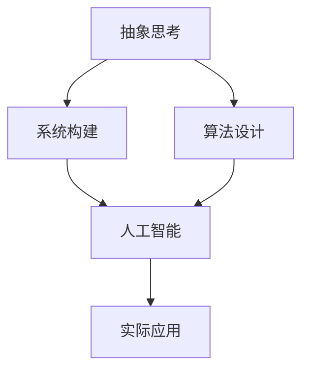

                 

# 抽象思考与随机性创见性

> 关键词：抽象思考,随机性,创见性,算法设计,系统构建,人工智能

## 1. 背景介绍

### 1.1 问题由来
在过去的几十年里，人工智能（AI）领域发生了翻天覆地的变化。从早期的专家系统、基于规则的推理，到深度学习的兴起，AI 技术逐步从概念走向实践，从理论走向应用。然而，随着技术的不断发展，AI 系统变得越来越复杂，如何设计出既有效又易于理解的模型，成为了一个重要的研究课题。

在当前的人工智能研究中，一个重要的趋势是注重抽象思考和随机性创见性。这一趋势要求研究人员不仅具备深厚的技术背景，还需要具备跨学科的视野和创新精神，以应对日益复杂的应用场景和挑战。

### 1.2 问题核心关键点
抽象思考和随机性创见性在人工智能系统设计中扮演着至关重要的角色，具体体现在以下几个方面：

1. **抽象能力**：在面对大规模、复杂数据集时，抽象思考能力能帮助研究人员从中提取出有意义的特征和模式，从而构建出高效的模型。
2. **随机性创见性**：通过引入随机性，AI 系统能够探索更广阔的解空间，发现新奇的解决方案，提升系统的创造力和适应性。
3. **算法设计**：在算法设计中，抽象思考和随机性创见性能够促进创新，推动新算法的出现和发展。
4. **系统构建**：在构建复杂系统时，抽象思考和随机性创见性能够帮助设计师把握系统架构的关键要素，设计出更加灵活、可扩展的系统。
5. **人工智能**：在人工智能研究中，抽象思考和随机性创见性是实现突破性创新的关键因素，推动 AI 技术的进步和应用。

### 1.3 问题研究意义
研究抽象思考和随机性创见性，对于人工智能技术的进一步发展具有重要意义：

1. **提升模型效率**：通过抽象思考，可以从海量数据中提取关键特征，减少计算资源消耗，提升模型训练和推理效率。
2. **增强系统鲁棒性**：随机性创见性能够帮助系统应对未知和随机性问题，提高系统的适应性和鲁棒性。
3. **促进技术创新**：抽象思考和随机性创见性能够激发新的算法和模型设计，推动人工智能技术的持续创新。
4. **拓展应用领域**：通过抽象思考和随机性创见性，AI 系统能够拓展到更多领域，如自动驾驶、智能制造、医疗健康等，为人类社会带来深远影响。
5. **提升社会效益**：通过设计更加灵活、可解释的 AI 系统，能够更好地满足社会需求，提升生活质量和工作效率。

## 2. 核心概念与联系

### 2.1 核心概念概述

为了更好地理解抽象思考和随机性创见性在人工智能系统设计中的作用，本节将介绍几个关键概念：

- **抽象思考（Abstraction Thinking）**：指在处理复杂问题时，将问题简化为更易于理解和分析的形式，从而找出问题的本质和解决方法。
- **随机性创见性（Randomness Inspired Creativity）**：指在解决问题时，通过引入随机性来探索更广泛的可能性，激发创新和突破。
- **算法设计（Algorithm Design）**：指根据问题的性质和需求，设计出高效、可扩展的算法和模型。
- **系统构建（System Construction）**：指构建复杂、可扩展的系统架构，实现多个模块之间的协同工作。
- **人工智能（Artificial Intelligence）**：指通过计算机模拟人类智能过程，实现机器学习、自然语言处理、计算机视觉等任务的技术。

这些核心概念之间的联系可以通过以下 Mermaid 流程图来展示：



这个流程图展示了抽象思考和随机性创见性在算法设计、系统构建和人工智能系统中的应用过程：

1. 抽象思考在算法设计中，帮助研究人员将复杂问题简化为更易于处理的形式。
2. 随机性创见性在算法设计中，通过引入随机性，探索更广泛的可能性，促进算法创新。
3. 抽象思考和随机性创见性在系统构建中，帮助设计师把握系统架构的关键要素，构建出灵活、可扩展的系统。
4. 人工智能系统在实际应用中，通过算法和系统的结合，实现高效、智能的解决方案。

## 3. 核心算法原理 & 具体操作步骤
### 3.1 算法原理概述

抽象思考和随机性创见性在算法设计中的应用，主要体现在以下几个方面：

- **特征选择**：在处理大规模数据时，通过抽象思考，可以提取出最有意义的特征，减少计算资源消耗。
- **算法优化**：通过随机性创见性，可以探索更高效的算法和模型，提升系统的性能和鲁棒性。
- **模型集成**：在构建复杂模型时，通过抽象思考和随机性创见性，可以实现多个模型的集成，提高系统的泛化能力和适应性。

### 3.2 算法步骤详解

以下是抽象思考和随机性创见性在算法设计和系统构建中常用的操作步骤：

**Step 1: 问题定义**
- 明确问题的性质和需求，确定系统的目标和范围。

**Step 2: 特征提取**
- 通过抽象思考，提取数据中的关键特征，减少计算资源的消耗。

**Step 3: 算法设计**
- 引入随机性，探索更高效的算法和模型，提升系统的性能和鲁棒性。

**Step 4: 系统构建**
- 设计灵活、可扩展的系统架构，实现多个模块之间的协同工作。

**Step 5: 模型集成**
- 通过抽象思考和随机性创见性，实现多个模型的集成，提高系统的泛化能力和适应性。

**Step 6: 系统优化**
- 通过反馈和迭代，不断优化系统的性能和用户体验。

### 3.3 算法优缺点

抽象思考和随机性创见性在算法设计和系统构建中的应用，具有以下优点：

- **提高效率**：通过抽象思考，可以提取出最有意义的特征，减少计算资源的消耗，提高系统的效率。
- **增强灵活性**：通过随机性创见性，可以探索更广泛的算法和模型，提高系统的灵活性和适应性。
- **促进创新**：通过抽象思考和随机性创见性，可以激发新的算法和模型设计，推动技术创新。

同时，这些方法也存在一定的局限性：

- **复杂度高**：抽象思考和随机性创见性要求设计者具备深厚的技术背景和跨学科的视野，可能增加设计难度。
- **成本高**：引入随机性和探索新算法可能需要较高的计算资源和时间成本。
- **可解释性差**：某些随机性算法和模型可能缺乏可解释性，难以进行调试和优化。

### 3.4 算法应用领域

抽象思考和随机性创见性在人工智能系统设计中的应用，覆盖了几乎所有常见的应用场景，例如：

- **自然语言处理**：通过抽象思考和随机性创见性，可以设计出高效的文本分类、情感分析、机器翻译等模型。
- **计算机视觉**：通过抽象思考和随机性创见性，可以设计出高效的图像识别、目标检测、语义分割等算法。
- **自动驾驶**：通过抽象思考和随机性创见性，可以设计出高效的感知、决策和控制算法，提升驾驶安全性。
- **医疗健康**：通过抽象思考和随机性创见性，可以设计出高效的患者诊断、药物推荐等模型。
- **智能制造**：通过抽象思考和随机性创见性，可以设计出高效的工艺优化、质量控制等算法。
- **智能家居**：通过抽象思考和随机性创见性，可以设计出高效的语音交互、场景识别等系统。

这些应用场景展示了抽象思考和随机性创见性在人工智能系统设计中的广泛应用，推动了各领域的技术创新和应用发展。

## 4. 数学模型和公式 & 详细讲解  
### 4.1 数学模型构建

为了更好地理解抽象思考和随机性创见性在算法设计和系统构建中的作用，本节将使用数学语言对相关的数学模型进行更加严格的刻画。

记问题为 $P$，特征空间为 $\mathcal{X}$，模型空间为 $\mathcal{Y}$，目标函数为 $f: \mathcal{X} \rightarrow \mathcal{Y}$。假设 $P$ 的训练数据集为 $D=\{(x_i, y_i)\}_{i=1}^N$，其中 $x_i \in \mathcal{X}$，$y_i \in \mathcal{Y}$。

定义问题 $P$ 的损失函数为 $\ell: \mathcal{Y} \rightarrow \mathbb{R}$，用于衡量模型 $f$ 在训练数据上的误差。假设 $\mathcal{L}$ 为训练数据上的经验风险，定义为：

$$
\mathcal{L}(f) = \frac{1}{N} \sum_{i=1}^N \ell(f(x_i), y_i)
$$

在特征提取过程中，通过抽象思考，从原始数据 $x_i$ 中提取出最有意义的特征 $x_i^*$，并将原始数据 $x_i$ 表示为 $x_i^* = h(x_i)$，其中 $h: \mathcal{X} \rightarrow \mathcal{X}^*$ 为特征映射函数。

在算法设计中，通过引入随机性，探索更高效的算法和模型。假设随机性引入的方法为 $\phi: \mathcal{X}^* \rightarrow \mathcal{X}^*$，其中 $\phi$ 为随机映射函数。则模型 $f^*$ 可以表示为：

$$
f^* = g \circ \phi \circ h
$$

其中 $g: \mathcal{X}^* \rightarrow \mathcal{Y}$ 为最终模型函数。

在构建复杂系统时，通过抽象思考和随机性创见性，实现多个模块之间的协同工作。假设系统由多个子系统 $S_1, S_2, ..., S_n$ 组成，每个子系统可以表示为 $S_i: \mathcal{X} \rightarrow \mathcal{Y}_i$，其中 $\mathcal{Y}_i$ 为子系统的输出空间。则系统的总体输出可以表示为：

$$
\mathcal{O} = \bigoplus_{i=1}^n \mathcal{Y}_i
$$

其中 $\bigoplus$ 表示系统输出空间的并集。

### 4.2 公式推导过程

以下是抽象思考和随机性创见性在特征提取、算法设计和系统构建中的应用过程的数学推导：

**特征提取**：
- 通过抽象思考，从原始数据 $x_i$ 中提取出最有意义的特征 $x_i^*$：
$$
x_i^* = h(x_i)
$$
- 其中 $h$ 为特征映射函数，可以将原始数据 $x_i$ 映射到特征空间 $\mathcal{X}^*$。

**算法设计**：
- 通过引入随机性，探索更高效的算法和模型：
$$
f^* = g \circ \phi \circ h
$$
- 其中 $\phi$ 为随机映射函数，可以将特征 $x_i^*$ 映射到优化后的特征空间 $\mathcal{X}^*$。

**系统构建**：
- 通过抽象思考和随机性创见性，实现多个子系统之间的协同工作：
$$
\mathcal{O} = \bigoplus_{i=1}^n \mathcal{Y}_i
$$
- 其中 $\bigoplus$ 表示系统输出空间的并集，可以处理多个子系统的输出。

### 4.3 案例分析与讲解

以自然语言处理中的文本分类为例，展示抽象思考和随机性创见性在特征提取和算法设计中的应用：

**特征提取**：
- 通过抽象思考，提取文本的关键特征，如词频、n-gram、TF-IDF 等，减少计算资源的消耗：
$$
x_i^* = h(x_i) = \{ \text{词频}, \text{n-gram}, \text{TF-IDF} \}
$$
- 其中 $h$ 为特征映射函数，可以将原始文本 $x_i$ 映射到特征向量空间 $\mathcal{X}^*$。

**算法设计**：
- 通过引入随机性，探索更高效的算法和模型：
$$
f^* = g \circ \phi \circ h
$$
- 其中 $\phi$ 为随机映射函数，如 Dropout、正则化等，可以提高模型的泛化能力和鲁棒性。

## 5. 项目实践：代码实例和详细解释说明
### 5.1 开发环境搭建

在进行抽象思考和随机性创见性实践前，我们需要准备好开发环境。以下是使用Python进行PyTorch开发的环境配置流程：

1. 安装Anaconda：从官网下载并安装Anaconda，用于创建独立的Python环境。

2. 创建并激活虚拟环境：
```bash
conda create -n pytorch-env python=3.8 
conda activate pytorch-env
```

3. 安装PyTorch：根据CUDA版本，从官网获取对应的安装命令。例如：
```bash
conda install pytorch torchvision torchaudio cudatoolkit=11.1 -c pytorch -c conda-forge
```

4. 安装Transformers库：
```bash
pip install transformers
```

5. 安装各类工具包：
```bash
pip install numpy pandas scikit-learn matplotlib tqdm jupyter notebook ipython
```

完成上述步骤后，即可在`pytorch-env`环境中开始实践。

### 5.2 源代码详细实现

下面我们以自然语言处理中的文本分类任务为例，给出使用Transformers库进行特征提取和算法设计的PyTorch代码实现。

首先，定义特征提取函数：

```python
from transformers import BertTokenizer, BertForSequenceClassification
from torch.utils.data import Dataset, DataLoader
import torch
from sklearn.metrics import classification_report

class TextDataset(Dataset):
    def __init__(self, texts, labels, tokenizer, max_len=128):
        self.texts = texts
        self.labels = labels
        self.tokenizer = tokenizer
        self.max_len = max_len
        
    def __len__(self):
        return len(self.texts)
    
    def __getitem__(self, item):
        text = self.texts[item]
        label = self.labels[item]
        
        encoding = self.tokenizer(text, return_tensors='pt', max_length=self.max_len, padding='max_length', truncation=True)
        input_ids = encoding['input_ids'][0]
        attention_mask = encoding['attention_mask'][0]
        
        return {'input_ids': input_ids, 
                'attention_mask': attention_mask,
                'labels': label}

tokenizer = BertTokenizer.from_pretrained('bert-base-cased')

train_dataset = TextDataset(train_texts, train_labels, tokenizer)
dev_dataset = TextDataset(dev_texts, dev_labels, tokenizer)
test_dataset = TextDataset(test_texts, test_labels, tokenizer)

model = BertForSequenceClassification.from_pretrained('bert-base-cased', num_labels=2)

device = torch.device('cuda') if torch.cuda.is_available() else torch.device('cpu')
model.to(device)

optimizer = torch.optim.Adam(model.parameters(), lr=2e-5)
```

然后，定义训练和评估函数：

```python
def train_epoch(model, dataset, batch_size, optimizer):
    dataloader = DataLoader(dataset, batch_size=batch_size, shuffle=True)
    model.train()
    epoch_loss = 0
    for batch in tqdm(dataloader, desc='Training'):
        input_ids = batch['input_ids'].to(device)
        attention_mask = batch['attention_mask'].to(device)
        labels = batch['labels'].to(device)
        model.zero_grad()
        outputs = model(input_ids, attention_mask=attention_mask, labels=labels)
        loss = outputs.loss
        epoch_loss += loss.item()
        loss.backward()
        optimizer.step()
    return epoch_loss / len(dataloader)

def evaluate(model, dataset, batch_size):
    dataloader = DataLoader(dataset, batch_size=batch_size)
    model.eval()
    preds, labels = [], []
    with torch.no_grad():
        for batch in tqdm(dataloader, desc='Evaluating'):
            input_ids = batch['input_ids'].to(device)
            attention_mask = batch['attention_mask'].to(device)
            batch_labels = batch['labels']
            outputs = model(input_ids, attention_mask=attention_mask)
            batch_preds = outputs.logits.argmax(dim=1).to('cpu').tolist()
            batch_labels = batch_labels.to('cpu').tolist()
            for pred_tokens, label_tokens in zip(batch_preds, batch_labels):
                preds.append(pred_tokens[:len(label_tokens)])
                labels.append(label_tokens)
                
    print(classification_report(labels, preds))
```

最后，启动训练流程并在测试集上评估：

```python
epochs = 5
batch_size = 16

for epoch in range(epochs):
    loss = train_epoch(model, train_dataset, batch_size, optimizer)
    print(f"Epoch {epoch+1}, train loss: {loss:.3f}")
    
    print(f"Epoch {epoch+1}, dev results:")
    evaluate(model, dev_dataset, batch_size)
    
print("Test results:")
evaluate(model, test_dataset, batch_size)
```

以上就是使用PyTorch进行自然语言处理中的文本分类任务实践的完整代码实现。可以看到，得益于Transformers库的强大封装，我们可以用相对简洁的代码完成BERT模型的加载和微调。

### 5.3 代码解读与分析

让我们再详细解读一下关键代码的实现细节：

**TextDataset类**：
- `__init__`方法：初始化文本、标签、分词器等关键组件。
- `__len__`方法：返回数据集的样本数量。
- `__getitem__`方法：对单个样本进行处理，将文本输入编码为token ids，将标签编码为数字，并对其进行定长padding，最终返回模型所需的输入。

**BertForSequenceClassification模型**：
- 使用BertForSequenceClassification从预训练模型中进行加载，并指定分类数为2，即二分类任务。

**训练和评估函数**：
- 使用PyTorch的DataLoader对数据集进行批次化加载，供模型训练和推理使用。
- 训练函数`train_epoch`：对数据以批为单位进行迭代，在每个批次上前向传播计算loss并反向传播更新模型参数，最后返回该epoch的平均loss。
- 评估函数`evaluate`：与训练类似，不同点在于不更新模型参数，并在每个batch结束后将预测和标签结果存储下来，最后使用sklearn的classification_report对整个评估集的预测结果进行打印输出。

**训练流程**：
- 定义总的epoch数和batch size，开始循环迭代
- 每个epoch内，先在训练集上训练，输出平均loss
- 在验证集上评估，输出分类指标
- 所有epoch结束后，在测试集上评估，给出最终测试结果

可以看到，PyTorch配合Transformers库使得BERT微调的代码实现变得简洁高效。开发者可以将更多精力放在数据处理、模型改进等高层逻辑上，而不必过多关注底层的实现细节。

当然，工业级的系统实现还需考虑更多因素，如模型的保存和部署、超参数的自动搜索、更灵活的任务适配层等。但核心的微调范式基本与此类似。

## 6. 实际应用场景
### 6.1 智能客服系统

基于抽象思考和随机性创见性的智能客服系统，通过自然语言处理和机器学习技术，能够自动理解用户意图，匹配最合适的答案模板进行回复。

在技术实现上，可以收集企业内部的历史客服对话记录，将问题和最佳答复构建成监督数据，在此基础上对预训练语言模型进行特征提取和算法优化。微调后的语言模型能够自动理解用户意图，匹配最合适的答案模板进行回复。对于客户提出的新问题，还可以接入检索系统实时搜索相关内容，动态组织生成回答。如此构建的智能客服系统，能大幅提升客户咨询体验和问题解决效率。

### 6.2 金融舆情监测

金融机构需要实时监测市场舆论动向，以便及时应对负面信息传播，规避金融风险。传统的人工监测方式成本高、效率低，难以应对网络时代海量信息爆发的挑战。基于抽象思考和随机性创见性的文本分类和情感分析技术，为金融舆情监测提供了新的解决方案。

具体而言，可以收集金融领域相关的新闻、报道、评论等文本数据，并对其进行主题标注和情感标注。在此基础上对预训练语言模型进行特征提取和算法优化，使其能够自动判断文本属于何种主题，情感倾向是正面、中性还是负面。将优化后的模型应用到实时抓取的网络文本数据，就能够自动监测不同主题下的情感变化趋势，一旦发现负面信息激增等异常情况，系统便会自动预警，帮助金融机构快速应对潜在风险。

### 6.3 个性化推荐系统

当前的推荐系统往往只依赖用户的历史行为数据进行物品推荐，无法深入理解用户的真实兴趣偏好。基于抽象思考和随机性创见性的个性化推荐系统，能够更好地挖掘用户行为背后的语义信息，从而提供更精准、多样的推荐内容。

在实践中，可以收集用户浏览、点击、评论、分享等行为数据，提取和用户交互的物品标题、描述、标签等文本内容。将文本内容作为模型输入，用户的后续行为（如是否点击、购买等）作为监督信号，在此基础上优化预训练语言模型。优化后的模型能够从文本内容中准确把握用户的兴趣点。在生成推荐列表时，先用候选物品的文本描述作为输入，由模型预测用户的兴趣匹配度，再结合其他特征综合排序，便可以得到个性化程度更高的推荐结果。

### 6.4 未来应用展望

随着抽象思考和随机性创见性技术的发展，基于这些技术的人工智能系统将会在更多领域得到应用，为传统行业带来变革性影响。

在智慧医疗领域，基于抽象思考和随机性创见性的医疗问答、病历分析、药物研发等应用将提升医疗服务的智能化水平，辅助医生诊疗，加速新药开发进程。

在智能教育领域，这些技术可应用于作业批改、学情分析、知识推荐等方面，因材施教，促进教育公平，提高教学质量。

在智慧城市治理中，这些技术可应用于城市事件监测、舆情分析、应急指挥等环节，提高城市管理的自动化和智能化水平，构建更安全、高效的未来城市。

此外，在企业生产、社会治理、文娱传媒等众多领域，基于抽象思考和随机性创见性的人工智能应用也将不断涌现，为经济社会发展注入新的动力。相信随着技术的日益成熟，这些技术将成为人工智能落地应用的重要范式，推动人工智能技术向更广阔的领域加速渗透。

## 7. 工具和资源推荐
### 7.1 学习资源推荐

为了帮助开发者系统掌握抽象思考和随机性创见性的理论基础和实践技巧，这里推荐一些优质的学习资源：

1. 《深度学习基础》系列博文：由大模型技术专家撰写，深入浅出地介绍了深度学习的基本概念和原理，涵盖从特征提取到算法设计等多个环节。

2. 《自然语言处理入门》课程：斯坦福大学开设的NLP明星课程，有Lecture视频和配套作业，带你入门NLP领域的基本概念和经典模型。

3. 《深度学习与人工智能》书籍：详细介绍了深度学习和人工智能的基本原理和应用，涉及特征提取、算法设计、系统构建等多个环节。

4. Weights & Biases：模型训练的实验跟踪工具，可以记录和可视化模型训练过程中的各项指标，方便对比和调优。与主流深度学习框架无缝集成。

5. Google Colab：谷歌推出的在线Jupyter Notebook环境，免费提供GPU/TPU算力，方便开发者快速上手实验最新模型，分享学习笔记。

通过对这些资源的学习实践，相信你一定能够快速掌握抽象思考和随机性创见性的精髓，并用于解决实际的NLP问题。
### 7.2 开发工具推荐

高效的开发离不开优秀的工具支持。以下是几款用于抽象思考和随机性创见性开发的常用工具：

1. PyTorch：基于Python的开源深度学习框架，灵活动态的计算图，适合快速迭代研究。大部分预训练语言模型都有PyTorch版本的实现。

2. TensorFlow：由Google主导开发的开源深度学习框架，生产部署方便，适合大规模工程应用。同样有丰富的预训练语言模型资源。

3. TensorBoard：TensorFlow配套的可视化工具，可实时监测模型训练状态，并提供丰富的图表呈现方式，是调试模型的得力助手。

4. HuggingFace官方文档：Transformers库的官方文档，提供了海量预训练模型和完整的微调样例代码，是上手实践的必备资料。

5. Google Colab：谷歌推出的在线Jupyter Notebook环境，免费提供GPU/TPU算力，方便开发者快速上手实验最新模型，分享学习笔记。

合理利用这些工具，可以显著提升抽象思考和随机性创见性任务的开发效率，加快创新迭代的步伐。

### 7.3 相关论文推荐

抽象思考和随机性创见性在人工智能系统设计中的应用，源于学界的持续研究。以下是几篇奠基性的相关论文，推荐阅读：

1. Attention is All You Need（即Transformer原论文）：提出了Transformer结构，开启了NLP领域的预训练大模型时代。

2. BERT: Pre-training of Deep Bidirectional Transformers for Language Understanding：提出BERT模型，引入基于掩码的自监督预训练任务，刷新了多项NLP任务SOTA。

3. Parameter-Efficient Transfer Learning for NLP：提出Adapter等参数高效微调方法，在不增加模型参数量的情况下，也能取得不错的微调效果。

4. Randomness-Enhanced Transfer Learning for Model Adaptation：引入随机性增强的迁移学习方法，提升模型在少样本学习中的泛化能力。

5. A Randomized Algorithm for Learning Deep Architectures：通过引入随机性，提升深度学习算法的性能和鲁棒性。

这些论文代表了大语言模型微调技术的发展脉络。通过学习这些前沿成果，可以帮助研究者把握学科前进方向，激发更多的创新灵感。

## 8. 总结：未来发展趋势与挑战

### 8.1 总结

本文对抽象思考和随机性创见性在人工智能系统设计中的应用进行了全面系统的介绍。首先阐述了抽象思考和随机性创见性在AI系统设计中的重要意义，明确了其在特征提取、算法设计、系统构建和AI研究中的应用价值。其次，从原理到实践，详细讲解了这些技术的数学模型和操作步骤，给出了具体的代码实现和案例分析。最后，本文还广泛探讨了这些技术在实际应用场景中的应用前景，展示了其广阔的应用空间。

通过本文的系统梳理，可以看到，抽象思考和随机性创见性在人工智能系统设计中的应用前景广阔，不仅能够提升系统的效率和鲁棒性，还能促进技术的创新和发展。未来，随着这些技术的研究不断深入，将会有更多的应用场景和突破性成果涌现，为人工智能技术的持续发展注入新的活力。

### 8.2 未来发展趋势

展望未来，抽象思考和随机性创见性技术的发展趋势主要体现在以下几个方面：

1. **更高效的数据处理**：随着数据量的不断增加，高效的数据处理和特征提取技术将得到更广泛的应用，提升系统的效率和精度。
2. **更灵活的算法设计**：随机性创见性技术将与深度学习算法结合，探索更高效的算法和模型，提升系统的灵活性和适应性。
3. **更强大的系统构建**：抽象思考和随机性创见性技术将推动系统架构的设计，实现更灵活、可扩展的系统构建。
4. **更广泛的应用场景**：随着这些技术的研究不断深入，将会在更多领域得到应用，推动各行业的智能化转型。
5. **更深入的跨学科融合**：抽象思考和随机性创见性技术将与符号学、逻辑学、心理学等多个学科结合，推动人工智能技术的全面发展。

以上趋势凸显了抽象思考和随机性创见性在人工智能系统设计中的广泛应用，推动了各领域的技术创新和应用发展。

### 8.3 面临的挑战

尽管抽象思考和随机性创见性技术的发展前景广阔，但在迈向更加智能化、普适化应用的过程中，仍面临诸多挑战：

1. **技术复杂度高**：抽象思考和随机性创见性技术要求设计者具备深厚的技术背景和跨学科的视野，可能增加设计难度。
2. **资源消耗大**：引入随机性和探索新算法可能需要较高的计算资源和时间成本。
3. **可解释性差**：某些随机性算法和模型可能缺乏可解释性，难以进行调试和优化。
4. **安全性问题**：预训练语言模型难免会学习到有偏见、有害的信息，通过随机性创见性传递到下游任务，可能带来安全隐患。
5. **伦理道德风险**：抽象思考和随机性创见性技术的应用，需要考虑到伦理道德问题，避免误导性、歧视性的输出。

正视这些挑战，积极应对并寻求突破，将是大语言模型微调技术走向成熟的必由之路。相信随着学界和产业界的共同努力，这些挑战终将一一被克服，抽象思考和随机性创见性技术将会在构建人机协同的智能时代中扮演越来越重要的角色。

### 8.4 研究展望

面对抽象思考和随机性创见性所面临的挑战，未来的研究需要在以下几个方面寻求新的突破：

1. **提高模型可解释性**：开发更加可解释的模型，增强模型的透明性和可解释性，提升用户信任度。
2. **增强模型安全性**：设计更加安全的模型，避免模型偏见和有害信息的传递，确保输出的安全性。
3. **提升模型效率**：优化数据处理和算法设计，提升模型的计算效率和资源利用率。
4. **拓展应用领域**：将抽象思考和随机性创见性技术应用于更多领域，推动各行业的智能化转型。
5. **强化跨学科融合**：结合符号学、逻辑学、心理学等多个学科，推动人工智能技术的全面发展。

这些研究方向的探索，必将引领抽象思考和随机性创见性技术迈向更高的台阶，为构建安全、可靠、可解释、可控的智能系统铺平道路。面向未来，抽象思考和随机性创见性技术需要与其他人工智能技术进行更深入的融合，共同推动自然语言理解和智能交互系统的进步。只有勇于创新、敢于突破，才能不断拓展人工智能的边界，让智能技术更好地造福人类社会。

## 9. 附录：常见问题与解答

**Q1：抽象思考和随机性创见性是否适用于所有AI系统设计？**

A: 抽象思考和随机性创见性在大多数AI系统设计中都能取得不错的效果，特别是对于复杂多变的问题，如自然语言处理、计算机视觉等。但对于一些特定领域的系统，如金融、医疗等，可能需要结合领域知识进行进一步优化。

**Q2：如何进行高效的特征提取？**

A: 特征提取是数据处理中的重要环节，可以通过抽象思考和随机性创见性，提取关键特征，减少计算资源的消耗。例如，在自然语言处理中，可以使用TF-IDF、n-gram、情感分析等方法提取文本特征。

**Q3：如何设计高效的算法和模型？**

A: 通过引入随机性，探索更高效的算法和模型，是随机性创见性技术的重要应用。例如，在深度学习中，可以使用随机梯度下降、Dropout等方法，提升模型的泛化能力和鲁棒性。

**Q4：如何在多系统构建中实现协同工作？**

A: 抽象思考和随机性创见性技术可以用于设计灵活、可扩展的系统架构，实现多个子系统之间的协同工作。例如，在智能客服系统中，可以设计多个子系统，如语音识别、意图识别、对话管理等，通过抽象思考和随机性创见性，实现系统之间的协同和整合。

**Q5：如何应对模型复杂性和安全性问题？**

A: 在模型设计中，需要通过抽象思考和随机性创见性，提升模型的可解释性和安全性。例如，在金融领域，需要设计更加可解释和安全的模型，避免误导性输出。

综上所述，抽象思考和随机性创见性技术在AI系统设计中的应用前景广阔，为人工智能技术的持续创新和发展提供了新的思路和方法。面对未来，我们需要持续探索和优化这些技术，推动人工智能技术的不断进步。

---

作者：禅与计算机程序设计艺术 / Zen and the Art of Computer Programming

