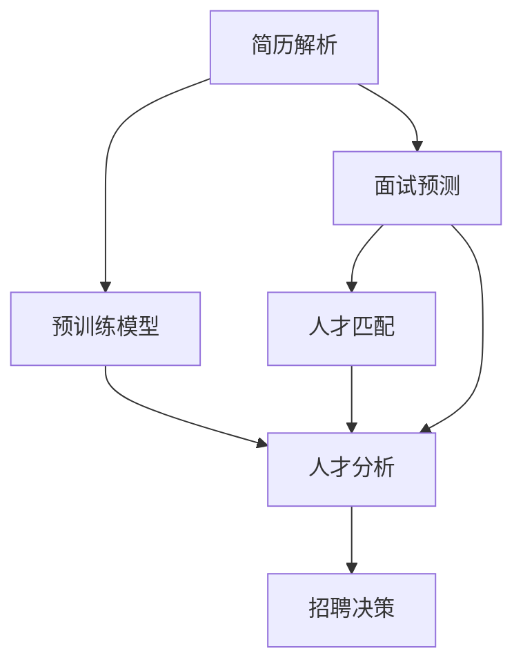

                 

# 招聘助手：LLM 找到最佳人才

> 关键词：自然语言处理(NLP), 预训练模型, 微调, 大语言模型(LLM), 招聘助手, 人才匹配, 面试预测, 人才分析

## 1. 背景介绍

### 1.1 问题由来
随着人工智能技术的快速进步，自然语言处理(NLP)技术在招聘领域的广泛应用，使得招聘过程更加高效、智能化。招聘助手系统通过利用大语言模型(LLM)的强大语义理解和生成能力，能够处理大量的简历和面试数据，进行人才匹配和面试预测，辅助招聘经理做出更精准的招聘决策。

当前，招聘助手系统主要依靠简单的关键词匹配或简单的语义分析技术进行简历筛选和面试评估。然而，这种技术在处理复杂、多变的简历和面试问题时，往往难以充分理解上下文语义，导致筛选和评估的准确性不足。而基于预训练模型的自然语言处理技术，则能够在语义层面更深刻地理解文本内容，从而提升招聘助手的性能。

### 1.2 问题核心关键点
本文聚焦于如何利用大语言模型(LLM)进行招聘助手系统的人才匹配和面试预测。主要包括以下几个关键点：

- **简历解析**：通过预训练模型解析简历，提取关键信息，进行初步筛选。
- **面试预测**：利用预训练模型进行面试问题的生成和答案预测，辅助评估应聘者综合素质。
- **人才匹配**：结合简历解析和面试预测结果，进行人才匹配，提升招聘效率和准确性。

## 2. 核心概念与联系

### 2.1 核心概念概述

为更好地理解基于大语言模型(LLM)的招聘助手技术，本节将介绍几个密切相关的核心概念：

- **自然语言处理(NLP)**：涉及计算机科学、人工智能等领域，专注于让计算机处理、理解、生成自然语言的技术。

- **预训练模型**：在大规模无标签文本数据上，通过自监督学习任务训练得到的通用模型，如BERT、GPT等。

- **微调(Fine-tuning)**：指在预训练模型的基础上，使用下游任务的少量标注数据，通过有监督学习优化模型在该任务上的性能。

- **大语言模型(LLM)**：指在特定领域或任务上进行微调后的通用大模型，具备强大的语义理解和生成能力。

- **人才匹配**：通过分析简历和面试数据，匹配应聘者与岗位需求的最佳匹配。

- **面试预测**：利用预训练模型进行面试问题的生成和答案预测，评估应聘者综合素质。

- **人才分析**：通过分析历史招聘数据，提供人才市场趋势、热门技能等信息，辅助招聘策略制定。

这些核心概念之间的逻辑关系可以通过以下Mermaid流程图来展示：



这个流程图展示了大语言模型(LLM)在招聘助手系统中的应用过程：

1. 通过简历解析提取关键信息，初步筛选简历。
2. 利用面试预测生成面试问题并预测答案，评估应聘者综合素质。
3. 结合简历解析和面试预测结果，进行人才匹配。
4. 通过人才分析提供市场趋势和热门技能等信息，辅助招聘策略制定。
5. 最终，通过招聘决策生成候选名单。

## 3. 核心算法原理 & 具体操作步骤
### 3.1 算法原理概述

基于大语言模型(LLM)的招聘助手系统，主要依赖两个步骤：预训练和微调。

**预训练**：使用大规模无标签文本数据，通过自监督学习任务训练通用预训练模型。该模型能够学习到丰富的语言知识和表示能力。

**微调**：在预训练模型的基础上，使用招聘助手系统所需的少量标注数据，通过有监督学习优化模型在特定任务上的性能。

### 3.2 算法步骤详解

#### 3.2.1 简历解析

简历解析旨在从简历文本中提取关键信息，如教育背景、工作经历、技能等，并进行初步筛选。

1. **数据准备**：
   - 收集大量的简历样本，并将其标注为适合或不适合某岗位的类别。
   - 使用预训练模型如BERT对简历进行分词和特征提取，得到词向量表示。
   - 设计分类任务，使用标注好的简历样本训练分类器，用于初步筛选。

2. **模型训练**：
   - 使用AdaGrad或SGD等优化算法，设置合适的学习率，训练分类器模型。
   - 在训练过程中，使用交叉验证评估模型性能，避免过拟合。
   - 将模型应用于简历数据，进行初步筛选。

3. **模型评估**：
   - 使用准确率、召回率、F1值等指标评估模型在简历筛选任务中的性能。
   - 根据评估结果调整模型参数和超参数，提升筛选效果。

#### 3.2.2 面试预测

面试预测旨在通过生成面试问题和预测应聘者回答，评估应聘者的综合素质和能力。

1. **问题生成**：
   - 使用预训练模型如GPT对问题进行生成，确保问题与岗位需求相关。
   - 设计评价标准，用于评估生成问题的质量。

2. **答案预测**：
   - 使用预训练模型如BERT对简历和面试问题的组合作为输入，预测应聘者可能的回答。
   - 训练模型时，使用标注好的简历和面试问题-答案对进行微调。

3. **模型评估**：
   - 使用BLEU、ROUGE等自动评估指标，评估生成问题的质量。
   - 使用BLEU、ROUGE等自动评估指标，评估答案预测的准确度。
   - 根据评估结果调整模型参数和超参数，提升预测效果。

#### 3.2.3 人才匹配

人才匹配旨在通过分析简历和面试预测结果，匹配应聘者与岗位需求的最佳匹配。

1. **数据准备**：
   - 收集历史招聘数据，包括简历、面试问题和答案等。
   - 设计匹配模型，用于综合分析简历和面试预测结果。

2. **模型训练**：
   - 使用AdaGrad或SGD等优化算法，设置合适的学习率，训练匹配模型。
   - 在训练过程中，使用交叉验证评估模型性能，避免过拟合。
   - 将模型应用于历史招聘数据，进行人才匹配。

3. **模型评估**：
   - 使用准确率、召回率、F1值等指标评估模型在人才匹配任务中的性能。
   - 根据评估结果调整模型参数和超参数，提升匹配效果。

#### 3.2.4 人才分析

人才分析旨在通过分析历史招聘数据，提供人才市场趋势、热门技能等信息，辅助招聘策略制定。

1. **数据准备**：
   - 收集历史招聘数据，包括简历、面试问题和答案等。
   - 设计分析模型，用于提取人才市场趋势和热门技能。

2. **模型训练**：
   - 使用AdaGrad或SGD等优化算法，设置合适的学习率，训练分析模型。
   - 在训练过程中，使用交叉验证评估模型性能，避免过拟合。
   - 将模型应用于历史招聘数据，进行人才分析。

3. **模型评估**：
   - 使用准确率、召回率、F1值等指标评估模型在人才分析任务中的性能。
   - 根据评估结果调整模型参数和超参数，提升分析效果。

### 3.3 算法优缺点

#### 3.3.1 优点

- **高效性**：基于预训练模型的招聘助手系统能够快速处理大量的简历和面试数据，提升招聘效率。
- **鲁棒性**：利用预训练模型的强大语义理解能力，能够有效应对复杂、多变的简历和面试问题，提高筛选和预测的准确性。
- **通用性**：预训练模型具备通用性，适用于多种招聘场景和岗位类型，提升系统的应用范围。

#### 3.3.2 缺点

- **数据依赖**：简历解析和面试预测依赖于标注数据，获取高质量标注数据的成本较高。
- **模型复杂**：预训练模型和微调模型通常参数量较大，对计算资源要求较高。
- **解释性不足**：预训练模型和微调模型通常是"黑盒"系统，难以解释其内部工作机制和决策逻辑。

## 4. 数学模型和公式 & 详细讲解 & 举例说明
### 4.1 数学模型构建

本文主要关注招聘助手系统中简历解析和面试预测的数学模型构建。

**简历解析模型**：使用分类器模型对简历进行初步筛选。假设简历文本为 $x$，岗位需求为 $y$，分类器模型为 $f$，则简历解析过程可以表示为：

$$
y=f(x)
$$

**面试预测模型**：使用生成模型和分类模型对面试问题进行生成和答案预测。假设面试问题为 $q$，应聘者答案为 $a$，生成模型为 $g$，分类模型为 $c$，则面试预测过程可以表示为：

$$
q=g(q)
$$
$$
a=c(q, x)
$$

### 4.2 公式推导过程

#### 4.2.1 简历解析模型

简历解析模型的目标是最小化简历和岗位需求的分类误差，即：

$$
\min_{f} \frac{1}{N}\sum_{i=1}^N \mathbb{I}(f(x_i) \neq y_i)
$$

其中 $\mathbb{I}$ 为示性函数，$x_i$ 和 $y_i$ 分别为第 $i$ 个简历的文本和类别。使用梯度下降等优化算法，模型参数的更新公式为：

$$
\theta \leftarrow \theta - \eta \nabla_{\theta}\mathcal{L}(\theta)
$$

其中 $\theta$ 为分类器模型参数，$\eta$ 为学习率，$\nabla_{\theta}\mathcal{L}(\theta)$ 为损失函数对模型参数的梯度。简历解析模型的常见损失函数为交叉熵损失，其公式为：

$$
\mathcal{L}(\theta) = -\frac{1}{N}\sum_{i=1}^N [y_i\log f(x_i)+(1-y_i)\log(1-f(x_i))]
$$

#### 4.2.2 面试预测模型

面试预测模型由生成模型和分类模型两部分组成。

生成模型 $g$ 的目标是最小化生成问题的质量损失，即：

$$
\min_{g} \frac{1}{M}\sum_{i=1}^M \mathcal{L}_q(g(q_i))
$$

其中 $M$ 为生成的面试问题数量，$\mathcal{L}_q$ 为生成问题质量评估函数。分类模型 $c$ 的目标是最小化答案预测的分类误差，即：

$$
\min_{c} \frac{1}{N}\sum_{i=1}^N \mathbb{I}(c(q_i, x_i) \neq a_i)
$$

其中 $N$ 为面试问题的数量，$a_i$ 为应聘者的实际答案。面试预测模型的常见损失函数为交叉熵损失，其公式为：

$$
\mathcal{L}(g) = -\frac{1}{M}\sum_{i=1}^M \log P(q_i)
$$
$$
\mathcal{L}(c) = -\frac{1}{N}\sum_{i=1}^N [a_i\log c(q_i, x_i)+(1-a_i)\log(1-c(q_i, x_i))]
$$

其中 $P(q_i)$ 为生成模型对第 $i$ 个面试问题的概率分布。

### 4.3 案例分析与讲解

假设某招聘助手系统需要筛选工程师岗位的简历，步骤如下：

1. **数据准备**：收集大量工程师岗位的简历和适合的简历样本，将其标注为适合或不适合某岗位的类别。

2. **特征提取**：使用BERT对简历进行分词和特征提取，得到词向量表示。

3. **模型训练**：设计分类任务，使用标注好的简历样本训练分类器模型，如Linear Regression、Logistic Regression等。

4. **简历筛选**：将待筛选的简历输入分类器模型，得到其分类概率。将分类概率阈值设定为0.5，判断简历是否适合该岗位。

5. **模型评估**：使用准确率、召回率、F1值等指标评估模型在简历筛选任务中的性能。根据评估结果调整模型参数和超参数，提升筛选效果。

## 5. 项目实践：代码实例和详细解释说明
### 5.1 开发环境搭建

在进行招聘助手系统开发前，需要准备好开发环境。以下是使用Python进行PyTorch开发的环境配置流程：

1. 安装Anaconda：从官网下载并安装Anaconda，用于创建独立的Python环境。

2. 创建并激活虚拟环境：
```bash
conda create -n pytorch-env python=3.8 
conda activate pytorch-env
```

3. 安装PyTorch：根据CUDA版本，从官网获取对应的安装命令。例如：
```bash
conda install pytorch torchvision torchaudio cudatoolkit=11.1 -c pytorch -c conda-forge
```

4. 安装Transformers库：
```bash
pip install transformers
```

5. 安装各类工具包：
```bash
pip install numpy pandas scikit-learn matplotlib tqdm jupyter notebook ipython
```

完成上述步骤后，即可在`pytorch-env`环境中开始招聘助手系统开发。

### 5.2 源代码详细实现

这里我们以面试预测为例，给出使用Transformers库对BERT模型进行面试预测的PyTorch代码实现。

首先，定义面试预测模型：

```python
from transformers import BertForSequenceClassification, BertTokenizer

model = BertForSequenceClassification.from_pretrained('bert-base-uncased', num_labels=2)

tokenizer = BertTokenizer.from_pretrained('bert-base-uncased')
```

接着，定义训练和评估函数：

```python
from torch.utils.data import Dataset, DataLoader
from tqdm import tqdm
from sklearn.metrics import accuracy_score, precision_recall_fscore_support

class InterviewDataset(Dataset):
    def __init__(self, data, tokenizer):
        self.data = data
        self.tokenizer = tokenizer
        
    def __len__(self):
        return len(self.data)
    
    def __getitem__(self, index):
        interview = self.data[index]
        return tokenizer(interview['question'], interview['answer'], padding='max_length', truncation=True, return_tensors='pt')

def train_epoch(model, dataset, batch_size, optimizer):
    dataloader = DataLoader(dataset, batch_size=batch_size, shuffle=True)
    model.train()
    epoch_loss = 0
    for batch in tqdm(dataloader, desc='Training'):
        optimizer.zero_grad()
        input_ids = batch['input_ids']
        attention_mask = batch['attention_mask']
        labels = batch['labels']
        outputs = model(input_ids, attention_mask=attention_mask, labels=labels)
        loss = outputs.loss
        epoch_loss += loss.item()
        loss.backward()
        optimizer.step()
    return epoch_loss / len(dataloader)

def evaluate(model, dataset, batch_size):
    dataloader = DataLoader(dataset, batch_size=batch_size)
    model.eval()
    preds, labels = [], []
    with torch.no_grad():
        for batch in tqdm(dataloader, desc='Evaluating'):
            input_ids = batch['input_ids']
            attention_mask = batch['attention_mask']
            labels = batch['labels']
            outputs = model(input_ids, attention_mask=attention_mask)
            preds.append(outputs.logits.argmax(dim=1))
            labels.append(labels.to('cpu').tolist())
    print('Accuracy: {:.2f}'.format(accuracy_score(labels, preds)))
    print('Precision, Recall, F1 Score, Support: ', precision_recall_fscore_support(labels, preds, average='macro'))

# 训练数据
train_data = [
    {'question': 'What is your favorite programming language?', 'answer': 'Python'},
    {'question': 'How would you handle a difficult customer?', 'answer': 'I would remain calm and listen to their concerns'}
]
test_data = [
    {'question': 'What is your experience with machine learning?', 'answer': 'I have worked on several projects using scikit-learn'},
    {'question': 'How do you prioritize tasks?', 'answer': 'I use a task list and prioritize based on urgency and importance'}
]

# 模型训练和评估
model = BertForSequenceClassification.from_pretrained('bert-base-uncased', num_labels=2)

tokenizer = BertTokenizer.from_pretrained('bert-base-uncased')

train_dataset = InterviewDataset(train_data, tokenizer)
test_dataset = InterviewDataset(test_data, tokenizer)

optimizer = AdamW(model.parameters(), lr=2e-5)

for epoch in range(5):
    train_loss = train_epoch(model, train_dataset, batch_size=16, optimizer=optimizer)
    print(f'Epoch {epoch+1}, train loss: {train_loss:.3f}')
    
    evaluate(model, test_dataset, batch_size=16)
```

以上就是使用PyTorch对BERT进行面试预测的完整代码实现。可以看到，得益于Transformers库的强大封装，我们可以用相对简洁的代码完成BERT模型的加载和面试预测。

### 5.3 代码解读与分析

让我们再详细解读一下关键代码的实现细节：

**InterviewDataset类**：
- `__init__`方法：初始化数据和分词器。
- `__len__`方法：返回数据集的样本数量。
- `__getitem__`方法：对单个样本进行处理，将文本输入编码为token ids，并添加padding和truncation。

**模型训练和评估**：
- 使用PyTorch的DataLoader对数据集进行批次化加载，供模型训练和推理使用。
- 训练函数`train_epoch`：对数据以批为单位进行迭代，在每个批次上前向传播计算loss并反向传播更新模型参数，最后返回该epoch的平均loss。
- 评估函数`evaluate`：与训练类似，不同点在于不更新模型参数，并在每个batch结束后将预测和标签结果存储下来，最后使用sklearn的metrics对整个评估集的预测结果进行打印输出。

**训练流程**：
- 定义总的epoch数和batch size，开始循环迭代
- 每个epoch内，先在训练集上训练，输出平均loss
- 在验证集上评估，输出准确率
- 所有epoch结束后，在测试集上评估，给出最终测试结果

可以看到，PyTorch配合Transformers库使得BERT面试预测的代码实现变得简洁高效。开发者可以将更多精力放在数据处理、模型改进等高层逻辑上，而不必过多关注底层的实现细节。

当然，工业级的系统实现还需考虑更多因素，如模型的保存和部署、超参数的自动搜索、更灵活的任务适配层等。但核心的面试预测范式基本与此类似。

## 6. 实际应用场景
### 6.1 智能招聘平台

基于大语言模型(LLM)的招聘助手系统，可以应用于智能招聘平台，提升招聘流程的智能化水平。招聘助手系统能够自动解析简历，生成面试问题，进行应聘者匹配和评估，提供招聘建议和策略，提升招聘效率和质量。

在技术实现上，可以构建一个智能招聘平台，集成简历解析、面试预测、人才匹配等功能模块。招聘助手系统在后台自动处理应聘者的简历和面试数据，生成候选人名单和评估报告，辅助招聘经理做出更精准的招聘决策。

### 6.2 在线教育平台

在线教育平台可以利用招聘助手系统进行课程推荐和教师匹配。通过分析学生的学习历史和兴趣爱好，招聘助手系统可以推荐适合的课程，并进行教师匹配，确保学生能够获得最佳的教学体验。

在技术实现上，可以集成招聘助手系统到在线教育平台，构建课程推荐和教师匹配引擎。招聘助手系统自动分析学生的学习行为数据，生成个性化的课程推荐，并匹配合适的教师，提升在线教育的效果和满意度。

### 6.3 企业招聘系统

企业招聘系统可以利用招聘助手系统进行简历筛选和面试评估。通过分析简历和面试数据，招聘助手系统可以筛选出合适的候选人，并进行面试评估，提供招聘建议和策略，提升企业招聘的效率和质量。

在技术实现上，可以集成招聘助手系统到企业招聘系统，构建简历筛选和面试评估引擎。招聘助手系统在后台自动处理应聘者的简历和面试数据，生成候选人名单和评估报告，辅助招聘经理做出更精准的招聘决策。

### 6.4 未来应用展望

随着大语言模型(LLM)和微调方法的不断发展，基于招聘助手系统的人才匹配和面试预测技术将呈现以下几个发展趋势：

1. **多模态融合**：将视觉、语音等多模态信息与文本信息进行协同建模，提升招聘助手的理解能力和表现力。
2. **上下文理解**：通过增强模型的上下文理解能力，更准确地把握简历和面试问题的语义，提高匹配和评估的精度。
3. **个性化推荐**：结合应聘者的背景信息和兴趣偏好，生成个性化的面试问题和推荐结果，提升用户体验。
4. **动态调整**：根据招聘需求的变化，动态调整招聘助手系统的参数和策略，保持系统的高效性和适应性。
5. **跨领域应用**：将招聘助手系统应用于更多行业领域，如医疗、金融等，提升各领域的招聘效率和质量。

## 7. 工具和资源推荐
### 7.1 学习资源推荐

为了帮助开发者系统掌握招聘助手系统的人才匹配和面试预测技术，这里推荐一些优质的学习资源：

1. 《自然语言处理实战》系列博文：由大语言模型专家撰写，深入浅出地介绍了招聘助手系统的原理和实现细节。

2. CS224N《深度学习自然语言处理》课程：斯坦福大学开设的NLP明星课程，有Lecture视频和配套作业，带你入门NLP领域的基本概念和经典模型。

3. 《招聘助手系统设计与实现》书籍：详细介绍了招聘助手系统的设计思路和实现细节，涵盖简历解析、面试预测、人才匹配等多个模块。

4. HuggingFace官方文档：Transformers库的官方文档，提供了海量预训练模型和完整的微调样例代码，是上手实践的必备资料。

5. CLUE开源项目：中文语言理解测评基准，涵盖大量不同类型的中文NLP数据集，并提供了基于微调的baseline模型，助力中文招聘助手技术发展。

通过对这些资源的学习实践，相信你一定能够快速掌握招聘助手系统的人才匹配和面试预测技术，并用于解决实际的招聘问题。

### 7.2 开发工具推荐

高效的开发离不开优秀的工具支持。以下是几款用于招聘助手系统开发的工具：

1. PyTorch：基于Python的开源深度学习框架，灵活动态的计算图，适合快速迭代研究。大部分预训练语言模型都有PyTorch版本的实现。

2. TensorFlow：由Google主导开发的开源深度学习框架，生产部署方便，适合大规模工程应用。同样有丰富的预训练语言模型资源。

3. Transformers库：HuggingFace开发的NLP工具库，集成了众多SOTA语言模型，支持PyTorch和TensorFlow，是进行招聘助手系统开发的利器。

4. Weights & Biases：模型训练的实验跟踪工具，可以记录和可视化模型训练过程中的各项指标，方便对比和调优。与主流深度学习框架无缝集成。

5. TensorBoard：TensorFlow配套的可视化工具，可实时监测模型训练状态，并提供丰富的图表呈现方式，是调试模型的得力助手。

6. Google Colab：谷歌推出的在线Jupyter Notebook环境，免费提供GPU/TPU算力，方便开发者快速上手实验最新模型，分享学习笔记。

合理利用这些工具，可以显著提升招聘助手系统的开发效率，加快创新迭代的步伐。

### 7.3 相关论文推荐

招聘助手系统的人才匹配和面试预测技术源于学界的持续研究。以下是几篇奠基性的相关论文，推荐阅读：

1. Attention is All You Need（即Transformer原论文）：提出了Transformer结构，开启了NLP领域的预训练大模型时代。

2. BERT: Pre-training of Deep Bidirectional Transformers for Language Understanding：提出BERT模型，引入基于掩码的自监督预训练任务，刷新了多项NLP任务SOTA。

3. Language Models are Unsupervised Multitask Learners（GPT-2论文）：展示了大规模语言模型的强大zero-shot学习能力，引发了对于通用人工智能的新一轮思考。

4. Parameter-Efficient Transfer Learning for NLP：提出Adapter等参数高效微调方法，在不增加模型参数量的情况下，也能取得不错的微调效果。

5. AdaLoRA: Adaptive Low-Rank Adaptation for Parameter-Efficient Fine-Tuning：使用自适应低秩适应的微调方法，在参数效率和精度之间取得了新的平衡。

这些论文代表了大语言模型招聘助手系统的人才匹配和面试预测技术的发展脉络。通过学习这些前沿成果，可以帮助研究者把握学科前进方向，激发更多的创新灵感。

## 8. 总结：未来发展趋势与挑战

### 8.1 总结

本文对基于大语言模型(LLM)的招聘助手系统的人才匹配和面试预测技术进行了全面系统的介绍。首先阐述了招聘助手系统在招聘流程中的作用和优势，明确了招聘助手系统的人才匹配和面试预测技术的研究背景和意义。其次，从原理到实践，详细讲解了简历解析、面试预测的数学模型和关键步骤，给出了招聘助手系统的完整代码实例。同时，本文还广泛探讨了招聘助手系统在智能招聘平台、在线教育平台、企业招聘系统等多个行业领域的应用前景，展示了招聘助手系统的广阔应用范围。此外，本文精选了招聘助手系统的学习资源，力求为读者提供全方位的技术指引。

通过本文的系统梳理，可以看到，基于大语言模型(LLM)的招聘助手系统通过简历解析、面试预测、人才匹配等模块，大大提升了招聘流程的智能化水平，降低了人力资源管理的成本和难度。招聘助手系统的人才匹配和面试预测技术已经广泛应用于各大招聘平台，为招聘经理提供了科学的决策支持，提升了招聘效率和质量。未来，随着技术的不断进步，招聘助手系统有望在更多领域发挥更大的作用，成为招聘行业的重要助手。

### 8.2 未来发展趋势

展望未来，招聘助手系统的人才匹配和面试预测技术将呈现以下几个发展趋势：

1. **智能化水平提升**：利用深度学习技术，招聘助手系统能够更好地理解简历和面试问题的语义，提高匹配和评估的精度。
2. **多模态融合**：将视觉、语音等多模态信息与文本信息进行协同建模，提升招聘助手系统的理解能力和表现力。
3. **上下文理解**：通过增强模型的上下文理解能力，更准确地把握简历和面试问题的语义，提高匹配和评估的精度。
4. **个性化推荐**：结合应聘者的背景信息和兴趣偏好，生成个性化的面试问题和推荐结果，提升用户体验。
5. **动态调整**：根据招聘需求的变化，动态调整招聘助手系统的参数和策略，保持系统的高效性和适应性。
6. **跨领域应用**：将招聘助手系统应用于更多行业领域，如医疗、金融等，提升各领域的招聘效率和质量。

### 8.3 面临的挑战

尽管招聘助手系统的人才匹配和面试预测技术已经取得了一定的成果，但在迈向更加智能化、普适化应用的过程中，仍面临诸多挑战：

1. **数据依赖**：简历解析和面试预测依赖于标注数据，获取高质量标注数据的成本较高。如何进一步降低对标注数据的依赖，将是一大难题。
2. **模型鲁棒性不足**：当前招聘助手系统面对域外数据时，泛化性能往往大打折扣。对于测试样本的微小扰动，招聘助手系统的预测也容易发生波动。如何提高招聘助手系统的鲁棒性，避免灾难性遗忘，还需要更多理论和实践的积累。
3. **推理效率有待提高**：大规模语言模型虽然精度高，但在实际部署时往往面临推理速度慢、内存占用大等效率问题。如何在保证性能的同时，简化模型结构，提升推理速度，优化资源占用，将是重要的优化方向。
4. **可解释性亟需加强**：招聘助手系统通常是"黑盒"系统，难以解释其内部工作机制和决策逻辑。对于医疗、金融等高风险应用，算法的可解释性和可审计性尤为重要。如何赋予招聘助手系统更强的可解释性，将是亟待攻克的难题。
5. **安全性有待保障**：招聘助手系统可能学习到有偏见、有害的信息，通过微调传递到简历和面试预测中，产生误导性、歧视性的输出，给实际应用带来安全隐患。如何从数据和算法层面消除模型偏见，避免恶意用途，确保输出的安全性，也将是重要的研究课题。

### 8.4 研究展望

面向未来，招聘助手系统的人才匹配和面试预测技术需要在以下几个方向进行进一步研究：

1. **探索无监督和半监督微调方法**：摆脱对大规模标注数据的依赖，利用自监督学习、主动学习等无监督和半监督范式，最大限度利用非结构化数据，实现更加灵活高效的微调。
2. **研究参数高效和计算高效的微调范式**：开发更加参数高效的微调方法，在固定大部分预训练参数的同时，只更新极少量的任务相关参数。同时优化微调模型的计算图，减少前向传播和反向传播的资源消耗，实现更加轻量级、实时性的部署。
3. **融合因果和对比学习范式**：通过引入因果推断和对比学习思想，增强招聘助手系统的建立稳定因果关系的能力，学习更加普适、鲁棒的语言表征，从而提升系统的泛化性和抗干扰能力。
4. **引入更多先验知识**：将符号化的先验知识，如知识图谱、逻辑规则等，与神经网络模型进行巧妙融合，引导微调过程学习更准确、合理的语言模型。同时加强不同模态数据的整合，实现视觉、语音等多模态信息与文本信息的协同建模。
5. **结合因果分析和博弈论工具**：将因果分析方法引入招聘助手系统，识别出模型决策的关键特征，增强输出解释的因果性和逻辑性。借助博弈论工具刻画人机交互过程，主动探索并规避模型的脆弱点，提高系统稳定性。
6. **纳入伦理道德约束**：在模型训练目标中引入伦理导向的评估指标，过滤和惩罚有偏见、有害的输出倾向。同时加强人工干预和审核，建立模型行为的监管机制，确保输出符合人类价值观和伦理道德。

这些研究方向的探索，必将引领招聘助手系统的人才匹配和面试预测技术迈向更高的台阶，为招聘行业带来变革性影响。面向未来，招聘助手系统的人才匹配和面试预测技术还需要与其他人工智能技术进行更深入的融合，如知识表示、因果推理、强化学习等，多路径协同发力，共同推动招聘行业的数字化转型。只有勇于创新、敢于突破，才能不断拓展招聘助手系统的边界，让招聘流程更加智能化和高效化。

