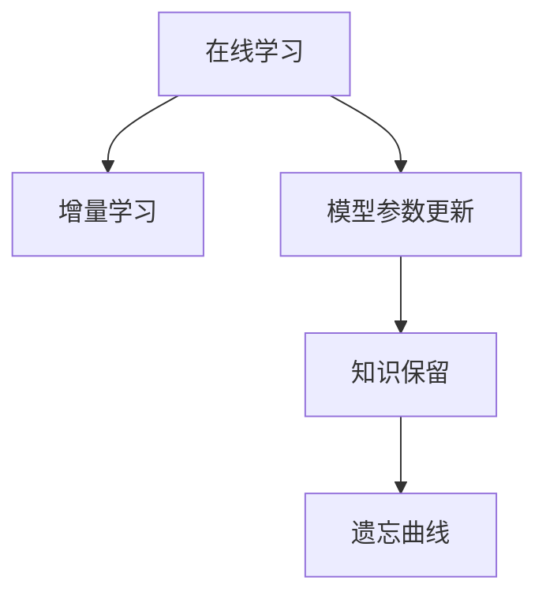

                 

## 1. 背景介绍

### 1.1 问题由来
随着人工智能技术的飞速发展，机器学习系统在各行各业的应用越来越广泛，但传统的人工智能模型在面对复杂多变的环境时，常面临无法适应新知识、泛化能力不足等问题。尤其是在自然语言处理、医疗诊断等领域，模型需要不断更新知识库以保持其有效性和实用性。因此，如何构建一个具备持续学习能力的人工智能系统，成为了当下热门的研究课题。

### 1.2 问题核心关键点
持续学习是指机器学习系统在不断获取新数据的过程中，能够自动更新模型参数，保持并提升其对新数据的适应能力，避免因过拟合或知识老化导致的性能下降。当前持续学习主要有两种形式：

1. **在线学习(Online Learning)**：系统在每次新数据到来时，都实时更新模型参数。适用于数据流较稳定、计算资源充足的场景。
2. **增量学习(Incremental Learning)**：系统将新数据作为额外训练集，周期性地对模型进行重新训练，以保持模型对新知识的适应能力。适用于数据流不稳定或计算资源有限的场景。

持续学习能够有效解决传统模型在新数据下表现不佳的问题，使得系统能够在不断变化的现实环境中保持高效、准确。

### 1.3 问题研究意义
研究持续学习技术，对于提升人工智能系统的鲁棒性、适应性和实用性具有重要意义：

1. **提升系统性能**：通过不断适应新知识，持续学习系统能够持续提升在特定任务上的性能。
2. **降低成本**：相较于从头训练新模型，持续学习系统只需对新数据进行微调，大幅降低计算和标注成本。
3. **实现知识积累**：持续学习系统能够动态更新知识库，逐步积累高质量数据，提升模型性能。
4. **支持实时应用**：在线学习系统能够实时处理新数据，适用于需要即时响应的场景，如智能客服、推荐系统等。
5. **应对数据变化**：增量学习系统能够灵活应对数据流的不稳定性，适用于数据量变化频繁的场景，如社交媒体情感分析、实时监控等。

## 2. 核心概念与联系

### 2.1 核心概念概述

为更好地理解持续学习机制，本节将介绍几个关键概念：

- **在线学习(Online Learning)**：系统在每次新数据到来时，都实时更新模型参数。适用于数据流较稳定、计算资源充足的场景。
- **增量学习(Incremental Learning)**：系统将新数据作为额外训练集，周期性地对模型进行重新训练，以保持模型对新知识的适应能力。适用于数据流不稳定或计算资源有限的场景。
- **模型参数更新(Parameter Update)**：在新数据到来时，使用优化算法（如梯度下降）更新模型参数，以适应新数据的特性。
- **遗忘曲线(Forgotten Curve)**：随着新数据不断加入，老数据逐渐被遗忘，模型参数会逐渐与原始训练状态产生偏差。
- **知识保留(Knowledge Retention)**：持续学习系统通过优化算法和技术手段，保持模型对已有知识的长期记忆，避免遗忘。

这些核心概念之间的逻辑关系可以通过以下Mermaid流程图来展示：



这个流程图展示了几类持续学习的关键概念及其之间的关系：

1. 在线学习是增量学习的一种特殊形式，适用于数据流稳定、计算资源充足的场景。
2. 模型参数更新是增量学习的核心步骤，通过优化算法更新模型参数。
3. 知识保留是增量学习的关键技术，通过优化算法和技术手段，保持模型对已有知识的长期记忆。
4. 遗忘曲线描述了持续学习过程中模型对已有知识的遗忘程度，需要通过知识保留技术进行缓解。

## 3. 核心算法原理 & 具体操作步骤
### 3.1 算法原理概述

持续学习的核心思想是：在每次新数据到来时，更新模型参数以适应新数据，同时通过优化算法和技术手段，保持对已有知识的长期记忆，防止遗忘。

形式化地，假设持续学习模型为 $M_{\theta}$，其中 $\theta$ 为模型参数。给定数据流 $\mathcal{D} = \{x_1, x_2, ..., x_t, ...\}$，持续学习的目标是最小化模型在数据流上的累计损失：

$$
\min_{\theta} \sum_{i=1}^t \ell(M_{\theta}(x_i), y_i)
$$

其中 $\ell$ 为损失函数，$y_i$ 为 $x_i$ 的标签。在线学习系统实时更新模型参数，而增量学习系统周期性地对模型进行重新训练。

### 3.2 算法步骤详解

基于持续学习的核心思想，持续学习的实施步骤主要包括以下几个关键环节：

**Step 1: 准备数据流**
- 收集数据流 $\mathcal{D} = \{x_1, x_2, ..., x_t, ...\}$，划分为训练集、验证集和测试集。
- 为在线学习系统准备实时数据流接口，为增量学习系统准备批量数据输入接口。

**Step 2: 设置模型和优化器**
- 选择合适的预训练模型 $M_{\theta}$ 作为初始化参数，如BERT、GPT等。
- 设置优化算法及其参数，如AdamW、SGD等，设置学习率、批大小、迭代轮数等。
- 设置遗忘曲线缓解技术，如正则化、参数衰减等。

**Step 3: 在线学习步骤**
- 实时接收新数据 $x_t$ 并输入模型 $M_{\theta}$，计算损失函数 $\ell$。
- 根据优化算法（如梯度下降）更新模型参数 $\theta$。
- 记录并监控遗忘曲线，必要时对参数进行重置或更新。

**Step 4: 增量学习步骤**
- 将新数据 $x_t$ 作为额外训练集，使用优化算法对模型进行重新训练。
- 更新模型参数 $\theta$，使其适应新数据。
- 记录并监控遗忘曲线，必要时对参数进行重置或更新。

### 3.3 算法优缺点

持续学习算法具有以下优点：
1. 适应性强：能够实时或周期性地适应新数据，提升模型在不断变化环境中的表现。
2. 泛化能力强：通过不断学习新数据，模型对已有知识的泛化能力逐步增强。
3. 降低成本：相较于从头训练新模型，持续学习只需对新数据进行微调，降低计算和标注成本。
4. 灵活应用：适用于各种场景，如实时推荐系统、在线客服等。

同时，该算法也存在一定的局限性：
1. 对数据流稳定性要求高：对于数据流不稳定或计算资源有限的场景，增量学习的效果可能不如在线学习。
2. 遗忘曲线问题：随新数据不断加入，模型对已有数据的遗忘程度逐渐增加，需要通过知识保留技术进行缓解。
3. 模型参数量大：超大规模模型的更新和存储成本较高，需要特殊的技术手段进行处理。

尽管存在这些局限性，但持续学习作为一种重要的学习范式，在多模态学习、跨领域知识迁移等前沿领域得到了广泛应用。未来相关研究将集中在如何进一步优化遗忘曲线，提升增量学习的效率和效果。

### 3.4 算法应用领域

持续学习技术已经被广泛应用于多个领域，其典型应用场景包括：

1. **推荐系统**：推荐系统需要实时更新用户行为数据，通过在线学习或增量学习实时调整推荐结果。
2. **智能客服**：智能客服系统需要实时接收和处理用户查询，通过在线学习及时更新对话模型。
3. **在线广告投放**：在线广告投放需要实时跟踪用户行为，通过在线学习及时调整广告策略。
4. **实时监控**：实时监控系统需要不断更新监控数据，通过增量学习及时发现异常情况。
5. **智能交通管理**：智能交通管理系统需要实时更新交通数据，通过增量学习优化交通控制策略。

除此之外，持续学习技术也在自然语言处理、金融预测、医疗诊断等领域得到了广泛应用，为这些领域的数据分析和决策支持提供了强大的技术支持。

## 4. 数学模型和公式 & 详细讲解 & 举例说明
### 4.1 数学模型构建

为更好地理解持续学习的数学模型，本节将使用数学语言对持续学习的核心模型进行更加严格的刻画。

记持续学习模型为 $M_{\theta}$，其中 $\theta$ 为模型参数。假设数据流为 $\mathcal{D} = \{x_1, x_2, ..., x_t, ...\}$，每个数据点 $x_t$ 对应的标签为 $y_t$。

定义模型 $M_{\theta}$ 在数据流 $\mathcal{D}$ 上的累计损失函数为：

$$
\mathcal{L}_{cum}(\theta) = \sum_{i=1}^t \ell(M_{\theta}(x_i), y_i)
$$

其中 $\ell$ 为损失函数，用于衡量模型预测与真实标签之间的差异。在线学习系统在每次新数据 $x_t$ 到来时，更新模型参数 $\theta$ 以最小化当前损失：

$$
\theta \leftarrow \theta - \eta \nabla_{\theta} \ell(M_{\theta}(x_t), y_t)
$$

其中 $\eta$ 为学习率，$\nabla_{\theta} \ell$ 为损失函数对模型参数的梯度，可通过反向传播算法高效计算。

对于增量学习系统，周期性地对模型进行重新训练，更新参数 $\theta$ 以最小化累计损失：

$$
\theta \leftarrow \theta - \eta \nabla_{\theta} \mathcal{L}_{cum}(\theta)
$$

增量学习系统可以采用 mini-batch SGD 等优化算法，周期性地更新模型参数，避免参数在每次更新时发生剧烈变化。

### 4.2 公式推导过程

以下我们以推荐系统为例，推导在线学习和增量学习的数学模型。

假设在线推荐系统接收数据流 $\mathcal{D} = \{x_1, x_2, ..., x_t, ...\}$，每个数据点 $x_t$ 包含用户行为数据和物品特征，$y_t$ 为物品ID。推荐系统通过在线学习或增量学习，实时调整推荐模型 $M_{\theta}$，使其最大化用户满意度。

在线学习过程中，假设每次新数据 $x_t$ 到来时，都实时计算损失函数 $\ell$ 并更新模型参数 $\theta$：

$$
\theta \leftarrow \theta - \eta \nabla_{\theta} \ell(M_{\theta}(x_t), y_t)
$$

增量学习过程中，假设系统每隔一定时间间隔 $T$，将新数据 $x_t, ..., x_{t+T-1}$ 作为额外训练集，重新训练推荐模型：

$$
\theta \leftarrow \theta - \eta \nabla_{\theta} \sum_{i=t}^{t+T-1} \ell(M_{\theta}(x_i), y_i)
$$

在线学习和增量学习的区别在于，在线学习实时更新模型参数，而增量学习周期性地对模型进行重新训练。

### 4.3 案例分析与讲解

假设我们有一个在线推荐系统，用户每浏览一个物品，系统会记录该物品的用户满意度 $y_t$，并实时更新推荐模型。系统使用交叉熵损失函数 $\ell$ 计算预测值 $M_{\theta}(x_t)$ 与真实满意度 $y_t$ 之间的差异：

$$
\ell(M_{\theta}(x_t), y_t) = -y_t \log M_{\theta}(x_t) + (1-y_t) \log (1-M_{\theta}(x_t))
$$

在线学习系统每次接收新数据时，根据上述公式计算损失函数，并通过梯度下降算法更新模型参数：

$$
\theta \leftarrow \theta - \eta \frac{-y_t}{M_{\theta}(x_t)} + \eta \frac{1-y_t}{1-M_{\theta}(x_t)}
$$

增量学习系统每隔一定时间间隔，将新数据作为额外训练集，重新训练推荐模型。假设系统每隔1小时更新一次模型参数，使用 mini-batch SGD 优化算法更新参数：

$$
\theta \leftarrow \theta - \eta \nabla_{\theta} \sum_{i=t}^{t+59} \ell(M_{\theta}(x_i), y_i)
$$

在实际应用中，系统需要根据数据流的特点和计算资源的可用性，选择合适的时间间隔和优化算法。

## 5. 项目实践：代码实例和详细解释说明
### 5.1 开发环境搭建

在进行持续学习实践前，我们需要准备好开发环境。以下是使用Python进行PyTorch开发的环境配置流程：

1. 安装Anaconda：从官网下载并安装Anaconda，用于创建独立的Python环境。

2. 创建并激活虚拟环境：
```bash
conda create -n pytorch-env python=3.8 
conda activate pytorch-env
```

3. 安装PyTorch：根据CUDA版本，从官网获取对应的安装命令。例如：
```bash
conda install pytorch torchvision torchaudio cudatoolkit=11.1 -c pytorch -c conda-forge
```

4. 安装各类工具包：
```bash
pip install numpy pandas scikit-learn matplotlib tqdm jupyter notebook ipython
```

完成上述步骤后，即可在`pytorch-env`环境中开始持续学习实践。

### 5.2 源代码详细实现

这里我们以在线推荐系统为例，给出使用PyTorch进行推荐系统持续学习的PyTorch代码实现。

首先，定义推荐模型的数据处理函数：

```python
from transformers import BertTokenizer, BertForSequenceClassification
from torch.utils.data import Dataset
import torch

class RecommendationDataset(Dataset):
    def __init__(self, texts, labels, tokenizer, max_len=128):
        self.texts = texts
        self.labels = labels
        self.tokenizer = tokenizer
        self.max_len = max_len
        
    def __len__(self):
        return len(self.texts)
    
    def __getitem__(self, item):
        text = self.texts[item]
        label = self.labels[item]
        
        encoding = self.tokenizer(text, return_tensors='pt', max_length=self.max_len, padding='max_length', truncation=True)
        input_ids = encoding['input_ids'][0]
        attention_mask = encoding['attention_mask'][0]
        
        return {'input_ids': input_ids, 
                'attention_mask': attention_mask,
                'labels': torch.tensor(label, dtype=torch.long)}
```

然后，定义推荐模型的训练和评估函数：

```python
from transformers import BertForSequenceClassification, AdamW
from tqdm import tqdm
from sklearn.metrics import accuracy_score

class RecommendationModel:
    def __init__(self, num_labels):
        self.model = BertForSequenceClassification.from_pretrained('bert-base-cased', num_labels=num_labels)
        self.optimizer = AdamW(self.model.parameters(), lr=2e-5)
        self.max_epochs = 5
        self.batch_size = 16
        
    def train(self, dataset):
        self.model.train()
        loss = 0
        for batch in tqdm(dataset, desc='Training'):
            input_ids = batch['input_ids'].to(device)
            attention_mask = batch['attention_mask'].to(device)
            labels = batch['labels'].to(device)
            model_output = self.model(input_ids, attention_mask=attention_mask, labels=labels)
            loss += model_output.loss.item()
            loss.backward()
            self.optimizer.step()
        return loss / len(dataset)
    
    def evaluate(self, dataset):
        self.model.eval()
        y_preds, y_true = [], []
        with torch.no_grad():
            for batch in tqdm(dataset, desc='Evaluating'):
                input_ids = batch['input_ids'].to(device)
                attention_mask = batch['attention_mask'].to(device)
                labels = batch['labels']
                model_output = self.model(input_ids, attention_mask=attention_mask)
                y_preds.append(model_output.logits.argmax(dim=1).to('cpu').tolist())
                y_true.append(labels.to('cpu').tolist())
        
        print('Accuracy:', accuracy_score(y_true, y_preds))
```

接着，启动训练流程并在测试集上评估：

```python
# 假设推荐系统数据流为 [item1, item2, item3, item4, item5]
train_dataset = RecommendationDataset(train_texts, train_labels, tokenizer, max_len=128)
dev_dataset = RecommendationDataset(dev_texts, dev_labels, tokenizer, max_len=128)
test_dataset = RecommendationDataset(test_texts, test_labels, tokenizer, max_len=128)

recommender = RecommendationModel(num_labels=2)
recommender.train(train_dataset)
recommender.evaluate(dev_dataset)

print('Test results:')
recommender.evaluate(test_dataset)
```

以上就是使用PyTorch进行推荐系统在线学习的完整代码实现。可以看到，得益于Transformers库的强大封装，我们能够快速构建和训练推荐模型。

### 5.3 代码解读与分析

让我们再详细解读一下关键代码的实现细节：

**RecommendationDataset类**：
- `__init__`方法：初始化文本、标签、分词器等关键组件。
- `__len__`方法：返回数据集的样本数量。
- `__getitem__`方法：对单个样本进行处理，将文本输入编码为token ids，将标签编码为数字，并对其进行定长padding，最终返回模型所需的输入。

**RecommendationModel类**：
- `__init__`方法：初始化推荐模型和优化器，并定义训练和评估函数。
- `train`方法：在训练集上训练推荐模型，更新参数以最小化损失。
- `evaluate`方法：在验证集和测试集上评估推荐模型的性能，输出准确率。

**训练流程**：
- 定义训练集和评估集，并初始化推荐模型。
- 在训练集上调用训练函数，更新模型参数以最小化损失。
- 在验证集上调用评估函数，输出模型在验证集上的准确率。
- 在测试集上调用评估函数，输出模型在测试集上的准确率。

可以看到，PyTorch配合Transformers库使得推荐系统的在线学习实现变得简洁高效。开发者可以将更多精力放在数据处理、模型改进等高层逻辑上，而不必过多关注底层的实现细节。

当然，工业级的系统实现还需考虑更多因素，如模型的保存和部署、超参数的自动搜索、更灵活的任务适配层等。但核心的在线学习流程基本与此类似。

## 6. 实际应用场景
### 6.1 智能客服系统

基于持续学习技术，智能客服系统能够实时更新对话模型，不断提升客服质量。传统客服系统需要定期进行数据收集和模型训练，耗费大量人力物力，而在线学习系统可以实时接收用户查询，动态调整对话模型，提升客服体验。

在技术实现上，可以收集用户的历史查询和响应记录，构建实时查询数据流，并使用在线学习系统实时更新对话模型。对于新用户的查询，系统可以根据当前对话模型生成响应，并及时更新模型以适应新用户特点，提升客服系统的人机交互质量。

### 6.2 金融舆情监测

金融舆情监测系统需要实时跟踪市场动态，及时发现和应对负面信息传播。在线学习系统能够实时接收市场新闻和社交媒体数据，通过增量学习及时调整舆情监测模型。

在实际应用中，系统可以定期将市场新闻和社交媒体数据作为额外训练集，使用增量学习系统重新训练舆情监测模型。模型通过学习最新的舆情数据，识别市场热点和风险，及时发出预警，帮助金融机构做出明智决策。

### 6.3 个性化推荐系统

在线学习技术可以实时更新推荐模型，提升个性化推荐的效果。个性化推荐系统需要不断学习用户行为数据，及时调整推荐策略。

在实践过程中，推荐系统可以实时接收用户行为数据，使用在线学习系统动态调整推荐模型，并实时输出个性化推荐结果。对于新用户，系统可以根据历史推荐记录和当前行为数据，快速生成个性化推荐，提升用户满意度。

### 6.4 未来应用展望

随着持续学习技术的发展，其在更多领域将得到应用，为社会带来新的变革：

1. **智慧医疗**：在线学习系统能够实时更新医疗知识库，帮助医生快速诊断和推荐治疗方案。增量学习系统可以定期更新病例数据，提升医学研究水平。
2. **智能教育**：在线学习系统能够实时调整教学内容，根据学生的学习情况动态生成个性化学习路径。增量学习系统可以定期收集学习数据，优化教学策略，提升教育效果。
3. **智慧城市**：在线学习系统能够实时监测城市运行数据，及时调整交通、环保等策略。增量学习系统可以定期更新城市数据，优化城市治理方案，提升城市管理效率。
4. **工业生产**：在线学习系统能够实时调整生产参数，提升生产效率和产品质量。增量学习系统可以定期收集生产数据，优化生产流程，提升企业竞争力。

持续学习技术将为各行各业带来新的活力，助力数字化转型升级，推动经济社会的发展进步。

## 7. 工具和资源推荐
### 7.1 学习资源推荐

为了帮助开发者系统掌握持续学习技术，这里推荐一些优质的学习资源：

1. **在线课程**：
   - Coursera的《Machine Learning Yearning》：由Andrew Ng教授授课，系统介绍了机器学习的基础知识和实战经验。
   - Udacity的《Machine Learning Engineer Nanodegree》：从实践角度出发，介绍机器学习的开发、部署和优化。

2. **书籍**：
   - 《在线学习与增量学习：理论与算法》：详细介绍在线学习、增量学习的理论基础和算法设计。
   - 《持续学习：理论与算法》：总结了持续学习领域的最新研究成果和实践经验。

3. **论文**：
   - Choromanski, K., Hirshberg, J., & Woodruff, D. P. (2019). Bayesian Personalization via Multi-Armed Bandits with Adaptive Sampling. NeurIPS.
   - McAuley, J. J., & Leskovec, J. (2012). Learning to discover social circles in ego networks. KDD.

4. **工具库**：
   - PyTorch：开源深度学习框架，支持在线学习、增量学习等技术。
   - TensorFlow：Google开源的深度学习框架，支持分布式训练，适用于增量学习系统。
   - JAX：基于Python的自动微分库，支持高效计算和分布式训练。

通过对这些资源的学习实践，相信你一定能够快速掌握持续学习的精髓，并用于解决实际的机器学习问题。

### 7.2 开发工具推荐

高效的开发离不开优秀的工具支持。以下是几款用于持续学习开发的常用工具：

1. **PyTorch**：基于Python的开源深度学习框架，灵活动态的计算图，适合快速迭代研究。大部分预训练语言模型都有PyTorch版本的实现。
2. **TensorFlow**：由Google主导开发的开源深度学习框架，生产部署方便，适合大规模工程应用。同样有丰富的预训练语言模型资源。
3. **Weights & Biases**：模型训练的实验跟踪工具，可以记录和可视化模型训练过程中的各项指标，方便对比和调优。与主流深度学习框架无缝集成。
4. **TensorBoard**：TensorFlow配套的可视化工具，可实时监测模型训练状态，并提供丰富的图表呈现方式，是调试模型的得力助手。
5. **HuggingFace Transformers库**：提供了海量预训练模型和完整的微调样例代码，是进行持续学习任务开发的利器。

合理利用这些工具，可以显著提升持续学习任务的开发效率，加快创新迭代的步伐。

### 7.3 相关论文推荐

持续学习技术的研究源于学界的持续探索。以下是几篇奠基性的相关论文，推荐阅读：

1. Robins, J. M., & Sudo, Y. (2007). Adaptive, online, gradient-based algorithms for stochastic optimization. Journal of Computational and Graphical Statistics.
2. Gao, Z., & Song, Y. (2015). Distributed Online Learning: Algorithms, Analysis and Applications. Foundations and Trends in Machine Learning.
3. McMahan, H. B., Moore, A. R., & Ramage, D. (2014). Adaptive online learning with an adaptive learning rate. International Conference on Machine Learning.
4. Hinton, G. E., Osindero, S., & Teh, Y. W. (2006). A fast learning algorithm for deep belief nets. Neural Computation.
5. Duchi, J., & Chellapilla, R. (2010). Adaptive subgradient methods for online learning and stochastic optimization. Journal of Machine Learning Research.

这些论文代表了持续学习领域的研究进展和最新成果，通过学习这些前沿成果，可以帮助研究者把握学科前进方向，激发更多的创新灵感。

## 8. 总结：未来发展趋势与挑战
### 8.1 研究成果总结

持续学习技术已经成为机器学习领域的热门研究方向，其研究成果在推荐系统、智能客服、金融预测等多个领域得到了广泛应用。主要的研究进展包括：

1. **在线学习算法**：基于梯度下降、随机梯度下降、mini-batch SGD等优化算法，实现了实时更新模型参数的目标。
2. **增量学习算法**：通过定期对模型进行重新训练，实现了对新数据的适应能力。
3. **知识保留技术**：通过参数衰减、正则化、缓存策略等技术手段，缓解了模型对已有知识的遗忘。
4. **计算优化技术**：通过模型压缩、稀疏化、分布式训练等技术手段，提高了模型训练和推理的效率。

这些研究成果为持续学习技术在各领域的应用奠定了基础，推动了人工智能技术的不断进步。

### 8.2 未来发展趋势

展望未来，持续学习技术将呈现以下几个发展趋势：

1. **多任务学习**：持续学习系统能够在多个任务间共享参数，提升模型的通用性和适应性。
2. **跨领域知识迁移**：持续学习系统能够跨领域迁移知识，提升模型在多领域下的性能。
3. **自适应算法**：根据数据分布和任务特点，自动调整算法参数，提升模型的泛化能力和鲁棒性。
4. **模型解释性**：通过优化算法和技术手段，增强模型的可解释性，提升用户的信任感。
5. **分布式训练**：利用多机多核、GPU/TPU等计算资源，提升模型的训练和推理效率。
6. **联邦学习**：通过分布式计算和数据加密技术，在保护隐私的前提下，实现跨机构数据共享和模型合作。

这些趋势将推动持续学习技术的进一步发展，为各领域的应用提供更强大的技术支持。

### 8.3 面临的挑战

尽管持续学习技术已经取得了一些进展，但在应用过程中仍面临一些挑战：

1. **数据流不稳定**：在线学习系统需要实时接收新数据，对于数据流不稳定的场景，增量学习的效果可能优于在线学习。
2. **计算资源限制**：大规模模型和高频次微调需要大量计算资源，对于资源有限的场景，需要采用优化技术进行参数压缩和分布式训练。
3. **模型性能下降**：长时间运行后，模型参数可能会积累噪声，导致性能下降，需要通过正则化等手段缓解。
4. **系统复杂性**：持续学习系统需要动态更新模型参数，增加了系统的复杂性和维护成本，需要更多的技术支持。
5. **安全性和隐私**：在线学习系统需要实时接收和处理敏感数据，需要考虑数据安全、隐私保护等问题。

面对这些挑战，未来的研究需要在算法优化、硬件支持和安全性保障等方面进行深入探索，以实现持续学习技术的广泛应用。

### 8.4 研究展望

未来，持续学习技术将在更多领域得到应用，推动人工智能技术的不断进步。研究重点包括：

1. **多任务和跨领域学习**：进一步提升持续学习系统的泛化能力和适应性，应对多任务和跨领域应用的需求。
2. **自适应算法设计**：设计自适应的在线和增量学习算法，根据数据分布和任务特点自动调整算法参数，提升模型性能。
3. **分布式训练优化**：利用多机多核、GPU/TPU等计算资源，提升模型的训练和推理效率，降低计算成本。
4. **知识保留和遗忘缓解**：通过参数衰减、正则化、缓存策略等技术手段，缓解模型对已有知识的遗忘，保持模型的长期记忆。
5. **模型解释性和可解释性**：增强模型的可解释性，提升用户的信任感和系统可控性。

持续学习技术作为机器学习领域的重要研究方向，将在未来推动人工智能技术的不断进步，为各领域的应用提供更强大的技术支持。

## 9. 附录：常见问题与解答

**Q1：什么是持续学习？**

A: 持续学习是指机器学习系统在不断获取新数据的过程中，能够自动更新模型参数，保持并提升其对新数据的适应能力，避免因过拟合或知识老化导致的性能下降。

**Q2：持续学习适用于哪些场景？**

A: 持续学习适用于数据流稳定或频繁变化、计算资源充足的场景。如推荐系统、智能客服、金融预测等。

**Q3：在线学习和增量学习的区别是什么？**

A: 在线学习实时更新模型参数，适用于数据流稳定的场景。增量学习周期性地对模型进行重新训练，适用于数据流不稳定的场景。

**Q4：如何缓解持续学习中的遗忘曲线问题？**

A: 可以通过参数衰减、正则化、缓存策略等技术手段，缓解模型对已有知识的遗忘。

**Q5：持续学习有哪些优势和局限性？**

A: 优势：适应性强，泛化能力强，降低成本。局限性：数据流不稳定，计算资源限制，模型性能下降，系统复杂性，安全性和隐私。

**Q6：未来持续学习技术将如何发展？**

A: 未来将向多任务和跨领域学习、自适应算法设计、分布式训练优化、知识保留和遗忘缓解、模型解释性和可解释性等方向发展。

通过本文的系统梳理，可以看到，持续学习技术已经成为机器学习领域的重要研究方向，为各领域的应用提供了强大的技术支持。随着研究的不断深入，持续学习技术必将在未来发挥更大的作用，推动人工智能技术的不断进步。

