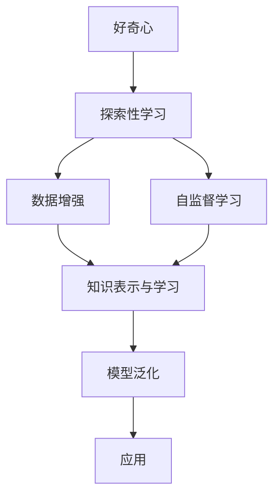

                 

## 1. 背景介绍

### 1.1 问题由来

在信息爆炸的数字化时代，数据正以爆炸性增长，人们每天都在面对海量的信息，且需从中获取有效的知识和洞见。面对这一挑战，人工智能（AI）技术显得尤为重要。作为AI领域的关键驱动力之一，好奇心驱动下的探索性学习正在逐渐成为获取知识、理解和解决问题的关键。

### 1.2 问题核心关键点

好奇心的力量在人工智能中的应用，主要体现在以下几个方面：
- **数据驱动的探索**：通过分析海量数据，识别模式和规律，从而提出新问题和解决方案。
- **跨领域知识整合**：好奇心的驱使使得研究者敢于跨领域整合知识，探索新的研究领域。
- **持续学习**：好奇心促使模型不断学习新知识，以应对变化多端的任务需求。
- **创新突破**：好奇心催生了众多新颖的研究方法和算法，推动了AI技术的不断进步。

### 1.3 问题研究意义

探索与理解好奇心在人工智能中的应用，有助于我们更好地理解和学习人工智能的原理和实践，并指导我们在实际应用中发挥好奇心的重要作用。这不仅有助于提升AI模型的性能和应用效果，还能推动AI技术在更多领域的应用和普及。

## 2. 核心概念与联系

### 2.1 核心概念概述

为了更好地理解好奇心在人工智能中的应用，我们需梳理几个关键概念：

- **好奇心**：人类天生的探索欲望，促使人们不断学习新知识，探索未知领域。
- **探索性学习**：一种通过不断尝试和验证，从错误中学习和优化的学习方法。
- **知识表示与学习**：AI模型对数据的理解和建模，通过学习提炼知识，用于推理和预测。
- **模型泛化**：模型在不同数据和任务上的表现能力，包括对未知数据的预测能力。
- **数据增强与扩充**：通过扩充数据集，增强模型泛化能力，避免过拟合。
- **自监督学习**：利用未标注数据，通过学习数据的内在规律，提升模型表现。

这些概念之间存在密切联系，好奇心驱动下的探索性学习，可以通过数据增强和自监督学习等技术，不断提升AI模型的泛化能力，从而实现更广泛的应用。

### 2.2 核心概念原理和架构的 Mermaid 流程图



## 3. 核心算法原理 & 具体操作步骤

### 3.1 算法原理概述

好奇心驱动下的探索性学习，主要通过以下步骤实现：
1. **数据收集与预处理**：收集并预处理数据，去除噪声，增强数据的有效性。
2. **数据增强**：通过扩充数据集，增加模型训练数据的多样性，提升泛化能力。
3. **自监督学习**：利用未标注数据，训练模型学习数据的内在规律。
4. **模型构建与训练**：选择合适的模型架构，通过训练优化模型参数，提升性能。
5. **模型评估与验证**：通过验证集评估模型性能，调整模型超参数，优化模型。
6. **模型部署与应用**：将模型部署到实际应用中，通过不断收集反馈数据，持续优化模型。

### 3.2 算法步骤详解

以自然语言处理（NLP）中的文本分类任务为例，探索性学习的过程如下：

1. **数据收集与预处理**：收集大量标注数据，并进行清洗、分词、向量化等预处理操作。

2. **数据增强**：通过回译、同义词替换、随机噪声等方法，扩充数据集，增加训练样本的多样性。

3. **自监督学习**：选择无监督预训练任务，如掩码语言模型（Masked Language Model, MLM），提升模型对语言结构的理解。

4. **模型构建与训练**：选择适合任务的模型架构，如BERT，设置模型参数，并在训练集上训练模型。

5. **模型评估与验证**：在验证集上评估模型性能，调整学习率、优化器等超参数，确保模型泛化能力。

6. **模型部署与应用**：将模型部署到实际应用中，收集新数据，持续优化模型，提升应用效果。

### 3.3 算法优缺点

**优点**：
- **泛化能力强**：数据增强和自监督学习提升了模型的泛化能力，能够更好地应对未知数据。
- **探索性强**：好奇心驱动下的探索性学习，能够不断尝试新方法，推动技术进步。
- **高效性**：利用未标注数据进行自监督学习，减少了标注成本。

**缺点**：
- **计算资源消耗大**：自监督学习需要大量计算资源，且训练时间较长。
- **模型复杂度高**：自监督学习模型通常较为复杂，调试和优化难度较大。
- **结果不可控**：探索性学习结果具有不确定性，可能引入新问题。

### 3.4 算法应用领域

好奇心驱动下的探索性学习，已经在以下几个领域取得了显著成果：

1. **自然语言处理**：如文本分类、情感分析、机器翻译等任务，通过数据增强和自监督学习，提升了模型的泛化能力和准确性。
2. **计算机视觉**：如图像识别、目标检测等任务，通过数据扩充和自监督学习，提升了模型的鲁棒性和性能。
3. **语音识别**：如语音转换、语音识别等任务，通过自监督学习，提升了模型的识别能力和泛化能力。
4. **推荐系统**：如商品推荐、内容推荐等任务，通过数据增强和自监督学习，提升了推荐的个性化和准确性。
5. **医疗领域**：如疾病诊断、医疗影像分析等任务，通过探索性学习，提升了模型的诊断能力和泛化能力。

## 4. 数学模型和公式 & 详细讲解 & 举例说明

### 4.1 数学模型构建

以文本分类任务为例，数学模型构建如下：

- **输入**：文本数据 $X=\{x_1, x_2, \ldots, x_n\}$，每个文本 $x_i$ 包含若干个词向量 $w_i^j$。
- **输出**：标签 $Y=\{y_1, y_2, \ldots, y_n\}$，每个文本 $x_i$ 对应一个标签 $y_i \in \{1, 2, \ldots, C\}$，其中 $C$ 为类别数。
- **损失函数**：交叉熵损失函数 $L_{CE}(y,\hat{y})=-\frac{1}{N}\sum_{i=1}^N(y_i\log\hat{y}_i+(1-y_i)\log(1-\hat{y}_i))$，其中 $\hat{y}_i$ 为模型预测的概率分布。
- **优化目标**：最小化损失函数 $L=\frac{1}{N}\sum_{i=1}^N L_{CE}(y_i,\hat{y}_i)$。

### 4.2 公式推导过程

以BCE loss为例，推导过程如下：

$$
\begin{aligned}
    L_{CE}(y,\hat{y}) &= -\frac{1}{N}\sum_{i=1}^N(y_i\log\hat{y}_i+(1-y_i)\log(1-\hat{y}_i)) \\
    &= -\frac{1}{N}\sum_{i=1}^N(y_i\log\sigma(w_i^T \theta) + (1-y_i)\log(1-\sigma(w_i^T \theta))) \\
    &= -\frac{1}{N}\sum_{i=1}^N(y_i\log\frac{e^{w_i^T \theta}}{e^{w_i^T \theta}+e^{-w_i^T \theta}}+(1-y_i)\log\frac{e^{-w_i^T \theta}}{e^{w_i^T \theta}+e^{-w_i^T \theta}})
\end{aligned}
$$

其中，$\sigma(z)=\frac{1}{1+e^{-z}}$ 为Sigmoid函数，$\theta$ 为模型参数。

### 4.3 案例分析与讲解

以BERT模型为例，BERT通过预训练在无监督任务上学习语言结构，然后在有监督任务上进行微调。其训练过程分为两阶段：
1. **预训练**：通过MLM任务训练模型，学习语言的概率分布。
2. **微调**：在任务数据集上进行有监督学习，优化模型以适应特定任务。

## 5. 项目实践：代码实例和详细解释说明

### 5.1 开发环境搭建

搭建开发环境步骤如下：

1. 安装Python、PyTorch和Pandas等基础库：
```bash
pip install python numpy torch pandas sklearn
```

2. 安装Transformer库：
```bash
pip install transformers
```

3. 安装特定任务所需的库：
```bash
pip install datasets transformers
```

### 5.2 源代码详细实现

以情感分析任务为例，代码实现如下：

```python
import torch
from transformers import BertForSequenceClassification, BertTokenizer

# 加载预训练模型和分词器
model = BertForSequenceClassification.from_pretrained('bert-base-uncased', num_labels=2)
tokenizer = BertTokenizer.from_pretrained('bert-base-uncased')

# 数据预处理
def preprocess_data(texts, labels):
    inputs = tokenizer(texts, padding='max_length', truncation=True, max_length=128, return_tensors='pt')
    labels = torch.tensor(labels, dtype=torch.long)
    return inputs, labels

# 模型训练
def train_model(model, inputs, labels, epochs=5, batch_size=32):
    model.train()
    optimizer = torch.optim.Adam(model.parameters(), lr=1e-5)
    for epoch in range(epochs):
        for i, (input_ids, attention_mask, label) in enumerate(DataLoader(dataset, batch_size=batch_size)):
            model.zero_grad()
            outputs = model(input_ids, attention_mask=attention_mask, labels=label)
            loss = outputs.loss
            loss.backward()
            optimizer.step()
            if i % 100 == 0:
                print(f'Epoch {epoch+1}, Batch {i+1}, Loss: {loss.item()}')

# 模型评估
def evaluate_model(model, inputs, labels):
    model.eval()
    with torch.no_grad():
        predictions = model(input_ids, attention_mask=attention_mask)
        predicted_labels = torch.argmax(predictions, dim=1)
        accuracy = (predicted_labels == labels).mean()
        print(f'Accuracy: {accuracy:.2f}')
```

### 5.3 代码解读与分析

代码解读如下：

1. `BertForSequenceClassification`：加载预训练的BERT模型和分词器。
2. `preprocess_data`函数：将文本数据转换为模型可接受的格式，并进行padding和truncation操作。
3. `train_model`函数：在训练集上进行模型训练，使用Adam优化器，学习率为1e-5。
4. `evaluate_model`函数：在验证集上评估模型性能，计算准确率。

## 6. 实际应用场景

### 6.4 未来应用展望

未来，好奇心驱动的探索性学习将在以下几个方面得到广泛应用：

1. **医疗领域**：利用探索性学习，提升疾病诊断和治疗方案推荐的效果。
2. **金融领域**：通过探索性学习，改进风险评估和投资决策。
3. **交通领域**：利用探索性学习，优化交通流量分析和调度。
4. **教育领域**：通过探索性学习，提升个性化教育和推荐系统的效果。
5. **智能家居**：利用探索性学习，提升智能家居系统的智能化和个性化。

## 7. 工具和资源推荐

### 7.1 学习资源推荐

1. **自然语言处理与深度学习**：斯坦福大学《CS224N: 自然语言处理与深度学习》课程，涵盖NLP和深度学习的基础知识和经典模型。
2. **深度学习框架**：PyTorch和TensorFlow官方文档，提供了详细的API和使用方法。
3. **Transformer库**：HuggingFace官方文档，提供了丰富的预训练模型和微调样例。
4. **自然语言处理工具**：NLTK和SpaCy，提供了文本处理和分析的工具。
5. **数据集**：GLUE、MNLI等NLP数据集，提供了大规模标注数据。

### 7.2 开发工具推荐

1. **Python**：强大的编程语言，广泛用于机器学习和NLP开发。
2. **PyTorch**：深度学习框架，提供了灵活的动态计算图，适合探索性学习。
3. **TensorFlow**：深度学习框架，适合大规模工程应用。
4. **Jupyter Notebook**：交互式编程环境，适合快速原型开发和模型调试。
5. **Git**：版本控制工具，方便代码管理和协作。

### 7.3 相关论文推荐

1. **Attention is All You Need**：Transformer的原始论文，介绍了Transformer的架构和原理。
2. **BERT: Pre-training of Deep Bidirectional Transformers for Language Understanding**：BERT的原始论文，介绍了预训练语言模型在NLP中的应用。
3. **BERT: Pre-training of Deep Bidirectional Transformers for Language Understanding**：BERT的进阶论文，介绍了基于BERT的微调和应用。
4. **ALBERT: A Lite BERT for Self-supervised Learning of Language Representations**：介绍了ALBERT模型，一种参数更少的BERT变体。
5. **GPT-3: Language Models are Unsupervised Multitask Learners**：介绍了GPT-3模型，展示了大规模预训练语言模型的强大能力。

## 8. 总结：未来发展趋势与挑战

### 8.1 研究成果总结

好奇心驱动的探索性学习，已经取得了显著的成果，提升了AI模型的泛化能力和应用效果。然而，仍然面临以下挑战：

1. **数据获取难度大**：获取高质量的标注数据仍是一个难题。
2. **计算资源消耗高**：自监督学习需要大量的计算资源，且训练时间较长。
3. **模型复杂度高**：探索性学习模型通常较为复杂，调试和优化难度较大。
4. **结果不确定性**：探索性学习结果具有不确定性，可能引入新问题。

### 8.2 未来发展趋势

未来，探索性学习将在以下几个方面继续发展：

1. **自监督学习**：更多的自监督任务和模型将被研究和应用。
2. **数据增强**：更多数据增强方法将被研究，提升模型的泛化能力。
3. **模型压缩**：模型压缩技术将得到更广泛的应用，降低计算资源消耗。
4. **知识图谱**：知识图谱将与AI模型结合，提升模型的知识整合能力。
5. **联邦学习**：联邦学习将与AI模型结合，提升模型的隐私保护和泛化能力。

### 8.3 面临的挑战

尽管探索性学习在AI领域取得了显著进展，但仍面临诸多挑战：

1. **计算资源不足**：自监督学习需要大量计算资源，且训练时间较长。
2. **模型复杂度高**：探索性学习模型通常较为复杂，调试和优化难度较大。
3. **结果不确定性**：探索性学习结果具有不确定性，可能引入新问题。
4. **数据隐私问题**：大规模数据处理和共享可能带来数据隐私问题。

### 8.4 研究展望

未来，探索性学习的研究将在以下几个方面进一步突破：

1. **自监督学习**：更多的自监督任务和模型将被研究和应用。
2. **数据增强**：更多数据增强方法将被研究，提升模型的泛化能力。
3. **模型压缩**：模型压缩技术将得到更广泛的应用，降低计算资源消耗。
4. **知识图谱**：知识图谱将与AI模型结合，提升模型的知识整合能力。
5. **联邦学习**：联邦学习将与AI模型结合，提升模型的隐私保护和泛化能力。

## 9. 附录：常见问题与解答

**Q1：探索性学习是否适用于所有任务？**

A：探索性学习适用于数据量较大的任务，尤其是NLP和计算机视觉等领域的任务。但对于小样本任务，需要结合传统的监督学习方法进行优化。

**Q2：如何选择合适的学习率？**

A：学习率一般设置为1e-5，并逐步减小。可以通过实验确定最优学习率，也可以采用学习率调度策略，如warmup和cosine。

**Q3：探索性学习面临的主要挑战是什么？**

A：探索性学习面临的主要挑战包括计算资源不足、模型复杂度高、结果不确定性等。

**Q4：探索性学习如何应用于实际任务？**

A：探索性学习可以应用于文本分类、图像识别、推荐系统等多个领域。需要结合具体任务和数据特点进行优化。

**Q5：探索性学习的应用前景如何？**

A：探索性学习的应用前景广阔，未来将与更多领域结合，推动AI技术的不断进步。

