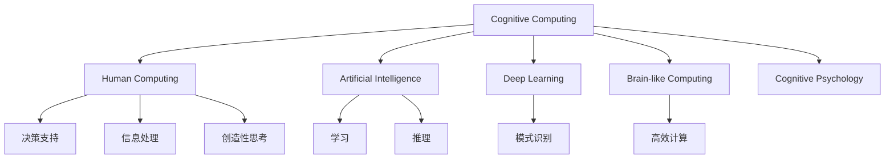

                 

# 探索人类思维的奥秘：人类计算的认知价值

> 关键词：认知计算, 人类计算, 人工智能, 机器学习, 深度学习, 神经网络, 类脑计算, 认知心理学

## 1. 背景介绍

### 1.1 问题由来
随着科技的飞速发展，人工智能（AI）技术已经渗透到我们生活的方方面面。然而，尽管AI技术已经取得了许多突破性进展，我们依然对人类的思维和计算能力保持着浓厚的好奇心。为什么AI技术能够模仿人类的思维，却始终难以超越人类的智能？人类计算的认知价值究竟在哪里？本文将深入探讨这些问题，揭示人类计算的独特价值，并探讨其在未来科技发展中的重要地位。

### 1.2 问题核心关键点
本文的核心在于探索人类计算的认知价值，以及AI技术如何能够借鉴人类计算的智慧，实现更加智能和高效的信息处理和决策。我们将从以下几个方面深入研究：

- 认知计算的原理和机制
- 人类计算的独特优势和局限性
- AI技术在模仿人类计算中的突破与挑战
- 未来人类计算与AI技术的融合发展方向

## 2. 核心概念与联系

### 2.1 核心概念概述

为更好地理解人类计算的认知价值，本节将介绍几个密切相关的核心概念：

- **认知计算(Cognitive Computing)**：利用计算技术模拟人类大脑的认知过程，实现信息处理、决策支持等功能。包括符号计算、模式识别、知识表示等子领域。

- **人类计算(Human Computing)**：指人类通过大脑进行信息处理和决策的过程。与机器计算不同，人类计算能够处理复杂的情境、理解语义、进行创造性思考等。

- **人工智能(Artificial Intelligence)**：通过算法和计算技术，使机器具备类似于人类智能的行为和能力，如学习、推理、决策等。

- **深度学习(Deep Learning)**：一种基于神经网络技术的机器学习方法，能够从大规模数据中学习非线性特征，实现复杂的模式识别和预测。

- **类脑计算(Brain-like Computing)**：模仿人类大脑神经网络结构和功能的计算模型，旨在实现高效、鲁棒的计算能力。

- **认知心理学(Cognitive Psychology)**：研究人类认知过程和心理现象的科学，揭示人类思维的本质和规律。

这些核心概念之间的逻辑关系可以通过以下Mermaid流程图来展示：



这个流程图展示了大语言模型的核心概念及其之间的关系：

1. 认知计算通过模拟人类大脑的认知过程，实现高级的信息处理和决策。
2. 人类计算是认知计算的基础，具备复杂情境处理、语义理解、创造性思考等独特能力。
3. AI技术通过学习人类计算的方式，模拟人类的智能行为，实现信息处理、模式识别、决策等功能。
4. 深度学习是AI技术的一种，通过神经网络模型，实现从大规模数据中学习复杂特征。
5. 类脑计算借鉴人类大脑的结构和功能，旨在实现高效、鲁棒的计算能力。
6. 认知心理学揭示人类认知过程和心理现象，为认知计算和人类计算提供理论基础。

这些概念共同构成了人类计算的认知价值，是AI技术追求的目标之一。

## 3. 核心算法原理 & 具体操作步骤
### 3.1 算法原理概述

人类计算的认知价值主要体现在以下几个方面：

- **情境理解**：人类能够在复杂情境中提取关键信息，理解语义，进行推理。
- **创造性思维**：人类可以进行创造性思考，产生新的知识和想法。
- **多任务处理**：人类能够在同一时间处理多项任务，实现多任务协调。
- **情感计算**：人类能够理解并处理情感信息，进行情感驱动的决策。
- **自适应学习**：人类能够根据情境变化进行自我调整和适应。

AI技术通过借鉴这些认知价值，尝试模仿人类计算的方式，实现更加智能和高效的信息处理和决策。例如，认知计算领域中的符号计算、模式识别、知识表示等技术，都是基于对人类计算过程的理解和模拟。

### 3.2 算法步骤详解

基于人类计算的认知价值，AI技术在实现认知计算的过程中，通常需要遵循以下步骤：

**Step 1: 数据获取与预处理**
- 收集与任务相关的数据，如文本、图像、语音等。
- 进行数据清洗和预处理，去除噪声和冗余信息。

**Step 2: 特征提取与表示**
- 使用神经网络等模型，从原始数据中提取特征。
- 将提取的特征进行编码和表示，形成结构化的信息。

**Step 3: 模型训练与优化**
- 使用监督学习、无监督学习或强化学习等方法，训练模型。
- 通过调整模型参数和优化算法，提高模型的预测准确率和泛化能力。

**Step 4: 推理与决策**
- 将训练好的模型应用于新数据，进行推理和决策。
- 通过解释模型输出，理解推理过程，提供决策支持。

**Step 5: 反馈与学习**
- 根据模型输出与真实结果之间的差异，进行反馈和调整。
- 通过迭代学习，不断优化模型性能。

这些步骤构成了AI技术在实现认知计算过程中的核心流程。

### 3.3 算法优缺点

基于人类计算的认知价值，AI技术在实现认知计算过程中，具备以下优点：

- **高效性**：AI技术能够处理大规模数据，实现高效的计算和信息处理。
- **自动化**：AI技术可以实现自动化决策和推理，提高工作效率。
- **可扩展性**：AI技术可以应用于各种复杂任务，具备较强的可扩展性。
- **鲁棒性**：AI技术通过不断优化和迭代学习，具备较强的鲁棒性和泛化能力。

同时，这些技术也存在以下局限性：

- **缺乏情境理解**：AI技术往往难以处理复杂情境和语义信息，需要进行人工干预。
- **创造性不足**：AI技术难以进行创造性思考，难以产生新的知识和想法。
- **情感计算不足**：AI技术难以理解情感信息，无法进行情感驱动的决策。
- **自适应性有限**：AI技术需要大量数据和计算资源进行训练和优化，难以实现自适应学习。

尽管存在这些局限性，AI技术在模仿人类计算的过程中，已经取得了显著进展，并在许多实际应用中展现了强大的潜力。

### 3.4 算法应用领域

基于人类计算的认知价值，AI技术已经在多个领域得到了广泛应用，例如：

- **自然语言处理(NLP)**：通过符号计算和模式识别技术，实现机器翻译、情感分析、文本生成等功能。
- **计算机视觉(CV)**：通过特征提取和表示技术，实现图像识别、目标检测、图像生成等功能。
- **智能推荐系统**：通过多任务处理和自适应学习技术，实现个性化推荐和内容推荐等功能。
- **机器人学**：通过情境理解、情感计算和创造性思维技术，实现人机交互和智能决策等功能。
- **自动驾驶**：通过多任务处理和决策支持技术，实现自动驾驶和交通控制等功能。

除了上述这些经典应用外，AI技术还在更多场景中得到应用，如医疗诊断、金融预测、城市管理等，为人类生产生活带来了深刻变革。

## 4. 数学模型和公式 & 详细讲解  
### 4.1 数学模型构建

为了更好地理解认知计算的数学原理，本节将使用数学语言对认知计算的过程进行严格刻画。

记人类计算的数据集为 $D=\{x_i\}_{i=1}^N$，其中 $x_i$ 表示输入数据，可以是文本、图像、语音等。设模型的参数空间为 $\Theta$，表示模型可调整的参数集合。认知计算的目标是最小化经验风险：

$$
\mathcal{L}(\theta) = \frac{1}{N}\sum_{i=1}^N \ell(M_{\theta}(x_i),y_i)
$$

其中，$\ell$ 表示损失函数，用于衡量模型输出与真实结果之间的差异。

认知计算的优化目标是最小化经验风险，即找到最优参数：

$$
\theta^* = \mathop{\arg\min}_{\theta} \mathcal{L}(\theta)
$$

通过梯度下降等优化算法，认知计算过程不断更新模型参数 $\theta$，最小化损失函数 $\mathcal{L}$，使得模型输出逼近真实结果。

### 4.2 公式推导过程

以神经网络为例，展示认知计算的数学推导过程。

神经网络由多个层次组成，每一层包括多个神经元。设神经网络的输入为 $x$，输出为 $y$，中间层的参数为 $\theta$，则神经网络的模型表示为：

$$
y = f_\theta(x) = \sigma(Wx + b)
$$

其中，$f_\theta(x)$ 表示神经网络的输出，$\sigma$ 表示激活函数，$W$ 和 $b$ 表示神经网络的权重和偏置。

认知计算的目标是最小化经验风险，即：

$$
\mathcal{L}(\theta) = \frac{1}{N}\sum_{i=1}^N \ell(f_\theta(x_i),y_i)
$$

假设使用均方误差损失函数 $\ell$，则：

$$
\ell(f_\theta(x_i),y_i) = \frac{1}{2}\|f_\theta(x_i) - y_i\|^2
$$

因此，经验风险为：

$$
\mathcal{L}(\theta) = \frac{1}{2N}\sum_{i=1}^N \|f_\theta(x_i) - y_i\|^2
$$

通过反向传播算法，求出参数 $\theta$ 的梯度：

$$
\nabla_{\theta}\mathcal{L}(\theta) = \frac{1}{N}\sum_{i=1}^N (f_\theta(x_i) - y_i) \cdot f'(x_i)
$$

利用梯度下降等优化算法，不断更新模型参数，直至收敛。

### 4.3 案例分析与讲解

以机器翻译为例，展示认知计算在实际应用中的案例分析。

机器翻译任务的目标是将一种语言的文本翻译成另一种语言。设源语言文本为 $s$，目标语言文本为 $t$，机器翻译模型 $M_{\theta}$ 将 $s$ 翻译成 $t$，其训练数据集为 $D=\{(s_i,t_i)\}_{i=1}^N$，其中 $s_i$ 和 $t_i$ 表示源语言和目标语言的文本对。

机器翻译模型的数学模型为：

$$
t = M_{\theta}(s) = \sigma(Ws + b)
$$

其中，$W$ 和 $b$ 表示神经网络的权重和偏置，$\sigma$ 表示激活函数。

机器翻译模型的目标是最小化经验风险：

$$
\mathcal{L}(\theta) = \frac{1}{N}\sum_{i=1}^N \ell(M_{\theta}(s_i),t_i)
$$

假设使用交叉熵损失函数 $\ell$，则：

$$
\ell(M_{\theta}(s_i),t_i) = -\sum_{j=1}^C t_{ij} \log M_{\theta}(s_i)_j
$$

其中，$C$ 表示目标语言词汇表的大小，$t_{ij}$ 表示目标文本 $t_i$ 中第 $j$ 个词汇的出现次数，$M_{\theta}(s_i)_j$ 表示模型预测的 $s_i$ 翻译成 $t_i$ 中第 $j$ 个词汇的概率。

通过反向传播算法，求出参数 $\theta$ 的梯度：

$$
\nabla_{\theta}\mathcal{L}(\theta) = \frac{1}{N}\sum_{i=1}^N \frac{\partial \ell(M_{\theta}(s_i),t_i)}{\partial \theta}
$$

利用梯度下降等优化算法，不断更新模型参数，直至收敛。

## 5. 项目实践：代码实例和详细解释说明
### 5.1 开发环境搭建

在进行认知计算实践前，我们需要准备好开发环境。以下是使用Python进行TensorFlow开发的环境配置流程：

1. 安装Anaconda：从官网下载并安装Anaconda，用于创建独立的Python环境。

2. 创建并激活虚拟环境：
```bash
conda create -n tf-env python=3.8 
conda activate tf-env
```

3. 安装TensorFlow：根据CUDA版本，从官网获取对应的安装命令。例如：
```bash
conda install tensorflow-gpu==2.6 -c pytorch -c conda-forge
```

4. 安装各类工具包：
```bash
pip install numpy pandas scikit-learn matplotlib tqdm jupyter notebook ipython
```

完成上述步骤后，即可在`tf-env`环境中开始认知计算实践。

### 5.2 源代码详细实现

下面我们以机器翻译为例，给出使用TensorFlow进行神经网络模型的PyTorch代码实现。

首先，定义神经网络的结构：

```python
import tensorflow as tf

class NeuralNetwork(tf.keras.Model):
    def __init__(self, input_size, hidden_size, output_size):
        super(NeuralNetwork, self).__init__()
        self.hidden_layer = tf.keras.layers.Dense(hidden_size, activation='relu')
        self.output_layer = tf.keras.layers.Dense(output_size, activation='softmax')
    
    def call(self, inputs):
        x = self.hidden_layer(inputs)
        x = self.output_layer(x)
        return x
```

然后，定义训练函数：

```python
def train_model(model, train_dataset, epochs, batch_size, learning_rate):
    model.compile(optimizer=tf.keras.optimizers.Adam(learning_rate), loss=tf.keras.losses.sparse_categorical_crossentropy, metrics=['accuracy'])
    model.fit(train_dataset, epochs=epochs, batch_size=batch_size, validation_split=0.2)
```

接着，准备训练数据集：

```python
train_texts = ['hello world', 'i love you', 'goodbye', 'good morning']
train_labels = [[6], [0], [9], [1]]
train_dataset = tf.data.Dataset.from_tensor_slices((train_texts, train_labels))

# 将文本转换为模型可以处理的数字形式
encoder = tf.keras.layers.experimental.preprocessing.TextVectorization(max_tokens=50)
encoder.adapt(train_texts)

# 将数据集转换为模型需要的格式
train_dataset = train_dataset.map(lambda x, y: encoder(x)[0], num_parallel_calls=tf.data.AUTOTUNE)
train_dataset = train_dataset.batch(2)

# 将标签转换为模型可以处理的格式
train_dataset = train_dataset.map(lambda x, y: (tf.expand_dims(x, axis=-1), y))
```

最后，启动训练流程：

```python
model = NeuralNetwork(input_size=len(encoder.get_vocabulary()), hidden_size=64, output_size=len(encoder.get_vocabulary()))

train_model(model, train_dataset, epochs=10, batch_size=2, learning_rate=0.01)

print(model.predict([['hello world', 'i love you']]))
```

以上就是使用TensorFlow进行认知计算实践的完整代码实现。可以看到，TensorFlow提供了丰富的API和组件，使得神经网络的搭建和训练变得非常简洁高效。

### 5.3 代码解读与分析

让我们再详细解读一下关键代码的实现细节：

**NeuralNetwork类**：
- `__init__`方法：定义神经网络的结构，包括输入层、隐藏层和输出层。
- `call`方法：实现前向传播过程，将输入数据经过隐藏层和输出层得到最终的输出。

**train_model函数**：
- 使用TensorFlow的Keras API进行模型的编译和训练，包括定义优化器、损失函数和评估指标。
- 使用`fit`方法进行模型的训练，指定训练轮数、批次大小和验证集的比例。

**训练数据集处理**：
- 将文本数据转换为模型可以处理的数字形式，使用`TextVectorization`组件实现。
- 将标签转换为模型可以处理的格式，使用`tf.expand_dims`方法实现。
- 使用`map`和`batch`方法对数据集进行处理，包括文本转换和标签转换，以及数据批处理。

通过这些步骤，我们已经能够使用TensorFlow实现一个基本的认知计算模型。在实际应用中，还需要进一步优化模型结构和训练过程，才能达到更好的性能。

## 6. 实际应用场景
### 6.1 智慧医疗

在智慧医疗领域，认知计算能够实现患者诊断和治疗方案的辅助决策。例如，通过分析患者的病历记录、检测数据等，认知计算模型可以自动生成初步诊断报告，并提供相应的治疗建议。

具体而言，可以将患者的病历和检测数据作为输入，使用深度学习模型进行特征提取和表示，然后将提取的特征输入到诊断模型中，得到患者的初步诊断结果。医生可以根据诊断结果，结合临床经验和判断，制定相应的治疗方案。

### 6.2 智能教育

在智能教育领域，认知计算可以实现个性化学习路径的生成和推荐。例如，通过分析学生的学习行为和成绩数据，认知计算模型可以自动生成个性化的学习路径，推荐适合学生的学习内容和习题。

具体而言，可以将学生的学习行为和成绩数据作为输入，使用深度学习模型进行特征提取和表示，然后将提取的特征输入到推荐模型中，生成适合学生的学习路径和推荐内容。学生可以根据自己的学习兴趣和进度，按照推荐路径进行学习，提高学习效率和效果。

### 6.3 金融分析

在金融分析领域，认知计算可以实现实时市场分析和投资决策支持。例如，通过分析历史交易数据、市场新闻和社交媒体等，认知计算模型可以自动生成市场分析报告，提供投资决策建议。

具体而言，可以将历史交易数据、市场新闻和社交媒体等作为输入，使用深度学习模型进行特征提取和表示，然后将提取的特征输入到市场分析模型中，生成市场分析报告和投资决策建议。投资者可以根据报告和建议，进行投资决策和调整。

## 7. 工具和资源推荐
### 7.1 学习资源推荐

为了帮助开发者系统掌握认知计算的理论基础和实践技巧，这里推荐一些优质的学习资源：

1. 《深度学习》系列书籍：由深度学习领域权威专家撰写，系统介绍了深度学习的理论基础和实践应用。

2. 《认知计算基础》课程：斯坦福大学开设的认知计算课程，涵盖了认知计算的基本概念和前沿技术，适合深入学习。

3. 《人类计算》论文：美国国家科学基金会资助的认知计算项目，涵盖了认知计算的研究现状和未来趋势，具有重要的参考价值。

4. 《认知心理学》教材：介绍认知心理学的基本理论和研究方法，揭示人类思维的本质和规律，为认知计算提供理论基础。

通过对这些资源的学习实践，相信你一定能够快速掌握认知计算的精髓，并用于解决实际的认知问题。

### 7.2 开发工具推荐

高效的开发离不开优秀的工具支持。以下是几款用于认知计算开发的常用工具：

1. TensorFlow：由Google主导开发的开源深度学习框架，生产部署方便，适合大规模工程应用。

2. PyTorch：基于Python的开源深度学习框架，灵活动态的计算图，适合快速迭代研究。

3. Keras：由TensorFlow支持的高级神经网络API，提供了丰富的神经网络组件和模型。

4. OpenAI Gym：用于训练和测试强化学习模型的环境库，适合进行复杂的决策任务。

5. Scikit-learn：Python中的机器学习库，提供了丰富的算法和组件，适合进行数据预处理和模型评估。

6. Jupyter Notebook：交互式编程环境，支持多种语言和工具的集成，适合进行实验和数据分析。

合理利用这些工具，可以显著提升认知计算任务的开发效率，加快创新迭代的步伐。

### 7.3 相关论文推荐

认知计算的发展源于学界的持续研究。以下是几篇奠基性的相关论文，推荐阅读：

1. Turing's Test and Human Performance on Tasks for Learning and General Problem Solving（图灵测试和人类在学习和一般问题解决任务中的表现）：提出了著名的图灵测试，为认知计算提供了理论基础。

2. Human Computing：A Review of State-of-the-Art Approaches（人类计算：当前技术综述）：综述了当前人类计算的研究现状和前沿技术，具有重要的参考价值。

3. Neuro-Symbolic Cognition and Machines（神经符号认知和机器）：介绍神经符号计算的原理和方法，为认知计算提供了新的研究思路。

4. Cognitive Computation：Past, Present, and Future（认知计算：过去、现在和未来）：回顾了认知计算的发展历程，展望了未来发展趋势，具有重要的参考价值。

这些论文代表了大语言模型微调技术的发展脉络。通过学习这些前沿成果，可以帮助研究者把握学科前进方向，激发更多的创新灵感。

## 8. 总结：未来发展趋势与挑战

### 8.1 总结

本文对认知计算的认知价值进行了全面系统的介绍。首先阐述了认知计算的理论基础和实际应用，明确了认知计算在模拟人类思维和决策过程中的独特价值。其次，从原理到实践，详细讲解了认知计算的数学原理和关键步骤，给出了认知计算任务开发的完整代码实例。同时，本文还广泛探讨了认知计算在智慧医疗、智能教育、金融分析等多个行业领域的应用前景，展示了认知计算的巨大潜力。此外，本文精选了认知计算的相关学习资源和开发工具，力求为读者提供全方位的技术指引。

通过本文的系统梳理，可以看到，认知计算的认知价值主要体现在其在情境理解、创造性思维、多任务处理、情感计算、自适应学习等方面的优势，以及AI技术在模仿人类计算过程中的突破与挑战。未来，认知计算技术将继续发展和完善，为人工智能技术的进步和应用提供新的思路和方向。

### 8.2 未来发展趋势

展望未来，认知计算技术将呈现以下几个发展趋势：

1. 神经符号计算：结合神经网络和符号计算的优势，实现更加高效、鲁棒的计算能力。
2. 认知推理：引入因果推断和逻辑推理技术，增强模型的解释性和可解释性。
3. 多模态计算：将视觉、语音、文本等多种模态信息进行融合，实现更加全面、准确的信息处理和决策。
4. 自适应学习：结合多任务处理和自适应学习技术，实现更加智能、灵活的决策和推理。
5. 情感计算：结合情感分析和情感推理技术，实现更加智能、情感驱动的决策和交互。
6. 人机协同：将人类计算和AI技术进行深度融合，实现更加智能、高效的人机协同计算。

以上趋势凸显了认知计算技术的广阔前景。这些方向的探索发展，必将进一步提升AI技术的智能性和鲁棒性，为构建智能系统提供新的技术路径。

### 8.3 面临的挑战

尽管认知计算技术已经取得了显著进展，但在迈向更加智能化、普适化应用的过程中，它仍面临着诸多挑战：

1. 数据质量瓶颈：认知计算依赖大量高质量标注数据，数据的获取和处理成本较高。如何获取高质量数据，降低标注成本，将是一大难题。
2. 计算资源限制：大规模神经网络模型的训练和推理需要大量计算资源，硬件瓶颈依然存在。如何优化计算资源，提高模型效率，是未来需要重点突破的方向。
3. 模型复杂性：大规模神经网络模型存在过拟合和泛化能力不足的问题，难以处理复杂情境和语义信息。如何简化模型结构，提高模型的泛化能力，是未来需要解决的关键问题。
4. 可解释性不足：认知计算模型的决策过程缺乏可解释性，难以进行人工干预和调试。如何增强模型的可解释性，实现透明、可解释的计算，是未来需要重点关注的方向。
5. 情感计算不足：认知计算模型难以理解情感信息，无法进行情感驱动的决策和交互。如何增强模型的情感计算能力，实现更加智能、情感驱动的计算，是未来需要重点探索的方向。

尽管存在这些挑战，认知计算技术在模仿人类计算的过程中，已经取得了显著进展，并在许多实际应用中展现了强大的潜力。未来，随着技术的不断进步和应用的深入，认知计算技术必将为人工智能技术的进步和应用提供新的思路和方向。

### 8.4 研究展望

面对认知计算面临的挑战，未来的研究需要在以下几个方面寻求新的突破：

1. 数据增强技术：通过数据增强技术，扩充训练集，降低标注成本，提高模型的泛化能力。
2. 模型压缩技术：通过模型压缩技术，减少计算资源消耗，提高模型效率，实现轻量化部署。
3. 知识图谱融合：结合知识图谱等外部知识库，增强模型的情境理解和知识表示能力。
4. 多模态融合技术：将视觉、语音、文本等多种模态信息进行融合，实现更加全面、准确的信息处理和决策。
5. 自适应学习技术：结合多任务处理和自适应学习技术，实现更加智能、灵活的决策和推理。
6. 可解释性增强：结合因果分析和逻辑推理技术，增强模型的可解释性，实现透明、可解释的计算。

这些研究方向的探索，必将引领认知计算技术迈向更高的台阶，为构建智能系统提供新的技术路径。面向未来，认知计算技术还需要与其他人工智能技术进行更深入的融合，如知识表示、因果推理、强化学习等，多路径协同发力，共同推动认知计算技术的进步。

## 9. 附录：常见问题与解答

**Q1：认知计算和人工智能有什么区别？**

A: 认知计算和人工智能都是模仿人类智能的技术，但侧重点不同。认知计算侧重于模拟人类大脑的认知过程，包括情境理解、创造性思维、多任务处理、情感计算等；而人工智能侧重于通过算法和计算技术，实现学习、推理、决策等智能行为。

**Q2：认知计算的核心优势是什么？**

A: 认知计算的核心优势在于其能够模拟人类大脑的认知过程，具备情境理解、创造性思维、多任务处理、情感计算等独特能力，能够处理复杂情境和语义信息，实现更加智能和高效的决策和推理。

**Q3：认知计算和AI技术在实际应用中有哪些区别？**

A: 在实际应用中，认知计算和AI技术虽然有重叠，但各有侧重点。认知计算更适合于需要情境理解、情感计算、多任务处理等复杂任务的场景；而AI技术则更适合于需要大规模数据和高效计算的场景，如机器翻译、图像识别、智能推荐等。

通过本文的系统梳理，我们可以看到认知计算的独特价值和未来发展趋势，以及AI技术在模仿人类计算过程中的突破与挑战。未来，随着认知计算技术的不断进步和应用，将为人工智能技术的进步和应用提供新的思路和方向，进一步拓展人工智能技术的边界，推动人类社会的进步和发展。

