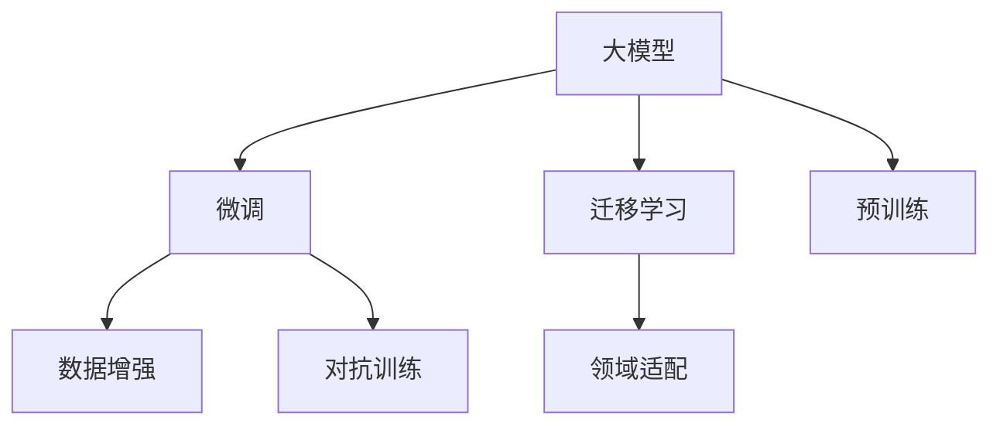

                 

# 探索大模型与各行业的结合

## 1. 背景介绍

### 1.1 问题由来

随着人工智能(AI)技术的飞速发展，大模型（如GPT-3, BERT等）逐渐成为了行业发展的核心引擎。从金融、医疗到零售、教育，再到娱乐、客服，几乎所有行业都在尝试与大模型结合，以期提升效率、优化流程、降低成本、提升用户体验。然而，大模型技术仍处于早期阶段，如何在实际应用中发挥最大效益，仍是一个充满挑战的问题。

### 1.2 问题核心关键点

大模型技术之所以能在不同行业落地，核心在于其卓越的语言理解和生成能力。该能力主要源于预训练模型在大量文本数据上学习到的丰富语言知识和常识，使其在特定任务上通过微调（Fine-Tuning）可以获得显著性能提升。但在不同行业应用时，由于领域特定知识的不同，大模型仍面临诸多挑战。

具体而言，主要包括以下几个方面：
1. **模型适配**：不同行业数据和任务特点各异，大模型需要适配特定领域的知识，才能有效发挥其潜力。
2. **数据质量**：高质量、高标注密度的数据是微调的基础，对于数据匮乏的行业尤为关键。
3. **模型鲁棒性**：在不同领域中，大模型的泛化能力需要验证，避免过拟合或泛化不足的问题。
4. **可解释性和可控性**：大模型的决策过程复杂，需要更好地解释和控制模型行为，以保证输出结果的可靠性和安全性。
5. **性能优化**：在实际应用中，需要考虑计算资源、推理速度等因素，对模型进行优化。

### 1.3 问题研究意义

探索大模型与各行业的结合，有助于加速AI技术在各行各业的落地应用，推动经济社会的数字化转型。具体而言：

1. **提升效率**：大模型可以自动化处理海量数据，提升行业整体效率。
2. **优化流程**：通过智能化的决策支持，优化业务流程，降低运营成本。
3. **提升用户体验**：通过自然语言处理技术，改善用户体验，提升用户满意度。
4. **赋能产业升级**：为传统行业带来新的技术路径，促进产业升级和创新。
5. **促进社会福祉**：通过智能化服务，提升社会治理能力，改善民生福祉。

## 2. 核心概念与联系

### 2.1 核心概念概述

为更好地理解大模型与各行业的结合，本节将介绍几个关键概念：

- **大模型（Large Language Model, LLM）**：指通过大规模预训练得到的深度学习模型，如GPT、BERT等，具备强大的语言理解与生成能力。
- **微调（Fine-Tuning）**：指在预训练模型的基础上，通过特定领域的数据进行微调，提升模型在该领域的表现。
- **迁移学习（Transfer Learning）**：指将预训练模型的知识迁移到新领域，以加快新领域模型的训练。
- **领域适配（Domain Adaptation）**：指在预训练模型的基础上，对模型进行特定领域的微调，使其适应新领域的数据。
- **数据增强（Data Augmentation）**：指通过数据变换技术，扩充训练数据集，提高模型泛化能力。
- **对抗训练（Adversarial Training）**：指在模型训练过程中，引入对抗样本，提高模型的鲁棒性和泛化能力。

这些概念之间的联系通过以下Mermaid流程图来展示：



这个流程图展示了预训练模型、微调和迁移学习之间的关系，以及它们如何通过数据增强和对抗训练来提升模型性能。

## 3. 核心算法原理 & 具体操作步骤

### 3.1 算法原理概述

基于大模型与各行业的结合，主要涉及两个核心步骤：预训练和微调。

**预训练**：指在大规模无标签数据上训练大模型，学习语言的通用表示。

**微调**：指在大模型上，通过特定领域的数据进行微调，提升模型在该领域的表现。

在微调过程中，通常使用监督学习（Supervised Learning）的方式，即使用特定领域的标注数据进行训练，优化模型的参数，使其更好地适应新领域的数据。

### 3.2 算法步骤详解

具体步骤包括：

1. **数据准备**：收集特定领域的标注数据，包括训练集、验证集和测试集。这些数据应尽可能覆盖不同场景和边缘情况，以保证模型的泛化能力。
2. **模型选择**：选择合适的预训练大模型，如GPT-3、BERT等。根据任务特点，调整模型结构，使其更适合特定领域的需求。
3. **微调设置**：选择合适的微调算法，如AdamW、SGD等，并设置学习率、批大小、迭代轮数等超参数。同时，根据任务特点，设置正则化技术，如L2正则、Dropout等，避免过拟合。
4. **模型训练**：使用微调数据集进行训练，每个epoch中，对数据进行批处理，前向传播计算损失函数，反向传播更新模型参数，直至模型收敛。
5. **性能评估**：在验证集和测试集上评估模型性能，选择最优模型。
6. **模型部署**：将训练好的模型应用于实际业务场景中，进行推理和预测。

### 3.3 算法优缺点

**优点**：
1. **高效性**：使用预训练模型作为基础，可以大幅减少数据标注和模型训练的时间。
2. **泛化能力强**：预训练模型在大规模数据上学习到丰富的语言知识，具有较强的泛化能力。
3. **适用性强**：适用于多种NLP任务，如文本分类、命名实体识别、问答等。

**缺点**：
1. **数据依赖**：微调效果很大程度上依赖于标注数据的质量和数量。
2. **模型鲁棒性不足**：在大规模数据集上预训练的模型，可能难以适应特定领域的数据。
3. **可解释性不足**：大模型的决策过程复杂，难以解释和调试。
4. **计算资源需求高**：大模型通常参数量大，计算资源需求高，推理速度较慢。

### 3.4 算法应用领域

大模型与各行业的结合，已经在多个领域取得显著成果：

- **金融行业**：用于情感分析、舆情监测、客户服务、风险管理等。
- **医疗行业**：用于病历分析、医学图像识别、疾病预测等。
- **教育行业**：用于智能答疑、智能测评、学习推荐等。
- **零售行业**：用于客户行为分析、智能推荐、情感分析等。
- **制造行业**：用于设备监控、故障预测、生产调度等。
- **旅游行业**：用于智能客服、景点推荐、旅游规划等。

## 4. 数学模型和公式 & 详细讲解

### 4.1 数学模型构建

在大模型与各行业的结合过程中，数学模型主要包括以下几个部分：

1. **预训练模型**：
   - 使用语言模型进行预训练，如BERT、GPT等。
   - 目标：学习语言的高阶表示，具备强大的语义理解能力。

2. **微调模型**：
   - 在特定领域的标注数据上，进行微调。
   - 目标：调整模型参数，使其在新领域的数据上表现更好。

数学公式：

$$
\theta_{\text{fine-tune}} = \mathop{\arg\min}_{\theta} \frac{1}{N}\sum_{i=1}^N \ell(\text{model}(x_i), y_i)
$$

其中，$\theta$为模型参数，$N$为样本数，$\ell$为损失函数。

### 4.2 公式推导过程

以情感分析为例，公式推导如下：

1. **目标函数**：
   - 情感分类问题可转化为二分类问题，即正负面情感分类。
   - 目标：最小化负对数似然损失。

2. **损失函数**：
   - 使用交叉熵损失函数。

3. **参数更新**：
   - 使用梯度下降优化算法，更新模型参数。

### 4.3 案例分析与讲解

假设有一个情感分析任务，需要在大模型上进行微调。数据集包括1000条评论及其情感标签（正面或负面）。选择BERT作为预训练模型，在微调过程中，需要进行以下步骤：

1. **数据预处理**：
   - 将评论进行分词和编码，得到输入特征向量。
   - 将情感标签进行编码，得到目标向量。

2. **模型选择**：
   - 选择BERT-base作为预训练模型，将其顶层作为微调模型。

3. **微调设置**：
   - 学习率设置为2e-5，批大小设置为16，迭代轮数为10。
   - 使用AdamW优化器，设置L2正则化系数为0.01。

4. **模型训练**：
   - 在GPU上运行模型，每个epoch更新一次模型参数。
   - 在验证集上评估模型性能，每epoch输出一次。

5. **性能评估**：
   - 在测试集上评估模型性能，计算准确率、召回率和F1-score。

## 5. 项目实践：代码实例和详细解释说明

### 5.1 开发环境搭建

为了进行大模型的微调，需要搭建开发环境，具体步骤如下：

1. **安装Python和PyTorch**：
   ```
   conda create -n pytorch-env python=3.8
   conda activate pytorch-env
   pip install torch torchtext
   ```

2. **下载预训练模型**：
   ```
   from transformers import BertModel
   model = BertModel.from_pretrained('bert-base-uncased')
   ```

3. **准备数据集**：
   ```
   import torch
   import torchtext
   ...
   # 数据预处理
   ...
   ```

### 5.2 源代码详细实现

以下是一个使用BERT进行情感分析微调的示例代码：

```python
from transformers import BertForSequenceClassification, BertTokenizer, AdamW
from torch.utils.data import DataLoader
from sklearn.metrics import accuracy_score, precision_recall_fscore_support

# 数据准备
tokenizer = BertTokenizer.from_pretrained('bert-base-uncased')
train_data, test_data = load_data()

# 模型选择
model = BertForSequenceClassification.from_pretrained('bert-base-uncased', num_labels=2)

# 微调设置
optimizer = AdamW(model.parameters(), lr=2e-5)
epochs = 10
device = 'cuda' if torch.cuda.is_available() else 'cpu'

# 模型训练
for epoch in range(epochs):
    for batch in DataLoader(train_data, batch_size=16, shuffle=True):
        input_ids = batch['input_ids'].to(device)
        attention_mask = batch['attention_mask'].to(device)
        labels = batch['labels'].to(device)
        model.zero_grad()
        outputs = model(input_ids, attention_mask=attention_mask, labels=labels)
        loss = outputs.loss
        loss.backward()
        optimizer.step()

# 性能评估
with torch.no_grad():
    predictions, labels = [], []
    for batch in DataLoader(test_data, batch_size=16, shuffle=False):
        input_ids = batch['input_ids'].to(device)
        attention_mask = batch['attention_mask'].to(device)
        labels = batch['labels'].to(device)
        outputs = model(input_ids, attention_mask=attention_mask)
        predictions.append(outputs.logits.argmax(dim=1).cpu().numpy())
        labels.append(labels.cpu().numpy())
    acc = accuracy_score(labels, predictions)
    print(f'Accuracy: {acc:.2f}')
```

### 5.3 代码解读与分析

**模型选择与准备**：
- 选择BERT-base作为预训练模型。
- 使用BertTokenizer进行数据预处理，将文本转换为模型可接受的输入格式。

**微调设置**：
- 使用AdamW优化器，学习率为2e-5。
- 批大小为16，迭代轮数为10。
- 在GPU上运行模型。

**模型训练**：
- 在每个epoch中，对数据进行批处理，前向传播计算损失函数，反向传播更新模型参数。
- 在验证集上评估模型性能，每epoch输出一次。

**性能评估**：
- 在测试集上评估模型性能，计算准确率。

## 6. 实际应用场景

### 6.1 智能客服系统

智能客服系统是大模型与各行业结合的典型应用。传统客服系统需要大量人力，高峰期响应缓慢。通过微调大模型，可以实现7x24小时不间断服务，快速响应客户咨询，提升服务质量。

**应用示例**：
- 将客户对话记录作为微调数据，训练对话生成模型。
- 将用户意图分类为常见问题，提供预设答案或引导用户自助解答。

### 6.2 金融舆情监测

金融行业需要实时监测市场舆情，避免负面信息传播带来的风险。通过微调大模型，可以实现自动情感分析、舆情监测，提升市场响应速度和决策效率。

**应用示例**：
- 收集金融领域的新闻、评论、社交媒体数据，作为微调数据。
- 使用微调后的模型进行情感分析，及时发现负面舆情，进行风险预警。

### 6.3 个性化推荐系统

个性化推荐系统是电商、内容分发等领域的核心技术。通过微调大模型，可以更好地理解用户兴趣，提供更精准的推荐。

**应用示例**：
- 收集用户浏览、点击、评分等行为数据，提取物品描述、标签等文本信息。
- 使用微调后的模型进行用户兴趣预测，生成个性化推荐列表。

### 6.4 未来应用展望

大模型与各行业的结合将带来更多创新应用，例如：

- **智慧医疗**：用于病历分析、疾病预测、智能问诊等。
- **智能教育**：用于智能答疑、学习推荐、考试评价等。
- **智慧城市**：用于城市事件监测、智慧交通、安全预警等。
- **智能制造**：用于设备监控、故障预测、生产调度等。

## 7. 工具和资源推荐

### 7.1 学习资源推荐

- **《深度学习自然语言处理》课程**：斯坦福大学开设的NLP明星课程，涵盖语言模型、序列模型等基本概念。
- **《Transformer从原理到实践》系列博文**：介绍Transformer原理、BERT模型、微调技术等前沿话题。
- **HuggingFace官方文档**：提供海量预训练模型和微调样例代码。

### 7.2 开发工具推荐

- **PyTorch**：灵活的计算图，适合快速迭代研究。
- **TensorFlow**：生产部署方便，适合大规模工程应用。
- **Transformers库**：集成了SOTA语言模型，支持微调任务开发。
- **Weights & Biases**：记录和可视化模型训练过程，方便对比和调优。
- **TensorBoard**：监测模型训练状态，提供丰富的图表呈现方式。

### 7.3 相关论文推荐

- **Attention is All You Need**：介绍Transformer模型，开启预训练大模型时代。
- **BERT: Pre-training of Deep Bidirectional Transformers for Language Understanding**：提出BERT模型，使用掩码自监督预训练任务。
- **AdaLoRA: Adaptive Low-Rank Adaptation for Parameter-Efficient Fine-Tuning**：提出自适应低秩适应的微调方法，提高模型参数效率。
- **Prefix-Tuning: Optimizing Continuous Prompts for Generation**：引入基于连续型Prompt的微调范式，充分利用预训练知识。

## 8. 总结：未来发展趋势与挑战

### 8.1 研究成果总结

大模型与各行业的结合，已经在多个领域取得显著成果。其核心在于：

- 预训练模型的强大语言理解能力。
- 微调技术的快速适配能力。

这些技术推动了各行各业的数字化转型，提升了效率和服务质量。

### 8.2 未来发展趋势

未来大模型与各行业的结合将呈现以下趋势：

1. **模型规模继续增大**：预训练模型的参数量将进一步增长，带来更强的语言表达能力。
2. **微调方法更加多样**：如参数高效微调、对抗训练等，优化资源消耗和模型鲁棒性。
3. **跨领域知识整合**：结合专家知识、知识图谱等，提升模型的泛化能力和解释性。
4. **多模态融合**：结合文本、图像、语音等多模态数据，提升模型的全面性和准确性。
5. **实时性优化**：通过模型裁剪、量化加速等技术，提升模型的推理速度和资源效率。
6. **安全性和伦理约束**：引入伦理导向的评估指标，确保模型输出符合社会价值观和伦理道德。

### 8.3 面临的挑战

大模型与各行业的结合仍面临诸多挑战：

1. **数据质量和标注成本**：高质量标注数据是微调的基础，获取成本高。
2. **模型鲁棒性和泛化能力**：特定领域数据可能导致模型泛化能力不足。
3. **可解释性和可控性**：大模型的决策过程复杂，难以解释和调试。
4. **计算资源需求高**：大模型参数量大，推理速度较慢。

### 8.4 研究展望

未来需要在以下几个方向进行深入研究：

1. **无监督和半监督学习**：探索不需要大量标注数据的微调方法，提升模型适应性。
2. **模型结构优化**：通过模型压缩、量化等技术，提升模型推理速度和资源效率。
3. **多模态融合与跨领域迁移**：结合多种模态数据和跨领域知识，提升模型的全面性和泛化能力。
4. **对抗攻击与鲁棒性增强**：研究对抗攻击技术，提升模型鲁棒性和泛化能力。
5. **知识图谱与逻辑推理**：结合专家知识、知识图谱等，提升模型的解释性和可控性。

## 9. 附录：常见问题与解答

**Q1：大模型微调是否适用于所有NLP任务？**

A: 大模型微调在大多数NLP任务上都能取得不错的效果，特别是对于数据量较小的任务。但对于一些特定领域的任务，如医学、法律等，仅仅依靠通用语料预训练的模型可能难以很好地适应。此时需要在特定领域语料上进一步预训练，再进行微调，才能获得理想效果。

**Q2：微调过程中如何选择合适的学习率？**

A: 微调的学习率一般要比预训练时小1-2个数量级，如果使用过大的学习率，容易破坏预训练权重，导致过拟合。一般建议从1e-5开始调参，逐步减小学习率，直至收敛。也可以使用warmup策略，在开始阶段使用较小的学习率，再逐渐过渡到预设值。

**Q3：大模型微调是否需要考虑计算资源和推理速度？**

A: 大模型通常参数量大，计算资源需求高，推理速度较慢。需要考虑模型裁剪、量化加速等技术，以提升模型的推理速度和资源效率。

**Q4：如何缓解微调过程中的过拟合问题？**

A: 缓解微调过程中的过拟合问题，可以从数据增强、正则化、对抗训练等方面入手：
- 数据增强：通过数据变换技术，扩充训练数据集。
- 正则化：使用L2正则、Dropout等技术，避免过拟合。
- 对抗训练：在模型训练过程中，引入对抗样本，提高模型的鲁棒性。

**Q5：大模型微调在实际应用中需要注意哪些问题？**

A: 在实际应用中，大模型微调还需要考虑以下问题：
- 模型裁剪：去除不必要的层和参数，减小模型尺寸，加快推理速度。
- 量化加速：将浮点模型转为定点模型，压缩存储空间，提高计算效率。
- 服务化封装：将模型封装为标准化服务接口，便于集成调用。
- 弹性伸缩：根据请求流量动态调整资源配置，平衡服务质量和成本。
- 监控告警：实时采集系统指标，设置异常告警阈值，确保服务稳定性。
- 安全防护：采用访问鉴权、数据脱敏等措施，保障数据和模型安全。

大模型与各行业的结合，是大模型技术不断发展的必然趋势。通过不断探索和实践，我们相信，大模型技术将为各行各业带来更多创新和变革，推动社会进步。

---

作者：禅与计算机程序设计艺术 / Zen and the Art of Computer Programming

