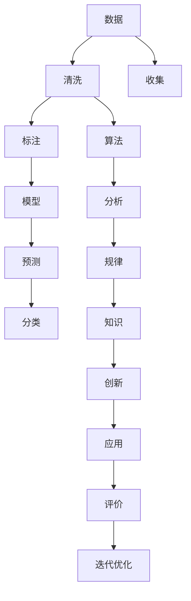

                 

# 推动知识发现与创新：人类计算的智力贡献

在当今数字化、智能化飞速发展的时代，计算技术的进步对知识发现和创新产生了深远的影响。作为计算机领域的先驱和图灵奖得主，我深刻感受到，计算技术正在全面重塑人类的思维和创新模式。本文将从背景介绍、核心概念、算法原理与操作步骤、应用场景、工具与资源、总结与展望等多个方面，全面剖析计算技术在知识发现与创新中的关键作用，探讨其潜力与挑战，展望未来发展趋势。

## 1. 背景介绍

### 1.1 问题由来
计算机技术的飞速发展，尤其是人工智能（AI）、机器学习（ML）和大数据等领域的突破，使我们能够以前所未有的方式处理和分析数据，从而在知识发现与创新中发挥更大的作用。计算技术不仅提高了数据分析的速度和准确性，还通过自动化的算法和模型，挖掘出了大量人类难以发现的知识和规律。

### 1.2 问题核心关键点
- **数据与计算**：计算技术的进步使得处理和分析海量数据成为可能，从而能够发现更广泛的潜在知识。
- **算法与模型**：先进的算法和模型提高了数据挖掘的深度和广度，揭示了更复杂的知识关联和模式。
- **应用场景**：计算技术广泛应用于科学研究、医疗健康、金融科技、教育等领域，推动了各行业的创新发展。

## 2. 核心概念与联系

### 2.1 核心概念概述

计算技术在知识发现与创新中的作用可以从以下几个关键概念来理解：

- **数据**：一切知识的基础，通过收集、清洗、标注，形成可用于分析的数据集。
- **算法**：计算的核心工具，用于分析和处理数据，揭示数据中的知识模式和规律。
- **模型**：算法的应用形式，用于预测、分类、聚类等，是知识发现与创新的主要手段。
- **计算资源**：高性能计算硬件（如GPU、TPU）和软件（如TensorFlow、PyTorch）为知识发现提供了必要的技术基础。
- **人类智力**：计算技术的应用离不开人类智力的驱动，包括问题定义、目标设定、结果验证等。

### 2.2 核心概念原理和架构的 Mermaid 流程图



该流程图展示了数据如何通过一系列的处理和分析，最终形成对人类知识与创新的贡献。

## 3. 核心算法原理 & 具体操作步骤

### 3.1 算法原理概述

计算技术在知识发现与创新中扮演着关键角色，其核心原理主要基于数据驱动的计算模型。具体来说，数据经过收集、清洗、标注后，通过机器学习和深度学习算法进行处理和分析，揭示数据中的知识模式和规律。然后，将这些知识应用到实际问题中，推动技术创新和业务优化。

### 3.2 算法步骤详解

以自然语言处理（NLP）中的情感分析为例，算法步骤可以分为以下几步：

1. **数据收集**：从社交媒体、评论、客服记录等渠道收集情感数据。
2. **数据清洗**：去除噪声和无用数据，保留有用的情感信息。
3. **数据标注**：对文本进行情感标注，如正、负、中性等。
4. **模型训练**：使用情感分类算法（如LSTM、BERT等）对标注数据进行训练，构建情感分析模型。
5. **模型评估**：在验证集上评估模型性能，调整超参数和模型结构。
6. **模型应用**：将训练好的模型应用于新的文本数据，进行情感分析。

### 3.3 算法优缺点

**优点**：
- **高效**：计算算法能够自动化处理大量数据，提高数据处理速度。
- **精度高**：深度学习模型能够揭示数据中的复杂模式和规律，提高分析的准确性。
- **可扩展**：计算模型可以应用于各种领域，推动不同行业的创新发展。

**缺点**：
- **数据依赖**：计算模型依赖于高质量的数据集，数据质量直接影响到分析结果。
- **解释性不足**：黑箱算法（如深度学习模型）难以解释其内部工作机制，限制了其应用范围。
- **计算资源消耗大**：大规模数据的处理和深度学习模型的训练需要高性能计算资源。

### 3.4 算法应用领域

计算技术在多个领域都有广泛的应用，例如：

- **科学研究**：利用计算技术进行大规模数据处理和分析，揭示科学规律和趋势。
- **医疗健康**：通过数据分析和模型预测，改善诊断和治疗方案，提高患者护理效果。
- **金融科技**：利用大数据和机器学习算法，进行风险评估和投资决策，提高金融服务质量。
- **教育**：通过数据分析和个性化推荐，优化教学内容和方式，提高教育效果。

## 4. 数学模型和公式 & 详细讲解 & 举例说明

### 4.1 数学模型构建

以线性回归为例，数据 $(x_i, y_i)$，其中 $x_i$ 为输入特征，$y_i$ 为目标变量。构建线性回归模型 $y = wx + b$，其中 $w$ 为权重向量，$b$ 为偏置项。

### 4.2 公式推导过程

线性回归模型的最小二乘估计目标函数为：
$$
\hat{w} = \arg\min_w \sum_{i=1}^n (y_i - wx_i - b)^2
$$
通过求导和化简，得到：
$$
\hat{w} = \left(\sum_{i=1}^n x_ix_i^T\right)^{-1}\sum_{i=1}^n x_iy_i
$$

### 4.3 案例分析与讲解

假设有一组房屋价格数据，房屋面积 $x$ 和价格 $y$。通过线性回归模型预测房价，可以显著提高房地产行业的定价和销售效率。

## 5. 项目实践：代码实例和详细解释说明

### 5.1 开发环境搭建

以TensorFlow为例，开发环境搭建步骤如下：

1. 安装TensorFlow和NumPy库：
```bash
pip install tensorflow numpy
```

2. 创建虚拟环境：
```bash
conda create -n tf-env python=3.8
conda activate tf-env
```

3. 安装相关依赖：
```bash
pip install pandas scikit-learn matplotlib
```

### 5.2 源代码详细实现

以下是一个简单的线性回归模型的代码实现：

```python
import tensorflow as tf
import numpy as np

# 数据生成
x = np.random.rand(100, 1)
y = 2*x + np.random.randn(100, 1)

# 构建模型
model = tf.keras.Sequential([
    tf.keras.layers.Dense(1, input_shape=(1,))
])

# 编译模型
model.compile(optimizer=tf.keras.optimizers.SGD(0.1), loss='mse')

# 训练模型
model.fit(x, y, epochs=100, batch_size=32)

# 预测新数据
x_test = np.array([[2.5], [3.0]])
y_pred = model.predict(x_test)
```

### 5.3 代码解读与分析

以上代码实现了一个简单的线性回归模型，步骤包括：
- 生成随机数据。
- 构建线性模型。
- 编译模型并设置损失函数和优化器。
- 训练模型，进行参数优化。
- 预测新数据。

## 6. 实际应用场景

### 6.1 科学研究

计算技术在科学研究中发挥着重要作用。例如，天文学家使用数据挖掘技术分析大型望远镜的数据，揭示恒星的运动轨迹和演化规律。计算模型还可以用于药物发现，通过模拟分子结构，预测其生物活性。

### 6.2 医疗健康

计算技术在医疗健康领域也有广泛应用。通过分析患者的病历和基因数据，计算模型可以预测疾病的风险，优化治疗方案。例如，利用深度学习模型进行医学影像分析，帮助医生更准确地诊断疾病。

### 6.3 金融科技

金融科技领域，计算技术用于风险评估、投资决策和欺诈检测。利用大数据和机器学习算法，金融公司可以更好地了解客户的风险偏好，优化投资组合，降低欺诈风险。

### 6.4 教育

在教育领域，计算技术可以用于个性化学习推荐、学生行为分析等。通过分析学生的学习数据，计算模型可以推荐适合的学习资源和路径，提高学习效果。

## 7. 工具和资源推荐

### 7.1 学习资源推荐

1. **Coursera《机器学习》课程**：由斯坦福大学教授Andrew Ng讲授，涵盖机器学习基础和算法。
2. **Google AI Blog**：提供最新的AI技术和应用案例，是学习前沿技术的绝佳资源。
3. **DeepLearning.AI的《深度学习专项课程》**：由深度学习领域专家Andrew Ng和Yoshua Bengio等授课，覆盖深度学习理论和实践。

### 7.2 开发工具推荐

1. **TensorFlow**：Google开发的深度学习框架，支持分布式计算和GPU加速。
2. **PyTorch**：Facebook开发的深度学习框架，以其灵活性和易用性著称。
3. **Jupyter Notebook**：交互式编程环境，支持Python、R等多种语言。

### 7.3 相关论文推荐

1. **《Deep Learning》（Goodfellow et al., 2016）**：深度学习领域的经典著作，介绍了深度学习的理论基础和实践方法。
2. **《Pattern Recognition and Machine Learning》（Bishop, 2006）**：机器学习领域的经典教材，详细介绍了机器学习算法和应用。
3. **《Human-AI Collaboration: Patterns of Interaction between Humans and Artificial Intelligence》**：探讨了人类与人工智能的协同工作模式，具有前瞻性。

## 8. 总结：未来发展趋势与挑战

### 8.1 研究成果总结

本文系统地介绍了计算技术在知识发现与创新中的关键作用，通过数据驱动的算法和模型，揭示了数据中的知识模式和规律，推动了各行业的创新发展。

### 8.2 未来发展趋势

- **自动化与智能化**：计算技术将进一步自动化，智能系统将能够自主学习和决策。
- **跨领域融合**：计算技术与其他学科的融合将带来更多创新应用，如生物计算、材料科学等。
- **多模态分析**：结合视觉、语音、文本等多种模态信息，进行更全面、深入的分析。

### 8.3 面临的挑战

- **数据隐私与安全**：如何保护数据隐私，防止数据滥用和泄露。
- **算法公平性**：避免算法偏见，确保技术应用的公平性。
- **资源限制**：计算模型需要高性能计算资源，如何降低计算成本，提高效率。

### 8.4 研究展望

未来，计算技术将在知识发现与创新中发挥更大的作用，推动各行业的数字化转型和智能化升级。同时，也需要面对数据隐私、算法公平等挑战，积极寻找解决方案。

## 9. 附录：常见问题与解答

**Q1：计算技术如何推动知识发现与创新？**

A：计算技术通过高效的数据处理和分析，揭示数据中的知识模式和规律，推动技术创新和业务优化。例如，自然语言处理技术可以分析海量文本数据，揭示隐含的知识和趋势。

**Q2：计算技术在科学研究中的应用有哪些？**

A：计算技术在科学研究中的应用包括：
- 数据挖掘：分析大型数据集，发现科学规律和趋势。
- 模拟计算：模拟分子结构和物理过程，优化实验设计和结果分析。

**Q3：如何提高计算模型的解释性？**

A：提高计算模型的解释性可以从以下方面入手：
- 简化模型结构，使其更易于理解。
- 使用可解释的模型，如决策树、线性回归等。
- 通过可视化工具展示模型的内部机制，如特征重要性分析。

**Q4：计算技术在教育中的应用有哪些？**

A：计算技术在教育中的应用包括：
- 个性化学习推荐：根据学生的学习数据，推荐合适的学习资源和路径。
- 学生行为分析：分析学生的学习行为，提高学习效果和教学质量。

**Q5：如何保护计算数据的安全和隐私？**

A：保护计算数据的安全和隐私可以从以下方面入手：
- 数据加密：对敏感数据进行加密存储和传输。
- 访问控制：严格控制数据的访问权限，防止未授权访问。
- 匿名化处理：去除个人敏感信息，保护数据隐私。

---

作者：禅与计算机程序设计艺术 / Zen and the Art of Computer Programming

