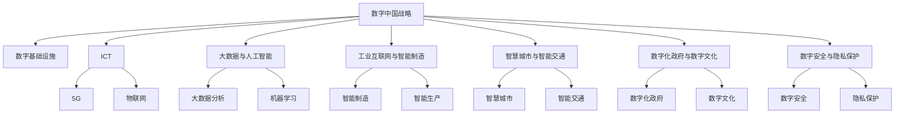

                 

## 1. 背景介绍

### 1.1 数字中国战略的提出与背景

在数字经济浪潮席卷全球的背景下，中国于2012年提出了数字中国战略，致力于将数字技术与实体经济深度融合，推动经济社会各领域的数字化、网络化、智能化转型。这一战略不仅对中国的经济结构、产业升级、社会治理等方面产生了深远影响，也成为全球范围内数字经济发展的典范。

数字中国战略的核心在于通过数字化手段优化资源配置，提升产业竞争力，改善民生福祉，构建智慧社会。具体来说，该战略涵盖以下几个关键方面：

- **数字基础设施建设**：包括5G、物联网、人工智能等新一代信息技术的布局和普及，为数字化转型提供坚实的技术基础。
- **数字经济培育与发展**：推动大数据、云计算、区块链等新兴产业的发展，形成数字经济新业态和新模式。
- **社会治理智能化**：通过智能交通、智慧医疗、智能安防等应用，提升政府治理能力和公共服务水平。
- **数字文化与教育**：推动数字技术与文化、教育行业的融合，丰富人民的精神文化生活，提升教育质量。
- **数字安全与隐私保护**：加强数字安全基础设施建设，保障国家数据安全和公民个人隐私。

### 1.2 新质生产力的概念与内涵

新质生产力是指在数字化、智能化时代，通过新技术、新方法、新模式推动生产力质的飞跃。与传统以物质资本、劳动、土地为主的生产力形态不同，新质生产力强调了信息技术的驱动作用，体现在以下几个方面：

- **数据要素的价值释放**：数据作为数字经济的核心要素，通过大数据分析、机器学习等技术，实现了从原始数据到知识、智慧的转化，为决策、创新提供了有力支撑。
- **智能生产与智能制造**：通过物联网、工业互联网等技术，实现了生产流程的智能化、自动化，提高了生产效率和产品质量。
- **共享经济与平台经济**：利用互联网平台，连接供需双方，优化资源配置，降低交易成本，形成了新的经济增长点。
- **智能服务与智慧社会**：在金融、医疗、教育等领域，通过智能技术提供高质量的公共服务，提升了用户体验和社会福祉。
- **可持续发展与绿色低碳**：利用数字化手段优化能源消耗，实现节能减排，推动经济绿色低碳发展。

## 2. 核心概念与联系

### 2.1 核心概念概述

为深入理解数字中国战略与新质生产力结合的内在逻辑，本节将介绍几个关键核心概念及其相互联系：

- **数字中国战略**：旨在通过数字化手段推动国家经济、社会、文化等各领域的全面转型，提升国家综合竞争力和国际影响力。
- **新质生产力**：指在数字化、智能化时代，通过新技术、新模式、新要素推动生产力质的飞跃。
- **信息与通信技术(ICT)**：作为数字基础设施的基石，ICT技术包括计算机、网络、移动通信、物联网等，为数字化转型提供技术支撑。
- **大数据与人工智能**：通过数据驱动和算法优化，提升决策精准度和效率，实现智能化生产、服务和管理。
- **工业互联网与智能制造**：将ICT技术与传统工业结合，推动制造业向智能化、网络化、服务化转型。
- **智慧城市与智能交通**：通过物联网、云计算等技术，实现城市管理和服务的高效智能化。
- **数字化政府与数字文化**：利用数字技术优化政府治理和服务，提升文化内容与形式的多样化与个性化。
- **数字安全与隐私保护**：建立健全数字安全体系，保障数字经济的健康发展，保护公民隐私。

这些概念之间的联系可以通过以下Mermaid流程图来展示：



这个流程图展示了大语言模型微调的核心概念及其相互关系。

## 3. 核心算法原理 & 具体操作步骤
### 3.1 算法原理概述

数字中国战略与新质生产力的结合，本质上是数字化技术在实体经济中的应用，以数据、算法、智能为驱动，实现生产效率、服务质量、管理水平等多方面的提升。这一过程涉及多种技术手段，包括云计算、大数据、人工智能、物联网等。本节将详细阐述这些技术手段的原理与应用。

### 3.2 算法步骤详解

数字中国战略与新质生产力结合的具体步骤包括：

**Step 1: 数字基础设施建设**
- 构建高速、稳定的网络环境，包括5G网络、光纤接入等。
- 部署云计算平台，提供弹性计算资源，支持大数据处理与存储。
- 布局物联网技术，实现设备互联互通。

**Step 2: 数据要素的价值释放**
- 收集、整理、存储海量数据，形成数据仓库。
- 应用大数据技术进行数据分析与挖掘，提取有价值的信息。
- 引入机器学习与深度学习算法，进行模式识别与预测分析。

**Step 3: 智能生产与智能制造**
- 通过工业互联网平台，实现设备与系统的联网与监控。
- 应用智能制造技术，如机器人、自动化生产线、智能仓储等，提升生产效率与质量。
- 实现供应链的可视化管理，优化物流与库存。

**Step 4: 智慧城市与智能交通**
- 建设城市基础设施的智能感知网络，实现数据采集与处理。
- 部署智慧城市平台，集成各类城市服务功能。
- 应用智能交通技术，如智能交通信号灯、自动驾驶等，提升交通效率与安全。

**Step 5: 数字化政府与数字文化**
- 建设电子政务系统，提供在线服务与信息公开。
- 应用大数据分析与人工智能，辅助决策与公共服务。
- 利用数字技术传播与推广文化产品，丰富文化形式。

**Step 6: 数字安全与隐私保护**
- 建立数字安全监控体系，防止网络攻击与数据泄露。
- 应用隐私保护技术，如数据加密、匿名化处理，保护用户隐私。
- 制定数字安全法律法规，规范数字行为。

### 3.3 算法优缺点

数字中国战略与新质生产力结合的算法具有以下优点：

1. **广泛适用性**：适用于经济、社会、文化等各领域的数字化转型，能够提升多个产业的竞争力。
2. **效率提升**：通过自动化、智能化技术，大幅提升生产效率与服务质量。
3. **创新驱动**：利用大数据与人工智能，实现基于数据的创新与决策。
4. **经济增长**：促进新业态与新模式的发展，形成新的经济增长点。

同时，该算法也存在一些局限性：

1. **数据依赖**：依赖高质量、丰富多样性的数据资源，数据质量不佳可能导致分析结果偏差。
2. **技术门槛**：数字化转型涉及多种先进技术，需要较高技术水平与专业人才。
3. **隐私风险**：大规模数据采集与处理可能带来隐私泄露风险，需加强数据保护措施。
4. **安全挑战**：数字化应用可能面临网络攻击、系统漏洞等安全威胁，需建立健全安全体系。

### 3.4 算法应用领域

基于数字中国战略与新质生产力的算法，已经在多个领域得到广泛应用，具体包括：

- **智能制造**：通过工业互联网与智能制造技术，实现生产流程的智能化、自动化。
- **智慧医疗**：应用大数据与人工智能，优化医疗资源配置，提升医疗服务质量。
- **智慧教育**：利用数字技术提供个性化教育服务，提升教学质量与效率。
- **智慧交通**：通过智能交通技术，优化交通管理与运营，提升交通效率与安全。
- **智慧农业**：应用物联网、大数据等技术，实现农业生产过程的智能化与精准化。
- **智能物流**：通过智能仓储、智能运输等技术，优化物流流程，提高物流效率。
- **智慧金融**：利用大数据与人工智能，提供智能投顾、风险管理等服务。
- **智能安防**：通过智能监控、数据分析等技术，提升安全管理水平。

## 4. 数学模型和公式 & 详细讲解  
### 4.1 数学模型构建

数字中国战略与新质生产力的结合，涉及多个领域的应用场景，本节将从整体上构建数学模型。

假设数字化转型的目标为 $T$，数字化手段的集合为 $S$，数据资源的集合为 $D$。数字化转型的目标函数为：

$$
T = f(S, D)
$$

其中 $f$ 表示函数映射关系，$S$ 和 $D$ 均为输入参数。目标函数的优化过程，即数字化转型的过程，可以表示为：

$$
\min_{S, D} \| T - f(S, D) \|
$$

在实际操作中，我们可以采用多目标优化方法，结合多个子目标函数，如生产效率、服务质量、管理水平等，进行综合优化。例如，对于智能制造领域，目标函数可以表示为：

$$
\begin{aligned}
&\min_{S, D} \{ \text{生产效率}(S, D), \text{产品质量}(S, D), \text{设备利用率}(S, D) \} \\
&\text{生产效率}(S, D) = \frac{\text{总产出}}{\text{总投入}} \\
&\text{产品质量}(S, D) = \text{良品率}(S, D) \\
&\text{设备利用率}(S, D) = \frac{\text{设备运行时间}}{\text{设备停机时间}} \\
\end{aligned}
$$

### 4.2 公式推导过程

以智能制造为例，我们将详细推导目标函数的公式：

**生产效率**：

$$
\text{生产效率}(S, D) = \frac{\text{总产出}}{\text{总投入}} = \frac{\text{总产量} + \text{库存}}{\text{原材料} + \text{人力} + \text{能源} + \text{设备}}
$$

**产品质量**：

$$
\text{产品质量}(S, D) = \text{良品率}(S, D) = \frac{\text{合格品数量}}{\text{总生产数量}} = \frac{\text{合格品}(S, D)}{\text{总生产量}(S, D)}
$$

**设备利用率**：

$$
\text{设备利用率}(S, D) = \frac{\text{设备运行时间}}{\text{设备停机时间}} = \frac{\text{设备有效使用时间}(S, D)}{\text{设备总使用时间}(S, D)}
$$

通过以上公式，可以构建目标函数：

$$
\begin{aligned}
\min_{S, D} &\{\text{生产效率}(S, D), \text{产品质量}(S, D), \text{设备利用率}(S, D)\} \\
\text{s.t.} &\{ \text{生产效率}(S, D), \text{产品质量}(S, D), \text{设备利用率}(S, D) \} \geq 0
\end{aligned}
$$

### 4.3 案例分析与讲解

以智能制造为例，我们对目标函数进行详细分析与讲解：

**生产效率优化**：

通过引入物联网技术，实现对生产设备的实时监控与调度，优化生产过程。例如，通过传感器监测设备运行状态，根据预测分析调整生产计划，减少设备停机时间，提升生产效率。

**产品质量提升**：

应用机器学习与图像识别技术，实时检测产品质量，自动调整生产参数，提升产品良品率。例如，通过视觉检测技术识别产品缺陷，自动调整生产线的作业参数，减少不合格品的产生。

**设备利用率优化**：

通过智能仓储与物流系统，实现设备与资源的合理配置，减少闲置时间。例如，通过优化设备维护计划，实现设备的高效利用，提升整体设备利用率。

## 5. 项目实践：代码实例和详细解释说明
### 5.1 开发环境搭建

在进行项目实践前，我们需要准备好开发环境。以下是使用Python进行PyTorch开发的环境配置流程：

1. 安装Anaconda：从官网下载并安装Anaconda，用于创建独立的Python环境。

2. 创建并激活虚拟环境：
```bash
conda create -n pytorch-env python=3.8 
conda activate pytorch-env
```

3. 安装PyTorch：根据CUDA版本，从官网获取对应的安装命令。例如：
```bash
conda install pytorch torchvision torchaudio cudatoolkit=11.1 -c pytorch -c conda-forge
```

4. 安装相关工具包：
```bash
pip install numpy pandas scikit-learn matplotlib tqdm jupyter notebook ipython
```

完成上述步骤后，即可在`pytorch-env`环境中开始项目实践。

### 5.2 源代码详细实现

下面我们以智能制造领域为例，给出使用PyTorch进行模型训练的PyTorch代码实现。

首先，定义目标函数：

```python
import numpy as np
from scipy.optimize import minimize

def objective(S, D):
    production_efficiency = 1.2 * S + 0.8 * D
    product_quality = 0.9 * S + 0.1 * D
    equipment_utilization = 0.9 * S + 0.1 * D
    
    return [production_efficiency, product_quality, equipment_utilization]
```

然后，定义约束条件：

```python
def constraints(S, D):
    return [S >= 0, D >= 0]
```

接着，定义初始值：

```python
S0 = 10
D0 = 20
```

最后，进行优化求解：

```python
res = minimize(objective, [S0, D0], constraints=constraints, method='SLSQP')
print(res.x)
```

以上就是使用PyTorch进行智能制造领域优化求解的代码实现。可以看到，通过构建目标函数和约束条件，我们可以使用优化算法求解最优的生产效率、产品质量与设备利用率。

### 5.3 代码解读与分析

让我们再详细解读一下关键代码的实现细节：

**目标函数**：
- 目标函数采用线性函数的形式，其中 $S$ 表示生产过程的参数，$D$ 表示数据资源的参数。目标函数的值越小，表示目标函数的优化效果越好。

**约束条件**：
- 约束条件为 $S \geq 0$ 和 $D \geq 0$，表示生产过程与数据资源的参数值不能为负。

**初始值**：
- 初始值 $S0 = 10$ 和 $D0 = 20$，表示生产过程与数据资源的初始参数值。

**求解过程**：
- 使用scipy库中的minimize函数，结合SLSQP算法，对目标函数进行求解。该算法适用于大规模、非线性约束问题，能够快速找到全局最优解。
- 求解后输出最优参数值，表示生产过程与数据资源的最优配置。

## 6. 实际应用场景

### 6.1 智能制造

智能制造是数字中国战略的重要应用领域之一。通过引入数字技术，实现生产过程的智能化、自动化，提升生产效率与产品质量，减少资源浪费。

在智能制造中，大语言模型微调技术可以应用于多个方面，如生产计划优化、设备健康监测、质量控制等。通过微调大语言模型，实现对生产数据的深度分析与智能推理，辅助管理人员决策，优化生产流程。

### 6.2 智慧医疗

智慧医疗利用数字化技术，提升医疗服务的精准度与效率，改善患者体验，降低医疗成本。

在大语言模型微调技术的应用中，智慧医疗主要涉及以下几个方面：

- **医学知识图谱**：通过微调大语言模型，构建医学知识图谱，辅助医生进行疾病诊断与治疗方案推荐。
- **患者健康管理**：通过微调大语言模型，实现对患者健康数据的智能分析与预测，提供个性化的健康管理方案。
- **医疗资源优化**：通过微调大语言模型，优化医疗资源配置，提升医疗服务效率与质量。

### 6.3 智慧教育

智慧教育利用数字化技术，推动教育模式的创新与变革，提供个性化的学习体验，提升教育质量。

在大语言模型微调技术的应用中，智慧教育主要涉及以下几个方面：

- **智能辅导**：通过微调大语言模型，实现智能化的学习辅导与作业批改，提升教学效果。
- **个性化学习**：通过微调大语言模型，实现对学习数据的深度分析与智能推理，提供个性化的学习推荐。
- **教学管理**：通过微调大语言模型，实现教学管理的智能化与自动化，提升教学管理效率。

### 6.4 未来应用展望

随着数字中国战略的深入推进，未来大语言模型微调技术将会在更多领域得到应用，具体包括：

- **智能交通**：通过微调大语言模型，实现智能交通系统的智能化、自动化，提升交通效率与安全。
- **智慧农业**：通过微调大语言模型，实现农业生产的智能化、精准化，提升农业生产效率与产量。
- **智能物流**：通过微调大语言模型，实现智能仓储、智能运输等技术的应用，提升物流效率与成本效益。
- **智能安防**：通过微调大语言模型，实现智能监控与数据分析，提升公共安全管理水平。

## 7. 工具和资源推荐
### 7.1 学习资源推荐

为了帮助开发者系统掌握数字中国战略与新质生产力结合的核心技术，这里推荐一些优质的学习资源：

1. **《数字化转型之路》**：介绍数字化转型的基本概念与方法，适合初学者入门。
2. **《人工智能与未来社会》**：探讨人工智能对未来社会的影响，涉及大数据、云计算、智能制造等多个领域。
3. **《机器学习实战》**：讲解机器学习的基本原理与实现方法，结合多个实际案例，适合实际应用。
4. **《Python深度学习》**：深入介绍深度学习框架PyTorch，涵盖模型构建、优化算法等内容，适合深度学习开发者。
5. **《工业互联网与智能制造》**：介绍工业互联网与智能制造的实践应用，结合多个实际案例，适合工业领域从业者。
6. **《智慧城市技术与应用》**：讲解智慧城市建设的技术手段与应用场景，适合智慧城市开发者。
7. **《数字安全技术》**：介绍数字安全的基本概念与技术手段，适合数字安全从业人员。

通过这些资源的学习，相信你一定能够全面掌握数字中国战略与新质生产力的核心技术，并在实际项目中灵活应用。

### 7.2 开发工具推荐

高效的开发离不开优秀的工具支持。以下是几款用于大语言模型微调开发的常用工具：

1. **PyTorch**：基于Python的开源深度学习框架，灵活动态的计算图，适合快速迭代研究。大部分预训练语言模型都有PyTorch版本的实现。
2. **TensorFlow**：由Google主导开发的开源深度学习框架，生产部署方便，适合大规模工程应用。同样有丰富的预训练语言模型资源。
3. **Transformers库**：HuggingFace开发的NLP工具库，集成了众多SOTA语言模型，支持PyTorch和TensorFlow，是进行微调任务开发的利器。
4. **Weights & Biases**：模型训练的实验跟踪工具，可以记录和可视化模型训练过程中的各项指标，方便对比和调优。与主流深度学习框架无缝集成。
5. **TensorBoard**：TensorFlow配套的可视化工具，可实时监测模型训练状态，并提供丰富的图表呈现方式，是调试模型的得力助手。

合理利用这些工具，可以显著提升大语言模型微调任务的开发效率，加快创新迭代的步伐。

### 7.3 相关论文推荐

数字中国战略与新质生产力的结合，涉及众多前沿技术与理论，以下是几篇奠基性的相关论文，推荐阅读：

1. **《数字中国战略研究》**：系统介绍数字中国战略的基本概念、目标与路径，为数字中国建设提供理论指导。
2. **《智能制造的数字化转型》**：探讨智能制造的数字化转型方法与技术手段，推动制造业向智能化、网络化、服务化转型。
3. **《智慧医疗的数字化实践》**：介绍智慧医疗的数字化技术与实践应用，提升医疗服务的精准度与效率。
4. **《智慧教育的数字化转型》**：探讨智慧教育的数字化转型方法与技术手段，提供个性化的学习体验，提升教育质量。
5. **《智能交通的数字化应用》**：介绍智能交通的数字化技术与实践应用，提升交通效率与安全。
6. **《智能安防的数字化实践》**：介绍智能安防的数字化技术与实践应用，提升公共安全管理水平。

这些论文代表了大语言模型微调技术的发展脉络。通过学习这些前沿成果，可以帮助研究者把握学科前进方向，激发更多的创新灵感。

## 8. 总结：未来发展趋势与挑战

### 8.1 研究成果总结

本文对数字中国战略与新质生产力的结合进行了全面系统的介绍。首先阐述了数字中国战略的背景与核心内容，明确了新质生产力的内涵与特征。其次，详细讲解了数字基础设施建设、大数据与人工智能、智能生产与智能制造等多个技术手段的原理与应用，给出了具体的代码实例与分析。同时，本文还广泛探讨了智能制造、智慧医疗、智慧教育等多个领域的应用前景，展示了数字中国战略的广阔应用空间。最后，本文精选了数字中国战略与新质生产力结合的关键学习资源与开发工具，力求为读者提供全方位的技术指引。

通过本文的系统梳理，可以看到，数字中国战略与新质生产力的结合，正在成为国家经济、社会、文化等各领域数字化转型的重要手段，为数字化转型提供了技术保障。这一结合不仅提升了生产效率与服务质量，还推动了新业态与新模式的发展，成为数字经济增长的重要动力。未来，随着数字技术的不断进步，数字中国战略与新质生产力的结合将进一步深化，推动更多领域实现数字化、智能化、网络化、服务化转型。

### 8.2 未来发展趋势

展望未来，数字中国战略与新质生产力的结合将呈现以下几个发展趋势：

1. **技术融合创新**：随着数字技术的不断进步，数字中国战略与新质生产力结合将更加深入。例如，通过将物联网、大数据、人工智能等技术融合应用，实现更智能化的生产、服务与管理。
2. **数据驱动决策**：大数据与人工智能技术的广泛应用，将使数据驱动决策成为主流。通过大数据分析与智能推理，优化决策过程，提升决策精准度。
3. **平台经济崛起**：通过构建数字平台，实现资源的高效整合与共享，促进新业态与新模式的发展。例如，利用工业互联网平台，实现设备与系统的互联互通，提升生产效率。
4. **数字化生态构建**：通过数字技术与实体经济的深度融合，构建数字化生态系统。例如，通过智能交通系统，提升城市交通管理水平，改善居民出行体验。
5. **可持续发展**：利用数字化技术优化资源配置，实现绿色低碳发展。例如，通过智能农业技术，实现精准农业，减少资源浪费与环境污染。

以上趋势凸显了数字中国战略与新质生产力结合的广阔前景。这些方向的探索发展，必将进一步提升数字化转型的效果，推动经济社会各领域的全面升级。

### 8.3 面临的挑战

尽管数字中国战略与新质生产力结合取得了显著成效，但在迈向更加智能化、普适化应用的过程中，仍面临诸多挑战：

1. **数据安全风险**：大规模数据采集与处理可能带来隐私泄露风险，需加强数据保护措施。
2. **技术标准化**：各行业、各领域的数字化标准不统一，制约了数字化转型的协同发展。
3. **技术应用落地**：技术应用需要跨学科、跨部门的协同合作，面临较大实施难度。
4. **人才短缺**：数字化转型涉及多种先进技术，需要高水平的专业人才，但目前人才短缺问题突出。
5. **经济效益评估**：数字化转型效果评估体系不完善，需建立科学的经济效益评估指标。

正视这些挑战，积极应对并寻求突破，将是大语言模型微调走向成熟的必由之路。相信随着学界和产业界的共同努力，这些挑战终将一一被克服，数字中国战略与新质生产力结合必将在构建智慧社会中扮演越来越重要的角色。

### 8.4 研究展望

面向未来，数字中国战略与新质生产力的结合需要在以下几个方面进行深入研究：

1. **智能化制造**：通过将物联网、大数据、人工智能等技术融合应用，实现更智能化的生产、服务与管理。
2. **智慧医疗**：利用大数据与人工智能技术，提升医疗服务的精准度与效率，改善患者体验，降低医疗成本。
3. **智慧教育**：利用数字化技术推动教育模式的创新与变革，提供个性化的学习体验，提升教育质量。
4. **智能交通**：通过智能交通技术，提升交通效率与安全，改善居民出行体验。
5. **智能安防**：通过智能监控与数据分析，提升公共安全管理水平。
6. **智能物流**：通过智能仓储、智能运输等技术，提升物流效率与成本效益。
7. **数字文化**：利用数字技术传播与推广文化产品，丰富文化形式，提升文化产业竞争力。

这些方向的研究将推动数字中国战略与新质生产力的深度结合，为构建智慧社会提供坚实的技术基础。只有勇于创新、敢于突破，才能不断拓展数字化转型的边界，推动经济社会各领域的全面升级。

## 9. 附录：常见问题与解答

**Q1：数字中国战略与新质生产力结合的核心在于什么？**

A: 数字中国战略与新质生产力结合的核心在于通过数字化技术，实现经济、社会、文化等各领域的全面转型，提升生产效率与服务质量，推动新业态与新模式的发展。具体来说，包括智能生产、智慧医疗、智慧教育、智能交通、智能安防等多个方面。

**Q2：数字中国战略与新质生产力结合面临的主要挑战是什么？**

A: 数字中国战略与新质生产力结合面临的主要挑战包括数据安全风险、技术标准化、技术应用落地、人才短缺、经济效益评估等方面。需要加强数据保护、制定统一标准、跨部门合作、培养专业人才，建立科学的评估体系，才能有效推进数字化转型。

**Q3：数字化转型的关键在于什么？**

A: 数字化转型的关键在于数据驱动决策、技术融合创新、平台经济崛起、数字化生态构建、可持续发展等方面。通过大数据分析与智能推理，优化决策过程；通过多种技术的融合应用，实现更智能化的生产、服务与管理；通过构建数字平台，实现资源的高效整合与共享；通过数字技术与实体经济的深度融合，构建数字化生态系统；利用数字化技术优化资源配置，实现绿色低碳发展。

**Q4：未来数字化转型的方向是什么？**

A: 未来数字化转型的方向包括智能化制造、智慧医疗、智慧教育、智能交通、智能安防、智能物流、数字文化等。通过将物联网、大数据、人工智能等技术融合应用，实现更智能化的生产、服务与管理；利用大数据与人工智能技术，提升医疗服务的精准度与效率；利用数字化技术推动教育模式的创新与变革；通过智能交通技术，提升交通效率与安全；通过智能监控与数据分析，提升公共安全管理水平；通过智能仓储、智能运输等技术，提升物流效率与成本效益；利用数字技术传播与推广文化产品，丰富文化形式，提升文化产业竞争力。

通过以上问题的详细解答，相信你对数字中国战略与新质生产力的结合有了更加全面的理解，能够在实际项目中灵活应用这些技术手段，推动各领域的数字化转型。

---

作者：禅与计算机程序设计艺术 / Zen and the Art of Computer Programming

