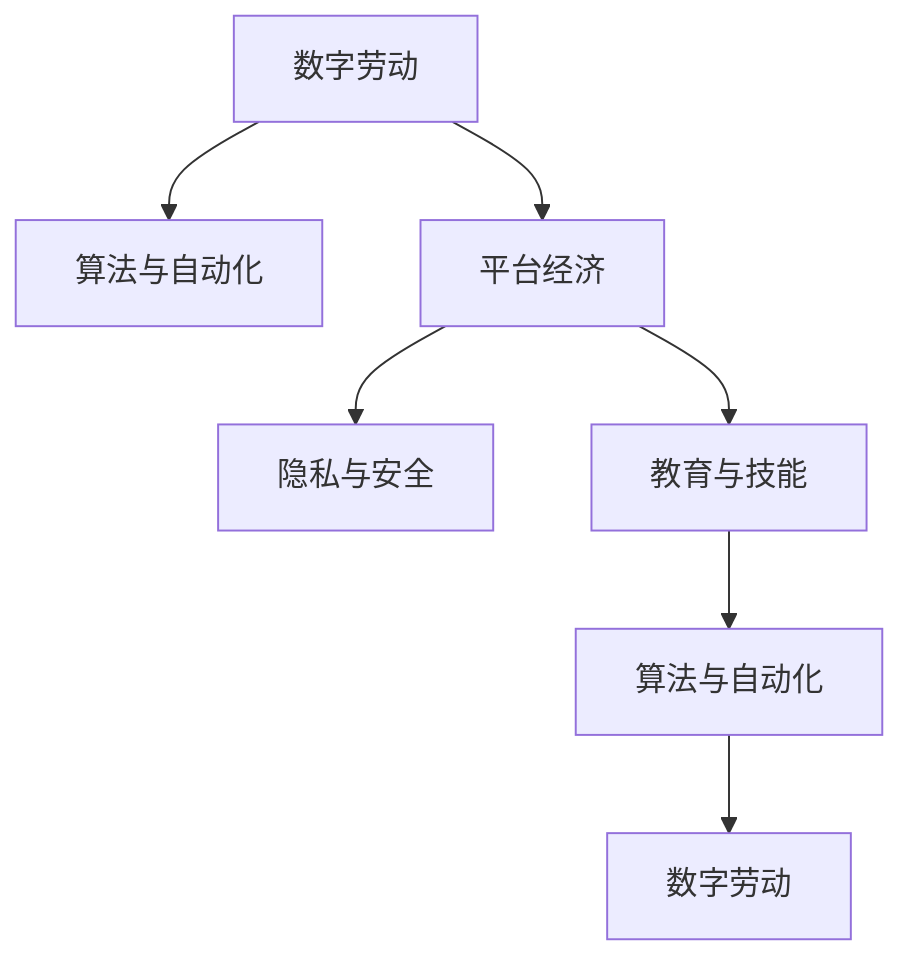

                 

# 数字劳动：人类计算的社会和经济影响

## 1. 背景介绍

### 1.1 问题由来

在全球化、数字化浪潮的推动下，数字经济逐渐成为各国经济发展的重要引擎。数字劳动，即通过计算技术完成的工作，已经成为现代社会的一个重要特征。从数据处理、软件开发到网络运营，数字劳动渗透到经济社会的方方面面。然而，数字劳动的兴起也引发了一系列社会经济问题，值得我们深入研究和探讨。

### 1.2 问题核心关键点

数字劳动的社会经济影响主要体现在以下几个方面：

- **劳动性质变化**：数字劳动以数据处理为主，改变了传统的劳动模式，模糊了劳动和休闲的界限。
- **收入分配差异**：数字劳动资源往往集中在少数平台和公司手中，加剧了收入分配不均。
- **隐私与安全风险**：数字劳动依赖大量个人数据，引发了隐私保护和数据安全问题。
- **技能与教育需求**：数字劳动需要较高的技术技能，对教育体系提出了新的要求。
- **伦理与责任问题**：数字劳动可能涉及伦理问题，如算法偏见、自动化决策等。

理解这些核心问题，有助于我们全面把握数字劳动的社会经济影响，从而制定合理的政策和措施，促进数字经济的可持续发展。

## 2. 核心概念与联系

### 2.1 核心概念概述

为了更好地理解数字劳动的社会经济影响，本节将介绍几个关键概念及其之间的关系：

- **数字劳动(Digital Labor)**：利用计算机和网络技术完成的各种形式的工作，包括软件开发、数据分析、网络运营等。
- **算法与自动化**：用于自动化处理数字劳动的算法和技术，如机器学习、深度学习、自动化流程等。
- **平台经济**：基于互联网的商业模式，如共享经济、电商平台、社交媒体等，通过数字劳动创造价值。
- **隐私与安全**：数字劳动过程中涉及的大量个人数据，需要严格保护，防止隐私泄露和安全风险。
- **教育与技能**：数字劳动需要较高的技术技能，推动了教育体系的变革。

这些概念之间存在复杂的相互关系，共同构成了数字劳动的社会经济框架。

### 2.2 核心概念原理和架构的 Mermaid 流程图



这个流程图展示了数字劳动的相关概念及其相互关系。数字劳动依赖于算法与自动化技术，并通过平台经济创造价值。隐私和安全问题、教育与技能需求又进一步影响了数字劳动的可持续性和公平性。

## 3. 核心算法原理 & 具体操作步骤

### 3.1 算法原理概述

数字劳动的核心算法主要包括两类：数据处理和自动化流程。数据处理算法用于分析和处理大量数据，生成有价值的信息；自动化流程算法则用于自动化执行任务，提高劳动效率。

数据处理算法包括但不限于：

- **机器学习算法**：如分类、回归、聚类等，用于从数据中提取模式和知识。
- **深度学习算法**：如卷积神经网络、循环神经网络等，用于处理图像、文本、语音等复杂数据。
- **自然语言处理(NLP)**：如词向量、BERT等，用于分析和理解文本数据。

自动化流程算法包括但不限于：

- **流程自动化**：如工作流引擎、机器学习流程管理等，用于自动化执行任务。
- **机器人流程自动化(RPA)**：如UiPath、Blue Prism等，用于模拟人工操作，执行重复性任务。
- **自动化测试**：如单元测试、集成测试、功能测试等，用于确保软件质量。

### 3.2 算法步骤详解

数字劳动的算法步骤主要包括以下几个方面：

1. **数据收集**：收集大量的数据，如文本、图像、音频等，作为算法训练的输入。
2. **数据预处理**：清洗、格式化、标注数据，以便于后续处理。
3. **模型训练**：使用机器学习、深度学习等算法，训练模型，生成预测模型。
4. **模型应用**：将训练好的模型应用于实际场景，进行数据处理、任务执行等。
5. **模型评估与优化**：评估模型的性能，进行参数调整和优化，提高模型效果。

### 3.3 算法优缺点

数字劳动算法具有以下优点：

- **高效性**：算法可以高效处理大量数据，提高劳动效率。
- **准确性**：算法可以精确分析数据，生成高准确度的结果。
- **可扩展性**：算法可以轻松扩展到不同的数据类型和任务场景。

然而，数字劳动算法也存在一些缺点：

- **资源消耗**：算法需要大量的计算资源，如CPU、GPU、内存等。
- **数据依赖**：算法的性能很大程度上取决于数据的质量和数量。
- **复杂性**：算法的实现和优化需要较高的技术水平。
- **公平性问题**：算法可能加剧数据偏见，导致结果不公平。

### 3.4 算法应用领域

数字劳动算法在多个领域得到了广泛应用，包括：

- **金融科技(Fintech)**：如智能投顾、风险管理、欺诈检测等。
- **医疗健康**：如病历分析、疾病预测、药物研发等。
- **零售电商**：如客户分析、推荐系统、供应链优化等。
- **智能制造**：如生产调度、质量控制、设备维护等。
- **能源环保**：如能源管理、污染监测、资源优化等。

这些领域的应用，展示了数字劳动算法的强大潜力和广泛应用。

## 4. 数学模型和公式 & 详细讲解 & 举例说明

### 4.1 数学模型构建

数字劳动中的核心算法，如机器学习和深度学习，通常使用以下数学模型：

- **线性回归**：$y = \theta_0 + \theta_1 x_1 + \cdots + \theta_n x_n$
- **逻辑回归**：$P(y=1|x) = \sigma(\theta_0 + \theta_1 x_1 + \cdots + \theta_n x_n)$
- **卷积神经网络**：$y = \sum_{i=1}^{C} \sum_{j=1}^{H} \sum_{k=1}^{W} w_{i,j,k} x_{i,j,k}$
- **循环神经网络**：$y_t = f(x_t, h_{t-1})$
- **自编码器**：$x = h_1 \cdot w_2 \cdot h_0 + b_0$，$h_1 = h_0 \cdot w_2 \cdot x + b_0$

### 4.2 公式推导过程

以逻辑回归为例，推导其损失函数和梯度更新公式。

假设训练数据集为 $(x_i, y_i)$，其中 $y_i \in \{0,1\}$，$x_i \in \mathbb{R}^n$。定义模型的损失函数为交叉熵损失：

$$
L = -\frac{1}{N}\sum_{i=1}^N [y_i \log P(y_i|x_i) + (1-y_i) \log (1-P(y_i|x_i))]
$$

其中 $P(y_i|x_i) = \sigma(\theta_0 + \theta_1 x_{i1} + \cdots + \theta_n x_{in})$，$\sigma$ 为 sigmoid 函数。

为了最小化损失函数 $L$，需要对模型参数 $\theta$ 进行优化。根据梯度下降法，模型的梯度更新公式为：

$$
\theta \leftarrow \theta - \alpha \nabla_{\theta} L
$$

其中 $\alpha$ 为学习率，$\nabla_{\theta} L$ 为损失函数对模型参数 $\theta$ 的梯度，可以通过反向传播算法计算。

### 4.3 案例分析与讲解

以金融科技中的风险管理为例，分析数字劳动算法的应用。

假设有一家银行希望通过数字劳动算法来预测贷款违约率。首先需要收集历史贷款数据，包括贷款金额、还款记录、信用评分等。然后对数据进行清洗、预处理，构建数据集。接着，使用逻辑回归模型对数据进行训练，预测贷款违约概率。最后，根据预测结果，银行可以调整贷款政策，降低违约风险。

## 5. 项目实践：代码实例和详细解释说明

### 5.1 开发环境搭建

在项目实践中，我们需要准备好开发环境。以下是使用Python进行TensorFlow开发的流程：

1. 安装Anaconda：从官网下载并安装Anaconda，用于创建独立的Python环境。
2. 创建并激活虚拟环境：
```bash
conda create -n tf-env python=3.8
conda activate tf-env
```
3. 安装TensorFlow：根据CUDA版本，从官网获取对应的安装命令。例如：
```bash
conda install tensorflow
```
4. 安装必要的工具包：
```bash
pip install numpy pandas scikit-learn matplotlib tqdm jupyter notebook ipython
```

完成上述步骤后，即可在 `tf-env` 环境中开始数字劳动算法的开发实践。

### 5.2 源代码详细实现

以下是一个使用TensorFlow实现金融科技风险管理的Python代码示例。

```python
import tensorflow as tf
from tensorflow.keras import layers
from sklearn.model_selection import train_test_split
from sklearn.metrics import accuracy_score

# 读取数据集
data = pd.read_csv('loan_data.csv')

# 数据预处理
X = data.drop(['loan_status'], axis=1)
y = data['loan_status']

# 分割数据集
X_train, X_test, y_train, y_test = train_test_split(X, y, test_size=0.2, random_state=42)

# 构建模型
model = tf.keras.Sequential([
    layers.Dense(64, activation='relu', input_shape=[len(X_train.keys())]),
    layers.Dense(32, activation='relu'),
    layers.Dense(1, activation='sigmoid')
])

# 编译模型
model.compile(optimizer=tf.keras.optimizers.Adam(learning_rate=0.001),
              loss='binary_crossentropy',
              metrics=['accuracy'])

# 训练模型
model.fit(X_train, y_train, epochs=10, batch_size=32)

# 评估模型
y_pred = model.predict(X_test)
y_pred = (y_pred > 0.5).astype(int)
accuracy = accuracy_score(y_test, y_pred)
print(f'Accuracy: {accuracy:.2f}')
```

这个代码实现了逻辑回归模型对贷款违约率的预测。首先读取贷款数据集，然后对数据进行预处理和分割，接着构建模型、编译模型、训练模型、评估模型，并输出准确率。

### 5.3 代码解读与分析

让我们详细解读一下关键代码的实现细节：

**读取数据集**：使用pandas库读取CSV格式的数据集。

**数据预处理**：将数据集分割为特征（X）和标签（y），并使用train_test_split函数进行训练集和测试集的划分。

**构建模型**：使用Sequential模型，依次添加全连接层、激活函数、输出层，其中输出层使用sigmoid激活函数，表示二分类问题。

**编译模型**：使用Adam优化器和二元交叉熵损失函数进行模型编译。

**训练模型**：使用fit函数对模型进行训练，设定epochs和batch_size参数，表示训练轮数和批量大小。

**评估模型**：使用predict函数对测试集进行预测，并使用accuracy_score函数计算准确率。

可以看到，使用TensorFlow进行数字劳动算法的开发实践，代码简洁高效，易于理解和实现。

## 6. 实际应用场景

### 6.1 金融科技

金融科技领域是数字劳动的重要应用场景。数字劳动算法在风险管理、智能投顾、金融欺诈检测等方面都有广泛应用。

以风险管理为例，银行和保险公司可以使用数字劳动算法对客户的信用风险、贷款违约风险、健康风险等进行预测和评估，从而制定更加科学的信贷政策和保险策略。

### 6.2 医疗健康

医疗健康领域也是数字劳动的重要应用场景。数字劳动算法在疾病预测、病历分析、药物研发等方面都有广泛应用。

以疾病预测为例，医院和研究机构可以使用数字劳动算法对患者的临床数据进行分析，预测其患病风险，从而进行早期干预和治疗。

### 6.3 智能制造

智能制造领域也是数字劳动的重要应用场景。数字劳动算法在生产调度、质量控制、设备维护等方面都有广泛应用。

以生产调度为例，工厂可以使用数字劳动算法对生产线和设备进行实时监控和调度，优化生产流程，提高生产效率和质量。

### 6.4 未来应用展望

未来，数字劳动算法将在更多领域得到应用，为社会经济发展注入新的动力。

在智慧城市治理中，数字劳动算法可以应用于城市事件监测、舆情分析、应急指挥等环节，提高城市管理的自动化和智能化水平，构建更安全、高效的未来城市。

在智慧教育中，数字劳动算法可以应用于作业批改、学情分析、知识推荐等方面，因材施教，促进教育公平，提高教学质量。

在智慧医疗中，数字劳动算法可以应用于病历分析、疾病预测、药物研发等环节，提升医疗服务的智能化水平，辅助医生诊疗，加速新药开发进程。

随着数字劳动算法的不断进步，相信其将在更多领域发挥更大的作用，推动社会经济的发展和进步。

## 7. 工具和资源推荐

### 7.1 学习资源推荐

为了帮助开发者系统掌握数字劳动的理论基础和实践技巧，这里推荐一些优质的学习资源：

1. 《深度学习》系列书籍：由Ian Goodfellow、Yoshua Bengio和Aaron Courville合著，全面介绍了深度学习的基本概念和算法。
2. 《TensorFlow实战》书籍：由Xavier Bresson和Cédric Nicolodi合著，详细介绍了TensorFlow的使用方法和最佳实践。
3. 《Python数据科学手册》书籍：由Jake VanderPlas合著，涵盖Python在数据科学中的应用，包括数据处理、机器学习、可视化等。
4. Coursera《深度学习专项课程》：由Andrew Ng教授开设，系统讲解深度学习的基本概念和算法。
5. edX《TensorFlow专业证书》：由Google提供，涵盖TensorFlow的高级应用和最佳实践。

通过对这些资源的学习实践，相信你一定能够快速掌握数字劳动算法的精髓，并用于解决实际问题。

### 7.2 开发工具推荐

高效的开发离不开优秀的工具支持。以下是几款用于数字劳动算法的开发工具：

1. TensorFlow：由Google主导开发的开源深度学习框架，支持分布式计算和GPU加速，适合大规模工程应用。
2. PyTorch：由Facebook开发的开源深度学习框架，灵活性高，适合研究和原型开发。
3. Keras：基于TensorFlow和Theano的高级API，简单易用，适合快速原型开发。
4. Jupyter Notebook：基于Python的交互式开发环境，支持代码块和数据可视化，适合数据探索和原型开发。
5. Git：版本控制工具，支持多人协作开发和代码管理，适合团队开发。

合理利用这些工具，可以显著提升数字劳动算法的开发效率，加快创新迭代的步伐。

### 7.3 相关论文推荐

数字劳动算法的发展源于学界的持续研究。以下是几篇奠基性的相关论文，推荐阅读：

1. "Deep Learning" 书籍中的相关章节：介绍了深度学习的基本概念和算法。
2. "TensorFlow: A System for Large-Scale Machine Learning" 论文：由TensorFlow团队发表，详细介绍了TensorFlow的架构和应用。
3. "Understanding the Difficulties of Training Deep Neural Networks" 论文：由Yoshua Bengio发表，讨论了深度神经网络训练的困难和解决方案。
4. "On the importance of initialization and momentum in deep learning" 论文：由Xavier Glorot和Yoshua Bengio发表，讨论了初始化和动量对深度神经网络的影响。
5. "ImageNet Classification with Deep Convolutional Neural Networks" 论文：由Alex Krizhevsky等发表，展示了深度卷积神经网络在图像分类任务上的优异表现。

这些论文代表了大规模数字劳动算法的理论和技术进展，阅读这些论文有助于理解数字劳动算法的核心思想和实际应用。

## 8. 总结：未来发展趋势与挑战

### 8.1 研究成果总结

本文对数字劳动算法的核心概念和实际应用进行了全面系统的介绍。首先阐述了数字劳动算法的基本原理和实际应用场景，明确了数字劳动在经济社会中的重要性和广泛应用。其次，从理论到实践，详细讲解了数字劳动算法的数学模型和操作步骤，给出了数字劳动算法的完整代码实现。同时，本文还广泛探讨了数字劳动算法在金融科技、医疗健康、智能制造等多个领域的应用前景，展示了数字劳动算法的强大潜力和广泛应用。

通过本文的系统梳理，可以看到，数字劳动算法已经成为推动数字经济发展的重要引擎，其高效、准确、可扩展的特性使其在多个领域得到了广泛应用。未来，随着数字劳动算法的不断进步和创新，其将进一步推动数字经济的发展和进步。

### 8.2 未来发展趋势

展望未来，数字劳动算法将呈现以下几个发展趋势：

1. **高效化**：数字劳动算法将不断优化，提高计算效率和资源利用率，降低计算成本。
2. **智能化**：数字劳动算法将融合更多智能技术，如自然语言处理、机器视觉等，提升算法智能水平。
3. **可解释性**：数字劳动算法将加强解释性，提供更透明的决策过程，增强用户信任。
4. **伦理化**：数字劳动算法将加强伦理约束，避免算法偏见和歧视，确保公平性。
5. **普适化**：数字劳动算法将面向更广泛的领域，推动各行业的数字化转型。

以上趋势展示了数字劳动算法的广阔前景，这些方向的探索发展，必将进一步提升数字劳动算法的性能和应用范围，为数字经济的发展注入新的动力。

### 8.3 面临的挑战

尽管数字劳动算法已经取得了瞩目成就，但在迈向更加智能化、普适化应用的过程中，它仍面临着诸多挑战：

1. **数据隐私与安全**：数字劳动算法依赖大量数据，数据隐私和安全问题亟需解决。
2. **算法公平性**：数字劳动算法可能存在算法偏见，导致不公平结果，需要进一步研究。
3. **资源消耗**：数字劳动算法需要大量计算资源，如何在资源有限的情况下优化算法，是一个重要问题。
4. **伦理道德**：数字劳动算法可能涉及伦理道德问题，如自动化决策、数据使用等，需要规范和监管。
5. **可持续性**：数字劳动算法需要考虑长期可持续性，避免过度依赖资源和环境。

这些挑战需要研究者、开发者和政策制定者共同努力，才能克服，推动数字劳动算法的健康发展。

### 8.4 研究展望

面对数字劳动算法面临的挑战，未来的研究需要在以下几个方面寻求新的突破：

1. **隐私保护**：研究数据隐私保护技术，确保数据安全和用户隐私。
2. **公平性**：研究算法公平性评估和改进方法，避免算法偏见和歧视。
3. **资源优化**：研究资源优化技术，提高计算效率和资源利用率。
4. **伦理约束**：研究伦理道德约束，确保数字劳动算法的公平性、透明性和安全性。
5. **普适性**：研究普适性设计方法，使数字劳动算法适用于更多领域。

这些研究方向的探索，必将引领数字劳动算法迈向更高的台阶，为构建安全、可靠、可解释、可控的智能系统铺平道路。面向未来，数字劳动算法还需要与其他人工智能技术进行更深入的融合，如知识表示、因果推理、强化学习等，多路径协同发力，共同推动数字劳动算法的进步。

## 9. 附录：常见问题与解答

**Q1：数字劳动算法的核心思想是什么？**

A: 数字劳动算法的核心思想是通过计算技术，对数据进行自动化处理和分析，生成有价值的信息和决策。其核心在于数据驱动和算法优化，通过不断迭代和优化，提升算法的准确性和效率。

**Q2：数字劳动算法的优缺点有哪些？**

A: 数字劳动算法具有以下优点：高效性、准确性、可扩展性。然而，其缺点在于资源消耗大、数据依赖性强、算法复杂度高、公平性问题等。

**Q3：数字劳动算法在实际应用中需要注意哪些问题？**

A: 数字劳动算法在实际应用中需要注意数据隐私和安全、算法公平性、资源优化、伦理道德约束、可持续性等问题。

**Q4：数字劳动算法未来面临哪些挑战？**

A: 数字劳动算法未来面临的挑战包括数据隐私与安全、算法公平性、资源消耗、伦理道德约束、可持续性等问题。

**Q5：数字劳动算法的未来发展趋势是什么？**

A: 数字劳动算法的未来发展趋势包括高效化、智能化、可解释性、伦理化和普适化。

---
作者：禅与计算机程序设计艺术 / Zen and the Art of Computer Programming

