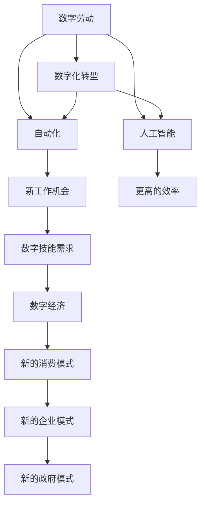

                 

# 数字劳动：人类计算的社会和经济影响

> 关键词：数字劳动, 人类计算, 社会影响, 经济影响, 智能化, Automation, AI, 人工智能

## 1. 背景介绍

### 1.1 问题由来

随着信息技术的发展，数字劳动的概念越来越受到人们的关注。数字劳动是指利用数字技术进行的工作，包括数据处理、信息分析、计算机编程等。它的出现改变了传统劳动方式，促进了生产效率的提高，但同时也带来了社会和经济的一系列影响。本文将探讨数字劳动在社会和经济方面的影响。

### 1.2 问题核心关键点

数字劳动的社会和经济影响可以从以下几个方面来分析：

- **自动化与失业**：自动化技术的发展可能导致某些工作岗位的消失，特别是那些依赖于重复性任务的工作。这种变革可能会对劳动力市场产生压力，增加失业率。
- **技能更新与重新培训**：随着技术的进步，新的工作技能和专业知识变得更加重要。个人和企业需要不断更新技能以适应数字化世界，这可能需要大量的投资和时间。
- **经济增长与创新**：数字劳动可以促进经济增长，尤其是在创造新的产品和服务方面。创新技术的采用可以提高生产效率，降低成本，并创造新的就业机会。
- **隐私与安全问题**：随着数据的数字化，隐私和安全问题变得更加突出。企业和政府需要采取措施保护敏感数据，并对数据处理的透明度负责。
- **社会不平等**：数字劳动可能加剧社会不平等，特别是在那些没有获取数字技能和资源的社区中。公平的教育和培训机会对缩小这种差距至关重要。

## 2. 核心概念与联系

### 2.1 核心概念概述

为了更好地理解数字劳动在社会和经济方面的影响，需要了解几个关键概念：

- **数字化转型**：指企业和组织将传统的业务流程转移到数字平台上的过程。
- **人工智能**：指计算机系统执行通常需要人类智能的任务的能力，例如视觉识别、语言处理和决策。
- **自动化**：指使用技术来自动执行任务的过程。
- **数字技能**：指与信息技术相关的技能，包括编程、数据分析、数字艺术和设计等。
- **数字经济**：指依赖于数字技术和信息交流的经济活动。

这些概念相互关联，共同塑造了数字劳动在社会和经济中的影响。

### 2.2 核心概念联系

数字劳动的社会和经济影响是多维的，它影响着个人的生活、劳动力市场、企业和组织的运营以及整个经济的结构。下面是这些概念之间的联系：

- **数字化转型**是实现自动化和人工智能的基础。
- **自动化**可以导致某些工作的消失，但也创造了新的工作机会，例如软件开发和数据分析。
- **人工智能**加强了自动化，能够执行复杂的任务，提高效率。
- **数字技能**是使用这些技术的关键，需要从学术和职业培训中学习。
- **数字经济**是由这些技术驱动的，它改变了消费者、企业和政府的互动方式。

### 2.3 核心概念图

为了更清晰地展示这些概念之间的联系，可以使用以下Mermaid图：



这个图展示了数字劳动和相关概念之间的关系，数字劳动通过数字化转型、自动化和人工智能的驱动，引发了新的工作机会、更高的效率、更强的数字技能需求以及新的消费和企业模式。

## 3. 核心算法原理 & 具体操作步骤

### 3.1 算法原理概述

数字劳动的核心是利用信息技术自动化和优化工作流程。自动化和人工智能算法通过学习和识别模式，减少了人为干预的需要。例如，机器学习算法可以根据特征和标签自动分类数据，而无需人工干预。

### 3.2 算法步骤详解

实现数字劳动时，可以采用以下步骤：

1. **识别自动化和人工智能的潜在应用**：评估哪些任务可以自动化，哪些可以利用人工智能加强。
2. **收集和清洗数据**：为机器学习算法提供高质量的数据，这是实现自动化和智能化的基础。
3. **设计和训练模型**：基于数据，设计和训练能够执行特定任务的算法模型。
4. **部署和监控**：将训练好的模型部署到生产环境中，监控其性能并根据需要进行调整。

### 3.3 算法优缺点

使用自动化和人工智能的优缺点包括：

- **优点**：
    - 提高生产效率
    - 降低成本
    - 提高准确性
    - 解放人力资源
- **缺点**：
    - 可能导致失业
    - 需要大量的初始投资
    - 难以解释和信任模型的决策
    - 隐私和安全问题

### 3.4 算法应用领域

自动化和人工智能已经在各行各业得到应用，包括制造业、零售业、医疗保健、金融服务等领域。这些技术提高了效率，降低了成本，并为新型工作和企业模式提供了可能。

## 4. 数学模型和公式 & 详细讲解 & 举例说明

### 4.1 数学模型构建

数学模型可以用来评估自动化和人工智能的成本效益分析，计算其在不同领域中的潜在影响。

例如，自动化程度可以用以下公式表示：

$$
A = \frac{C}{L}
$$

其中，A是自动化程度，C是投资成本，L是劳动力成本。

### 4.2 公式推导过程

为了计算特定行业的潜在自动化收益，我们可以建立如下模型：

$$
ROI = \frac{Savings - Costs}{Investment}
$$

其中，ROI是回报率，Savings是通过自动化节省的费用，Costs是实施自动化所需的成本，Investment是用于自动化的初始投资。

### 4.3 案例分析与讲解

举一个制造业的案例分析：一个制造业公司通过自动化其生产线，可以减少人工操作的错误和损耗，从而减少了维修和更换零件的成本。此外，自动化生产线的速度和精度可以提高，从而增加产量和销售收入。

## 5. 项目实践：代码实例和详细解释说明

### 5.1 开发环境搭建

自动化和人工智能的开发需要各种工具和库。在Python中，常用的库包括TensorFlow、PyTorch和Scikit-learn。以下是搭建一个基本开发环境的步骤：

1. 安装Python：从Python官方网站下载并安装Python。
2. 安装必要的库：通过pip命令安装TensorFlow、PyTorch和Scikit-learn等库。

### 5.2 源代码详细实现

这里是一个简单的机器学习项目示例，用于演示如何使用Python和Scikit-learn库实现分类器。

```python
from sklearn.datasets import load_iris
from sklearn.model_selection import train_test_split
from sklearn.linear_model import LogisticRegression

# 加载数据集
iris = load_iris()
X = iris.data
y = iris.target

# 划分数据集为训练集和测试集
X_train, X_test, y_train, y_test = train_test_split(X, y, test_size=0.2, random_state=42)

# 初始化分类器
classifier = LogisticRegression()

# 训练模型
classifier.fit(X_train, y_train)

# 预测测试集的标签
y_pred = classifier.predict(X_test)

# 评估模型性能
print("准确率：", classifier.score(X_test, y_test))
```

在这个例子中，我们使用Scikit-learn的Iris数据集来训练和评估一个逻辑回归分类器。通过执行此代码，我们可以预测新的样本属于哪个花卉品种，并评估模型的准确性。

### 5.3 代码解读与分析

该代码的每一行都有其特定的功能：

- **load_iris()**：加载Iris数据集。
- **train_test_split()**：将数据集分割为训练集和测试集。
- **LogisticRegression()**：初始化逻辑回归分类器。
- **fit()**：使用训练集训练模型。
- **predict()**：使用测试集预测标签。
- **score()**：评估模型准确性。

### 5.4 运行结果展示

通过运行代码，我们可以看到模型的准确率，反映了模型的性能。

## 6. 实际应用场景

### 6.1 智能制造

自动化和人工智能在制造业中被广泛应用，以提高生产效率和产品质量。智能机器人可以在复杂环境中进行任务，如产品装配和焊接。预测性维护技术可以通过分析设备运行数据，预测故障，减少停机时间。

### 6.2 智慧城市

智慧城市通过集成自动化和人工智能技术，提高城市管理效率。交通管理系统可以利用传感器和摄像头来监控交通流量，并通过机器学习算法预测拥堵区域。智能城市的能源管理系统可以根据实时数据优化能源消耗。

### 6.3 医疗保健

自动化和人工智能在医疗保健领域的应用正在增长，用于提高诊断准确性和个性化治疗。影像分析软件可以自动检测和分类疾病，如癌症和心脏病。机器学习算法可以分析患者数据，预测疾病进展和预后。

### 6.4 未来应用展望

随着技术的发展，自动化和人工智能的应用将扩展到更多领域。自动化的智能化水平将继续提高，算法将更加复杂，以解决更复杂的问题。人工智能也将更加依赖数据，从而需要更强大的数据分析能力。

### 6.5 技术挑战与伦理问题

虽然自动化和人工智能带来了许多好处，但也带来了技术挑战和伦理问题。例如，数据隐私和安全问题需要加以解决，以防止数据泄露和滥用。算法透明度和可解释性也成为关注点，以确保公平和正义。

### 6.6 政策和指导原则

为了应对自动化和人工智能的挑战，需要制定合适的政策和指导原则。这些政策应该考虑经济、社会和伦理方面的影响，确保技术的好处可被公平分享，同时降低潜在的风险。

## 7. 工具和资源推荐

### 7.1 学习资源推荐

为了深入了解数字劳动及其社会和经济影响，可以阅读以下资源：

1. **书籍**：《Digital Labor：The Cleaners of Internet Content》、《The Future of Work》等。
2. **在线课程**：Coursera和edX等平台上的AI和数据科学课程。
3. **专业杂志**：如MIT Technology Review、Harvard Business Review等。

### 7.2 开发工具推荐

自动化和人工智能的开发需要特定的工具和库。以下是一些推荐的工具：

1. **Python**：用于编写自动化脚本和机器学习模型。
2. **TensorFlow**：Google的开源机器学习框架。
3. **PyTorch**：Facebook的开源机器学习框架。
4. **Scikit-learn**：一个用于机器学习的Python库。
5. **R**：用于统计分析和数据可视化。

## 8. 总结：未来发展趋势与挑战

### 8.1 总结

数字劳动已经成为经济和社会发展的关键驱动力。通过自动化和人工智能的应用，许多行业已经实现了提高生产效率和产品质量的重大突破。然而，这也带来了工作岗位的变化、技能更新的需求以及新的伦理和社会问题。

### 8.2 未来发展趋势

随着技术的不断发展，预计自动化和人工智能将继续在社会和经济中发挥越来越大的作用。未来，智能化将更多地用于提高产品和服务的个性化，以及更加精确和自动化的决策制定。

### 8.3 面临的挑战

然而，自动化和人工智能的发展还面临一些挑战，如工作岗位的流失、数据隐私和安全问题以及算法透明度和可解释性的需求。解决这些挑战将需要社会、经济和技术政策的共同努力。

### 8.4 未来展望

总的来说，自动化和人工智能的发展潜力巨大，但需要确保实现的方式既公平又可持续。通过对社会和经济的影响进行深入研究，并制定适当的政策和指导原则，我们可以充分利用这些技术，同时减少其潜在风险。

## 9. 附录：常见问题与解答

### 9.1 如何确保自动化和人工智能的公平和透明？

A: 确保公平和透明需要制定明确的政策和规则，如数据保护法律、算法透明度标准和偏见测试。公众也应参与到决策过程中，以确保所有利益相关者都能被听到。

### 9.2 如何应对自动化带来的工作岗位流失？

A: 提供广泛的教育和培训机会，帮助工作人员更新技能和转换职业。政府和企业也可以创造新的工作机会，利用自动化和人工智能技术。

### 9.3 如何保护自动化和人工智能数据的安全？

A: 制定和执行严格的数据安全政策，包括加密、访问控制和备份措施。对所有涉及敏感数据的自动化系统实施严格的安全审计和测试。

---

作者：禅与计算机程序设计艺术 / Zen and the Art of Computer Programming

