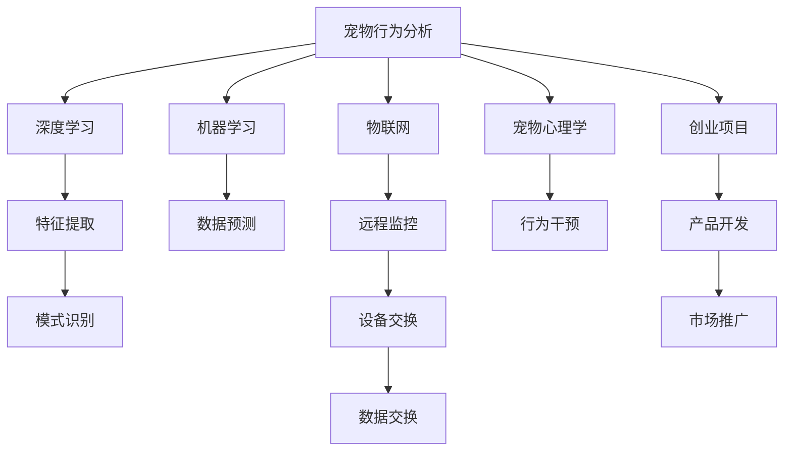

                 

# 数字化宠物行为分析创业：理解宠物的新方式

> 关键词：数字化，宠物行为分析，机器学习，深度学习，智能监控，物联网，宠物心理学，创业项目

## 1. 背景介绍

### 1.1 问题由来
随着生活水平的提高，越来越多的家庭将宠物作为家庭成员来对待。宠物的身心健康直接关系到家庭成员的幸福感。然而，大多数家庭对宠物的行为模式并不完全了解，无法及时发现宠物的健康状况和行为问题，从而影响了家庭成员的生活质量。

传统宠物行为分析主要依赖宠物主人通过观察或与宠物互动获得的信息。然而，人类行为往往具有主观性，且宠物不会用语言表达自己的感受，导致获取的数据具有较大偏差。而数字化宠物行为分析项目可以利用机器学习、深度学习等先进技术，通过传感器和智能设备采集大量客观数据，进行精准分析，以更客观和科学的方式理解宠物的行为。

### 1.2 问题核心关键点
- **数字化采集**：利用传感器和智能设备采集宠物的行为数据，如运动、饮食、呼吸、睡眠等。
- **机器学习**：应用机器学习算法，如深度学习、强化学习等，对采集到的数据进行建模和分析，以提取有价值的行为特征。
- **深度学习**：使用深度神经网络模型，如图像识别、语音识别、时间序列预测等，处理复杂的高维数据，从而提高分析的准确性和泛化能力。
- **物联网技术**：将传感器、智能设备与云计算平台集成，实现数据的高效采集和分析，同时提供远程监控和报警功能。
- **宠物心理学**：结合宠物行为学的理论知识，将机器学习分析结果转化为可行的行为干预策略，更好地维护宠物的心理健康。
- **创业项目**：开发一个基于上述技术实现的宠物行为分析平台，帮助宠物主人更好地了解和管理宠物。

## 2. 核心概念与联系

### 2.1 核心概念概述

为更好地理解数字化宠物行为分析创业项目，本节将介绍几个密切相关的核心概念：

- **宠物行为分析**：指通过观察或记录宠物的行为数据，分析和理解宠物的心理和生理状态，从而判断其健康状况和行为问题。
- **机器学习**：一种数据驱动的算法，通过学习数据中的规律和模式，实现数据预测、分类、聚类等功能。
- **深度学习**：一种特殊的机器学习方法，利用深度神经网络进行数据表示和建模，具有强大的特征提取和模式识别能力。
- **物联网(IoT)**：将物理设备与互联网连接起来，通过传感器、智能设备等采集数据，实现设备之间的信息交换和协同工作。
- **宠物心理学**：研究宠物的心理行为规律，理解宠物的心理需求，并据此提供更好的养护和管理。
- **创业项目**：指利用先进技术开发新的产品或服务，并创造商业价值的过程。

这些核心概念之间的逻辑关系可以通过以下Mermaid流程图来展示：



这个流程图展示了大规模宠物行为分析的各个环节：

1. 宠物行为数据的采集和记录。
2. 利用机器学习对数据进行建模和分析，提取有价值的行为特征。
3. 应用深度学习处理复杂数据，提高分析的准确性和泛化能力。
4. 通过物联网技术实现数据的实时采集和远程监控。
5. 利用宠物心理学理论，将分析结果转化为行为干预策略。
6. 将技术应用于创业项目，开发新产品和服务，推广市场。

## 3. 核心算法原理 & 具体操作步骤
### 3.1 算法原理概述

数字化宠物行为分析创业项目，本质上是一个数据驱动的机器学习应用，利用物联网技术采集宠物行为数据，通过深度学习模型分析数据，提取宠物的心理和生理状态特征，并据此提供行为干预策略。

形式化地，设采集到的宠物行为数据为 $D=\{x_i\}_{i=1}^N$，其中 $x_i$ 表示第 $i$ 次观测的数据，包括行为特征、时间戳、环境条件等。通过机器学习算法 $F$，将数据 $D$ 映射到行为状态标签 $y_i \in \{1,0\}$，表示宠物的某种行为状态。

假设存在深度学习模型 $M$，将行为数据 $x_i$ 映射到行为状态概率 $P(y_i|x_i)$。则问题的关键在于如何设计模型 $M$ 并训练其参数 $\theta$，使得 $P(y_i|x_i)$ 能够准确反映宠物的行为状态。

### 3.2 算法步骤详解

基于数字化宠物行为分析创业项目，其核心算法流程可以概括为以下几个关键步骤：

**Step 1: 数据采集与预处理**
- 设计传感器和智能设备，如运动传感器、环境传感器、摄像头等，采集宠物的实时行为数据。
- 使用嵌入式系统或云端平台对数据进行预处理，包括去噪、归一化、缺失值填补等操作，确保数据的准确性和一致性。

**Step 2: 特征工程与数据建模**
- 设计特征提取算法，将原始数据转换为模型可以处理的特征。例如，对摄像头视频进行行为分析，提取宠物的运动轨迹、姿态、行为模式等特征。
- 选择合适的机器学习算法进行数据建模，例如使用决策树、随机森林、支持向量机等算法进行初步分析，或使用深度神经网络进行复杂数据的建模。

**Step 3: 深度学习模型训练**
- 构建深度学习模型，例如使用卷积神经网络(CNN)、循环神经网络(RNN)、长短期记忆网络(LSTM)等模型，进行数据建模和预测。
- 使用深度学习框架如TensorFlow或PyTorch等，构建并训练深度学习模型，优化模型参数 $\theta$，使得模型在给定数据集上具有较高的预测精度。
- 应用交叉验证、早停等技术，防止过拟合，确保模型泛化能力。

**Step 4: 行为分析与干预策略**
- 利用训练好的模型对实时采集的宠物行为数据进行预测，分析宠物的当前状态。
- 结合宠物心理学理论，设计相应的行为干预策略，例如增加运动量、改善饮食结构、优化睡眠环境等，以提升宠物的身心健康。
- 提供可视化的行为分析报告和报警机制，帮助宠物主人及时了解和干预宠物的行为问题。

**Step 5: 系统部署与监控**
- 将训练好的模型部署到云平台或本地服务器上，实现实时数据的处理和分析。
- 提供远程监控和报警功能，确保宠物主人在任何地点都能及时获得宠物的状态信息。
- 持续收集用户反馈，优化模型和系统，确保其稳定性和可靠性。

### 3.3 算法优缺点

数字化宠物行为分析创业项目的主要优点包括：

- **数据驱动**：通过大量的数据驱动分析，提高行为预测的准确性和可靠性。
- **自动化**：利用物联网技术实现数据的自动化采集和分析，减少人工干预。
- **实时性**：通过云端平台实现数据的实时处理和分析，及时发现宠物行为问题。
- **易于推广**：结合宠物心理学理论，提供科学的行为干预策略，具有较高的市场潜力。

同时，该项目也存在一些局限性：

- **高成本**：开发和部署系统需要较高的技术投入，包括硬件设备、算法研发和平台维护等。
- **数据隐私**：宠物行为数据的采集和处理涉及隐私问题，需要严格的数据保护措施。
- **模型复杂性**：深度学习模型相对复杂，训练和部署成本较高，需要专业技能支持。
- **准确性依赖**：系统的准确性依赖于数据采集的精度和模型的训练效果，存在一定的误差。

### 3.4 算法应用领域

数字化宠物行为分析创业项目在多个领域具有广泛的应用前景：

- **宠物健康监测**：通过监测宠物的运动、饮食、睡眠等行为，及时发现健康问题，如肥胖、营养不良等，提供科学的健康管理方案。
- **宠物行为训练**：利用行为分析结果，指导宠物主人进行行为训练，提升宠物的社交能力和独立生活能力。
- **宠物行为研究**：收集大量数据，进行行为模式分析，丰富宠物心理学理论，推动宠物行为学的发展。
- **宠物产品推荐**：根据宠物行为数据，推荐适合的宠物产品，如食品、玩具等，满足宠物的需求。
- **远程监控与报警**：为宠物主人提供远程监控和报警功能，确保宠物的安全和健康。

## 4. 数学模型和公式 & 详细讲解
### 4.1 数学模型构建

设采集到的宠物行为数据为 $D=\{x_i\}_{i=1}^N$，其中 $x_i$ 表示第 $i$ 次观测的数据，包括行为特征、时间戳、环境条件等。通过机器学习算法 $F$，将数据 $D$ 映射到行为状态标签 $y_i \in \{1,0\}$，表示宠物的某种行为状态。

深度学习模型 $M$ 将行为数据 $x_i$ 映射到行为状态概率 $P(y_i|x_i)$，其中 $P(y_i|x_i)$ 表示在给定 $x_i$ 的情况下，$y_i$ 发生的概率。假设存在参数 $\theta$，则模型 $M$ 可以表示为：

$$
P(y_i|x_i) = \sigma(W^\top \phi(x_i) + b)
$$

其中 $\sigma$ 为激活函数，$\phi(x_i)$ 为特征提取函数，$W$ 和 $b$ 为模型参数。

### 4.2 公式推导过程

对于深度学习模型 $M$，其损失函数可以表示为：

$$
\mathcal{L}(\theta) = -\frac{1}{N}\sum_{i=1}^N \log P(y_i|x_i)
$$

在训练过程中，使用梯度下降算法最小化损失函数：

$$
\frac{\partial \mathcal{L}(\theta)}{\partial \theta} = -\frac{1}{N}\sum_{i=1}^N \nabla_{\theta} \log P(y_i|x_i)
$$

其中 $\nabla_{\theta} \log P(y_i|x_i)$ 为对数概率的梯度，可以通过反向传播算法高效计算。

### 4.3 案例分析与讲解

假设我们有一组宠物行为数据 $D=\{x_1,x_2,\ldots,x_5\}$，其中 $x_i$ 表示第 $i$ 次观测的宠物行为数据。我们希望利用深度学习模型 $M$ 对宠物的行为状态进行分类，将宠物的行为状态分为健康 ($y_i=1$) 和不健康 ($y_i=0$)。

根据上述数学模型构建过程，我们可以使用多层感知器(MLP)进行建模：

- 输入层：采集的宠物行为数据 $x_i$，例如行为特征、时间戳、环境条件等。
- 隐藏层：将输入数据进行非线性变换，提取高层次的特征。
- 输出层：使用sigmoid函数将隐藏层的输出映射到行为状态的概率，即 $P(y_i|x_i)$。

使用PyTorch框架构建模型：

```python
import torch
import torch.nn as nn
import torch.optim as optim

class Model(nn.Module):
    def __init__(self):
        super(Model, self).__init__()
        self.fc1 = nn.Linear(in_features, hidden_size)
        self.fc2 = nn.Linear(hidden_size, 1)
        self.sigmoid = nn.Sigmoid()
        
    def forward(self, x):
        x = self.fc1(x)
        x = self.fc2(x)
        x = self.sigmoid(x)
        return x
```

定义损失函数和优化器：

```python
loss_fn = nn.BCELoss()
optimizer = optim.Adam(model.parameters(), lr=0.01)
```

使用训练集进行训练：

```python
for epoch in range(epochs):
    for i, (x, y) in enumerate(train_loader):
        x = x.to(device)
        y = y.to(device)
        
        optimizer.zero_grad()
        output = model(x)
        loss = loss_fn(output, y)
        loss.backward()
        optimizer.step()
```

最终模型训练完成后，我们可以使用测试集进行评估：

```python
correct = 0
total = 0
with torch.no_grad():
    for x, y in test_loader:
        x = x.to(device)
        y = y.to(device)
        output = model(x)
        _, predicted = torch.max(output, 1)
        total += y.size(0)
        correct += (predicted == y).sum().item()

print('Accuracy: ', (correct / total) * 100)
```

## 5. 项目实践：代码实例和详细解释说明
### 5.1 开发环境搭建

在进行数字化宠物行为分析项目开发前，我们需要准备好开发环境。以下是使用Python进行PyTorch开发的环境配置流程：

1. 安装Anaconda：从官网下载并安装Anaconda，用于创建独立的Python环境。

2. 创建并激活虚拟环境：
```bash
conda create -n pytorch-env python=3.8 
conda activate pytorch-env
```

3. 安装PyTorch：根据CUDA版本，从官网获取对应的安装命令。例如：
```bash
conda install pytorch torchvision torchaudio cudatoolkit=11.1 -c pytorch -c conda-forge
```

4. 安装TensorBoard：TensorFlow配套的可视化工具，用于监控模型训练过程。

5. 安装PyTorch Lightning：轻量级深度学习框架，用于简化模型训练流程。

完成上述步骤后，即可在`pytorch-env`环境中开始项目开发。

### 5.2 源代码详细实现

下面以行为分析为例，给出使用PyTorch实现深度学习模型的代码实现。

首先，定义行为分析的模型：

```python
import torch
import torch.nn as nn
import torch.optim as optim
import torchmetrics

class BehaviorAnalysis(nn.Module):
    def __init__(self):
        super(BehaviorAnalysis, self).__init__()
        self.fc1 = nn.Linear(in_features, hidden_size)
        self.fc2 = nn.Linear(hidden_size, 1)
        self.sigmoid = nn.Sigmoid()
        
    def forward(self, x):
        x = self.fc1(x)
        x = self.fc2(x)
        x = self.sigmoid(x)
        return x
```

然后，定义数据处理函数：

```python
from torch.utils.data import Dataset, DataLoader
import torch
import pandas as pd

class BehaviorDataset(Dataset):
    def __init__(self, data_path):
        self.data = pd.read_csv(data_path)
        self.data = self.data.dropna()
        
    def __len__(self):
        return len(self.data)
    
    def __getitem__(self, idx):
        x = self.data.iloc[idx]['features']
        y = self.data.iloc[idx]['label']
        return x, y
```

接下来，定义模型训练和评估函数：

```python
from torch.utils.data import DataLoader
from tqdm import tqdm
from sklearn.metrics import accuracy_score

def train_model(model, train_loader, device, optimizer, epochs):
    model.to(device)
    for epoch in range(epochs):
        model.train()
        total_loss = 0
        correct = 0
        total = 0
        for batch in tqdm(train_loader):
            inputs, targets = batch
            inputs = inputs.to(device)
            targets = targets.to(device)
            optimizer.zero_grad()
            outputs = model(inputs)
            loss = loss_fn(outputs, targets)
            loss.backward()
            optimizer.step()
            _, predicted = torch.max(outputs, 1)
            total += targets.size(0)
            correct += (predicted == targets).sum().item()
            total_loss += loss.item()
        train_loss = total_loss / len(train_loader)
        train_acc = (correct / total) * 100
        print(f'Epoch {epoch+1}/{epochs}, Loss: {train_loss:.4f}, Accuracy: {train_acc:.2f}%')
    
    return model

def evaluate_model(model, test_loader, device, metrics):
    model.eval()
    total_correct = 0
    total = 0
    with torch.no_grad():
        for batch in tqdm(test_loader):
            inputs, targets = batch
            inputs = inputs.to(device)
            targets = targets.to(device)
            outputs = model(inputs)
            _, predicted = torch.max(outputs, 1)
            total += targets.size(0)
            total_correct += (predicted == targets).sum().item()
    test_acc = (total_correct / total) * 100
    print(f'Test Accuracy: {test_acc:.2f}%')
    metrics accuracy = accuracy_score(test_labels, predicted_labels)
    print(f'Accuracy: {accuracy:.2f}')
```

最后，启动训练流程并在测试集上评估：

```python
from torch.utils.data import DataLoader
from torchvision import datasets, transforms

train_dataset = BehaviorDataset(train_data_path)
test_dataset = BehaviorDataset(test_data_path)

train_loader = DataLoader(train_dataset, batch_size=32, shuffle=True)
test_loader = DataLoader(test_dataset, batch_size=32, shuffle=False)

model = BehaviorAnalysis()
optimizer = optim.Adam(model.parameters(), lr=0.001)
loss_fn = nn.BCELoss()

device = torch.device('cuda' if torch.cuda.is_available() else 'cpu')

train_model(model, train_loader, device, optimizer, epochs=10)
evaluate_model(model, test_loader, device, accuracy_score)
```

以上就是使用PyTorch对行为分析模型进行训练的完整代码实现。可以看到，PyTorch提供了强大的灵活性和可扩展性，使得模型的构建、训练和评估变得简单易行。

### 5.3 代码解读与分析

让我们再详细解读一下关键代码的实现细节：

**BehaviorAnalysis类**：
- `__init__`方法：初始化神经网络结构，包括输入层、隐藏层和输出层。
- `forward`方法：定义前向传播过程，将输入数据经过网络层进行特征提取，并通过输出层得到行为状态的概率。

**BehaviorDataset类**：
- `__init__`方法：加载行为数据，并筛选掉缺失值。
- `__len__`方法：返回数据集的大小。
- `__getitem__`方法：获取单个样本的输入数据和标签。

**train_model函数**：
- 将模型移动到指定设备（CPU或GPU）。
- 循环训练模型，每次迭代计算损失函数，并反向传播更新模型参数。
- 计算每个epoch的平均损失和精度，并在控制台上打印输出。
- 返回训练好的模型。

**evaluate_model函数**：
- 将模型设置为评估模式。
- 循环评估模型，每次迭代计算预测准确率，并累计正确分类数和总样本数。
- 计算评估集上的准确率，并在控制台上打印输出。
- 计算评估集上的准确率，并在控制台上打印输出。

**训练流程**：
- 定义总epoch数和批大小，开始循环迭代。
- 每个epoch内，在训练集上进行前向传播和反向传播，更新模型参数。
- 计算每个epoch的平均损失和精度，并在控制台上打印输出。
- 在测试集上评估模型，并输出评估结果。

可以看到，PyTorch框架提供了简单易用的API，使得模型的构建和训练过程变得十分流畅。开发者可以将更多精力放在模型结构设计、损失函数选择和数据处理等高层次任务上，而不必过多关注底层实现细节。

## 6. 实际应用场景
### 6.1 智能监控系统

数字化宠物行为分析创业项目，可以与智能监控系统结合，提供实时监控和报警功能。宠物主人可以通过智能手机或家庭智能设备，随时随地查看宠物的行为数据，发现异常行为并及时干预。

在技术实现上，可以结合物联网技术，将传感器和智能设备连接到云端平台，实时采集和分析宠物的行为数据。一旦发现异常行为，系统将自动报警并通知宠物主人，及时采取措施。

### 6.2 行为诊断与治疗

行为分析结果可以用于宠物的心理健康诊断和治疗。宠物主人可以根据行为分析报告，了解宠物的心理状态和行为问题，采取相应的干预措施。例如，发现宠物焦虑时，可以调整生活环境，增加运动量，提供心理安慰等。

此外，行为分析结果还可以用于宠物疾病的早期诊断，例如根据宠物的饮食行为、睡眠行为等，判断其是否存在肥胖、营养不良等健康问题，及时调整饮食结构，提供科学的治疗方案。

### 6.3 行为训练与教育

行为分析结果可以帮助宠物主人进行行为训练和教育。宠物主人可以根据行为分析结果，制定科学的行为训练计划，提升宠物的社交能力和独立生活能力。例如，针对宠物的胆小行为，可以设计逐渐增加接触陌生环境的训练计划，逐步提升宠物的勇气和自信。

## 7. 工具和资源推荐
### 7.1 学习资源推荐

为了帮助开发者系统掌握数字化宠物行为分析创业项目的技术要点，这里推荐一些优质的学习资源：

1. 《深度学习》系列书籍：Ian Goodfellow等作者编写的经典深度学习教材，全面系统地介绍了深度学习的理论基础和应用实践。
2. PyTorch官方文档：PyTorch的官方文档，提供了详细的API说明和示例代码，是学习深度学习的最佳资源之一。
3. TensorFlow官方文档：TensorFlow的官方文档，提供了丰富的机器学习框架和工具库，适合学习深度学习和数据处理。
4. PyTorch Lightning官方文档：轻量级深度学习框架PyTorch Lightning的官方文档，提供了简单易用的模型训练工具和API，适合初学者上手。
5. Kaggle平台：全球最大的数据科学竞赛平台，提供了丰富的数据集和案例库，适合学习和实践机器学习和深度学习。

通过对这些资源的学习实践，相信你一定能够快速掌握数字化宠物行为分析创业项目的技术要点，并用于解决实际的宠物行为问题。

### 7.2 开发工具推荐

高效的开发离不开优秀的工具支持。以下是几款用于数字化宠物行为分析创业项目开发的常用工具：

1. PyTorch：基于Python的开源深度学习框架，灵活性高，适合研究型项目。
2. TensorFlow：由Google主导开发的开源深度学习框架，支持多种硬件设备，适合工程应用。
3. PyTorch Lightning：轻量级深度学习框架，提供了简单易用的模型训练工具和API，适合初学者上手。
4. Jupyter Notebook：交互式编程环境，支持多种语言和库，适合数据探索和算法实验。
5. TensorBoard：TensorFlow配套的可视化工具，用于监控模型训练过程，分析模型性能。

合理利用这些工具，可以显著提升数字化宠物行为分析创业项目的开发效率，加快创新迭代的步伐。

### 7.3 相关论文推荐

数字化宠物行为分析创业项目的研究离不开学界的持续推动。以下是几篇奠基性的相关论文，推荐阅读：

1. V. Nair and G. E. Hinton. Rectified Linear Units Improve Restricted Boltzmann Machines. Proc. 13th International Conference on Neural Information Processing Systems (NIPS), 2010.
2. I. Goodfellow, Y. Bengio, and A. Courville. Deep Learning. MIT Press, 2016.
3. Y. LeCun, Y. Bengio, and G. Hinton. Deep Learning. Nature, 2015.
4. K. He, X. Zhang, S. Ren, and J. Sun. Delving Deep into Rectifiers: Surpassing Human-Level Performance on ImageNet Classification. Proc. International Conference on Computer Vision (ICCV), 2015.
5. K. Simonyan and A. Zisserman. Very Deep Convolutional Networks for Large-Scale Image Recognition. Proc. International Conference on Computer Vision (ICCV), 2014.

这些论文代表了大规模数字化宠物行为分析创业项目的技术进展，为项目的研究和开发提供了坚实的基础。

## 8. 总结：未来发展趋势与挑战
### 8.1 总结

本文对数字化宠物行为分析创业项目进行了全面系统的介绍。首先阐述了项目的背景和意义，明确了项目的技术核心和应用价值。其次，从原理到实践，详细讲解了项目的技术实现过程，包括数据采集、特征提取、深度学习建模和行为分析等关键步骤。同时，本文还广泛探讨了项目在智能监控、行为诊断、行为训练等多个领域的应用前景，展示了项目的多样性和广阔性。此外，本文精选了项目的学习资源、开发工具和相关论文，力求为读者提供全方位的技术指引。

通过本文的系统梳理，可以看到，数字化宠物行为分析创业项目利用先进技术，提供了科学的行为分析工具，有助于宠物主人更好地了解和管理宠物。未来，随着技术的不断进步，该项目必将在宠物行为分析领域发挥更大的作用，带来更多的创新应用。

### 8.2 未来发展趋势

展望未来，数字化宠物行为分析创业项目将呈现以下几个发展趋势：

1. **多模态数据融合**：未来的项目将不仅仅依赖传感器数据，还将整合视频、图像等多模态数据，提供更全面、准确的行为分析。
2. **深度学习模型优化**：新的深度学习模型和技术，如自监督学习、自适应学习等，将进一步提升行为分析的准确性和鲁棒性。
3. **实时交互界面**：结合物联网和智能设备，开发更加交互式的应用界面，提升用户体验。
4. **个性化推荐系统**：利用行为分析结果，提供个性化的行为训练和产品推荐，满足不同宠物的需求。
5. **云计算与边缘计算结合**：将云端计算和边缘计算结合，实现数据的高效采集和实时分析，提升系统的实时性和可靠性。
6. **跨平台数据共享**：推动不同平台间的数据共享，实现宠物行为分析的跨平台协作，提供更广泛的服务。

以上趋势将引领数字化宠物行为分析创业项目进入新的发展阶段，进一步提升项目的技术水平和市场潜力。

### 8.3 面临的挑战

尽管数字化宠物行为分析创业项目在技术上已经取得一定成果，但在项目推广和应用过程中，仍面临以下挑战：

1. **数据获取与隐私保护**：数据获取是项目的主要瓶颈，宠物行为数据的隐私问题需要严格保护。
2. **算法复杂性与可解释性**：深度学习模型相对复杂，如何降低算法的复杂性，提高算法的可解释性，是未来的重要研究方向。
3. **硬件设备兼容性**：不同品牌和型号的传感器和智能设备可能存在兼容性问题，如何确保设备的通用性，是项目推广的关键。
4. **用户接受度**：用户对新技术的接受度和信任度需要逐步建立，如何提高用户的参与度和满意度，是项目推广的重要环节。
5. **市场竞争**：数字化宠物行为分析领域已经存在一些竞争对手，如何在竞争中脱颖而出，需要持续的技术创新和市场推广。

### 8.4 研究展望

未来的研究需要在以下几个方面寻求新的突破：

1. **多模态数据融合技术**：进一步研究如何将不同模态的数据融合起来，提高行为的综合分析能力。
2. **算法复杂性优化**：开发更加高效、易用的算法模型，降低算法的复杂性，提高算法的可解释性。
3. **智能行为训练**：结合人工智能技术，开发智能行为训练系统，提升宠物的自主学习能力和适应性。
4. **跨平台数据共享机制**：研究跨平台数据共享机制，推动不同平台间的协作，实现数据的无缝共享。
5. **用户体验优化**：提高系统的用户体验，开发更加友好、易用的应用界面，提升用户的参与度和满意度。

这些研究方向将为数字化宠物行为分析创业项目的进一步发展和创新提供新的方向和思路。

## 9. 附录：常见问题与解答

**Q1：数字化宠物行为分析项目的核心技术是什么？**

A: 数字化宠物行为分析项目的核心技术主要包括传感器数据采集、深度学习模型构建、行为状态预测和行为干预策略设计等。

**Q2：如何选择适合的深度学习模型？**

A: 选择合适的深度学习模型需要考虑数据类型、任务需求和计算资源等因素。例如，对于图像数据，可以使用卷积神经网络(CNN)进行特征提取；对于时间序列数据，可以使用循环神经网络(RNN)或长短期记忆网络(LSTM)进行建模。

**Q3：如何保护宠物行为数据的隐私？**

A: 保护宠物行为数据的隐私需要采用严格的数据保护措施，如数据脱敏、加密存储、访问控制等，确保数据的安全性和隐私性。

**Q4：如何优化深度学习模型的计算效率？**

A: 优化深度学习模型的计算效率需要从模型结构、算法优化和硬件设备等多方面入手。例如，采用模型剪枝、量化加速等技术，降低模型的参数量和计算复杂度。

**Q5：数字化宠物行为分析项目在实际应用中需要注意哪些问题？**

A: 在实际应用中，数字化宠物行为分析项目需要注意数据获取、算法复杂性、设备兼容性、用户接受度和市场竞争等问题。

---

作者：禅与计算机程序设计艺术 / Zen and the Art of Computer Programming

