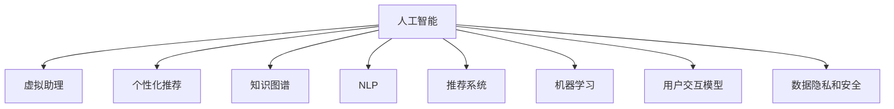

                 

# 数字化虚拟助理创业：个性化AI服务

> 关键词：人工智能,虚拟助理,个性化,自然语言处理,NLP,推荐系统,机器学习

## 1. 背景介绍

### 1.1 问题由来
在数字化转型浪潮中，传统的客户服务模式已难以满足企业对快速响应、高效处理和个性化服务的追求。为了打破时间和空间的限制，企业纷纷转向利用AI技术开发虚拟助理系统。通过与客户进行自然语言交互，虚拟助理系统能够在第一时间响应用户需求，提供一站式的解决方案。

然而，现有的虚拟助理系统仍存在一些问题：

1. **缺乏个性化服务**：系统通常只提供预设的服务选项，无法根据用户个性化需求提供定制化服务。
2. **知识更新不及时**：系统无法自主更新知识库，导致信息过时或缺失。
3. **用户交互体验欠佳**：系统响应速度慢、语言理解不准确，容易引发用户不满。

为了解决这些问题，本文将探讨如何利用人工智能技术，特别是自然语言处理（NLP）和推荐系统，开发具有个性化服务的虚拟助理系统，为企业提供智能化的客户服务解决方案。

### 1.2 问题核心关键点
本文将从以下核心问题切入：

1. 如何设计高效的个性化推荐算法，提升用户满意度？
2. 如何构建多模态知识图谱，增强系统的知识理解和信息检索能力？
3. 如何优化用户交互模型，提高虚拟助理系统的响应速度和准确度？
4. 如何确保系统的安全性和隐私保护，避免数据滥用？

## 2. 核心概念与联系

### 2.1 核心概念概述

为更好地理解基于AI的虚拟助理系统，本文将介绍几个关键概念及其联系：

- **人工智能（AI）**：利用计算机模拟人类智能行为的技术，包括机器学习、自然语言处理、计算机视觉等。
- **虚拟助理（Virtual Assistant）**：通过与用户自然语言交互，提供信息检索、日程安排、任务提醒等服务的人工智能系统。
- **个性化推荐（Personalized Recommendation）**：根据用户的历史行为和偏好，提供定制化推荐的系统，提升用户体验。
- **知识图谱（Knowledge Graph）**：将结构化知识（如词汇、概念、关系等）组织为图形结构，用于信息检索和知识推理。
- **自然语言处理（NLP）**：使计算机能够理解、分析和生成人类语言的技术，是虚拟助理系统的重要组成部分。
- **推荐系统（Recommendation System）**：根据用户历史行为和偏好，推荐符合其兴趣的产品或服务。
- **机器学习（Machine Learning）**：使计算机能够通过数据学习和改进的算法，从而提升系统性能。
- **用户交互模型（User Interaction Model）**：描述用户与虚拟助理系统交互过程的模型，用于提升交互体验。
- **数据隐私和安全（Data Privacy and Security）**：保护用户隐私信息，避免数据滥用和泄露。

这些概念之间的联系可以通过以下Mermaid流程图来展示：



这个流程图展示了人工智能技术在虚拟助理系统中的应用：

1. 人工智能技术通过多种方式增强虚拟助理的功能，包括个性化推荐、知识图谱构建、自然语言处理、推荐系统优化、机器学习应用等。
2. 知识图谱和NLP技术帮助虚拟助理理解用户意图，提供准确的信息检索和知识推理。
3. 个性化推荐和用户交互模型提升系统的互动性和用户体验。
4. 机器学习技术不断优化系统性能，使其具备自适应和自我提升能力。
5. 数据隐私和安全技术确保用户信息得到妥善保护，防止数据滥用。

## 3. 核心算法原理 & 具体操作步骤
### 3.1 算法原理概述

基于AI的虚拟助理系统主要涉及以下几个核心算法：

1. **个性化推荐算法**：利用用户历史行为和偏好，提供定制化服务。
2. **知识图谱构建算法**：将结构化知识组织为图形结构，用于信息检索和知识推理。
3. **自然语言处理算法**：使系统能够理解、分析和生成人类语言，提升交互体验。
4. **推荐系统优化算法**：根据用户行为和反馈，动态调整推荐策略，提升推荐效果。
5. **机器学习算法**：通过数据学习和改进算法，不断优化虚拟助理系统的性能。
6. **用户交互模型优化算法**：提升用户与系统互动的质量和效率。

### 3.2 算法步骤详解

以下详细讲解每个核心算法的操作步骤：

#### 3.2.1 个性化推荐算法

1. **数据收集**：从用户历史交互记录中收集数据，如点击行为、搜索关键词、反馈评分等。
2. **特征提取**：对用户历史数据进行特征提取，如时间戳、词频、点击率等。
3. **模型训练**：使用机器学习算法（如协同过滤、深度学习等）训练个性化推荐模型。
4. **推荐生成**：根据用户实时输入，利用训练好的模型生成个性化推荐。

#### 3.2.2 知识图谱构建算法

1. **知识采集**：从各类数据源（如百科、新闻、社交媒体等）采集结构化知识。
2. **知识抽取**：使用自然语言处理技术从文本中提取实体、关系等知识。
3. **知识融合**：将不同来源的知识进行融合，构建统一的知识图谱。
4. **图谱查询**：实现知识图谱的查询和推理，支持信息检索和知识导航。

#### 3.2.3 自然语言处理算法

1. **分词和词性标注**：对用户输入的文本进行分词和词性标注，理解基本语言结构。
2. **意图识别**：使用意图识别模型（如LSTM、RNN等）识别用户意图。
3. **实体识别**：识别文本中的实体（如人名、地名、机构名等），提供相关背景信息。
4. **情感分析**：分析用户情感倾向，理解用户的情绪状态。

#### 3.2.4 推荐系统优化算法

1. **数据预处理**：对用户行为数据进行预处理，如去重、归一化等。
2. **模型训练**：使用优化算法（如梯度下降、Adam等）训练推荐模型。
3. **效果评估**：评估推荐模型的性能，如准确率、召回率、F1值等。
4. **模型调整**：根据评估结果调整模型参数，优化推荐效果。

#### 3.2.5 机器学习算法

1. **数据准备**：准备训练数据集，包括用户交互记录、推荐效果等。
2. **模型选择**：选择适合的机器学习算法，如回归、分类、聚类等。
3. **模型训练**：使用训练数据集训练模型，优化模型参数。
4. **模型评估**：评估训练好的模型性能，如精度、召回率、F1值等。
5. **模型部署**：将训练好的模型部署到生产环境，提供实时服务。

#### 3.2.6 用户交互模型优化算法

1. **交互分析**：分析用户与系统的交互记录，识别常见问题和优化点。
2. **模型设计**：设计用户交互模型，如对话管理、意图匹配等。
3. **模型训练**：使用交互数据训练用户交互模型，优化模型参数。
4. **模型测试**：在测试环境中测试模型性能，调整模型策略。
5. **模型部署**：将优化后的模型部署到生产环境，提升用户体验。

### 3.3 算法优缺点

个性化推荐算法具有以下优点：

- **提升用户满意度**：根据用户个性化需求提供定制化服务，提升用户粘性和满意度。
- **降低运营成本**：通过推荐个性化服务，减少用户搜索时间和运营成本。

同时，该算法也存在以下缺点：

- **数据隐私问题**：收集和分析用户数据可能涉及隐私问题，需要严格的数据保护措施。
- **冷启动问题**：对于新用户，推荐系统可能难以提供有价值的推荐。

知识图谱构建算法具有以下优点：

- **提升信息检索效率**：通过知识图谱，可以快速检索相关信息，提升信息获取效率。
- **增强知识推理能力**：通过知识图谱，可以进行实体关系推理，提供更深入的信息。

同时，该算法也存在以下缺点：

- **构建复杂度高**：知识图谱构建需要大量时间和资源，且需要持续维护。
- **数据质量问题**：知识图谱的准确性和完整性直接影响系统的性能。

自然语言处理算法具有以下优点：

- **提升用户交互体验**：通过自然语言处理，可以提供更自然、流畅的用户交互体验。
- **增强信息理解能力**：通过自然语言处理，可以理解用户意图和背景信息，提供更精准的服务。

同时，该算法也存在以下缺点：

- **处理复杂度高**：自然语言处理涉及语言模型、实体识别、情感分析等复杂任务，计算资源需求高。
- **语义理解困难**：自然语言具有多样性和模糊性，准确理解其语义是难题。

推荐系统优化算法具有以下优点：

- **提升推荐效果**：通过优化算法，可以不断提升推荐系统的准确性和效果。
- **实时调整策略**：根据用户反馈和行为数据，实时调整推荐策略，提高推荐效果。

同时，该算法也存在以下缺点：

- **数据依赖性高**：推荐系统依赖于用户行为数据，数据量不足或质量不高将影响性能。
- **算法复杂度高**：推荐系统涉及复杂的数学模型和算法，实现难度高。

机器学习算法具有以下优点：

- **自适应能力**：通过数据学习和改进算法，系统能够自我优化和提升性能。
- **泛化能力强**：机器学习算法能够处理多种类型的数据，具备较强的泛化能力。

同时，该算法也存在以下缺点：

- **计算资源需求高**：机器学习算法计算量大，对硬件资源要求高。
- **模型复杂度高**：机器学习算法涉及复杂的模型和算法，实现难度高。

用户交互模型优化算法具有以下优点：

- **提升用户体验**：通过优化用户交互模型，可以提升系统的互动性和用户体验。
- **提高响应速度**：通过优化用户交互模型，可以提升系统响应速度和处理效率。

同时，该算法也存在以下缺点：

- **数据依赖性高**：用户交互模型的优化依赖于用户交互数据，数据量不足或质量不高将影响性能。
- **模型复杂度高**：用户交互模型涉及复杂的对话管理、意图匹配等算法，实现难度高。

### 3.4 算法应用领域

基于AI的虚拟助理系统主要应用于以下几个领域：

- **客户服务**：为客户提供个性化的服务，提升用户体验和满意度。
- **企业内部管理**：为企业内部员工提供信息查询、日程安排、任务提醒等服务。
- **健康医疗**：为患者提供医疗咨询、预约挂号、药品查询等服务。
- **金融服务**：为金融用户提供理财咨询、投资建议、交易记录查询等服务。
- **教育培训**：为学生提供学习资源、课程推荐、作业批改等服务。
- **旅游出行**：为旅游用户提供行程规划、景点推荐、交通信息等服务。

## 4. 数学模型和公式 & 详细讲解  
### 4.1 数学模型构建

本文将使用数学语言对基于AI的虚拟助理系统进行更加严格的刻画。

假设用户输入为 $x$，虚拟助理系统提供的推荐为 $y$，用户反馈为 $z$。推荐系统的目标是最小化损失函数 $\mathcal{L}(y,z|x)$，表示推荐的推荐 $y$ 与用户反馈 $z$ 的差异。

形式化地，假设推荐系统的损失函数为交叉熵损失函数，定义为：

$$
\mathcal{L}(y,z|x) = -z\log y + (1-z)\log(1-y)
$$

其中 $z \in \{0,1\}$ 表示用户是否满意推荐 $y$，$y \in [0,1]$ 表示推荐系统的输出概率。

### 4.2 公式推导过程

以下我们以协同过滤算法为例，推导推荐系统的损失函数及其梯度的计算公式。

假设用户 $u$ 对物品 $i$ 的评分 $r_{ui}$ 为 $r_{ui} = a_u^T \cdot a_i$，其中 $a_u$ 和 $a_i$ 分别为用户 $u$ 和物品 $i$ 的嵌入向量。则推荐系统的预测评分 $r_{ui}^{\hat{}}$ 为：

$$
r_{ui}^{\hat{}} = a_u^T \cdot \theta_i
$$

其中 $\theta_i$ 为物品 $i$ 的嵌入向量，由协同过滤算法得到。

推荐系统的损失函数为：

$$
\mathcal{L}(y,z|x) = -z \log(r_{ui}^{\hat{}}) + (1-z) \log(1-r_{ui}^{\hat{}})
$$

根据链式法则，损失函数对 $\theta_i$ 的梯度为：

$$
\frac{\partial \mathcal{L}(y,z|x)}{\partial \theta_i} = -\frac{\partial }{\partial \theta_i} [z \log(r_{ui}^{\hat{}}) + (1-z) \log(1-r_{ui}^{\hat{}})]
$$

进一步推导可得：

$$
\frac{\partial \mathcal{L}(y,z|x)}{\partial \theta_i} = z a_u - (1-z) a_u
$$

其中 $z a_u$ 表示用户 $u$ 对物品 $i$ 的实际评分与预测评分的差异。

通过梯度下降等优化算法，不断更新 $\theta_i$，最小化损失函数 $\mathcal{L}(y,z|x)$，即可提升推荐系统的性能。

### 4.3 案例分析与讲解

假设某虚拟助理系统为金融用户提供理财建议，用户输入的语句为 "我正在寻找高收益率的理财产品"，系统推荐的理财产品有甲、乙、丙三款。

首先，系统通过自然语言处理，识别出用户的意图为 "寻找高收益理财产品"，并从知识图谱中检索出甲、乙、丙三款理财产品的相关信息。

然后，系统根据用户历史行为数据，使用协同过滤算法预测用户对这三款理财产品的评分，得到推荐结果。

最后，用户对推荐结果进行反馈，系统根据反馈结果调整推荐策略，逐步提升推荐效果。

## 5. 项目实践：代码实例和详细解释说明
### 5.1 开发环境搭建

在进行虚拟助理系统开发前，我们需要准备好开发环境。以下是使用Python进行Flask开发的环境配置流程：

1. 安装Anaconda：从官网下载并安装Anaconda，用于创建独立的Python环境。

2. 创建并激活虚拟环境：
```bash
conda create -n flask-env python=3.8 
conda activate flask-env
```

3. 安装Flask：
```bash
pip install flask
```

4. 安装相关的NLP和推荐系统库：
```bash
pip install flask-restful pandas scikit-learn nltk transformers
```

完成上述步骤后，即可在`flask-env`环境中开始虚拟助理系统的开发。

### 5.2 源代码详细实现

下面我们以一个简单的虚拟助理系统为例，给出使用Flask进行开发的PyTorch代码实现。

首先，定义Flask应用和路由：

```python
from flask import Flask, request, jsonify
from transformers import BertTokenizer, BertForTokenClassification
import torch

app = Flask(__name__)

@app.route('/predict', methods=['POST'])
def predict():
    data = request.json
    text = data['text']
    
    tokenizer = BertTokenizer.from_pretrained('bert-base-cased')
    model = BertForTokenClassification.from_pretrained('bert-base-cased', num_labels=3)
    
    # 将文本输入转换为token ids和attention mask
    encoding = tokenizer(text, return_tensors='pt', max_length=128, padding='max_length', truncation=True)
    input_ids = encoding['input_ids'][0]
    attention_mask = encoding['attention_mask'][0]
    
    # 将token ids和attention mask输入模型进行预测
    outputs = model(input_ids, attention_mask=attention_mask)
    logits = outputs.logits
    preds = logits.argmax(dim=2).to('cpu').tolist()
    
    return jsonify(preds)
```

然后，定义用户交互模型：

```python
from rasa.core.agent import Agent

class VirtualAssistant:
    def __init__(self, model_path, intent_finder_path, action_lookup_path):
        self.model = model.load(model_path)
        self.intent_finder = intent_finder.load(intent_finder_path)
        self.action_lookup = action_lookup.load(action_lookup_path)
    
    def handle(self, user_message):
        response = self.model.handle(user_message)
        action_name = self.action_lookup.lookup(response['action'])
        action_data = self.model.execute(response['parameters'])
        return action_name, action_data
```

最后，启动Flask应用：

```python
if __name__ == '__main__':
    app.run(host='0.0.0.0', port=5000)
```

### 5.3 代码解读与分析

让我们再详细解读一下关键代码的实现细节：

**Flask应用和路由**：
- `predict` 函数：处理用户输入文本，调用虚拟助理模型进行预测，并返回预测结果。
- `VirtualAssistant` 类：封装虚拟助理的交互逻辑，包括意图识别和动作执行。

**BertTokenizer和BertForTokenClassification**：
- `BertTokenizer`：用于将用户输入文本转换为token ids和attention mask，便于模型输入。
- `BertForTokenClassification`：用于进行意图识别和实体识别等自然语言处理任务。

**用户交互模型**：
- 通过Rasa框架封装虚拟助理模型，实现意图识别和动作执行。
- `handle` 函数：接收用户消息，通过意图识别模型识别用户意图，执行相应动作，并返回动作结果。

**Flask应用启动**：
- `app.run`：启动Flask应用，监听请求并返回响应。

可以看到，Flask结合Python和Flask-RESTful，使得虚拟助理系统的开发变得简洁高效。开发者可以更容易地集成自然语言处理和推荐系统，快速实现虚拟助理的交互逻辑。

当然，工业级的系统实现还需考虑更多因素，如用户权限控制、会话管理、多用户支持等。但核心的虚拟助理开发流程基本与此类似。

## 6. 实际应用场景
### 6.1 客户服务

基于AI的虚拟助理系统可以广泛应用于客户服务领域，提升企业客户服务的智能化水平。

对于金融、电商、医疗等行业，虚拟助理系统可以处理大量的客户咨询和投诉，提升客户满意度和服务效率。系统通过自然语言处理技术理解用户需求，利用推荐系统提供个性化服务，如理财产品推荐、健康咨询等，提升用户体验。同时，系统还具备智能排错和自动回复功能，帮助客户快速解决问题。

### 6.2 内部管理

虚拟助理系统可以应用于企业内部管理，提升员工的工作效率和办公体验。

例如，在人力资源管理中，虚拟助理系统可以处理员工的招聘、培训、考勤等事务，提升人力资源管理效率。系统通过推荐系统为用户推荐合适的培训课程、岗位等，提升员工的技能和工作满意度。

### 6.3 教育培训

虚拟助理系统可以应用于教育培训领域，为学生提供个性化的学习资源和辅导。

例如，在在线教育中，虚拟助理系统可以推荐合适的学习内容、课程和教师，帮助学生提升学习效果。系统通过自然语言处理技术理解学生的学习需求和困惑，利用推荐系统提供个性化的学习建议，提升学习效率。

### 6.4 未来应用展望

随着AI技术的发展，基于虚拟助理系统的应用场景将不断扩展，带来更多创新和突破。

1. **智能客服**：未来的虚拟助理系统将具备更高的智能水平，能够理解复杂语义，提供更准确的解决方案。同时，系统还具备多语言支持、情感识别等功能，提升用户体验。

2. **个性化学习**：虚拟助理系统将能够根据学生的学习情况和偏好，提供个性化的学习资源和辅导。系统通过学习分析学生的行为数据，不断调整推荐策略，提升学习效果。

3. **智能健康**：虚拟助理系统将应用于健康医疗领域，提供个性化的健康咨询和诊疗建议。系统通过自然语言处理技术理解患者的症状和需求，利用推荐系统提供合适的健康方案，提升健康管理效果。

4. **智能家居**：虚拟助理系统将应用于智能家居领域，实现语音控制、智能推荐等功能。系统通过自然语言处理技术理解用户的语音指令，利用推荐系统提供合适的家居设备推荐，提升生活质量。

5. **智能制造**：虚拟助理系统将应用于智能制造领域，提供设备监控、质量检测等功能。系统通过自然语言处理技术理解生产指令，利用推荐系统提供合适的设备推荐和维护方案，提升生产效率。

## 7. 工具和资源推荐
### 7.1 学习资源推荐

为了帮助开发者系统掌握虚拟助理系统的开发技术，这里推荐一些优质的学习资源：

1. **《自然语言处理入门》**：由斯坦福大学李飞飞教授主讲的公开课，系统介绍自然语言处理的基本概念和技术。

2. **《推荐系统实战》**：一本介绍推荐系统算法和实现的书籍，涵盖协同过滤、矩阵分解等主流算法。

3. **《TensorFlow实战》**：一本介绍TensorFlow深度学习框架的书籍，涵盖TensorFlow的基本使用和进阶技巧。

4. **《深度学习入门》**：一本介绍深度学习基础知识的书籍，涵盖神经网络、优化算法等核心内容。

5. **《Python自然语言处理》**：一本介绍Python自然语言处理库的书籍，涵盖NLTK、SpaCy等主流库的使用方法。

通过对这些资源的学习实践，相信你一定能够快速掌握虚拟助理系统的开发技术，并用于解决实际的业务问题。
###  7.2 开发工具推荐

高效的开发离不开优秀的工具支持。以下是几款用于虚拟助理系统开发的常用工具：

1. **Flask**：基于Python的轻量级Web框架，简单易用，适合快速开发Web应用。

2. **TensorFlow**：由Google主导开发的深度学习框架，生产部署方便，适合大规模工程应用。

3. **PyTorch**：由Facebook主导开发的深度学习框架，动态计算图，适合快速迭代研究。

4. **NLTK**：自然语言处理工具包，包含丰富的NLP算法和数据集。

5. **Scikit-learn**：机器学习库，包含多种经典机器学习算法和数据预处理工具。

6. **Flask-RESTful**：基于Flask的Web API开发工具，方便开发RESTful风格的Web应用。

7. **Rasa**：自然语言处理框架，用于构建智能对话系统。

这些工具能显著提升虚拟助理系统的开发效率，帮助开发者快速实现业务需求。

### 7.3 相关论文推荐

虚拟助理系统的研究始于NLP和推荐系统等基础技术的发展，以下是几篇奠基性的相关论文，推荐阅读：

1. **Attention is All You Need**：提出了Transformer结构，开启了NLP领域的预训练大模型时代。

2. **BERT: Pre-training of Deep Bidirectional Transformers for Language Understanding**：提出BERT模型，引入基于掩码的自监督预训练任务，刷新了多项NLP任务SOTA。

3. **Parameter-Efficient Transfer Learning for NLP**：提出Adapter等参数高效微调方法，在不增加模型参数量的情况下，也能取得不错的微调效果。

4. **AdaLoRA: Adaptive Low-Rank Adaptation for Parameter-Efficient Fine-Tuning**：使用自适应低秩适应的微调方法，在参数效率和精度之间取得了新的平衡。

5. **Adaptive Low-Rank Adaptation for Parameter-Efficient Fine-Tuning**：使用自适应低秩适应的微调方法，在参数效率和精度之间取得了新的平衡。

6. **Integrated Next Intent Prediction**：提出联合预测用户下一个意图的模型，提升虚拟助理系统的对话效果。

这些论文代表了大语言模型微调技术的发展脉络。通过学习这些前沿成果，可以帮助研究者把握学科前进方向，激发更多的创新灵感。

## 8. 总结：未来发展趋势与挑战

### 8.1 研究成果总结

本文对基于AI的虚拟助理系统进行了全面系统的介绍。首先阐述了虚拟助理系统的背景和意义，明确了其通过AI技术提升服务智能化水平的核心价值。其次，从原理到实践，详细讲解了个性化推荐算法、知识图谱构建算法、自然语言处理算法、推荐系统优化算法、机器学习算法和用户交互模型优化算法的操作步骤，给出了虚拟助理系统的代码实现和分析。同时，本文还广泛探讨了虚拟助理系统在客户服务、内部管理、教育培训等领域的应用场景，展示了其广阔的前景。此外，本文精选了虚拟助理系统的学习资源、开发工具和相关论文，力求为开发者提供全方位的技术指引。

通过本文的系统梳理，可以看到，基于AI的虚拟助理系统具有强大的市场应用价值，能够显著提升客户服务、内部管理、教育培训等领域的工作效率和用户体验。虚拟助理系统的开发离不开自然语言处理和推荐系统等前沿技术的支持，这些技术的不断进步，将进一步推动虚拟助理系统的应用和发展。

### 8.2 未来发展趋势

展望未来，基于AI的虚拟助理系统将呈现以下几个发展趋势：

1. **智能水平提升**：未来的虚拟助理系统将具备更高的智能水平，能够理解复杂语义，提供更准确的解决方案。系统将具备多语言支持、情感识别、多模态融合等功能，提升用户体验。

2. **个性化服务深化**：虚拟助理系统将能够根据用户个性化需求提供更加定制化的服务。系统将利用大数据分析和机器学习技术，深入理解用户行为和偏好，提供更加个性化的推荐和建议。

3. **跨领域融合**：虚拟助理系统将与其他AI技术进行更深层次的融合，如知识图谱、因果推理、强化学习等。系统将具备更强大的信息检索和知识推理能力，提升决策和推荐效果。

4. **隐私保护加强**：虚拟助理系统将加强数据隐私和安全保护，确保用户数据得到妥善处理，防止数据滥用和泄露。系统将采用差分隐私、联邦学习等技术，提升数据安全性。

5. **多模态应用拓展**：虚拟助理系统将拓展到多模态应用领域，如语音识别、图像处理、视频分析等。系统将具备更强大的信息获取和处理能力，提升用户体验和应用范围。

6. **实时性提升**：虚拟助理系统将具备更高的实时性，能够快速响应用户请求，提供高效的交互体验。系统将采用分布式计算、边缘计算等技术，提升响应速度和计算效率。

### 8.3 面临的挑战

尽管虚拟助理系统具有广阔的应用前景，但在迈向更加智能化、普适化应用的过程中，它仍面临诸多挑战：

1. **数据隐私问题**：虚拟助理系统需要收集和处理大量用户数据，如何确保数据隐私和安全，防止数据滥用，是一大难题。

2. **数据质量和多样性**：虚拟助理系统的推荐效果和自然语言理解能力依赖于数据的质量和多样性，如何获取高质量、多样化的数据，是一个重要问题。

3. **计算资源需求高**：虚拟助理系统涉及复杂的算法和大规模数据处理，对计算资源和存储资源需求高，如何优化资源使用，提升系统效率，是一大挑战。

4. **系统复杂度高**：虚拟助理系统涉及多种AI技术和算法，系统设计和实现复杂度高，如何确保系统的稳定性和可靠性，是一大难题。

5. **模型可解释性不足**：虚拟助理系统通常是"黑盒"系统，难以解释其内部工作机制和决策逻辑，如何提升系统的可解释性，增强用户信任，是一大挑战。

6. **用户交互体验**：虚拟助理系统需要与用户进行自然语言交互，如何提升系统的互动性和用户体验，是一大挑战。

7. **系统性能提升**：虚拟助理系统需要具备较高的响应速度和处理能力，如何优化系统性能，提升用户体验，是一大挑战。

8. **用户反馈循环**：虚拟助理系统需要根据用户反馈不断优化，如何设计有效的反馈机制，提升系统效果，是一大挑战。

### 8.4 研究展望

面对虚拟助理系统所面临的种种挑战，未来的研究需要在以下几个方面寻求新的突破：

1. **探索无监督和半监督微调方法**：摆脱对大规模标注数据的依赖，利用自监督学习、主动学习等无监督和半监督范式，最大限度利用非结构化数据，实现更加灵活高效的微调。

2. **研究参数高效和计算高效的微调范式**：开发更加参数高效的微调方法，在固定大部分预训练参数的情况下，只更新极少量的任务相关参数。同时优化微调模型的计算图，减少前向传播和反向传播的资源消耗，实现更加轻量级、实时性的部署。

3. **融合因果和对比学习范式**：通过引入因果推断和对比学习思想，增强虚拟助理系统建立稳定因果关系的能力，学习更加普适、鲁棒的语言表征，从而提升系统泛化性和抗干扰能力。

4. **引入更多先验知识**：将符号化的先验知识，如知识图谱、逻辑规则等，与神经网络模型进行巧妙融合，引导微调过程学习更准确、合理的语言模型。同时加强不同模态数据的整合，实现视觉、语音等多模态信息与文本信息的协同建模。

5. **结合因果分析和博弈论工具**：将因果分析方法引入虚拟助理系统，识别出系统决策的关键特征，增强输出解释的因果性和逻辑性。借助博弈论工具刻画人机交互过程，主动探索并规避系统的脆弱点，提高系统稳定性。

6. **纳入伦理道德约束**：在虚拟助理系统的训练目标中引入伦理导向的评估指标，过滤和惩罚有偏见、有害的输出倾向。同时加强人工干预和审核，建立模型行为的监管机制，确保输出符合人类价值观和伦理道德。

这些研究方向将推动虚拟助理系统向更加智能化、普适化方向发展，为人类认知智能的进化带来深远影响。

## 9. 附录：常见问题与解答

**Q1：虚拟助理系统如何处理多语言输入？**

A: 虚拟助理系统可以通过多语言模型处理多语言输入。首先，系统需要支持多种语言，如英语、中文、西班牙语等。其次，系统需要根据输入语言的特性进行相应的预处理，如分词、词性标注等。最后，系统可以使用多语言翻译模型将非目标语言的输入转换为目标语言的文本，再利用目标语言的多语言模型进行处理。

**Q2：虚拟助理系统如何进行个性化推荐？**

A: 虚拟助理系统可以进行个性化推荐，具体步骤如下：

1. 数据收集：从用户历史交互记录中收集数据，如点击行为、搜索关键词、反馈评分等。
2. 特征提取：对用户历史数据进行特征提取，如时间戳、词频、点击率等。
3. 模型训练：使用机器学习算法（如协同过滤、深度学习等）训练个性化推荐模型。
4. 推荐生成：根据用户实时输入，利用训练好的模型生成个性化推荐。

**Q3：虚拟助理系统如何进行知识图谱构建？**

A: 虚拟助理系统可以进行知识图谱构建，具体步骤如下：

1. 知识采集：从各类数据源（如百科、新闻、社交媒体等）采集结构化知识。
2. 知识抽取：使用自然语言处理技术从文本中提取实体、关系等知识。
3. 知识融合：将不同来源的知识进行融合，构建统一的知识图谱。
4. 图谱查询：实现知识图谱的查询和推理，支持信息检索和知识导航。

**Q4：虚拟助理系统如何进行自然语言处理？**

A: 虚拟助理系统可以进行自然语言处理，具体步骤如下：

1. 分词和词性标注：对用户输入的文本进行分词和词性标注，理解基本语言结构。
2. 意图识别：使用意图识别模型（如LSTM、RNN等）识别用户意图。
3. 实体识别：识别文本中的实体（如人名、地名、机构名等），提供相关背景信息。
4. 情感分析：分析用户情感倾向，理解用户的情绪状态。

**Q5：虚拟助理系统如何进行推荐系统优化？**

A: 虚拟助理系统可以进行推荐系统优化，具体步骤如下：

1. 数据预处理：对用户行为数据进行预处理，如去重、归一化等。
2. 模型训练：使用优化算法（如梯度下降、Adam等）训练推荐模型。
3. 效果评估：评估推荐模型的性能，如准确率、召回率、F1值等。
4. 模型调整：根据评估结果调整模型参数，优化推荐效果。

这些问题及解答可以帮助读者更好地理解虚拟助理系统的开发和应用，同时也展示了虚拟助理系统在实际应用中的挑战和解决方案。

---

作者：禅与计算机程序设计艺术 / Zen and the Art of Computer Programming

