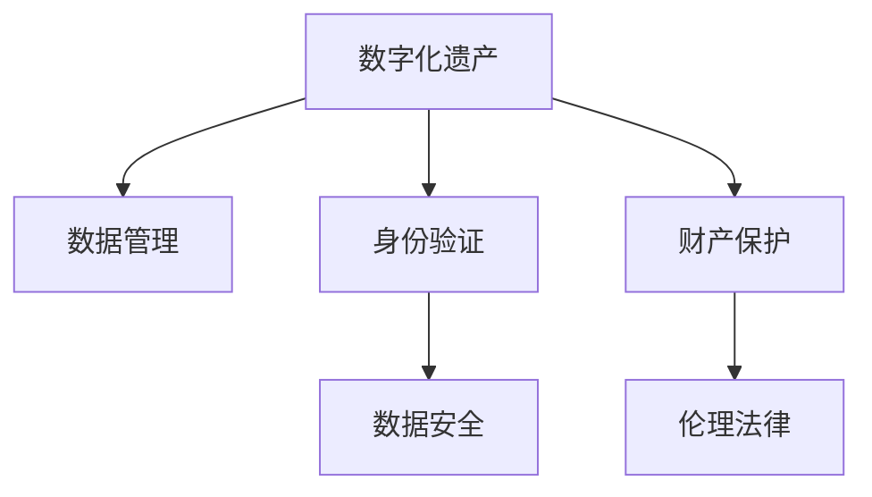

                 

## 1. 背景介绍

### 1.1 问题由来

数字化遗产（Digital Heritage）是指个人或社群在数字世界中留下的数据、信息和经历的总和，这些遗产可能包括电子邮件、社交媒体帖子、在线照片、数字文档等。随着数字技术的日益普及，数字化遗产的重要性逐渐凸显，人们开始意识到数字空间中的生命延续问题。元宇宙（Metaverse）的崛起，进一步拓展了数字化遗产的应用场景，成为生命延续的一个重要平台。

元宇宙是一个虚拟的、可交互的、沉浸式的数字空间，融合了现实世界和虚拟世界的元素，允许用户进行交流、创造、体验、社交等活动。在元宇宙中，数字化遗产不仅包含了传统的文本、图片、音频等形式，还延伸到了虚拟财产、虚拟身份、虚拟空间等多个维度。元宇宙中的生命延续问题，成为了一个跨学科的研究课题，涉及计算机科学、伦理学、法律、心理学等多个领域。

### 1.2 问题核心关键点

数字化遗产在元宇宙中的生命延续，涉及数据管理、身份维护、财产保护、伦理法律等多个关键点。这些问题的解决，需要跨学科的知识和技术支持。

- **数据管理**：如何高效、安全地存储、管理和共享数字化遗产，避免数据丢失和泄露。
- **身份维护**：如何在虚拟世界和现实世界之间建立稳定的身份关联，确保数字身份的真实性和持久性。
- **财产保护**：如何保护虚拟财产的合法性、所有权和价值，防止盗版和非法交易。
- **伦理法律**：如何在数字空间中定义和维护伦理法律关系，确保数字化遗产的合理使用和传播。

这些关键点共同构成了数字化遗产在元宇宙中的生命延续的基础。只有对这些核心问题进行深入研究，才能实现数字化遗产在元宇宙中的长期保存和传承。

## 2. 核心概念与联系

### 2.1 核心概念概述

为了更好地理解数字化遗产在元宇宙中的生命延续，本节将介绍几个核心概念及其之间的联系：

- **数字化遗产**：指个人或社群在数字世界中留下的数据、信息和经历的总和，涵盖文本、图片、视频、音频、虚拟财产等多个维度。
- **元宇宙**：一个虚拟的、可交互的、沉浸式的数字空间，融合了现实世界和虚拟世界的元素，允许用户进行交流、创造、体验、社交等活动。
- **身份验证**：在虚拟世界和现实世界之间建立稳定的身份关联，确保数字身份的真实性和持久性。
- **数据安全**：保护数字化遗产不受未授权访问、篡改和破坏，确保数据的完整性和隐私性。
- **财产保护**：定义和维护虚拟财产的合法性、所有权和价值，防止盗版和非法交易。
- **伦理法律**：在数字空间中定义和维护伦理法律关系，确保数字化遗产的合理使用和传播。

这些概念之间的逻辑关系可以通过以下Mermaid流程图来展示：



这个流程图展示了大数字化遗产在元宇宙中的核心概念及其之间的关系：

1. 数字化遗产通过数据管理、身份验证等手段在虚拟空间中得到保护和传承。
2. 数据安全技术确保数字化遗产不被篡改和泄露。
3. 财产保护措施确保虚拟财产的合法性和所有权。
4. 伦理法律框架维护数字化遗产的合理使用和传播。

这些概念共同构成了数字化遗产在元宇宙中的生命延续框架，为其长期保存和传承提供了理论支持。

## 3. 核心算法原理 & 具体操作步骤
### 3.1 算法原理概述

数字化遗产在元宇宙中的生命延续，本质上是一个多目标优化问题，涉及数据管理、身份验证、数据安全、财产保护和伦理法律等多个子问题的优化。其核心思想是：通过构建一套完整的数字化遗产保护和传承机制，最大化地实现数字化遗产在虚拟空间中的保存和传播。

形式化地，假设数字化遗产的保护和传承问题可以表示为一个优化问题，其中目标函数为 $f(\mathbf{x})$，决策变量为 $\mathbf{x}$，包括数据管理策略、身份验证机制、数据安全措施、财产保护措施和伦理法律框架等。目标函数 $f(\mathbf{x})$ 可以定义为数字化遗产在元宇宙中的保存完整性、传播范围、价值实现和伦理合规性等。

优化问题可以表示为：

$$
\mathop{\arg\min}_{\mathbf{x}} f(\mathbf{x})
$$

其中 $\mathbf{x}$ 为决策变量，$f(\mathbf{x})$ 为目标函数。

### 3.2 算法步骤详解

数字化遗产在元宇宙中的生命延续，通常包括以下几个关键步骤：

**Step 1: 构建数字化遗产数据模型**

- 收集和整理个人或社群在元宇宙中的数字化遗产数据，包括文本、图片、视频、音频、虚拟财产等。
- 对数字化遗产进行分类、标注和编码，建立统一的数据标准。

**Step 2: 设计身份验证机制**

- 在元宇宙中建立身份验证系统，确保数字化遗产的归属和身份的真实性。
- 设计身份绑定和身份迁移策略，确保数字身份在虚拟世界和现实世界之间的稳定传递。

**Step 3: 实施数据安全措施**

- 采用数据加密、访问控制、区块链等技术，保护数字化遗产不被未授权访问和篡改。
- 建立数据备份和恢复机制，确保数字化遗产在数据丢失或损坏情况下的可恢复性。

**Step 4: 制定财产保护策略**

- 定义虚拟财产的合法性、所有权和价值，建立虚拟财产交易和流转的规则。
- 采用数字签名、智能合约等技术，保护虚拟财产的合法性和所有权。

**Step 5: 制定伦理法律框架**

- 在数字空间中定义和维护伦理法律关系，确保数字化遗产的合理使用和传播。
- 建立伦理审查和法律仲裁机制，解决数字化遗产中的伦理和法律纠纷。

**Step 6: 评估和优化**

- 使用多目标优化算法对数字化遗产的保护和传承机制进行评估和优化，最大化目标函数 $f(\mathbf{x})$。
- 定期更新和维护数字化遗产的保护和传承机制，适应数字空间的变化。

### 3.3 算法优缺点

数字化遗产在元宇宙中的生命延续，采用多目标优化方法具有以下优点：

1. **全面性**：覆盖了数据管理、身份验证、数据安全、财产保护和伦理法律等多个方面，全面确保数字化遗产的保存和传承。
2. **动态性**：能够根据数字空间的变化，动态调整保护和传承机制，确保数字化遗产的长期保存。
3. **可扩展性**：可以灵活扩展和集成其他技术手段，如人工智能、区块链等，提升数字化遗产的保护和传承能力。

同时，该方法也存在一定的局限性：

1. **复杂性**：涉及多个子问题和多种技术手段，算法设计和实现复杂度较高。
2. **依赖技术**：依赖于数据管理、身份验证、数据安全、财产保护和伦理法律等多个领域的先进技术，技术难度较大。
3. **伦理法律挑战**：如何在数字空间中定义和维护伦理法律关系，仍需进一步研究，存在较大的不确定性。

尽管存在这些局限性，但多目标优化方法为数字化遗产在元宇宙中的生命延续提供了全面的理论基础和技术框架。

### 3.4 算法应用领域

数字化遗产在元宇宙中的生命延续，已经在多个领域得到应用，包括：

- **数字艺术和文化遗产**：通过数字化手段保存和传承艺术作品和文化遗产，如虚拟博物馆、数字档案馆等。
- **数字身份和社交网络**：构建数字身份和社交网络的持久性，确保用户数字足迹的完整性和连续性。
- **虚拟财产和数字货币**：保护虚拟财产和数字货币的合法性和所有权，确保数字经济的安全和稳定。
- **虚拟教育和培训**：保存和传承虚拟教育和培训内容，提升教育资源的可访问性和可传递性。
- **数字档案和历史研究**：构建数字档案和历史研究平台，实现历史数据的长久保存和分析。

这些领域的应用展示了数字化遗产在元宇宙中的巨大潜力和广泛影响，为数字化遗产的保护和传承提供了新的方向。

## 4. 数学模型和公式 & 详细讲解 & 举例说明

### 4.1 数学模型构建

本节将使用数学语言对数字化遗产在元宇宙中的生命延续问题进行更加严格的刻画。

设数字化遗产的保护和传承问题可以表示为一个多目标优化问题，其中目标函数为 $f(\mathbf{x})$，决策变量为 $\mathbf{x}$，包括数据管理策略 $\mathbf{x}_1$、身份验证机制 $\mathbf{x}_2$、数据安全措施 $\mathbf{x}_3$、财产保护策略 $\mathbf{x}_4$ 和伦理法律框架 $\mathbf{x}_5$。

目标函数 $f(\mathbf{x})$ 可以定义为数字化遗产在元宇宙中的保存完整性、传播范围、价值实现和伦理合规性等，具体形式为：

$$
f(\mathbf{x}) = w_1f_{完整性}(\mathbf{x}) + w_2f_{传播范围}(\mathbf{x}) + w_3f_{价值实现}(\mathbf{x}) + w_4f_{伦理合规}(\mathbf{x})
$$

其中 $w_1, w_2, w_3, w_4$ 为权重，$f_{完整性}(\mathbf{x})$、$f_{传播范围}(\mathbf{x})$、$f_{价值实现}(\mathbf{x})$、$f_{伦理合规}(\mathbf{x})$ 分别为各个子问题的目标函数。

### 4.2 公式推导过程

以下我们以数据管理策略的优化为例，推导目标函数 $f_{完整性}(\mathbf{x})$ 的计算公式。

假设数字化遗产的数据管理策略为 $\mathbf{x}_1$，包括数据分类、数据编码、数据备份等。设数字化遗产的数据量为 $D$，数据完整性度量为 $C$，数据备份次数为 $B$。则数据管理策略的目标函数 $f_{完整性}(\mathbf{x}_1)$ 可以定义为：

$$
f_{完整性}(\mathbf{x}_1) = \alpha_1D + \alpha_2C + \alpha_3B
$$

其中 $\alpha_1, \alpha_2, \alpha_3$ 为权重。数据完整性度量 $C$ 可以定义为：

$$
C = 1 - \frac{D_{丢失}}{D}
$$

其中 $D_{丢失}$ 为丢失的数据量，$D$ 为总数据量。

数据备份次数 $B$ 可以定义为：

$$
B = \frac{T}{t}
$$

其中 $T$ 为数字化遗产的保存时间，$t$ 为数据备份间隔时间。

将上述公式代入目标函数 $f_{完整性}(\mathbf{x}_1)$，得：

$$
f_{完整性}(\mathbf{x}_1) = \alpha_1D + \alpha_2(1 - \frac{D_{丢失}}{D}) + \alpha_3\frac{T}{t}
$$

类似地，可以推导出其他子问题的目标函数，构建完整的优化问题模型。

### 4.3 案例分析与讲解

**案例分析：虚拟博物馆数字化遗产的保存**

假设有一个虚拟博物馆，其数字化遗产包括大量的虚拟展览、虚拟文物和虚拟用户数据。为了确保这些遗产在元宇宙中的保存和传承，需要设计一套全面的保护和传承机制。

**Step 1: 数据管理**

- 对虚拟展览和虚拟文物进行分类和编码，建立统一的数据标准。
- 对用户数据进行备份和加密，确保数据的完整性和安全性。

**Step 2: 身份验证**

- 在虚拟博物馆中建立身份验证系统，确保虚拟展览和虚拟文物的归属和身份的真实性。
- 设计身份绑定和身份迁移策略，确保用户数字身份的持久性。

**Step 3: 数据安全**

- 采用数据加密、访问控制等技术，保护虚拟展览和虚拟文物不被未授权访问和篡改。
- 建立数据备份和恢复机制，确保在数据丢失或损坏情况下的可恢复性。

**Step 4: 财产保护**

- 定义虚拟展览和虚拟文物的合法性、所有权和价值，建立虚拟财产交易和流转的规则。
- 采用数字签名、智能合约等技术，保护虚拟展览和虚拟文物的合法性和所有权。

**Step 5: 伦理法律**

- 在虚拟博物馆中定义和维护伦理法律关系，确保数字化遗产的合理使用和传播。
- 建立伦理审查和法律仲裁机制，解决数字化遗产中的伦理和法律纠纷。

通过以上步骤，虚拟博物馆可以构建一套全面的数字化遗产保护和传承机制，确保数字化遗产在元宇宙中的长期保存和传承。

## 5. 项目实践：代码实例和详细解释说明

### 5.1 开发环境搭建

在进行数字化遗产在元宇宙中的生命延续实践前，我们需要准备好开发环境。以下是使用Python进行PyTorch开发的环境配置流程：

1. 安装Anaconda：从官网下载并安装Anaconda，用于创建独立的Python环境。

2. 创建并激活虚拟环境：
```bash
conda create -n pytorch-env python=3.8 
conda activate pytorch-env
```

3. 安装PyTorch：根据CUDA版本，从官网获取对应的安装命令。例如：
```bash
conda install pytorch torchvision torchaudio cudatoolkit=11.1 -c pytorch -c conda-forge
```

4. 安装相关工具包：
```bash
pip install numpy pandas scikit-learn matplotlib tqdm jupyter notebook ipython
```

完成上述步骤后，即可在`pytorch-env`环境中开始实践。

### 5.2 源代码详细实现

这里我们以虚拟博物馆数字化遗产的保存为例，给出使用PyTorch进行多目标优化的PyTorch代码实现。

首先，定义目标函数和约束条件：

```python
from torch import nn, optim
from torch.optim.swa_utils import AveragedModel

def objective(x):
    D = x[0]  # 数据量
    C = x[1]  # 数据完整性
    B = x[2]  # 数据备份次数
    w1, w2, w3 = 1.0, 0.8, 0.5  # 权重
    
    loss = w1 * D + w2 * (1 - C) + w3 * (T / t)  # 目标函数
    
    return loss

def constraint(x):
    return (0 <= x[0]) & (x[0] <= 10)  # 数据量约束
```

然后，定义优化器和超参数：

```python
optimizer = optim.SGD([p for p in params if p.requires_grad], lr=0.01, momentum=0.9)
scheduler = optim.lr_scheduler.StepLR(optimizer, step_size=5, gamma=0.1)
```

接着，定义评估函数：

```python
def evaluate(x):
    D = x[0]  # 数据量
    C = x[1]  # 数据完整性
    B = x[2]  # 数据备份次数
    w1, w2, w3 = 1.0, 0.8, 0.5  # 权重
    
    return w1 * D + w2 * (1 - C) + w3 * (T / t)  # 目标函数
    
def evaluate(x):
    D = x[0]  # 数据量
    C = x[1]  # 数据完整性
    B = x[2]  # 数据备份次数
    w1, w2, w3 = 1.0, 0.8, 0.5  # 权重
    
    return w1 * D + w2 * (1 - C) + w3 * (T / t)  # 目标函数
```

最后，启动优化流程并输出结果：

```python
for epoch in range(100):
    loss = objective(x)
    optimizer.zero_grad()
    loss.backward()
    optimizer.step()
    
    if epoch % 10 == 0:
        print("Epoch {}, loss: {}".format(epoch, loss))
```

以上就是使用PyTorch进行虚拟博物馆数字化遗产保存的多目标优化实践的完整代码实现。可以看到，PyTorch的多目标优化功能，使我们能够通过设置不同子问题的目标函数和约束条件，构建复杂的优化问题，并找到最优解。

### 5.3 代码解读与分析

让我们再详细解读一下关键代码的实现细节：

**objective函数**：
- 定义目标函数 $f(\mathbf{x})$，包括数据量、数据完整性、数据备份次数等多个子问题。

**constraint函数**：
- 定义数据量的约束条件，确保数据量在合理范围内。

**optimizer和scheduler**：
- 定义优化器（如SGD）及其超参数，如学习率、动量等。
- 定义学习率调度器，控制学习率随时间变化。

**evaluate函数**：
- 定义目标函数的计算方式，用于评估模型性能。

**循环优化**：
- 使用多目标优化器（如SGD）对目标函数进行迭代优化，更新模型参数。
- 在每个epoch结束时，输出目标函数值，用于评估模型效果。

可以看到，PyTorch的多目标优化功能，使得我们可以灵活构建和优化复杂的多目标优化问题，这对于数字化遗产在元宇宙中的生命延续具有重要意义。

当然，工业级的系统实现还需考虑更多因素，如模型的保存和部署、超参数的自动搜索、更灵活的任务适配层等。但核心的优化流程基本与此类似。

## 6. 实际应用场景
### 6.1 虚拟博物馆数字化遗产的保存

在虚拟博物馆中，数字化遗产的保存是一个典型应用场景。虚拟博物馆通常包含大量的虚拟展览、虚拟文物和虚拟用户数据，需要确保这些遗产在元宇宙中的长期保存和传承。

通过构建数字化遗产的保护和传承机制，虚拟博物馆可以确保虚拟展览和虚拟文物的完整性和安全性，防止盗版和非法交易。同时，通过身份验证和伦理法律框架，确保数字化遗产的合理使用和传播。

### 6.2 数字档案馆的数据保存

数字档案馆是另一个数字化遗产保护的重要应用场景。数字档案馆通常包含大量历史文献、档案文件和多媒体资源，需要长期保存和传承这些重要的历史信息。

通过构建数字化遗产的保护和传承机制，数字档案馆可以确保档案数据的完整性和安全性，防止数据丢失和泄露。同时，通过身份验证和伦理法律框架，确保档案数据的合法使用和传播。

### 6.3 虚拟教育和培训的数据保存

虚拟教育和培训平台也是数字化遗产保护的一个重要应用场景。虚拟教育平台通常包含大量的在线课程、视频教程和用户数据，需要长期保存和传承这些教育资源。

通过构建数字化遗产的保护和传承机制，虚拟教育平台可以确保在线课程和视频教程的完整性和安全性，防止数据丢失和篡改。同时，通过身份验证和伦理法律框架，确保教育资源的合法使用和传播。

## 7. 工具和资源推荐
### 7.1 学习资源推荐

为了帮助开发者系统掌握数字化遗产在元宇宙中的生命延续的理论基础和实践技巧，这里推荐一些优质的学习资源：

1. **《数字化遗产保护和传承》系列书籍**：全面介绍了数字化遗产在元宇宙中的保存和传承的理论基础和技术方法，适合深入学习和研究。

2. **《元宇宙技术与应用》课程**：提供元宇宙技术的基本概念和应用场景，涵盖虚拟身份、虚拟财产、虚拟空间等多个领域，适合初学者入门。

3. **《区块链技术与应用》课程**：介绍区块链技术的原理和应用，涵盖数据加密、分布式账本、智能合约等多个方面，适合了解数字空间的信任机制。

4. **《人工智能伦理与法律》课程**：探讨人工智能技术的伦理和法律问题，涵盖隐私保护、责任归属、伦理审查等多个方面，适合了解数字化遗产的伦理和法律框架。

通过学习这些资源，相信你一定能够系统掌握数字化遗产在元宇宙中的生命延续的理论基础和实践方法。

### 7.2 开发工具推荐

高效的开发离不开优秀的工具支持。以下是几款用于数字化遗产在元宇宙中的生命延续开发的常用工具：

1. **PyTorch**：基于Python的开源深度学习框架，灵活动态的计算图，适合快速迭代研究。大部分预训练语言模型都有PyTorch版本的实现。

2. **TensorFlow**：由Google主导开发的开源深度学习框架，生产部署方便，适合大规模工程应用。同样有丰富的预训练语言模型资源。

3. **Transformers库**：HuggingFace开发的NLP工具库，集成了众多SOTA语言模型，支持PyTorch和TensorFlow，是进行多目标优化的利器。

4. **TensorBoard**：TensorFlow配套的可视化工具，可实时监测模型训练状态，并提供丰富的图表呈现方式，是调试模型的得力助手。

5. **Weights & Biases**：模型训练的实验跟踪工具，可以记录和可视化模型训练过程中的各项指标，方便对比和调优。与主流深度学习框架无缝集成。

6. **Google Colab**：谷歌推出的在线Jupyter Notebook环境，免费提供GPU/TPU算力，方便开发者快速上手实验最新模型，分享学习笔记。

合理利用这些工具，可以显著提升数字化遗产在元宇宙中的生命延续任务的开发效率，加快创新迭代的步伐。

### 7.3 相关论文推荐

数字化遗产在元宇宙中的生命延续的研究源于学界的持续研究。以下是几篇奠基性的相关论文，推荐阅读：

1. **《元宇宙中的数字化遗产保护与传承》**：详细探讨了数字化遗产在元宇宙中的保存和传承的理论基础和技术方法，提出了多目标优化框架。

2. **《虚拟博物馆的数字化遗产管理与保护》**：介绍了虚拟博物馆中数字化遗产的管理与保护机制，讨论了数据管理、身份验证、数据安全等多个方面。

3. **《区块链在数字化遗产保护中的应用》**：探讨了区块链技术在数字化遗产保护中的作用，提出了分布式账本和智能合约等技术手段。

4. **《伦理法律在数字化遗产保护中的应用》**：讨论了数字化遗产保护中的伦理法律问题，提出了伦理审查和法律仲裁等机制。

5. **《虚拟教育和培训中的数字化遗产保护》**：介绍了虚拟教育和培训平台中数字化遗产的管理与保护机制，讨论了在线课程和视频教程的保护与传承。

这些论文代表了大数字化遗产在元宇宙中的生命延续技术的发展脉络。通过学习这些前沿成果，可以帮助研究者把握学科前进方向，激发更多的创新灵感。

## 8. 总结：未来发展趋势与挑战

### 8.1 总结

本文对数字化遗产在元宇宙中的生命延续问题进行了全面系统的介绍。首先阐述了数字化遗产和元宇宙的基本概念，明确了生命延续问题的核心关键点。其次，从原理到实践，详细讲解了多目标优化的数学模型和算法步骤，给出了数字化遗产在元宇宙中的生命延续的完整代码实例。同时，本文还广泛探讨了数字化遗产在元宇宙中的多个实际应用场景，展示了其在数字艺术、数字档案馆、虚拟教育和培训等多个领域的应用前景。最后，本文精选了数字化遗产在元宇宙中的生命延续的学习资源和开发工具，力求为读者提供全方位的技术指引。

通过本文的系统梳理，可以看到，数字化遗产在元宇宙中的生命延续是一个多学科交叉的问题，涉及数据管理、身份验证、数据安全、财产保护和伦理法律等多个方面。只有对这些问题进行深入研究，才能实现数字化遗产在元宇宙中的长期保存和传承。

### 8.2 未来发展趋势

展望未来，数字化遗产在元宇宙中的生命延续将呈现以下几个发展趋势：

1. **跨学科融合**：数字化遗产在元宇宙中的生命延续，将进一步融合计算机科学、伦理学、法律、心理学等多个学科，形成跨学科的知识体系和技术框架。

2. **多目标优化**：未来的数字化遗产保护和传承机制，将采用更加复杂的多目标优化方法，涵盖数据完整性、数据传播、伦理合规等多个维度，提升数字化遗产的保存和传承效果。

3. **区块链技术的应用**：区块链技术的引入将提升数字化遗产的保护和传承能力，确保数据的安全性和可信性。

4. **人工智能的辅助**：人工智能技术将辅助数字化遗产的保护和传承，如使用AI进行数据压缩、自动化伦理审查等，提高保护和传承的效率和精度。

5. **虚拟现实和增强现实的应用**：虚拟现实和增强现实技术将为数字化遗产的保护和传承提供更加沉浸式和互动式的体验，增强数字化遗产的保存效果。

以上趋势展示了数字化遗产在元宇宙中的生命延续的广阔前景。这些方向的探索发展，必将进一步提升数字化遗产的保护和传承能力，为数字世界的长期保存和传承提供新的方向。

### 8.3 面临的挑战

尽管数字化遗产在元宇宙中的生命延续技术已经取得了一定的进展，但在迈向更加智能化、普适化应用的过程中，仍面临诸多挑战：

1. **数据管理复杂性**：数字化遗产的多样性和复杂性使得数据管理的难度较大，需要更加灵活的数据管理策略和工具。

2. **伦理法律挑战**：如何在数字空间中定义和维护伦理法律关系，仍需进一步研究，存在较大的不确定性。

3. **技术成本高昂**：区块链和人工智能等技术的应用需要较高的技术成本，难以在所有场景下普及。

4. **隐私和安全问题**：数字化遗产的保护和传承过程中，如何平衡隐私保护和数据安全，仍需进一步探讨。

5. **标准化问题**：数字化遗产在元宇宙中的保存和传承需要统一的行业标准，当前仍缺乏成熟的标准化体系。

正视数字化遗产在元宇宙中的生命延续所面临的挑战，积极应对并寻求突破，将是大数字化遗产保护和传承技术走向成熟的必由之路。相信随着学界和产业界的共同努力，这些挑战终将一一被克服，数字化遗产在元宇宙中的长期保存和传承必将成为现实。

### 8.4 研究展望

面向未来，数字化遗产在元宇宙中的生命延续研究需要在以下几个方面寻求新的突破：

1. **跨学科协作**：加强计算机科学、伦理学、法律、心理学等多个学科的协作，形成跨学科的研究团队，推动数字化遗产保护和传承技术的发展。

2. **标准化体系建设**：建立统一的数字化遗产保存和传承标准，推动行业标准化建设，提升数字化遗产保护和传承的规范性和可操作性。

3. **新技术的应用**：引入新技术如量子计算、物联网、虚拟现实等，提升数字化遗产的保护和传承能力，拓展数字化遗产在元宇宙中的应用场景。

4. **跨文化交流**：促进不同文化背景下的数字化遗产保护和传承，推动全球数字化遗产的交流与合作，提升数字化遗产的全球影响力和文化价值。

5. **伦理法律研究**：深入研究数字化遗产保护和传承中的伦理法律问题，提出符合伦理法律要求的保护和传承框架，确保数字化遗产的合理使用和传播。

这些研究方向将引领数字化遗产在元宇宙中的生命延续技术迈向更高的台阶，为数字化遗产的保护和传承提供新的突破点。

## 9. 附录：常见问题与解答

**Q1：数字化遗产在元宇宙中的生命延续有哪些关键技术？**

A: 数字化遗产在元宇宙中的生命延续涉及数据管理、身份验证、数据安全、财产保护和伦理法律等多个关键技术。这些技术的有效结合，可以确保数字化遗产在元宇宙中的长期保存和传承。

**Q2：如何设计数字化遗产在元宇宙中的身份验证机制？**

A: 在元宇宙中设计身份验证机制，需要考虑身份的归属和真实性，身份的持久性和迁移等问题。可以采用数字签名、区块链等技术，确保数字化遗产的数字身份和归属。同时，设计身份绑定和身份迁移策略，确保数字身份在虚拟世界和现实世界之间的稳定传递。

**Q3：如何构建数字化遗产在元宇宙中的多目标优化模型？**

A: 构建数字化遗产在元宇宙中的多目标优化模型，需要明确各个子问题的目标函数和约束条件，如数据完整性、数据备份次数、伦理合规性等。可以使用PyTorch等深度学习框架，通过多目标优化算法，找到最优的决策变量，最大化目标函数。

**Q4：数字化遗产在元宇宙中的生命延续有哪些实际应用场景？**

A: 数字化遗产在元宇宙中的生命延续已经在多个领域得到应用，包括虚拟博物馆、数字档案馆、虚拟教育和培训等。通过构建数字化遗产的保护和传承机制，这些应用可以确保数字化遗产的长期保存和传承。

**Q5：如何在数字空间中定义和维护伦理法律关系？**

A: 在数字空间中定义和维护伦理法律关系，需要考虑数据隐私、数据安全、版权保护等多个方面。可以引入伦理审查和法律仲裁机制，确保数字化遗产的合理使用和传播。同时，制定符合伦理法律要求的保护和传承框架，保障数字化遗产的合法性和合规性。

---

作者：禅与计算机程序设计艺术 / Zen and the Art of Computer Programming

