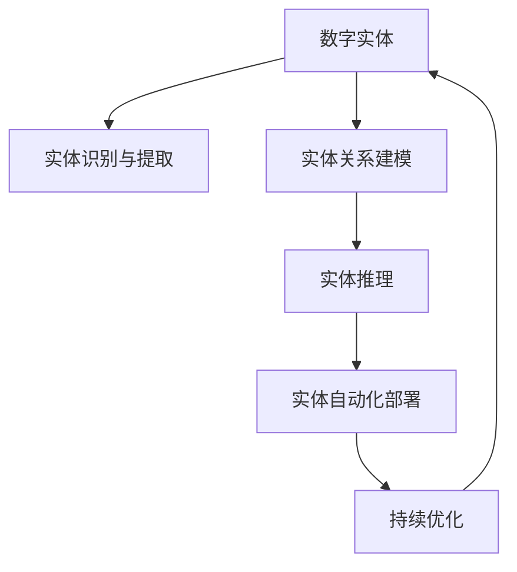

                 

## 1. 背景介绍

随着人工智能技术的不断进步，数字实体自动化（Digital Entity Automation, DEA）正逐渐成为推动各行各业数字化转型的重要力量。数字实体自动化通过利用先进的数据分析、机器学习和自然语言处理技术，实现对各种数字实体的自动化管理、智能识别、自动化部署和持续优化，从而提升运营效率、降低成本、增强决策支持。

### 1.1 问题由来
在数字化时代，企业内部以及企业间存在大量的数据和实体信息。如何有效地管理和利用这些数字实体，一直是企业信息化建设中的重大挑战。传统的数据管理和实体识别往往依赖于人工操作，效率低下且容易出错。而数字实体自动化技术，通过自动化处理大量数据，提供了更高效、更准确的解决方案，从而赋能企业运营，优化决策支持，推动业务创新。

### 1.2 问题核心关键点
数字实体自动化技术主要涉及以下几个关键问题：
1. **数据采集与清洗**：如何自动、高效地从各种数据源中采集和清洗高质量的实体数据。
2. **实体识别与提取**：如何自动、准确地识别和提取文本数据中的实体信息。
3. **实体关系建模**：如何构建实体之间的连接关系，进行实体之间的关联分析。
4. **实体推理与推理链构建**：如何通过知识图谱等技术进行实体推理，构建复杂的推理链。
5. **智能部署与持续优化**：如何将实体自动部署到相应的应用场景中，并持续优化实体模型。

### 1.3 问题研究意义
数字实体自动化技术的成功应用，对于提升企业运营效率、优化决策支持、推动业务创新具有重要意义：

1. **提高效率**：通过自动化处理实体数据，显著减少人工操作，提升数据处理效率。
2. **降低成本**：减少人工成本，降低错误率，提升决策质量。
3. **增强决策支持**：提供高质量的数据支持和智能分析，辅助管理层做出更科学的决策。
4. **推动业务创新**：基于实体数据和关联关系，创新业务模式，拓展业务边界。

## 2. 核心概念与联系

### 2.1 核心概念概述

为更好地理解数字实体自动化的实现机制，本节将介绍几个关键概念及其相互联系：

- **数字实体（Digital Entity）**：指企业内部、企业间以及互联网上存在的各种数据实体，如客户、产品、文档、事件等。
- **实体识别与提取（Entity Recognition & Extraction）**：指自动识别和提取文本数据中的实体信息，如人名、地名、组织名等。
- **实体关系建模（Entity Relationship Modeling）**：指构建实体之间的连接关系，进行实体之间的关联分析，形成知识图谱。
- **实体推理（Entity Reasoning）**：指利用知识图谱等技术，对实体信息进行推理，构建复杂的推理链。
- **实体自动化部署（Entity Automation Deployment）**：指将实体数据和模型自动化部署到相应的应用场景中，如智能客服、推荐系统、风险控制等。
- **持续优化（Continuous Optimization）**：指根据实体数据的实时变化，持续优化实体模型，确保其准确性和时效性。

这些核心概念之间的逻辑关系可以通过以下Mermaid流程图来展示：



这个流程图展示了数字实体自动化的核心概念及其之间的联系：

1. 数字实体通过实体识别与提取技术，从文本数据中获取关键信息。
2. 这些实体信息通过实体关系建模技术，构建连接关系，形成知识图谱。
3. 基于知识图谱，进行实体推理，构建复杂的推理链。
4. 推理结果通过实体自动化部署技术，应用到实际场景中。
5. 通过持续优化，不断迭代实体模型，提高其准确性和时效性。

## 3. 核心算法原理 & 具体操作步骤
### 3.1 算法原理概述

数字实体自动化的核心算法包括实体识别与提取、实体关系建模、实体推理等。其中，实体识别与提取和实体关系建模是数字实体自动化的基础，实体推理则是高级应用。

### 3.2 算法步骤详解

数字实体自动化的主要算法步骤包括：

**Step 1: 数据采集与清洗**
- 从企业内部系统、互联网、社交媒体等数据源中，自动采集实体数据。
- 对采集到的数据进行清洗，去除噪声和冗余信息，确保数据的质量和一致性。

**Step 2: 实体识别与提取**
- 利用自然语言处理技术，如命名实体识别（Named Entity Recognition, NER），自动从文本中识别出实体及其类型（如人名、地名、组织名等）。
- 提取实体信息，如实体名称、实体属性、实体关系等，形成结构化数据。

**Step 3: 实体关系建模**
- 构建实体之间的连接关系，形成知识图谱。可以通过RDF、GraphDB等技术，将实体信息表示为图结构。
- 利用知识图谱进行实体关系推理，形成实体之间的关联网络。

**Step 4: 实体推理**
- 基于知识图谱，进行实体推理，构建复杂的推理链。
- 利用逻辑推理和概率推理等技术，对实体信息进行推断，预测实体关系。

**Step 5: 实体自动化部署**
- 将实体数据和模型自动化部署到相应的应用场景中，如智能客服、推荐系统、风险控制等。
- 通过API接口，将实体数据和推理结果应用到具体业务中。

**Step 6: 持续优化**
- 根据实体数据的实时变化，持续优化实体模型，确保其准确性和时效性。
- 利用机器学习技术，如增量学习、在线学习等，不断迭代实体模型。

### 3.3 算法优缺点

数字实体自动化的算法主要具有以下优点：
1. 自动化程度高。自动化的数据采集、实体识别、实体关系建模等过程，减少了人工操作，提高了效率。
2. 精度高。利用先进的数据处理和实体推理技术，可以显著提高实体数据的准确性和一致性。
3. 可扩展性强。知识图谱等技术，可以灵活扩展实体之间的连接关系，适应不同业务场景。
4. 应用广泛。数字实体自动化技术可以应用于智能客服、推荐系统、风险控制等多个领域，推动业务创新。

同时，该算法也存在一定的局限性：
1. 依赖高质量数据。实体识别与提取、实体关系建模等步骤需要高质量的标注数据，否则会影响算法的精度。
2. 技术门槛高。需要掌握自然语言处理、知识图谱等技术，对技术要求较高。
3. 推理复杂度高。实体推理过程涉及复杂的逻辑推理和概率推理，算法实现较为复杂。
4. 应用场景特定。不同业务场景中的实体模型需要针对性地设计和优化，通用性较差。

尽管存在这些局限性，但就目前而言，数字实体自动化算法在推动企业数字化转型中，具有显著的优势和潜力。

### 3.4 算法应用领域

数字实体自动化技术已经在多个领域得到应用，例如：

- **智能客服系统**：利用实体数据和推理结果，构建智能客服系统，提升客户服务质量。
- **推荐系统**：通过实体数据和推理链，生成个性化推荐，提升用户满意度。
- **风险控制**：利用实体数据和关联关系，构建风险评估模型，降低风险损失。
- **舆情监测**：利用实体数据和知识图谱，进行舆情分析和情感分析，提升舆情管理能力。
- **智慧城市治理**：利用实体数据和推理链，构建智慧城市治理模型，提高城市管理效率。
- **金融风控**：通过实体数据和知识图谱，进行信用评估和风险预测，降低金融风险。

## 4. 数学模型和公式 & 详细讲解 & 举例说明

### 4.1 数学模型构建

数字实体自动化的数学模型构建涉及多个方面，如实体识别、实体关系建模、实体推理等。以下以实体识别为例，给出数学模型构建的过程。

假设文本数据为 $x$，实体识别的目标是从 $x$ 中自动识别出实体 $e$，并将其标注为特定类型 $t$。则实体识别的目标函数可以定义为：

$$
\arg\min_{(e, t)} L(e, t; x) = \arg\min_{(e, t)} \sum_{i=1}^{N} \ell(e_i, t_i; x)
$$

其中，$L(e, t; x)$ 为损失函数，$\ell(e_i, t_i; x)$ 为样本 $i$ 的损失函数，$N$ 为样本数量。损失函数 $\ell(e_i, t_i; x)$ 可以定义为交叉熵损失：

$$
\ell(e_i, t_i; x) = -y_i \log \hat{y}_i - (1-y_i) \log (1-\hat{y}_i)
$$

其中，$y_i$ 为样本 $i$ 的标注标签，$\hat{y}_i$ 为模型预测结果。

### 4.2 公式推导过程

以实体识别为例，给出损失函数 $\ell(e_i, t_i; x)$ 的推导过程：

设模型为 $M$，输入为 $x$，输出为 $(\hat{e}, \hat{t})$，其中 $\hat{e}$ 表示模型预测的实体，$\hat{t}$ 表示预测的实体类型。则损失函数可以定义为：

$$
L(\hat{e}, \hat{t}; x) = -\frac{1}{N} \sum_{i=1}^{N} \ell(\hat{e}_i, \hat{t}_i; x)
$$

其中，$\ell(\hat{e}_i, \hat{t}_i; x)$ 为样本 $i$ 的损失函数，可以进一步定义为：

$$
\ell(\hat{e}_i, \hat{t}_i; x) = -y_i \log P(\hat{e}_i; x) - (1-y_i) \log (1-P(\hat{e}_i; x))
$$

其中，$P(\hat{e}_i; x)$ 为模型预测实体的概率。

### 4.3 案例分析与讲解

以情感分析为例，展示如何利用数字实体自动化技术，构建情感分析系统：

1. **数据采集与清洗**：从社交媒体、新闻评论等渠道，自动采集文本数据，并进行清洗，去除噪声和冗余信息。

2. **实体识别与提取**：利用实体识别模型，从文本中识别出人名、地名、组织名等实体，提取实体信息。

3. **实体关系建模**：构建实体之间的连接关系，形成知识图谱。以情感分析为例，可以利用实体之间的关系，构建情感链，如人名-情感-产品。

4. **实体推理**：利用情感链进行实体推理，构建情感推理网络。通过知识图谱，推断出情感极性（正、负、中性）。

5. **实体自动化部署**：将情感推理结果应用于实际业务，如智能客服、舆情监测等。

6. **持续优化**：根据用户反馈和情感变化趋势，持续优化情感分析模型，提升模型精度和鲁棒性。

## 5. 项目实践：代码实例和详细解释说明

### 5.1 开发环境搭建

在进行数字实体自动化项目开发前，我们需要准备好开发环境。以下是使用Python进行PyTorch开发的环境配置流程：

1. 安装Anaconda：从官网下载并安装Anaconda，用于创建独立的Python环境。

2. 创建并激活虚拟环境：
```bash
conda create -n pytorch-env python=3.8 
conda activate pytorch-env
```

3. 安装PyTorch：根据CUDA版本，从官网获取对应的安装命令。例如：
```bash
conda install pytorch torchvision torchaudio cudatoolkit=11.1 -c pytorch -c conda-forge
```

4. 安装Transformers库：
```bash
pip install transformers
```

5. 安装各类工具包：
```bash
pip install numpy pandas scikit-learn matplotlib tqdm jupyter notebook ipython
```

完成上述步骤后，即可在`pytorch-env`环境中开始项目开发。

### 5.2 源代码详细实现

这里我们以实体识别任务为例，给出使用Transformers库对BERT模型进行实体识别的PyTorch代码实现。

首先，定义实体识别任务的数据处理函数：

```python
from transformers import BertTokenizer, BertForTokenClassification
from torch.utils.data import Dataset, DataLoader
import torch

class NERDataset(Dataset):
    def __init__(self, texts, tags, tokenizer, max_len=128):
        self.texts = texts
        self.tags = tags
        self.tokenizer = tokenizer
        self.max_len = max_len
        
    def __len__(self):
        return len(self.texts)
    
    def __getitem__(self, item):
        text = self.texts[item]
        tags = self.tags[item]
        
        encoding = self.tokenizer(text, return_tensors='pt', max_length=self.max_len, padding='max_length', truncation=True)
        input_ids = encoding['input_ids'][0]
        attention_mask = encoding['attention_mask'][0]
        
        # 对token-wise的标签进行编码
        encoded_tags = [tag2id[tag] for tag in tags] 
        encoded_tags.extend([tag2id['O']] * (self.max_len - len(encoded_tags)))
        labels = torch.tensor(encoded_tags, dtype=torch.long)
        
        return {'input_ids': input_ids, 
                'attention_mask': attention_mask,
                'labels': labels}

# 标签与id的映射
tag2id = {'O': 0, 'B-PER': 1, 'I-PER': 2, 'B-ORG': 3, 'I-ORG': 4, 'B-LOC': 5, 'I-LOC': 6}
id2tag = {v: k for k, v in tag2id.items()}

# 创建dataset
tokenizer = BertTokenizer.from_pretrained('bert-base-cased')

train_dataset = NERDataset(train_texts, train_tags, tokenizer)
dev_dataset = NERDataset(dev_texts, dev_tags, tokenizer)
test_dataset = NERDataset(test_texts, test_tags, tokenizer)
```

然后，定义模型和优化器：

```python
from transformers import BertForTokenClassification, AdamW

model = BertForTokenClassification.from_pretrained('bert-base-cased', num_labels=len(tag2id))

optimizer = AdamW(model.parameters(), lr=2e-5)
```

接着，定义训练和评估函数：

```python
from torch.utils.data import DataLoader
from tqdm import tqdm
from sklearn.metrics import classification_report

device = torch.device('cuda') if torch.cuda.is_available() else torch.device('cpu')
model.to(device)

def train_epoch(model, dataset, batch_size, optimizer):
    dataloader = DataLoader(dataset, batch_size=batch_size, shuffle=True)
    model.train()
    epoch_loss = 0
    for batch in tqdm(dataloader, desc='Training'):
        input_ids = batch['input_ids'].to(device)
        attention_mask = batch['attention_mask'].to(device)
        labels = batch['labels'].to(device)
        model.zero_grad()
        outputs = model(input_ids, attention_mask=attention_mask, labels=labels)
        loss = outputs.loss
        epoch_loss += loss.item()
        loss.backward()
        optimizer.step()
    return epoch_loss / len(dataloader)

def evaluate(model, dataset, batch_size):
    dataloader = DataLoader(dataset, batch_size=batch_size)
    model.eval()
    preds, labels = [], []
    with torch.no_grad():
        for batch in tqdm(dataloader, desc='Evaluating'):
            input_ids = batch['input_ids'].to(device)
            attention_mask = batch['attention_mask'].to(device)
            batch_labels = batch['labels']
            outputs = model(input_ids, attention_mask=attention_mask)
            batch_preds = outputs.logits.argmax(dim=2).to('cpu').tolist()
            batch_labels = batch_labels.to('cpu').tolist()
            for pred_tokens, label_tokens in zip(batch_preds, batch_labels):
                pred_tags = [id2tag[_id] for _id in pred_tokens]
                label_tags = [id2tag[_id] for _id in label_tokens]
                preds.append(pred_tags[:len(label_tags)])
                labels.append(label_tags)
                
    print(classification_report(labels, preds))
```

最后，启动训练流程并在测试集上评估：

```python
epochs = 5
batch_size = 16

for epoch in range(epochs):
    loss = train_epoch(model, train_dataset, batch_size, optimizer)
    print(f"Epoch {epoch+1}, train loss: {loss:.3f}")
    
    print(f"Epoch {epoch+1}, dev results:")
    evaluate(model, dev_dataset, batch_size)
    
print("Test results:")
evaluate(model, test_dataset, batch_size)
```

以上就是使用PyTorch对BERT进行实体识别任务微调的完整代码实现。可以看到，得益于Transformers库的强大封装，我们可以用相对简洁的代码完成BERT模型的加载和微调。

### 5.3 代码解读与分析

让我们再详细解读一下关键代码的实现细节：

**NERDataset类**：
- `__init__`方法：初始化文本、标签、分词器等关键组件。
- `__len__`方法：返回数据集的样本数量。
- `__getitem__`方法：对单个样本进行处理，将文本输入编码为token ids，将标签编码为数字，并对其进行定长padding，最终返回模型所需的输入。

**tag2id和id2tag字典**：
- 定义了标签与数字id之间的映射关系，用于将token-wise的预测结果解码回真实的标签。

**训练和评估函数**：
- 使用PyTorch的DataLoader对数据集进行批次化加载，供模型训练和推理使用。
- 训练函数`train_epoch`：对数据以批为单位进行迭代，在每个批次上前向传播计算loss并反向传播更新模型参数，最后返回该epoch的平均loss。
- 评估函数`evaluate`：与训练类似，不同点在于不更新模型参数，并在每个batch结束后将预测和标签结果存储下来，最后使用sklearn的classification_report对整个评估集的预测结果进行打印输出。

**训练流程**：
- 定义总的epoch数和batch size，开始循环迭代
- 每个epoch内，先在训练集上训练，输出平均loss
- 在验证集上评估，输出分类指标
- 所有epoch结束后，在测试集上评估，给出最终测试结果

可以看到，PyTorch配合Transformers库使得BERT微调的代码实现变得简洁高效。开发者可以将更多精力放在数据处理、模型改进等高层逻辑上，而不必过多关注底层的实现细节。

当然，工业级的系统实现还需考虑更多因素，如模型的保存和部署、超参数的自动搜索、更灵活的任务适配层等。但核心的微调范式基本与此类似。

## 6. 实际应用场景
### 6.1 智能客服系统

数字实体自动化的核心技术之一是实体识别与提取，这在大规模实体信息的管理和自动化处理中具有重要意义。以智能客服系统为例，利用数字实体自动化技术，可以实现客户信息的高效管理和智能交互：

1. **客户信息管理**：自动从聊天记录中识别和提取客户信息，如姓名、电话、地址等，构建客户档案，便于后续服务。
2. **意图识别**：自动识别客户问题意图，如咨询产品、投诉等，构建意图分类器，提高响应速度和准确性。
3. **自动回复**：利用实体推理结果，自动生成回复内容，减少人工工作量。

通过数字实体自动化技术，智能客服系统能够更高效、更智能地处理客户问题，提升用户体验，降低运营成本。

### 6.2 推荐系统

推荐系统是数字实体自动化技术的另一个重要应用领域。推荐系统通过分析用户行为数据，预测用户偏好，实现个性化推荐，从而提升用户体验和满意度。

1. **用户行为分析**：自动分析用户浏览、点击、评论等行为数据，提取实体信息，如产品名称、品牌等。
2. **推荐模型构建**：基于实体信息，构建推荐模型，如协同过滤、基于内容的推荐等，提高推荐效果。
3. **推荐结果优化**：根据用户反馈和实体变化，持续优化推荐模型，提升推荐精度。

通过数字实体自动化技术，推荐系统能够更准确地预测用户偏好，提供个性化的推荐服务，提升用户满意度和业务转化率。

### 6.3 风险控制

风险控制是金融领域的重要应用场景，利用数字实体自动化技术，可以更准确地识别和评估风险：

1. **风险信息提取**：自动从金融数据中识别和提取实体信息，如贷款人、交易对手、交易金额等。
2. **风险模型构建**：基于实体信息，构建风险评估模型，如信用评分、违约预测等，降低风险损失。
3. **风险预警**：利用实体推理结果，实时监控风险变化，及时预警潜在风险。

通过数字实体自动化技术，风险控制系统能够更准确地识别和评估风险，降低金融机构的损失风险，提升业务决策质量。

### 6.4 未来应用展望

随着数字实体自动化技术的不断发展，其在更多领域的应用前景将更加广阔。未来，数字实体自动化技术有望在智慧城市治理、智慧医疗、智能制造等多个领域得到广泛应用，推动数字化转型和智能化升级。

1. **智慧城市治理**：通过数字实体自动化技术，构建智慧城市治理模型，提高城市管理效率，提升居民生活质量。
2. **智慧医疗**：利用数字实体自动化技术，构建医疗数据治理模型，提高医疗数据质量，优化诊疗流程。
3. **智能制造**：通过数字实体自动化技术，构建智能制造模型，提高生产效率，降低运营成本。

此外，在农业、教育、零售等多个领域，数字实体自动化技术也将得到广泛应用，推动相关行业的数字化转型。

## 7. 工具和资源推荐
### 7.1 学习资源推荐

为了帮助开发者系统掌握数字实体自动化的理论基础和实践技巧，这里推荐一些优质的学习资源：

1. 《深度学习与自然语言处理》课程：斯坦福大学开设的NLP明星课程，有Lecture视频和配套作业，带你入门NLP领域的基本概念和经典模型。
2. 《Natural Language Processing with Transformers》书籍：Transformers库的作者所著，全面介绍了如何使用Transformers库进行NLP任务开发，包括数字实体自动化在内的诸多范式。
3. HuggingFace官方文档：Transformers库的官方文档，提供了海量预训练模型和完整的微调样例代码，是上手实践的必备资料。
4. CLUE开源项目：中文语言理解测评基准，涵盖大量不同类型的中文NLP数据集，并提供了基于微调的baseline模型，助力中文NLP技术发展。

通过对这些资源的学习实践，相信你一定能够快速掌握数字实体自动化的精髓，并用于解决实际的NLP问题。
### 7.2 开发工具推荐

高效的开发离不开优秀的工具支持。以下是几款用于数字实体自动化开发的常用工具：

1. PyTorch：基于Python的开源深度学习框架，灵活动态的计算图，适合快速迭代研究。大部分预训练语言模型都有PyTorch版本的实现。
2. TensorFlow：由Google主导开发的开源深度学习框架，生产部署方便，适合大规模工程应用。同样有丰富的预训练语言模型资源。
3. Transformers库：HuggingFace开发的NLP工具库，集成了众多SOTA语言模型，支持PyTorch和TensorFlow，是进行数字实体自动化开发的利器。
4. Weights & Biases：模型训练的实验跟踪工具，可以记录和可视化模型训练过程中的各项指标，方便对比和调优。与主流深度学习框架无缝集成。
5. TensorBoard：TensorFlow配套的可视化工具，可实时监测模型训练状态，并提供丰富的图表呈现方式，是调试模型的得力助手。
6. Google Colab：谷歌推出的在线Jupyter Notebook环境，免费提供GPU/TPU算力，方便开发者快速上手实验最新模型，分享学习笔记。

合理利用这些工具，可以显著提升数字实体自动化的开发效率，加快创新迭代的步伐。

### 7.3 相关论文推荐

数字实体自动化技术的快速发展得益于学界的持续研究。以下是几篇奠基性的相关论文，推荐阅读：

1. Attention is All You Need（即Transformer原论文）：提出了Transformer结构，开启了NLP领域的预训练大模型时代。
2. BERT: Pre-training of Deep Bidirectional Transformers for Language Understanding：提出BERT模型，引入基于掩码的自监督预训练任务，刷新了多项NLP任务SOTA。
3. Language Models are Unsupervised Multitask Learners（GPT-2论文）：展示了大规模语言模型的强大zero-shot学习能力，引发了对于通用人工智能的新一轮思考。
4. Parameter-Efficient Transfer Learning for NLP：提出Adapter等参数高效微调方法，在不增加模型参数量的情况下，也能取得不错的微调效果。
5. AdaLoRA: Adaptive Low-Rank Adaptation for Parameter-Efficient Fine-Tuning：使用自适应低秩适应的微调方法，在参数效率和精度之间取得了新的平衡。

这些论文代表了大语言模型微调技术的发展脉络。通过学习这些前沿成果，可以帮助研究者把握学科前进方向，激发更多的创新灵感。

## 8. 总结：未来发展趋势与挑战
### 8.1 研究成果总结

本文对数字实体自动化的实现机制进行了全面系统的介绍。首先阐述了数字实体自动化的研究背景和意义，明确了实体识别与提取、实体关系建模、实体推理等技术在数字实体自动化中的核心作用。其次，从原理到实践，详细讲解了数字实体自动化的数学模型构建和关键算法步骤，给出了数字实体自动化的完整代码实例。同时，本文还探讨了数字实体自动化在智能客服、推荐系统、风险控制等多个领域的应用前景，展示了其广泛的适用性和潜力。

通过本文的系统梳理，可以看到，数字实体自动化技术在推动企业数字化转型中，具有显著的优势和潜力。未来，伴随技术的不断进步，数字实体自动化技术必将在更多领域得到应用，推动行业创新和业务升级。

### 8.2 未来发展趋势

展望未来，数字实体自动化技术的发展趋势主要包括：

1. **算法性能提升**：随着深度学习、自然语言处理等技术的不断进步，数字实体自动化的算法性能将不断提升，准确性和鲁棒性将进一步增强。
2. **多模态融合**：未来数字实体自动化技术将更多地融合视觉、语音等多模态信息，提升对复杂实体的识别和推理能力。
3. **数据质量优化**：通过数据清洗、数据增强等技术，进一步提升数字实体自动化的数据质量，减少噪声和冗余信息。
4. **领域定制化**：未来数字实体自动化技术将更多地针对特定领域进行定制化设计，提升在不同场景下的适应性和效果。
5. **实时性提升**：通过增量学习、在线学习等技术，实现数字实体自动化的实时更新，适应动态变化的业务需求。
6. **可解释性增强**：通过因果分析、逻辑推理等技术，增强数字实体自动化的可解释性，提升模型的可信度和透明性。

这些趋势凸显了数字实体自动化技术的广阔前景。通过不断优化算法、提升数据质量、增强可解释性，数字实体自动化技术必将在更广泛的应用场景中发挥更大的作用。

### 8.3 面临的挑战

尽管数字实体自动化技术已经取得了一定的成果，但在进一步推广应用的过程中，仍面临以下挑战：

1. **数据质量和多样性**：高质量、多样化的数据是数字实体自动化的基础，但数据获取和标注成本较高，数据质量和多样性问题仍需解决。
2. **算法复杂度**：数字实体自动化的算法较为复杂，尤其是实体推理过程涉及复杂的逻辑推理和概率推理，算法实现难度较大。
3. **模型鲁棒性**：数字实体自动化的模型在面对噪声数据和异常情况时，鲁棒性仍需提高，避免误识别和误推理。
4. **技术门槛**：数字实体自动化的技术要求较高，需要掌握深度学习、自然语言处理、知识图谱等多项技术，技术门槛较高。
5. **应用场景特定**：不同业务场景中的实体识别和推理任务存在较大差异，通用化程度较低。

尽管存在这些挑战，但数字实体自动化技术在推动企业数字化转型和智能化升级中的潜力巨大。相信随着技术的不断进步和应用实践的积累，数字实体自动化技术必将在更多领域得到广泛应用，为各行各业带来新的机遇和挑战。

### 8.4 研究展望

未来，数字实体自动化技术的研究方向将聚焦以下几个方面：

1. **无监督和半监督学习**：探索无需大量标注数据的实体识别和推理方法，降低对标注样本的依赖。
2. **参数高效微调**：开发更加参数高效的实体识别和推理算法，提高模型的推理效率和效果。
3. **因果推断与因果分析**：利用因果推断技术，增强数字实体自动化的推理能力和模型解释性。
4. **多模态融合**：探索视觉、语音、文本等多模态数据的融合方法，提升数字实体自动化的泛化能力和应用场景。
5. **知识图谱构建**：构建更全面、更丰富的知识图谱，增强数字实体自动化的推理能力和知识表示能力。
6. **智能部署与监控**：研究数字实体自动化的智能部署和持续监控方法，提升实体自动化的实用性和稳定性。

通过在这些方向上的深入研究，数字实体自动化技术必将在未来取得更大的突破，为各行各业带来更广泛的应用和深远的影响。

## 9. 附录：常见问题与解答

**Q1：数字实体自动化技术是否适用于所有领域？**

A: 数字实体自动化技术适用于需要大量实体数据管理和处理的领域，如智能客服、推荐系统、风险控制等。但对于一些特定领域，如法律、医学等，由于实体数据的复杂性和敏感性，可能需要针对性地设计和优化实体识别和推理算法。

**Q2：如何提高数字实体自动化的数据质量？**

A: 提高数字实体自动化的数据质量，主要通过以下几个步骤：
1. 数据清洗：去除噪声和冗余信息，确保数据的一致性和准确性。
2. 数据增强：通过数据增强技术，扩充训练数据，提升模型泛化能力。
3. 标注数据获取：收集高质量的标注数据，减少标注误差。

**Q3：数字实体自动化的算法复杂度如何控制？**

A: 数字实体自动化的算法复杂度较高，可以通过以下几个方式进行控制：
1. 简化模型：选择合适的模型结构和算法，避免过于复杂的推理过程。
2. 优化算法：通过算法优化和加速，提升算法的计算效率。
3. 增量学习：采用增量学习等在线学习方法，实时更新模型，减少计算资源消耗。

**Q4：数字实体自动化的模型鲁棒性如何提高？**

A: 提高数字实体自动化的模型鲁棒性，主要通过以下几个方式：
1. 数据增强：通过数据增强技术，扩充训练数据，提升模型的泛化能力。
2. 正则化技术：使用L2正则、Dropout等正则化技术，防止模型过拟合。
3. 对抗训练：引入对抗样本，提高模型的鲁棒性和泛化能力。

**Q5：数字实体自动化的技术门槛如何降低？**

A: 降低数字实体自动化的技术门槛，主要通过以下几个方式：
1. 开源工具：使用开源工具和库，如Transformers、TensorFlow等，简化开发流程。
2. 在线学习资源：利用在线学习资源，如课程、文档、社区等，提升学习效率。
3. 实践经验：通过实践积累经验，掌握关键技术细节。

通过这些方法，数字实体自动化的技术门槛将逐步降低，更多开发者能够参与其中，推动技术的广泛应用。

---

作者：禅与计算机程序设计艺术 / Zen and the Art of Computer Programming

