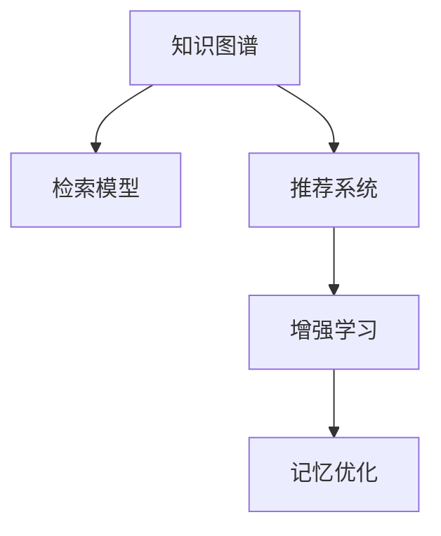

                 

## 1. 背景介绍

### 1.1 问题由来

在信息爆炸的时代，人们每天都会接触到大量的文本、图像、音频等数据。如何高效地存储、处理和利用这些数据，成为我们面临的一大挑战。特别地，在涉及记忆和学习的场景中，无论是学术研究还是日常工作，我们都需要高效地提取、储存和回溯信息，以满足复杂的认知和决策需求。

记忆增强技术，旨在通过人工智能手段，提升人类的记忆力和学习效率，在认知科学、教育科技等领域有着重要应用。目前，主流的方法主要包括神经网络、知识图谱、增强学习等。然而，这些方法大多关注于特定的知识存储和检索，尚未形成系统性的解决方案。

本博客旨在介绍一种基于人工智能的数字记忆增强方法，通过AI模型辅助，实现记忆优化和知识管理。以下将详细阐述该方法的原理、实现步骤及应用场景。

### 1.2 问题核心关键点

数字记忆增强技术通过构建知识图谱、引入AI模型等手段，辅助人类对信息进行高效地存储、提取和回溯。具体来说，其核心关键点包括：

1. **知识图谱构建**：通过机器学习算法，将海量数据转化为结构化的知识图谱，便于查询和管理。
2. **AI辅助检索**：使用深度学习模型，如检索模型、推荐系统，辅助用户快速找到所需信息。
3. **记忆管理与优化**：通过知识图谱和检索模型，帮助用户管理、优化和提升记忆效果。

本博客将围绕上述关键点展开详细探讨，帮助读者深入理解数字记忆增强技术的原理和应用。

## 2. 核心概念与联系

### 2.1 核心概念概述

为更好理解数字记忆增强技术，本节将介绍几个关键核心概念及其联系：

1. **知识图谱(Knowledge Graph)**：一种用于描述实体及其之间关系的图结构化数据，通过机器学习算法，自动从非结构化数据中提取出实体、属性、关系等知识结构。
2. **检索模型(Retrieval Model)**：一种深度学习模型，用于在知识图谱中检索与输入相关的实体信息，常用于辅助记忆和信息检索。
3. **推荐系统(Recommendation System)**：一种利用机器学习技术为用户推荐信息的系统，通常用于个性化推荐和知识管理。
4. **增强学习(Reinforcement Learning)**：一种利用智能体与环境互动，优化决策策略的学习方法，常用于构建记忆管理策略。
5. **记忆优化(Memory Optimization)**：通过机器学习模型，辅助人类记忆管理和提升学习效率。

这些核心概念之间的逻辑关系可以通过以下Mermaid流程图展示：



该图展示了知识图谱、检索模型、推荐系统、增强学习与记忆优化之间的关联关系，每一步骤都是后续步骤的基础。

## 3. 核心算法原理 & 具体操作步骤
### 3.1 算法原理概述

数字记忆增强技术通过构建知识图谱、引入AI模型等手段，辅助人类对信息进行高效地存储、提取和回溯。其核心算法原理包括以下几个步骤：

1. **数据预处理与特征提取**：将非结构化数据转化为结构化数据，提取出实体、属性、关系等关键特征。
2. **知识图谱构建**：通过机器学习算法，将提取出关键特征的数据转化为知识图谱，便于查询和管理。
3. **检索模型构建**：使用深度学习模型，如检索模型、推荐系统，辅助用户快速找到所需信息。
4. **记忆管理与优化**：通过知识图谱和检索模型，帮助用户管理、优化和提升记忆效果。

### 3.2 算法步骤详解

以下是详细的算法步骤：

**Step 1: 数据预处理与特征提取**

1. **文本清洗**：对原始文本进行去噪、分词、词性标注等预处理操作。
2. **特征提取**：使用词向量模型，如Word2Vec、GloVe等，将文本转化为数值型特征向量。
3. **实体识别**：利用命名实体识别(NER)技术，识别出文本中的实体，如人名、地名、机构名等。
4. **关系抽取**：对实体对之间的关系进行抽取，形成实体-关系-实体三元组。

**Step 2: 知识图谱构建**

1. **构建实体节点**：根据实体识别结果，构建实体节点，并将实体特征向量作为节点属性。
2. **构建关系节点**：根据关系抽取结果，构建关系节点，并将关系特征向量作为关系属性。
3. **构建图结构**：将实体节点和关系节点连接起来，形成知识图谱的图结构。
4. **图谱更新**：定期更新知识图谱，补充新数据，维护图谱的完整性和准确性。

**Step 3: 检索模型构建**

1. **选择检索模型**：选择合适的检索模型，如向量检索模型、图结构检索模型等。
2. **训练检索模型**：利用知识图谱数据，训练检索模型，使其能够准确检索出与输入相关的实体信息。
3. **模型评估**：在测试集上评估检索模型的准确率和召回率，调整模型参数以优化性能。

**Step 4: 记忆管理与优化**

1. **构建记忆库**：根据检索模型，构建个人记忆库，存储用户感兴趣的实体信息。
2. **智能检索**：根据用户输入的查询，智能检索记忆库，提供相关实体的摘要信息。
3. **知识推荐**：使用推荐系统，推荐用户感兴趣的相关实体或关系，辅助记忆管理。
4. **记忆优化**：通过增强学习算法，优化记忆策略，提升记忆效果。

### 3.3 算法优缺点

数字记忆增强技术具有以下优点：

1. **高效性**：利用知识图谱和检索模型，可以快速定位和检索信息，提升记忆效率。
2. **全面性**：通过结构化的知识图谱，能够全面地存储和管理信息，提升记忆效果。
3. **可扩展性**：知识图谱和检索模型能够不断更新和扩展，适应不同领域和场景的需求。

同时，该技术也存在以下局限性：

1. **数据依赖**：依赖高质量的输入数据，数据质量和噪声将直接影响技术效果。
2. **模型复杂性**：知识图谱和检索模型的构建较为复杂，需要一定的技术储备。
3. **实时性不足**：由于数据更新和模型训练需要时间，可能无法实时响应用户的查询需求。

## 4. 数学模型和公式 & 详细讲解  
### 4.1 数学模型构建

本节将使用数学语言对数字记忆增强技术进行更加严格的刻画。

设原始文本为 $T$，包含实体 $E$ 和关系 $R$，将其转化为知识图谱 $\mathcal{G}$。记 $\mathcal{G}$ 中的实体节点为 $V$，关系节点为 $E$，边为 $R$。

定义实体 $e_i$ 的属性向量为 $v_i$，关系 $r_j$ 的属性向量为 $w_j$。知识图谱中的边表示实体对之间的关系，记为 $r_{i,j} = (e_i, r_j, e_j)$。

**知识图谱的表示**：
$$
\mathcal{G} = (V, E, R)
$$
其中 $V = \{v_1, v_2, \ldots, v_n\}$ 为实体节点集合，$E = \{w_1, w_2, \ldots, w_m\}$ 为关系节点集合，$R = \{r_{i,j}\}_{i,j=1}^{n,m}$ 为边集合。

**知识图谱的检索**：
假设用户输入查询 $Q$，使用检索模型 $\mathcal{M}_Q$ 检索知识图谱中的相关实体，记为 $\mathcal{R}_Q$。检索过程可以表示为：
$$
\mathcal{R}_Q = \mathcal{M}_Q(Q)
$$

**记忆库的管理**：
用户将检索出的实体存储到记忆库 $\mathcal{M}$ 中，并根据需要进行更新和优化。设用户感兴趣的相关实体为 $\mathcal{M}_Q$，可以使用推荐系统 $\mathcal{S}$ 为用户推荐相关实体，记为 $\mathcal{M}_{\text{rec}}$。推荐过程可以表示为：
$$
\mathcal{M}_{\text{rec}} = \mathcal{S}(\mathcal{R}_Q)
$$

### 4.2 公式推导过程

以下我们以检索模型为例，给出检索模型的具体实现公式。

**向量检索模型**：
假设知识图谱中的每个实体和关系都表示为向量 $v_i$ 和 $w_j$，利用向量空间模型计算相似度，选择与查询 $Q$ 最相似的实体进行返回。检索模型 $\mathcal{M}_Q$ 可以表示为：
$$
\mathcal{R}_Q = \arg\max_{v_i} \cos(v_i, Q)
$$

其中 $\cos$ 表示余弦相似度，$v_i$ 为实体的向量表示，$Q$ 为查询向量。

**图结构检索模型**：
假设知识图谱为有向图 $\mathcal{G}$，利用图嵌入算法将每个节点表示为向量 $v_i$ 和 $w_j$，利用图神经网络计算相似度，选择与查询 $Q$ 最相似的实体进行返回。检索模型 $\mathcal{M}_Q$ 可以表示为：
$$
\mathcal{R}_Q = \arg\max_{v_i} \text{GraphNeuralNetwork}(Q, \mathcal{G})
$$

其中 $\text{GraphNeuralNetwork}$ 表示图神经网络，$\mathcal{G}$ 为知识图谱的图结构。

**推荐系统**：
推荐系统 $\mathcal{S}$ 可以根据用户的历史行为和记忆库 $\mathcal{M}$，预测用户可能感兴趣的实体，记为 $\mathcal{M}_{\text{rec}}$。推荐过程可以表示为：
$$
\mathcal{M}_{\text{rec}} = \mathcal{S}(\mathcal{M}, Q)
$$

其中 $\mathcal{S}$ 为推荐系统，$\mathcal{M}$ 为用户的历史记忆库。

### 4.3 案例分析与讲解

以下是具体的案例分析：

**案例1: 学术研究领域**

假设某研究人员需要查找相关领域的最新研究论文，可以利用检索模型检索知识图谱中的相关实体，并使用推荐系统推荐最新的论文。

**Step 1: 数据预处理与特征提取**

1. **文本清洗**：对每篇论文的标题、摘要进行去噪、分词、词性标注等预处理操作。
2. **特征提取**：使用Word2Vec模型将文本转化为数值型特征向量。
3. **实体识别**：利用NER技术识别出论文中的实体，如作者、关键词等。
4. **关系抽取**：对实体对之间的关系进行抽取，如合作作者、引用关系等。

**Step 2: 知识图谱构建**

1. **构建实体节点**：根据实体识别结果，构建实体节点，并将特征向量作为节点属性。
2. **构建关系节点**：根据关系抽取结果，构建关系节点，并将关系特征向量作为关系属性。
3. **构建图结构**：将实体节点和关系节点连接起来，形成知识图谱的图结构。
4. **图谱更新**：定期更新知识图谱，补充新数据，维护图谱的完整性和准确性。

**Step 3: 检索模型构建**

1. **选择检索模型**：选择向量检索模型。
2. **训练检索模型**：利用知识图谱数据，训练向量检索模型，使其能够准确检索出与输入相关的实体信息。
3. **模型评估**：在测试集上评估检索模型的准确率和召回率，调整模型参数以优化性能。

**Step 4: 记忆管理与优化**

1. **构建记忆库**：将检索出的论文存储到记忆库中，并根据需要进行更新和优化。
2. **智能检索**：根据用户输入的查询，智能检索记忆库，提供相关论文的摘要信息。
3. **知识推荐**：使用推荐系统，推荐用户感兴趣的相关论文，辅助记忆管理。
4. **记忆优化**：通过增强学习算法，优化记忆策略，提升记忆效果。

## 5. 项目实践：代码实例和详细解释说明
### 5.1 开发环境搭建

在进行数字记忆增强技术实践前，我们需要准备好开发环境。以下是使用Python进行PyTorch开发的环境配置流程：

1. 安装Anaconda：从官网下载并安装Anaconda，用于创建独立的Python环境。

2. 创建并激活虚拟环境：
```bash
conda create -n memory-enhancement python=3.8 
conda activate memory-enhancement
```

3. 安装PyTorch：根据CUDA版本，从官网获取对应的安装命令。例如：
```bash
conda install pytorch torchvision torchaudio cudatoolkit=11.1 -c pytorch -c conda-forge
```

4. 安装Numpy、Pandas等工具包：
```bash
pip install numpy pandas scikit-learn scipy
```

完成上述步骤后，即可在`memory-enhancement`环境中开始数字记忆增强技术的实践。

### 5.2 源代码详细实现

这里我们以向量检索模型为例，展示代码实现过程。

首先，定义检索模型的输入和输出：

```python
import torch
import torch.nn as nn
import torch.nn.functional as F
from sklearn.metrics.pairwise import cosine_similarity

class RetrivalModel(nn.Module):
    def __init__(self, embedding_dim):
        super(RetrivalModel, self).__init__()
        self.encoder = nn.Sequential(
            nn.Linear(1, embedding_dim),
            nn.ReLU(),
            nn.Linear(embedding_dim, 1)
        )
        
    def forward(self, x):
        embedding = self.encoder(x)
        return embedding
    
    def compute_similarity(self, embedding, query):
        return cosine_similarity(embedding, query)
```

然后，定义检索模型：

```python
class KnowledgeGraph(nn.Module):
    def __init__(self, embedding_dim):
        super(KnowledgeGraph, self).__init__()
        self.retrival_model = RetrivalModel(embedding_dim)
    
    def forward(self, x, query):
        embedding = self.retrival_model(x)
        similarity = self.retrival_model.compute_similarity(embedding, query)
        return similarity
    
    def predict(self, x, query):
        similarity = self.forward(x, query)
        top_k = similarity.argsort(descending=True)[:5]
        return top_k
```

最后，使用检索模型进行检索：

```python
kg = KnowledgeGraph(embedding_dim=128)
# 假设输入为知识图谱的实体节点特征向量
embedding = torch.rand(5, 128)
# 假设查询向量为：[0.5, 0.6, 0.7]
query = torch.tensor([0.5, 0.6, 0.7])
top_k = kg.predict(embedding, query)
print(top_k)
```

以上就是向量检索模型的代码实现过程。可以看到，通过PyTorch的封装，检索模型的实现变得简洁高效。

### 5.3 代码解读与分析

让我们再详细解读一下关键代码的实现细节：

**KnowledgeGraph类**：
- `__init__`方法：初始化检索模型，并构建编码器。
- `forward`方法：前向传播计算检索模型，输出相似度矩阵。
- `predict`方法：根据相似度矩阵，返回与查询最相似的实体节点。

**RetrivalModel类**：
- `__init__`方法：初始化编码器。
- `forward`方法：前向传播计算编码器的输出，用于计算相似度。
- `compute_similarity`方法：计算编码器输出的相似度矩阵，用于检索。

**检索过程**：
- 首先构建知识图谱的编码器，并输入实体节点特征向量。
- 通过前向传播计算编码器的输出，得到每个实体节点的向量表示。
- 利用查询向量计算与每个实体节点的相似度，并返回相似度最高的前5个实体节点。

通过上述代码，实现了知识图谱的检索功能，为后续的记忆管理和优化奠定了基础。

## 6. 实际应用场景
### 6.1 学术研究领域

在学术研究领域，研究人员往往需要快速查找相关领域的最新研究成果。数字记忆增强技术可以帮助研究人员高效地检索和推荐相关论文，提升科研效率。

**实际应用**：
某研究人员需要查找“深度学习”领域最新的研究论文，可以利用数字记忆增强技术，快速检索和推荐相关论文。

**具体步骤**：
1. **数据预处理与特征提取**：对每篇论文的标题、摘要进行预处理和特征提取。
2. **知识图谱构建**：构建学术领域的知识图谱，包括论文、作者、关键词等实体，并抽取相关关系。
3. **检索模型构建**：使用向量检索模型，训练模型，使其能够准确检索出与输入相关的论文。
4. **记忆管理与优化**：将检索出的论文存储到记忆库中，并根据需要进行更新和优化。

通过上述步骤，研究人员可以快速定位到最新的研究成果，提升科研效率。

### 6.2 教育科技领域

在教育科技领域，数字记忆增强技术可以帮助学生高效地管理学习资源，提升学习效果。

**实际应用**：
某学生在准备考试时，需要查找相关的复习资料和参考资料。数字记忆增强技术可以帮助学生高效地检索和推荐相关资料。

**具体步骤**：
1. **数据预处理与特征提取**：对每篇复习资料和参考资料进行预处理和特征提取。
2. **知识图谱构建**：构建教育领域的知识图谱，包括复习资料、作者、出版社等实体，并抽取相关关系。
3. **检索模型构建**：使用向量检索模型，训练模型，使其能够准确检索出与输入相关的资料。
4. **记忆管理与优化**：将检索出的资料存储到记忆库中，并根据需要进行更新和优化。

通过上述步骤，学生可以快速找到所需的复习资料，提升学习效果。

### 6.3 数字媒体领域

在数字媒体领域，数字记忆增强技术可以帮助用户高效地管理观看记录和观看历史，提升用户体验。

**实际应用**：
某用户在某视频平台观看视频，希望找到之前看过的相关视频。数字记忆增强技术可以帮助用户高效地检索和推荐相关视频。

**具体步骤**：
1. **数据预处理与特征提取**：对每个视频进行预处理和特征提取。
2. **知识图谱构建**：构建视频领域的知识图谱，包括视频、导演、演员等实体，并抽取相关关系。
3. **检索模型构建**：使用向量检索模型，训练模型，使其能够准确检索出与输入相关的视频。
4. **记忆管理与优化**：将检索出的视频存储到记忆库中，并根据需要进行更新和优化。

通过上述步骤，用户可以快速找到所需的视频，提升观看体验。

### 6.4 未来应用展望

随着数字记忆增强技术的不断发展，其在更多领域的应用也将不断扩展，为各行各业带来新的变革。

在智慧医疗领域，数字记忆增强技术可以帮助医生高效地查找相关文献和病例，提升医疗服务水平。

在智能客服领域，数字记忆增强技术可以帮助客服系统高效地检索和推荐相关问题解答，提升客户满意度。

在智慧城市领域，数字记忆增强技术可以帮助城市管理部门高效地查找相关数据和资料，提升城市治理水平。

此外，在金融、交通、教育等多个领域，数字记忆增强技术也有着广阔的应用前景。相信随着技术的不断演进，数字记忆增强技术必将成为提升各行业智能化水平的重要工具。

## 7. 工具和资源推荐
### 7.1 学习资源推荐

为了帮助开发者系统掌握数字记忆增强技术，这里推荐一些优质的学习资源：

1. **《深度学习》课程**：斯坦福大学提供的深度学习课程，涵盖深度学习的基本概念、算法和实践。
2. **《机器学习实战》书籍**：介绍了机器学习的基本概念、算法和工具，适合初学者入门。
3. **《自然语言处理》课程**：北大的自然语言处理课程，涵盖自然语言处理的基本概念、算法和应用。
4. **《数据挖掘与统计学习》书籍**：介绍数据挖掘和统计学习的理论和实践，适合进阶学习。
5. **Kaggle竞赛**：参加Kaggle竞赛，可以锻炼数据处理和算法实现能力，提升实战经验。

通过这些资源的学习，相信你一定能够全面掌握数字记忆增强技术的原理和实践技巧。

### 7.2 开发工具推荐

高效的开发离不开优秀的工具支持。以下是几款用于数字记忆增强技术开发的常用工具：

1. **PyTorch**：基于Python的开源深度学习框架，灵活动态的计算图，适合快速迭代研究。
2. **TensorFlow**：由Google主导开发的开源深度学习框架，生产部署方便，适合大规模工程应用。
3. **Numpy**：Python科学计算的核心库，支持高效的多维数组和矩阵计算。
4. **Pandas**：Python数据分析和处理库，支持高效的数据清洗、特征提取和存储。
5. **Scikit-learn**：Python机器学习库，支持多种机器学习算法和数据预处理技术。

合理利用这些工具，可以显著提升数字记忆增强技术的开发效率，加快创新迭代的步伐。

### 7.3 相关论文推荐

数字记忆增强技术的发展源于学界的持续研究。以下是几篇奠基性的相关论文，推荐阅读：

1. **《Semantic Knowledge Base Construction Using Wikipedia》**：介绍了如何从维基百科构建语义知识库，并应用于信息检索。
2. **《Neural Network Methods for Language Understanding》**：介绍了深度学习在自然语言理解中的应用，特别是检索模型的实现。
3. **《Knowledge Graph Embeddings》**：介绍了知识图谱嵌入的方法，用于表示实体和关系的向量表示。
4. **《Reinforcement Learning for Recommender Systems》**：介绍了增强学习在推荐系统中的应用，用于优化推荐策略。
5. **《Memory-Augmented Neural Networks》**：介绍了记忆增强型神经网络的方法，用于提升模型的记忆效果。

这些论文代表了大数字记忆增强技术的发展脉络。通过学习这些前沿成果，可以帮助研究者把握学科前进方向，激发更多的创新灵感。

## 8. 总结：未来发展趋势与挑战

### 8.1 总结

本文对数字记忆增强技术进行了全面系统的介绍。首先阐述了该技术在信息爆炸时代的背景和意义，明确了其在知识图谱构建、检索模型构建、记忆管理与优化等方面的核心关键点。通过详细介绍知识图谱、检索模型、推荐系统和增强学习的原理和实现步骤，展示了数字记忆增强技术的系统性解决方案。最后，通过实际应用场景和未来展望，进一步强调了该技术的广泛应用前景。

通过本文的系统梳理，可以看到，数字记忆增强技术通过构建知识图谱、引入AI模型等手段，辅助人类对信息进行高效地存储、提取和回溯。该技术在大规模数据的背景下，展示了强大的信息处理和检索能力，有望在学术研究、教育科技、数字媒体等多个领域带来深远的影响。

### 8.2 未来发展趋势

展望未来，数字记忆增强技术将呈现以下几个发展趋势：

1. **知识图谱的自动化构建**：通过机器学习算法，自动从非结构化数据中提取出实体、属性、关系等知识结构，加速知识图谱的构建。
2. **检索模型的深度化**：利用深度学习模型，提高检索模型的准确率和召回率，提升信息检索效率。
3. **推荐系统的个性化**：使用更加复杂的推荐算法，如协同过滤、内容推荐等，提升推荐系统的个性化和精准度。
4. **增强学习的智能化**：引入更加智能的增强学习算法，优化记忆策略，提升记忆效果。
5. **多模态融合**：将视觉、语音、文本等多种模态的信息融合，实现更为全面和准确的信息检索。
6. **实时化应用**：通过分布式计算和缓存技术，提升检索和推荐的实时性，满足用户即时的查询需求。

以上趋势凸显了数字记忆增强技术的广阔前景。这些方向的探索发展，必将进一步提升技术的性能和应用范围，为各行业带来更大的价值。

### 8.3 面临的挑战

尽管数字记忆增强技术已经取得了不少进展，但在实现高效、全面、智能的信息检索和记忆管理过程中，仍面临诸多挑战：

1. **数据质量与噪声**：依赖高质量的输入数据，数据质量和噪声将直接影响技术效果。
2. **模型复杂度与效率**：知识图谱和检索模型的构建较为复杂，需要一定的技术储备，且在处理大规模数据时效率不高。
3. **用户隐私与安全**：用户数据和记忆库的安全性保障，避免数据泄露和滥用，需加强隐私保护措施。
4. **多模态融合**：将视觉、语音、文本等多种模态的信息融合，实现更为全面和准确的信息检索。
5. **实时化应用**：实时处理和检索大规模数据，满足用户即时的查询需求。

正视数字记忆增强技术所面临的这些挑战，积极应对并寻求突破，将是大规模记忆增强技术的成熟之路。相信随着学界和产业界的共同努力，这些挑战终将一一被克服，数字记忆增强技术必将成为提升各行业智能化水平的重要工具。

### 8.4 研究展望

面对数字记忆增强技术所面临的挑战，未来的研究需要在以下几个方面寻求新的突破：

1. **数据预处理与特征提取的自动化**：利用预训练的向量表示模型，自动从文本中提取高质量的特征向量，提升数据预处理效率。
2. **知识图谱的动态更新**：利用实时数据，动态更新知识图谱，保持其时效性和准确性。
3. **检索模型的自适应性**：开发自适应检索模型，根据不同领域和场景的需求，灵活调整检索策略和模型参数。
4. **推荐系统的多维融合**：利用多模态融合技术，提升推荐系统的全面性和准确性。
5. **增强学习的在线优化**：开发在线增强学习算法，实时优化记忆策略，提升记忆效果。
6. **分布式计算与缓存技术**：利用分布式计算和缓存技术，提升检索和推荐的实时性，满足用户即时的查询需求。

这些研究方向的探索，必将引领数字记忆增强技术迈向更高的台阶，为构建智能化的信息检索和记忆管理提供新的思路。面向未来，数字记忆增强技术还需要与其他人工智能技术进行更深入的融合，如知识表示、因果推理、强化学习等，多路径协同发力，共同推动信息检索和记忆管理系统的进步。只有勇于创新、敢于突破，才能不断拓展数字记忆增强技术的边界，让智能技术更好地服务于人类社会。

## 9. 附录：常见问题与解答

**Q1: 数字记忆增强技术的核心是什么？**

A: 数字记忆增强技术的核心是构建知识图谱、引入AI模型等手段，辅助人类对信息进行高效地存储、提取和回溯。

**Q2: 数据预处理与特征提取对技术效果有何影响？**

A: 数据预处理与特征提取是数字记忆增强技术的第一步，直接影响检索模型的准确率和召回率。高质量的数据预处理和特征提取，能够提升模型性能，提高信息检索效率。

**Q3: 如何应对数据质量与噪声的挑战？**

A: 数据质量与噪声是数字记忆增强技术面临的主要挑战之一。可以通过数据清洗、去噪、噪声过滤等预处理技术，提升数据质量，减少噪声的影响。

**Q4: 如何提高检索模型的准确率和召回率？**

A: 提高检索模型的准确率和召回率，可以从以下几个方面入手：
1. 选择合适的检索模型，如向量检索模型、图结构检索模型等。
2. 利用深度学习技术，训练模型，提高模型性能。
3. 引入更多的特征信息，如实体类型、关系类型等。
4. 使用多模态融合技术，提升模型的全面性和准确性。

**Q5: 如何保证用户隐私与安全？**

A: 保证用户隐私与安全是数字记忆增强技术的重要课题。可以通过数据脱敏、加密存储、访问控制等技术，保护用户数据的安全和隐私。

通过这些常见问题的解答，相信你对数字记忆增强技术的核心原理和应用实践有了更深入的了解。希望本文能为你在实际开发中提供有价值的参考和指导。

---

作者：禅与计算机程序设计艺术 / Zen and the Art of Computer Programming

