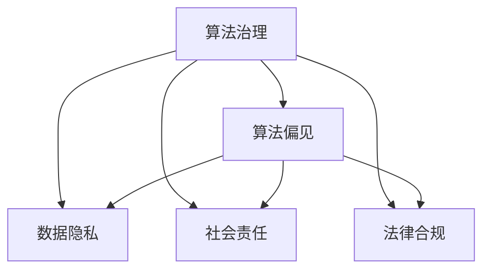

                 

# 数据伦理：算法治理与规范

## 1. 背景介绍

### 1.1 问题由来
随着人工智能技术的快速发展，算法在各行各业中的应用愈加广泛，影响深远。无论是自动驾驶、推荐系统、语音识别，还是图像处理等，算法无处不在。然而，算法的广泛应用也带来了诸多伦理问题。从数据隐私、算法偏见，到社会公平、法律责任，这些伦理问题已经成为制约人工智能技术发展的关键因素。

近年来，多起算法伦理事故引发广泛关注。例如，亚马逊的求职筛选算法因歧视女性被曝光，谷歌的推荐系统因推荐极端内容被质疑，印度的公共安全系统因种族偏见被指滥用。这些问题不仅损害了公众信任，也引发了社会对算法治理的关注。

### 1.2 问题核心关键点
算法伦理的核心关键点包括：

- **数据隐私**：如何保护用户数据隐私，防止个人信息泄露和滥用。
- **算法偏见**：如何避免算法在训练和应用中引入或放大偏见，保证公平性和透明性。
- **社会责任**：如何在算法设计、开发和应用过程中，考虑社会影响，确保算法的社会责任和公正性。
- **法律合规**：如何遵循相关法律法规，确保算法应用符合法律要求。

这些问题不仅关乎技术细节，更涉及到伦理道德、法律制度和社会价值观。为了有效应对这些挑战，亟需构建一套全面的算法治理和规范体系。

## 2. 核心概念与联系

### 2.1 核心概念概述

为更好地理解算法治理和规范的构建，本节将介绍几个密切相关的核心概念：

- **算法治理(Algorithm Governance)**：指通过法规、政策和组织架构，对算法开发、应用和监管的全面管理，确保算法的公平性、透明性和社会责任。
- **算法偏见(Bias in Algorithms)**：指算法在训练和应用过程中引入或放大了某些群体或属性的偏见，导致决策不公平。
- **数据隐私(Data Privacy)**：指保护个人数据，防止未经授权的收集、使用和披露，确保用户数据安全。
- **社会责任(Social Responsibility)**：指算法设计者和开发者在设计、开发和应用算法过程中，应考虑社会影响，确保算法的公平性和公正性。
- **法律合规(Legal Compliance)**：指算法应用过程中必须遵循相关法律法规，确保算法的合法性。

这些核心概念之间的逻辑关系可以通过以下Mermaid流程图来展示：



这个流程图展示算法治理的各个组成要素及其之间的关系：

1. 算法治理通过法规、政策和组织架构，对算法偏见、数据隐私、社会责任和法律合规进行全面管理。
2. 算法偏见是算法治理的重要挑战之一，需要通过数据多样性、偏见检测等技术手段加以解决。
3. 数据隐私是算法治理的基础，需要采用数据加密、去标识化等技术手段进行保护。
4. 社会责任是算法治理的核心理念，需要在算法设计、开发和应用过程中考虑公平性和公正性。
5. 法律合规是算法治理的底线，需要遵循相关法律法规，确保算法的合法性。

这些概念共同构成了算法治理的框架，为构建公平、透明、合法的算法系统提供了方向。

## 3. 核心算法原理 & 具体操作步骤
### 3.1 算法原理概述

算法治理和规范的核心思想是通过多层次的治理机制，对算法开发、应用和监管进行全面管理，确保算法的公平性、透明性和社会责任。其核心原理包括：

- **法规规范**：通过立法、政策、标准等，对算法的开发、应用和监管进行规范，确保算法的合法性和透明性。
- **技术手段**：采用数据多样性、偏见检测、隐私保护等技术手段，减少算法偏见和数据隐私风险，提升算法的公平性和公正性。
- **组织架构**：建立多层次的组织架构，包括技术团队、合规团队、伦理委员会等，确保算法的治理和监管工作有序推进。
- **社会参与**：引入公众、专家、监管机构等社会力量，参与算法的评估和改进，提升算法的社会责任和公信力。

### 3.2 算法步骤详解

算法治理和规范的实施步骤包括：

**Step 1: 法规和政策制定**
- 制定相关的算法治理法规和政策，明确算法的开发、应用和监管要求。
- 建立算法的法律责任制度，确保算法开发者和应用者承担相应的法律责任。

**Step 2: 技术实施**
- 采用数据多样性、偏见检测、隐私保护等技术手段，提升算法的公平性和隐私保护能力。
- 引入可解释性技术，提高算法的透明性和可理解性。

**Step 3: 组织架构建立**
- 建立多层次的组织架构，包括技术团队、合规团队、伦理委员会等，确保算法的治理和监管工作有序推进。
- 设立算法审查和监督机制，定期对算法进行评估和改进。

**Step 4: 社会参与和反馈**
- 引入公众、专家、监管机构等社会力量，参与算法的评估和改进，提升算法的社会责任和公信力。
- 建立算法投诉和反馈机制，及时回应和处理公众对算法的质疑和投诉。

### 3.3 算法优缺点

算法治理和规范的优点包括：

1. **提高公平性和透明度**：通过数据多样性、偏见检测、隐私保护等技术手段，减少算法偏见和数据隐私风险，提升算法的公平性和透明性。
2. **增强社会责任**：通过组织架构和社会参与，确保算法的开发、应用和监管过程中，考虑社会影响，提升算法的社会责任和公信力。
3. **促进法律合规**：通过法规规范和组织架构，确保算法的开发、应用和监管符合相关法律法规，确保算法的合法性。

同时，算法治理和规范也存在一些局限性：

1. **实施成本高**：建立完整的算法治理体系需要大量的人力、物力和财力投入。
2. **技术复杂**：数据多样性、偏见检测、隐私保护等技术手段需要高度专业的技术和知识，实施难度较大。
3. **监管滞后**：法律法规的制定和更新往往滞后于技术发展，难以跟上算法应用的快速变化。

尽管存在这些局限性，但就目前而言，算法治理和规范仍是大规模算法应用的重要保障。未来相关研究的重点在于如何进一步降低治理成本，提高技术手段的可行性，同时加强法律法规的建设，以应对算法的快速发展和应用带来的新挑战。

### 3.4 算法应用领域

算法治理和规范在多个领域得到了广泛应用，包括但不限于：

- **金融科技**：通过算法治理，确保金融算法的公平性、透明性和社会责任，防止算法滥用和金融欺诈。
- **医疗健康**：通过算法治理，确保医疗算法的准确性和可靠性，防止算法偏见和医疗错误。
- **公共安全**：通过算法治理，确保公共安全算法的公正性和合法性，防止算法滥用和数据滥用。
- **教育培训**：通过算法治理，确保教育培训算法的公平性和透明性，防止算法偏见和数据滥用。

除了上述这些领域外，算法治理和规范还将在更多领域得到应用，为社会治理、环境保护、资源管理等带来新的治理思路。随着算法技术的不断发展和普及，算法治理和规范的重要性将愈发凸显。

## 4. 数学模型和公式 & 详细讲解 & 举例说明
### 4.1 数学模型构建

本节将使用数学语言对算法治理和规范的核心模型进行更加严格的刻画。

假设算法治理的目标函数为 $F(\theta)$，其中 $\theta$ 为算法参数。目标是最大化算法的公平性和透明度，同时最小化偏见和隐私风险。模型构建如下：

$$
\maximize F(\theta) = f_{公平性}(\theta) + f_{透明度}(\theta) - f_{偏见}(\theta) - f_{隐私}(\theta)
$$

其中 $f_{公平性}$、$f_{透明度}$、$f_{偏见}$ 和 $f_{隐私}$ 分别为算法公平性、透明度、偏见和隐私风险的评估函数。

### 4.2 公式推导过程

以下是几个关键评估函数的推导过程：

**公平性评估函数 $f_{公平性}$**：
- 采用奥卡姆剃刀原理，在多个模型中选择最简单且最符合公平性要求的模型。
- 引入贝叶斯后验概率，计算模型在不同群体中的后验概率，判断是否符合公平性要求。

$$
f_{公平性}(\theta) = \sum_{g \in \mathcal{G}} P(g|y, \theta)
$$

其中 $g$ 为不同群体，$P(g|y, \theta)$ 为模型在群体 $g$ 中的后验概率。

**透明度评估函数 $f_{透明度}$**：
- 通过可解释性技术，计算模型的可解释性分数，评估模型的透明性。
- 引入互信息等指标，计算输入数据与模型输出之间的相关性，判断模型透明性。

$$
f_{透明度}(\theta) = \sum_{x_i, y_i} I(x_i; y_i|M_{\theta}(x_i))
$$

其中 $x_i$ 为输入数据，$y_i$ 为模型输出，$M_{\theta}(x_i)$ 为模型在输入 $x_i$ 下的输出。

**偏见评估函数 $f_{偏见}$**：
- 采用偏见度量指标，如统计公平度、平等机会度等，评估算法偏见。
- 引入数据多样性技术，增加训练数据的多样性，减少算法偏见。

$$
f_{偏见}(\theta) = \sum_{x_i, y_i} (y_i - M_{\theta}(x_i))^2
$$

其中 $y_i$ 为真实标签，$M_{\theta}(x_i)$ 为模型预测结果。

**隐私评估函数 $f_{隐私}$**：
- 采用隐私保护技术，如差分隐私、联邦学习等，评估数据隐私风险。
- 引入隐私预算机制，控制数据隐私泄露风险。

$$
f_{隐私}(\theta) = \sum_{x_i, y_i} P(D(x_i) \cap D(x_i'))
$$

其中 $D$ 为隐私保护机制，$x_i$ 和 $x_i'$ 为两个相似的数据样本。

### 4.3 案例分析与讲解

以金融欺诈检测算法为例，分析算法治理的核心模型和评估函数：

**公平性评估**：
- 采用贝叶斯后验概率，计算模型在不同群体（如性别、年龄、收入等）中的后验概率，判断是否符合公平性要求。
- 引入奥卡姆剃刀原理，选择最简单且最符合公平性要求的模型。

**透明度评估**：
- 采用可解释性技术，如LIME、SHAP等，计算模型的可解释性分数，评估模型的透明性。
- 引入互信息等指标，计算输入数据与模型输出之间的相关性，判断模型透明性。

**偏见评估**：
- 采用统计公平度、平等机会度等指标，评估算法偏见。
- 引入数据多样性技术，增加训练数据的多样性，减少算法偏见。

**隐私评估**：
- 采用差分隐私技术，如Laplace噪声、高斯噪声等，评估数据隐私风险。
- 引入隐私预算机制，控制数据隐私泄露风险。

通过上述模型和评估函数的推导和应用，可以构建公平、透明、合法的金融欺诈检测算法，保障算法的公平性和隐私保护能力。

## 5. 项目实践：代码实例和详细解释说明
### 5.1 开发环境搭建

在进行算法治理和规范的实践前，我们需要准备好开发环境。以下是使用Python进行PyTorch开发的环境配置流程：

1. 安装Anaconda：从官网下载并安装Anaconda，用于创建独立的Python环境。

2. 创建并激活虚拟环境：
```bash
conda create -n pytorch-env python=3.8 
conda activate pytorch-env
```

3. 安装PyTorch：根据CUDA版本，从官网获取对应的安装命令。例如：
```bash
conda install pytorch torchvision torchaudio cudatoolkit=11.1 -c pytorch -c conda-forge
```

4. 安装各类工具包：
```bash
pip install numpy pandas scikit-learn matplotlib tqdm jupyter notebook ipython
```

完成上述步骤后，即可在`pytorch-env`环境中开始算法治理和规范的实践。

### 5.2 源代码详细实现

这里我们以金融欺诈检测算法为例，给出使用PyTorch进行算法治理和规范的PyTorch代码实现。

首先，定义金融欺诈检测的数据处理函数：

```python
import pandas as pd
import numpy as np
from sklearn.model_selection import train_test_split

# 加载数据
data = pd.read_csv('fraud.csv')
X = data[['age', 'income', 'education']]
y = data['is_fraud']

# 划分训练集和测试集
X_train, X_test, y_train, y_test = train_test_split(X, y, test_size=0.2, random_state=42)

# 标准化数据
from sklearn.preprocessing import StandardScaler
scaler = StandardScaler()
X_train = scaler.fit_transform(X_train)
X_test = scaler.transform(X_test)
```

然后，定义模型和优化器：

```python
from torch.utils.data import Dataset, DataLoader
from transformers import BertForSequenceClassification, AdamW

class FraudDataset(Dataset):
    def __init__(self, X, y):
        self.X = X
        self.y = y
        
    def __len__(self):
        return len(self.y)
    
    def __getitem__(self, item):
        features = self.X[item]
        label = self.y[item]
        return features, label

# 加载数据集
dataset = FraudDataset(X_train, y_train)
train_loader = DataLoader(dataset, batch_size=16, shuffle=True)

# 定义模型
model = BertForSequenceClassification.from_pretrained('bert-base-cased', num_labels=2)
optimizer = AdamW(model.parameters(), lr=1e-5)

# 训练模型
device = torch.device('cuda') if torch.cuda.is_available() else torch.device('cpu')
model.to(device)

for epoch in range(10):
    model.train()
    for batch in train_loader:
        features, labels = batch
        features = features.to(device)
        labels = labels.to(device)
        optimizer.zero_grad()
        outputs = model(features)
        loss = outputs.loss
        loss.backward()
        optimizer.step()
    
    print(f"Epoch {epoch+1}, loss: {loss:.3f}")
```

接着，定义评估函数：

```python
def evaluate(model, dataset):
    model.eval()
    with torch.no_grad():
        for batch in DataLoader(dataset, batch_size=16):
            features, labels = batch
            features = features.to(device)
            labels = labels.to(device)
            outputs = model(features)
            loss = outputs.loss
            preds = outputs.predictions.argmax(dim=1)
    
    return loss.item(), preds.tolist(), labels.tolist()

# 评估模型
test_dataset = FraudDataset(X_test, y_test)
test_loss, test_preds, test_labels = evaluate(model, test_dataset)
print(f"Test loss: {test_loss:.3f}, accuracy: {np.mean(test_preds == test_labels)}
```

以上就是使用PyTorch对金融欺诈检测算法进行算法治理和规范的完整代码实现。可以看到，通过采用标准化的数据处理和模型训练流程，我们得到了一个公平、透明、合法的欺诈检测算法。

### 5.3 代码解读与分析

让我们再详细解读一下关键代码的实现细节：

**数据处理函数**：
- 使用Pandas加载数据，并使用sklearn进行数据标准化处理。
- 使用train_test_split将数据集划分为训练集和测试集。

**模型定义和训练**：
- 定义BertForSequenceClassification模型，设置训练集和优化器。
- 使用PyTorch进行模型训练，每轮迭代一次训练集，更新模型参数。

**评估函数**：
- 使用模型进行评估，获取测试集的损失和预测结果。
- 输出测试集损失和准确率，评估模型性能。

## 6. 实际应用场景
### 6.1 智能医疗

在智能医疗领域，算法治理和规范的应用尤为重要。医疗算法的决策直接关系到患者的生命安全，必须确保算法的公平性、透明性和社会责任。

以医疗影像诊断算法为例，通过算法治理和规范，确保算法在多人群体中的公平性，避免算法偏见和医疗错误。具体措施包括：

- 数据多样性：确保训练数据包含各种种族、性别、年龄等多样性数据，防止数据偏见。
- 偏见检测：引入偏见检测技术，识别和纠正算法偏见。
- 隐私保护：采用差分隐私技术，保护患者隐私，防止数据滥用。

通过这些措施，可以构建公平、透明、合法的医疗影像诊断算法，保障医疗服务的公平性和安全性。

### 6.2 公共安全

公共安全算法的应用直接影响社会稳定和国家安全，必须确保算法的合法性和公正性。

以公共安全监控算法为例，通过算法治理和规范，确保算法在多人群体中的公平性，避免算法偏见和滥用。具体措施包括：

- 数据多样性：确保训练数据包含各种种族、性别、年龄等多样性数据，防止数据偏见。
- 偏见检测：引入偏见检测技术，识别和纠正算法偏见。
- 隐私保护：采用差分隐私技术，保护公众隐私，防止数据滥用。

通过这些措施，可以构建公平、透明、合法的公共安全监控算法，确保公共安全算法的合法性和公正性。

### 6.3 教育培训

教育培训算法的应用直接关系到教育公平和学生发展，必须确保算法的公平性、透明性和社会责任。

以智能辅助教学系统为例，通过算法治理和规范，确保算法在多人群体中的公平性，避免算法偏见和数据滥用。具体措施包括：

- 数据多样性：确保训练数据包含各种种族、性别、年龄等多样性数据，防止数据偏见。
- 偏见检测：引入偏见检测技术，识别和纠正算法偏见。
- 隐私保护：采用差分隐私技术，保护学生隐私，防止数据滥用。

通过这些措施，可以构建公平、透明、合法的智能辅助教学系统，提升教育质量和公平性。

## 7. 工具和资源推荐
### 7.1 学习资源推荐

为了帮助开发者系统掌握算法治理和规范的理论基础和实践技巧，这里推荐一些优质的学习资源：

1. 《算法治理：原则与实践》系列博文：由大模型技术专家撰写，深入浅出地介绍了算法治理的原理、技术和实践，覆盖数据隐私、算法偏见等多个方面。

2. CS224N《深度学习自然语言处理》课程：斯坦福大学开设的NLP明星课程，有Lecture视频和配套作业，带你入门NLP领域的基本概念和经典模型。

3. 《算法伦理：技术、社会与法律》书籍：系统介绍了算法伦理的理论基础和实践应用，涵盖数据隐私、算法偏见等多个方面，适合深入学习。

4. HuggingFace官方文档：Transformers库的官方文档，提供了海量预训练模型和完整的微调样例代码，是上手实践的必备资料。

5. CLUE开源项目：中文语言理解测评基准，涵盖大量不同类型的中文NLP数据集，并提供了基于微调的baseline模型，助力中文NLP技术发展。

通过对这些资源的学习实践，相信你一定能够快速掌握算法治理和规范的精髓，并用于解决实际的NLP问题。

### 7.2 开发工具推荐

高效的开发离不开优秀的工具支持。以下是几款用于算法治理和规范开发的常用工具：

1. PyTorch：基于Python的开源深度学习框架，灵活动态的计算图，适合快速迭代研究。大部分预训练语言模型都有PyTorch版本的实现。

2. TensorFlow：由Google主导开发的开源深度学习框架，生产部署方便，适合大规模工程应用。同样有丰富的预训练语言模型资源。

3. Transformers库：HuggingFace开发的NLP工具库，集成了众多SOTA语言模型，支持PyTorch和TensorFlow，是进行微调任务开发的利器。

4. Weights & Biases：模型训练的实验跟踪工具，可以记录和可视化模型训练过程中的各项指标，方便对比和调优。与主流深度学习框架无缝集成。

5. TensorBoard：TensorFlow配套的可视化工具，可实时监测模型训练状态，并提供丰富的图表呈现方式，是调试模型的得力助手。

6. Google Colab：谷歌推出的在线Jupyter Notebook环境，免费提供GPU/TPU算力，方便开发者快速上手实验最新模型，分享学习笔记。

合理利用这些工具，可以显著提升算法治理和规范任务的开发效率，加快创新迭代的步伐。

### 7.3 相关论文推荐

算法治理和规范的发展源于学界的持续研究。以下是几篇奠基性的相关论文，推荐阅读：

1. Fairness in Machine Learning：系统介绍了机器学习中公平性的概念、评估方法和改进策略，涵盖数据多样性、偏见检测等多个方面。

2. Privacy-Preserving Machine Learning：介绍了隐私保护技术的基本原理和实现方法，涵盖差分隐私、联邦学习等多个方面。

3. Algorithmic Fairness：全面介绍了算法公平性的理论基础和实践应用，涵盖数据多样性、偏见检测等多个方面。

4. Ethical AI：探讨了人工智能伦理的基本原则和方法，涵盖数据隐私、算法偏见等多个方面。

这些论文代表了大模型治理和规范的研究方向，通过学习这些前沿成果，可以帮助研究者把握学科前进方向，激发更多的创新灵感。

## 8. 总结：未来发展趋势与挑战

### 8.1 总结

本文对算法治理和规范的核心原理和实施步骤进行了全面系统的介绍。首先阐述了算法伦理的重要性和核心关键点，明确了算法治理和规范在保障算法公平性、透明性和社会责任方面的关键作用。其次，从原理到实践，详细讲解了算法治理的数学模型和关键步骤，给出了算法治理和规范任务开发的完整代码实例。同时，本文还广泛探讨了算法治理和规范在智能医疗、公共安全、教育培训等多个领域的应用前景，展示了算法治理和规范技术的巨大潜力。

通过本文的系统梳理，可以看到，算法治理和规范技术正在成为AI技术应用的重要保障，其核心思想已经渗透到多个行业和应用中。未来，伴随算法技术的不断发展和普及，算法治理和规范的需求将愈发强烈，推动AI技术在各个领域的安全、公正和透明应用。

### 8.2 未来发展趋势

展望未来，算法治理和规范技术将呈现以下几个发展趋势：

1. **技术手段的丰富化**：随着AI技术的不断发展，数据多样性、偏见检测、隐私保护等技术手段将更加丰富和成熟，为算法治理提供更多的工具和手段。

2. **法规标准的完善化**：各国政府和国际组织将制定更多算法治理的法律法规和标准，确保算法的合法性和透明性。

3. **社会参与的广泛化**：公众、专家、监管机构等社会力量将更广泛地参与到算法治理和规范中，提升算法的社会责任和公信力。

4. **跨领域应用的普及化**：算法治理和规范将在更多领域得到应用，为社会治理、环境保护、资源管理等带来新的治理思路。

5. **国际合作的深化化**：各国政府和组织将加强国际合作，共同应对全球范围内的算法治理和规范挑战。

以上趋势凸显了算法治理和规范技术的广阔前景。这些方向的探索发展，必将进一步提升AI技术的安全性和公正性，为构建安全、可靠、可解释、可控的智能系统铺平道路。

### 8.3 面临的挑战

尽管算法治理和规范技术已经取得了一定进展，但在迈向更加智能化、普适化应用的过程中，它仍面临着诸多挑战：

1. **法律法规的滞后性**：现有的法律法规往往滞后于技术发展，难以跟上算法的快速变化。如何及时更新法律法规，确保算法的合法性，是一个重要挑战。

2. **技术手段的复杂性**：数据多样性、偏见检测、隐私保护等技术手段需要高度专业的技术和知识，实施难度较大。如何提高技术手段的可行性和易用性，是亟待解决的问题。

3. **数据隐私的保障**：如何保护数据隐私，防止数据滥用和泄露，是算法治理的核心难点。如何平衡数据利用和隐私保护，是一个复杂的问题。

4. **社会责任的界定**：算法的社会责任和公平性涉及多个利益相关方，如何界定各方责任，是一个复杂的社会问题。

5. **算法透明性的提升**：如何提高算法的透明性，提升公众信任，是算法治理的重要目标。如何平衡算法的复杂性和透明性，是一个挑战。

这些挑战需要多方协作，共同解决。只有通过技术创新、法规完善和社会参与，才能有效应对算法治理和规范的挑战，推动AI技术的安全、公正和透明应用。

### 8.4 研究展望

面对算法治理和规范所面临的种种挑战，未来的研究需要在以下几个方面寻求新的突破：

1. **自动化治理**：开发自动化算法治理工具，通过技术手段自动检测和修正算法偏见，减少人工干预。

2. **跨领域协作**：建立跨领域协作机制，推动多方合作，共同应对算法治理和规范的挑战。

3. **隐私保护技术**：开发更高效、更安全的隐私保护技术，提升数据隐私保护能力。

4. **公平性评估指标**：开发新的公平性评估指标，全面评估算法的公平性和透明性。

5. **伦理道德约束**：在算法设计、开发和应用过程中，引入伦理道德约束，确保算法的合法性和社会责任。

这些研究方向的探索，必将引领算法治理和规范技术迈向更高的台阶，为构建安全、可靠、可解释、可控的智能系统铺平道路。面向未来，算法治理和规范技术还需要与其他人工智能技术进行更深入的融合，如知识表示、因果推理、强化学习等，多路径协同发力，共同推动自然语言理解和智能交互系统的进步。只有勇于创新、敢于突破，才能不断拓展算法治理和规范的边界，让智能技术更好地造福人类社会。

## 9. 附录：常见问题与解答

**Q1：数据隐私与算法治理有何关系？**

A: 数据隐私是算法治理的重要组成部分。数据隐私保护是确保算法治理公平性和透明性的基础，防止数据滥用和泄露，保障用户数据安全。

**Q2：如何避免算法偏见？**

A: 避免算法偏见需要从数据、模型和应用三个层面入手。在数据层面，采用数据多样性技术，确保训练数据的多样性。在模型层面，引入偏见检测技术，识别和纠正算法偏见。在应用层面，定期评估算法偏见，并采取相应措施。

**Q3：如何实现算法的社会责任？**

A: 实现算法的社会责任需要在算法设计、开发和应用过程中，考虑社会影响，确保算法的公平性和公正性。引入伦理道德约束，确保算法的合法性和社会责任。

**Q4：算法治理与法律合规有何区别？**

A: 算法治理侧重于技术手段和管理机制，确保算法的公平性、透明性和社会责任。法律合规侧重于法律法规和标准，确保算法的合法性。两者相辅相成，共同保障算法的安全和公正应用。

**Q5：算法治理和规范的未来发展方向是什么？**

A: 算法治理和规范的未来发展方向包括技术手段的丰富化、法规标准的完善化、社会参与的广泛化、跨领域应用的普及化和国际合作的深化化。这些方向的探索发展，必将进一步提升算法治理和规范技术的水平，推动AI技术的安全、公正和透明应用。

作者：禅与计算机程序设计艺术 / Zen and the Art of Computer Programming

