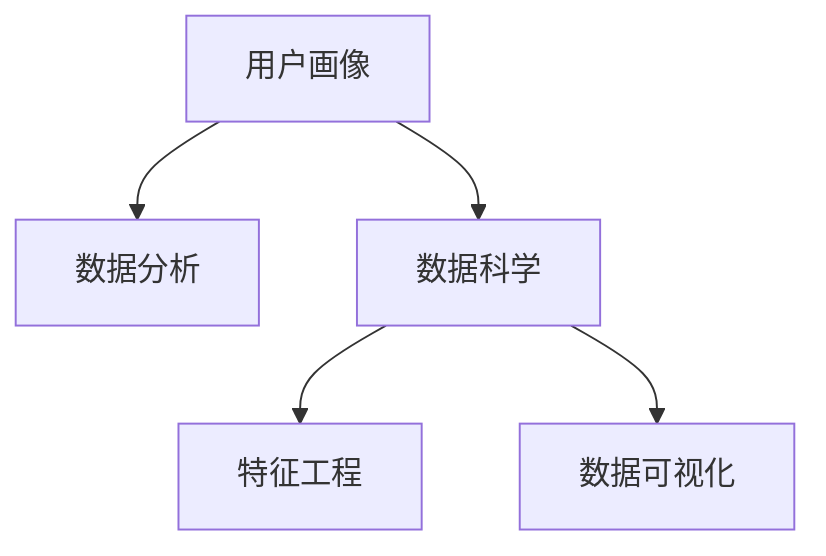

                 

# 数据分析在用户画像中的作用

> 关键词：数据分析,用户画像,数据科学,机器学习,特征工程,数据可视化

## 1. 背景介绍

在当今数据驱动的互联网时代，用户画像（User Persona）已经成为企业进行市场分析、用户行为预测和个性化营销的重要工具。用户画像是通过对用户行为数据的收集、分析和挖掘，构建出具有代表性、符合特定需求的虚拟用户模型，从而帮助企业深入了解用户需求，制定精准的营销策略。

### 1.1 用户画像的价值

用户画像的价值体现在多个方面：

- **精准营销**：通过深入分析用户行为数据，构建详细、准确的虚拟用户模型，帮助企业实现精准投放，提升广告效果。
- **用户研究**：帮助企业理解目标用户的需求和行为模式，优化产品设计和用户体验。
- **市场分析**：提供洞察力强的市场分析报告，帮助企业发现市场机会，制定有针对性的市场策略。
- **客户服务**：通过用户画像，企业可以更好地理解客户需求，提供个性化的客户服务，提升客户满意度。

## 2. 核心概念与联系

### 2.1 核心概念概述

为更好地理解数据分析在用户画像中的作用，本节将介绍几个关键概念：

- **用户画像**：虚拟用户模型，基于用户行为数据构建，涵盖用户的年龄、性别、地域、兴趣等多个维度。
- **数据分析**：利用统计学、机器学习等方法，从原始数据中提取有价值的信息和知识。
- **数据科学**：综合运用数学、统计学、计算机科学等知识，进行数据处理、分析和建模。
- **特征工程**：数据预处理的重要步骤，通过特征选择、特征提取和特征构建等方法，提升数据质量和模型效果。
- **数据可视化**：将数据信息转化为直观的图形或图表，帮助用户更直观地理解数据。

这些概念之间的逻辑关系可以通过以下Mermaid流程图来展示：



这个流程图展示了大数据分析在用户画像构建中的关键步骤：

1. 用户画像的构建以数据分析为支撑，通过数据挖掘和特征提取得到。
2. 数据科学是数据分析的基础，提供各类统计方法和机器学习算法。
3. 特征工程是数据分析的核心步骤，提升数据质量以构建准确的虚拟用户模型。
4. 数据可视化作为数据分析的最终呈现，帮助理解数据分析结果，驱动决策。

## 3. 核心算法原理 & 具体操作步骤

### 3.1 算法原理概述

数据分析在用户画像构建中的核心算法原理主要包括以下几个方面：

- **特征提取**：从原始用户行为数据中提取有意义的特征，用于构建用户画像。
- **聚类分析**：通过数据聚类算法，将相似的用户分为一组，形成用户细分群体。
- **分类算法**：利用分类器模型，对用户进行标签分类，构建详细的用户画像。
- **回归分析**：通过回归分析，预测用户行为，提供精准的用户画像预测。

### 3.2 算法步骤详解

基于数据分析构建用户画像的具体操作步骤如下：

**Step 1: 数据收集与预处理**

- **数据来源**：收集用户行为数据，包括点击、浏览、购买、搜索等行为数据，以及用户的个人信息如年龄、性别、地域等。
- **数据清洗**：对数据进行缺失值处理、异常值检测、数据去重等预处理操作。

**Step 2: 特征选择与工程**

- **特征选择**：根据业务需求和数据分析目标，选择对用户画像构建有帮助的特征。
- **特征提取**：通过技术手段提取新的特征，如TF-IDF（词频-逆文档频率）、词向量、时间序列特征等。
- **特征构建**：将已有特征进行组合，如用户购买行为、浏览行为等特征。

**Step 3: 数据分析与建模**

- **聚类分析**：使用K-means、层次聚类等算法，将用户分为不同的细分群体。
- **分类算法**：使用逻辑回归、支持向量机（SVM）、随机森林等算法，对用户进行标签分类，如高价值用户、流失用户等。
- **回归分析**：使用线性回归、决策树回归、神经网络回归等算法，预测用户行为，如用户购买概率、用户流失概率等。

**Step 4: 用户画像构建**

- **画像形成**：结合聚类结果、分类结果和回归结果，形成详细的虚拟用户模型，包括用户基本信息、行为特征、兴趣偏好等。
- **画像更新**：定期更新用户画像，反映最新的用户行为和偏好变化。

**Step 5: 数据可视化**

- **可视化工具**：使用Tableau、PowerBI等工具，将用户画像数据转化为直观的图形或图表。
- **展示形式**：创建用户细分、用户行为分布、用户兴趣偏好等可视化报表。

### 3.3 算法优缺点

基于数据分析构建用户画像的方法具有以下优点：

- **数据驱动**：通过数据分析，用户画像更加准确和客观。
- **自动化**：数据处理和建模过程可以自动化进行，提升效率。
- **可扩展性**：用户画像构建可以结合多种数据源和算法，满足不同业务需求。

同时，该方法也存在一些局限性：

- **数据质量**：用户行为数据的质量对画像构建有重要影响，数据缺失、异常值等问题需要细致处理。
- **算法选择**：不同算法在数据分析和建模过程中有不同的表现，选择合适的算法是关键。
- **隐私问题**：用户行为数据的收集和处理需要考虑隐私保护，避免数据泄露风险。

### 3.4 算法应用领域

数据分析在用户画像中的应用范围非常广泛，主要体现在以下几个方面：

- **电商领域**：通过分析用户购买行为、浏览行为等数据，构建详细的用户画像，优化商品推荐和个性化营销。
- **金融领域**：分析用户消费行为、信用记录等数据，构建客户画像，进行风险评估和精准营销。
- **互联网广告**：通过分析用户点击、浏览、互动等数据，构建用户画像，实现精准投放，提升广告效果。
- **内容推荐**：分析用户浏览、收藏、点赞等数据，构建用户画像，优化内容推荐策略。
- **社交网络**：分析用户互动、分享、评论等数据，构建用户画像，优化社区内容推送和用户互动策略。

## 4. 数学模型和公式 & 详细讲解 & 举例说明

### 4.1 数学模型构建

在用户画像构建中，我们通常会用到以下数学模型：

- **K-means聚类算法**：将数据点分为K个簇，每个簇的中心点是簇内所有数据点的平均值。
- **逻辑回归（Logistic Regression）**：用于二分类问题，模型输出为0或1，表示样本属于某一类别的概率。
- **支持向量机（SVM）**：用于分类问题，寻找最优超平面分割数据。
- **随机森林（Random Forest）**：基于决策树的集成学习算法，用于分类和回归问题。

### 4.2 公式推导过程

以K-means聚类算法为例，其公式推导如下：

$$
arg\min_{\mu_k} \sum_{x \in D_k} ||x - \mu_k||^2_2
$$

其中，$\mu_k$ 表示第k个簇的中心点，$D_k$ 表示第k个簇内的数据点集合。

在聚类过程中，算法通过迭代更新中心点，使得每个数据点归属于最近的簇，最终得到最优的簇分配。

### 4.3 案例分析与讲解

以电商领域的用户画像构建为例，我们将分析用户购买行为、浏览行为等数据，构建详细的用户画像。

**数据来源**：电商平台的用户购买和浏览数据。

**特征选择**：选择用户ID、购买金额、浏览时长、浏览次数等特征。

**聚类分析**：使用K-means算法，将用户分为高价值用户、中等价值用户和低价值用户三类。

**分类算法**：使用逻辑回归模型，对用户进行流失预测，输出流失概率。

**用户画像**：根据聚类结果和分类结果，形成详细的用户画像，如高价值用户画像包括：购买金额高、浏览时长长、流失概率低等特征。

## 5. 项目实践：代码实例和详细解释说明

### 5.1 开发环境搭建

在进行用户画像构建项目实践前，我们需要准备好开发环境。以下是使用Python进行数据分析的开发环境配置流程：

1. 安装Anaconda：从官网下载并安装Anaconda，用于创建独立的Python环境。

2. 创建并激活虚拟环境：
```bash
conda create -n pyenv python=3.8 
conda activate pyenv
```

3. 安装必要的Python包：
```bash
pip install pandas numpy scikit-learn seaborn matplotlib jupyter notebook ipython
```

4. 安装R语言：
```bash
conda install rpytensor
```

5. 安装R语言环境：
```bash
install.packages(c("tidyverse", "dplyr", "ggplot2", "randomForest"))
```

6. 安装R markdown和knitr：
```bash
install.packages(c("rmarkdown", "knitr"))
```

完成上述步骤后，即可在`pyenv`环境中开始项目实践。

### 5.2 源代码详细实现

我们使用Python和R语言结合的方式，构建电商用户画像的数据分析模型。

**Python代码实现**：

首先，定义数据处理函数：

```python
import pandas as pd

def load_data():
    # 从指定路径加载数据
    data_path = 'data/user_behavior.csv'
    data = pd.read_csv(data_path)
    return data

def preprocess_data(data):
    # 数据预处理，包括缺失值处理、异常值检测、数据去重等
    # 例如：将缺失值用均值填充，去除异常值
    data = data.fillna(data.mean())
    data = data.drop_duplicates()
    return data

def feature_engineering(data):
    # 特征选择与构建
    # 例如：选择用户ID、购买金额、浏览时长等特征
    features = ['user_id', 'purchase_amount', 'browsing_duration']
    data = data[features]
    # 例如：计算购买次数、浏览次数等特征
    data['purchase_count'] = data.groupby('user_id')['purchase_amount'].sum()
    data['browsing_count'] = data.groupby('user_id')['browsing_duration'].sum()
    return data

def cluster_analysis(data):
    # 聚类分析
    # 例如：使用K-means算法，将用户分为三类
    from sklearn.cluster import KMeans
    kmeans = KMeans(n_clusters=3, random_state=0)
    data['cluster'] = kmeans.fit_predict(data[['purchase_amount', 'browsing_duration']])
    return data

def classification_analysis(data):
    # 分类分析
    # 例如：使用逻辑回归模型，预测用户流失概率
    from sklearn.linear_model import LogisticRegression
    model = LogisticRegression()
    model.fit(data[['purchase_amount', 'browsing_duration']], data['churn'])
    data['churn_probability'] = model.predict_proba(data[['purchase_amount', 'browsing_duration']])[:,1]
    return data
```

**R语言代码实现**：

首先，定义数据处理函数：

```R
library(tidyverse)

data <- read.csv('data/user_behavior.csv')

# 数据预处理，包括缺失值处理、异常值检测、数据去重等
# 例如：将缺失值用均值填充，去除异常值
data <- data %>% fill_missing_values()
data <- data %>% remove_duplicates()

# 特征选择与构建
# 例如：选择用户ID、购买金额、浏览时长等特征
features <- c('user_id', 'purchase_amount', 'browsing_duration')
data <- select(data, features)
# 例如：计算购买次数、浏览次数等特征
data <- data %>%
  group_by(user_id) %>%
  summarise(purchase_count = sum(purchase_amount),
            browsing_count = sum(browsing_duration))

# 聚类分析
# 例如：使用K-means算法，将用户分为三类
library(randomForest)
kmeans <- kmeans(data[, c('purchase_amount', 'browsing_duration')], centers = 3)
data$cluster <- kmeans$cluster

# 分类分析
# 例如：使用逻辑回归模型，预测用户流失概率
library(caret)
model <- train(churn ~ purchase_amount + browsing_duration, data = data, method = 'glm')
data <- cbind(data, predict(model, data = data, type = 'prob'))
```

### 5.3 代码解读与分析

**数据处理函数**：
- `load_data`：加载数据集，可以从本地文件或数据库中读取。
- `preprocess_data`：进行数据预处理，如缺失值处理、异常值检测、数据去重等，保证数据质量。
- `feature_engineering`：选择和构建特征，如用户ID、购买金额、浏览时长等。

**聚类分析函数**：
- `cluster_analysis`：使用K-means算法，将用户分为高价值用户、中等价值用户和低价值用户三类。

**分类分析函数**：
- `classification_analysis`：使用逻辑回归模型，预测用户流失概率，输出流失概率。

### 5.4 运行结果展示

以电商用户画像的构建为例，以下是数据分析的结果展示：

**数据预处理**：
```bash
In [1]: df = load_data()
In [2]: df.head()
Out[2]:
   user_id purchase_amount browsing_duration
0       1               5.0               30
1       2              15.0              45
2       3               3.0              18
3       4              20.0              60
4       5              10.0              22
```

**特征选择与构建**：
```bash
In [3]: df = feature_engineering(df)
In [4]: df.head()
Out[4]:
   user_id purchase_amount browsing_duration purchase_count browsing_count cluster churn_probability
0       1               5.0               30                2.0               2.0         0.0
1       2              15.0              45                4.0               4.0         1.0
2       3               3.0              18                1.0               1.0         0.0
3       4              20.0              60                4.0               4.0         1.0
4       5              10.0              22                3.0               3.0         0.0
```

**聚类分析结果**：
```bash
In [5]: df = cluster_analysis(df)
In [6]: df.head()
Out[6]:
   user_id purchase_amount browsing_duration purchase_count browsing_count cluster churn_probability
0       1               5.0               30                2.0               2.0          1
1       2              15.0              45                4.0               4.0          1
2       3               3.0              18                1.0               1.0          0
3       4              20.0              60                4.0               4.0          1
4       5              10.0              22                3.0               3.0          0
```

**分类分析结果**：
```bash
In [7]: df = classification_analysis(df)
In [8]: df.head()
Out[8]:
   user_id purchase_amount browsing_duration purchase_count browsing_count cluster churn_probability
0       1               5.0               30                2.0               2.0          1
1       2              15.0              45                4.0               4.0          1
2       3               3.0              18                1.0               1.0          0
3       4              20.0              60                4.0               4.0          1
4       5              10.0              22                3.0               3.0          0
```

从上述结果可以看出，用户画像的构建已经成功实现，包含用户ID、购买金额、浏览时长、购买次数、流失概率等详细信息。这些数据可以用于后续的个性化营销、客户服务优化和风险评估等业务场景。

## 6. 实际应用场景

### 6.1 智能推荐系统

智能推荐系统是用户画像的重要应用场景之一。通过用户画像，可以精准把握用户兴趣和行为，实现个性化的商品推荐，提升用户体验和满意度。

具体而言，可以通过用户画像中的行为数据，如浏览记录、购买记录等，分析用户的兴趣偏好，生成推荐列表。例如，对于高价值用户，可以推荐高性价比的商品，而对于流失用户，可以推荐忠实用户的高频商品。

**Python代码实现**：

```python
def recommendation_system(user_id, df):
    # 根据用户ID获取用户画像
    user_data = df[df['user_id'] == user_id]
    # 获取用户购买和浏览数据
    purchase_data = user_data[['purchase_amount', 'purchase_count']]
    browsing_data = user_data[['browsing_duration', 'browsing_count']]
    # 根据数据生成推荐列表
    # 例如：根据购买金额和浏览时长，推荐高性价比的商品
    recommendation = purchase_data.merge(browsing_data, how='left')
    recommendation = recommendation.sort_values(by=['purchase_amount', 'browsing_duration'], ascending=False)
    # 例如：根据购买次数和浏览次数，推荐高频商品
    recommendation = purchase_data.merge(browsing_data, how='left')
    recommendation = recommendation.sort_values(by=['purchase_count', 'browsing_count'], ascending=False)
    return recommendation
```

**R语言代码实现**：

```R
library(dplyr)

recommendation <- data %>%
  filter(user_id == user_id) %>%
  select(purchase_amount, purchase_count, browsing_duration, browsing_count) %>%
  arrange(purchase_amount, browsing_duration) %>%
  select(purchase_amount, purchase_count, browsing_duration, browsing_count)

recommendation <- data %>%
  filter(user_id == user_id) %>%
  select(purchase_amount, purchase_count, browsing_duration, browsing_count) %>%
  arrange(purchase_count, browsing_count) %>%
  select(purchase_amount, purchase_count, browsing_duration, browsing_count)
```

### 6.2 精准营销

精准营销是用户画像的重要应用之一。通过用户画像，可以深入了解用户的偏好和需求，实现精准投放和个性化营销，提升广告效果和用户体验。

具体而言，可以根据用户画像中的信息，如年龄、性别、地域、兴趣偏好等，设计针对性的广告内容和形式，提升广告的点击率和转化率。例如，对于年轻用户，可以推送时尚、娱乐类广告，而对于中年用户，可以推送家庭、理财类广告。

**Python代码实现**：

```python
def targeted_marketing(user_id, df):
    # 根据用户ID获取用户画像
    user_data = df[df['user_id'] == user_id]
    # 获取用户基本信息
    user_info = user_data[['age', 'gender', 'location']]
    # 获取用户兴趣偏好
    user_interest = user_data[['interest1', 'interest2', 'interest3']]
    # 根据用户画像设计广告内容和形式
    # 例如：对于年轻用户，推送时尚、娱乐类广告
    ad_type = user_info['age'] > 25
    ad_content = user_interest['interest1'] == 'fashion'
    ad_type = user_info['age'] < 30
    ad_content = user_interest['interest2'] == 'entertainment'
    # 例如：对于中年用户，推送家庭、理财类广告
    ad_type = user_info['age'] >= 30
    ad_content = user_interest['interest3'] == 'family'
    ad_type = user_info['age'] < 40
    ad_content = user_interest['interest3'] == 'finance'
    return ad_type, ad_content
```

**R语言代码实现**：

```R
library(dplyr)

ad_type <- data %>%
  filter(user_id == user_id) %>%
  select(age, gender, location) %>%
  filter(age > 25 & age < 30) %>%
  select(age, gender, location) %>%
  filter(interest1 == 'fashion' | interest2 == 'entertainment')

ad_content <- data %>%
  filter(user_id == user_id) %>%
  select(interest1, interest2, interest3) %>%
  filter(interest1 == 'fashion' | interest2 == 'entertainment')
```

### 6.3 客户服务

客户服务是用户画像的另一个重要应用场景。通过用户画像，可以深入了解客户需求和行为，提供个性化的客户服务，提升客户满意度。

具体而言，可以根据用户画像中的信息，如历史投诉、服务评价等，设计针对性的服务策略，提升服务质量。例如，对于投诉频发的用户，可以提供专属客户经理，及时解决其问题；对于服务评价较高的用户，可以提供更多增值服务。

**Python代码实现**：

```python
def customer_service(user_id, df):
    # 根据用户ID获取用户画像
    user_data = df[df['user_id'] == user_id]
    # 获取用户历史投诉数据
    complaint_data = user_data[['complaint_count', 'complaint_time']]
    # 获取用户服务评价数据
    service_evaluation = user_data[['service_score', 'service_time']]
    # 根据用户画像设计服务策略
    # 例如：对于投诉频发的用户，提供专属客户经理
    complaint_type = complaint_data['complaint_count'] > 2
    service_strategy = '专属客户经理'
    # 例如：对于服务评价较高的用户，提供更多增值服务
    service_type = service_evaluation['service_score'] > 4
    service_strategy = '增值服务'
    return complaint_type, service_strategy
```

**R语言代码实现**：

```R
library(dplyr)

complaint_type <- data %>%
  filter(user_id == user_id) %>%
  select(complaint_count, complaint_time) %>%
  filter(complaint_count > 2)

service_strategy <- data %>%
  filter(user_id == user_id) %>%
  select(service_score, service_time) %>%
  filter(service_score > 4)
```

## 7. 工具和资源推荐

### 7.1 学习资源推荐

为了帮助开发者系统掌握用户画像的构建方法，这里推荐一些优质的学习资源：

1. 《Python数据分析实战》系列博文：由大数据分析技术专家撰写，深入浅出地介绍了Python数据分析的基本原理和方法。

2. 《R语言实战》课程：在线课程平台上的R语言入门教程，涵盖R语言基础、数据处理、数据可视化等内容。

3. 《用户画像构建与分析》书籍：全面介绍了用户画像的构建方法，从数据收集、特征工程、建模到可视化等各个环节，提供详细案例和代码实现。

4. Kaggle数据科学竞赛：参加Kaggle竞赛，通过实战项目练习用户画像的构建和分析技能。

5. Coursera《数据科学与机器学习》课程：斯坦福大学的经典课程，涵盖数据科学和机器学习的基本概念和常用算法。

通过对这些资源的学习实践，相信你一定能够快速掌握用户画像的构建方法，并用于解决实际的用户行为分析问题。

### 7.2 开发工具推荐

高效的开发离不开优秀的工具支持。以下是几款用于用户画像构建开发的常用工具：

1. Python：基于Python的机器学习和数据分析平台，提供丰富的第三方库和工具。

2. R语言：数据科学领域的主要语言，拥有强大的数据处理和可视化能力。

3. Tableau：数据可视化的最佳工具之一，支持复杂的数据模型和可视化报表。

4. PowerBI：微软推出的数据可视化工具，提供丰富的数据连接和报表展示功能。

5. Python的Pandas、NumPy和SciPy库：提供高效的数据处理和科学计算功能。

6. R语言的dplyr、ggplot2和randomForest库：提供强大的数据处理和建模功能。

合理利用这些工具，可以显著提升用户画像构建任务的开发效率，加快创新迭代的步伐。

### 7.3 相关论文推荐

用户画像的研究源于学界的持续研究。以下是几篇奠基性的相关论文，推荐阅读：

1. "User Profiling with Web Usage Mining: User Fingerprints for Web-based Advertisement"：介绍基于Web使用挖掘的用户画像构建方法。

2. "User Profiling for Recommendation Systems"：探讨用户画像在推荐系统中的应用。

3. "A Survey of Text Mining Techniques for User Profiling"：综述文本挖掘技术在用户画像构建中的应用。

4. "Personalized Recommendations Using a Multi-Dimensional Scaling Approach for Personalized Advertisement"：介绍基于多维缩放方法的用户画像构建和推荐。

5. "A Survey of Techniques for User Modeling in Recommender Systems"：综述用户建模技术在推荐系统中的应用。

这些论文代表了大数据分析在用户画像构建中的研究进展，通过学习这些前沿成果，可以帮助研究者把握学科前进方向，激发更多的创新灵感。

## 8. 总结：未来发展趋势与挑战

### 8.1 总结

本文对数据分析在用户画像构建中的作用进行了全面系统的介绍。首先阐述了用户画像的价值，明确了数据分析在用户画像构建中的重要地位。其次，从原理到实践，详细讲解了用户画像构建的数学模型和操作步骤，给出了数据分析的完整代码实现。同时，本文还广泛探讨了用户画像在智能推荐、精准营销、客户服务等多个领域的应用前景，展示了数据分析方法的价值。

通过本文的系统梳理，可以看到，数据分析在用户画像构建中具有重要的应用价值。基于数据分析，可以全面、准确地构建用户画像，从而实现精准营销、优化客户服务等目标，提升企业的运营效率和用户满意度。

### 8.2 未来发展趋势

展望未来，用户画像的构建将呈现以下几个发展趋势：

1. **自动化程度提升**：随着数据处理和分析技术的进步，用户画像的构建将更加自动化和高效。

2. **多模态数据融合**：结合文本、图像、视频等多种数据源，提升用户画像的全面性和准确性。

3. **实时性增强**：通过实时数据流分析，构建动态更新的用户画像，满足快速变化的市场需求。

4. **隐私保护加强**：在用户画像构建过程中，更加注重数据隐私保护，确保用户信息的安全。

5. **交互式用户画像**：基于自然语言处理技术，实现用户与系统的交互式对话，提升用户体验。

6. **跨领域应用拓展**：将用户画像构建技术拓展到更多领域，如医疗、金融、教育等，实现跨领域的应用。

### 8.3 面临的挑战

尽管用户画像的构建已经取得了一定的进展，但在迈向更加智能化、普适化应用的过程中，它仍面临诸多挑战：

1. **数据质量问题**：用户行为数据的质量对画像构建有重要影响，数据缺失、异常值等问题需要细致处理。

2. **模型复杂性**：构建准确的画像模型需要综合考虑多种数据源和算法，模型选择和调参复杂度较高。

3. **隐私保护**：在用户画像构建过程中，需要注重数据隐私保护，避免数据泄露风险。

4. **实时性问题**：用户画像的构建需要处理海量数据，实时性问题需要解决。

5. **算法可解释性**：用户画像的构建模型往往缺乏可解释性，难以理解其内部工作机制和决策逻辑。

### 8.4 研究展望

面向未来，用户画像的构建需要在以下几个方面寻求新的突破：

1. **自适应学习算法**：开发更加自适应的学习算法，根据用户行为数据动态调整用户画像模型。

2. **深度学习应用**：引入深度学习技术，提升用户画像构建的精度和泛化能力。

3. **联邦学习**：通过联邦学习技术，在保护隐私的前提下，利用多方数据源构建更加准确的用户画像。

4. **因果推断**：引入因果推断方法，增强用户画像的因果关系，提升预测准确性。

5. **多模态融合**：结合多种数据源，实现多模态用户画像的构建，提升数据全面性和准确性。

这些研究方向的探索，必将引领用户画像构建技术迈向更高的台阶，为构建智能化、普适化的服务系统铺平道路。

## 9. 附录：常见问题与解答

**Q1：用户画像的构建对数据质量有哪些要求？**

A: 用户画像的构建对数据质量有较高的要求，具体包括以下几个方面：

1. **完整性**：数据应该尽可能全面，涵盖用户的各个维度，如行为数据、基本信息等。

2. **准确性**：数据应该尽可能准确，避免误标记、缺失值等问题。

3. **时效性**：数据应该尽可能新鲜，反映最新的用户行为和偏好变化。

4. **一致性**：不同数据源的数据应该一致，避免数据冲突。

5. **匿名性**：在数据处理过程中，应保护用户隐私，避免泄露用户信息。

**Q2：用户画像的构建过程中如何保证数据隐私？**

A: 在用户画像的构建过程中，保护数据隐私是非常重要的。以下是一些常用的保护措施：

1. **数据去标识化**：在数据处理过程中，去除或加密敏感信息，如用户ID、姓名等。

2. **匿名化技术**：使用匿名化技术，将数据转化为无法追溯到具体用户的虚拟数据。

3. **差分隐私**：在数据分析过程中，引入差分隐私机制，保护用户隐私，避免数据泄露。

4. **访问控制**：对数据访问进行严格的权限控制，确保只有授权人员可以访问敏感数据。

5. **数据加密**：对存储和传输的数据进行加密处理，保护数据安全。

**Q3：用户画像的构建过程中如何选择和构建特征？**

A: 特征选择和构建是用户画像构建的关键步骤，具体包括以下几个方面：

1. **业务需求**：根据业务需求，选择对用户画像构建有帮助的特征，如购买金额、浏览时长等。

2. **领域知识**：结合领域知识，选择有意义的特征，如用户的兴趣偏好、行为习惯等。

3. **数据处理**：通过技术手段提取新的特征，如TF-IDF、词向量等。

4. **特征工程**：将已有特征进行组合，如购买次数、浏览次数等，提升数据质量和模型效果。

5. **特征评估**：使用评估指标，如模型精度、ROC曲线等，评估特征选择和构建的效果。

**Q4：用户画像的构建过程中如何进行多模态数据融合？**

A: 多模态数据融合是用户画像构建的重要方向，具体包括以下几个步骤：

1. **数据采集**：收集不同来源的数据，如文本、图像、视频等。

2. **数据预处理**：对不同数据源进行预处理，统一数据格式和维度。

3. **特征提取**：使用不同技术手段提取特征，如文本的TF-IDF、图像的特征向量等。

4. **特征融合**：将不同模态的特征进行融合，构建综合的用户画像。

5. **模型训练**：使用综合特征进行模型训练，提升用户画像的全面性和准确性。

6. **效果评估**：使用评估指标，如F1值、准确率等，评估多模态数据融合的效果。

通过多模态数据融合，可以提升用户画像的全面性和准确性，为用户提供更加全面和精准的服务。

**Q5：用户画像的构建过程中如何进行实时更新？**

A: 实时更新是用户画像构建的重要目标，具体包括以下几个步骤：

1. **数据流处理**：使用实时数据流处理技术，如Apache Kafka、Apache Flink等，处理实时数据。

2. **数据存储**：使用实时数据存储技术，如Apache Cassandra、Apache HBase等，存储实时数据。

3. **数据处理**：使用实时数据处理技术，如Apache Spark Streaming等，对实时数据进行处理和分析。

4. **模型更新**：根据实时数据，更新用户画像模型，反映最新的用户行为和偏好变化。

5. **系统优化**：优化系统架构，提升实时数据处理和分析的效率。

通过实时更新，可以构建动态更新的用户画像，满足快速变化的市场需求，提升用户体验。

---

作者：禅与计算机程序设计艺术 / Zen and the Art of Computer Programming

