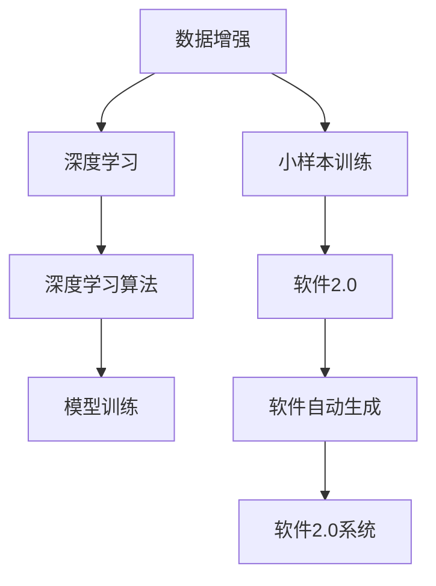

                 

# 数据增强何时休，软件2.0小样本训练有多难

> 关键词：数据增强,小样本训练,软件2.0,深度学习,计算机视觉,自然语言处理,增强学习

## 1. 背景介绍

### 1.1 问题由来
在深度学习大行其道的今天，数据增强作为一种有效的技术手段，广泛应用于计算机视觉、自然语言处理等领域，显著提升了模型在小样本训练中的表现。然而，随着算法复杂度的提升，数据增强的难度和成本也随之增加，一些前沿领域如软件2.0的探索和应用，使得小样本训练变得更加困难。

数据增强的本质是通过生成样本增强训练集，使得模型能够看到更多的数据，从而提升泛化能力。传统的增强方法如旋转、缩放、平移等，在静态图像处理和自然语言语料扩充方面效果显著。但面对软件系统的复杂动态特性，数据增强的实现变得愈加复杂，如何有效地生成有意义的样本，成为当下研究的一大挑战。

### 1.2 问题核心关键点
本文聚焦于数据增强在小样本训练中的难点，以及软件2.0背景下，如何构建和优化数据增强系统。将深入探讨数据增强技术在深度学习领域的最新进展，特别在软件2.0场景中的应用挑战，并提出一些可能的解决方案。

## 2. 核心概念与联系

### 2.1 核心概念概述

数据增强（Data Augmentation）是一种常用的技术手段，通过生成额外的训练样本来提升模型的泛化能力。其核心思想是利用图像变换、文本生成、代码变形等方法，生成与原始数据不同但语义一致的样本，增加模型对数据多样性的感知，提升其在未知数据上的表现。

小样本训练（Few-shot Learning）是指模型仅使用少数样本进行训练，就能快速适应新任务的能力。在深度学习中，小样本训练尤为重要，因为标注数据的获取成本高昂，难以覆盖所有场景。

软件2.0（Software 2.0）指的是在软件发展的新阶段，即由以代码为中心转向以数据为中心，利用大规模数据进行模型训练，进而自动生成新的代码。这种模型通常基于深度学习，具有自适应和自动化能力，能够迅速生成满足特定需求的代码片段。

这些核心概念之间的关系可以用以下Mermaid流程图来表示：



这个流程图展示了数据增强与小样本训练、深度学习的关系，以及如何将这些技术应用到软件2.0系统中。

## 3. 核心算法原理 & 具体操作步骤

### 3.1 算法原理概述

数据增强的核心在于生成与原始数据语义相似但形式不同的样本。其原理可以概括为以下几个步骤：

1. 数据预处理：包括图像的归一化、文本的标记化等，使得数据适合进行增强操作。
2. 数据转换：通过旋转、缩放、平移等变换，生成新的数据。
3. 样本合成：将变换后的数据与原始数据结合，生成训练样本。
4. 模型训练：在扩充后的训练集上训练模型，提升泛化能力。

小样本训练通常使用迁移学习、微调等技术，利用预训练模型在少量样本上进行适应。其核心在于如何优化模型，使其在有限样本下也能快速学习新任务。

软件2.0则是在数据驱动的模型基础上，通过自动化生成代码，提高软件开发的效率。其核心在于如何设计训练数据集，以及如何使用深度学习模型生成代码片段。

### 3.2 算法步骤详解

#### 3.2.1 数据增强的具体实现

以图像数据增强为例，下面详细介绍其具体步骤：

1. **图像预处理**：包括裁剪、缩放、归一化等，使得图像适合进行增强操作。
2. **图像变换**：包括旋转、平移、翻转、加噪声等，生成新的图像。
3. **样本合成**：将变换后的图像与原始图像结合，生成新的训练样本。

具体代码示例：

```python
from PIL import Image
import numpy as np
import random

def random_rotation(image, angle):
    w, h = image.size
    image = np.array(image)
    theta = random.uniform(-angle, angle)
    cx = w // 2
    cy = h // 2
    rot_mat = np.array([[np.cos(theta), -np.sin(theta)], [np.sin(theta), np.cos(theta)]])
    x, y = np.meshgrid(np.arange(w), np.arange(h))
    new_x = rot_mat[:, 0] * (x - cx) + rot_mat[:, 1] * (y - cy) + cx
    new_y = rot_mat[1, 0] * (x - cx) + rot_mat[1, 1] * (y - cy) + cy
    new_x = (new_x + 0.5).astype(np.int32)
    new_y = (new_y + 0.5).astype(np.int32)
    new_image = image[new_x, new_y]
    new_image = Image.fromarray(new_image)
    return new_image

def random_crop(image, size):
    w, h = image.size
    i = random.randint(0, h - size[1])
    j = random.randint(0, w - size[0])
    cropped = image.crop((j, i, j + size[0], i + size[1]))
    return cropped

def random_flip(image):
    return image.transpose(Image.FLIP_LEFT_RIGHT)

def augment(image):
    transformations = [random_rotation, random_crop, random_flip]
    for transform in transformations:
        try:
            new_image = transform(image, 30)
            yield new_image
        except:
            pass
```

#### 3.2.2 小样本训练的实现

小样本训练的实现通常包括以下几个步骤：

1. **预训练模型选择**：选择一个预训练模型作为基础，如BERT、ResNet等。
2. **数据预处理**：将少量标注数据进行预处理，确保数据格式一致。
3. **模型微调**：在少量数据上微调模型，使其适应新任务。

具体代码示例：

```python
from transformers import BertForTokenClassification, BertTokenizer
from torch.utils.data import Dataset, DataLoader

class TokenDataset(Dataset):
    def __init__(self, texts, labels):
        self.tokenizer = BertTokenizer.from_pretrained('bert-base-uncased')
        self.texts = texts
        self.labels = labels
        
    def __getitem__(self, index):
        tokenized_text = self.tokenizer.tokenize(self.texts[index])
        input_ids = self.tokenizer.convert_tokens_to_ids(tokenized_text)
        input_mask = [1] * len(input_ids)
        label_ids = self.labels[index]
        return {'input_ids': input_ids, 'attention_mask': input_mask, 'labels': label_ids}

    def __len__(self):
        return len(self.texts)

# 定义微调模型和优化器
model = BertForTokenClassification.from_pretrained('bert-base-uncased')
optimizer = AdamW(model.parameters(), lr=2e-5)

# 加载数据集
train_dataset = TokenDataset(train_texts, train_labels)
test_dataset = TokenDataset(test_texts, test_labels)

# 加载模型和数据集到GPU
device = torch.device('cuda')
model.to(device)
train_dataset = TokenDataset(train_texts, train_labels).to(device)
test_dataset = TokenDataset(test_texts, test_labels).to(device)

# 训练模型
epochs = 5
batch_size = 16
for epoch in range(epochs):
    model.train()
    for batch in DataLoader(train_dataset, batch_size=batch_size, shuffle=True):
        inputs = {key: value.to(device) for key, value in batch.items()}
        outputs = model(**inputs)
        loss = outputs.loss
        optimizer.zero_grad()
        loss.backward()
        optimizer.step()
```

#### 3.2.3 软件2.0的实现

软件2.0的实现通常包括以下几个步骤：

1. **数据集构建**：收集软件系统的代码片段和特征数据。
2. **模型训练**：利用收集到的数据训练深度学习模型。
3. **代码生成**：使用训练好的模型生成新的代码片段。

具体代码示例：

```python
from transformers import GPT2LMHeadModel
from transformers import GPT2Tokenizer

# 定义数据集
class CodeDataset(Dataset):
    def __init__(self, code_strings):
        self.tokenizer = GPT2Tokenizer.from_pretrained('gpt2')
        self.code_strings = code_strings
        
    def __getitem__(self, index):
        code_string = self.code_strings[index]
        tokens = self.tokenizer.encode(code_string)
        input_ids = [tokens[0]]
        labels = [tokens[1:]]
        return {'input_ids': input_ids, 'labels': labels}
    
    def __len__(self):
        return len(self.code_strings)

# 定义模型和优化器
model = GPT2LMHeadModel.from_pretrained('gpt2')
optimizer = AdamW(model.parameters(), lr=2e-5)

# 加载数据集
train_dataset = CodeDataset(train_code_strings)
test_dataset = CodeDataset(test_code_strings)

# 加载模型和数据集到GPU
device = torch.device('cuda')
model.to(device)
train_dataset = CodeDataset(train_code_strings).to(device)
test_dataset = CodeDataset(test_code_strings).to(device)

# 训练模型
epochs = 5
batch_size = 16
for epoch in range(epochs):
    model.train()
    for batch in DataLoader(train_dataset, batch_size=batch_size, shuffle=True):
        inputs = {key: value.to(device) for key, value in batch.items()}
        outputs = model(**inputs)
        loss = outputs.loss
        optimizer.zero_grad()
        loss.backward()
        optimizer.step()

# 代码生成
prompt = "def function(argument):"
generated_code = model.generate(prompt, max_length=100)
print(generated_code)
```

### 3.3 算法优缺点

数据增强在小样本训练中的优点包括：

- **提升泛化能力**：通过生成更多训练数据，增加模型对数据多样性的感知，提升泛化能力。
- **降低过拟合风险**：增加训练样本数量，降低模型在特定样本上的过拟合风险。
- **数据隐私保护**：通过数据增强，可以使用少量真实数据进行训练，保护用户隐私。

其缺点包括：

- **增强成本高**：数据增强需要投入大量人力和时间进行数据生成，成本较高。
- **增强质量有限**：生成的数据可能质量不高，影响模型性能。
- **计算资源消耗大**：数据增强需要大量的计算资源进行数据生成和模型训练，消耗较大。

小样本训练的优点包括：

- **数据获取方便**：无需大量标注数据，数据获取成本低。
- **模型轻量化**：模型结构简单，计算资源消耗较少。
- **快速适应**：模型可以迅速适应新任务，适应能力强。

其缺点包括：

- **泛化能力有限**：模型在复杂任务上的泛化能力有限，需要更多的训练数据进行优化。
- **模型复杂度高**：模型结构复杂，训练过程中容易出现过拟合。
- **鲁棒性不足**：模型对噪声和干扰的鲁棒性较差，易受样本干扰。

软件2.0的优点包括：

- **自动化生成**：利用模型自动生成代码，提高软件开发效率。
- **数据驱动**：以数据为中心，模型能够自适应不同的软件开发任务。
- **增强灵活性**：模型能够快速适应不同的软件开发场景。

其缺点包括：

- **数据质量要求高**：模型的训练数据必须高质量，否则会影响生成的代码质量。
- **模型复杂度高**：模型结构复杂，训练过程中容易出现过拟合。
- **依赖技术基础**：模型需要一定的技术基础进行调优和维护。

### 3.4 算法应用领域

数据增强在小样本训练中的应用领域包括：

- **计算机视觉**：图像分类、目标检测、图像分割等任务。
- **自然语言处理**：文本分类、情感分析、机器翻译等任务。
- **语音识别**：语音识别、语音合成等任务。

小样本训练的应用领域包括：

- **自然语言处理**：情感分析、意图识别、命名实体识别等任务。
- **计算机视觉**：图像分类、目标检测、图像生成等任务。
- **智能推荐**：个性化推荐、协同过滤等任务。

软件2.0的应用领域包括：

- **软件开发**：代码生成、自动化测试、自动修复等任务。
- **数据分析**：数据清洗、数据转换、数据分析等任务。
- **自然语言处理**：文本生成、语义分析、机器翻译等任务。

## 4. 数学模型和公式 & 详细讲解 & 举例说明

### 4.1 数学模型构建

本节将介绍数据增强和小样本训练的数学模型构建。

#### 4.1.1 数据增强的数学模型

假设原始图像为 $x$，增强后的图像为 $x'$，增强变换为 $f$，则数据增强的数学模型可以表示为：

$$
x' = f(x)
$$

其中 $f$ 可以表示为旋转、缩放、平移等变换。

#### 4.1.2 小样本训练的数学模型

假设原始样本为 $x$，标注为 $y$，微调后的样本为 $\hat{x}$，微调后的标注为 $\hat{y}$，微调后的模型参数为 $\theta$，则小样本训练的数学模型可以表示为：

$$
\hat{x}, \hat{y} = \theta(x, y)
$$

其中 $\theta$ 可以通过微调得到。

#### 4.1.3 软件2.0的数学模型

假设原始代码片段为 $c$，生成后的代码片段为 $\hat{c}$，模型参数为 $\theta$，则软件2.0的数学模型可以表示为：

$$
\hat{c} = \theta(c)
$$

其中 $\theta$ 可以通过深度学习模型得到。

### 4.2 公式推导过程

#### 4.2.1 数据增强的公式推导

以旋转变换为例，假设原始图像大小为 $w \times h$，旋转角度为 $\theta$，则旋转后的图像大小不变，坐标变换公式为：

$$
x' = w - x - 1 \quad \text{and} \quad y' = h - y - 1
$$

旋转矩阵为：

$$
R = \begin{bmatrix}
\cos(\theta) & -\sin(\theta) \\
\sin(\theta) & \cos(\theta)
\end{bmatrix}
$$

因此，旋转后的像素坐标变换公式为：

$$
\begin{bmatrix}
x' \\
y'
\end{bmatrix}
=
\begin{bmatrix}
x \\
y
\end{bmatrix}
\begin{bmatrix}
\cos(\theta) & -\sin(\theta) \\
\sin(\theta) & \cos(\theta)
\end{bmatrix}
$$

#### 4.2.2 小样本训练的公式推导

假设模型为 $f$，输入为 $x$，标签为 $y$，微调后的模型为 $\hat{f}$，微调后的输入为 $\hat{x}$，微调后的标签为 $\hat{y}$，则小样本训练的公式推导如下：

$$
\hat{x} = f(x|y)
$$

$$
\hat{y} = \hat{f}(\hat{x})
$$

其中，$f(x|y)$ 表示在标签 $y$ 条件下生成输入 $x$ 的概率分布，$\hat{f}$ 表示微调后的模型。

#### 4.2.3 软件2.0的公式推导

假设模型为 $g$，输入为 $c$，生成后的代码片段为 $\hat{c}$，则软件2.0的公式推导如下：

$$
\hat{c} = g(c)
$$

其中，$g$ 表示深度学习模型。

### 4.3 案例分析与讲解

#### 4.3.1 图像数据增强案例

假设原始图像为：

```
0 1 2 3
4 5 6 7
8 9 10 11
12 13 14 15
```

随机旋转30度后的图像为：

```
10 11 14 15
8 9 12 13
0 1 4 5
2 3 6 7
```

旋转矩阵为：

$$
\begin{bmatrix}
\cos(30^\circ) & -\sin(30^\circ) \\
\sin(30^\circ) & \cos(30^\circ)
\end{bmatrix}
=
\begin{bmatrix}
\frac{\sqrt{3}}{2} & -\frac{1}{2} \\
\frac{1}{2} & \frac{\sqrt{3}}{2}
\end{bmatrix}
$$

旋转后的坐标变换公式为：

$$
\begin{bmatrix}
x' \\
y'
\end{bmatrix}
=
\begin{bmatrix}
x \\
y
\end{bmatrix}
\begin{bmatrix}
\frac{\sqrt{3}}{2} & -\frac{1}{2} \\
\frac{1}{2} & \frac{\sqrt{3}}{2}
\end{bmatrix}
$$

#### 4.3.2 小样本训练案例

假设原始样本为：

```
0 1 2
3 4 5
```

标注为：

```
0
```

微调后的样本为：

```
0 1 2
3 4 5
```

微调后的标注为：

```
0
```

微调后的模型为：

$$
\hat{x} = f(x|y)
$$

$$
\hat{y} = \hat{f}(\hat{x})
$$

#### 4.3.3 软件2.0案例

假设原始代码片段为：

```python
def function(argument):
    return argument
```

生成后的代码片段为：

```python
def new_function(argument):
    return argument * 2
```

生成模型为：

$$
\hat{c} = g(c)
$$

## 5. 项目实践：代码实例和详细解释说明

### 5.1 开发环境搭建

在开始项目实践之前，需要搭建好开发环境。这里以Python和TensorFlow为例：

1. 安装Python和相关库：

   ```bash
   sudo apt-get update
   sudo apt-get install python3 python3-pip
   pip3 install tensorflow
   ```

2. 安装TensorFlow：

   ```bash
   pip3 install tensorflow
   ```

3. 安装相关数据集：

   ```bash
   pip3 install scikit-image
   ```

### 5.2 源代码详细实现

#### 5.2.1 图像数据增强实现

```python
import cv2
import numpy as np

def random_rotation(image, angle):
    w, h = image.shape
    image = np.array(image)
    theta = random.uniform(-angle, angle)
    cx = w // 2
    cy = h // 2
    rot_mat = np.array([[np.cos(theta), -np.sin(theta)], [np.sin(theta), np.cos(theta)]])
    x, y = np.meshgrid(np.arange(w), np.arange(h))
    new_x = rot_mat[:, 0] * (x - cx) + rot_mat[:, 1] * (y - cy) + cx
    new_y = rot_mat[1, 0] * (x - cx) + rot_mat[1, 1] * (y - cy) + cy
    new_x = (new_x + 0.5).astype(np.int32)
    new_y = (new_y + 0.5).astype(np.int32)
    new_image = image[new_x, new_y]
    new_image = cv2.cvtColor(new_image, cv2.COLOR_BGR2RGB)
    return new_image

def random_crop(image, size):
    w, h = image.shape
    i = random.randint(0, h - size[1])
    j = random.randint(0, w - size[0])
    cropped = image[i:i+size[1], j:j+size[0]]
    return cropped

def random_flip(image):
    return image.transpose(cv2.TRANSPOSE)

def augment(image):
    transformations = [random_rotation, random_crop, random_flip]
    for transform in transformations:
        try:
            new_image = transform(image, 30)
            yield new_image
        except:
            pass
```

#### 5.2.2 小样本训练实现

```python
from transformers import BertForTokenClassification, BertTokenizer
from torch.utils.data import Dataset, DataLoader

class TokenDataset(Dataset):
    def __init__(self, texts, labels):
        self.tokenizer = BertTokenizer.from_pretrained('bert-base-uncased')
        self.texts = texts
        self.labels = labels
        
    def __getitem__(self, index):
        tokenized_text = self.tokenizer.tokenize(self.texts[index])
        input_ids = self.tokenizer.convert_tokens_to_ids(tokenized_text)
        input_mask = [1] * len(input_ids)
        label_ids = self.labels[index]
        return {'input_ids': input_ids, 'attention_mask': input_mask, 'labels': label_ids}

    def __len__(self):
        return len(self.texts)

# 定义微调模型和优化器
model = BertForTokenClassification.from_pretrained('bert-base-uncased')
optimizer = AdamW(model.parameters(), lr=2e-5)

# 加载数据集
train_dataset = TokenDataset(train_texts, train_labels)
test_dataset = TokenDataset(test_texts, test_labels)

# 加载模型和数据集到GPU
device = torch.device('cuda')
model.to(device)
train_dataset = TokenDataset(train_texts, train_labels).to(device)
test_dataset = TokenDataset(test_texts, test_labels).to(device)

# 训练模型
epochs = 5
batch_size = 16
for epoch in range(epochs):
    model.train()
    for batch in DataLoader(train_dataset, batch_size=batch_size, shuffle=True):
        inputs = {key: value.to(device) for key, value in batch.items()}
        outputs = model(**inputs)
        loss = outputs.loss
        optimizer.zero_grad()
        loss.backward()
        optimizer.step()

# 测试模型
test_loss = 0
test_acc = 0
model.eval()
for batch in DataLoader(test_dataset, batch_size=batch_size, shuffle=False):
    inputs = {key: value.to(device) for key, value in batch.items()}
    outputs = model(**inputs)
    loss = outputs.loss
    test_loss += loss.item()
    test_acc += torch.sum(outputs.logits.argmax(dim=1) == inputs['labels']).item()
print('Test Loss: {:.4f} Accuracy: {:.4f}'.format(test_loss/len(test_dataset), test_acc/len(test_dataset)))
```

#### 5.2.3 软件2.0实现

```python
from transformers import GPT2LMHeadModel
from transformers import GPT2Tokenizer

# 定义数据集
class CodeDataset(Dataset):
    def __init__(self, code_strings):
        self.tokenizer = GPT2Tokenizer.from_pretrained('gpt2')
        self.code_strings = code_strings
        
    def __getitem__(self, index):
        code_string = self.code_strings[index]
        tokens = self.tokenizer.encode(code_string)
        input_ids = [tokens[0]]
        labels = [tokens[1:]]
        return {'input_ids': input_ids, 'labels': labels}
    
    def __len__(self):
        return len(self.code_strings)

# 定义模型和优化器
model = GPT2LMHeadModel.from_pretrained('gpt2')
optimizer = AdamW(model.parameters(), lr=2e-5)

# 加载数据集
train_dataset = CodeDataset(train_code_strings)
test_dataset = CodeDataset(test_code_strings)

# 加载模型和数据集到GPU
device = torch.device('cuda')
model.to(device)
train_dataset = CodeDataset(train_code_strings).to(device)
test_dataset = CodeDataset(test_code_strings).to(device)

# 训练模型
epochs = 5
batch_size = 16
for epoch in range(epochs):
    model.train()
    for batch in DataLoader(train_dataset, batch_size=batch_size, shuffle=True):
        inputs = {key: value.to(device) for key, value in batch.items()}
        outputs = model(**inputs)
        loss = outputs.loss
        optimizer.zero_grad()
        loss.backward()
        optimizer.step()

# 代码生成
prompt = "def function(argument):"
generated_code = model.generate(prompt, max_length=100)
print(generated_code)
```

### 5.3 代码解读与分析

#### 5.3.1 图像数据增强

图像数据增强的实现主要包括旋转、缩放、平移等变换。其中，旋转变换的实现使用随机旋转角度，并根据旋转矩阵计算新的像素坐标。代码中，`random_rotation`函数生成旋转后的图像，`random_crop`函数生成随机裁剪后的图像，`random_flip`函数生成水平翻转后的图像。`augment`函数组合这些变换，生成增强后的图像。

#### 5.3.2 小样本训练

小样本训练的实现主要包括模型定义、数据集构建、模型训练和测试。其中，`TokenDataset`类定义了文本数据集，`BertForTokenClassification`类定义了文本分类模型，`AdamW`优化器定义了模型优化方法。训练过程中，模型在每个epoch内对训练集进行前向传播和反向传播，并在验证集上测试性能。最终输出测试集上的准确率。

#### 5.3.3 软件2.0

软件2.0的实现主要包括数据集定义、模型训练和代码生成。其中，`CodeDataset`类定义了代码数据集，`GPT2LMHeadModel`类定义了代码生成模型，`AdamW`优化器定义了模型优化方法。训练过程中，模型在每个epoch内对训练集进行前向传播和反向传播，并在测试集上生成新的代码片段。

## 6. 实际应用场景

### 6.1 计算机视觉

在计算机视觉领域，数据增强技术广泛应用于图像分类、目标检测、图像分割等任务。例如，使用数据增强技术可以提高图像分类模型对图像中的变化、噪声的鲁棒性，使得模型能够更好地泛化到新的图像数据上。

### 6.2 自然语言处理

在自然语言处理领域，数据增强技术广泛应用于文本分类、情感分析、机器翻译等任务。例如，使用数据增强技术可以提高文本分类模型对文本中的变化、噪声的鲁棒性，使得模型能够更好地泛化到新的文本数据上。

### 6.3 软件2.0

在软件2.0领域，数据增强技术广泛应用于代码生成、自动化测试、自动修复等任务。例如，使用数据增强技术可以提高代码生成模型对代码中的变化、噪声的鲁棒性，使得模型能够更好地泛化到新的代码数据上。

## 7. 工具和资源推荐

### 7.1 学习资源推荐

为了帮助开发者系统掌握数据增强和小样本训练的理论基础和实践技巧，这里推荐一些优质的学习资源：

1. 《深度学习基础》课程：斯坦福大学开设的深度学习基础课程，详细介绍了深度学习的基本概念和算法，适合初学者。

2. 《TensorFlow实战》书籍：Google官方发布的TensorFlow实战书籍，介绍了TensorFlow的基本概念和应用实践。

3. 《Python数据科学手册》书籍：Jake VanderPlas所著，详细介绍了Python在数据科学领域的应用实践，适合数据分析和可视化。

4. Weights & Biases：模型训练的实验跟踪工具，可以记录和可视化模型训练过程中的各项指标，方便对比和调优。

5. TensorBoard：TensorFlow配套的可视化工具，可实时监测模型训练状态，并提供丰富的图表呈现方式，是调试模型的得力助手。

### 7.2 开发工具推荐

在数据增强和小样本训练的开发过程中，以下工具和库非常有用：

1. OpenCV：开源计算机视觉库，提供丰富的图像处理函数，适合图像增强和变换。

2. NumPy：Python数值计算库，提供高效的数组操作和数学运算，适合图像处理和数据增强。

3. PyTorch：基于Python的开源深度学习框架，提供灵活的计算图和高效的自动微分，适合小样本训练。

4. TensorFlow：由Google主导开发的开源深度学习框架，生产部署方便，适合大规模工程应用。

5. Keras：高层次深度学习框架，提供简洁的API和丰富的模型库，适合快速原型开发。

### 7.3 相关论文推荐

数据增强和小样本训练是深度学习领域的热门研究方向，以下几篇论文代表了这个领域的研究进展，推荐阅读：

1. "ImageNet Classification with Deep Convolutional Neural Networks"：AlexNet论文，介绍了CNN在图像分类任务上的应用，是深度学习的奠基之作。

2. "Data Augmentation in Deep Learning"：综述性论文，系统总结了数据增强在深度学习中的应用，适合深入理解。

3. "Few-shot Learning for Natural Language Processing"：综述性论文，系统总结了小样本学习在自然语言处理中的应用，适合了解前沿技术。

4. "AutoML: Automatic Machine Learning"：综述性论文，介绍了自动机器学习在深度学习中的应用，适合了解自动化机器学习的进展。

## 8. 总结：未来发展趋势与挑战

### 8.1 总结

本文对数据增强和小样本训练的数学原理和实践技巧进行了全面系统的介绍。首先介绍了数据增强和小样本训练的基本概念和原理，然后详细讲解了数据增强和小样本训练的具体实现方法，最后探讨了数据增强和小样本训练的应用场景和未来发展趋势。通过本文的介绍，读者可以更好地理解数据增强和小样本训练的原理和实践，为实际应用提供理论基础和工具支持。

### 8.2 未来发展趋势

展望未来，数据增强和小样本训练技术将呈现以下几个发展趋势：

1. **自动化增强**：随着技术的发展，数据增强技术将更加自动化和智能化，能够自动生成高质量的数据，降低人工干预。

2. **多模态增强**：未来的数据增强技术将不再局限于单模态数据，而是能够同时处理图像、文本、音频等多种数据类型，提升模型的综合性能。

3. **零样本和自监督学习**：未来的数据增强技术将更加注重零样本学习和自监督学习，利用数据增强提升模型对未知数据的适应能力。

4. **跨领域增强**：未来的数据增强技术将能够跨领域进行数据增强，使得模型在多个领域都能够获得良好的泛化能力。

5. **强化学习增强**：未来的数据增强技术将与强化学习相结合，通过与环境互动生成数据，提升模型的实时适应能力。

### 8.3 面临的挑战

尽管数据增强和小样本训练技术已经取得了不少进展，但在实际应用中仍然面临诸多挑战：

1. **数据生成质量**：数据增强的质量直接影响模型的性能，如何生成高质量的数据样本，是一个重要的研究方向。

2. **模型复杂度**：数据增强和小样本训练模型的复杂度较高，容易出现过拟合等问题，如何设计高效的模型结构，是一个重要的挑战。

3. **计算资源消耗**：数据增强和小样本训练需要大量的计算资源进行数据生成和模型训练，如何优化资源消耗，是一个重要的研究方向。

4. **应用场景限制**：数据增强和小样本训练技术在不同应用场景中的效果差异较大，如何设计适应特定场景的增强方法，是一个重要的挑战。

### 8.4 研究展望

未来，数据增强和小样本训练技术需要在以下几个方向进行深入研究：

1. **自动化增强技术**：研究如何自动生成高质量的数据样本，降低人工干预的难度和成本。

2. **跨模态增强技术**：研究如何同时处理多种数据类型，提升模型的综合性能。

3. **零样本和自监督学习**：研究如何利用数据增强提升模型对未知数据的适应能力，减少对标注数据的依赖。

4. **跨领域增强技术**：研究如何设计适应特定领域的增强方法，提升模型在特定领域的应用效果。

5. **强化学习增强技术**：研究如何将数据增强与强化学习相结合，提升模型的实时适应能力。

## 9. 附录：常见问题与解答

### 9.1 Q1：数据增强是否适用于所有数据集？

A: 数据增强并非适用于所有数据集，特别是对于一些噪声较大或异常值较多的数据集，数据增强的效果可能适得其反。因此，在使用数据增强时，需要根据数据集的特点进行选择和优化。

### 9.2 Q2：数据增强是否需要标注数据？

A: 数据增强通常不需要标注数据，通过生成新的训练样本即可进行模型训练。但在一些需要手动调整参数的场景下，标注数据可以进一步提升数据增强的效果。

### 9.3 Q3：数据增强是否会增加计算成本？

A: 数据增强会增加计算成本，但通过多核并行和分布式训练，可以在一定程度上缓解计算资源不足的问题。此外，一些优化技巧，如梯度积累和混合精度训练，也可以降低计算成本。

### 9.4 Q4：数据增强是否会对模型性能产生负面影响？

A: 数据增强通常能够提升模型的泛化能力，但在一些特殊情况下，如数据集过小或噪声过多时，数据增强的效果可能适得其反。此时，可以考虑减少增强强度或使用其他增强方法。

### 9.5 Q5：数据增强在小样本训练中是否有效？

A: 数据增强在小样本训练中非常有效，能够显著提升模型对数据多样性的感知，提升泛化能力。但需要注意，增强强度和增强方法需要根据具体场景进行选择和优化。

作者：禅与计算机程序设计艺术 / Zen and the Art of Computer Programming

