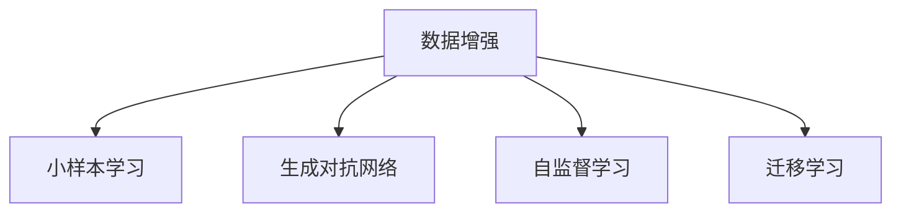

                 

# 数据增强：让小数据集发挥大作用

> 关键词：数据增强, 小样本, 模型泛化, 数据扩充, 深度学习, 计算机视觉, 自然语言处理, 生成对抗网络

## 1. 背景介绍

### 1.1 问题由来
在深度学习中，模型训练依赖于大量的标注数据。然而，实际应用中往往无法获得足够多且高质量的数据，特别是在一些特定的应用场景中，如医疗、金融、法律等。这时，数据增强技术就成为了解决这一问题的重要手段。

数据增强指的是通过对训练集中的样本进行一系列变换，生成新的、丰富的样本，从而扩充训练数据集。这些新样本虽然是从原始数据中生成的，但它们具有与原始样本相同的分布特性，可以用于训练模型，提升模型泛化能力，减少过拟合风险。

### 1.2 问题核心关键点
数据增强技术在深度学习中已经得到了广泛应用，特别是在计算机视觉领域，通过旋转、翻转、裁剪等简单变换，可以显著提升模型的识别能力。然而，在其他领域的应用还相对较少。理解数据增强的基本原理和应用场景，对于解决数据不足的问题具有重要意义。

### 1.3 问题研究意义
数据增强技术对于解决数据不足问题具有重要意义，特别是在医疗、金融、法律等数据难以获取的场景中。通过数据增强，可以使用较小的数据集训练出更鲁棒、泛化能力更强的模型，从而降低成本，提升效率。

此外，数据增强还可以用于对抗攻击防御、图像生成、自然语言处理等诸多领域，是深度学习中不可或缺的一部分。研究数据增强技术对于推进深度学习技术的发展，具有重要的理论和应用价值。

## 2. 核心概念与联系

### 2.1 核心概念概述

为更好地理解数据增强技术，本节将介绍几个密切相关的核心概念：

- **数据增强(Data Augmentation)**：通过对训练集中的样本进行一系列变换，生成新的样本，用于训练模型。常用的数据增强技术包括旋转、翻转、裁剪、缩放、噪声添加等。

- **小样本(Small-Sample Learning)**：指在训练数据较少的情况下，模型难以充分学习数据特征，容易出现过拟合的现象。

- **泛化能力(Generalization Capability)**：指模型在未见过的数据上，能否准确预测结果的能力。泛化能力强的模型，能够更好地适应新数据。

- **生成对抗网络(GANs)**：一种生成模型，通过对抗训练的方式，生成与真实数据类似的合成数据。

- **自监督学习(Self-Supervised Learning)**：指在无标签数据上训练模型，通过设计一些自我监督的任务（如掩码语言模型、对比学习等），学习数据的结构信息。

- **迁移学习(Transfer Learning)**：指将一个领域学到的知识，迁移到另一个相关领域中进行学习。数据增强也是迁移学习的一种形式，通过将已有知识应用到新的数据中，提升模型性能。

这些核心概念之间的逻辑关系可以通过以下Mermaid流程图来展示：



这个流程图展示了一个从数据增强出发，通过多种技术手段提升模型泛化能力的路径。

## 3. 核心算法原理 & 具体操作步骤
### 3.1 算法原理概述

数据增强技术的基本思想是通过对原始数据进行一系列变换，生成新的、类似的数据，用于训练模型。常用的数据增强方法包括旋转、翻转、缩放、裁剪、噪声添加等。

数据增强的原理基于两个假设：
1. 数据样本之间存在一定的相似性，通过变换可以生成新的样本。
2. 模型对数据的泛化能力取决于数据的多样性，通过增加数据样本的多样性，可以提升模型的泛化能力。

### 3.2 算法步骤详解

数据增强的主要步骤如下：

1. **数据预处理**：对原始数据进行归一化、标准化等预处理，确保数据在增强过程中保持一致性。
2. **定义增强操作**：根据具体任务，定义一系列增强操作。如在图像增强中，可以进行旋转、翻转、缩放、裁剪、噪声添加等操作；在自然语言处理中，可以进行掩码语言模型、对比学习等。
3. **生成增强样本**：将原始数据按照定义的增强操作进行变换，生成新的样本。
4. **训练模型**：将增强后的样本与原始样本一起，用于训练模型。

### 3.3 算法优缺点

数据增强技术具有以下优点：
1. **减少过拟合**：通过增加数据的多样性，可以有效减少模型在训练数据上的过拟合风险。
2. **提升泛化能力**：增强后的数据样本与原始数据具有相似的分布特性，可以提升模型的泛化能力。
3. **降低成本**：相对于收集大量标注数据，数据增强可以通过简单的数据变换，生成大量合成数据，降低成本。
4. **提升模型鲁棒性**：增强后的数据样本具有不同的形态和特征，可以提升模型的鲁棒性。

然而，数据增强技术也存在一些局限性：
1. **生成数据质量不高**：生成的数据可能存在噪声或变形，影响模型训练效果。
2. **数据变换有限**：不同的任务可能需要不同的数据变换，且有些数据变换可能导致数据丢失或信息扭曲。
3. **计算开销较大**：数据增强需要消耗大量的计算资源，特别是在大规模数据集上。

### 3.4 算法应用领域

数据增强技术已经在多个领域得到了广泛应用，以下是一些典型应用场景：

- **计算机视觉**：图像增强、噪声添加、颜色扰动等技术，在图像识别、目标检测、人脸识别等领域发挥了重要作用。
- **自然语言处理**：掩码语言模型、回译、数据扰动等技术，在文本分类、机器翻译、情感分析等领域取得了显著效果。
- **音频信号处理**：时域变换、频域变换等技术，在语音识别、说话人识别、声音生成等领域得到了应用。
- **医学影像分析**：图像旋转、翻转、裁剪等技术，在医学影像分类、病变检测、病理分析等领域得到了广泛应用。
- **自动驾驶**：数据增强技术在自动驾驶领域中用于提高模型的鲁棒性和泛化能力。

这些领域的数据增强技术，从图像处理到自然语言处理，从音频信号处理到医学影像分析，都证明了数据增强技术在提升模型性能方面的有效性。

## 4. 数学模型和公式 & 详细讲解 & 举例说明

### 4.1 数学模型构建

数据增强的数学模型可以基于原始数据的概率分布 $p(x)$ 来构建。假设训练集中有 $N$ 个样本 $(x_i,y_i)$，其中 $y_i$ 为标签。数据增强的目标是生成新的样本 $(x_i',y_i')$，使得 $p(x_i')=p(x_i)$。

### 4.2 公式推导过程

设 $T$ 为数据增强操作集合，$T=\{t_1,t_2,\ldots,t_k\}$，每个操作 $t_i$ 可以表示为 $t_i(x_i,y_i)=(x_i',y_i')$。则数据增强后的概率分布为：

$$
p(x',y')=\sum_{t \in T} p(x',y'|x_i,y_i) p(t)
$$

其中 $p(x',y'|x_i,y_i)$ 表示在 $(x_i,y_i)$ 上应用 $t$ 操作后，生成 $(x',y')$ 的概率。$T$ 为所有可能的操作集合，$p(t)$ 为每个操作的先验概率。

### 4.3 案例分析与讲解

以图像增强为例，假设原始图像为 $I$，数据增强操作 $t$ 包括旋转、翻转、缩放等。设 $t_1$ 表示逆时针旋转 $90^\circ$，$t_2$ 表示水平翻转，$t_3$ 表示垂直翻转，$t_4$ 表示缩放。则数据增强后的图像 $I'$ 可以表示为：

$$
I'=t_1(I) \text{ 或 } I'=I \text{ 或 } I'=I^T \text{ 或 } I'=I_k
$$

其中 $I_k$ 表示缩放后的图像。数据增强后的标签 $y'$ 可以根据增强后的图像生成，如对于图像分类任务，$y'$ 与 $y$ 相同。

## 5. 项目实践：代码实例和详细解释说明
### 5.1 开发环境搭建

在进行数据增强实践前，我们需要准备好开发环境。以下是使用Python进行TensorFlow开发的环境配置流程：

1. 安装Anaconda：从官网下载并安装Anaconda，用于创建独立的Python环境。

2. 创建并激活虚拟环境：
```bash
conda create -n tf-env python=3.8 
conda activate tf-env
```

3. 安装TensorFlow：根据CUDA版本，从官网获取对应的安装命令。例如：
```bash
conda install tensorflow -c tf -c conda-forge
```

4. 安装TensorFlow Addons：用于增强TensorFlow的库，包括ImageDataGenerator、TextDataGenerator等。
```bash
conda install tensorflow-io-aws s3fs -c tf-nightly -c conda-forge
```

5. 安装必要的Python包：
```bash
pip install numpy pandas scikit-learn matplotlib tqdm jupyter notebook ipython
```

完成上述步骤后，即可在`tf-env`环境中开始数据增强实践。

### 5.2 源代码详细实现

以下是一个使用TensorFlow实现图像数据增强的示例代码：

```python
import tensorflow as tf
from tensorflow.keras.preprocessing.image import ImageDataGenerator

# 加载图像数据集
train_generator = tf.keras.preprocessing.image.ImageDataGenerator(
    rescale=1./255,
    rotation_range=20,
    width_shift_range=0.1,
    height_shift_range=0.1,
    shear_range=0.1,
    zoom_range=0.1,
    horizontal_flip=True,
    fill_mode='nearest',
    validation_split=0.2
)

# 定义数据增强操作
train_generator.fit(train_dataset)

# 定义模型
model = tf.keras.Sequential([
    tf.keras.layers.Conv2D(32, (3, 3), activation='relu', input_shape=(64, 64, 3)),
    tf.keras.layers.MaxPooling2D((2, 2)),
    tf.keras.layers.Flatten(),
    tf.keras.layers.Dense(10)
])

# 编译模型
model.compile(optimizer='adam',
              loss=tf.keras.losses.SparseCategoricalCrossentropy(from_logits=True),
              metrics=['accuracy'])

# 训练模型
model.fit(train_generator, epochs=50, validation_data=validation_generator)
```

### 5.3 代码解读与分析

让我们再详细解读一下关键代码的实现细节：

**ImageDataGenerator类**：
- `ImageDataGenerator`：用于对图像数据进行增强操作，包括旋转、缩放、翻转等。`rescale` 参数用于归一化图像，`rotation_range` 参数用于指定旋转角度，`width_shift_range` 和 `height_shift_range` 参数用于指定平移距离，`shear_range` 参数用于指定剪切角度，`zoom_range` 参数用于指定缩放比例，`horizontal_flip` 参数用于指定是否水平翻转，`fill_mode` 参数用于指定填充方式。
- `fit` 方法：在训练集中拟合生成器，即对数据进行增强操作。
- `flow` 方法：生成增强后的图像数据。

**模型训练**：
- `Sequential`：定义模型的顺序结构，包括卷积层、池化层、全连接层等。
- `compile` 方法：编译模型，指定优化器、损失函数和评估指标。
- `fit` 方法：训练模型，使用数据增强后的数据集进行训练。

可以看到，TensorFlow的`ImageDataGenerator`类使得图像数据增强的实现变得简洁高效。开发者可以将更多精力放在模型设计、参数调优等高层逻辑上，而不必过多关注底层的实现细节。

## 6. 实际应用场景
### 6.1 智能医疗诊断

在智能医疗诊断中，数据增强技术可以用于提高医学影像的识别精度。医学影像数据往往需要大规模标注，而标注成本较高。通过数据增强技术，可以在少量标注数据的基础上，生成大量合成影像，提升模型的泛化能力。

在实践中，可以收集医生标注的少量影像数据，通过旋转、缩放、平移等变换，生成新的影像数据。将原始影像和增强后的影像一起用于训练模型，从而提升模型的诊断准确率。

### 6.2 自动驾驶

自动驾驶系统需要实时处理复杂的道路环境，面临诸多挑战。数据增强技术可以用于提高自动驾驶系统的鲁棒性。

在实践中，可以通过对原始传感器数据进行旋转、翻转、裁剪等变换，生成新的传感器数据。将原始数据和增强后的数据一起用于训练模型，从而提升模型的鲁棒性和泛化能力，确保自动驾驶系统在复杂环境中的稳定性和可靠性。

### 6.3 自然语言处理

在自然语言处理中，数据增强技术可以用于提高文本分类、情感分析、机器翻译等任务的精度。

在实践中，可以通过对文本进行回译、掩码语言模型等变换，生成新的文本数据。将原始文本和增强后的文本一起用于训练模型，从而提升模型的泛化能力和鲁棒性。

### 6.4 未来应用展望

随着数据增强技术的不断发展，未来在更多领域中将得到应用，为各行各业带来变革性影响。

在智慧医疗领域，数据增强技术可以用于提高医学影像的识别精度，提升医生的诊断效率和准确性。

在自动驾驶领域，数据增强技术可以用于提高自动驾驶系统的鲁棒性和泛化能力，提升车辆的安全性和可靠性。

在自然语言处理领域，数据增强技术可以用于提高文本分类、情感分析、机器翻译等任务的精度，提升NLP系统的应用范围和性能。

此外，在企业生产、社会治理、文娱传媒等众多领域，数据增强技术也将不断涌现，为各行各业带来新的发展机遇。相信随着技术的日益成熟，数据增强技术将成为人工智能落地应用的重要手段，推动人工智能技术向更广阔的领域加速渗透。

## 7. 工具和资源推荐
### 7.1 学习资源推荐

为了帮助开发者系统掌握数据增强技术，这里推荐一些优质的学习资源：

1. 《TensorFlow 2.0深度学习》书籍：全面介绍了TensorFlow 2.0的使用方法，包括数据增强、模型训练、模型评估等技术。
2. 《深度学习入门：基于TensorFlow的理论与实现》书籍：由深度学习专家撰写，深入浅出地介绍了深度学习的原理和实践。
3. 《深度学习框架TensorFlow实战》课程：由清华大学教授主讲，涵盖了TensorFlow的各个方面，包括数据增强、模型训练、模型评估等技术。
4. Kaggle平台：包含大量开源数据集和模型代码，可以用于学习和实践数据增强技术。
5. GitHub：包含大量开源数据增强工具和模型代码，可以用于学习和实践数据增强技术。

通过对这些资源的学习实践，相信你一定能够快速掌握数据增强技术的精髓，并用于解决实际的深度学习问题。

### 7.2 开发工具推荐

高效的开发离不开优秀的工具支持。以下是几款用于深度学习开发常用的工具：

1. TensorFlow：由Google主导开发的开源深度学习框架，生产部署方便，适合大规模工程应用。
2. PyTorch：基于Python的开源深度学习框架，灵活动态的计算图，适合快速迭代研究。
3. TensorFlow Addons：增强TensorFlow的库，包括ImageDataGenerator、TextDataGenerator等。
4. TensorBoard：TensorFlow配套的可视化工具，可实时监测模型训练状态，并提供丰富的图表呈现方式。
5. Weights & Biases：模型训练的实验跟踪工具，可以记录和可视化模型训练过程中的各项指标，方便对比和调优。

合理利用这些工具，可以显著提升深度学习模型的开发效率，加快创新迭代的步伐。

### 7.3 相关论文推荐

数据增强技术的发展源于学界的持续研究。以下是几篇奠基性的相关论文，推荐阅读：

1. "Data Augmentation for Generative Adversarial Networks"（数据增强用于生成对抗网络）：提出了使用数据增强技术提升生成对抗网络的泛化能力。
2. "ImageNet Classification with Deep Convolutional Neural Networks"（使用深度卷积神经网络进行ImageNet分类）：展示了数据增强在图像分类任务中的应用，提升了模型精度。
3. "Augmenting Data via Simulated Attacks"（通过模拟攻击增强数据）：提出了使用对抗样本增强数据，提升模型的鲁棒性。
4. "Data Augmentation in Natural Language Processing"（自然语言处理中的数据增强）：介绍了在自然语言处理中使用掩码语言模型、回译等技术进行数据增强。
5. "Learnable Data Augmentation"（可学习的增强数据）：提出了使用可学习的增强数据技术，提升模型的泛化能力和鲁棒性。

这些论文代表了大数据增强技术的发展脉络。通过学习这些前沿成果，可以帮助研究者把握学科前进方向，激发更多的创新灵感。

## 8. 总结：未来发展趋势与挑战

### 8.1 总结

本文对数据增强技术进行了全面系统的介绍。首先阐述了数据增强技术的研究背景和意义，明确了数据增强在解决数据不足问题方面的独特价值。其次，从原理到实践，详细讲解了数据增强的数学原理和关键步骤，给出了数据增强任务开发的完整代码实例。同时，本文还广泛探讨了数据增强技术在多个领域的应用前景，展示了数据增强技术的巨大潜力。

通过本文的系统梳理，可以看到，数据增强技术在深度学习中具有重要的地位，对于解决数据不足问题具有重要意义。数据增强通过增加数据的多样性，可以显著提升模型的泛化能力和鲁棒性，减少过拟合风险，具有重要的理论和实践价值。

### 8.2 未来发展趋势

展望未来，数据增强技术将呈现以下几个发展趋势：

1. **自动化增强**：通过自动化的方式，发现并应用有效的数据增强操作，减少人工干预。
2. **多任务增强**：将数据增强操作应用于多个任务，提升数据的多样性和泛化能力。
3. **模型融合**：将多个数据增强模型融合，提升数据增强效果。
4. **数据生成**：利用生成对抗网络等技术，生成与真实数据类似的合成数据，提升数据增强的效果。
5. **自监督增强**：利用自监督学习，从无标签数据中发现有效的数据增强操作。

这些趋势凸显了数据增强技术的广阔前景。这些方向的探索发展，必将进一步提升深度学习模型的性能和应用范围，为各行各业带来新的发展机遇。

### 8.3 面临的挑战

尽管数据增强技术已经取得了一定的进展，但在实际应用中仍面临诸多挑战：

1. **生成数据质量不高**：生成的数据可能存在噪声或变形，影响模型训练效果。
2. **数据变换有限**：不同的任务可能需要不同的数据变换，且有些数据变换可能导致数据丢失或信息扭曲。
3. **计算开销较大**：数据增强需要消耗大量的计算资源，特别是在大规模数据集上。

### 8.4 研究展望

面对数据增强面临的这些挑战，未来的研究需要在以下几个方面寻求新的突破：

1. **引入更多先验知识**：将符号化的先验知识，如知识图谱、逻辑规则等，与神经网络模型进行巧妙融合，引导数据增强过程学习更准确、合理的语言模型。
2. **引入生成对抗网络**：利用生成对抗网络等技术，生成与真实数据类似的合成数据，提升数据增强的效果。
3. **优化数据增强操作**：通过自动化和可学习的方式，发现并应用有效的数据增强操作，减少人工干预。
4. **多任务增强**：将数据增强操作应用于多个任务，提升数据的多样性和泛化能力。
5. **模型融合**：将多个数据增强模型融合，提升数据增强效果。

这些研究方向的探索，必将引领数据增强技术迈向更高的台阶，为深度学习模型带来新的发展机遇。面向未来，数据增强技术还需要与其他人工智能技术进行更深入的融合，如知识表示、因果推理、强化学习等，多路径协同发力，共同推动深度学习技术的进步。

## 9. 附录：常见问题与解答

**Q1：数据增强技术是否适用于所有深度学习任务？**

A: 数据增强技术在大多数深度学习任务中都能取得不错的效果，特别是对于数据不足的任务。但对于一些特定领域的任务，如医疗、金融、法律等，数据增强的效果可能有限。

**Q2：数据增强技术是否会增加计算开销？**

A: 数据增强技术会增加计算开销，特别是在大规模数据集上。然而，相对于从头开始收集大量标注数据，数据增强可以通过简单的数据变换，生成大量合成数据，降低成本。

**Q3：数据增强技术是否会影响模型的泛化能力？**

A: 数据增强技术可以提升模型的泛化能力，通过增加数据的多样性，有效减少模型在训练数据上的过拟合风险。然而，生成的数据可能存在噪声或变形，影响模型训练效果，需要在实际应用中综合考虑。

**Q4：数据增强技术是否会引入新噪声？**

A: 数据增强技术可能会引入新噪声，生成的数据可能存在噪声或变形，影响模型训练效果。然而，通过合理的参数设置和数据增强操作，可以有效地减少噪声的影响。

**Q5：数据增强技术是否会降低模型的可解释性？**

A: 数据增强技术可能会降低模型的可解释性，生成的数据可能与原始数据具有不同的形态和特征，导致模型难以解释其内部工作机制。然而，数据增强技术可以提升模型的鲁棒性和泛化能力，有助于提高模型的应用效果。

---

作者：禅与计算机程序设计艺术 / Zen and the Art of Computer Programming

