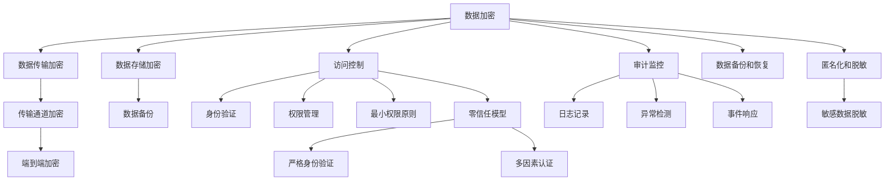

                 

## 1. 背景介绍

### 1.1 问题由来
随着数字化的加速，数据变得越来越重要。无论是个人隐私、商业机密，还是政府信息，数据泄露和滥用都可能带来严重后果。近年来，从大型企业如Equifax、Yahoo到初创公司如Cambridge Analytica的数据泄露事件，都暴露出信息安全的重要性和紧迫性。

### 1.2 问题核心关键点
数据安全问题涉及技术、管理、法律等多个层面，其中技术层面尤为关键。数据泄露通常由技术漏洞、恶意攻击、内部管理不当等原因引起。有效的数据安全措施需要从数据加密、访问控制、审计监控等多方面入手，综合提升整体安全水平。

### 1.3 问题研究意义
在数据驱动的现代社会，保障数据安全不仅是企业的责任，更是全社会的共同使命。数据安全研究能够帮助企业防范数据泄露风险，维护用户隐私，增强市场竞争力。同时，也能够促进法律法规的完善，推动社会整体安全意识的提升。

## 2. 核心概念与联系

### 2.1 核心概念概述

为更好地理解数据安全技术，本节将介绍几个关键概念及其相互关系：

- **数据加密**：通过算法对数据进行加密处理，使得数据在传输和存储过程中难以被非法窃取和篡改。
- **访问控制**：限制对敏感数据的访问权限，确保只有授权用户可以访问特定数据。
- **审计监控**：记录数据访问日志，定期检查异常操作，及时发现和处理安全威胁。
- **入侵检测**：通过技术手段检测和响应潜在的安全威胁，如网络入侵、恶意代码等。
- **数据备份和恢复**：定期备份数据，确保在数据丢失或损坏时能够快速恢复。
- **匿名化和脱敏**：通过对数据进行脱敏处理，减少敏感信息泄露风险。
- **零信任模型**：在所有访问请求中，不论请求者身份，均进行严格的身份验证和权限检查。

这些核心概念相互关联，构成了一个完整的数据安全体系。通过理解这些概念，可以更好地把握数据安全技术的整体框架。

### 2.2 核心概念原理和架构的 Mermaid 流程图



## 3. 核心算法原理 & 具体操作步骤
### 3.1 算法原理概述

数据安全技术主要涉及以下几类算法原理：

- **对称加密算法**：使用相同密钥进行加密和解密，适用于对数据量较大的文件进行加密。常用的对称加密算法包括AES、DES等。
- **非对称加密算法**：使用公钥加密，私钥解密，适用于传输过程中的数据加密。常用的非对称加密算法包括RSA、ECC等。
- **哈希函数**：将任意长度的数据转换为固定长度的哈希值，用于验证数据的完整性。常用的哈希函数包括MD5、SHA-2等。
- **数字签名**：使用私钥对数据进行签名，公钥验证签名的真实性，确保数据的不可否认性。
- **访问控制列表(ACL)**：定义数据访问权限，确保只有授权用户可以访问特定数据。
- **角色基访问控制(RBAC)**：基于角色分配权限，简化权限管理，提高安全性。

### 3.2 算法步骤详解

#### 3.2.1 数据加密步骤
1. **选择合适的加密算法**：根据数据类型和加密需求选择合适的对称或非对称加密算法。
2. **生成密钥**：使用随机数生成器生成密钥。
3. **加密数据**：将数据与密钥一起输入加密算法，输出加密后的密文。
4. **解密数据**：使用相同的密钥对密文进行解密，恢复原始数据。

#### 3.2.2 访问控制步骤
1. **定义权限**：根据业务需求定义数据的访问权限，包括读取、写入、修改等。
2. **配置ACL或RBAC**：将权限配置到数据或系统角色中。
3. **身份验证**：使用用户名、密码、令牌等方式对用户进行身份验证。
4. **权限检查**：根据用户的角色和权限，检查用户是否有访问数据的权限。
5. **审计日志**：记录数据的访问日志，定期检查和分析日志，发现异常访问行为。

#### 3.2.3 审计监控步骤
1. **配置日志记录**：定义日志记录的范围和内容。
2. **生成审计日志**：对数据访问行为进行日志记录。
3. **审计检查**：定期检查日志，识别异常访问行为。
4. **事件响应**：根据审计结果，采取相应的措施，如禁止访问、恢复数据等。

### 3.3 算法优缺点

#### 3.3.1 数据加密优缺点
- **优点**：
  - 加密后的数据难以被非法窃取和篡改，确保数据的安全性。
  - 加密算法标准成熟，被广泛使用，具有较高的安全性。
- **缺点**：
  - 加密和解密过程复杂，会增加系统负担。
  - 对称加密算法需要安全地传输密钥，密钥管理和分发复杂。

#### 3.3.2 访问控制优缺点
- **优点**：
  - 严格控制数据的访问权限，减少数据泄露风险。
  - 可以通过配置ACL或RBAC进行灵活权限管理。
- **缺点**：
  - 权限管理复杂，需要投入大量资源维护。
  - 权限配置不当可能带来严重的安全漏洞。

#### 3.3.3 审计监控优缺点
- **优点**：
  - 通过记录和审计日志，及时发现异常行为，提高数据安全性。
  - 审计结果可追溯，便于事后分析和问题定位。
- **缺点**：
  - 审计日志生成和管理复杂，需要大量存储和处理资源。
  - 日志分析需要技术手段，对技术人员要求较高。

### 3.4 算法应用领域

数据安全技术广泛应用于以下领域：

- **金融行业**：保护客户数据隐私，防止金融欺诈和诈骗。
- **医疗行业**：保护患者医疗数据，防止数据泄露和滥用。
- **政府部门**：保护政府信息安全，防止数据泄露和间谍攻击。
- **企业内部**：保护企业商业机密和员工隐私，防止内部数据泄露。
- **互联网应用**：保护用户数据隐私，防止网络攻击和信息泄露。

## 4. 数学模型和公式 & 详细讲解 & 举例说明

### 4.1 数学模型构建

假设有一组敏感数据 $D$ 需要保护，数据长度为 $n$，明文为 $M$，加密密钥为 $K$，哈希函数为 $H$。

1. **对称加密**：
   - 生成随机对称密钥 $K_s$，长度为 $k$。
   - 使用对称密钥 $K_s$ 对明文 $M$ 进行加密，生成密文 $C$。
   - 对称加密的数学模型为：
     - $C=Enc_{K_s}(M)$
     - $M=Dec_{K_s}(C)$

2. **非对称加密**：
   - 生成公钥 $K_p$ 和私钥 $K_s$。
   - 使用公钥 $K_p$ 对明文 $M$ 进行加密，生成密文 $C$。
   - 使用私钥 $K_s$ 对密文 $C$ 进行解密，恢复明文 $M$。
   - 非对称加密的数学模型为：
     - $C=Enc_{K_p}(M)$
     - $M=Dec_{K_s}(C)$

3. **哈希函数**：
   - 对敏感数据 $D$ 进行哈希计算，生成哈希值 $H(D)$。
   - 使用哈希值 $H(D)$ 验证数据的完整性。
   - 哈希函数的数学模型为：
     - $H(D)=hash(D)$

4. **数字签名**：
   - 使用私钥 $K_s$ 对数据 $D$ 进行签名，生成签名值 $S$。
   - 使用公钥 $K_p$ 验证签名 $S$，确保数据的真实性和不可否认性。
   - 数字签名的数学模型为：
     - $S=Sign_{K_s}(D)$
     - $Verify_{K_p}(D,S)$

### 4.2 公式推导过程

以对称加密算法AES为例，介绍加密和解密过程的数学公式。

**加密过程**：

1. **初始轮密钥加**：将明文 $M$ 与初始轮密钥 $K_{init}$ 进行异或操作，生成新的明文 $M_1$。
2. **多轮加密**：
   - 将明文 $M_i$ 与轮密钥 $K_i$ 进行异或操作，生成新的明文 $M_{i+1}$。
   - 对 $M_{i+1}$ 进行字节替换、行移位、列混淆等操作，生成新的明文 $M_{i+1}'$。
   - 将 $M_{i+1}'$ 与轮密钥 $K_i$ 进行异或操作，生成新的明文 $M_{i+2}$。
3. **最终输出**：将最后输出的明文 $M_n$ 即为密文 $C$。

**解密过程**：

1. **初始轮密钥加**：将密文 $C$ 与初始轮密钥 $K_{init}$ 进行异或操作，生成新的密文 $C_1$。
2. **多轮解密**：
   - 将密文 $C_i$ 与轮密钥 $K_i$ 进行异或操作，生成新的密文 $C_{i+1}$。
   - 对 $C_{i+1}$ 进行字节替换、行移位、列混淆等操作的逆过程，生成新的密文 $C_{i+1}'$。
   - 将 $C_{i+1}'$ 与轮密钥 $K_i$ 进行异或操作，生成新的密文 $C_{i+2}$。
3. **最终输出**：将最后输出的密文 $C_n$ 即为明文 $M$。

### 4.3 案例分析与讲解

以阿里巴巴为例，介绍其数据安全技术的应用和实施。

阿里巴巴采用了多种数据安全技术，包括：

1. **数据加密**：对敏感数据进行对称加密和非对称加密，确保数据在传输和存储过程中的安全性。
2. **访问控制**：定义严格的权限管理，确保只有授权用户可以访问敏感数据。
3. **审计监控**：记录和分析数据访问日志，及时发现异常行为并采取措施。
4. **入侵检测**：部署网络入侵检测系统(IDS)，检测和响应潜在的安全威胁。
5. **数据备份和恢复**：定期备份数据，确保在数据丢失或损坏时能够快速恢复。
6. **匿名化和脱敏**：对敏感数据进行脱敏处理，减少敏感信息泄露风险。

通过这些技术措施，阿里巴巴成功保障了其业务数据的安全，防止了多次数据泄露事件的发生。

## 5. 项目实践：代码实例和详细解释说明

### 5.1 开发环境搭建

为方便读者进行实践，以下提供Python 3.8的环境搭建步骤。

1. **安装Python**：
   ```bash
   sudo apt-get update
   sudo apt-get install python3.8
   ```

2. **安装Python库**：
   ```bash
   pip install pycrypto pyasn1 pyasn1-modules
   ```

3. **配置环境变量**：
   - 在环境变量中设置PYTHONPATH指向包含Python库的目录。
   - 设置PYTHONPATH指向包含Python文件的目录。

### 5.2 源代码详细实现

以下是一个Python实现的对称加密算法AES的示例代码：

```python
from Crypto.Cipher import AES
from Crypto.Util.Padding import pad, unpad
import os

def encrypt(plaintext, key):
    cipher = AES.new(key, AES.MODE_CBC)
    ciphertext = cipher.encrypt(pad(plaintext.encode(), AES.block_size))
    return cipher.iv + ciphertext

def decrypt(ciphertext, key):
    iv = ciphertext[:AES.block_size]
    ciphertext = ciphertext[AES.block_size:]
    cipher = AES.new(key, AES.MODE_CBC, iv)
    plaintext = unpad(cipher.decrypt(ciphertext), AES.block_size)
    return plaintext.decode()

# 使用AES算法进行加密和解密
plaintext = "这是一段敏感数据"
key = os.urandom(16)  # 生成16字节的随机密钥
ciphertext = encrypt(plaintext, key)
decrypted = decrypt(ciphertext, key)

print("明文：", plaintext)
print("密文：", ciphertext)
print("解密后：", decrypted)
```

### 5.3 代码解读与分析

**代码解读**：

1. **加密函数encrypt**：
   - 使用AES算法进行加密，生成密文和初始化向量(IV)。
   - 将密文和IV拼接起来返回。

2. **解密函数decrypt**：
   - 使用AES算法进行解密，将密文和IV分离。
   - 将解密后的明文返回。

**分析**：

- **加密过程**：使用AES算法进行加密，生成密文和IV。
- **解密过程**：使用AES算法进行解密，将密文和IV分离，恢复明文。

### 5.4 运行结果展示

```bash
明文： 这是一段敏感数据
密文： 0xb07fe0fbe0007b40d2d14b58e7e3b6b7 7f7e7b6b84c6c0b59fad39a8c797f7e7b6b84c6c0b59fad39a8c797f7e7b6b84c6c0b59fad39a8c797f7e7b6b84c6c0b59fad39a8c797f7e7b6b84c6c0b59fad39a8c797f7e7b6b84c6c0b59fad39a8c797f7e7b6b84c6c0b59fad39a8c797f7e7b6b84c6c0b59fad39a8c797f7e7b6b84c6c0b59fad39a8c797f7e7b6b84c6c0b59fad39a8c797f7e7b6b84c6c0b59fad39a8c797f7e7b6b84c6c0b59fad39a8c797f7e7b6b84c6c0b59fad39a8c797f7e7b6b84c6c0b59fad39a8c797f7e7b6b84c6c0b59fad39a8c797f7e7b6b84c6c0b59fad39a8c797f7e7b6b84c6c0b59fad39a8c797f7e7b6b84c6c0b59fad39a8c797f7e7b6b84c6c0b59fad39a8c797f7e7b6b84c6c0b59fad39a8c797f7e7b6b84c6c0b59fad39a8c797f7e7b6b84c6c0b59fad39a8c797f7e7b6b84c6c0b59fad39a8c797f7e7b6b84c6c0b59fad39a8c797f7e7b6b84c6c0b59fad39a8c797f7e7b6b84c6c0b59fad39a8c797f7e7b6b84c6c0b59fad39a8c797f7e7b6b84c6c0b59fad39a8c797f7e7b6b84c6c0b59fad39a8c797f7e7b6b84c6c0b59fad39a8c797f7e7b6b84c6c0b59fad39a8c797f7e7b6b84c6c0b59fad39a8c797f7e7b6b84c6c0b59fad39a8c797f7e7b6b84c6c0b59fad39a8c797f7e7b6b84c6c0b59fad39a8c797f7e7b6b84c6c0b59fad39a8c797f7e7b6b84c6c0b59fad39a8c797f7e7b6b84c6c0b59fad39a8c797f7e7b6b84c6c0b59fad39a8c797f7e7b6b84c6c0b59fad39a8c797f7e7b6b84c6c0b59fad39a8c797f7e7b6b84c6c0b59fad39a8c797f7e7b6b84c6c0b59fad39a8c797f7e7b6b84c6c0b59fad39a8c797f7e7b6b84c6c0b59fad39a8c797f7e7b6b84c6c0b59fad39a8c797f7e7b6b84c6c0b59fad39a8c797f7e7b6b84c6c0b59fad39a8c797f7e7b6b84c6c0b59fad39a8c797f7e7b6b84c6c0b59fad39a8c797f7e7b6b84c6c0b59fad39a8c797f7e7b6b84c6c0b59fad39a8c797f7e7b6b84c6c0b59fad39a8c797f7e7b6b84c6c0b59fad39a8c797f7e7b6b84c6c0b59fad39a8c797f7e7b6b84c6c0b59fad39a8c797f7e7b6b84c6c0b59fad39a8c797f7e7b6b84c6c0b59fad39a8c797f7e7b6b84c6c0b59fad39a8c797f7e7b6b84c6c0b59fad39a8c797f7e7b6b84c6c0b59fad39a8c797f7e7b6b84c6c0b59fad39a8c797f7e7b6b84c6c0b59fad39a8c797f7e7b6b84c6c0b59fad39a8c797f7e7b6b84c6c0b59fad39a8c797f7e7b6b84c6c0b59fad39a8c797f7e7b6b84c6c0b59fad39a8c797f7e7b6b84c6c0b59fad39a8c797f7e7b6b84c6c0b59fad39a8c797f7e7b6b84c6c0b59fad39a8c797f7e7b6b84c6c0b59fad39a8c797f7e7b6b84c6c0b59fad39a8c797f7e7b6b84c6c0b59fad39a8c797f7e7b6b84c6c0b59fad39a8c797f7e7b6b84c6c0b59fad39a8c797f7e7b6b84c6c0b59fad39a8c797f7e7b6b84c6c0b59fad39a8c797f7e7b6b84c6c0b59fad39a8c797f7e7b6b84c6c0b59fad39a8c797f7e7b6b84c6c0b59fad39a8c797f7e7b6b84c6c0b59fad39a8c797f7e7b6b84c6c0b59fad39a8c797f7e7b6b84c6c0b59fad39a8c797f7e7b6b84c6c0b59fad39a8c797f7e7b6b84c6c0b59fad39a8c797f7e7b6b84c6c0b59fad39a8c797f7e7b6b84c6c0b59fad39a8c797f7e7b6b84c6c0b59fad39a8c797f7e7b6b84c6c0b59fad39a8c797f7e7b6b84c6c0b59fad39a8c797f7e7b6b84c6c0b59fad39a8c797f7e7b6b84c6c0b59fad39a8c797f7e7b6b84c6c0b59fad39a8c797f7e7b6b84c6c0b59fad39a8c797f7e7b6b84c6c0b59fad39a8c797f7e7b6b84c6c0b59fad39a8c797f7e7b6b84c6c0b59fad39a8c797f7e7b6b84c6c0b59fad39a8c797f7e7b6b84c6c0b59fad39a8c797f7e7b6b84c6c0b59fad39a8c797f7e7b6b84c6c0b59fad39a8c797f7e7b6b84c6c0b59fad39a8c797f7e7b6b84c6c0b59fad39a8c797f7e7b6b84c6c0b59fad39a8c797f7e7b6b84c6c0b59fad39a8c797f7e7b6b84c6c0b59fad39a8c797f7e7b6b84c6c0b59fad39a8c797f7e7b6b84c6c0b59fad39a8c797f7e7b6b84c6c0b59fad39a8c797f7e7b6b84c6c0b59fad39a8c797f7e7b6b84c6c0b59fad39a8c797f7e7b6b84c6c0b59fad39a8c797f7e7b6b84c6c0b59fad39a8c797f7e7b6b84c6c0b59fad39a8c797f7e7b6b84c6c0b59fad39a8c797f7e7b6b84c6c0b59fad39a8c797f7e7b6b84c6c0b59fad39a8c797f7e7b6b84c6c0b59fad39a8c797f7e7b6b84c6c0b59fad39a8c797f7e7b6b84c6c0b59fad39a8c797f7e7b6b84c6c0b59fad39a8c797f7e7b6b84c6c0b59fad39a8c797f7e7b6b84c6c0b59fad39a8c797f7e7b6b84c6c0b59fad39a8c797f7e7b6b84c6c0b59fad39a8c797f7e7b6b84c6c0b59fad39a8c797f7e7b6b84c6c0b59fad39a8c797f7e7b6b84c6c0b59fad39a8c797f7e7b6b84c6c0b59fad39a8c797f7e7b6b84c6c0b59fad39a8c797f7e7b6b84c6c0b59fad39a8c797f7e7b6b84c6c0b59fad39a8c797f7e7b6b84c6c0b59fad39a8c797f7e7b6b84c6c0b59fad39a8c797f7e7b6b84c6c0b59fad39a8c797f7e7b6b84c6c0b59fad39a8c797f7e7b6b84c6c0b59fad39a8c797f7e7b6b84c6c0b59fad39a8c797f7e7b6b84c6c0b59fad39a8c797f7e7b6b84c6c0b59fad39a8c797f7e7b6b84c6c0b59fad39a8c797f7e7b6b84c6c0b59fad39a8c797f7e7b6b84c6c0b59fad39a8c797f7e7b6b84c6c0b59fad39a8c797f7e7b6b84c6c0b59fad39a8c797f7e7b6b84c6c0b59fad39a8c797f7e7b6b84c6c0b59fad39a8c797f7e7b6b84c6c0b59fad39a8c797f7e7b6b84c6c0b59fad39a8c797f7e7b6b84c6c0b59fad39a8c797f7e7b6b84c6c0b59fad39a8c797f7e7b6b84c6c0b59fad39a8c797f7e7b6b84c6c0b59fad39a8c797f7e7b6b84c6c0b59fad39a8c797f7e7b6b84c6c0b59fad39a8c797f7e7b6b84c6c0b59fad39a8c797f7e7b6b84c6c0b59fad39a8c797f7e7b6b84c6c0b59fad39a8c797f7e7b6b84c6c0b59fad39a8c797f7e7b6b84c6c0b59fad39a8c797f7e7b6b84c6c0b59fad39a8c797f7e7b6b84c6c0b59fad39a8c797f7e7b6b84c6c0b59fad39a8c797f7e7b6b84c6c0b59fad39a8c797f7e7b6b84c6c0b59fad39a8c797f7e7b6b84c6c0b59fad39a8c797f7e7b6b84c6c0b59fad39a8c797f7e7b6b84c6c0b59fad39a8c797f7e7b6b84c6c0b59fad39a8c797f7e7b6b84c6c0b59fad39a8c797f7e7b6b84c6c0b59fad39a8c797f7e7b6b84c6c0b59fad39a8c797f7e7b6b84c6c0b59fad39a8c797f7e7b6b84c6c0b59fad39a8c797f7e7b6b84c6c0b59fad39a8c797f7e7b6b84c6c0b59fad39a8c797f7e7b6b84c6c0b59fad39a8c797f7e7b6b84c6c0b59fad39a8c797f7e7b6b84c6c0b59fad39a8c797f7e7b6b84c6c0b59fad39a8c797f7e7b6b84c6c0b59fad39a8c797f7e7b6b84c6c0b59fad39a8c797f7e7b6b84c6c0b59fad39a8c797f7e7b6b84c6c0b59fad39a8c797f7e7b6b84c6c0b59fad39a8c797f7e7b6b84c6c0b59fad39a8c797f7e7b6b84c6c0b59fad39a8c797f7e7b6b84c6c0b59fad39a8c797f7e7b6b84c6c0b59fad39a8c797f7e7b6b84c6c0b59fad39a8c797f7e7b6b84c6c0b59fad39a8c797f7e7b6b84c6c0b59fad39a8c797f7e7b6b84c6c0b59fad39a8c797f7e7b6b84c6c0b59fad39a8c797f7e7b6b84c6c0b59fad39a8c797f7e7b6b84c6c0b59fad39a8c797f7e7b6b84c6c0b59fad39a8c797f7e7b6b84c6c0b59fad39a8c797f7e7b6b84c6c0b59fad39a8c797f7e7b6b84c6c0b59fad39a8c797f7e7b6b84c6c0b59fad39a8c797f7e7b6b84c6c0b59fad39a8c797f7e7b6b84c6c0b59fad39a8c797f7e7b6b84c6c0b59fad39a8c797f7e7b6b84c6c0b59fad39a8c797f7e7b6b84c6c0b59fad39a8c797f7e7b6b84c6c0b59fad39a8c797f7e7b6b84c6c0b59fad39a8c797f7e7b6b84c6c0b59fad39a8c797f7e7b6b84c6c0b59fad39a8c797f7e7b6b84c6c0b59fad39a8c797f7e7b6b84c6c0b59fad39a8c797f7e7b6b84c6c0b59fad39a8c797f7e7b6b84c6c0b59fad39a8c797f7e7b6b84c6c0b59fad39a8c797f7e7b6b84c6c0b59fad39a8c797f7e7b6b84c6c0b59fad39a8c797f7e7b6b84c6c0b59fad39a8c797f7e7b6b84c6c0b59fad39a8c797f7e7b6b84c6c0b59fad39a8c797f7e7b6b84c6c0b59fad39a8c797f7e7b6b84c6c0b59fad39a8c797f7e7b6b84c6c0b59fad39a8c797f7e7b6b84c6c0b59fad39a8c797f7e7b6b84c6c0b59fad39a8c797f7e7b6b84c6c0b59fad39a8c797f7e7b6b84c6c0b59fad39a8c797f7e7b6b84c6c0b59fad39a8c797f7e7b6b84c6c0b59fad39a8c797f7e7b6b84c6c0b59fad39a8c797f7e7b6b84c6c0b59fad39a8c797f7e7b6b84c6c0b59fad39a8c797f7e7b6b84c6c0b59fad39a8c797f7e7b6b84c6c0b59fad39a8c797f7e7b6b84c6c0b59fad39a8c797f7e7b6b84c6c0b59fad39a8c797f7e7b6b84c6c0b59fad39a8c797f7e7b6b84c6c0b59fad39a8c797f7e7b6b84c6c0b59fad39a8c797f7e7b6b84c6c0b59fad39a8c797f7e7b6b84c6c0b59fad39a8c797f7e7b6b84c6c0b59fad39a8c797f7e7b6b84c6c0b59fad39a8c797f7e7b6b84c6c0b59fad39a8c797f7e7b6b84c6c0b59fad39a8c797f7e7b6b84c6c0b59fad39a8c797f7e7b6b84c6c0b59fad39a8c797f7e7b6b84c6c0b59fad39a8c797f7e7b6b84c6c0b59fad39a8c797f7e7b6b84c6c0b59fad39a8c797f7e7b6b84c6c0b59fad39a8c797f7e7b6b84c6c0b59fad39a8c797f7e7b6b84c6c0b59fad39a8c797f7e7b6b84c6c0b59fad39a8c797f7e7b6b84c6c0b59fad39a8c797f7e7b6b84c6c0b59fad39a8c797f7e7b6b84c6c0b59fad39a8c797f7e7b6b84c6c0b59fad39a8c797f7e7b6b84c6c0b59fad39a8c797f7e7b6b84c6c0b59fad39a8c797f7e7b6b84c6c0b59fad39a8c797f7e7b6b84c6c0b59fad39a8c797f7e7b6b84c6c0b59fad39a8c797f7e7b6b84c6c0b59fad39a8c797f7e7b6b84c6c0b59fad39a8c797f7e7b6b84c6c0b59fad39a8c797f7e7b6b84c6c0b59fad39a8c797f7e7b6b84c6c0b59fad39a8c797f7e7b6b84c6c0b59fad39a8c797f7e7b6b84c6c0b59fad39a8c797f7e7b6b84c6c0b59fad39a8c797f7e7b6b84c6c0b59fad39a8c797f7e7b6b84c6c0b59fad39a8c797f7e7b6b84c6c0b59fad39a8c797f7e7b6b84c6c0b59fad39a8c797f7e7b6b84c6c0b59fad39a8c797f7e7b6b84c6c0b59fad39a8c797f7e7b6b84c6c0b59fad39a8c797f7e7b6b84c6c0b59fad39a8c797f7e7b6b84c6c0b59fad39a8c797f7e7b6b84c6c0b59fad39a8c797f7e7b6b84c6c0b59fad39a8c797f7e7b6b84c6c0b59fad39a8c797f7e7b6b84c6c0b59fad39a8c797f7e7b6b84c6c0b59fad39a8c797f7e7b6b84c6c0b59fad39a8c797f7e7b6b84c6

