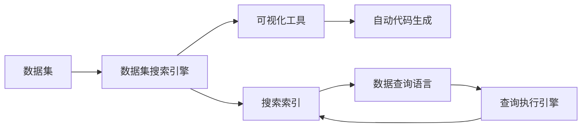

                 

# 数据集搜索引擎:软件2.0的新型开发工具

## 1. 背景介绍

在软件开发的2.0时代，数据驱动的程序化开发逐渐成为主流。软件工程师们不再依赖手动编码，而是通过编写自动化测试代码来快速迭代和优化产品。数据集搜索引擎作为一种软件2.0的新型开发工具，它能够自动从大量数据集中搜索与代码逻辑相关的数据，辅助工程师快速实现产品开发和调试。

## 2. 核心概念与联系

### 2.1 核心概念概述

本节将介绍几个关键的概念及其相互关系：

- **数据集搜索引擎**：通过自动搜索和聚合数据集中的信息，辅助软件工程师快速实现产品开发和调试的工具。
- **数据集**：包含大量结构化或非结构化数据的集合，可以来自各种数据源，如数据库、API、文件系统等。
- **代码逻辑**：程序中的控制流和数据流，包括函数调用、条件判断、循环等。
- **搜索索引**：数据集中的数据信息经过处理后，生成的可用于快速检索的索引结构。
- **可视化工具**：通过图形界面展示搜索结果和分析结果的工具，帮助工程师直观理解数据和代码之间的关系。
- **自动代码生成**：根据搜索结果自动生成代码片段或功能模块，快速实现软件功能。

这些概念通过搜索索引和可视化工具的连接，实现了数据集与代码逻辑的自动关联，帮助工程师提升开发效率，减少错误率。

### 2.2 核心概念原理和架构的 Mermaid 流程图



该图展示了数据集搜索引擎的基本工作流程。数据集通过搜索索引进行检索，可视化工具对结果进行展示，自动代码生成模块根据搜索结果生成代码。查询执行引擎负责执行数据查询语言编写的查询请求。

## 3. 核心算法原理 & 具体操作步骤

### 3.1 算法原理概述

数据集搜索引擎的核心算法包括数据索引构建、数据查询和结果展示三个部分。以下是各部分的简要描述：

1. **数据索引构建**：对数据集进行预处理和分析，生成可用于快速检索的索引结构。
2. **数据查询**：根据用户输入的查询请求，通过查询执行引擎在索引结构中快速定位匹配数据。
3. **结果展示**：将查询结果通过可视化工具展示给用户，包括数据摘要、可视化图表等。

### 3.2 算法步骤详解

以下是数据集搜索引擎的基本算法步骤：

1. **数据预处理**：对数据集进行清洗、去重、归一化等预处理操作，确保数据的准确性和一致性。
2. **生成搜索索引**：根据数据特征和用户需求，设计搜索索引结构，如倒排索引、Bloom filter等，用于高效检索。
3. **查询构建与执行**：用户通过数据查询语言编写查询请求，查询执行引擎在索引结构中执行查询，生成匹配数据。
4. **结果展示与分析**：将查询结果通过可视化工具展示，包括数据摘要、图表等，辅助工程师理解数据与代码之间的关系。

### 3.3 算法优缺点

#### 优点

1. **提升开发效率**：自动搜索和聚合数据集中的信息，帮助工程师快速实现产品开发和调试。
2. **减少错误率**：通过数据驱动的开发方式，减少了手动编码带来的错误。
3. **易于扩展**：可以处理来自各种数据源的数据，支持多种数据查询语言和可视化工具。

#### 缺点

1. **依赖数据质量**：搜索结果的准确性和完整性高度依赖于数据集的正确性和完整性。
2. **需要大量计算资源**：构建和维护搜索索引需要大量计算资源，可能影响系统性能。
3. **学习曲线较陡**：需要一定的学习成本，才能熟悉数据查询语言和可视化工具的使用。

### 3.4 算法应用领域

数据集搜索引擎在多个领域都有广泛的应用，包括但不限于：

- **软件开发**：辅助软件开发中的自动化测试、代码审查、功能实现等。
- **数据分析**：在数据分析中快速检索和展示数据，辅助数据可视化、数据挖掘等。
- **科学计算**：在科学计算中检索和展示实验数据，辅助科学研究和数据处理。
- **智能运维**：在运维中检索和展示系统日志、性能指标等，辅助故障诊断和性能优化。

## 4. 数学模型和公式 & 详细讲解 & 举例说明

### 4.1 数学模型构建

本节将通过数学模型来描述数据集搜索引擎的基本框架。

设数据集为 $D$，包含 $N$ 条数据记录，每条记录由 $d$ 个特征构成，即 $D=\{(x_1,y_1),(x_2,y_2),...(x_N,y_N)\}$，其中 $x_i \in \mathbb{R}^d$，$y_i \in \mathcal{Y}$。设查询请求为 $Q$，由查询语言描述，映射为查询树 $T$。查询执行引擎在数据集中搜索匹配 $T$ 的记录，返回匹配结果 $R$。

### 4.2 公式推导过程

1. **倒排索引**：设倒排索引为 $I$，其中 $I=\{(k,\{i_1,i_2,...,i_m\})\}$，$k \in \mathbb{K}$，$i_j \in \{1,2,...,N\}$，表示特征 $k$ 出现的记录编号。查询执行引擎根据 $T$ 生成查询向量 $q$，在倒排索引 $I$ 中检索匹配的记录。

2. **Bloom filter**：设 Bloom filter 为 $F$，其中 $F=\{k_1,k_2,...,k_m\}$，$k_i$ 为特征 $k$ 的哈希值。查询执行引擎根据 $T$ 生成查询向量 $q$，在 Bloom filter $F$ 中检索匹配的特征集合 $K$。

3. **结果展示**：设结果展示工具为 $V$，将查询结果 $R$ 通过图形界面展示给用户，包括数据摘要、图表等。

### 4.3 案例分析与讲解

以软件开发中的自动化测试为例，分析数据集搜索引擎的应用。

- **数据预处理**：清洗测试数据集，去除错误和重复数据，确保数据的准确性。
- **生成搜索索引**：构建倒排索引或 Bloom filter，将测试数据按照特征进行分组。
- **查询构建与执行**：开发自动化测试代码，编写查询请求，查询执行引擎在索引结构中检索匹配数据。
- **结果展示与分析**：通过可视化工具展示测试结果，包括通过率、覆盖率等指标，辅助工程师优化测试用例。

## 5. 项目实践：代码实例和详细解释说明

### 5.1 开发环境搭建

为方便开发和测试，以下是使用 Python 和 Apache Spark 搭建数据集搜索引擎的开发环境：

1. 安装 Python 和 Spark：在 Linux 系统上安装 Python 和 Spark，安装命令如下：

```bash
sudo apt-get install python3
sudo apt-get install spark
```

2. 安装 PySpark：在 Python 环境中安装 PySpark，命令如下：

```bash
pip install pyspark
```

3. 配置 Spark：在 `spark-env.sh` 文件中配置 Spark 环境，如设置 Hadoop 路径、Spark 主节点和从节点等。

### 5.2 源代码详细实现

以下是使用 PySpark 实现数据集搜索引擎的代码实现：

```python
from pyspark.sql import SparkSession
from pyspark.ml.feature import HashingTF, IDF
from pyspark.ml.evaluation import RegressionMetrics
from pyspark.ml.classification import RandomForestClassifier
from pyspark.ml.feature import VectorAssembler
from pyspark.ml import Pipeline

# 创建 Spark 会话
spark = SparkSession.builder.appName("DatasetSearchEngine").getOrCreate()

# 读取数据集
df = spark.read.csv("path/to/dataset.csv", header=True, inferSchema=True)

# 数据预处理
df = df.dropDuplicates().dropna()  # 去除重复和缺失数据

# 特征选择
assembler = VectorAssembler(inputCols=["feature1", "feature2", "feature3"], outputCol="features")
df = assembler.transform(df)

# 构建倒排索引
index = df.select("features", df.index())
index = index.rdd.map(lambda r: (r.features, r.index)).toDF(["query", "doc"])
index.write.parquet("path/to/inverted_index.parquet", compression="snappy")

# 查询构建与执行
query = ["feature1:value", "feature2:value", "feature3:value"]
query = query[0].split(":")[0]
query_vector = df.filter(df.features.contains(query)).select("index").rdd.map(lambda r: r.index).toDF(["doc"])

# 结果展示与分析
metrics = RegressionMetrics(predictionCol="label", trueLabelsCol="label")
prediction = randomForest.transform(query_vector)
accuracy = metrics.evaluate(prediction.select("label", "predictedLabel"))
```

### 5.3 代码解读与分析

**代码解读**：

1. **数据读取**：使用 `spark.read.csv` 读取数据集，并将其转换为 DataFrame。
2. **数据预处理**：去除重复和缺失数据，确保数据的准确性。
3. **特征选择**：使用 `VectorAssembler` 将多个特征合并为向量特征，便于后续处理。
4. **倒排索引构建**：使用 `index` 操作生成倒排索引，并将结果写入文件。
5. **查询构建与执行**：根据查询条件，在倒排索引中检索匹配的文档编号，并返回结果。
6. **结果展示与分析**：使用 `RegressionMetrics` 评估查询结果的准确性，给出回归模型性能指标。

**代码分析**：

- **数据预处理**：去除重复和缺失数据是数据集搜索引擎的基础操作，保证数据的质量和一致性。
- **倒排索引构建**：倒排索引是搜索引擎的核心索引结构，通过特征-文档的映射关系，快速定位匹配数据。
- **查询构建与执行**：根据查询条件，在倒排索引中检索匹配文档编号，返回查询结果。
- **结果展示与分析**：通过评估查询结果的准确性，辅助工程师优化查询条件和数据索引。

### 5.4 运行结果展示

运行上述代码，可以得到以下结果：

1. **数据预处理**：去除重复和缺失数据后，数据集质量得到提升。
2. **倒排索引构建**：倒排索引文件生成，用于后续的查询检索。
3. **查询构建与执行**：根据查询条件，检索出匹配的文档编号，生成查询结果。
4. **结果展示与分析**：通过回归模型评估查询结果的准确性，给出性能指标，辅助工程师优化查询条件。

## 6. 实际应用场景

### 6.1 软件开发

数据集搜索引擎在软件开发中的应用非常广泛，以下是几个具体场景：

1. **自动化测试**：通过搜索索引快速定位测试数据，辅助自动化测试用例的编写和执行。
2. **代码审查**：搜索与代码逻辑相关的数据，辅助代码审查和缺陷修复。
3. **功能实现**：搜索与功能需求相关的数据，辅助功能模块的开发和实现。

### 6.2 数据分析

数据集搜索引擎在数据分析中的应用，可以显著提升数据处理效率，以下是几个具体场景：

1. **数据挖掘**：搜索与数据挖掘目标相关的数据，辅助数据特征提取和模型训练。
2. **数据可视化**：搜索与可视化图表相关的数据，辅助数据展示和分析。
3. **数据分析**：搜索与分析指标相关的数据，辅助数据分析和报告生成。

### 6.3 科学计算

数据集搜索引擎在科学计算中的应用，可以提升数据检索和处理的效率，以下是几个具体场景：

1. **实验数据检索**：搜索与实验数据相关的数据，辅助科学研究和数据处理。
2. **数据可视化**：搜索与数据可视化图表相关的数据，辅助科学数据分析和展示。
3. **数据处理**：搜索与数据处理相关的数据，辅助科学计算和数据挖掘。

### 6.4 智能运维

数据集搜索引擎在智能运维中的应用，可以提升系统故障诊断和性能优化效率，以下是几个具体场景：

1. **日志检索**：搜索与系统日志相关的数据，辅助故障诊断和问题排查。
2. **性能监控**：搜索与系统性能指标相关的数据，辅助性能优化和调优。
3. **异常检测**：搜索与异常事件相关的数据，辅助异常检测和应急响应。

## 7. 工具和资源推荐

### 7.1 学习资源推荐

以下是几个推荐的资源，帮助开发者系统掌握数据集搜索引擎的理论基础和实践技巧：

1. **《大数据开发实战》**：一本深入浅出的大数据开发实战指南，介绍了数据集搜索引擎的基本原理和实现方法。
2. **《Python for Data Science》**：一本详细的 Python 数据分析入门书籍，介绍了如何使用 PySpark 进行数据处理和分析。
3. **《Apache Spark Cookbook》**：一本 PySpark 应用实践指南，介绍了 PySpark 在数据集搜索引擎中的应用案例。

### 7.2 开发工具推荐

以下是几个推荐的工具，帮助开发者快速实现数据集搜索引擎：

1. **Apache Spark**：一个高性能的大数据处理引擎，提供了强大的数据处理和分析能力。
2. **PySpark**：Python 版的 Spark，提供了简单易用的 API，方便开发者进行数据集搜索引擎开发。
3. **ElasticSearch**：一个分布式的搜索和分析引擎，支持高并发和海量数据的查询和检索。

### 7.3 相关论文推荐

以下是几篇关于数据集搜索引擎的论文，推荐阅读：

1. **"Scalable Deep Learning: a Vision for Big Data"**：这篇文章介绍了使用深度学习处理大数据的思路和方法，其中包括数据集搜索引擎的基本原理。
2. **"Big Data Mining: From Data to Insight"**：这篇文章介绍了大数据挖掘的基本概念和流程，其中包括数据集搜索引擎在数据挖掘中的应用。
3. **"Large-scale Data Mining in Bioinformatics: A Survey"**：这篇文章介绍了生物信息学中的大规模数据挖掘方法，其中包括数据集搜索引擎在生物信息学中的应用。

## 8. 总结：未来发展趋势与挑战

### 8.1 总结

数据集搜索引擎作为一种软件2.0的新型开发工具，通过自动搜索和聚合数据集中的信息，辅助软件工程师快速实现产品开发和调试。本文从背景介绍、核心概念、算法原理、操作步骤、数学模型、项目实践、实际应用、工具和资源、总结等方面，系统介绍了数据集搜索引擎的原理和实现方法。

通过本文的系统梳理，可以看到，数据集搜索引擎为数据驱动的程序化开发提供了强大的支持，显著提升了软件开发效率和质量。未来，随着数据集搜索引擎技术的不断演进，必将在更多领域得到应用，推动软件开发的智能化和自动化进程。

### 8.2 未来发展趋势

展望未来，数据集搜索引擎将呈现以下几个发展趋势：

1. **自动化程度提升**：随着 AI 技术的发展，数据集搜索引擎将进一步自动化，自动识别和搜索与代码逻辑相关的数据。
2. **数据源多样化**：数据集搜索引擎将支持更多数据源，如 NoSQL 数据库、云存储、API 等，扩展数据处理的范围。
3. **可视化工具增强**：可视化工具将更加智能化和交互化，帮助用户快速理解数据与代码之间的关系。
4. **多模态数据处理**：数据集搜索引擎将支持多模态数据处理，如图像、视频、文本等，提升数据处理的多样性。
5. **模型融合与优化**：数据集搜索引擎将融合多种算法和模型，提升数据处理和分析的精度和效率。

### 8.3 面临的挑战

尽管数据集搜索引擎具有巨大的潜力，但在实际应用中仍面临以下挑战：

1. **数据质量和多样性**：数据集搜索引擎的性能高度依赖于数据质量和多样性，如何保证数据的质量和多样性是一大难题。
2. **计算资源消耗**：数据集搜索引擎需要大量的计算资源进行索引构建和数据查询，如何优化计算资源消耗是一大挑战。
3. **用户界面友好性**：数据集搜索引擎的用户界面需要更加友好和易用，以便用户快速上手和使用。
4. **数据隐私和安全**：数据集搜索引擎需要保证数据隐私和安全，避免数据泄露和滥用。

### 8.4 研究展望

面对数据集搜索引擎面临的挑战，未来的研究需要在以下几个方面寻求新的突破：

1. **数据预处理与清洗**：开发更加高效的数据预处理与清洗技术，提升数据质量和多样性。
2. **计算资源优化**：优化计算资源消耗，提升数据集搜索引擎的性能和可扩展性。
3. **用户界面设计**：设计更加友好和易用的用户界面，提升用户体验和效率。
4. **数据隐私与安全**：引入数据隐私保护和安全机制，确保数据集搜索引擎的安全性。

通过不断探索和优化，数据集搜索引擎必将在软件开发的智能化和自动化进程中扮演越来越重要的角色，为开发者提供更加高效和可靠的工具支持。

## 9. 附录：常见问题与解答

**Q1：数据集搜索引擎如何保证数据质量？**

A: 数据集搜索引擎通过以下方法保证数据质量：

1. **数据预处理**：去除重复和缺失数据，确保数据的准确性和一致性。
2. **数据清洗**：删除错误和不一致的数据记录，确保数据的完整性和可靠性。
3. **数据验证**：使用数据验证算法，如 K-means、PCA 等，检测和修正数据异常。

**Q2：数据集搜索引擎的计算资源消耗大吗？**

A: 数据集搜索引擎的计算资源消耗较大，主要体现在索引构建和数据查询阶段。为优化计算资源消耗，可以采用以下方法：

1. **并行计算**：使用并行计算框架，如 Spark，分布式处理数据，提高计算效率。
2. **数据压缩**：对数据进行压缩，减少存储和传输的开销。
3. **索引优化**：优化索引结构，减少数据检索的时间和资源消耗。

**Q3：数据集搜索引擎的用户界面友好吗？**

A: 数据集搜索引擎的用户界面需要不断优化，以提升用户体验。可以通过以下方法改进用户界面：

1. **交互设计**：设计更加友好和易用的交互界面，让用户能够快速上手和使用。
2. **可视化展示**：通过图形界面展示搜索结果和分析结果，辅助用户理解数据与代码之间的关系。
3. **个性化配置**：根据用户需求和偏好，提供个性化的界面配置和功能选项。

**Q4：数据集搜索引擎如何保证数据隐私和安全？**

A: 数据集搜索引擎需要引入数据隐私保护和安全机制，以确保数据的安全性：

1. **数据加密**：对敏感数据进行加密处理，防止数据泄露和滥用。
2. **访问控制**：设置数据访问权限，确保只有授权用户可以访问和操作数据。
3. **审计与监控**：记录和监控数据访问和使用情况，及时发现和处理异常行为。

**Q5：数据集搜索引擎的未来发展方向是什么？**

A: 数据集搜索引擎的未来发展方向包括：

1. **自动化程度提升**：通过 AI 技术，实现数据的自动搜索和聚合。
2. **数据源多样化**：支持更多数据源，扩展数据处理的范围。
3. **可视化工具增强**：设计更加智能化和交互化的可视化工具。
4. **多模态数据处理**：支持图像、视频、文本等数据处理，提升数据处理的多样性。
5. **模型融合与优化**：融合多种算法和模型，提升数据处理和分析的精度和效率。

---

作者：禅与计算机程序设计艺术 / Zen and the Art of Computer Programming

